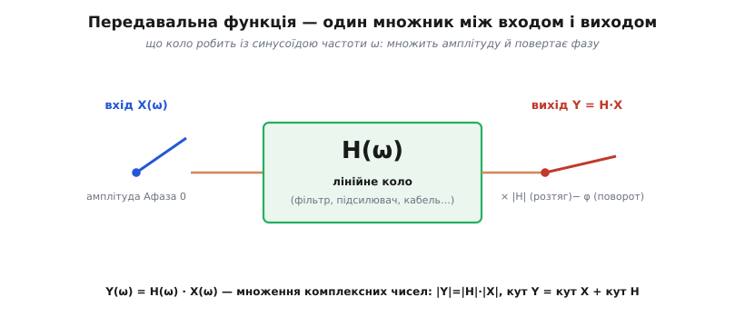
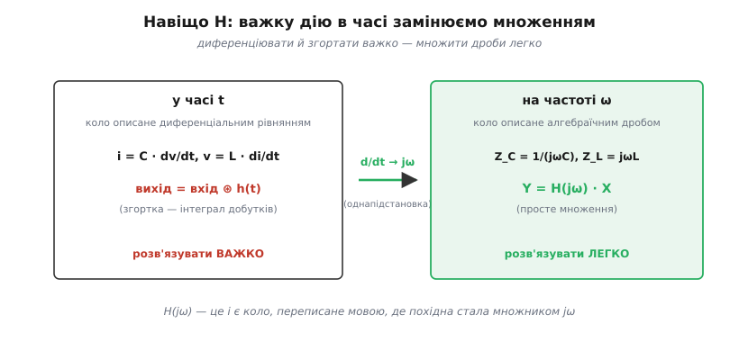
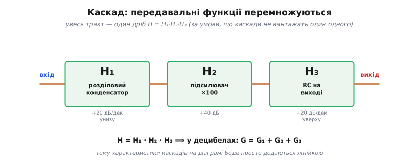

# Передавальна функція: усе коло — одне число на кожну частоту

Уявіть, що вам дали коробку з кількох резисторів, конденсаторів і котушок, з'єднаних усередині як завгодно, і запитали: що вона зробить із сигналом, який ви подасте на вхід? Здавалося б, відповідь залежить від форми сигналу — для синусоїди одна, для меандра інша, для запису голосу третя. І щоб дізнатися кожну, доведеться щоразу заново розв'язувати рівняння всього кола. Це жахлива перспектива: рівнянь багато, вони з похідними, а сигналів — нескінченно.

Виявляється, виходу немає лише на перший погляд. Існує **одна функція**, яка вичерпно описує цю коробку — раз і назавжди, для будь-якого сигналу. Знаючи її, ви більше нічого не розв'язуєте: ви просто **множите**. Ця функція зветься **передавальною** (бо описує, як коло *передає* сигнал зі входу на вихід; англ. *transfer function*), і вся ця стаття — про те, чому така чарівна річ узагалі можлива і як нею користуватися.

### Дві умови, на яких тримається вся магія

Передавальна функція існує не для будь-якого кола, а лише там, де виконано дві властивості. Вони здаються технічними, але саме вони роблять усе подальше можливим, тож варто їх відчути, а не завчити.

Перша — **лінійність**. Коло лінійне, якщо подвоєння входу подвоює вихід, а сума двох входів дає суму двох відповідних виходів. Резистор, конденсатор, котушка — лінійні: струм у них пропорційний напрузі (чи її похідній). Така пропорційність дає неоціненний дарунок — [принцип суперпозиції](book:electronics/superposition): відгук кола на суміш сигналів дорівнює сумі відгуків на кожен складник окремо. Складники не заважають один одному; коло обробляє кожен так, ніби решти немає.

> 🔧 **Навіщо це.** Лінійність — не математична формальність, а межа, за якою передавальна функція перестає існувати. Діод, насичена котушка чи перевантажений підсилювач — нелінійні: вони народжують на виході частоти, яких на вході не було. Для них «одне число на частоту» не складається, бо частоти всередині починають взаємодіяти. Тому перше питання інженера про будь-яку коробку: вона ще лінійна — чи вже ні?

Друга умова — синусоїда як особлива форма. У лінійному колі синусоїда лишається **синусоїдою тієї самої частоти** — коло може лише змінити її амплітуду й зсунути фазу, але не спотворити форму й не породити нових частот. Це наріжний факт усього [аналізу кіл на змінному струмі](book:electronics/frequency-response): синус — «власна форма» лінійних кіл, єдина, що проходить крізь них незмінною по суті.

Складімо два дарунки разом. Будь-який сигнал розкладається на суму синусоїд (це робить розклад Фур'є). Кожна синусоїда проходить крізь коло незалежно від інших (суперпозиція), і коло міняє в ній лише дві речі — амплітуду й фазу. Отже, щоб знати дію кола на *будь-який* сигнал, досить знати, що воно робить із *кожною окремою частотою*. А це — рівно два числа на частоту.

### Два числа зливаються в одне

Записувати дію кола двома окремими таблицями — «у скільки разів змінилась амплітуда» і «на скільки зсунулась фаза» — незручно й негарно. Тут і відбувається головний хід усієї теорії: ці два числа об'єднують в **одне комплексне число**.

Згадаймо, навіщо взагалі в колах [комплексні числа](book:math/phasors). Синусоїду зображають стрілкою на площині (фазором): її довжина — амплітуда, її кут — фаза. А комплексне число вміє робити зі стрілкою рівно те, що робить коло: помножити стрілку на комплексне число означає **розтягнути** її (на модуль множника) і **повернути** (на кут множника) — двоє дій одним множенням. Саме те, що нам треба.


*Уся дія лінійного кола на синусоїду — це множення вхідного фазора на одне комплексне число H. Його модуль розтягує амплітуду, його кут повертає фазу. Більше коло не робить нічого.*

Отже, передавальна функція — це комплексне число H, що залежить від частоти, і вся дія кола на синусоїду частоти ω записується одним рядком:

```
Y(ω) = H(ω) · X(ω)
```

де X — вхідний фазор, Y — вихідний. Розшифрувати H завжди можна назад на дві звичні характеристики:

```
|H(ω)|     — у скільки разів змінюється амплітуда (це АЧХ, коефіцієнт передачі K)
кут H(ω)   — на який кут зсувається фаза (це ФЧХ)
```

Ці дві криві — модуль і кут H — і є [частотна характеристика кола](book:electronics/frequency-response). Передавальна функція не змагається з нею, а є її стиснутим записом: замість двох окремих графіків — одна комплексна функція, у якій обидва сидять одночасно.

### Чому це робить життя легшим

Усе сказане могло б лишитися гарною формальністю, якби не давало практичної переваги. А воно дає, і величезну. Без передавальної функції коло описується **диференціальним рівнянням**: закон конденсатора каже `i = C·dv/dt`, закон котушки — `v = L·di/dt`, і коло перетворюється на рівняння з похідними, яке для кожного нового сигналу треба розв'язувати наново ([саме звідси беруться експоненти зарядки](book:electronics/rc-time-constant/math-exponential-ode.md)). Це важко.

Передавальна функція прибирає похідні зовсім. Фокус ось у чому: для синусоїдального фазора, що обертається як e^(jωt), узяти похідну за часом — це те саме, що **помножити на jω**. Похідна, найскладніша операція, обертається на множення на число. Тому закони реактивних елементів зі світу похідних переписуються у світ алгебри:

```
конденсатор:  i = C·dv/dt   →   I = jωC · V     (опір Z_C = 1/(jωC))
котушка:      v = L·di/dt   →   V = jωL · I     (опір Z_L = jωL)
```


*Підстановка d/dt → jω перекладає коло з мови похідних і згорток (важко) на мову множення дробів (легко). Передавальна функція — це і є коло, переписане цією другою мовою.*

Тепер конденсатор і котушка мають звичайні «опори», тільки комплексні й залежні від частоти — їх звуть [імпедансами](book:electronics/reactance). А щойно всі елементи стали опорами, передавальну функцію рахують **без жодного диференціального рівняння** — звичайними правилами кіл: дільником напруги, законами Кірхгофа, послідовним і паралельним додаванням. Найпростіший приклад — RC-дільник, де [передавальна функція виводиться у два рядки](book:electronics/rc-low-pass/math-transfer-function.md): H = 1/(1 + jωRC), і з неї одразу читаються і вся АЧХ, і вся ФЧХ фільтра нижніх частот. Те, що в часі було рівнянням, на частоті стало дробом.

**Приклад (читаємо H у трьох точках).** Візьмімо ту саму H = 1/(1 + jωRC) і подивімося, як одна формула дає весь характер кола. Позначмо f_c = 1/(2πRC) — частоту, на якій ωRC = 1:

```
дуже низька частота (ωRC → 0):  H → 1/(1+0) = 1        → |H|=1,    фаза 0     (низ проходить цілим)
частота зрізу (ωRC = 1):        H = 1/(1+j)             → |H|=0.71, фаза −45°  (−3 дБ, фаза «поїхала»)
дуже висока частота (ωRC ≫ 1):  H ≈ 1/(jωRC)           → |H|→0,    фаза −90°  (верх задавлено)
```

Три рядки арифметики з комплексними числами — і ми знаємо поведінку кола на всьому діапазоні частот, не розв'язавши жодного рівняння. У цьому й сенс інструмента.

### Передавальна функція над усіма частотами одразу: змінна s

Поки що ми ставили в H конкретну частоту — мнили jω, де ω — реальне число. Цього досить для усталеного режиму (коло вже «розгойдалось» на сталій синусоїді). Але інженери роблять ще один крок узагальнення: замість jω пишуть просто **s** — комплексну змінну, у якій є і частина «частота» (та сама jω), і частина «загасання» (наскільки коливання саме по собі затухає в часі).

Навіщо ускладнювати? Бо змінна s описує коло **повніше**, ніж jω: вона охоплює не лише усталений відгук на вічну синусоїду, а й перехідні процеси — як коло поводиться відразу після ввімкнення, чи дзвенить воно, чи плавно заспокоюється. У такому записі H(s) завжди виходить **дробом двох многочленів від s**, і це відкриває найпотужнішу мову для розмови про коло — мову нулів і полюсів.

**Полюс** (*pole*) — це значення s, у якому знаменник H перетворюється на нуль, тобто H злітає в нескінченність. **Нуль** (*zero*) — значення s, у якому на нуль перетворюється чисельник, і H зникає. Звучить абстрактно, та сенс цілком фізичний: полюси кажуть, на яких частотах коло саме по собі хоче коливатися й де його характеристика заламується вниз, а нулі — де вона заламується вгору. Ви вже бачили ці заломи під їхніми іменами: на [діаграмі Боде](book:electronics/bode-plot) кожен полюс — це той самий злам на −20 дБ/декаду, а кожен нуль — злам угору. Один полюс — спад −20 дБ/дек; два полюси (коло з котушкою й конденсатором) — спад −40 дБ/дек і, можливо, [резонансний пік](book:electronics/lc-rlc-filters). Кількість полюсів дорівнює **порядку кола** — числу незалежних накопичувачів енергії в ньому.

> 🔧 **Навіщо це.** Розташування полюсів на комплексній площині — це прямий діагноз стійкості. Поки полюси «ліворуч» (мають загасання), коло після збурення заспокоюється. Щойно полюс переповз «праворуч», коливання починають самі наростати — схема дзвенить або генерує. Саме тому розробник зворотного зв'язку дивиться не просто на графік підсилення, а на полюси передавальної функції петлі: вони відрізняють тихий підсилювач від такого, що зривається в свист.

### Найкорисніша властивість: каскади перемножуються

Тепер — заради чого все це варте вивчення. Реальні прилади будують ланцюжком: сигнал з давача йде в розділовий конденсатор, далі в підсилювач, потім у фільтр, потім в АЦП. Кожна ланка має свою передавальну функцію. Яка функція у всього ланцюжка?

Відповідь чудова своєю простотою: передавальні функції каскадів **просто перемножуються**.

```
H_усього = H₁ · H₂ · H₃ · …
```


*Передавальна функція цілого тракту — добуток функцій його ланок. У децибелах добуток стає сумою, тому характеристики каскадів на діаграмі Боде просто складаються лінійкою.*

Логіка прозора: вихід першої ланки Y₁ = H₁·X стає входом другої, та множить його на H₂, тож Y₂ = H₂·(H₁·X) = H₁·H₂·X, і так далі по ланцюжку. Множники накопичуються один за одним. Звідси миттєвий висновок: щоб дізнатися характеристику складного приладу, не треба аналізувати його як одне велике коло — досить перемножити прості функції окремих блоків. А оскільки [децибели](book:electronics/decibels) перетворюють множення на додавання, на діаграмі Боде це означає, що криві каскадів просто **додаються** — звідси й уся техніка побудови складних характеристик складанням простих ліній.

Одне застереження, без якого правило бреше: перемноження чесне лише тоді, коли наступна ланка **не вантажить** попередню — не відбирає в неї помітного струму й не змінює її роботу. Якщо вантажить, спершу враховують цю взаємодію (через [імпеданси](book:electronics/reactance) виходу й входу), а вже потім перемножують. На практиці саме тому між каскадами часто ставлять [повторювач напруги](book:electronics/voltage-follower): його роль — розв'язати ланки, щоб добуток функцій став знову правдивим.

### Звідки взялася ця ідея

Думка описувати коло алгебраїчним виразом замість диференціальних рівнянь з'явилась наприкінці XIX століття, і батьком її по праву вважають англійського інженера-самоука **Олівера Гевісайда** (Oliver Heaviside, 1850–1925). Розбираючись із сигналами в довгих телеграфних кабелях, він у 1880-х розробив свій **операторний метод**: увів оператор `p`, що означав узяття похідної за часом (по суті d/dt), і почав поводитися з ним як зі звичайним числом — переносити, скорочувати, ділити. Це перетворювало рівняння кіл на алгебру — рівно той хід «похідна стає множником», на якому стоїть і вся ця стаття. Гевісайду ж належить і сам термін **імпеданс**, який він увів у 1886 році (усталений факт). Метод спершу обурював математиків браком строгості; пізніше англійський математик **Томас Бромвіч** (Thomas Bromwich) підвів під нього коректний фундамент через інтеграл на комплексній площині.

Сучасну форму операторному методу дало згодом інтегральне **перетворення Лапласа** — назване на честь французького математика й астронома **П'єра-Симона Лапласа** (Pierre-Simon Laplace, 1749–1827), що розробив його ще на століття раніше для зовсім інших, імовірнісних задач, навіть не підозрюючи про електроніку. Саме воно дало строге означення тієї змінної s. А власне словосполучення «передавальна функція» закріпилося вже у XX столітті — в інженерії телефонного зв'язку та зворотного зв'язку (роботи лабораторій Белла, кола Найквіста й Боде); точне першоавторство терміна джерела чітко не фіксують, тож тут чесніше говорити про поступове усталення в інженерній спільноті, а не про одного винахідника.

### Що варто винести

Передавальна функція — це **одне комплексне число H на кожну частоту**, яке вичерпно описує лінійне коло: його модуль каже, у скільки разів зміниться амплітуда, а кут — на скільки зсунеться фаза. Існує вона завдяки двом властивостям — лінійності (а отже, [суперпозиції](book:electronics/superposition)) і тому, що синусоїда проходить крізь лінійне коло незмінною по формі. Її головна сила в тому, що вона **прибирає похідні**: заміна d/dt на jω (чи на s) перетворює диференціальні рівняння кола на алгебру дробів, і H рахується звичайними правилами кіл через [імпеданси](book:electronics/reactance). У записі через s коло постає дробом многочленів, чиї **полюси й нулі** — це заломи [діаграми Боде](book:electronics/bode-plot) і водночас діагноз стійкості. А найкорисніше на щодень: передавальні функції каскадів **перемножуються** (а в [децибелах](book:electronics/decibels) — додаються), тож характеристику складного тракту збирають із простих блоків. Хто навчився записувати H і читати з неї модуль та кут — той аналізує будь-яке лінійне коло множенням замість того, щоб тонути в рівняннях.

---
