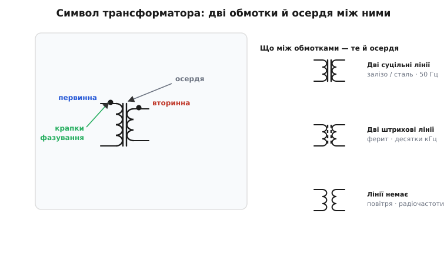
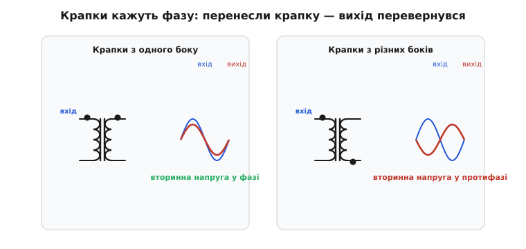
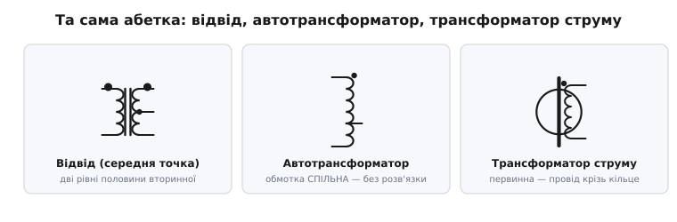

# Символи трансформаторів і зв'язаних котушок

Майже кожен символ на принциповій схемі стоїть сам по собі: резистор, конденсатор, діод — кожен живе власним життям між своїми двома виводами. Трансформатор — виняток. Його символ — це **дві котушки, намальовані поруч**, і весь сенс деталі в тому, що відбувається в проміжку **між** ними, де на папері порожньо. Тому й читається цей символ інакше: треба бачити не два окремі елементи, а одну пару, зчеплену невидимим зв'язком. Той, хто навчиться читати цей проміжок, прочитає половину силової електроніки з першого погляду.

Чому взагалі дві котушки малюють поряд, а не сполучають дротом, як усе інше на схемі? Бо дроту між ними справді немає — і саме в цьому фокус. Енергія переходить з лівої котушки в праву не провідником, а через спільне магнітне поле; обмотки електрично роз'єднані. Символ чесно це показує: між двома стовпчиками витків — порожнеча або кілька ліній осердя, але **жодного провідника**. Якщо ви бачите дві котушки, з'єднані лінією-дротом, — це вже не трансформатор, а щось інше. Уся абетка цього символу побудована, щоб передати три речі: де первинна обмотка, де вторинна, і **як вони зорієнтовані одна щодо одної у фазі** — остання річ і виявиться найхитрішою.

> Щоб символ читався не як набір рисок, а як працюючий пристрій, варто тримати в голові одну фізичну тезу: зміна струму в одній котушці наводить напругу в сусідній через спільний магнітний потік — це взаємоіндукція. Сам механізм (закон Фарадея, чому відношення напруг дорівнює відношенню витків) розібрано окремо: [взаємоіндукція й закон Фарадея](topic:electronics/mutual-inductance).

### Кістяк символу: дві обмотки й те, що між ними


*Зліва — повний символ: дві обмотки (стовпчики дуг), осердя між ними (вертикальні лінії) і крапки фазування біля верхніх виводів. Праворуч — як вигляд ліній осердя кодує матеріал: дві суцільні лінії означають залізо (низькі частоти), дві штрихові — ферит, відсутність ліній — повітря (радіочастоти).*

Кожну обмотку малюють так само, як [окрему котушку](topic:electronics/component-symbols) — низкою дуг, що нагадує намотаний виток за витком дріт. Дві такі низки ставлять одна навпроти одної: ліва за домовленістю **первинна** (англ. *primary* — та, на яку подають живлення), права **вторинна** (*secondary* — та, з якої знімають вихід). Розташування суто умовне — фізично жодна не «головніша», просто так заведено читати зліва направо. Те, що це **одна** деталь, а не дві випадково сусідні котушки, видно з проміжку: між обмотками немає дроту, натомість часто стоять лінії осердя.

І тут починається перша корисна закономірність: **вигляд ліній між обмотками каже, з чого зроблене осердя — а отже, на яку частоту розрахована деталь**. Логіка пряма, бо матеріал осердя й робоча частота — нерозлучні.

- **Дві суцільні лінії** між обмотками — осердя зі **сталі чи заліза** (пакет тонких пластин). Такі трансформатори працюють на низьких частотах, насамперед мережевих 50 Гц. Це той важкий брусок, що гудить у старому блоці живлення.
- **Дві штрихові (пунктирні) лінії** — осердя з **фериту**: кераміки, що проводить магнітне поле, але не проводить струм. Ферит — для високих частот, десятків і сотень кілогерців; саме він ховається в кожній імпульсній зарядці.
- **Ліній немає взагалі**, обмотки просто стоять поруч — осердя **повітряне** (точніше, його нема). Так малюють радіочастотні трансформатори й зв'язані котушки в контурах: на високих частотах залізо й ферит уже тільки заважали б втратами.

Чому штрихова лінія дісталася саме фериту, а суцільна — залізу? Це домовленість, але не випадкова: суцільна лінія — «суцільний метал», штрихова натякає на щось менш «металеве», переривчасте, неоднорідне — і за нею закріпився ферит та порошкові осердя. Чому осердя взагалі визначає частоту — це вже фізика самої деталі, а не символу; на ній варто спинитися рівно настільки, щоб символ перестав бути загадкою.

> 🔧 **Навіщо це.** Перший погляд на трансформатор у чужій схемі має давати відповідь «це мережа чи імпульсне?». Дві суцільні лінії й підпис «230 В» поруч — перед вами вхід від розетки, бар'єр між небезпечною мережею і вашою платою; до такого вузла не лізуть пальцями під напругою. Штрихові лінії — це вторинний бік імпульсного перетворювача, там уже низьковольтні десятки кілогерців. Помилитися з цим — означає переплутати, де по-справжньому небезпечно.

> Чому ферит малий, а мережеве залізо важке, чому осердя взагалі задає габарити й чому феритовий трансформатор не можна вмикати в розетку 50 Гц — це фізика самого пристрою, не його символу: [трансформатор як компонент](topic:electronics/transformer).

### Крапки фазування — найважливіша й найнепомітніша деталь

Тепер про річ, через яку символ трансформатора заслуговує на окрему розмову, а не на рядок у загальному переліку значків. Біля одного виводу кожної обмотки часто стоїть **маленька жирна крапка**. Вона дрібна, її легко проґавити — а вона несе те, чого більше ніде на символі немає: **взаємну орієнтацію обмоток у фазі**.

Щоб зрозуміти, навіщо ця крапка, поставмо чесне запитання. Обмотка симетрична: два виводи, низка витків. А чи однакові ці два виводи? Для **постійного** струму — так, обмотка це просто дріт. Але трансформатор живе на **змінному** струмі, де напруга весь час змінює знак, і тут раптом виявляється, що кінці обмотки **не рівноцінні**. У кожну мить один кінець вторинної обмотки додатний відносно другого — і питання в тому, **який саме кінець**, коли на первинній обмотці верхній вивід додатний. Відповідь залежить від того, **в який бік намотано дріт** вторинної відносно первинної. Намотали в один бік — вторинна повторює фазу первинної; намотали в протилежний — вторинна перевернута, у протифазі.

На реальній деталі це сховано всередині, під ізоляцією: ззовні не видно, куди йде дріт. Тому й придумали позначку. **Крапки ставлять біля тих виводів обмоток, які в будь-яку мить мають однаковий знак напруги.** Іншими словами: коли вивід первинної з крапкою стає додатним, вивід вторинної з крапкою теж стає додатним — синхронно, тієї самої миті.


*Той самий трансформатор, лише крапка вторинної обмотки в іншому місці. Ліворуч обидві крапки зверху: коли вхід (синя) іде вгору, вихід (червона) теж іде вгору — напруги у фазі. Праворуч крапку вторинної опущено вниз: тепер при тому самому вході вихід іде в протилежний бік — протифаза. Малюнок обмоток не змінився, змінилася одна крапка — і сенс перевернувся.*

Є два рівноцінні способи сформулювати це правило, і обидва корисні залежно від того, про напругу чи про струм ви думаєте.

```
Правило за напругою:
  вивід первинної з крапкою додатний  ⇒  вивід вторинної з крапкою теж додатний
  (напруги на крапкових кінцях завжди в фазі)

Правило за струмом:
  струм ВТІКАЄ у крапковий кінець первинної  ⇒  струм ВИТІКАЄ з крапкового кінця вторинної
  (так, ніби крапкові кінці — продовження одного провідника)
```

Друге формулювання спершу збиває з пантелику: чому «втікає» в одну й «витікає» з іншої? Бо так працює сама взаємоіндукція. Струм, що наростає в первинній, створює потік; цей потік, наростаючи, наводить у вторинній напругу, яка **протидіє** змінам (це закон збереження, він же закон Ленца) — і якщо до вторинної під'єднати навантаження, то струм у ній потече так, щоб його власний потік **гасив** приріст спільного потоку. Підрахунок напрямків і дає: струм виходить із того кінця вторинної, який позначено крапкою, коли в крапковий кінець первинної він заходить. Тримати в голові варто простіше формулювання — за напругою: **крапка до крапки — синфазно**.

> 🔧 **Навіщо це.** Крапки — не педантизм, від них залежить, працюватиме схема чи ні. У двотактному (push-pull) перетворювачі дві половини первинної мусять штовхати потік **по черзі**; переплутаєте крапки — обидві штовхатимуть одночасно в один бік, трансформатор миттєво наситься, а ключі згорять. У зворотному зв'язку імпульсного блока керівна обмотка з неправильною крапкою дасть **додатний** зворотний зв'язок замість від'ємного — і замість стабілізації вийде генератор. Коли паяєте трансформатор за чужою схемою, крапка каже, котрий вивід обмотки куди, — і це різниця між «запрацювало» і «бахнуло».

### Числа біля символу: відношення витків

Сам символ каже лише «це трансформатор» і «ось так зорієнтовані обмотки». Скільки він перетворює — на скільки піднімає чи опускає напругу — пишуть **підписом поруч**, як і номінал біля резистора. Найчастіше це **відношення витків** (turns ratio) у вигляді двох чисел через двокрапку: `1:10` означає, що на кожен виток первинної припадає десять витків вторинної, тож напруга зростає вдесятеро (це підвищувальний, *step-up*); `10:1` — навпаки, опускає вдесятеро (понижувальний, *step-down*); `1:1` — нічого не змінює за величиною й служить лише для розв'язки.

Інколи замість відношення пишуть просто напруги обмоток — `230V / 12V` — або, для радіочастотних, опори, бо там трансформатор найчастіше **узгоджує імпеданси**: `50Ω : 200Ω`. Це не суперечність: відношення опорів дорівнює **квадрату** відношення витків (бо опір росте як напруга поділена на струм, а вони міняються в протилежні боки). Та сама деталь, різні зручні для задачі підписи.

```
Відношення витків і що з нього випливає (n = N₂/N₁):

  напруга:   V₂ = V₁ · n
  струм:     I₂ = I₁ / n        (росте напруга — падає струм, потужність та сама)
  опір:      R_відбитий = R_навантаження / n²   (опір переноситься в КВАДРАТІ)
```

Кількісну сторону — як саме з'являється n² і чому потужність зберігається — винесено в окрему [математику відношення витків](topic:electronics/mutual-inductance/math-turns-ratio.md). Для читання символу досить пам'ятати: дві цифри через двокрапку — це в скільки разів обмотки відрізняються витками, а напрямок (хто більший) каже, підвищує деталь чи понижує.

### Родина: відводи, автотрансформатор, трансформатор струму

Базовий символ розростається в цілу родину, але абетка лишається тією самою — додаються хіба що деталі. Варто впізнавати три найчастіші, бо за вкрай схожими малюнками ховаються дуже різні поведінки.


*Зліва — відвід (середня точка): від вторинної обмотки виходить третій вивід посередині, ділячи її на дві рівні половини. Посередині — автотрансформатор: обмотка одна-єдина, з відводом; спільний провідник означає, що розв'язки тут немає. Справа — трансформатор струму: первинна це товстий прямий провідник, що проходить крізь кільцеве осердя, а вторинна намотана на саме кільце.*

**Відвід — середня точка (center tap).** Від обмотки виводять третій провід — найчастіше точно посередині, ділячи її на дві рівні половини. На схемі це третій вивід від середини низки витків. Навіщо: дві однакові половини дають дзеркальні напруги відносно середньої точки (одна йде вгору, друга вниз) — основа двопівперіодного випрямляча зі середньою точкою й двотактних схем. Якщо середню точку заземлити, отримаєте симетричне живлення `+V / 0 / −V` з одного трансформатора.

**Автотрансформатор.** Тут обмотка **одна-єдина**, з відводом — і саме тому це підступний символ. Виглядає схоже на трансформатор, перетворює напругу як трансформатор, але обмотка спільна — між входом і виходом є **прямий провідник**. А отже, **гальванічної розв'язки немає**: потенціал входу присутній на виході. Плутати автотрансформатор зі звичайним (ізоляційним) небезпечно: люди вмикають прилад через «лабораторний автотрансформатор» (ЛАТР), гадаючи, що відв'язалися від мережі, а насправді й далі тримають у руках мережевий потенціал. Тому на символі критично важлива саме **одна** обмотка проти двох: одна лінія витків — спільний провідник — немає розв'язки; дві окремі — є.

> 🔧 **Навіщо це.** «Дві котушки чи одна» — це не косметика, це питання безпеки. Ізоляційний трансформатор (дві обмотки, `1:1`) рве електричний зв'язок із мережею — на його виході можна торкнутися будь-якого проводу й не вдарити струмом відносно землі. Автотрансформатор (одна обмотка) цього **не робить**, хоч і стоїть у тій самій ролі «перетворити напругу». Читаючи символ перед сервісними роботами, рахуйте обмотки буквально.

**Трансформатор струму (current transformer, CT).** Тут первинна обмотка вироджена в **один виток** — а часто й узагалі в прямий провідник, що просто проходить крізь кільцеве осердя. Вторинна намотана на саме кільце багатьма витками. Сенс перевернутий: це не перетворювач енергії, а **давач струму**. Великий струм у товстому провіднику-первинній наводить у вторинній пропорційний, але в багато разів менший струм, який уже зручно виміряти. Так міряють струми в сотні ампер, не розриваючи кола й не торкаючись його. На символі це впізнається за кільцем-осердям, крізь яке проходить одна товста лінія.

Є й тонша рідня — наприклад, трансформатор з **екраном**: між обмотками малюють додаткову лінію, заземлену окремим виводом. Це електростатичний екран (його ще звуть екраном Фарадея за прізвищем Майкла Фарадея), смужка фольги, що перехоплює ємнісну наводку між обмотками й стікає її на землю. Потрібен там, де крізь бар'єр розв'язки не має просочуватися навіть високочастотна завада. На схемі це просто заземлена лінія в проміжку між котушками — і якщо ви її бачите, перед вами трансформатор, від якого вимагали особливої чистоти розв'язки.

### Два стандарти й буквені позначки виводів

Як і з рештою символів, тут співіснують **дві традиції** креслення. Міжнародний стандарт IEC 60617 тяжіє до простих, абстрактних обрисів; північноамериканський ANSI (нині IEEE 315) — до пластичніших, «схожих на справжнє». Для трансформатора різниця невелика: обидва малюють дві обмотки й лінії осердя, просто обмотки бувають або низкою дуг (пластичніше), або вертикальними рисками-«гребінцем» (абстрактніше). Працюють обидва однаково, тож звикайте впізнавати і дуги, і гребінець як ту саму котушку. *(Те, що це лише дві традиції для однієї фізики, докладніше — у статті про [умовні позначення](topic:electronics/component-symbols).)*

Окремо варто знати про **буквені позначки виводів**, бо вони трапляються на силових і розподільчих трансформаторах. Виводи обмотки високої напруги підписують `H1`, `H2`, …, низької — `X1`, `X2`, … (а якщо обмоток більше — `Y`, `Z`). Сенс той самий, що й у крапок: виводи `H1` і `X1` за домовленістю **однієї полярності** — це ті самі «крапкові» кінці, лише названі буквами замість значка. Стандарт цих позначень (IEEE C57.12.70) виник у світі великої енергетики, де трансформатори вмикають паралельно й помилка фазування означає коротке замикання між машинами; тому там і знадобилася сувора буквена дисципліна понад прості крапки. На дрібних сигнальних та імпульсних трансформаторах буквами зазвичай не морочаться — там цілком вистачає крапки.

> 🔧 **Навіщо це.** Незалежно від стандарту й від того, крапка це чи буква `H1/X1`, фізичний зміст один: позначка каже, **який кінець якої обмотки синфазний із яким**. Зустрівши на схемі будь-яку з цих позначок, ви читаєте їх однаково — як вказівку на взаємну орієнтацію обмоток. А коли самі ставите трансформатор у редакторі схем (KiCad, EasyEDA), символ із крапками вже чекає в бібліотеці; ваша справа — не загубити крапку при розведенні плати, бо саме за нею монтажник зорієнтує деталь правильним боком.

### Що тримати в голові

Символ трансформатора читається трьома рухами очей. **Перше** — порахувати обмотки: дві окремі низки витків це трансформатор із розв'язкою, одна спільна з відводом це автотрансформатор без розв'язки, а кільце з провідником крізь нього це трансформатор струму. **Друге** — глянути в проміжок між обмотками: дві суцільні лінії означають залізне осердя й низьку частоту (найчастіше мережу), штрихові — ферит і високу частоту, порожнеча — повітря й радіочастоти. **Третє, найважче і найважливіше** — знайти крапки фазування: вони кажуть, які кінці обмоток синфазні, а від цього прямо залежить, чи запрацює двотактна схема й чи буде зворотний зв'язок від'ємним. Усе інше — конкретні числа перетворення — стоїть підписом поруч, як номінал біля будь-якої деталі. Запам'ятайте дрібну жирну крапку: на цьому символі вона важить більше за всі лінії разом.
