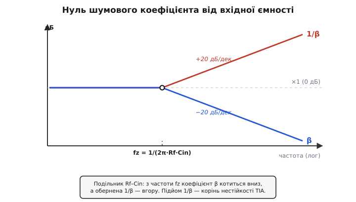
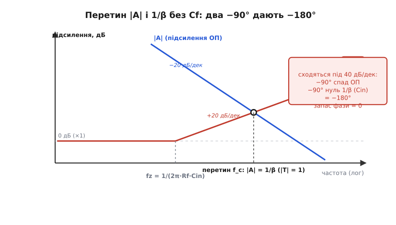
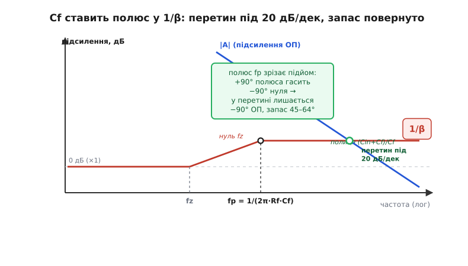

# 🧮 Стійкість TIA: виведення через петльове підсилення й вибір Cf

Трансімпедансний підсилювач зривається в дзвін чи генерацію не з примхи й не від «поганого ОП». Зрив записаний у двох простих фактах: на вході сидить ємність, а підсилення операційного підсилювача з частотою падає. З цих двох фактів стійкість виводиться повністю — до формули, що каже, який саме конденсатор Cf поставити й який запас фази це дасть. Тут ми пройдемо це виведення від першопричини: не «ось формула, користуйтеся», а «ось чому петля втрачає фазу, ось де вона стає небезпечною, ось як Cf точно повертає її в безпеку».

Усе крутиться навколо одного поняття — **петльового підсилення** (англ. *loop gain*). Воно і є той важіль, яким зворотний зв'язок утримує вузол на віртуальній землі; коли цей важіль обертається фазою на 180°, утримання перетворюється на розгойдування. Тож почнімо з нього.

## Петльове підсилення: що насправді тримає вузол

Уявіть, що ми розірвали петлю зворотного зв'язку в одній точці — скажімо, біля інвертувального входу — і пустили туди пробний сигнал. Сигнал обійде все коло: через підсилювач на вихід, через ланку зворотного зв'язку назад до місця розриву. Те, з яким коефіцієнтом (за величиною й фазою) він повернеться, і є **петльове підсилення** T. Це добуток двох частин:

```
T(jω) = A(jω) · β(jω)
```

A — це власне підсилення операційного підсилювача (англ. *open-loop gain*, підсилення без зворотного зв'язку), велике на постійному струмі й спадне з частотою. β — це **коефіцієнт зворотного зв'язку** (англ. *feedback factor*): яка частка вихідної напруги повертається назад на вхід через ланку Rf–Cin. Петльове підсилення каже, **наскільки сильно й з якою затримкою фази** петля реагує на власне відхилення.

Чому саме T вирішує все? Бо замкнена схема стійка рівно доти, доки петля гасить збурення швидше, ніж устигає їх накопичити. Поки сигнал, обійшовши коло, повертається в **протифазі** до себе (від'ємний зворотний зв'язок), кожен оберт його послаблює — збурення вмирає. Та якщо десь по дорозі набіжить додаткова затримка на півперіоду, протифаза обернеться на синфазу: сигнал, повернувшись, **додасться** до себе. Якщо при цьому петльове підсилення ще ≥ 1 (повертається не менше, ніж пішло), збурення з кожним обертом росте — це і є генерація. Уся теорія стійкості зводиться до одного питання: **яка фаза в T на тій частоті, де його величина падає до одиниці**.

> 🔧 **Навіщо це.** Петльове підсилення — не абстракція для підручника, а те, що показує симулятор і вимірює аналізатор у лабораторії. Коли інженер «дивиться стійкість TIA», він будує саме графік |T| і фази T (або еквівалентний графік перетину двох кривих, до якого ми зараз дійдемо) і читає з нього запас фази. Зрозумієш T — і не плутатимешся, чому той самий ОП в одній схемі тихий, а в TIA дзвенить: справа не в ОП, а в тому, що ланка Rf–Cin робить із β.

Запас до катастрофи міряють **запасом фази** (англ. *phase margin*): це скільки градусів лишилося до фатальних 180° саме на частоті одиничного підсилення петлі.

```
запас фази  φm = 180° − |фаза T на частоті, де |T| = 1|
```

φm = 0° — петля на межі, нескінченний дзвін. φm близько 45° — помітний викид на сходинці (близько 23 %) і кілька періодів затухаючого дзвону. φm близько 60–64° — гладкий відгук майже без викиду. Уся гра вибору Cf — це гра за те, щоб привести φm у здоровий діапазон 45–64°. Тепер порахуймо β, бо саме в ньому ховається біда й ліки.

## Коефіцієнт зворотного зв'язку: звідки береться підйом

Розгляньмо вузол біля інвертувального входу. До нього сходяться три дороги: вихід ОП через Rf, земля через вхідну ємність Cin (нагадаю, це сума ємності переходу діода, входу ОП і монтажу), і сам інвертувальний вхід ОП. Коефіцієнт β — це частка вихідної напруги, що ділиться на цьому вузлі назад на вхід; за правилом подільника напруги він дорівнює відношенню імпедансу «вниз» (Cin на землю) до повного імпедансу від виходу до землі через цей вузол.

Спершу без рятівного Cf — тільки Rf і Cin, щоб голим оком побачити, **звідки росте загроза**. Імпеданс резистора Rf не залежить від частоти, а імпеданс ємності Cin падає з частотою (X_C = 1/(ωCin)). Подільник дає:

```
              Z(Cin)              1/(jωCin)               1
β(jω)  =  ───────────────  =  ──────────────────  =  ───────────────
           Z(Cin)+Z(Rf)       1/(jωCin) + Rf          1 + jω·Rf·Cin
```

Подивіться на цей вираз як на живу річ. На низьких частотах ω·Rf·Cin ≪ 1, знаменник ≈ 1, отже β ≈ 1: майже весь вихід повертається на вхід, петля міцна. Але з частотою член jω·Rf·Cin росте, знаменник більшає, **β меншає** — назад повертається дедалі менша частка. Частота, де ω·Rf·Cin = 1, тобто де β падає вдвічі (на 3 дБ) і далі котиться по 20 дБ на декаду, — це **полюс** коефіцієнта β:

```
fp(β) = 1 / (2π · Rf · Cin)
```

Тут і зарито коріння всієї проблеми, і варто назвати його точно. У теорії стійкості зручніше дивитися не на β, а на **1/β** — це і є вже знайомий нам **шумовий коефіцієнт** (англ. *noise gain*), тобто на скільки схема підсилює власну напругову похибку ОП. Перевернімо:

```
1/β(jω) = 1 + jω·Rf·Cin
```

Те, що для β було полюсом (спад), для 1/β стає **нулем** (підйом). Ось чому в статті сказано: вхідна ємність ставить **нуль шумового коефіцієнта** на частоті

```
fz = 1 / (2π · Rf · Cin)
```

З цієї частоти 1/β перестає бути плоскою одиницею й починає **лізти вгору по 20 дБ на декаду**. Графічно: на низьких частотах 1/β — рівна лінія на рівні ×1; від fz вона заломлюється й піднімається. Це не помилка й не паразит — це чесна фізика подільника Rf–Cin. Але саме цей підйом, зустрівшись із падінням A, і вбиває петлю.


*Вхідна ємність Cin разом із Rf утворює подільник, чий коефіцієнт β з частоти fz = 1/(2π·Rf·Cin) котиться вниз. Обернена величина 1/β (шумовий коефіцієнт) із тієї ж частоти лізе вгору. Підйом 1/β — корінь нестійкості TIA.*

## Перетин двох кривих: чому набігає 180°

Тепер з'єднаймо два графіки на одному полі — і стійкість стане видимою очима. По вертикалі — підсилення в децибелах, по горизонталі — частота в логарифмічному масштабі.

Перша крива — власне підсилення ОП, **|A|**. Воно стартує дуже високо (скажімо, 120 дБ) на постійному струмі й спадає по 20 дБ на декаду (типовий ОП із внутрішньою корекцією має один домінантний полюс — про це нижче), перетинаючи рівень одиниці (0 дБ) на частоті одиничного підсилення, яка для такого ОП дорівнює добуткові підсилення на смугу f_GBW.

Друга крива — **1/β**. Вона рівна на рівні ×1 (0 дБ для чисто резистивного TIA — нагадаю, шумовий коефіцієнт TIA на постійному струмі дорівнює одиниці) до частоти fz, а далі підіймається по 20 дБ на декаду.

Ключ до всієї теорії стійкості — **різниця цих двох кривих і є петльове підсилення в децибелах**:

```
|T|(дБ) = |A|(дБ) − (1/β)(дБ) = (|A| · β)(дБ)
```

Отже петля «замикається» (|T| = 1, тобто 0 дБ) рівно там, де **дві криві перетинаються**: де |A| опускається до рівня 1/β. Це і є частота перетину f_c — найважливіша точка на графіку. А головне для стійкості — **під яким кутом криві сходяться**, бо нахил кривих несе в собі фазу.

Тут спрацьовує точне правило з теорії від'ємного зворотного зв'язку: **кожен спад або підйом по 20 дБ на декаду відповідає 90° відставання фази в петлі**. Порахуймо фазу T в точці перетину для нашого випадку без Cf.

```
крива |A|   падає по −20 дБ/дек  →  внесок −90° від спаду ОП
крива 1/β   росте по +20 дБ/дек  →  внесок −90° від нуля Cin
─────────────────────────────────────────────────────────────
разом у петлі:  −90° − 90° = −180°
```

Ось воно, **подвійне відставання фази**, про яке каже стаття, виведене явно. Одне 90° — від внутрішнього спаду самого ОП. Друге 90° — від підйому 1/β, який породжує вхідна ємність. На частоті перетину вони складаються у фатальні −180°. Інакше кажучи, **швидкість зближення кривих 40 дБ на декаду** (одна вниз на 20, друга вгору на 20) — це і є запас фази, що дорівнює нулю.

> 🔧 **Навіщо це.** «Швидкість зближення» (англ. *rate of closure*) — найшвидший практичний тест стійкості, яким користуються щодня. Подивися на Bode-графік: під яким нахилом сходяться |A| і 1/β у точці перетину? Сходяться під 20 дБ/декаду (одна крива полога, друга наближається похило) — запас фази ≳ 45°, схема спокійна. Сходяться під 40 дБ/декаду (назустріч одна одній круто) — запас фази → 0, дзвін чи генерація. Не треба рахувати фазу інтегралами — досить лінійки на графіку.


*Петльове підсилення в децибелах — це різниця |A| і 1/β, тож петля замикається в точці їх перетину. Без Cf криві сходяться назустріч під 40 дБ/декаду: −90° від спаду ОП плюс −90° від підйому 1/β дають −180°, запас фази дорівнює нулю — схема на межі генерації.*

Залишилось пояснити, **звідки в самому ОП ці −90°**, щоб картина була без дір. Реальний операційний підсилювач із внутрішньою корекцією навмисне зроблено так, щоб мати один **домінантний полюс** на низькій частоті: його підсилення падає по 20 дБ/декаду в усій робочій смузі аж до f_GBW. Один полюс дає рівно −90° відставання — і не більше, поки не вступлять вищі паразитні полюси десь за f_GBW. Саме тому окремо ОП у простих схемах стійкий: −90° лишають цілих 90° запасу. Біда TIA в тому, що до цих чесних −90° додаються ще −90° від вхідної ємності — і весь запас з'їдається.

> Чому виробник навмисне закладає в ОП один домінантний полюс і підсилення падає по 20 дБ на декаду аж до частоти одиничного підсилення f_GBW — у статті [добуток підсилення на смугу](topic:electronics/gain-bandwidth-product). Звідти ми беремо: спад |A| дає рівно −90° фази, і саме до них додається друге відставання від Cin.

## Чому Cf лікує: нуль гасить нуль

Тепер, коли видно точний механізм зриву, ліки читаються самі. Біда — у зайвих −90°, що їх вносить підйом 1/β. Щоб їх прибрати, треба **зупинити підйом 1/β раніше, ніж він дійде до перетину**: вирівняти криву назад у полицю, де нахил 0 дБ/декаду й фазовий внесок знову нуль. Саме це й робить конденсатор Cf, увімкнений паралельно Rf.

Порахуймо β заново, тепер із Cf. Імпеданс верхнього плеча подільника — це вже не чистий Rf, а Rf паралельно з Cf:

```
Z(зв.зв.) = Rf ∥ (1/jωCf) = Rf / (1 + jω·Rf·Cf)
```

Підставивши в подільник із Cin, після згортання дробів коефіцієнт β набуває вигляду з **нулем і полюсом** замість одного полюса:

```
            1 + jω·Rf·Cf
β(jω) = ─────────────────────────
         1 + jω·Rf·(Cin + Cf)
```

А обернена крива 1/β, та сама, що визначає стійкість:

```
         1 + jω·Rf·(Cin + Cf)
1/β = ─────────────────────────
            1 + jω·Rf·Cf
```

Прочитаймо її. У чисельнику — **нуль** на частоті fz = 1/(2π·Rf·(Cin+Cf)) ≈ 1/(2π·Rf·Cin) (бо зазвичай Cf ≪ Cin): це той самий підйом від вхідної ємності, він нікуди не подівся й починається там само. Зате тепер у знаменнику з'явився **полюс** на частоті

```
fp = 1 / (2π · Rf · Cf)
```

Полюс у 1/β — це **злам підйому назад у полицю**. До fp крива 1/β лізе вгору (нуль працює), а від fp вона знову вирівнюється (полюс гасить підйом). Геометрично: 1/β більше не лізе нескінченно вгору до перетину, а виходить на горизонтальну полицю на рівні (Cin+Cf)/Cf і так зустрічає падаючу |A| **похило**, під безпечним кутом.

І найважливіше — фаза. Нуль 1/β вносив +(підйом) → −90° у петлю. Полюс 1/β вносить −(спад) → **+90°** у петлю, тобто **фазове випередження**, що гасить попереднє відставання. Якщо полюс fp поставити **раніше від частоти перетину**, до перетину фаза від ланки β встигає повернутися з небезпечних −90° назад до нуля — і в точці перетину лишається тільки чесне −90° від самого ОП. А −90° — це 90° запасу, повний спокій.


*Конденсатор Cf додає в 1/β полюс fp = 1/(2π·Rf·Cf), що зрізає підйом у полицю до перетину з |A|. Тепер криві сходяться під 20 дБ/декаду замість 40: фазове випередження полюса гасить відставання нуля, у точці перетину лишається тільки −90° від ОП — запас фази повертається в район 45–64°.*

Бачите красу: **нуль лікують нулем**. Вхідна ємність поставила в 1/β нуль (підйом) — ми навмисне ставимо туди ж полюс (злам назад), і він гасить фазову шкоду. Cf — це не «фільтр від генерації» наосліп, а точно націлене фазове випередження, що повертає петлі запас, відібраний вхідною ємністю.

## Де поставити полюс: умова максимально плоского відгуку

Тепер головне інженерне рішення: **на яку частоту fp ставити полюс**, тобто який саме Cf обрати. Запізно (fp надто високо, Cf замалий) — підйом 1/β дійде до небезпечної зони, де нахил знову 40 дБ/декаду, лишиться дзвін. Зарано (fp надто низько, Cf завеликий) — полицю опустимо так низько, що дарма обріжемо корисну смугу: швидкість віддамо без потреби. Є золота середина.

Щоб її знайти, згадаймо: фазу губить **відстань** між частотою перетину f_c і частотами зламу. Нуль fz задирає фазу на −90° поступово, у декаду навколо себе; полюс fp вертає +90°, теж у декаду навколо себе. Запас фази в точці перетину максимальний, коли **полюс fp стоїть точно в геометричній середині між нулем fz і частотою одиничного підсилення f_GBW** — там його фазове випередження найкраще накриває те місце, де відбувається перетин. Це класична умова максимально плоского, **баттервортівського**, відгуку (названого на честь британського інженера Стівена Баттерворта, що 1930 року описав фільтри з максимально плоскою смугою — факт усталений). Геометрична середина в логарифмічному масштабі частот — це корінь із добутку:

```
fp = √( fz · f_GBW )
```

Звідси все й виводиться. Підставмо означення обох частот зламу й розв'яжімо щодо Cf. Зліва fp через Cf, праворуч fz через Cin:

```
   1                  ┌      1                     ┐
─────────────  =  √ │ ───────────── · f_GBW │
2π·Rf·Cf            └ 2π·Rf·Cin                ┘
```

Піднесімо обидві сторони до квадрата й виразімо Cf. Крок за кроком:

```
        1                  f_GBW
──────────────────  =  ─────────────       (звели праву частину під один корінь)
(2π·Rf·Cf)²            2π·Rf·Cin

(2π·Rf·Cf)²  =  (2π·Rf·Cin) / f_GBW         (перевернули обидві сторони)

(2π·Rf)²·Cf² =  2π·Rf·Cin / f_GBW

Cf²  =  Cin / (2π·Rf·f_GBW)                 (поділили на (2π·Rf)²)
```

Витягуємо корінь — і ось вона, формула вибору Cf, та сама, що стоїть у статті, тепер виведена від першопричини:

```
Cf  ≈  √( Cin / (2π · Rf · f_GBW) )
```

Це не магічна стала, а пряме рішення рівняння «постав полюс у геометричну середину». Воно кладе запас фази **близько 45°** у точці перетину (швидкість зближення 20 дБ/декаду — мінімально безпечна) — добрий компроміс між смугою і спокоєм. Хто хоче гладшого відгуку без жодного викиду (повний Баттерворт, добротність Q = 1/√2, запас фази **близько 64°**), бере Cf трохи більший — зсуває полюс нижче, віддаючи частину смуги за ще тихіший фронт. Тому в статті й сказано «район 45–64°»: 45° — від цієї формули, 64° — від трохи щедрішого Cf.

> 🔧 **Навіщо це.** Формула дає **стартове** значення, з якого починають, а не священну істину. На стенді дивляться перехідну характеристику на сходинку струму: лишився викид і дзвін — Cf трохи додають (полюс нижче, запас більший); фронт став млявий, смуги бракує — Cf трохи знімають. Але знати, **звідки** береться це значення, безцінно: коли formula дає 0.1 пФ (а такий конденсатор менший за паразитну ємність монтажу!), розумієш, що проблема не в номіналі, а в тому, що з цим ОП потрібну смугу взагалі не витягти — треба швидший підсилювач або менший Rf. Виведення підказує, де межа можливого.

## Звідки в смузі бере межу

Той самий полюс fp, що дає запас фази, ставить і **верхню межу корисної смуги** перетворювача. Це не випадковий збіг, а одна й та сама точка зламу, побачена з двох боків: для петлі стійкості fp — місце, де 1/β вирівнюється; для корисного сигналу fp — місце, де передавання струм→напруга починає спадати. Адже на високих частотах Cf шунтує Rf: імпеданс зворотного зв'язку падає, трансімпеданс меншає. Тому смуга −3 дБ всього TIA:

```
f(−3дБ)  =  fp  =  1 / (2π · Rf · Cf)
```

Підставивши сюди оптимальний Cf, дістаємо межу можливого для даного ОП. Якщо Cf = √(Cin/(2π·Rf·f_GBW)), то:

```
f(−3дБ) = 1/(2π·Rf·Cf) = √( f_GBW / (2π·Rf·Cin) )
```

Прочитайте цей результат — він глибокий. Гранична смуга стійкого TIA **росте як корінь із f_GBW** і **падає як корінь із Rf·Cin**. Хочете вдвічі ширшу смугу — потрібен учетверо швидший ОП, або вчетверо менший добуток Rf·Cin. Ось чому в швидких оптичних приймачах так б'ються за малу вхідну ємність (крихітний діод, короткі доріжки) і беруть ОП із гігагерцовим f_GBW: смуга тримається на корені з їх добутку, а коренева залежність скупа на дарунки.

## Порахуймо запас фази в коді

Тепер зведімо все в робочий розрахунок: за заданими Rf, Cin, f_GBW і обраним Cf обчислимо частоту перетину, запас фази й перевіримо, чи схема в безпеці. Це рівно те, що робив би прошивковий калькулятор приладу, який сам підбирає компенсацію або перевіряє готовий каскад.

Спершу — як рахується запас фази, щоб код не був чорною скринькою. У точці перетину f_c повна фаза петлі складається з трьох внесків: −90° від домінантного полюса ОП (він діє в усій смузі), мінус відставання від нуля fz, плюс випередження від полюса fp. Кожен полюс/нуль першого порядку дає фазу −arctan(f/f_зламу) (полюс) або +arctan(f/f_зламу) (нуль). Отже:

```
фаза T(f) = −90° − arctan(f/fz) + arctan(f/fp)
запас φm  = 180° + фаза T(f_c)  =  90° − arctan(f_c/fz) + arctan(f_c/fp)
```

Частоту перетину f_c для прикидки беруть там, де |A|·β = 1; при типових числах вона лежить близько fp (полиця 1/β зустрічає падаючу |A| неподалік від зламу). Для інженерної оцінки досить підставити f_c ≈ fp; точніше її дає чисельний розв'язок |A(f)|·β(f) = 1, що й робить код нижче.

**Запас фази й перевірка компенсації.** За Rf, Cin, f_GBW і Cf знайдімо частоту перетину петлі, тоді запас фази, і скажімо, чи схема стійка.

:::tabs
```cpp
#include <cmath>

constexpr float TWO_PI = 2.0f * static_cast<float>(M_PI);

struct Tia {
    float Rf;       // резистор перетворення, Ом
    float Cin;      // повна вхідна ємність (діод + ОП + монтаж), Ф
    float Cf;       // конденсатор компенсації, Ф
    float f_gbw;    // добуток підсилення на смугу ОП, Гц
};

// Частоти зламів коефіцієнта зворотного зв'язку
static float fz_of(const Tia &t) {            // нуль 1/β від вхідної ємності
    return 1.0f / (TWO_PI * t.Rf * (t.Cin + t.Cf));
}
static float fp_of(const Tia &t) {            // полюс 1/β від Cf = смуга −3 дБ
    return 1.0f / (TWO_PI * t.Rf * t.Cf);
}

// |A|·β = 1: ОП з одним домінантним полюсом має |A(f)| ≈ f_gbw / f.
// 1/β(f) на полиці прямує до (Cin+Cf)/Cf; точну криву беремо з полюса й нуля.
static float crossover_hz(const Tia &t) {
    float fz = fz_of(t), fp = fp_of(t);
    // |A(f)| = f_gbw/f;  |1/β(f)| = sqrt(1+(f/fz)^2) / sqrt(1+(f/fp)^2)
    // шукаємо f, де f_gbw/f = |1/β|, простим діленням навпіл по логарифму
    float lo = fp * 0.05f, hi = t.f_gbw;      // перетин гарантовано в цьому вікні
    for (int i = 0; i < 60; ++i) {
        float f  = std::sqrt(lo * hi);        // середина в лог-масштабі
        float A  = t.f_gbw / f;
        float ib = std::sqrt(1.0f + (f/fz)*(f/fz)) / std::sqrt(1.0f + (f/fp)*(f/fp));
        if (A > ib) lo = f; else hi = f;      // |A| ще вище за 1/β → перетин правіше
    }
    return std::sqrt(lo * hi);
}

// Запас фази (градуси) при поточному Cf
static float phase_margin_deg(const Tia &t) {
    float fz = fz_of(t), fp = fp_of(t), fc = crossover_hz(t);
    constexpr float deg = 180.0f / static_cast<float>(M_PI);
    // фаза петлі: −90° (полюс ОП) − atan(fc/fz) (нуль 1/β) + atan(fc/fp) (полюс 1/β)
    float phase = -90.0f - std::atan(fc/fz)*deg + std::atan(fc/fp)*deg;
    return 180.0f + phase;                    // запас до −180°
}

// Cf-орієнтир максимально плоского відгуку (полюс у геом. середині fz та f_gbw)
static float cf_butterworth(float Rf, float Cin, float f_gbw) {
    return std::sqrt(Cin / (TWO_PI * Rf * f_gbw));
}

// Приклад: Rf = 1 МОм, Cin = 60 пФ, f_gbw = 10 МГц
void check_example() {
    Tia t{ .Rf = 1.0e6f, .Cin = 60.0e-12f, .Cf = 0.0f, .f_gbw = 10.0e6f };
    t.Cf = cf_butterworth(t.Rf, t.Cin, t.f_gbw);   // ≈ 0.98 пФ
    float pm = phase_margin_deg(t);                // ≈ 45° — мінімально безпечно
    float bw = fp_of(t);                           // смуга −3 дБ ≈ 162 кГц
    if (pm < 45.0f) {
        // запас замалий: побільшити Cf (нижчий полюс, тихіше) або взяти швидший ОП
    }
    (void)pm; (void)bw;
}
```
```python
import math
from dataclasses import dataclass

TWO_PI = 2.0 * math.pi


@dataclass
class Tia:
    Rf: float       # резистор перетворення, Ом
    Cin: float      # повна вхідна ємність (діод + ОП + монтаж), Ф
    f_gbw: float    # добуток підсилення на смугу ОП, Гц
    Cf: float = 0.0  # конденсатор компенсації, Ф


# Частоти зламів коефіцієнта зворотного зв'язку
def fz_of(t: Tia) -> float:                   # нуль 1/β від вхідної ємності
    return 1.0 / (TWO_PI * t.Rf * (t.Cin + t.Cf))


def fp_of(t: Tia) -> float:                   # полюс 1/β від Cf = смуга −3 дБ
    return 1.0 / (TWO_PI * t.Rf * t.Cf)


# |A|·β = 1: ОП з одним домінантним полюсом має |A(f)| ≈ f_gbw / f.
# 1/β(f) на полиці прямує до (Cin+Cf)/Cf; точну криву беремо з полюса й нуля.
def crossover_hz(t: Tia) -> float:
    fz, fp = fz_of(t), fp_of(t)
    # |A(f)| = f_gbw/f;  |1/β(f)| = sqrt(1+(f/fz)^2) / sqrt(1+(f/fp)^2)
    # шукаємо f, де f_gbw/f = |1/β|, простим діленням навпіл по логарифму
    lo, hi = fp * 0.05, t.f_gbw               # перетин гарантовано в цьому вікні
    for _ in range(60):
        f = math.sqrt(lo * hi)                # середина в лог-масштабі
        A = t.f_gbw / f
        ib = math.sqrt(1.0 + (f/fz)**2) / math.sqrt(1.0 + (f/fp)**2)
        if A > ib:                            # |A| ще вище за 1/β → перетин правіше
            lo = f
        else:
            hi = f
    return math.sqrt(lo * hi)


# Запас фази (градуси) при поточному Cf
def phase_margin_deg(t: Tia) -> float:
    fz, fp, fc = fz_of(t), fp_of(t), crossover_hz(t)
    # фаза петлі: −90° (полюс ОП) − atan(fc/fz) (нуль 1/β) + atan(fc/fp) (полюс 1/β)
    phase = -90.0 - math.degrees(math.atan(fc/fz)) + math.degrees(math.atan(fc/fp))
    return 180.0 + phase                      # запас до −180°


# Cf-орієнтир максимально плоского відгуку (полюс у геом. середині fz та f_gbw)
def cf_butterworth(Rf: float, Cin: float, f_gbw: float) -> float:
    return math.sqrt(Cin / (TWO_PI * Rf * f_gbw))


# Приклад: Rf = 1 МОм, Cin = 60 пФ, f_gbw = 10 МГц
def check_example() -> None:
    t = Tia(Rf=1.0e6, Cin=60.0e-12, f_gbw=10.0e6)
    t.Cf = cf_butterworth(t.Rf, t.Cin, t.f_gbw)   # ≈ 0.98 пФ
    pm = phase_margin_deg(t)                       # ≈ 45° — мінімально безпечно
    bw = fp_of(t)                                  # смуга −3 дБ ≈ 162 кГц
    if pm < 45.0:
        pass  # запас замалий: побільшити Cf (нижчий полюс) або взяти швидший ОП
    _ = (pm, bw)
```
```js
const TWO_PI = 2.0 * Math.PI;

// t = { Rf, Cin, Cf, f_gbw }
//   Rf    — резистор перетворення, Ом
//   Cin   — повна вхідна ємність (діод + ОП + монтаж), Ф
//   Cf    — конденсатор компенсації, Ф
//   f_gbw — добуток підсилення на смугу ОП, Гц

// Частоти зламів коефіцієнта зворотного зв'язку
function fzOf(t) {                             // нуль 1/β від вхідної ємності
  return 1.0 / (TWO_PI * t.Rf * (t.Cin + t.Cf));
}
function fpOf(t) {                             // полюс 1/β від Cf = смуга −3 дБ
  return 1.0 / (TWO_PI * t.Rf * t.Cf);
}

// |A|·β = 1: ОП з одним домінантним полюсом має |A(f)| ≈ f_gbw / f.
// 1/β(f) на полиці прямує до (Cin+Cf)/Cf; точну криву беремо з полюса й нуля.
function crossoverHz(t) {
  const fz = fzOf(t), fp = fpOf(t);
  // |A(f)| = f_gbw/f;  |1/β(f)| = sqrt(1+(f/fz)^2) / sqrt(1+(f/fp)^2)
  // шукаємо f, де f_gbw/f = |1/β|, простим діленням навпіл по логарифму
  let lo = fp * 0.05, hi = t.f_gbw;           // перетин гарантовано в цьому вікні
  for (let i = 0; i < 60; ++i) {
    const f = Math.sqrt(lo * hi);             // середина в лог-масштабі
    const A = t.f_gbw / f;
    const ib = Math.sqrt(1.0 + (f/fz)**2) / Math.sqrt(1.0 + (f/fp)**2);
    if (A > ib) lo = f; else hi = f;          // |A| ще вище за 1/β → перетин правіше
  }
  return Math.sqrt(lo * hi);
}

// Запас фази (градуси) при поточному Cf
function phaseMarginDeg(t) {
  const fz = fzOf(t), fp = fpOf(t), fc = crossoverHz(t);
  const deg = 180.0 / Math.PI;
  // фаза петлі: −90° (полюс ОП) − atan(fc/fz) (нуль 1/β) + atan(fc/fp) (полюс 1/β)
  const phase = -90.0 - Math.atan(fc/fz)*deg + Math.atan(fc/fp)*deg;
  return 180.0 + phase;                       // запас до −180°
}

// Cf-орієнтир максимально плоского відгуку (полюс у геом. середині fz та f_gbw)
function cfButterworth(Rf, Cin, f_gbw) {
  return Math.sqrt(Cin / (TWO_PI * Rf * f_gbw));
}

// Приклад: Rf = 1 МОм, Cin = 60 пФ, f_gbw = 10 МГц
function checkExample() {
  const t = { Rf: 1.0e6, Cin: 60.0e-12, Cf: 0.0, f_gbw: 10.0e6 };
  t.Cf = cfButterworth(t.Rf, t.Cin, t.f_gbw);  // ≈ 0.98 пФ
  const pm = phaseMarginDeg(t);                // ≈ 45° — мінімально безпечно
  const bw = fpOf(t);                          // смуга −3 дБ ≈ 162 кГц
  if (pm < 45.0) {
    // запас замалий: побільшити Cf (нижчий полюс, тихіше) або взяти швидший ОП
  }
  void pm; void bw;
}
```
```go
package tia

import "math"

const twoPi = 2.0 * math.Pi

type Tia struct {
	Rf    float64 // резистор перетворення, Ом
	Cin   float64 // повна вхідна ємність (діод + ОП + монтаж), Ф
	Cf    float64 // конденсатор компенсації, Ф
	Fgbw  float64 // добуток підсилення на смугу ОП, Гц
}

// Частоти зламів коефіцієнта зворотного зв'язку
func fzOf(t Tia) float64 { // нуль 1/β від вхідної ємності
	return 1.0 / (twoPi * t.Rf * (t.Cin + t.Cf))
}
func fpOf(t Tia) float64 { // полюс 1/β від Cf = смуга −3 дБ
	return 1.0 / (twoPi * t.Rf * t.Cf)
}

// |A|·β = 1: ОП з одним домінантним полюсом має |A(f)| ≈ Fgbw / f.
// 1/β(f) на полиці прямує до (Cin+Cf)/Cf; точну криву беремо з полюса й нуля.
func crossoverHz(t Tia) float64 {
	fz, fp := fzOf(t), fpOf(t)
	// |A(f)| = Fgbw/f;  |1/β(f)| = sqrt(1+(f/fz)^2) / sqrt(1+(f/fp)^2)
	// шукаємо f, де Fgbw/f = |1/β|, простим діленням навпіл по логарифму
	lo, hi := fp*0.05, t.Fgbw // перетин гарантовано в цьому вікні
	for i := 0; i < 60; i++ {
		f := math.Sqrt(lo * hi) // середина в лог-масштабі
		A := t.Fgbw / f
		ib := math.Sqrt(1.0+(f/fz)*(f/fz)) / math.Sqrt(1.0+(f/fp)*(f/fp))
		if A > ib { // |A| ще вище за 1/β → перетин правіше
			lo = f
		} else {
			hi = f
		}
	}
	return math.Sqrt(lo * hi)
}

// Запас фази (градуси) при поточному Cf
func phaseMarginDeg(t Tia) float64 {
	fz, fp, fc := fzOf(t), fpOf(t), crossoverHz(t)
	deg := 180.0 / math.Pi
	// фаза петлі: −90° (полюс ОП) − atan(fc/fz) (нуль 1/β) + atan(fc/fp) (полюс 1/β)
	phase := -90.0 - math.Atan(fc/fz)*deg + math.Atan(fc/fp)*deg
	return 180.0 + phase // запас до −180°
}

// Cf-орієнтир максимально плоского відгуку (полюс у геом. середині fz та Fgbw)
func cfButterworth(Rf, Cin, Fgbw float64) float64 {
	return math.Sqrt(Cin / (twoPi * Rf * Fgbw))
}

// Приклад: Rf = 1 МОм, Cin = 60 пФ, Fgbw = 10 МГц
func checkExample() {
	t := Tia{Rf: 1.0e6, Cin: 60.0e-12, Fgbw: 10.0e6}
	t.Cf = cfButterworth(t.Rf, t.Cin, t.Fgbw) // ≈ 0.98 пФ
	pm := phaseMarginDeg(t)                    // ≈ 45° — мінімально безпечно
	bw := fpOf(t)                              // смуга −3 дБ ≈ 162 кГц
	if pm < 45.0 {
		// запас замалий: побільшити Cf (нижчий полюс, тихіше) або взяти швидший ОП
	}
	_, _ = pm, bw
}
```
:::

Логіка коду — це логіка виведення, перекладена на числа. Спершу знаходимо два злами 1/β (нуль від Cin, полюс від Cf). Тоді чисельно ловимо частоту перетину f_c, де |A| опускається до 1/β — діленням навпіл у логарифмічному масштабі, бо саме там петля замикається. Нарешті складаємо фазу з трьох внесків і віднімаємо від 180°. Якщо при оптимальному Cf запас виходить близько 45°, а нам треба гладший відгук — функція `cf_butterworth` дає лише старт; помноживши її результат на 1.4–1.6, посунемо полюс нижче й піднімемо запас до 60–64°, заплативши частиною смуги. Цей самий код у приладі може перебрати каталог ОП і обрати той, що дає і потрібну смугу, і запас ≥ 45° — точно те рішення, яке інакше робили б олівцем на Bode-графіку.

## Що тут головне

Стійкість TIA — не магія й не везіння, а дві арктангенси, складені в запас фази. Вхідна ємність Cin із резистором Rf ставить у коефіцієнт зворотного зв'язку нуль на fz = 1/(2π·Rf·Cin): з цієї частоти 1/β (шумовий коефіцієнт) лізе вгору, додаючи в петлю −90°. Власне підсилення ОП падає, додаючи свої чесні −90°. Там, де криві |A| і 1/β перетинаються, два відставання складаються у −180° — петля з від'ємної робиться додатною, схема дзвенить чи генерує. Конденсатор Cf паралельно Rf додає в 1/β полюс fp = 1/(2π·Rf·Cf), що зрізає підйом у полицю до перетину; його фазове випередження +90° гасить шкоду нуля, і в точці перетину лишається тільки −90° від ОП — запас фази повертається. Поставити полюс найкраще в геометричну середину між fz і f_GBW (умова максимально плоского, баттервортівського, відгуку) — звідси й виводиться Cf ≈ √(Cin/(2π·Rf·f_GBW)), що дає запас близько 45°; трохи більший Cf підіймає його до 64°. Той самий полюс ставить смугу f₋₃dB = 1/(2π·Rf·Cf), а підставивши оптимальний Cf, дістаємо межу можливого: гранична смуга стійкого TIA росте лише як корінь із f_GBW і падає як корінь із Rf·Cin. Хто тримає в голові цей ланцюг — нуль від Cin задирає фазу, спад ОП додає своє, перетин під 40 дБ/декаду вбиває, полюс від Cf рятує, геометрична середина оптимальна, — той не підбирає Cf наосліп, а кладе його точно туди, де треба.
