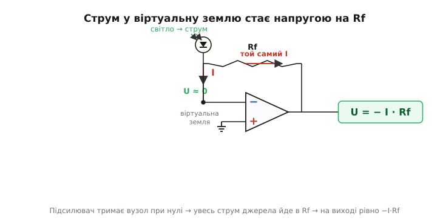
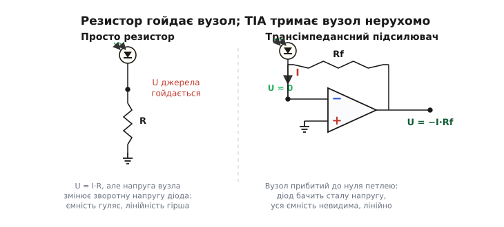
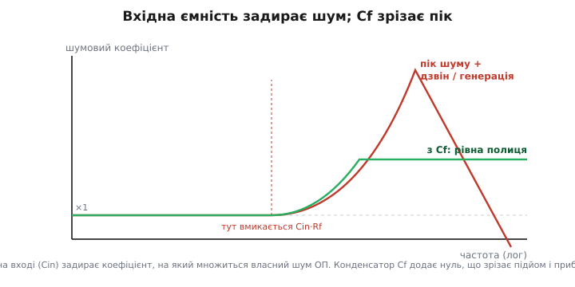
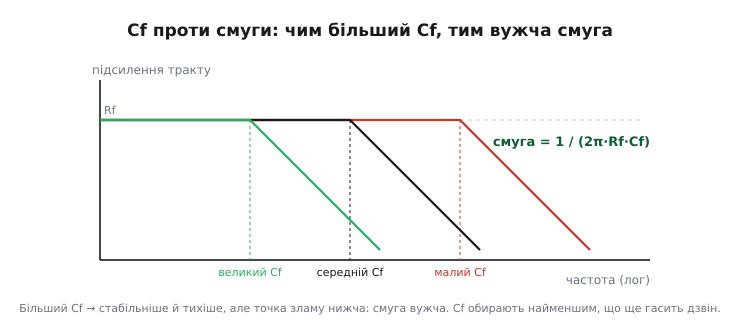

# Трансімпедансний підсилювач: як перетворити крихітний струм на чесну напругу

Фотодіод під слабким світлом віддає струм у кілька наноампер. Захочете зміряти його звичним способом — пропустити крізь резистор і дивитися на напругу — і впораєтеся в халепу. Щоб із трьох наноампер вийшла пристойна напруга, скажімо один вольт, треба резистор на 300 мегаомів. Він і справді дасть вольт. Але такий величезний опір разом із крихітною ємністю діода й проводів утворює мляву RC-ланку, що розмазує будь-який швидкий спалах у повільний горб; до того ж напруга на резисторі гойдає сам діод, міняючи його зворотну напругу, а з нею — ємність і темновий струм. Сигнал є, та він спотворений, повільний і брудний. Потрібен спосіб дістати з джерела його струм, **не дозволяючи напрузі на ньому ворушитися**. Саме це робить трансімпедансний підсилювач.

**Трансімпедансний підсилювач** (англ. *transimpedance amplifier*, скорочено TIA; від лат. *trans-* — «через», і *impedance* — повний опір) — це перетворювач **струму на напругу**: на вхід тече струм, на виході постає пропорційна йому напруга. Назва каже про суть прямо. Імпеданс — це відношення напруги до струму в одному й тому самому місці; «транс-» означає, що тут напруга й струм беруться **в різних місцях** — струм на вході, напруга на виході. Коефіцієнт такого перетворення має розмірність опору (вольти на ампери, тобто оми) і зветься **трансімпедансом**. Тому коли інженер каже «трансімпеданс 1 мегаом», він каже: «на кожен мікроампер вхідного струму отримаю один вольт на виході».

> 🔧 **Навіщо це.** Сила-силенна давачів віддає не напругу, а струм: фотодіоди, фотопомножувачі, піроелектрика, іонізаційні камери, деякі давачі магнітного поля. Цей струм буває мізерним — пікоампери й наноампери — і має широкий розмах. Прочитати його «в лоб» резистором означає або втратити швидкість, або спотворити джерело. TIA — стандартна відповідь усієї слабкосигнальної техніки: він віддає джерелу те, що йому потрібно (нерухому напругу на виводах), а нам — те, що потрібно нам (чисту напругу, готову для АЦП). Від лазерного далекоміра й оптичного приймача до люксметра й рентгенівського детектора — скрізь, де треба точно зміряти малий струм, на вході стоїть трансімпедансний підсилювач.

## Найпростіша схема — і чому вона працює

Уся конструкція до смішного коротка: операційний підсилювач, один резистор Rf зі зворотного зв'язку (англ. *feedback* — зворотний зв'язок) з виходу на інвертувальний вхід, і джерело струму, під'єднане до цього самого інвертувального входу. Неінвертувальний вхід сидить на землі. Усе. Магія не в кількості деталей, а в тому, що з них робить зворотний зв'язок.

Щоб зрозуміти, як це працює, треба тримати в голові дві властивості [ідеального операційного підсилювача](book:electronics/ideal-opamp): він має величезне підсилення й майже не бере струму через входи. На цих двох речах усе й тримається. Підсилювач дивиться на різницю напруг між своїми входами й несамовито її підсилює. Якщо охопити його [від'ємним зворотним зв'язком](book:electronics/negative-feedback) — провести шлях із виходу назад на інвертувальний вхід, — підсилювач почне робити те, заради чого його так люблять: **він рухатиме свій вихід так, щоб різниця на входах стала майже нульовою**. Бо щойно вона відхилиться, гігантське підсилення штовхне вихід у бік, що цю різницю гасить.

> Чому будь-який підсилювач, охоплений від'ємним зворотним зв'язком, сам заганяє різницю на входах у нуль і утримує її там; що таке «віртуальне коротке» між входами і чому воно тим точніше, чим більше підсилення — у статті [від'ємний зворотний зв'язок](book:electronics/negative-feedback). Тут ми беремо цей висновок як готовий важіль.

Неінвертувальний вхід прибито до землі — отже, нуль. Підсилювач намагатиметься зробити так, щоб і на інвертувальному вході було стільки ж. А інвертувальний вхід — це той самий вузол, куди тече наш струм. Виходить, що підсилювач **сам, своїми зусиллями, тримає вхідний вузол при нулі вольтів**, хоча дроту на землю там немає. Це й називають [віртуальною землею](book:electronics/virtual-ground): точка, що поводиться як заземлена (нуль вольтів), хоча тримає її не провід, а робота зворотного зв'язку.

> Чому вузол біля інвертувального входу сидить майже точно на нулі без жодного дроту до землі, чому в нього «нікуди не дітися» струмові й де ця ілюзія ламається на реальному підсилювачі — у статті [віртуальна земля](book:electronics/virtual-ground).

Тепер найголовніше — куди подінеться струм. На вузол віртуальної землі тече струм I з джерела. У сам підсилювач він зайти не може: входи ідеального ОП струму не беруть. Лишається єдина дорога — крізь резистор Rf на вихід. **Весь струм джерела, до останнього наноампера, протікає через Rf.** А раз ми знаємо струм крізь резистор і знаємо, що з боку вузла на ньому нуль вольтів, напруга на виході випливає сама з [закону Ома](book:electronics/ohms-law):

```
U(вих) = U(вузол) − I · Rf = 0 − I · Rf = − I · Rf
```


*Підсилювач утримує вхідний вузол при нулі вольтів. Струму джерела нікуди дітися, окрім як крізь Rf, тож на виході постає рівно −I·Rf. Трансімпеданс схеми — це просто опір Rf.*

Ось і вся ідея. Трансімпеданс цієї схеми дорівнює **рівно Rf** — резистору зворотного зв'язку, і нічому більше. Хочемо вольт на мікроампер — ставимо мегаом. Хочемо вольт на наноампер — ставимо гігаом. Знак «мінус» означає лише, що додатний вхідний струм (затікає у вузол) дає від'ємну вихідну напругу; на практиці його прибирають вибором полярності діода або наступним інвертором, і про нього часто навіть не згадують.

Зверніть увагу, яка це чесна, проста відповідь. Коефіцієнт перетворення не залежить ні від підсилення самого ОП (аби воно було велике), ні від ємностей, ні від температури переходу — лише від одного резистора, який можна взяти точним. Усю невизначеність джерела зведено до якості одного Rf. Це загальна риса схем зі зворотним зв'язком: вони міняють **силу** підсилювача на **передбачуваність**, віддаючи точність у руки кільком пасивним деталям.

## Чому не просто резистор

Може здатися, що ми ускладнили на рівному місці: резистор сам по собі теж перетворює струм на напругу за законом Ома, навіщо припрягати цілий підсилювач? Різниця — у тому, **що відбувається з напругою на самому джерелі**, і вона вирішальна.

Якщо повісити резистор просто від діода на землю, то струм, протікаючи крізь нього, **підіймає напругу на вузлі**: чим більший струм, тим вища напруга на тому самому виводі діода. А фотодіод — деталь норовлива: його власна ємність переходу й темновий струм залежать від прикладеної до нього зворотної напруги. Гойднули напругу на ньому сигналом — і ємність, і темновий струм попливли разом із нею. Виходить нелінійність і повільність: щоб напрузі на вузлі змінитися, треба перезарядити ємність діода крізь той самий великий опір, а це повільно.

TIA прибирає цю біду в корені. Завдяки віртуальній землі напруга на вході **не ворушиться зовсім** — хоч би як стрибав струм, вузол лишається на нулі, бо підсилювач негайно зливає весь струм у Rf, не даючи вузлу зарядитися. Діод увесь час бачить ту саму (нульову) напругу на собі, його ємність і темновий струм стоять як укопані, а вихід реагує миттєво, бо ємності діода нікуди заряджатися — напруга на ній стала.


*Голий резистор перетворює струм на напругу, та сама ця напруга гойдає джерело — пливе ємність, страждає лінійність і швидкість. Трансімпедансний підсилювач прибиває вузол до нуля петлею зворотного зв'язку: джерело бачить сталу напругу, його ємність наче зникає.*

Ось у чому головна вигода, заради якої терплять зайвий підсилювач: TIA **розв'язує** опір перетворення й навантаження на джерело. Резистор Rf можна взяти величезним, щоб дістати велике підсилення, і це **не** сповільнить вузол, бо вузол усе одно прибито до нуля, а ємності діода нема куди заряджатися крізь Rf. Голий же резистор такого не вміє: там великий опір і велика ємність нерозлучні, і добра чутливість завжди йде в парі з кепською швидкістю.

## Джерело — це струм поряд із ємністю

Поки ми малювали джерело простою стрілкою струму, усе виглядало бездоганно. Реальний фотодіод (і будь-яке струмове джерело) ховає одну деталь, що згодом улаштує нам найбільший клопіт: **поряд зі струмом у нього сидить ємність**. Зворотно зміщений перехід — це, по суті, конденсатор; додайте ємність корпусу, доріжок, входу підсилювача — і набереться від кількох до сотень пікофарад. Тож чесна модель джерела — не сама стрілка струму, а стрілка струму **в парі з конденсатором Cin**, увімкненим від вузла на землю.

Ця вхідна ємність Cin складається з кількох доданків, і всі вони сидять паралельно на вузлі віртуальної землі:

```
Cin = Cj (перехід діода) + Cm (вхід ОП) + Cстрей (доріжки, монтаж)
```

На постійному струмі й повільних сигналах конденсатор — розрив, його ніби й немає: весь струм іде в Rf, як і обіцяно, формула −I·Rf тримається. Та що швидше міняється сигнал, то відчутніша ця ємність — і саме вона перетворює нашу ідилічну схему на потенційний генератор. Щоб зрозуміти небезпеку, треба подивитися на схему не очима сигналу, а очима зворотного зв'язку: наскільки міцно петля тримає вузол на високих частотах.

## Підступ: вхідна ємність розхитує петлю

Ось де ховається головна тонкість усієї теми, і її варто прожити повільно, бо саме на ній спотикаються всі, хто збирає TIA вперше: він заводиться в генерацію або дзвенить, хоча «на папері» бездоганний.

Подивимося на власний шум підсилювача — крихітну напругу, що ніби з'являється на його вході. Підсилювач підносить цю напругу на вихід із коефіцієнтом, який заведено звати **шумовим** (англ. *noise gain*) — це підсилення схеми для сигналу, прикладеного до входу ОП. На низьких частотах вузол бачить лише резистор Rf, шумовий коефіцієнт малий і сталий. Але на високих частотах опір конденсатора Cin падає (ємність — то менший опір, що вища частота), і ця ємність на вході разом із резистором Rf починає **задирати шумовий коефіцієнт угору**: з певної частоти зламу він росте, наче схема дедалі дужче підсилює власний шум підсилювача. Частота, де починається цей підйом, задається саме вхідною ємністю й резистором:

```
fz = 1 / (2π · Rf · Cin)
```

Сам собою підйом шуму — півбіди. Справжня загроза в тому, що цей самий підйом коефіцієнта зустрічається з **падінням** власного підсилення ОП. У будь-якого реального операційного підсилювача підсилення з частотою спадає — це його [добуток підсилення на смугу](book:electronics/gain-bandwidth-product). І ось дві криві йдуть назустріч: шумовий коефіцієнт схеми лізе вгору, доступне підсилення ОП падає вниз. Там, де вони перетинаються, петля зворотного зв'язку зустрічає **подвійне відставання фази** — одне від ємнісного вузла на вході, друге від внутрішнього спаду ОП. Два відставання по дев'яносто градусів дають усі сто вісімдесят, а це для від'ємного зворотного зв'язку — фатальна цифра: він обертається на **додатний**, і схема або дзвенить на сходинку, або зривається в стійку генерацію.

> Чому в кожного реального ОП підсилення падає з частотою по 20 дБ на декаду, що таке добуток підсилення на смугу й чому він сталий — у статті [добуток підсилення на смугу](book:electronics/gain-bandwidth-product). Саме цей спад, зустрівшись із підйомом від вхідної ємності, і ставить TIA на межу стійкості.

Корінь біди varto назвати прямо: **велика вхідна ємність — ворог стійкості TIA, і що тихіший та чутливіший канал (більший Rf, більший діод), то гостріша загроза.** Великий Rf тягне частоту зламу вниз, великий Cin — теж; обидва бажані для чутливості й обидва наближають перетин кривих до небезпечної зони. Тому стійкість TIA — не дрібний клопіт «під кінець», а те, що проєктують від самого початку, поряд із вибором Rf.

## Ліки: конденсатор Cf через резистор

Рятунок виявляється так само простим, як і сама схема: паралельно резистору Rf ставлять невеликий конденсатор Cf. Один конденсатор — і генерація зникає. Подивимося, чому він діє, бо за цим стоїть гарна й точна думка, а не випадковий підбір.

Конденсатор Cf, увімкнений паралельно Rf, додає у зворотний зв'язок **нуль** — частоту, з якої зростання шумового коефіцієнта припиняється й крива вирівнюється в полицю замість того, щоб лізти вгору до перетину. Іншими словами, Cf не дає шумовому коефіцієнтові дорости до небезпечного перетину з падаючим підсиленням ОП: він зрізає підйом саме там, де треба, і петля знову зустрічає падаюче підсилення на безпечному, пологому куті. Фазове відставання вузла гаситься випередженням, яке вносить Cf, — і сумарний запас фази повертається в здорові межі.


*Вхідна ємність задирає коефіцієнт, на який множиться власний шум підсилювача; без компенсації крива стрімко росте, дає пік і дзвін аж до генерації. Конденсатор Cf додає нуль, що зрізає підйом і тримає шумовий коефіцієнт на рівній полиці — схема стає стійкою.*

Та задарма нічого не буває. Той самий Cf, що рятує стійкість, паралельно з Rf утворює власну RC-ланку — і вона ставить **верхню межу смуги** всього перетворювача. Корисний сигнал тепер котиться вниз, починаючи з частоти:

```
f(−3дБ) = 1 / (2π · Rf · Cf)
```

Звідси видно прямий компроміс, навколо якого крутиться весь розрахунок TIA: **більший Cf — спокійніша, тихіша, надійніше стійка схема, але вужча смуга; менший Cf — ширша смуга, але ближче до дзвону й генерації.** Інженерне мистецтво тут — узяти Cf **найменшим із тих, що ще певно гасять дзвін**: ні на йоту більше, бо кожен зайвий пікофарад відкушує швидкодію.


*Підсилення тракту тримається на полиці Rf до частоти зламу, заданої Cf, а тоді спадає. Більший Cf зсуває злам ліворуч — смуга вужча, зате запас стійкості більший. Оптимальний Cf — найменший, при якому вже немає дзвону.*

Є й чесна золота середина — значення Cf, що дає **максимально пласку** характеристику (її звуть баттервортівською, на честь інженера Стівена Баттерворта, що описав такі фільтри 1930 року): без горба-піку, але й без зайвого завалу, на самій межі спокою. Її беруть так, щоб нуль від Cf лягав приблизно туди, де шумовий коефіцієнт перетинає падаюче підсилення ОП; виходить компактна формула через вхідну ємність, опір і добуток підсилення на смугу ОП (f_GBW):

```
Cf ≈ √( Cin / (2π · Rf · f_GBW) )
```

Це не священна константа, а добрий стартовий орієнтир: він кладе запас фази десь у район сорока п'яти — шістдесяти градусів. Точне значення доводять уже на стенді, дивлячись на перехідну характеристику: трохи замало Cf — лишиться дзвін, трохи забагато — фронт стане млявим.

> Як саме вхідна ємність задає підйом шумового коефіцієнта, звідки береться подвійне відставання фази на перетині кривих, як вивести оптимальний Cf для баттервортівського відгуку й порахувати запас фази — покрокове виведення у вставці [стійкість TIA та вибір Cf](book:electronics/transimpedance-amplifier/math-tia-stability.md). Там показано через петльове підсилення, чому формула Cf саме така, і як її підлаштувати під потрібний запас фази.

## Шум: чому великий Rf — це добре

З резистором перетворення Rf пов'язана ще одна приємна несподіванка, що остаточно виправдовує всю конструкцію. Здавалося б, ставлячи гігантський Rf, ми наражаємося на великий [тепловий шум](book:electronics/resistor-noise) — адже шумова напруга резистора росте з опором. Так, росте — але як корінь, а корисний сигнал росте **прямо**. І ця різниця темпів грає на нас.

Корисна напруга на виході дорівнює I·Rf — зростає **лінійно** з Rf. Теплова шумова напруга самого Rf зростає лише як **корінь** із Rf (вона пропорційна √(4kT·Rf·B)). Поділіть одне на одне — і відношення сигнал/шум, зведене до Rf, поліпшується як √Rf:

```
сигнал  ∝ Rf
шум Rf  ∝ √Rf
відношення  ∝  Rf / √Rf  =  √Rf
```

Звідси правило, що рятує чутливі канали: **усе підсилення треба брати в першому ж резисторі перетворення Rf, а не докручувати наступними каскадами.** Великий Rf дає і потрібний рівень сигналу, і найкращий можливий внесок теплового шуму на ват сигналу. Якщо ж поскупитися на Rf і добирати підсилення далі, наступні каскади піднімуть і сигнал, і вже домішаний шум однаково — а власний тепловий шум малого Rf так і лишиться більшим відносно сигналу. Тому в добрих TIA Rf беруть таким великим, як тільки дозволяють потрібна смуга й розмах сигналу.

> Чому кожен резистор сам породжує шумову напругу √(4kT·R·B), чому вона росте лише як корінь з опору й чому це робить великий Rf вигідним для чутливості — у статті [тепловий шум резистора](book:electronics/resistor-noise). Саме корінева залежність дарує трансімпедансному входу його чутливість.

Є, щоправда, й другий бік, про який ми вже говорили: вхідна ємність Cin задирає шумовий коефіцієнт на високих частотах, тож **власний шум напруги** самого ОП на верху смуги множиться сильніше. Тому для TIA з великою вхідною ємністю обирають підсилювач не лише з малим струмовим шумом входу, а й з малим шумом напруги — і саме конденсатор Cf, обмежуючи смугу, заразом обрізає цей піднятий шум зверху, не даючи йому накопичитися. Вибір Rf, Cf і самого ОП — це завжди спільний компроміс між чутливістю, смугою, стійкістю й шумом.

## Порахуймо в числах

Абстракція стає відчутною, щойно підставити реальні величини. Візьмімо типову задачу — прочитати фотодіод — і пройдімо весь розрахунок: підсилення, смуга, потрібний Cf.

**Трансімпеданс і смуга для фотодіода.** Фотодіод дає до 2 мкА під робочим світлом, його ємність переходу 50 пФ, вхід ОП додає ще 5 пФ, монтаж 5 пФ. Хочемо на виході розмах до 2 В і пласку смугу хоча б до 100 кГц. Який Rf і який Cf?

```
бажаний вихід:   U(вих) = I·Rf  →  Rf = U / I = 2 В / 2.0×10⁻⁶ А = 1.0×10⁶ Ом = 1 МОм
повна вхідна ємн.: Cin = 50 + 5 + 5 = 60 пФ = 6.0×10⁻¹¹ Ф
Cf під смугу 100 кГц:  Cf = 1 / (2π · Rf · f) = 1 / (2π · 1.0×10⁶ · 1.0×10⁵)
                        Cf ≈ 1.59×10⁻¹² Ф ≈ 1.6 пФ
```

Отже, мегаомний Rf дає рівно потрібний вольтаж, а конденсаторик у пару пікофарад ставить смугу 100 кГц. Лишилося звірити, чи цих 1.6 пФ досить **для стійкості** при ОП із, скажімо, добутком підсилення на смугу 10 МГц:

```
орієнтир стійкості:  Cf(min) = √( Cin / (2π · Rf · f_GBW) )
                      = √( 6.0×10⁻¹¹ / (2π · 1.0×10⁶ · 1.0×10⁷) )
                      = √( 6.0×10⁻¹¹ / 6.28×10¹³ )  =  √(9.55×10⁻²⁵)
                      ≈ 9.8×10⁻¹³ Ф ≈ 0.98 пФ
```

Орієнтир стійкості вимагає щонайменше близько 1 пФ, а ми вже ставимо 1.6 пФ заради смуги — отже, схема й стійка, і вкладається в потрібні 100 кГц. Якби стійкість вимагала більше, ніж дозволяє смуга, довелося б або взяти ОП із більшим f_GBW, або зменшити Rf і добрати підсилення пізніше, або погодитися на вужчу смугу.

А тепер те саме в робочому коді — як це рахують у прошивці приладу, що сам підбирає компоненти або перевіряє готовий каскад:

**Підбір Cf і перевірка смуги.** Порахуймо обидва значення Cf — під задану смугу й під стійкість — і візьмімо більше з них, тоді покажемо, яка реальна смуга вийде.

```c
#include <math.h>

// Усе в одиницях СІ: оми, фаради, герци, ампери, вольти.
typedef struct {
    float Rf;       // резистор перетворення, Ом
    float Cin;      // повна вхідна ємність (діод + ОП + монтаж), Ф
    float f_gbw;    // добуток підсилення на смугу ОП, Гц
} TiaSpec;

// Cf, потрібний для заданої смуги −3 дБ
static float cf_for_bandwidth(float Rf, float bw_hz) {
    return 1.0f / (2.0f * (float)M_PI * Rf * bw_hz);
}

// Cf-орієнтир для максимально плаского (баттервортівського) відгуку — нижня межа стійкості
static float cf_for_stability(const TiaSpec *s) {
    return sqrtf(s->Cin / (2.0f * (float)M_PI * s->Rf * s->f_gbw));
}

// Реальна смуга −3 дБ при обраному Cf
static float bandwidth_of(float Rf, float Cf) {
    return 1.0f / (2.0f * (float)M_PI * Rf * Cf);
}

void choose_tia(const TiaSpec *s, float want_bw_hz) {
    float cf_bw  = cf_for_bandwidth(s->Rf, want_bw_hz);  // ≈ 1.6 пФ
    float cf_min = cf_for_stability(s);                  // ≈ 1.0 пФ
    // беремо більший: він і смугу обмежить, і стійкість забезпечить
    float Cf = (cf_bw > cf_min) ? cf_bw : cf_min;
    float real_bw = bandwidth_of(s->Rf, Cf);             // фактична смуга
    // Rf = 1 МОм, Cf ≈ 1.6 пФ, реальна смуга ≈ 100 кГц
    (void)real_bw;
}
```

Логіка коду — це логіка проєктування: порахувати обидва Cf, узяти більший (щоб задовольнити суворіший із двох вимог), і подивитися, яку смугу це дає насправді. Якщо стійкість тягне Cf вище, ніж дозволяє бажана смуга, прошивка приладу могла б тут і попередити інженера: «з цим ОП потрібну смугу не витягнути — бери швидший підсилювач».

## Де він стоїть

Трансімпедансний підсилювач — не екзотика, а робоча конячка всюди, де давач віддає струм. Найвідоміше місце — **оптичний приймач**: на кінці оптоволокна сидить фотодіод, його струмові спалахи (світло то є, то нема) TIA перетворює на напругу, яку далі читає компаратор чи АЦП. Швидкі TIA в таких приймачах працюють на гігагерцах і визначають, наскільки далеко й швидко можна передати дані по волокну.

Поряд — уся **оптична вимірювальна техніка**: люксметри, спектрофотометри, пульсоксиметри, лазерні далекоміри, детектори диму, рентгенівські й сцинтиляційні лічильники. Скрізь у них фотодіод чи фотопомножувач віддає струм, пропорційний світлу, а TIA робить із нього напругу. У радіаційних і ємнісних давачах, де сигнал — це короткий **заряд**, а не сталий струм, застосовують близького родича TIA — зарядочутливий підсилювач, де у зворотному зв'язку стоїть конденсатор замість резистора, і вихід пропорційний зібраному заряду.

> TIA з конденсатором замість Rf у зворотному зв'язку інтегрує вхідний струм і віддає напругу, пропорційну зібраному **заряду** — це [зарядочутливий підсилювач](book:electronics/charge-amplifier), основа лічильників частинок і п'єзодавачів. Корінь — той самий: віртуальна земля приймає весь струм джерела, лише замість «струм → напруга» виходить «заряд → напруга».

Сам фотодіод, який цей струм віддає, — окрема цікава деталь: переходом, освітленим світлом, тече струм, пропорційний потокові фотонів. Як саме світло народжує цей струм і чому в режимі короткого замикання (а віртуальна земля TIA — це майже коротке замикання для діода) діод найлінійніший — тема про сам [фотоелектричний перетворювач](book:electronics/photovoltaic-cell). Для TIA важливо одне: на вході сидить майже ідеальне джерело струму поряд із ємністю — рівно той випадок, заради якого схему й вигадали.

> Як перехід під світлом віддає струм, пропорційний освітленню, і чому в режимі короткого замикання (саме його дає віртуальна земля) фотострум найлінійніший — у статті [фотоелектричний перетворювач](book:electronics/photovoltaic-cell). TIA любить цей режим тим, що тримає на діоді нуль вольтів і бере весь його струм.

Сама ж ідея перетворити струм на напругу одним резистором у зворотному зв'язку народилася разом із операційними підсилювачами й набула широкого вжитку наприкінці 1960-х — на початку 1970-х саме завдяки оптичним приймачам: волоконна оптика тоді стрімко росла, і фотострум треба було чимось швидко й чисто читати. Хто й коли вперше зібрав цей вузол, як він прийшов з аналогових обчислювачів у приймачі зв'язку — окрема історія: [звідки взявся трансімпедансний підсилювач](book:electronics/transimpedance-amplifier/hist-tia-origin.md).

> Як перетворювач струму на напругу виріс із від'ємного зворотного зв'язку, чому його широко взяли на озброєння оптичні приймачі межі 1960–70-х і яку роль зіграла волоконна оптика — у вставці [звідки взявся трансімпедансний підсилювач](book:electronics/transimpedance-amplifier/hist-tia-origin.md). Подано за перевіреними даними, з розрізненням ідеї, реалізації та патентів.

## Що варто винести

Трансімпедансний підсилювач перетворює **струм на напругу**: операційний підсилювач тримає вхідний вузол на віртуальній землі, увесь струм джерела змушений пройти крізь резистор зворотного зв'язку Rf, і на виході постає рівно −I·Rf. Трансімпеданс схеми дорівнює одному резисторові Rf — звідси точність і передбачуваність. Перевага над голим резистором у тому, що джерело бачить **нерухому** напругу: ємність діода й темновий струм не пливуть, перетворення лишається лінійним і швидким навіть за величезного Rf. Розплата — стійкість: вхідна ємність Cin задирає шумовий коефіцієнт на високих частотах, той зустрічається з падаючим підсиленням ОП, набігає подвійне відставання фази, і схема дзвенить чи генерує. Ліки — конденсатор Cf паралельно Rf: він додає нуль, зрізає підйом і повертає запас фази, але ставить верхню смугу f₋₃dB = 1/(2π·Rf·Cf), тож Cf беруть найменшим, що ще гасить дзвін (орієнтир — Cf ≈ √(Cin/(2π·Rf·f_GBW)) для максимально плаского відгуку). Щодо шуму великий Rf вигідний: сигнал росте з Rf прямо, а тепловий шум — лише як корінь, тож усе підсилення беруть у Rf, а не в наступних каскадах. Хто тримає в голові цей чотирикутник — Rf для чутливості, Cf для стійкості, Cin як ворог, шум як межу, — той збере трансімпедансний вхід, що й бачить наноампери, і не дзвенить.

---
