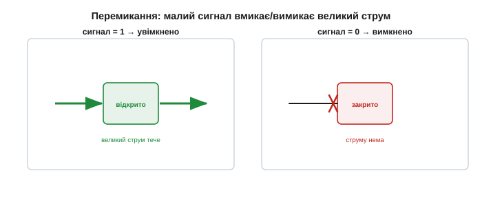
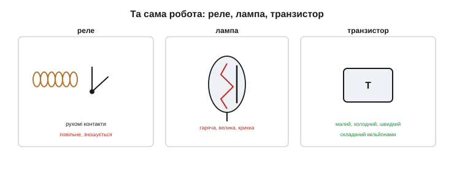

# Транзистор: ідея керованого «крана» струму

Перш ніж відкривати транзистор і дивитися, що в нього всередині, схопімо головну **ідею** — без неї деталі будови нічого не варті. А ідея напрочуд проста: транзистор — це **кран для струму**, яким керують електрично. Невеликий сигнал на одному виводі **відчиняє або причиняє** великий струм через інші. Мала дія керує великою — оце і вся суть, з якої народилася ціла індустрія.

### Кран для струму

Уявіть водопровідний кран. Легкий поворот руки — і потужний потік води то ллється, то спиняється. Зверніть увагу на дві речі. По-перше, **ви не даєте воді енергії** — її дає тиск у трубі; ваша рука лише **керує** потоком, не створюючи його. По-друге, мале зусилля керує великим потоком: пальцем ви спиняєте струмінь, що збив би вас із ніг.

Транзистор робить **точно те саме**, але зі струмом і без жодних рухомих частин. Слабкий керувальний сигнал відчиняє чи причиняє сильний струм, що тече від джерела живлення крізь прилад. Кран — рукою; транзистор — електрикою.

Та сама ідея живе в багатьох образах. Засувка греблі: мала лебідка піднімає щит, а крізь нього суне ціла ріка. Важіль: легким натиском на довге плече зрушуєш величезну вагу. Спільне всюди — **керування**, а не створення: маленький вплив **спрямовує** велику силу, що вже напоготові. Транзистор — найчистіше втілення цього принципу в електриці: ні важелів, ні щитів, лише слабкий сигнал, що править сильним струмом. І в цьому його головна перевага над механічним краном чи реле: керувати можна **блискавично** й **без зносу**, бо рухається не залізо, а самі заряди в кристалі. Те, що рукою робиться за секунди, транзистор робить електрикою мільярди разів за ту саму секунду.

*Рис. Як легкий поворот крана керує потужним потоком води (а воду жене тиск у трубі, не рука), так слабкий сигнал у транзисторі керує сильним струмом (а струм жене джерело живлення). Мала дія — великий наслідок.*

### Три виводи: два для потоку, один для керування

У [діода](book:electronics/rectification) — **два** виводи. У транзистора — **три**, і це принципово. Два з них утворюють шлях для **головного, великого** струму (наче вхід і вихід труби), а третій — **керувальний**: те, на що ми діємо слабким сигналом. Подаси трохи на керувальний вивід — і великий струм слухняно міняється.

*Рис. Транзистор має три виводи. Крізь два тече головний (великий) струм від джерела до навантаження; третій — керувальний. Слабкий сигнал на ньому задає, наскільки відкрито «кран».*

Як саме ці виводи звуться (база, колектор, емітер) і що діється в кристалі між ними — розкривають [будова BJT](book:electronics/bjt-structure) і [його робота](book:electronics/bjt-operation). Поки досить тримати в голові схему: **два виводи — потік, один — кермо**.

Чому саме три, а не два, як у діода? Бо двома виводами можна хіба пропускати чи не пропускати струм (клапан — це й є діод). А щоб струмом **керувати ззовні**, потрібен третій вивід — той, що «стоїть на дорозі» головного потоку й вирішує, скільки його пройде. Цей третій вивід і відрізняє транзистор від діода: керування, а не просто проходження. У крана теж три «виводи»: вода входить, вода виходить, а ручка керує. Транзистор — той самий пристрій, лише замість води струм, а замість ручки — електричний сигнал. Тримаючи цей образ, ви легко читатимете будь-яку транзисторну схему.

### Дві суперсили: підсилення й перемикання

З однієї здатності «мале керує великим» виростають **дві** речі, на яких стоїть уся електроніка.

**Підсилення.** Якщо слабкий сигнал змушує великий струм точно **повторювати** себе, то на виході маємо більшу, потужнішу копію входу. Тихий звук із мікрофона стає гучним у динаміку; ледь чутний радіосигнал — придатним до вжитку. Транзистор робить **більший образ** маленького сигналу.

*Рис. Слабкий вхідний сигнал керує великим струмом так, що той повторює його форму — виходить підсилена копія. Енергію для «гучнішого» бере джерело живлення; транзистор лише ліпить за слабким зразком сильну подобу.*

Підкреслимо слово **повторює**: добрий підсилювач робить копію, що відтворює форму входу без спотворень, лише більшу. Слабкий голос у телефоні, ледь чутна станція в антені, кволий сигнал давача — усе це транзистор робить достатньо сильним, щоб з ним можна було працювати: почути в динаміку, передати далі, виміряти. Від слухового апарата до радіотелескопа — скрізь та сама дія: маленьке робимо великим, не змінюючи його суті.

У числах це виражає [коефіцієнт підсилення](book:electronics/bjt-gain): крихітний керувальний струм породжує в десятки чи сотні разів більший головний, і саме це відношення й називають підсиленням. Образ той самий: повернув кран на крихту — потік змінився сильно, і та «крихта» та «сильно» зв'язані сталим множником.

**Перемикання.** А якщо керувати не плавно, а «навстіж»: малим сигналом **повністю** відчиняти й причиняти великий струм? Тоді транзистор стає **електронним ключем** — вимикачем без рухомих контактів, що клацає мільйони разів за секунду й не зношується. А ключ, що означає «увімкнено/вимкнено», — це **0 і 1**: атом усієї цифрової логіки. З мільярдів таких крихітних ключів складено кожен процесор.

*Рис. У режимі ключа транзистор не плавно регулює, а повністю відчиняє чи причиняє великий струм за малим сигналом. Це електронний вимикач без рухомих частин — і водночас «0/1» цифрової техніки.*

Перемикання здається скромнішим за підсилення — а насправді саме воно змінило цивілізацію. Електронний ключ не має контактів, що іскрять і зношуються; він спрацьовує за **мільярдні частки секунди** й витримує безліч перемикань. А коли «ввімкнено» назвати одиницею, а «вимкнено» — нулем, із таких ключів складають логіку («і», «або», «не»), з логіки — суматори, пам'ять, процесори. Сучасний чип — це **мільярди** транзисторів-ключів, що перемикаються мільярди разів за секунду. Уся цифрова техніка, по суті, — велетенський хор крихітних транзисторних вимикачів. Тож наступного разу, почувши про «штучний інтелект» чи «хмару», згадайте: під усім цим — фізичні транзистори-ключі, що мільярдами клацають нулі та одиниці. Уся нематеріальна на вигляд цифра стоїть на цьому матеріальному фундаменті.

### Активний прилад: енергію бере джерело

Тут — важлива межа. Класичні компоненти — [резистор](book:electronics/resistor), [конденсатор](book:electronics/capacitor), [котушка](book:electronics/inductor-coil), [діод](book:electronics/rectification) — **пасивні**: вони лише реагують. Вони можуть розсіювати, запасати, ділити чи спрямовувати енергію, але **ніколи не віддають сигналу більше, ніж у них увійшло**. Транзистор — **активний**: на виході сигнал може нести **більше** потужності, ніж керувальний сигнал на вході.

Звідки ж береться «зайва» потужність? Не з нічого — із **джерела живлення**. Транзистор не створює енергії (це порушувало б закон збереження); він слабким сигналом лише **модулює** великий потік, що його дає джерело, — як кран не створює воду, а керує потоком під тиском труби. Саме ця здатність — керувати великою потужністю малою — і відрізняє активну електроніку від пасивної.

*Рис. Пасивні R, L, C, діод тільки реагують — не дають більше, ніж дістали. Транзистор активний: слабкий сигнал керує великою потужністю від джерела, тож вихід може бути потужнішим за вхід. Енергію дає джерело, не транзистор.*

> 🔧 **Навіщо це.** «Активність» — не магія, а керування чужою силою. Транзистор-підсилювач не «додає» енергію в сигнал із повітря — він бере її з блока живлення й ліпить із неї потужну копію слабкого входу. Тому будь-який підсилювач потребує **живлення**: без нього транзисторові нічим керувати. Запам'ятайте це — і ніколи не чекатимете «підсилення» від схеми, у якій нема джерела потужності.

Кількісно цю «активність» вимірюють **коефіцієнтом підсилення**: у скільки разів вихідний сигнал більший за вхідний. Пасивний елемент має «підсилення» менше за одиницю (самі втрати); активний — більше за одиницю. Ця проста межа — чи може прилад дати на виході **більше**, ніж дістав на вході (за рахунок живлення), — і ділить усю електроніку на пасивну й активну. Транзистор — перший прилад по активний бік цієї межі.

Найнаочніший приклад — радіоприймач. Сигнал, що антена ловить з ефіру, мізерний: його потужності не стане навіть ворухнути мембрану навушника, не те що динаміка. Транзистор (із батареєю!) бере цей кволий сигнал за зразок і ліпить його потужну копію, здатну гриміти на всю кімнату. Енергію звуку дає батарея, форму — антена, а транзистор їх **поєднує**. Без активного приладу радіо лишилося б ледь чутним шепотом — власне, таким і був [детекторний приймач без підсилення](book:electronics/rectification): чути лише в навушник, притиснутий до вуха.

### Чим керують: струмом чи напругою

Наостанок — розвилка, яку варто знати наперед. Транзистори бувають двох великих родин, і різняться вони тим, **що** саме є керувальним сигналом. **Біполярний** транзистор (BJT) — герой цього розділу — керується невеликим **струмом**: крізь керувальний вивід має текти струмок, що й задає великий струм. **Польовий** транзистор (FET/MOSFET) [керується **напругою**](book:electronics/field-control), майже не споживаючи струму на керування. Обидва роблять те саме «мале керує великим» — лише кермо різне. Ми починаємо з біполярного.

Це не дрібниця: керування **струмом** означає, що біполярний транзистор постійно «з'їдає» трохи струму на саме керування, тоді як польовий керується майже задарма — самим полем, як натякає його назва (адже [електричне поле](book:physics/electric-field) розводить заряди без споживання струму). Звідси й різні сфери їхнього вжитку.

### Чому це революція

Варто згадати, чим керували великим струмом **до** транзистора. Або механічним **реле** чи вимикачем — повільним, із рухомими контактами, що іскрять і зношуються. Або **електронною лампою** — гарячою, великою, крихкою. Транзистор робить те саме, але **твердотільно**: він крихітний, холодний, швидкий, надійний і — головне — його можна штампувати мільйонами на одному кристалі. Та сама робота, але незрівнянно дешевше, менше й надійніше — ось чому транзистор, а не його попередники, дав нам комп'ютери й смартфони.

*Рис. Керувати великим струмом за малим сигналом уміли й реле (рухомі контакти — повільно, зношується), і лампа (гаряча, велика, крихка). Транзистор робить це твердотільно: малий, холодний, швидкий, дешевий, складаний мільйонами. Звідси й перемога.*

Щоб відчути масштаб: одна лампа була завбільшки з палець, а в сучасний чип розміром із ніготь уміщають **десятки мільярдів** транзисторів. Якби кожен був лампою, такий «процесор» зайняв би не одну будівлю, споживав би потужність міста й перегорав би щосекунди. Транзистор не просто замінив лампу — він зробив можливим те, про що з лампами годі було й мріяти.

Транзистори всюди, хоч їх і не видно: у підсилювачі навушників, у радіомодулі телефона, у кожному логічному вентилі процесора, у драйвері, що крутить мотор. Здебільшого вони сховані всередині мікросхем — мільярди заразом, — але це ті самі «крани для струму», які ми розбираємо тут поодинці. І ще одне, головне: доти електроніка вміла лише **обробляти** наявне — ділити, фільтрувати, випрямляти; транзистор дав їй змогу **підсилювати** й **вирішувати**, а отже — обчислювати, запам'ятовувати, реагувати. Усе «розумне» довкола починається саме тут, із простого «мале керує великим».

### Ідея, з якої все росте

Отже, транзистор — це керований електрикою кран для струму: мала дія керує великою, а з цього ростуть підсилення й перемикання. Це його суть. А втілює він її напрочуд економно: усередині — лише [два близькі PN-переходи](book:physics/pn-junction) й тонесенький шар між ними, і саме ця будова робить так, що слабкий сигнал на одному виводі править великим струмом через інші. Сам собою образ крана вже дає інтуїцію, з якою читається будь-яка транзисторна схема; будова ж пояснює, **звідки** ця здатність береться.

---
