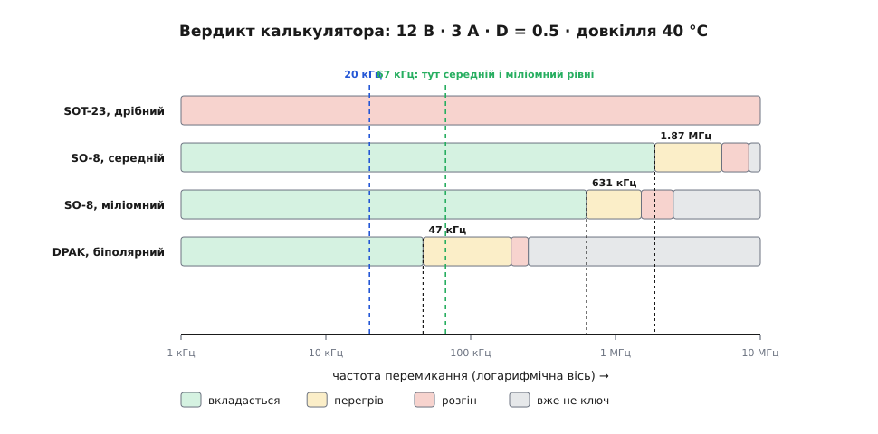
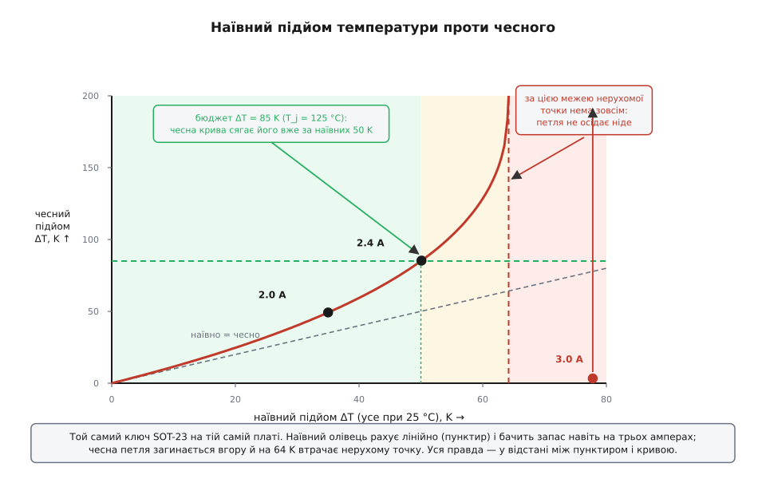

# ⚙️ Калькулятор бюджету втрат: хто витримає й до якої частоти

На столі лежать чотири прилади, і всі чотири нібито годяться на ту саму роботу: комутувати 3 А з 12-вольтової шини, половину часу відкрито. Продавець скаже, що кожен «тягне до 5 ампер». Даташит кожного покаже гарне число на першій сторінці. А відповіді на єдине питання, яке насправді має значення, — **хто з них виживе в моєму корпусі й до якої частоти** — не дасть ніхто, бо ця відповідь залежить не від приладу, а від приладу **разом із** платою, довкіллям і частотою.

Дістати її можна за пів сторінки коду. Питання лише в тому, чи чесний це код: та сама арифметика, зроблена олівцем «як усі», відповість упевнено й неправильно — і саме на тому кандидаті, де помилитися найдорожче.

## Задача: чотири кандидати, один бюджет

Домовмося про коло й про бюджет, бо без них слово «підходить» не має змісту.

```
шина           E = 12 В
навантаження   I = 3 А
шпаруватість   D = 0.5          (половину часу відкрито)
довкілля       T_a = 40 °C      (усередині закритого корпусу, не в лабораторії)
бюджет         T_j ≤ 125 °C     (проєктна межа: зі 150 °C абсолютного максимуму
                                 знято 25 °C запасу)
драйвер        10 В, 0.5 А      (маленький, звичайний)
```

Кандидати — не марки, а чотири **типажі**, які реально трапляються на полиці. Числа біля кожного взяті з тих граф даташита, куди інженер справді заглядає.

| кандидат | опір R_ON / напруга насичення | тепловий хід: k = R(125)/R(25) | ціна керування | що задає фронт | R_θ (кристал→повітря) |
|---|---|---|---|---|---|
| SOT-23, дрібний | 68 мОм | 1.7 | Q_g = 8 нКл | Q_gd = 2.5 нКл | 250 K/Вт |
| SO-8, середній | 25 мОм | 1.7 | Q_g = 20 нКл | Q_gd = 6 нКл | 62 K/Вт |
| SO-8, міліомний | 6 мОм | 1.9 | Q_g = 65 нКл | Q_gd = 20 нКл | 62 K/Вт |
| DPAK, біполярний | 0.25 В при 3 А | +0.6 мВ/°C | I_б = 150 мА | розсмоктування, 400 нс | 70 K/Вт |

Придивіться до таблиці, і стане видно, чому оком тут нічого не вирішиш. Міліомний має вчетверо менший опір за середнього — але втричі більший заряд затвора, тобто втричі дорожчі фронти. Дрібний майже нічого не просить на керування — зате сидить у корпусі, крізь який тепло майже не тече. Біполярний узагалі грає за іншими правилами: він тримає не опір, а майже сталу напругу. Кожен виграє в одному й програє в іншому, а **де саме лежить точка обміну — це число**, і його треба порахувати.

І ще одне, найголовніше. У таблиці немає стовпчика «температура», хоч усі числа в ній — при 25 °C. Кристал при 25 °C не буває ніколи.

## Що саме рахуємо: чотири доданки, з яких два залежать від тепла

Розсіювана потужність збирається з чотирьох рахунків. Три перші прості, а четвертий — керування — рахують по-різному для польового й біполярного, бо вони й просять різне.

```
провідність   P_пров = I² · R_ON(T) · D            (польовий: опір)
              P_пров = U_нас(T) · I · D            (біполярний: напруга)

перехід       t_фр   = Q_gd / I_драйв              ← фронт задає ДРАЙВЕР
              E_фр   = ½ · E · I · t_фр
              P_пер  = 2 · f · E_фр                (два фронти за період)

керування     P_кер  = Q_g · U_драйв · f           (польовий: заряд за клац)
              P_кер  = I_б · U_бе · D              (біполярний: струм увесь час)

витік         P_вит  = E · I_вит(T) · (1 − D)
```

Рядок `t_фр = Q_gd / I_драйв` — перше місце, де олівець зазвичай бреше. У даташиті є графа `t_r`/`t_f` із гарними наносекундами, і її беруть як характеристику приладу. Насправді це не характеристика приладу, а протокол одного вимірювання: виробник міряв її своїм лабораторним драйвером через резистор у пару омів. Фронт триває рівно стільки, скільки ваш драйвер вигрібає **заряд Міллера** Q_gd із затвора: поки напруга на стоку падає, [затвор сидить на плато](book:electronics/miller-effect) і весь струм драйвера йде на перезаряд ємності затвор–стік. Половина ампера й 6 нКл дають 12 нс — і жодне число з даташита тут ні до чого. Поставите замість [драйвера](book:electronics/gate-driver) ніжку мікроконтролера на 20 мА — той самий прилад матиме фронт 300 нс і в двадцять п'ять разів дорожчі переходи.

Два з чотирьох доданків залежать від температури, і обидві залежності беремо **з даташита, а не з пам'яті**:

```
R_ON(T)   = R_ON(25) · k^((T − 25)/100)          k = R_ON(125)/R_ON(25) ≈ 1.5…1.9
I_вит(T)  = I_вит(25) · k_вит^((T − 25)/100)     k_вит — з нормованого графіка витоку
```

Форма однакова: показник, підігнаний під **дві надруковані точки** — при 25 °C і при 125 °C. Це не елегантно, зате чесно: рівно стільки, скільки [графіки даташита](book:electronics/datasheet-graphs) справді знають про прилад, і ні краплі більше.

> 🔧 **Навіщо це.** Коефіцієнт k — єдине число з усієї таблиці, яке ніколи не друкують цифрою: його доводиться зчитувати з нормованої кривої R_ON(T_j), яку більшість гортає, не зупиняючись. А саме він далі вирішить долю одного з кандидатів. Правило просте: якщо в моделі є температура, то кожен температурний коефіцієнт мусить мати джерело в даташиті — інакше ви моделюєте не прилад, а власні спогади про нього.

## Петля: чому тут не можна просто підставити число

Тепер зберімо все докупи — і виявиться, що зібрати не виходить.

Щоб порахувати `P`, треба знати температуру кристала `T`: від неї залежить `R_ON`. Щоб порахувати температуру, треба знати потужність: кристал тепліший за довкілля рівно на `P·R_θ`, де R_θ — [тепловий опір](book:physics/thermal-resistance) шляху назовні. Тобто:

```
T = T_a + R_θ · P(f, T)
```

Температура стоїть з обох боків. Це не рівняння, яке розв'язують підстановкою, — це **нерухома точка**: шукаємо таку T, що петля повертає саму себе. Аналітично її не витягти: T сидить у показнику `k^((T−25)/100)`, і олівець тут безсилий не через лінощі, а через будову виразу.

Зате витягається ітерацією. І ось місце, заради якого варто було все затівати: ітерувати треба **від довкілля вгору**, і це не «обраний за зручністю метод». Це модель самого нагріву. Холодний кристал вмикають — він гріється до `T_a + R_θ·P(T_a)`; на цій новій температурі опір уже більший, тож потужність більша, тож нагрів іще вищий; і так по колу. **Кожен крок циклу — оберт справжньої фізичної петлі**, тієї самої, якою кристал іде в перші секунди після вмикання.

З цього збігу випливає все інше, і воно того варте:

**Ітерація сходиться ⟺ кристал осідає.** Послідовність монотонно росте (кожен крок додає тепла) і впирається в найнижчу нерухому точку, якщо та існує. Реальний кристал робить рівно те саме — гріється знизу вгору й зупиняється на першій рівновазі, яку зустріне.

**Ітерація розбігається ⟺ рівноваги нема взагалі.** Не «метод не впорався» — а немає куди сходитися: крива `T_a + R_θ·P(T)` ніде не перетинає прямої `T`. Кристал у такому колі теж не зупиниться, бо зупинятися нема на чому. Це [тепловий розгін](book:electronics/thermal-runaway), і його видно на папері за секунду до того, як він стався б у металі.

**Підсилення петлі падає в руки задарма.** Візьміть відношення двох сусідніх кроків:

```
     ΔTₙ
M = ────       ΔTₙ = Tₙ₊₁ − Tₙ — наскільки підняв температуру n-й оберт петлі
    ΔTₙ₋₁
```

За теоремою про середнє це рівно похідна відображення десь між двома останніми температурами — тобто те саме [підсилення петлі](book:electronics/thermal-runaway/math-runaway-criterion.md), яке зазвичай виводять ланцюжком похідних. Жодного диференціювання, жодної окремої формули під кожну модель ключа: цикл сам звітує, наскільки він близький до краю. Тому й ознака розгону виходить безкоштовною — **крок перестав меншати за попередній**.

Усе це — звичайна [ітерація нерухомої точки](book:math/fixed-point-iteration), і вона тут не тому, що зручна, а тому, що збігається з фізикою крок у крок.

Лишилася стеля частоти. Утрати ростуть із частотою (доданки `f·E` тільки додають), температура росте з утрат, тож вердикт «вкладається» вимикається раз і назавжди: предикат монотонний за f. А монотонний предикат ділять [навпіл](book:algorithms/binary-search) — жодного перебору.

## Код

Обидві версії роблять те саме: описують полицю кандидатів, ганяють кожного крізь петлю й друкують вердикт. Пітон — бо це розрахунок за столом, який хочеться дописати за вечір; C++ — бо той самий цикл лягає у прошивку приладу, що сам стежить за власною температурою й опускає частоту, коли стає гаряче.

:::tabs
```python
import math
from dataclasses import dataclass
from enum import Enum


@dataclass(frozen=True)
class Circuit:
    """Коло, у якому працює ключ, і бюджет, у який він мусить улізти."""
    v_bus: float      # напруга шини, В
    i_load: float     # струм навантаження, А
    duty: float       # шпаруватість — частка часу у відкритому стані
    t_amb: float      # температура довкілля всередині корпусу, °C
    t_j_max: float    # проєктна межа температури кристала, °C
    v_drive: float    # амплітуда керування затвором, В
    i_drive: float    # струм драйвера затвора, А


@dataclass(frozen=True)
class Losses:
    """Чотири рахунки нарізно — щоб бачити, хто саме гріє."""
    cond: float
    sw: float
    drive: float
    leak: float

    @property
    def total(self) -> float:
        return self.cond + self.sw + self.drive + self.leak


@dataclass(frozen=True)
class Mosfet:
    name: str
    r_on_25: float    # опір відкритого каналу при 25 °C, Ω
    r_on_k: float     # R_ON(125 °C)/R_ON(25 °C) — з нормованого графіка даташита
    q_g: float        # повний заряд затвора, Кл
    q_gd: float       # заряд Міллера (затвор–стік), Кл
    i_leak_25: float  # витік закритого ключа при 25 °C, А
    leak_k: float     # I_вит(125 °C)/I_вит(25 °C) — теж із графіка даташита
    r_th: float       # тепловий опір кристал → довкілля, K/Вт

    def edge_time(self, c: Circuit) -> float:
        # Фронт триває рівно стільки, скільки драйвер вигрібає заряд Міллера.
        return self.q_gd / c.i_drive

    def losses(self, c: Circuit, f: float, t_j: float) -> Losses:
        r_on = self.r_on_25 * self.r_on_k ** ((t_j - 25.0) / 100.0)
        e_edge = 0.5 * c.v_bus * c.i_load * self.edge_time(c)
        i_leak = self.i_leak_25 * self.leak_k ** ((t_j - 25.0) / 100.0)
        return Losses(cond=c.i_load ** 2 * r_on * c.duty,
                      sw=2.0 * f * e_edge,
                      drive=self.q_g * c.v_drive * f,
                      leak=c.v_bus * i_leak * (1.0 - c.duty))


@dataclass(frozen=True)
class Bjt:
    name: str
    v_sat_25: float   # напруга насичення при 25 °C і робочому струмі, В
    v_sat_tc: float   # температурний коефіцієнт напруги насичення, В/°C
    i_base: float     # струм бази за форсованого β, А
    v_be: float       # напруга база–емітер у насиченні, В
    t_edge: float     # фронт: у біполярного його задає розсмоктування, с
    i_leak_25: float
    leak_k: float
    r_th: float

    def edge_time(self, c: Circuit) -> float:
        return self.t_edge

    def losses(self, c: Circuit, f: float, t_j: float) -> Losses:
        v_sat = self.v_sat_25 + self.v_sat_tc * (t_j - 25.0)
        e_edge = 0.5 * c.v_bus * c.i_load * self.t_edge
        i_leak = self.i_leak_25 * self.leak_k ** ((t_j - 25.0) / 100.0)
        return Losses(cond=v_sat * c.i_load * c.duty,
                      sw=2.0 * f * e_edge,
                      drive=self.i_base * self.v_be * c.duty,   # база просить струм увесь час
                      leak=c.v_bus * i_leak * (1.0 - c.duty))


class Verdict(Enum):
    OK = "вкладається"
    TOO_HOT = "перегрів"
    RUNAWAY = "розгін"
    NOT_A_SWITCH = "вже не ключ"


@dataclass(frozen=True)
class Result:
    verdict: Verdict
    t_j: float
    gain: float       # підсилення петлі, зчитане з самої ітерації
    losses: Losses


MAX_STEPS = 10_000
TOL = 1e-4          # K — дрібніше дробити температуру немає сенсу
T_CEILING = 300.0   # °C — вище кремнію не буває, там модель уже казка
EDGE_LIMIT = 0.2    # найбільша частка періоду, яку можна віддати фронтам


def transition_share(sw, c: Circuit, f: float) -> float:
    """Яку частку періоду з'їдають обидва фронти."""
    return 2.0 * sw.edge_time(c) * f


def settle(sw, c: Circuit, f: float) -> Result:
    """Стала температура кристала з рівняння T = T_amb + Rθ·P(f, T).

    Ітеруємо ВІД ДОВКІЛЛЯ ВГОРУ — це не «обраний за зручністю метод», а модель
    самого нагріву: холодний кристал вмикають, він гріється, нагрів піднімає
    втрати, більші втрати піднімають нагрів. Кожен крок — оберт справжньої петлі.
    """
    if transition_share(sw, c, f) > EDGE_LIMIT:
        return Result(Verdict.NOT_A_SWITCH, math.nan, math.nan,
                      Losses(math.nan, math.nan, math.nan, math.nan))

    t, prev_step, gain = c.t_amb, None, 0.0
    p = sw.losses(c, f, t)
    for _ in range(MAX_STEPS):
        p = sw.losses(c, f, t)
        t_next = c.t_amb + sw.r_th * p.total
        if t_next > T_CEILING:
            return Result(Verdict.RUNAWAY, math.inf, max(gain, 1.0), p)
        step = t_next - t
        if prev_step is not None and prev_step > TOL:
            gain = step / prev_step        # підсилення петлі — задарма, з самих кроків
            if gain >= 1.0:
                return Result(Verdict.RUNAWAY, math.inf, gain, p)
        if step < TOL:
            v = Verdict.OK if t_next <= c.t_j_max else Verdict.TOO_HOT
            return Result(v, t_next, gain, sw.losses(c, f, t_next))
        prev_step, t = step, t_next
    return Result(Verdict.RUNAWAY, math.inf, gain, p)


def f_ceiling(sw, c: Circuit, f_hi: float = 20e6, tol_hz: float = 100.0) -> float:
    """Найбільша частота, за якої ключ ще вкладається в бюджет.

    Утрати ростуть із частотою, температура — з утрат, тож «вкладається»
    вимикається раз і назавжди: предикат монотонний, його можна ділити навпіл.
    """
    if settle(sw, c, 0.0).verdict is not Verdict.OK:
        return 0.0                     # не тягне вже на постійному струмі
    if settle(sw, c, f_hi).verdict is Verdict.OK:
        return f_hi                    # стеля вища за діапазон пошуку
    lo, hi = 0.0, f_hi
    while hi - lo > tol_hz:
        mid = 0.5 * (lo + hi)
        if settle(sw, c, mid).verdict is Verdict.OK:
            lo = mid
        else:
            hi = mid
    return lo


BOX = Circuit(v_bus=12.0, i_load=3.0, duty=0.5, t_amb=40.0,
              t_j_max=125.0, v_drive=10.0, i_drive=0.5)

SHELF = [
    Mosfet("SOT-23, дрібний", 68e-3, 1.7, 8e-9, 2.5e-9, 1e-6, 50.0, 250.0),
    Mosfet("SO-8, середній", 25e-3, 1.7, 20e-9, 6e-9, 1e-6, 50.0, 62.0),
    Mosfet("SO-8, міліомний", 6e-3, 1.9, 65e-9, 20e-9, 5e-6, 50.0, 62.0),
    Bjt("DPAK, біполярний", 0.25, 0.6e-3, 0.15, 1.0, 400e-9, 1e-6, 50.0, 70.0),
]

for sw in SHELF:
    pencil = BOX.t_amb + sw.r_th * sw.losses(BOX, 20e3, 25.0).total
    r = settle(sw, BOX, 20e3)
    f = f_ceiling(sw, BOX)
    print(sw.name)
    print(f"  олівцем при 25 °C : T_j = {pencil:.0f} °C")
    print(f"  чесно на 20 кГц   : {r.verdict.value:<12} M = {r.gain:.3f}"
          + ("" if math.isinf(r.t_j) else f"   T_j = {r.t_j:.0f} °C"))
    print("  стеля частоти     : "
          + ("немає жодної придатної" if f == 0.0 else f"{f/1e3:.0f} кГц"))
    if r.verdict is Verdict.OK:
        p = r.losses
        print(f"  розклад, Вт       : провідність {p.cond:.3f} · перехід {p.sw:.3f}"
              f" · керування {p.drive:.3f} · витік {p.leak:.4f}"
              f"  →  разом {p.total:.3f}")
```
```cpp
#include <cmath>
#include <cstdio>
#include <limits>
#include <memory>
#include <string>
#include <utility>
#include <vector>

// Коло, у якому працює ключ, і бюджет, у який він мусить улізти.
struct Circuit {
    double v_bus;    // напруга шини, В
    double i_load;   // струм навантаження, А
    double duty;     // шпаруватість — частка часу у відкритому стані
    double t_amb;    // температура довкілля всередині корпусу, °C
    double t_j_max;  // проєктна межа температури кристала, °C
    double v_drive;  // амплітуда керування затвором, В
    double i_drive;  // струм драйвера затвора, А
};

// Чотири рахунки нарізно — щоб бачити, хто саме гріє.
struct Losses {
    double cond = 0.0, sw = 0.0, drive = 0.0, leak = 0.0;
    double total() const { return cond + sw + drive + leak; }
};

// Спільний інтерфейс: калькулятор не мусить знати, ЧИМ саме клацають.
struct Switch {
    std::string name;
    double r_th;                       // тепловий опір кристал → довкілля, K/Вт

    virtual ~Switch() = default;
    virtual double edge_time(const Circuit& c) const = 0;
    virtual Losses losses(const Circuit& c, double f, double t_j) const = 0;

protected:
    Switch(std::string n, double rth) : name(std::move(n)), r_th(rth) {}
};

struct Mosfet : Switch {
    double r_on_25;    // опір відкритого каналу при 25 °C, Ω
    double r_on_k;     // R_ON(125 °C)/R_ON(25 °C) — з нормованого графіка даташита
    double q_g;        // повний заряд затвора, Кл
    double q_gd;       // заряд Міллера (затвор–стік), Кл
    double i_leak_25;  // витік закритого ключа при 25 °C, А
    double leak_k;     // I_вит(125 °C)/I_вит(25 °C) — теж із графіка даташита

    Mosfet(std::string n, double r25, double k, double qg, double qgd,
           double ileak, double lk, double rth)
        : Switch(std::move(n), rth), r_on_25(r25), r_on_k(k), q_g(qg),
          q_gd(qgd), i_leak_25(ileak), leak_k(lk) {}

    // Фронт триває рівно стільки, скільки драйвер вигрібає заряд Міллера.
    double edge_time(const Circuit& c) const override { return q_gd / c.i_drive; }

    Losses losses(const Circuit& c, double f, double t_j) const override {
        const double r_on   = r_on_25 * std::pow(r_on_k, (t_j - 25.0) / 100.0);
        const double e_edge = 0.5 * c.v_bus * c.i_load * edge_time(c);
        const double i_leak = i_leak_25 * std::pow(leak_k, (t_j - 25.0) / 100.0);
        Losses p;
        p.cond  = c.i_load * c.i_load * r_on * c.duty;
        p.sw    = 2.0 * f * e_edge;
        p.drive = q_g * c.v_drive * f;
        p.leak  = c.v_bus * i_leak * (1.0 - c.duty);
        return p;
    }
};

struct Bjt : Switch {
    double v_sat_25;   // напруга насичення при 25 °C і робочому струмі, В
    double v_sat_tc;   // температурний коефіцієнт напруги насичення, В/°C
    double i_base;     // струм бази за форсованого β, А
    double v_be;       // напруга база–емітер у насиченні, В
    double t_edge;     // фронт: у біполярного його задає розсмоктування, с
    double i_leak_25;
    double leak_k;

    Bjt(std::string n, double vsat, double tc, double ib, double vbe,
        double tedge, double ileak, double lk, double rth)
        : Switch(std::move(n), rth), v_sat_25(vsat), v_sat_tc(tc), i_base(ib),
          v_be(vbe), t_edge(tedge), i_leak_25(ileak), leak_k(lk) {}

    double edge_time(const Circuit&) const override { return t_edge; }

    Losses losses(const Circuit& c, double f, double t_j) const override {
        const double v_sat  = v_sat_25 + v_sat_tc * (t_j - 25.0);
        const double e_edge = 0.5 * c.v_bus * c.i_load * t_edge;
        const double i_leak = i_leak_25 * std::pow(leak_k, (t_j - 25.0) / 100.0);
        Losses p;
        p.cond  = v_sat * c.i_load * c.duty;
        p.sw    = 2.0 * f * e_edge;
        p.drive = i_base * v_be * c.duty;      // база просить струм увесь час
        p.leak  = c.v_bus * i_leak * (1.0 - c.duty);
        return p;
    }
};

enum class Verdict { Ok, TooHot, Runaway, NotASwitch };

const char* verdict_name(Verdict v) {
    switch (v) {
        case Verdict::Ok:         return "вкладається";
        case Verdict::TooHot:     return "перегрів";
        case Verdict::Runaway:    return "розгін";
        case Verdict::NotASwitch: return "вже не ключ";
    }
    return "?";
}

struct Result {
    Verdict verdict;
    double t_j;
    double gain;      // підсилення петлі, зчитане з самої ітерації
    Losses losses;
};

constexpr int    MAX_STEPS  = 10000;
constexpr double TOL        = 1e-4;   // K — дрібніше дробити температуру немає сенсу
constexpr double T_CEILING  = 300.0;  // °C — вище кремнію не буває, там модель уже казка
constexpr double EDGE_LIMIT = 0.2;    // найбільша частка періоду, віддана фронтам

// Яку частку періоду з'їдають обидва фронти.
double transition_share(const Switch& sw, const Circuit& c, double f) {
    return 2.0 * sw.edge_time(c) * f;
}

// Стала температура кристала з рівняння T = T_amb + Rθ·P(f, T).
//
// Ітеруємо ВІД ДОВКІЛЛЯ ВГОРУ — це не «обраний за зручністю метод», а модель
// самого нагріву: холодний кристал вмикають, він гріється, нагрів піднімає
// втрати, більші втрати піднімають нагрів. Кожен крок — оберт справжньої петлі.
Result settle(const Switch& sw, const Circuit& c, double f) {
    const double nan = std::numeric_limits<double>::quiet_NaN();
    const double inf = std::numeric_limits<double>::infinity();

    if (transition_share(sw, c, f) > EDGE_LIMIT)
        return {Verdict::NotASwitch, nan, nan, Losses{nan, nan, nan, nan}};

    double t = c.t_amb, prev_step = -1.0, gain = 0.0;
    Losses p{};
    for (int i = 0; i < MAX_STEPS; ++i) {
        p = sw.losses(c, f, t);
        const double t_next = c.t_amb + sw.r_th * p.total();
        if (t_next > T_CEILING)
            return {Verdict::Runaway, inf, std::fmax(gain, 1.0), p};
        const double step = t_next - t;
        if (prev_step > TOL) {
            gain = step / prev_step;       // підсилення петлі — задарма, з самих кроків
            if (gain >= 1.0) return {Verdict::Runaway, inf, gain, p};
        }
        if (step < TOL) {
            const Verdict v = (t_next <= c.t_j_max) ? Verdict::Ok : Verdict::TooHot;
            return {v, t_next, gain, sw.losses(c, f, t_next)};
        }
        prev_step = step;
        t = t_next;
    }
    return {Verdict::Runaway, inf, gain, p};
}

// Найбільша частота, за якої ключ ще вкладається в бюджет.
//
// Утрати ростуть із частотою, температура — з утрат, тож «вкладається»
// вимикається раз і назавжди: предикат монотонний, його можна ділити навпіл.
double f_ceiling(const Switch& sw, const Circuit& c,
                 double f_hi = 20e6, double tol_hz = 100.0) {
    if (settle(sw, c, 0.0).verdict != Verdict::Ok) return 0.0;  // не тягне й на «постійці»
    if (settle(sw, c, f_hi).verdict == Verdict::Ok) return f_hi; // стеля вища за діапазон
    double lo = 0.0, hi = f_hi;
    while (hi - lo > tol_hz) {
        const double mid = 0.5 * (lo + hi);
        if (settle(sw, c, mid).verdict == Verdict::Ok) lo = mid;
        else                                           hi = mid;
    }
    return lo;
}

int main() {
    const Circuit box{12.0, 3.0, 0.5, 40.0, 125.0, 10.0, 0.5};

    std::vector<std::unique_ptr<Switch>> shelf;
    shelf.push_back(std::make_unique<Mosfet>("SOT-23, дрібний",
        68e-3, 1.7, 8e-9, 2.5e-9, 1e-6, 50.0, 250.0));
    shelf.push_back(std::make_unique<Mosfet>("SO-8, середній",
        25e-3, 1.7, 20e-9, 6e-9, 1e-6, 50.0, 62.0));
    shelf.push_back(std::make_unique<Mosfet>("SO-8, міліомний",
        6e-3, 1.9, 65e-9, 20e-9, 5e-6, 50.0, 62.0));
    shelf.push_back(std::make_unique<Bjt>("DPAK, біполярний",
        0.25, 0.6e-3, 0.15, 1.0, 400e-9, 1e-6, 50.0, 70.0));

    for (const auto& sw : shelf) {
        const double pencil = box.t_amb + sw->r_th * sw->losses(box, 20e3, 25.0).total();
        const Result r = settle(*sw, box, 20e3);
        const double f = f_ceiling(*sw, box);

        std::printf("%s\n", sw->name.c_str());
        std::printf("  олівцем при 25 °C : T_j = %.0f °C\n", pencil);
        std::printf("  чесно на 20 кГц   : %s, M = %.3f", verdict_name(r.verdict), r.gain);
        if (std::isfinite(r.t_j)) std::printf("   T_j = %.0f °C", r.t_j);
        std::printf("\n");
        if (f == 0.0) std::printf("  стеля частоти     : немає жодної придатної\n");
        else          std::printf("  стеля частоти     : %.0f кГц\n", f / 1e3);
        if (r.verdict == Verdict::Ok)
            std::printf("  розклад, Вт       : провідність %.3f · перехід %.3f"
                        " · керування %.3f · витік %.4f  →  разом %.3f\n",
                        r.losses.cond, r.losses.sw, r.losses.drive,
                        r.losses.leak, r.losses.total());
    }
    return 0;
}
```
:::

## Прогін

```
SOT-23, дрібний
  олівцем при 25 °C : T_j = 118 °C
  чесно на 20 кГц   : розгін       M = 1.011
  стеля частоти     : немає жодної придатної
SO-8, середній
  олівцем при 25 °C : T_j = 48 °C
  чесно на 20 кГц   : вкладається  M = 0.042   T_j = 49 °C
  стеля частоти     : 1866 кГц
  розклад, Вт       : провідність 0.128 · перехід 0.009 · керування 0.004 · витік 0.0000  →  разом 0.140
SO-8, міліомний
  олівцем при 25 °C : T_j = 44 °C
  чесно на 20 кГц   : вкладається  M = 0.012   T_j = 44 °C
  стеля частоти     : 631 кГц
  розклад, Вт       : провідність 0.031 · перехід 0.029 · керування 0.013 · витік 0.0001  →  разом 0.072
DPAK, біполярний
  олівцем при 25 °C : T_j = 92 °C
  чесно на 20 кГц   : вкладається  M = 0.063   T_j = 96 °C
  стеля частоти     : 47 кГц
  розклад, Вт       : провідність 0.439 · перехід 0.288 · керування 0.075 · витік 0.0001  →  разом 0.802
```


*Що калькулятор каже про кожного кандидата на всьому діапазоні частот. Дрібний червоний скрізь — його виводить із гри не частота, а сам струм. Три інші мають зелену ділянку, і вона в них різної довжини: біполярний здається на 47 кГц, міліомний тримається до 631 кГц, а середній — аж до 1.87 МГц. Сіра смуга праворуч — там, де фронти з'їли період і рахувати вже нема чого.*

## Що з цього видно

**Дрібний не «трохи гарячий» — його не існує.** Олівець дав 118 °C проти бюджету 125 і сім градусів запасу: нормальний результат, який пропустить будь-який огляд. Чесна петля не дала жодної температури, бо жодної немає. Той самий прилад на тій самій платі спокійно веде **2.4 А**; уже на 2.7 А нерухома точка зникає; на трьох — те, що ми й побачили. Між «вкладається» й «розв'язку немає» лежить одна восьма струму, і олівець цієї межі не бачить у принципі — бо він рахує пряму там, де крива.

**Ітерація — це заокруглення там, де запас, і вся відповідь там, де його нема.** Дивіться на два числа поруч: середній дав 48 °C олівцем і 49 °C чесно — виправлення в один градус, ніби й не варте циклу. Дрібний дав 118 °C олівцем і **нічого** чесно. Це не збіг, а закон: виправлення росте разом із самим підйомом температури, тож воно мізерне рівно тоді, коли не потрібне, і вирішальне рівно тоді, коли потрібне. Ключ, що гріється на дев'ять градусів, справді можна рахувати олівцем. Ключ, що гріється на вісімдесят, олівцем рахувати не можна ніколи.


*Той самий ключ SOT-23 на тій самій платі, різні струми. По горизонталі — підйом температури, який дає олівець при 25 °C; по вертикалі — той, що дає чесна петля. Якби R_ON не залежав від тепла, точки лежали б на пунктирі. Натомість крива загинається вгору й на 64 K іде в стіну: далі нерухомої точки нема зовсім. Бюджет у 85 K крива перетинає вже за наївних п'ятдесяти — тобто справжня межа для олівця не 125 °C, а близько 90.*

**Якщо вже рахувати олівцем, то межа не 125 °C, а 90.** Крива на малюнку дає перевідник, і він неприємно короткий. Наївні 50 K підйому — це чесні 85, тобто рівно бюджет. Наївні 64 K — це вже стіна. Отже на цій платі, за цього довкілля й цього k, уся шкала олівця стискається так:

```
наївне T_j ≤  90 °C  →  чесно вкладається
наївне T_j 90…104 °C →  чесно за бюджетом (кристал осідає, але надто гарячим)
наївне T_j >  104 °C →  чесно нерухомої точки нема
```

Число 125 у цій шкалі не з'являється взагалі. Ось чому «в мене вийшло 118, а межа 125» — це не «пройшли з запасом», а «ми міряли не те».

**Кращий транзистор має нижчу стелю.** Міліомний — найдорожчий і найхолодніший на 20 кГц: 0.072 Вт проти 0.140 у середнього, удвічі менше. Але його стеля — 631 кГц проти 1866 кГц у середнього, утричі **нижча**. Причина в розкладі: у міліомного провідність уже впала до 0.031 Вт, а фронти й керування разом коштують 0.042 — динаміка обігнала статику ще на двадцяти кілогерцях. Великий кристал дешевше проводить і дорожче клацає; на 67 кГц ці два прилади рівні, а далі великий програє. Купувати «кращий» ключ, не спитавши про частоту, — це купувати нижчу стелю за більші гроші.

**Біполярний програє не тим, чим здається.** Його провідність — 0.439 Вт, утричі більша за все, що витрачає середній польовий разом. Але вбиває його не вона, а фронти: 0.288 Вт на 20 кГц і 14.4 мкДж за період. І ось у чому річ — цих мікроджоулів не збити драйвером. У польового фронт коротшає рівно настільки, наскільки дужчий драйвер ви поставите: `t = Q_gd/I_драйв`. У насиченого [біполярного](book:electronics/bjt-switch) вимикання тримає **розсмоктування** — надлишковий заряд, накопичений у базі за час насичення, мусить вийти, і поки він виходить, прилад не зачиняється, хоч що робіть із базою. Ціна за клац у нього фіксована конструкцією, а не схемою. Звідси й стеля 47 кГц. (Наша модель бере обидва фронти однаковими по 400 нс; насправді вмикання куди швидше за вимикання, тож для біполярного це оцінка з запасом у гірший бік — стеля насправді трохи вища, але порядок той самий, і висновок не міняється.)

> 🔧 **Навіщо це.** Калькулятор не вибирає — він **викреслює**. На 20 кГц середній і міліомний обидва вкладаються з величезним запасом, і між ними вибирати треба вже за ціною, розміром і наявністю на складі, а не за температурою. Уся користь тут у тому, що дрібний зник із розгляду ще до замовлення зразків, а біполярний — щойно в технічному завданні з'явилося слово «сто кілогерців». Це і є нормальна роль розрахунку: не вгадати переможця, а не дати програшу дожити до плати.

## Складність і пастки

**Наївність розв'язувача — це вимога, а не лінощі.** Найспокусливіше — замінити простий цикл «розумним» пошуком кореня: узяти бісекцію по температурі від 40 до 300 °C або метод Ньютона. Не робіть цього. Крива `T_a + R_θ·P(T)` може перетинати пряму `T` **двічі**: нижній перетин стійкий, верхній — ні (там підсилення петлі вже більше за одиницю, і будь-яке збурення жене кристал далі вгору). Розумний пошук знайде верхній корінь із тим самим успіхом, що й нижній, і бадьоро надрукує температуру, у якій прилад не побуває жодної секунди. Простий цикл від довкілля вгору фізично не здатен її вигадати: він іде знизу й зупиняється на першій рівновазі — рівно там, де зупиниться кристал. Тут стійкість методу до розбіжності була б **вадою**: розбіжність — це не збій, це відповідь.

**Показник витоку — найслабше число моделі, і саме воно бреше найголосніше.** Перша версія цього калькулятора рахувала витік за відомим правилом «подвоюється кожні 10 °C» — і надрукувала розгін для трьох кандидатів із чотирьох. Розгін був вигаданий. Дві помилки склалися й потягли в один бік. По-перше, правило подвоєння — усталене емпіричне правило для зворотного струму p-n-переходу, а не для конкретної графи конкретного даташита; узяте як показник, воно дає на сотню градусів множник 2¹⁰ ≈ 1024. По-друге, `I_DSS` у даташиті — це **гарантована межа тесту** при 25 °C, а не типове значення, та ще й виміряна в одній точці за напругою; типовий прилад витікає набагато менше. Помножити стелю на вигаданий показник — і петля розганяється на папері, тимчасом як на столі прилад ледь теплий. Ліки прості: беріть `k_вит` **із графіка витоку в даташиті**, точно як `k` для R_ON, — тобто дозвольте моделі знати рівно те, що виміряв виробник. Після цієї заміни витік на 12 вольтах чесно виявився нулем (0.0001 Вт у прогоні) — а на 400 вольтах ті самі мікроампери стали б тим, чим і мають, головним доданком. І запам'ятайте асиметрію: витік — доданок із **найкрутішим** показником, тож він єдиний, чия похибка в коефіцієнті здатна сама перевернути вердикт. Решта доданків такої влади не має.

**Q_g і Q_gd — різні числа й не взаємозамінні.** Повний заряд затвора йде в доданок керування (його треба залити й викинути щоразу цілком), а фронт задає лише заряд Міллера — та його частина, що витрачається, поки напруга на стоку падає. У наших кандидатів вони різняться втричі. Підставите Q_g замість Q_gd у `edge_time` — і переходи подорожчають утричі, а стеля впаде втричі; підставите Q_gd замість Q_g у керування — і навпаки. Обидві помилки тихі: код працює, числа правдоподібні, вердикт неправильний. [Ємність затвора](book:electronics/gate-capacitance) — не одна ємність, і в даташиті це видно по тому, що заряд там завжди розписаний по шматках.

**R_θ — не властивість корпусу.** Число «250 K/Вт» у рядку SOT-23 виглядає як паспорт деталі, а насправді це результат вимірювання на **чужій платі**: за стандартом JEDEC 51 тепловий опір кристал–довкілля міряють на нормованій випробувальній платі з обумовленою міддю. Ваша плата не та. Мідь під ключем, перехідні отвори, сусіди, потік повітря змінюють це число в рази — і тому вибір міді часто важить більше за вибір транзистора. Промовиста деталь із таблиці: середній і міліомний стоять в одному корпусі й мають однаковий R_θ = 62, хоч кристали в них різняться вчетверо. Так і буває: у SO-8 тепловий шлях назовні визначає плата, а не кремній. І ще: наш дрібний тягне 2.4 А, хоч на першій сторінці даташита такого типажу стоїть значно більший струм — бо той струм отримано за [граничних умов](book:electronics/abs-max-ratings), яких на платі не існує.

**«Вже не ключ» — не технічна перевірка, а фізична межа.** Вартовий `transition_share > 0.2` виглядає як захист від переповнення, і в певному сенсі є ним: без нього перший же крок на безглуздій частоті виносив температуру в тисячі градусів, а показник — у переповнення `double`. Але думка глибша. Оцінка `E_фр = ½·U·I·t` тримається на тому, що фронти — це вузькі трикутники в довгому періоді. Коли вони з'їдають п'яту частину періоду, оцінка вже пливе, а коли половину — прилад просто не встигає відчинитися, перш ніж його починають зачиняти: він більшу частину часу стоїть у розжареній середині. Тобто межа застосовності формули збігається з фізичною межею самого поняття: **вище цієї частоти ключ перестає бути ключем і стає [приладом у перехідному процесі](book:electronics/switching-transients) без пауз**. Модель не «зламалася» — вона чесно відмовилася відповідати на питання, яке втратило зміст.

**Стеля частоти — це порядок, а не число.** `f_max = 1866 кГц` надруковано з точністю до кілогерца, і це самообман, помножений на чотири. R_θ ви знаєте в найкращому разі з точністю ±30 %, `k` зчитано оком із логарифмічної кривої, `I_драйв` пливе разом із напругою затвора протягом самого фронту, а модель не рахує ані [зворотного відновлення](book:electronics/reverse-recovery) діода, ані перезаряду вихідної ємності — а на мегагерцах саме вони й починають правити бал. Тому чесне читання цього рядка одне: «десь під два мегагерци, тобто на 500 кГц запас є, а на 1.5 МГц треба міряти». Калькулятор дає порядок і, головне, **правильне впорядкування кандидатів** — а це якраз те, заради чого його й писали.

**І межа самої моделі: кристал тут — одна точка.** Уся петля стоїть на припущенні, що кристал має одну температуру. У потужного приладу це неправда: він складений із тисяч паралельних комірок, і струм охоче збирається в найгарячішу. Таку — локальну — петлю ця модель не бачить **у принципі**, хоч би скільки ітерацій ви їй дали, і саме для неї в даташиті існує окрема [зона безпечної роботи](book:electronics/safe-operating-area). Наш калькулятор відповідає на питання «чи є стала середня температура», і не більше.

## Коротко

Порахувати чотири доданки — справді пів сторінки коду. Уся вага — у тому, що робиться з ними далі: температура сидить усередині втрат, тож жодного числа не можна просто підставити, і чесну робочу точку доводиться **шукати**, ітеруючи від довкілля вгору. Ця ітерація — не чисельний прийом, а модель нагріву: вона сходиться рівно тоді, коли осідає кристал, розбігається рівно тоді, коли осідати нема на чому, і задарма віддає підсилення петлі як відношення двох сусідніх кроків.

На виході — не «переможець», а викреслені. Дрібний кандидат, що олівцем проходив із семиградусним запасом, не має робочої точки взагалі. Найдорожчий кандидат має найнижчу стелю частоти. Біполярний зупиняється на сорока семи кілогерцях, і не тому, що «повільний», а тому, що його фронт нічим не пришвидшити. Жодного з цих трьох висновків не видно ні з першої сторінки даташита, ні з добутку `I²·R_ON·D` — і всі три коштували одного циклу `while`.

> 🔧 **Навіщо це.** Найкорисніша звичка з усього цього — перевіряти не результат, а **власне право множити**. Щоразу, коли в розрахунку трапляється величина, яка сама залежить від того, що ви рахуєте, підстановка вже неправильна, і питання лише в тому, наскільки. Відповідь на це «наскільки» дає одне число — підсилення петлі: `M = ΔT_пров · ln k / 100` для польового ключа (перевірте на прогоні: 62 · 0.128 = 7.9 K підйому від провідності, помножити на ln 1.7/100 = 0.0053, дає 0.042 — рівно те, що надрукував цикл). M нижче за 0.1 — підстановка чесна, рахуйте олівцем. M під одиницею — кожна похибка у вхідних даних множиться на 1/(1 − M) і виростає в рази. M за одиницею — приладу немає. Це працює далеко за межами транзисторів: скрізь, де величина повертається сама до себе.
