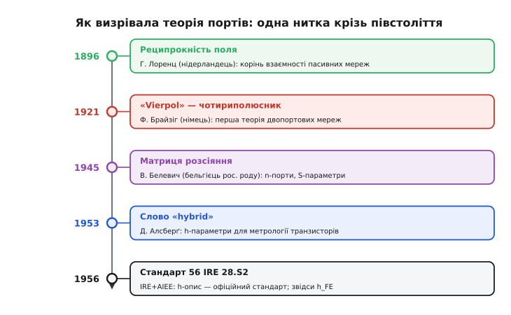

# 📜 Звідки взялися порти й чому транзистор міряють у «гібридах»

> Історія до теми [двополюсних і чотириполюсних мереж](topic:electronics/two-port-network). Слова, якими ми щодня описуємо чужу «чорну скриньку», — *порт*, *умова порту*, *взаємність*, *гібридні параметри* — не впали з неба. Кожне має дату, людину й причину. Тут — як пара виводів стала «воротами», чому пасивні кола виходять взаємними (корінь сягає теорем Лоренца), і звідки в даташиті транзистора взявся параметр **h_FE** з дивною літерою «h». Дійові особи розкидані по Європі й Америці й розмовляли різними мовами — німецькою, нідерландською, французькою, англійською; історія тут справжня, а де доказ слабкий — я це кажу прямо.

---

## Спершу були не «порти», а «чотири полюси»

Уявіть інженера телефонної компанії десь у 1910-х. Перед ним — котушки, лінії, трансформатори-повторювачі, і головний клопіт: як передбачити, що зробить із сигналом довгий шматок мережі, до якого є доступ лише з двох кінців? Усередину не залізеш — там кілометри кабелю. Видно тільки **чотири затискачі**: пара на вході, пара на виході. Природна назва народилася сама собою — **чотириполюсник**, коробка з чотирма полюсами.

Саме так це й назвали. Першу струнку теорію таких коробок збудував німецький інженер **Франц Брайзіг** (*Franz Breisig*, 1868 Ельберфельд — 1934 Берлін). Ще 1910 року він видав «Теоретичну телеграфію» (*Theoretische Telegraphie*), а близько **1921 року** дав поняттю його класичну форму під назвою **Vierpol** — буквально «чотириполюсник» (нім. *vier* — чотири, *Pol* — полюс). Це усталений факт: саме праця Брайзіга про чотириполюси заклала аналіз того, що ми тепер звемо двопортовою мережею.

> 🔧 **Навіщо це.** Звідси й дотепер у європейській, особливо німецькій, літературі живе слово **Vierpol** і його прямі переклади — *quadripole*, *four-pole*, *four-terminal network*. Якщо вам трапиться старий підручник, де підсилювач звуть «чотириполюсником» чи «квадриполем», знайте: це та сама коробка з двома портами, лише міряна не парами «вхід-вихід», а просто чотирма виводами. Розуміти цю синонімію корисно — інакше половина класичних книжок здаватиметься про щось інше.

Зверніть увагу на логіку назви. Брайзіг рахував **полюси** — окремі затискачі, їх чотири. Думка про те, що ці чотири затискачі правильніше бачити як **дві пари-«ворота»**, а не як чотири окремі точки, прийшла пізніше — і прийшла з зовсім іншого боку техніки.

---

## Слово «порт»: коли заземлення зникає під ногами

Чому взагалі знадобилося нове слово замість «пари полюсів»? Бо на низьких частотах є зручна підпора — **спільна земля**. Один провід усієї схеми оголошують «нулем», і тоді кожен затискач можна описати однією напругою «відносно землі». За такої картини «полюси» й справді окремі точки з власними потенціалами.

А тепер підніміть частоту до **мікрохвиль**. Тут зручної спільної землі вже немає: на хвилеводі чи на смужковій лінії не виходить ткнути пальцем у точку й сказати «ось тут нуль для всієї системи» — фаза напруги змінюється вздовж самого провідника. Доводиться відмовитися від ідеї «напруга затискача відносно землі» й мислити інакше: сигнал **входить і виходить** парою провідників, як вода крізь трубу. І тут пара затискачів перестає бути двома окремими полюсами — вона стає єдиними **воротами**, крізь які тече потужність. Англійці назвали ці ворота **port**.

Слово влучне до коренів. *Port* — від латинського *portus* «гавань, пристань», спорідненого з *porta* «міська брама, ворота, двері» (праіндоєвропейський корінь *per-* «вести, переходити»). Гавань — це місце, де щось заходить і виходить; брама — теж. Пара виводів, крізь яку сигнал заходить у пристрій і виходить із нього, — буквально гавань для енергії. Та сама метафора згодом дала комп'ютерний «порт» (місце, куди заходять і виходять дані).

Коли саме слово прижилося в електроніці? Етимологічні словники датують технічне значення «**пара затискачів, де сигнал заходить у мережу чи пристрій або виходить із неї**» приблизно **1953 роком** — тобто рівно тоді, коли термінологія дозрівала навколо транзистора (до цього збігу ще повернемось). Комп'ютерне значення «місце, де сигнали заходять у систему передавання даних» з'явилося ще на чверть століття пізніше — близько 1979-го, уже від цього, електронного. *(Статус: датування технічного вжитку — за етимологічними словниками; це усталено. А от назвати єдину людину, що «винайшла» слово *port* у теорії кіл, чесні джерела не беруться — і ми теж не будемо.)*

Великий поштовх «портовому» мисленню дала війна. Найважливіший центр досліджень хвилеводів у США воєнних років — **Радіаційна лабораторія** (*Radiation Laboratory*, «Рад-Леб») при MIT. Там для радарів навчилися робити дивовижну річ: складні хвилеводні вузли описувати **звичайними схемами з зосереджених елементів**, щоб рахувати їх апаратом теорії кіл. А коли мікрохвильовий вузол зводять до схеми, у нього природно з'являються **порти** — пари входів-виходів, по яких заходить і виходить потужність. Звідси «N-портова мережа» стала рідною мовою радіотехніки: загальний мікрохвильовий вузол — це багато портів, описаних матрицями.

---

## Умова порту: чому ворота не «протікають»

Тут і визріла та сама тонка вимога, яку в темі звуть **умовою порту**: струм, що входить в один затискач пари, мусить точно дорівнювати струмові, що виходить з іншого. Сформулюймо її гранично чітко:

```
I_верх  +  I_низ  =  0        (струми пари в сумі дають нуль)
```

тобто скільки струму зайшло у верхній провід воріт, рівно стільки вийшло нижнім. Алгебрична сума струмів пари — нуль.

Звідки ця вимога й навіщо вона? Бо без неї пара затискачів — це просто дві окремі точки, і вся гарна математика 2×2 розсипається. А **з** нею пара поводиться як цілісні ворота: усе, що зайшло згори, виходить знизу, нічого не тікає кудись убік повз пару. Тоді одна напруга (між затискачами пари) й один струм (крізь ворота) повністю описують, що діється на цьому порті, — і чотири величини на двох портах замикаються в матрицю.

Чому ж тоді на низьких частотах про умову порту майже не згадують? Бо там, зі спільною землею й звичайним увімкненням «джерело на вхід, навантаження на вихід», вона **виконується сама собою**: струм входить «гарячим» проводом і повертається «земляним», точно рівний. А от у мікрохвильовому світі, де землі під ногами немає, цю умову вже доводиться **постулювати** свідомо — і саме там вона з очевидності перетворюється на справжнє означення. Не дивно, що чітке поняття порту викристалізувалося разом із мікрохвильовою технікою, а не в епоху Брайзіга: доти потреби в ньому просто не відчували.

---

## Корінь взаємності: теорема Лоренца

Тепер — про другу глибоку рису пасивних коробок: **взаємність**. У темі показано, що для пасивної мережі (самі резистори, котушки, конденсатори, трансформатори) передача крізь неї однакова в обидва боки, і це записують як Z₁₂ = Z₂₁. Поміняли вхід із виходом місцями — відгук той самий. Звідки ця симетрія взялася й чому вона така непохитна?

Корінь — не в теорії кіл, а глибше, у **самій фізиці електромагнітного поля**. Загальний закон взаємності для електромагнетизму вивів нідерландський фізик **Гендрик Антон Лоренц** (*Hendrik Antoon Lorentz*, 1853–1928) у праці 1895/96 років. *(Статус: усталено. Зверніть увагу на ідентичність — це **нідерландець**, не плутати з угорсько-німецьким родом Лоренців; його ім'я носять і перетворення Лоренца у відносності, і ця теорема взаємності.)*

Суть теореми Лоренца можна відчути без формул. Уявіть дві антени в просторі, де всі матеріали «звичайні» (лінійні, не намагнічені спеціально в один бік). Збудіть першу антену й виміряйте, що навела друга. Потім поміняйте їх ролями: збудіть другу тим самим струмом і виміряйте першу. **Результат буде той самий.** Поле «не пам'ятає», хто передавач, а хто приймач, — зв'язок між ними симетричний. Це й є взаємність на рівні поля.

А тепер головне для нас. **Реципрокність кола — це окремий, «зосереджений» випадок теореми Лоренца.** Коли загальний закон поля справджується для будь-якого розподілу матеріалів, то й мережа з дискретних котушок та конденсаторів — лише одна з можливих реалізацій такого розподілу, і на неї закон поширюється автоматично. Звідси й випливає симетрія матриці: для взаємної мережі Z₁₂ = Z₂₁ (а в провідному описі Y₁₂ = Y₂₁). Те, що в темі виглядає як алгебрична властивість матриці 2×2, насправді — відбиток фундаментальної симетрії електромагнітного поля.

```
взаємність:   Z₁₂ = Z₂₁        ⇐  теорема взаємності Лоренца (поле)
                                    коло = окремий «зосереджений» випадок
```

Через це підсилювач і випадає із цього правила. У ньому сидить активний, **спрямований** елемент (транзистор підсилює тільки вперед, з виходу на вхід підсилення немає), а отже, його не зведеш до «звичайного розподілу матеріалів» із теореми Лоренца. Тому в підсилювача Z₁₂ ≠ Z₂₁ — і це не дефект опису, а чесний математичний слід того, що всередині є однобічний прилад. Взаємність ламається рівно там, де з'являється підсилення.

---

## Транзистор усе змінив: навіщо знадобилися «гібриди»

Доти теорія портів була здебільшого про **пасивні** й лінійні мережі — фільтри, лінії, трансформатори. А тоді, наприкінці 1940-х, з'явився **транзистор**, і галузь зіткнулася з новою задачею: як описати ззовні цей маленький активний прилад так, щоб числа було **легко й точно зміряти на виробництві**?

Згадаймо, чому транзистор незручний для «чистих» описів. Його вхід (база) — це місце, куди тече помітний струм за невеликої напруги; такий бік природно характеризувати **опором**. А вихід (колектор) поводиться як джерело струму з дуже великим власним опором; такий бік природно характеризувати **провідністю**. Якщо силувано міряти все опорами (Z-опис), доведеться тримати вихід **розімкненим** — але розімкнений вихід транзистора по змінному струму майже ніяк не контролюється, і Z-числа виходять нестабільні. Якщо все провідностями (Y-опис) — треба **закорочувати** вхід, що теж незручно й неточно.

Вихід напрошувався сам: узяти **від кожного боку те, що йому пасує**. Вхід — опором, вихід — провідністю, а дві перехресні величини зробити безрозмірними коефіцієнтами передачі. Виходить «мішаний» набір:

```
U₁ = h₁₁·I₁ + h₁₂·U₂      h₁₁ — вхідний опір        [Ом]
I₂ = h₂₁·I₁ + h₂₂·U₂      h₂₁ — підсилення струму    [безрозмірне]
                          h₂₂ — вихідна провідність  [сименс]
                          h₁₂ — зворотна передача    [безрозмірне]
```

Параметри тут **різнорідні** — хто в омах, хто в сименсах, хто без розмірності взагалі. Спершу ці параметри так і звали описово: **«послідовно-паралельні»** (*series-parallel parameters*) — бо вхід беруть «послідовним» опором, а вихід «паралельною» провідністю. Назва точна, але громіздка.

Коротшу й влучнішу дав інженер **Д. А. Алсберґ** (*D. A. Alsberg*) **1953 року** у праці «**Метрологія транзисторів**» (*Transistor metrology*). Він назвав ці параметри **гібридними** (*hybrid* — гібрид, помісь різнорідного) — саме за їхню різнорідність: набір складено з величин різної природи, як гібрид із різних видів. Звідси й позначення **h** (від *hybrid*). *(Статус: атрибуцію «термін *hybrid* увів Алсберґ 1953 року в *Transistor metrology*» подає довідкова література з теорії кіл; це загальноприйнята версія. Слово «увів/coined» беру обережно — у значенні «закріпив у цьому вжитку», а не «вигадав із нічого»: сам корінь *hybrid* у мові давній.)*

І ось той промовистий збіг, який я обіцяв. Технічне значення слова **port** датують ~1953 роком — і Алсберґ дає «гібрид» теж **1953-го**. Це не випадковість: на початку 1950-х транзистор змусив усю галузь нашвидку впорядкувати мову опису активних коробок, і за пару років дозріли обидва ключові слова — і «ворота», крізь які описують прилад, і «гібрид» як зручний набір чисел для нього.

---

## Як «гібрид» став законом: стандарти IRE та AIEE

Гарна назва — це ще не стандарт. Щоб параметр потрапив у кожен даташит, його мусить **узаконити** галузевий орган. У ті роки в США було два великі інженерні товариства: **IRE** (*Institute of Radio Engineers* — Інститут радіоінженерів) і **AIEE** (*American Institute of Electrical Engineers* — Американський інститут електроінженерів). 1963 року вони злилися в нинішній **IEEE**.

Послідовність подій така — і вона добре задокументована:

- **1954.** Спільний комітет IRE та AIEE **ухвалює** термін *h-параметри* й рекомендує зробити їх **стандартним способом** випробування й характеризування транзисторів — з прямим формулюванням, що вони «**особливо пристосовані до фізичних характеристик транзисторів**» (*peculiarly adaptable to the physical characteristics of transistors*).
- **1956.** Рекомендація стає **виданим стандартом** — **56 IRE 28.S2** (стандарт на літерні позначення для напівпровідникових приладів). Паралельно виходить і стандарт методів випробування транзисторів, що згодом дістав номер **IEEE Std 218-1956**.

*(Статус: усталено — дати 1954 та 1956, номер 56 IRE 28.S2 і цитата «peculiarly adaptable…» збігаються в довідкових джерелах із теорії кіл та в каталозі стандартів.)*

Чому комітет обрав саме **h**, а не Z чи Y? Рівно з тієї причини, що ми вже розібрали: гібридний опис **лягає на фізику транзистора природніше за решту** — вхід опором, вихід провідністю, і всі чотири числа міряються в зручних, стабільних режимах (вхід при закороченому виході, вихід при розімкненому вході). Комітет не вигадував естетику — він закріпив те, що інженери на стендах уже визнали найзручнішим.


*Теорія портів збиралася десятиліттями й у різних країнах. Реципрокність пасивних мереж корениться в теоремі Лоренца (1896, нідерландець). Першу теорію двопортових мереж дав Брайзіг під назвою «Vierpol» (1921, німець). Белевич (1945, бельгієць російського роду) увів матрицю розсіяння й узагальнив порти на будь-яке число. «Гібрид» для транзисторів назвав Алсберґ (1953), а стандарт 56 IRE 28.S2 (1956) узаконив h-опис — звідси й h_FE.*

---

## Чому h_FE дожив до сьогодні

Тепер найприземленіше — те, що ви бачите в реальному даташиті. Відкрийте опис будь-якого біполярного транзистора, знайдіть рядок **h_FE** (часто пишуть і просто «DC current gain», коефіцієнт підсилення струму) — і ви тримаєте в руках прямого нащадка стандарту 1956 року.

Розберімо цю позначку по літерах, бо вона сама — крихітна капсула історії:

- **h** — той самий *hybrid* Алсберґа: число належить гібридному опису.
- **F** — *forward*, «вперед»: це передача в прямому напрямі, зі входу на вихід (на відміну від зворотної h₁₂).
- **E** — *emitter*, увімкнення зі **спільним емітером** (найпоширеніша схема, де й цікавляться підсиленням струму).
- Великі літери в індексі (FE проти fe) за стандартом означають **статичну**, постійнострумову величину — на відміну від малосигнальної h_fe для змінного струму.

Іншими словами, **h_FE — це і є h₂₁ гібридного опису**, заміряний у схемі зі спільним емітером на постійному струмі: у скільки разів струм колектора більший за струм бази. Те, що в нашій темі стоїть абстрактним «h₂₁ — підсилення струму, безрозмірне», у даташиті отримало конкретну адресу режиму — і дожило незмінним більш ніж півстоліття просто тому, що галузь одного разу домовилась так писати й уже не передомовлялась.

> 🔧 **Навіщо це.** Коли в схемотехніці кажуть «бета транзистора» (β) і пишуть у даташиті h_FE — це **одне й те саме число** під двома іменами: β — інженерний жаргон, h_FE — стандартна позначка з 1956 року. Розуміти цей зв'язок практично важливо: половина старих довідників і калькуляторів зміщення оперує «h-параметрами», половина новіших книжок — «бетою» й малосигнальними gₘ, rπ; це різні слова про ту саму фізику. Хто бачить за позначкою її походження, той не плутається між поколіннями літератури.

Як саме ці гібридні числа описують реальний транзистор для малого сигналу — окрема технічна історія: про неї в темі про [малосигнальну модель BJT](topic:electronics/bjt-small-signal) та в [історії гібридної-π моделі](topic:electronics/bjt-small-signal/hist-hybrid-pi.md), де h-параметри й змінили на зручнішу для розрахунку π-схему.

---

## Белевич: матриця розсіяння й порти без числа

Лишилася одна постать, яку годі обминути, говорячи про теорію портів, — і з якою водночас треба бути **особливо обережним щодо приписувань**. Це **Вітольд Белевич** (*Vitold Belevitch*, 1921–1999).

Спершу про людину — і про ідентичність, бо тут легко наклеїти неточний ярлик. Белевич народився **2 березня 1921 року в Терійоках** (фін. *Terijoki*, нині Зеленогорськ) у Карелії. Тонкість: на той час Терійоки належали **Фінляндії**, а в Росію цю землю включили вже згодом. Його батьки тікали з **Петрограда** від більшовицького перевороту: батько був росіянином, мати — **етнічна полька**. Малою дитиною, 1926 року, Вітольд із матір'ю **виїхав до Бельгії**, де й здобув освіту французькою та все життя працював. Тому усталене формулювання — **бельгійський математик та інженер російського походження**; точніше ж його коріння **змішане** (російсько-польська родина, народження на фінській землі, бельгійське життя), і так і слід казати, не зводячи людину до одного слова «росіянин». *(Статус: біографічні дані — усталені; деталі втечі родини й місця реєстрації народження різняться по джерелах у дрібницях, тож подаю лише безперечне.)*

Тепер про внесок — і про межу, якої я не переступлю. Белевич **не «винаходив» слова порт** і не стоїть за гібридними параметрами транзистора; жодне надійне джерело такого не каже, і приписувати йому це було б вигадкою. Його справжній, документований слід інший і не менш вагомий:

- У дисертації **1945 року** він увів у теорію кіл ідею **матриці розсіяння** (*scattering matrix*; сам Белевич звав її *repartition matrix* — «матриця розподілу»). Це опис коробки не через напруги-струми, а через **хвилі, що падають і відбиваються** на портах, — і саме він пасує мікрохвильовому світу, де, як ми бачили, звичайні напруги відносно землі втрачають сенс. Білевич застосував розсіяння до схем із зосереджених елементів раніше, ніж воно усталилося в американській мікрохвильовій практиці.
- Він **узагальнив** цей апарат на **будь-яке число портів** (не лише два) і на мережі взаємні **й** невзаємні, дійсні й комплексні — тобто привів n-портову теорію до строгого математичного ладу.
- Його ім'я носить **теорема Белевича** — критерій, чи можна взагалі скласти задану пасивну реактивну (без втрат) коробку з дискретних елементів. А його книжка **«Класична теорія мереж»** (*Classical Network Theory*, 1968) стала одним зі стрижневих викладів усієї царини.

З 2003 року Товариство схем і систем IEEE заснувало **премію імені Белевича** за роботи в теорії кіл — визнання, що його внесок у класичну теорію мереж і теорію n-портів вважають фундаментальним.

> 🔧 **Навіщо це.** Матриця розсіяння (S-параметри), яку започаткував Белевич, — це **робоча мова всієї високочастотної техніки** донині. Будь-який каталог НВЧ-підсилювача, змішувача, фільтра описано S-параметрами (S₁₁ — узгодження входу, S₂₁ — передача тощо), бо на цих частотах міряти падні-відбиті хвилі набагато реальніше, ніж напруги відносно неіснуючої спільної землі. Z, Y та h добрі для звукових і проміжних частот; щойно йдеться про гігагерци — інженер переходить на S-опис, спадок Белевича. Знати, звідки він і чому саме там потрібен, — частина грамотності радіоінженера.

---

## Що з цього винести

За звичними словами теорії портів стоїть жива історія — і вона повчальна сама собою:

- **Чотириполюсник** старший за «двопортовик»: німець **Брайзіг** дав теорію *Vierpol* близько **1921 року**, і звідси в книжках живуть синоніми *quadripole / four-pole / four-terminal*.
- **Порт** як «ворота» (лат. *portus* — гавань, *porta* — брама) прижився у мікрохвильовій техніці, де немає зручної спільної землі; технічне значення датують ~**1953 роком**. **Умова порту** (струм пари в сумі — нуль) із самоочевидності на низьких частотах стає справжнім означенням саме на мікрохвилях.
- **Взаємність** пасивних мереж (Z₁₂ = Z₂₁) — не алгебрична випадковість, а зосереджений випадок **теореми взаємності Лоренца** (нідерландець, 1895/96); підсилювач її ламає, бо містить спрямований активний прилад.
- **Гібридні (h) параметри** придумано **під транзистор**: вхід опором, вихід провідністю. Назву *hybrid* закріпив **Алсберґ (1953)**, а **комітет IRE+AIEE (1954)** і стандарт **56 IRE 28.S2 (1956)** зробили h-опис офіційним — звідси **h_FE** у кожному даташиті донині (він же «бета»).
- **Белевич** (бельгієць змішаного російсько-польського роду, 1945) увів **матрицю розсіяння** й узагальнив порти на будь-яке число — корінь нинішніх **S-параметрів** високочастотної техніки. Але приписувати йому «порт» чи «h» — міф; справжній внесок інший і без того великий.

І наскрізний урок: мова техніки не довільна. Кожне слово — *порт*, *гібрид*, *взаємність* — народилося, бо інженерам забракло старого слова для нової задачі. Хто чує за позначкою її причину, той розуміє не лише *як* рахувати коробку, а й *чому* її саме так описують.
