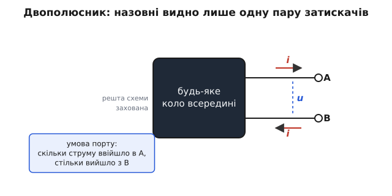
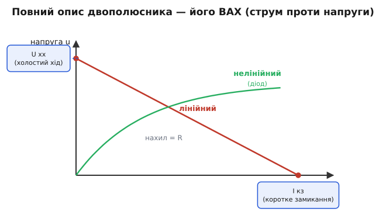
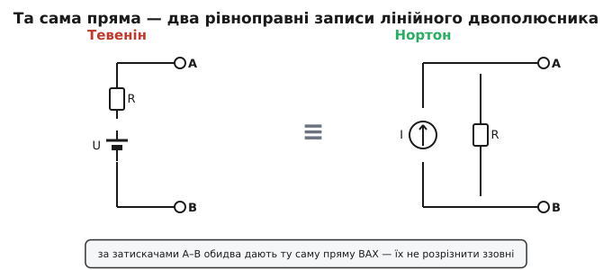

# Двополюсна мережа

Перед вами невідома плата. З неї стирчать два дроти — і більше нічого. Усередині може бути що завгодно: батарейка, резистор, ціла гірлянда з опорів та джерел, навіть діод. Питання просте й практичне: щоб під'єднати до цих двох дротів навантаження й передбачити, що станеться, — **чи мушу я знати, що там усередині**? Виявляється, ні. Усе, що зовнішній світ узагалі здатен відчути на цій парі дротів, описується дуже скупо. Саме цю скупість і називають **двополюсною мережею** (двополюсником) — найменшим корисним «чорним ящиком» електроніки.

Слово «полюс» тут — у старому розумінні: затискач, кінець, до якого щось приєднують (від лат. *polus* — вісь, кінець). Два полюси — два дроти назовні. «Мережа» (англ. *network*) — будь-яке з'єднання елементів; усередині двополюсника її може бути скільки завгодно, але назовні вона показує рівно дві клеми. Тому ще точна назва — **одно-портова мережа** (англ. *one-port*): один-єдиний «порт», одна пара затискачів, крізь яку коло спілкується зі світом.


*Двополюсник як чорний ящик: хай би що було всередині, назовні видно лише пару затискачів A–B. На них визначені дві величини — струм i крізь пару й напруга u поперек неї. Стрілки показують умову порту: скільки струму ввійшло в A, рівно стільки виходить із B.*

## Що таке порт і чому потрібна саме пара

Чому два дроти, а не один чи три? Бо струм нікуди не тече «в один кінець»: він **завжди замикає коло**. Електрони, що ввійшли крізь один дріт, мусять кудись подітися — і виходять крізь другий. Один дріт сам по собі не несе сталого струму, йому нема куди повертатися. Отже найменший осмислений вихід кола назовні — це **пара** дротів: одним струм заходить, другим виходить.

Ця вимога має точну назву — **умова порту**: струм, що входить в один затискач пари, у кожен момент дорівнює струмові, що виходить із другого. Не «приблизно», а тотожно, бо це той самий струм — він просто проходить крізь зовнішнє навантаження й повертається. Поки умова виконується, пару затискачів і називають портом, а величину `i` — **струмом порту**.

Друга величина — **напруга порту** `u`: різниця потенціалів між двома затискачами. Вона каже, наскільки «вище» потенціал на A, ніж на B. Разом `u` та `i` — два числа — і є **все**, чим двополюсник проявляє себе назовні. Це ключова думка: хоч би скільки вузлів, гілок і елементів ховалося всередині, зовнішній спостерігач має доступ лише до однієї пари (`u`, `i`). Решта недосяжна — і, на щастя, **непотрібна**.

> 🔧 **Навіщо це.** Кожен реальний вузол, який ви під'єднуєте до чогось, поводиться як двополюсник: вихід давача, гніздо живлення, антена, обмотка реле, навіть «земляна» шина відносно сигнальної. Коли ви проєктуєте, що повісити на цей вузол, вам не треба тримати в голові всю схему по той бік — досить знати, як цей вузол виглядає **на своїх двох клемах**. Це і є щоденна користь абстракції: вона дозволяє розрізати велику схему на шматки й думати про кожен окремо, через його єдиний порт.

## Повний опис — це його вольт-амперна характеристика

Якщо назовні видно лише `u` та `i`, то **вичерпний** опис двополюсника — це закон, який пов'язує ці дві величини: для кожної можливої напруги на затискачах — який потече струм (або навпаки). Цей закон зручно намалювати кривою на площині «струм–напруга». Її називають **вольт-амперною характеристикою** (ВАХ): по одній осі — струм порту, по іншій — напруга порту, а сама крива — усі дозволені пари (`u`, `i`).

Чому саме ВАХ — а не, скажімо, «опір» чи «ємність»? Бо опір, ємність, індуктивність — це часткові описи, кожен годиться лише для свого типу елемента. А ВАХ універсальна: вона нічого не припускає про начинку. Дайте мені ВАХ — і я передбачу поведінку при будь-якому навантаженні, не заглядаючи всередину. У цьому сенсі **двополюсник і його ВАХ — те саме**: два чорні ящики з однаковою ВАХ ззовні нерозрізненні, хоч би як по-різному були влаштовані.


*Вольт-амперна характеристика на площині (i, u). Лінійний двополюсник дає пряму: де вона перетинає вісь напруги — це напруга холостого ходу U хх (струму нема), де перетинає вісь струму — струм короткого замикання I кз (напруга нульова). Нелінійний (наприклад, діод) дає криву: спершу майже плоско, тоді різкий злам. Нахил прямої — це опір.*

Дві точки на цій кривій мають окремі імена, бо їх **найлегше виміряти**, і вони задають усе інше для прямої. Перша — **холостий хід** (англ. *open circuit*): до затискачів нічого не під'єднано, струм нульовий, `i = 0`. Напруга, що при цьому встановлюється на клемах, — **напруга холостого ходу** U хх. Друга — **коротке замикання** (англ. *short circuit*): затискачі з'єднані навпростець дротом, напруга на них нульова, `u = 0`, а струм, що при цьому потече, — **струм короткого замикання** I кз. Це дві крайні точки: «нічого не приєднано» і «приєднано ідеальну перемичку».

## Лінійний двополюсник — це пряма, і цим усе сказано

Тепер найважливіше спрощення, на якому тримається пів-електроніки. Якщо всередині двополюсника **лише лінійні елементи** — резистори та джерела (постійні напруги й струму) — то його ВАХ виявляється не якоюсь хитрою кривою, а **прямою лінією**. Завжди. Без винятків.

Чому пряма? Бо лінійне коло слухається [суперпозиції](topic:electronics/superposition): відгук на суму дій дорівнює сумі окремих відгуків, а подвоєння причини подвоює наслідок. Якщо ми «причиною» на затискачах вважатимемо прикладений струм `i`, а «наслідком» — напругу `u`, то лінійність змушує залежність бути виду `u = a·i + b`: масштабована частина (`a·i`) плюс сталий зсув (`b`). А `u = a·i + b` — це рівняння прямої. Стала `b` — це напруга, коли струму нема, тобто U хх; а коефіцієнт `a` — нахил, що має розмірність опору.

> Хочете побачити, **чому саме лінійність дає прямолінійну ВАХ** і звідки беруться обидва коефіцієнти — це коротке, але красиве міркування винесене в окрему [математичну вставку](topic:electronics/two-terminal-network/math-linear-iv.md): із самого означення лінійності крок за кроком випливає `u = U хх − R·i`, тобто пряма з двома параметрами.

Отже **будь-який** лінійний двополюсник, хай би яким складним було його нутро, ззовні має лише **два числа**: точку перетину з віссю напруги (U хх) та нахил (опір `R`). Дві однакові пари чисел — два нерозрізненні двополюсники. Це той самий зміст, що несе [теорема Тевеніна](topic:electronics/thevenin): будь-яке лінійне коло, видиме з пари затискачів, можна замінити одним джерелом напруги U хх послідовно з одним опором `R`. Двополюсна мережа — це і є та абстракція, **на яку** теорема Тевеніна відповідає; теорема каже, чим саме її замінити.

## Один і той самий двополюсник — два способи записати

Пряма має дві осі, тож її «дві опорні точки» можна вибрати по-різному — і звідси два рівноправні записи того самого лінійного двополюсника.

Можна відштовхнутися від **напруги** холостого ходу: «джерело тримає U хх, а опір `R` забирає частину, коли тече струм». Це запис Тевеніна — джерело напруги **послідовно** з опором. А можна відштовхнутися від **струму** короткого замикання: «джерело гонить I кз, а опір `R` відводить частину повз вихід, коли на ньому з'являється напруга». Це [еквівалент Нортона](topic:electronics/norton) — джерело струму **паралельно** з опором. Опір `R` в обох однаковий (це той самий нахил прямої), а джерела пов'язані законом Ома на цьому ж опорі: `U хх = I кз · R`.


*Зліва — запис Тевеніна (джерело напруги U послідовно з R), справа — запис Нортона (джерело струму I паралельно з R). За затискачами A–B обидва дають ту саму пряму, тому ззовні їх не розрізнити — вибір між ними лише питання зручності розрахунку.*

Жоден із записів не «правдивіший». Вони описують ту саму пряму, отже той самий двополюсник. Який обрати — питання зручності: коли навантаження вмикають **послідовно** й цікавить напруга, природніший Тевенін; коли гілки сходяться в **вузол** і складають струми, природніший Нортон. Перехід між ними — арифметика на одному опорі.

**Worked-приклад: від двох вимірів — до повного опису.** Маємо невідому лінійну коробку з двома клемами. Робимо два простих заміри. Холостий хід: вольтметр показує 9 В — це U хх. Коротке замикання (через амперметр): тече 0.3 А — це I кз. Цього вистачає, щоб дізнатися все:

```
R = U хх / I кз
R = 9 / 0.3
R = 30 Ом            ← внутрішній (вихідний) опір
```

Тепер ВАХ повністю відома: `u = 9 − 30·i`. Передбачмо, що буде з реальним навантаженням, скажімо опором 60 Ом, приєднаним до клем. Навантаження накладає свій закон Ома `u = 60·i`; розв'язуємо разом:

```
9 − 30·i = 60·i
9 = 90·i
i = 0.1 А            → u = 60 · 0.1 = 6 В
```

Через 60-омне навантаження потече 0.1 А під напругою 6 В — і ми дізналися це, **жодного разу не зазирнувши всередину коробки**. У цьому вся сила: два числа замість усієї схеми. Те саме легко прорахувати в прошивці — коли, наприклад, мікроконтролер за двома вимірами оцінює вихідний опір джерела й передбачає просідання напруги під навантаженням:

```c
// Лінійний двополюсник за двома точками: холостий хід і коротке замикання.
// Повертає напругу на клемах при заданому опорі навантаження R_load.
float port_voltage(float u_oc, float i_sc, float r_load)
{
    float r_int = u_oc / i_sc;               // внутрішній опір = U хх / I кз
    return u_oc * r_load / (r_int + r_load); // дільник: навантаження бере свою частку
}
// port_voltage(9.0f, 0.3f, 60.0f) -> 6.0 В
```

Зверніть увагу: формула в коді — це звичайний [дільник напруги](topic:electronics/voltage-divider) між внутрішнім опором коробки й опором навантаження. Двополюсник «згорнув» цілу схему до одного джерела й одного опору саме для того, щоб таке передбачення стало однорядковим.

## Коли всередині не лише опори: нелінійний двополюсник

Пряма — це привілей **лінійного** нутра. Щойно всередині з'являється елемент, чий струм не пропорційний напрузі, ВАХ перестає бути прямою — і вся зручна машинерія «U хх + опір» уже не описує річ повністю.

Найвідоміший приклад — [діод](topic:electronics/diode-iv-curve). Це теж двополюсник: дві клеми, одна пара (`u`, `i`). Але його ВАХ — крута експонента: до певної напруги струм майже нульовий, тоді раптом стрімко зростає — це та сама зелена крива на рисунку ВАХ. Двома числами її не вкласти — потрібна вся крива або її рівняння. Лампа розжарювання, варистор, тунельний діод, p-n перехід — усе це двополюсники з кривою, не прямою, ВАХ.

Тут проступає чесна межа абстракції. **Двополюсником** річ лишається завжди — поки в неї рівно дві клеми й виконується умова порту, її повний опис є його ВАХ. Що змінюється — це **форма** опису: для лінійного нутра він стискається до двох чисел і дозволяє заміну Тевеніном/Нортоном; для нелінійного — ні, доводиться тримати криву цілком. Аналогія з «двома числами» точна рівно доти, доки крива — пряма; на згині вона ламається, і це треба пам'ятати, інакше легко приписати діодові «внутрішній опір», якого в нього як сталої величини немає.

Часто роблять компроміс: беруть нелінійну ВАХ і **лінеаризують** її навколо робочої точки — заміняють маленький шматочок кривої дотичною прямою. Тоді в околі цієї точки знову з'являються «місцеві» U хх та опір (його звуть диференціальним, бо це нахил **дотичної**), і ту саму машинерію Тевеніна знову можна застосувати — але лише локально, на малих відхиленнях. Це і є місток між нелінійним світом і зручним лінійним апаратом.

## Чому ця абстракція скрізь

Підсумуймо те, що тепер видно цілісно. Двополюсник — це не якийсь окремий компонент, а **погляд**: будь-який шматок кола, виведений назовні рівно двома затискачами. Резистор — двополюсник. Батарейка — двополюсник. Послідовне коло з десяти елементів, у якого назовні стирчать два кінці, — теж один двополюсник. Цей погляд дає три речі одразу.

По-перше, **інкапсуляцію**: повна поведінка зведена до однієї ВАХ на парі клем, а нутро сховане. По-друге, для лінійного нутра — **радикальне спрощення** до двох чисел (U хх та опір), тобто до еквівалента Тевеніна чи Нортона. По-третє, **модульність**: велику схему можна різати на двополюсники, рахувати кожен окремо, а тоді стикувати їх через спільні порти — бо все, чим вони впливають одне на одного, проходить саме через ці пари клем.

А коли назовні виходять **дві** пари клем — вхідна й вихідна, як у підсилювача чи фільтра, — той самий хід думки веде до ширшої абстракції, [чотириполюсника](topic:electronics/two-port-network): уже не одна ВАХ, а зв'язок між двома портами. Двополюсник — найпростіша її основа й перший камінь усієї блочної мови, якою описують кола.
