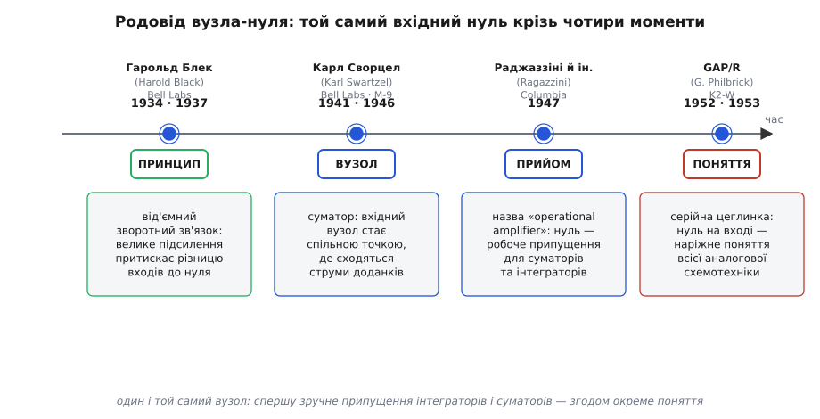

# 📜 Народження віртуальної землі

Сьогодні «віртуальна земля» — перше, що креслять, узявшись за інвертувальний підсилювач: вузол на вході притиснутий до нуля, до нього зручно «приколювати» струми, і вся арифметика схеми випливає сама. Поняття здається таким очевидним і таким старим, що мимоволі думаєш — воно було завжди, від першого ж підсилювача зі зворотним зв'язком. Це неправда. Вузол-нуль народжувався поволі й кружним шляхом: спершу його ніхто не помічав як окрему сутність, потім ним почали **користуватися**, не даючи імені, і лише згодом він викристалізувався в **поняття**, яке вчать окремо.

Це історія про те, як точка в схемі, що тримається на нулі завдяки зворотному зв'язку, пройшла шлях від побічного наслідку до наріжного каменя. У ній чотири дійові групи й чотири різні кроки, які легко злити в один, та які насправді зробили різні люди в різні десятиліття: **принцип** (від'ємний зворотний зв'язок, що взагалі вміє притискати щось до заданого рівня), **вузол** (точка, де в обчислювальному суматорі сходяться струми), **прийом** (зручне припущення «вважай той вузол нулем», яким рахували інтегратори й суматори) і нарешті **поняття** (окрема ідея «віртуальна земля», яку виокремили й назвали). Розрізнити ці кроки — і значить зрозуміти, звідки взялася [віртуальна земля](topic:electronics/virtual-ground).

*Родовід вузла-нуля. Один і той самий вхідний нуль мандрує крізь чотири моменти, щоразу набуваючи нової ролі: спершу він — наслідок принципу від'ємного зворотного зв'язку (Блек), потім — спільна точка, де сходяться струми доданків у суматорі (Сворцел), далі — зручне розрахункове припущення для інтеграторів і суматорів аналогового обчислювача (Раджаззіні й колеги), і врешті — окреме поняття, яке виставлено на полицю разом із серійним підсилювачем (K2-W). Дати веб-звірені; статус доказовості розрізнено в тексті.*

## Гарольд Блек і думка, що зворотний зв'язок уміє притискати

Усе починається з того, без чого віртуальної землі не буває взагалі, — з **від'ємного зворотного зв'язку**. Поки немає петлі, яка повертає частину виходу назад на вхід і змушує підсилювач **самого себе вгамовувати**, ніякого вузла, що вперто тримається на нулі, бути не може. Тож першим у цій історії стоїть американський інженер **Гарольд Блек** (Harold Stephen Black, 1898–1983) з Bell Telephone Laboratories.

Біда, яку розв'язував Блек, на перший погляд не має нічого спільного з нашим вузлом. Телефонна компанія тягла все довші лінії далекого зв'язку, а сигнал по дорозі слабшав і його доводилося раз у раз підсилювати. Та лампові підсилювачі тих років **спотворювали** мову: їхнє підсилення «гуляло» з рівнем сигналу, з температурою, зі старінням ламп. На одній лінії таких підсилювачів стояли десятки поспіль, і їхні спотворення накопичувалися в кашу. Потрібен був підсилювач, чий коефіцієнт **не плив би** ні від чого.

Рішення прийшло до Блека, за його власною розповіддю, **2 серпня 1927 року** на поромі через Гудзон дорогою з Нью-Джерсі до Нью-Йорка — він накидав ідею просто на чистому місці ранкової газети *The New York Times*. Це усталений, хоч і автобіографічний, переказ; сам Блек докладно описав його в спогадах, тож статус тут — **достовірна особиста оповідь, не доведена документом тієї миті**. Думка була така: навмисно **пожертвувати** надлишком підсилення. Хай лампа підсилює в багато разів сильніше, ніж треба; візьмемо частину виходу й повернемо її на вхід **у протифазі**, віднявши від вхідного сигналу. Тоді підсумкове підсилення задаватиме вже не примхлива лампа, а **співвідношення пасивних елементів** у петлі зворотного зв'язку — а ті стабільні. Спотворення падало в десятки тисяч разів; 29 грудня 1927-го Блек із колегами побудував підсилювач, чиє спотворення зменшилося приблизно у сто тисяч разів — рівно настільки, наскільки впало підсилення.

> 🔧 **Навіщо це.** Тут уже захована майбутня віртуальна земля, хоч її ще ніхто так не бачить. Суть Блекового відкриття — **велике підсилення можна обміняти на точність**: чим сильніше підсилює лампа всередині петлі, тим жорсткіше зворотний зв'язок притискає схему до заданого зовнішніми елементами стану й тим менше та схема залежить від самої лампи. Ось це «притискає до заданого стану» і є той самий механізм, що згодом притискатиме вхідний вузол до нуля. Без Блекового зворотного зв'язку віртуальна земля просто не має на чому триматися — це його принцип, застосований до однієї конкретної точки. Сам [від'ємний зворотний зв'язок](topic:electronics/negative-feedback) — окрема велика тема; тут важить лише, що він уміє **жорстко тримати** якусь величину на місці.

Теорію цього Блек виклав у статті «Стабілізовані підсилювачі зі зворотним зв'язком» (Stabilized Feedback Amplifiers), що вийшла в *Bell System Technical Journal* у **січні 1934 року**. А патент на сам винахід — US 2,102,671 «Wave Translation System» — Бюро патентів США видало Bell Labs аж **1937-го**: між заявкою 1928 року й виданням лягло майже дев'ять років суперечок, бо експертам не вкладалося в голову, навіщо свідомо викидати підсилення, яке інші так тяжко здобувають. Розрізнімо чесно три речі: **ідея** обміну підсилення на стабільність — 1927-й, поромна історія; **опублікована теорія** — 1934-й, журнальна стаття; **патент** — 1937-й. Це три різні дати й три різні рівні доказовості, і змішувати їх не варто.

Та зверніть увагу: Блек думав про **звукову** лінію. Жодної «землі», жодного «нуля на вході» в його картині ще немає. Він дав механізм. Хто скерує цей механізм на те, щоб тримати на нулі **конкретну точку**, — то вже інша сцена й інша війна.

## Карл Сворцел і вузол, де сходяться струми

Наступний крок зробила не телефонія, а **зенітна стрільба**. Щоб збити літак, треба за траєкторією й швидкістю ціли обчислити, **куди** її випередити, — і робити це безперервно, поки ціль летить. Під час Другої світової цю математику виконував електромеханічний прилад керування вогнем; у США його розвивали в тих самих Bell Labs. Прилад мусив **складати й масштабувати напруги**, що зображали координати, швидкості, поправки на вітер. А складати напруги — це вже пряма дорога до нашого вузла.

Підсилювач, який це робив, спроєктував у Bell Labs американський інженер **Карл Сворцел** (Karl D. Swartzel Jr., 1907–1998). Його патент US 2,401,779 називається прямо — «Summing Amplifier», «підсилювач-суматор». І ось вирішальна тонкість дат, яку треба назвати точно, бо вона показує, як воєнна таємниця спотворює історичний запис: **заявку Сворцел подав 1 травня 1941 року**, а **видали патент лише 11 червня 1946-го** — затримка на понад п'ять років через накладену урядом США воєнну секретність. Тож якщо дивитися на дату патенту, здається, що суматор з'явився після війни; насправді він **передував** і статті Раджаззіні, і всьому, що буде далі. Це задокументований факт із самого патенту, не переказ.

Конструкція Сворцела — підсилювач на **трьох лампах** із підсиленням близько 90 дБ (тобто десь у тридцять тисяч разів), із прямим зв'язком по постійному струму (без розділових конденсаторів) і живленням від високих напруг порядку ±350 В. Це вже **впізнаваний предок операційного підсилювача**: великий коефіцієнт, інвертувальний вхід, зворотний зв'язок. Сворцелів суматор рясно застосували в артилерійському директорі **M-9** — приладі керування зенітним вогнем, що працював у парі з радаром SCR-584 і давав під кінець війни вражаючу влучність по літаках і навіть по німецьких крилатих ракетах Фау-1.

Що ж тут із нашим вузлом? Уявіть, як суматор складає кілька напруг. Кожну вхідну напругу подають через свій резистор, а другі кінці всіх цих резисторів зводять **в одну спільну точку** на вході підсилювача. Велике підсилення з петлею зворотного зв'язку тримає цю точку **майже нерухомою**, а отже струм крізь кожен вхідний резистор задає лише його власна напруга — незалежно від сусідів. Усі ці струми зливаються у вузлі й разом ідуть у зворотний зв'язок: на виході виходить **сума**. Спільна точка тут **мусила** бути стабільною, інакше входи плуталися б один в одному. Так уперше з'явився **вузол, що тримається на місці заради того, щоб струми складалися чисто**, — фізичний предок віртуальної землі.

> 🔧 **Навіщо це.** Запам'ятайте цю причину, бо вона — серце всього поняття. Вузол притискають до нерухомого рівня **не з любові до нуля, а щоб струми входів не залежали один від одного**. Поки точка стоїть на місці, напруга на кожному вхідному резисторі визначена однозначно (один його кінець зафіксовано), а отже й струм крізь нього — теж; і ці струми просто додаються, як числа. Саме це й робить [суматор](topic:electronics/opamp) суматором. Віртуальна земля народилася як **інженерна необхідність складання**, а не як гарна абстракція. Сворцел будував зброю, а не поняття, — та без його вузла поняттю не було б із чого вирости.

І все ж назвіть річ її іменем: у Сворцела **немає** слова «віртуальна земля», немає й «операційного підсилювача». Є суматор, у якому є спільна точка, що чомусь добре працює. Вузол уже **діє**, але ще безіменний і ще не осмислений як окрема ідея. Його щойно треба буде **помітити**.

## Лоебе Джулі і два входи

Перш ніж вузол дістане ім'я, у нашій історії з'являється людина, яку довго недооцінювали, — і її варто назвати чесно, бо це випадок забутого внеску. У 1943 році Дослідницький комітет оборони США (NDRC) замовив Колумбійському університетові **спростити** лампові підсилювачі Сворцела для директора M-9: три лампи на канал — то було забагато. За справу взявся молодий інженер **Лоебе Джулі** (Loebe Julie, 1920–2015), випускник Міського коледжу Нью-Йорка (City College of New York, 1941), якого до цієї задачі підштовхнув **Джордж Філбрик** — той самий, що згодом зробить серійний підсилювач.

Джулі зробив крок, який нині в кожному операційному підсилювачі. Замість одного інвертувального входу він дав підсилювачеві **два входи — інвертувальний і неінвертувальний** — на парі здвоєних тріодів (близьких до 6SL7) у схемі «довгого хвоста» (long-tailed pair). Це не лише скоротило число ламп і додало швидкості й ощадності — це зробило вхід **диференційним**: підсилювач тепер реагував на **різницю** двох напруг. А диференційний вхід — це саме той ґрунт, на якому віртуальна земля стає прозорою: заземлюєш один вхід, і петля тягне другий до того ж нуля. Те, що в чисто інвертувальному суматорі Сворцела було лиш робочою точкою, у диференційній схемі Джулі набуло чіткої форми «обидва входи на одному потенціалі».

Іронія в тому, що в самій статті 1947 року, яка дасть усьому імена, Джулі **не значиться співавтором**, його схеми в ній немає, а згаданий він лише в подяках — за «деякі етапи цієї розробки». Згодом він заснував Julie Research Laboratories й робив надточні прецизійні компоненти. Тож коли віддаватимете належне творцям, не загубіть цього імені: **диференційний вхід** — а отже й найясніший випадок віртуальної землі — це внесок Лоебе Джулі, хоч хрестили поняття інші руки. Статус тут — **добре задокументований, хоч історично недооцінений факт**.

## Раджаззіні й колеги: вузол стає прийомом і дістає контекст

Тепер сцена, на якій безіменний вузол уперше осмислюють вголос. У травні **1947 року** в журналі *Proceedings of the IRE* (том 35, с. 444–452) вийшла стаття трьох інженерів Колумбійського університету — **Джона Раджаззіні** (John R. Ragazzini, 1912–1988), **Роберта Рендалла** (Robert H. Randall) і **Фредеріка Расселла** (Frederick A. Russell) — під назвою «Аналіз задач динаміки електронними схемами» (Analysis of Problems in Dynamics by Electronic Circuits). Робота виросла з тих самих воєнних замовлень NDRC. Саме тут підсилювач зі зворотним зв'язком уперше назвали **«operational amplifier»** — «операційним підсилювачем»: бо так увімкнений, обвішаний резисторами й конденсаторами, він **виконує математичні операції** над поданими напругами — складає, масштабує, інтегрує. (Сама етимологія слова «операційний» — окрема історія, прив'язана до [аналогового обчислювача](topic:electronics/analog-computer); тут нам важить інше.)

А важить ось що. Щоб **рахувати** такі схеми — суматори, інтегратори, диференціатори, — інженери почали відкрито спиратися на два спрощення про ідеальний підсилювач: вхід майже **нічого не споживає** струму, і вхідний вузол при заземленому другому вході **можна вважати нулем**. Не «приблизно колись нулем», а просто **нулем** — як робоче припущення для виведення формул. Інтегратор? Вхідний струм заганяєш у конденсатор зворотного зв'язку, бо вузол на нулі й більше струму нікуди подітися. Суматор? Струми входів складаєш у вузлі, бо він на нулі й кожен резистор «не бачить» сусідів. Масштабувальник? Відношення опорів, бо знов-таки вузол на нулі.

> 🔧 **Навіщо це.** Ось де стався тихий, але вирішальний зсув. До цього вузол-нуль був **фізичним явищем** усередині конкретного приладу — він просто там сидів і працював. Тепер він став **розрахунковим прийомом**: «постав у цій точці нуль — і вся математика схеми розкривається в три рядки». Поняття народжується саме тоді, коли явище перетворюють на **інструмент думки**, яким зручно користуватися наосліп, не щоразу доводячи з нуля. Раджаззіні з колегами не «винайшли» віртуальну землю — вузол уже п'ять років працював у Сворцела. Вони зробили тонше й важливіше: дали контекст і узаконили **звичку рахувати через нуль на вході**. А прийом, яким щодня користуються тисячі інженерів, рано чи пізно дістає коротке ім'я.

Зверніть увагу на дражливу деталь: у самій статті 1947 року терміна **«virtual ground»** ще, найпевніше, **немає** як усталеного словосполучення — там говорять про заземлений підсумовувальний вузол і про нехтовно малу напругу на вході. Тобто **річ уже є, а слова ще нема**. Це типова доля понять: спершу ним мовчки користуються, потім хтось у підручнику чи нотатці кидає влучний зворот — «вузол поводиться як земля, хоч до неї не приєднаний, віртуально заземлений», — і назва прилипає. Точну першу появу друкованого терміна «virtual ground» простежити важко, і чесно сказати: **усталеної першоджерельної дати самого словосполучення немає**; воно усталюється в інженерному жаргоні наприкінці 1940-х — у 1950-х, коли операційні підсилювачі стають масовими. Тож приписувати «винахід терміна» одній особі чи статті було б вигадкою; це **поступове осідання жаргону**, а не одномоментне хрещення.

## K2-W: вузол-нуль виставляють на полицю

Останній крок, після якого віртуальну землю вже **вчать як поняття**, — це коли операційний підсилювач перестав бути саморобним вузлом усередині конкретної машини й став **товаром із полиці**. Зробила це американська компанія **George A. Philbrick Researches** (GAP/R), яку заснував інженер **Джордж Філбрик** (George A. Philbrick, 1913–1974) — той самий, що колись підштовхнув Джулі до диференційного входу.

У 1952 році GAP/R розробила модуль **K2-W**, що надійшов у продаж у січні **1953-го**, — перший **серійний** операційний підсилювач у світі. Це була чорна вставна колодка на восьмиштиркову лампову панель, усередині — дві лампи **12AX7** (здвоєний тріод): одна парою тріодів утворювала диференційний вхідний каскад (саме Джуліїв спадок), друга давала підсилення й вихід. Працював модуль від ±300 В, мав підсилення без зворотного зв'язку десь 15 000–20 000 і коштував близько **22 доларів**. Його згодом прозвали «Фордом моделі Т» серед операційних підсилювачів: не найдосконаліший, зате той, що зробив річ **масовою**.

> 🔧 **Навіщо це.** Поки кожна лабораторія паяла свій підсилювач, віртуальна земля жила в головах окремих розробників як їхній особистий прийом. А щойно з'явилася **стандартна цеглинка**, яку купуєш десятками й однаково вмикаєш, поняття довелося **формалізувати й викласти**: до K2-W йшли нотатки про застосування, де чорним по білому пояснювали, що вузол на інвертувальному вході — це «віртуальна земля», навколо якої рахують усю обвіску. Стандартна деталь **вимагає** стандартного пояснення; так розрізнений у головах прийом викристалізувався в підручникове **поняття**, однакове для всіх. Масовість зробила з інженерної звички — термін.

Саме тут коло й замикається. Вузол, що в Сворцеловому суматорі 1941 року був безіменною робочою точкою воєнного приладу, до середини 1950-х став **наріжним поняттям**, без якого не починають жодної розмови про інвертувальні схеми. Не тому, що хтось одного дня його «винайшов», а тому, що він послідовно пройшов усі чотири щаблі: був **наслідком** Блекового принципу, став **необхідністю** Сворцелового складання струмів, перетворився на **прийом** розрахунку інтеграторів і суматорів у Раджаззіні, і нарешті — на **поняття**, яке стандартна цеглинка зробила спільним для всіх.

## Що з усього цього винести

Озирнімося на всю дорогу — і помітьмо, що в ній **немає одного винахідника віртуальної землі**, і це не пробіл, а суть. Поняття не з'являється готовим; воно намулюється шарами.

Спершу **Гарольд Блек** (1927 — ідея, 1934 — теорія, 1937 — патент) дав механізм, без якого нічого не тримається: від'ємний зворотний зв'язок, що вміє жорстко притискати щось до заданого рівня. Він думав про звук, не про землю. Потім **Карл Сворцел** (заявка 1941, патент через секретність аж 1946) уперше **змусив цей механізм тримати конкретну точку** — спільний вузол суматора, щоб струми складалися чисто; вузол запрацював, та лишився безіменним. **Лоебе Джулі** (1943) додав диференційний вхід, у якому випадок «обидва входи на нулі» став прозорим, — і недоотримав визнання. **Раджаззіні, Рендалл і Расселл** (1947) дали підсилювачеві назву й узаконили **звичку рахувати через нуль на вході**, перетворивши явище на прийом. А серійний **K2-W** від GAP/R (1952–53) зробив цей прийом масовим — і тим **викристалізував** його в окреме підручникове поняття.

> 🔧 **Навіщо це.** Тримаючи в голові цей родовід, ви інакше дивитесь на сам вузол. Віртуальна земля — не «магічний нуль» і не аксіома, спущена згори: це **закам'янілий слід інженерної потреби складати струми чисто**, помножений на Блеків зворотний зв'язок і відшліфований десятиліттям практики до зручного припущення. Тому й правило «вважай вузол строго на нулі» працює рівно настільки, наскільки справний зворотний зв'язок, який його тримає, — точнісінько як у Сворцеловому суматорі, де нерухомість точки була **умовою** правильного складання. Поняття пам'ятає, звідки воно: воно з тих часів, коли нуль на вході був не абстракцією, а тим, що дозволяло зенітці влучати.

І найважливіше. Кожен раз, коли ви креслите інвертувальний підсилювач і ставите біля вхідного вузла позначку «0 В», ви повторюєте крок, який інженери робили спершу мовчки заради зброї, потім свідомо заради розрахунку, і врешті — за звичкою, бо так навчили. Вузол той самий від 1941-го. Змінилося лиш одне: тоді його **використовували**, а тепер його **знають** — і ця різниця між «працює» і «названо й осмислено» і є вся історія народження поняття.
