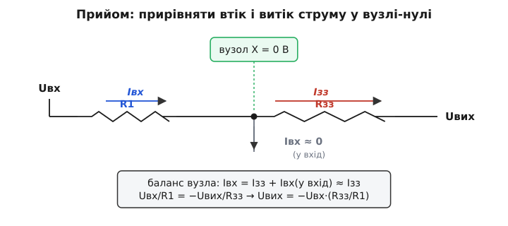
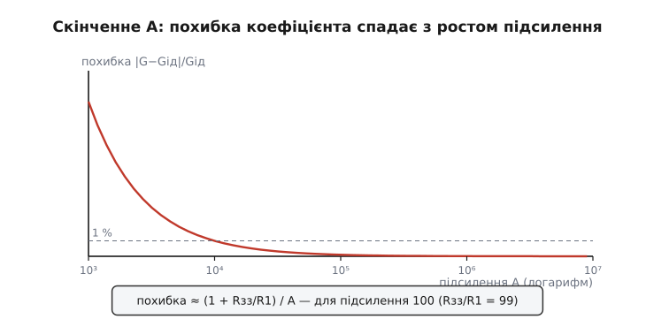

# 🧮 Передавальні співвідношення на віртуальній землі

Каскад на віртуальній землі рахується підозріло легко: `Uвих = −Uвх·R2/R1` пишуть в один рядок, ніби це аксіома. Але це не аксіома — це наслідок одного-єдиного фізичного твердження про вузол, з якого механічно випливають усі формули цього сімейства: інвертувальний підсилювач, суматор, перетворювач струму в напругу. Розберімо цей механізм до дна — так, щоб ви могли вивести будь-яку з цих формул самі, без заучування, а потім побачимо, що ховається за словом «ідеальний» і де воно дає тріщину.

Уся міць прийому стоїть на двох фактах про вузол на інвертувальному вході — назвімо його вузлом X:

1. **X сидить на потенціалі нуля** (віртуальна земля), бо петля від'ємного зворотного зв'язку тримає різницю входів підсилювача коло нуля, а другий вхід заземлено.
2. **У сам вхід підсилювача струм майже не тече** — вхідний опір операційного підсилювача величезний, вхідний струм мізерний.

Усе, що буде далі, — це багаторазове застосування цих двох фактів плюс один закон збереження. Якщо тримати їх у голові, формули перестають бути формулами й стають очевидністю.

## Закон, на якому все тримається: збереження заряду у вузлі

Перш ніж щось виводити, треба чітко назвати закон, який ми застосовуємо. Це **перший закон Кірхгофа** — закон струмів у вузлі: *скільки струму у вузол втікає, стільки й витікає*. Заряд не накопичується й не зникає в точці з'єднання провідників; усе, що зайшло, мусить вийти.

> Закон струмів сформулював німецький фізик Густав Кірхгоф 1845 року — ще студентом Кенігсберзького університету, у віці 21 року, розширивши на розгалужені кола роботу Ома. (Усталений історичний факт.) Сам закон глибший за електрику: це пряме віддзеркалення збереження електричного заряду. У точці-вузлі немає де заряду зібратися, тож алгебраїчна сума струмів дорівнює нулю.

Запишемо його у формі, якою користуватимемося весь час. Якщо домовитися, що **струми, які втікають у вузол, беремо зі знаком плюс**, а ті, що витікають, — зі знаком мінус, то для будь-якого вузла:

```
Σ Iₖ = 0          (сума всіх струмів гілок у вузлі — нуль)
```

Для вузла X це означає буквально таке: струм, що приходить по вхідному резистору, плюс струм, що приходить (чи відходить) по резистору зворотного зв'язку, плюс струм, що йде у вхід підсилювача, разом дають нуль. А оскільки струм у вхід підсилювача за фактом (2) дорівнює нулю, рівняння згортається до простого «втік дорівнює витоку» між двома резисторами. Ось і весь секрет: **віртуальна земля перетворює складний вузол на просту рівність двох струмів.** Уся арифметика далі — наслідок цього.

> 🔧 **Навіщо це.** Цей прийом — «прирівняти струми у вузлі-нулі» — економить вам години роботи й помилок. Без віртуальної землі довелося б писати систему рівнянь на всі вузли схеми й розв'язувати її. З нею кожна вхідна гілка дає свій струм незалежно, ви додаєте струми як числа й одразу маєте вихід. Саме тому інженери проєктують підсилювальні каскади буквально «в умі»: бачиш резистор на віртуальній землі — одразу знаєш струм крізь нього, бо напруга на ньому визначена однозначно.

## Інвертувальний підсилювач: виведення крок за кроком

Почнімо з найпростішого випадку — один вхідний резистор R1 і один резистор зворотного зв'язку R2. Мета — отримати `Uвих` через `Uвх`, не припускаючи відповіді наперед.

**Крок 1. Струм у вхідному резисторі.** Вхідна напруга `Uвх` прикладена до лівого кінця R1. Правий кінець R1 з'єднано з вузлом X, а X сидить на нулі. Напруга на резисторі — це різниця потенціалів його кінців, тобто `Uвх − 0 = Uвх`. За законом Ома струм крізь R1:

```
I₁ = (Uвх − 0) / R1 = Uвх / R1
```

Зверніть увагу: цей струм визначений **повністю**, ще до того, як ми щось знаємо про вихід. Саме тому, що другий кінець R1 прибитий до нуля. Це перша велика перевага віртуальної землі.

**Крок 2. Струм у резисторі зворотного зв'язку.** R2 з'єднує вузол X (0 В) із виходом (Uвих). Напруга на R2 — це `0 − Uвих = −Uвих`. Струм крізь нього (домовимося рахувати в напрямку від X до виходу):

```
I₂ = (0 − Uвих) / R2 = −Uвих / R2
```

**Крок 3. Баланс струмів у вузлі X.** Тепер застосуймо закон Кірхгофа. У вузол втікає I₁ (з боку R1). З вузла є три виходи для струму: назад у R1 (це вже враховано знаком), далі у R2, і у вхід підсилювача. Запишемо суму струмів, що **виходять** із вузла, прирівнявши її до струму, що **входить**:

```
I₁ = I₂ + Iвх(у вхід підсилювача)
```

За фактом (2) останній доданок дорівнює нулю. Лишається чисте:

```
I₁ = I₂
Uвх / R1 = −Uвих / R2
```

**Крок 4. Розв'язання відносно виходу.** Помножимо обидві частини на R2 і поділимо на потрібне:

```
Uвих = −Uвх · (R2 / R1)
```

Готово, і нічого зайвого. Коефіцієнт підсилення — це відношення двох резисторів зі знаком мінус. Звідки знак? Підніміть вхід — струм I₁ потече у вузол; щоб баланс зберігся, той самий струм мусить піти крізь R2 у бік виходу; а щоб струм тік від нуля до виходу, вихід має бути **нижчим за нуль**. Тому додатний вхід дає від'ємний вихід — каскад інвертує. Знак мінус тут не умовність, а пряма геометрія напряму струму.


*Серце всього прийому. У вузол X втікає струм Iвх по вхідному резистору R1, витікає Iзз по резистору зворотного зв'язку Rзз, а у вхід підсилювача струм майже не йде. Баланс «втік = витік» при X = 0 В дає рівність Uвх/R1 = −Uвих/Rзз — а з неї всі передавальні формули цього сімейства.*

**Worked-приклад: підсилення термопарного сигналу.** Сигнал термопари рівня 40 мВ треба підсилити в 50 разів зі зміною знаку. Беремо R1 = 2 кОм, тоді для `R2/R1 = 50` потрібно R2 = 100 кОм. Перевіримо на конкретному значенні:

```
I₁  = Uвх / R1 = 0.040 / 2000        = 20 мкА    (струм у R1)
Uвих = −I₁ · R2 = −20e-6 · 100000     = −2.0 В    (вихід)
|Uвих/Uвх| = 2.0 / 0.040             = 50         ✓
```

Той самий струм 20 мкА протікає крізь обидва резистори — це і є фізична суть «коефіцієнт = відношення опорів». Резистори різні, струм один; відношення напруг на них дорівнює відношенню опорів.

У прошивці часто доводиться вибирати резистор зворотного зв'язку під заданий коефіцієнт — наприклад, коли цифровий потенціометр стоїть на місці R2:

```c
// Резистор зворотного зв'язку під бажаний коефіцієнт інвертувального
// каскаду. gain — модуль |Uвих/Uвх| (знак мінус задає сама схема).
// r1, повернене значення — в омах.
float feedback_resistor(float r1, float gain)
{
    return gain * r1;            // |Uвих/Uвх| = R2/R1  →  R2 = gain · R1
}
// feedback_resistor(2000.0f, 50.0f) -> 100000 Ом = 100 кОм
```

## Вхідний опір: побічний продукт нуля

У тієї самої точки-нуля є наслідок, який легко проґавити, але який має пряме практичне значення — **вхідний опір каскаду**. Питання таке: який опір «бачить» джерело сигналу, коли дивиться у вхід підсилювача?

Джерело прикладає `Uвх` до лівого кінця R1 і живить струм `I₁ = Uвх / R1`. Вхідний опір за означенням — це відношення прикладеної напруги до спожитого струму:

```
Rвх = Uвх / I₁ = Uвх / (Uвх / R1) = R1
```

Отже джерело бачить рівно **R1** до землі — не більше, не менше. Чому так чисто? Бо правий кінець R1 сидить на віртуальному нулі, а отже R1 для джерела фактично під'єднано «одним кінцем у землю». Уся решта схеми — підсилювач, R2, вихід — для джерела невидима, схована за нерухомою точкою-нулем.

> 🔧 **Навіщо це.** Передбачуваний вхідний опір — це те, що дає змогу узгоджувати каскади. Якщо джерело сигналу має власний (вихідний) опір, він складеться з R1 і трохи зменшить ефективний коефіцієнт. Знаючи, що `Rвх = R1`, ви свідомо обираєте R1 достатньо великим проти опору джерела — і похибка стає керованою. Це й пояснює одну вроджену ваду інвертувального каскаду: щоб мати велике підсилення `R2/R1` при не надто великому R2, доводиться брати **малий** R1, а малий R1 — це низький вхідний опір, який навантажує джерело. Тут формула одразу показує компроміс.

## Суматор: незалежність гілок, помножена на віртуальну землю

Тепер — найкрасивіший наслідок прийому. Підведемо до вузла X не один вхідний резистор, а кілька: R1, R2, R3, кожен зі своїм вхідним джерелом U1, U2, U3. Резистор зворотного зв'язку лишимо один — Rзз. Що дасть схема?

Ключ — у тому, що вузол X тримається на нулі **незалежно** від того, скільки гілок до нього під'єднано й що в них коїться. Тому кожна вхідна гілка «не знає» про сусідів: на кожному вхідному резисторі напруга — це просто його власна вхідна напруга (бо другий кінець на нулі). Кожен дає свій струм самостійно, за тією самою формулою, що й одинокий R1:

```
I₁ = U1 / R1
I₂ = U2 / R2
I₃ = U3 / R3
```

**Усі ці струми збігаються у вузлі X.** Закон Кірхгофа знову: сума втікаючих струмів дорівнює тому, що витікає крізь Rзз (у вхід підсилювача — нуль). Сумарний струм входу:

```
Iсум = I₁ + I₂ + I₃ = U1/R1 + U2/R2 + U3/R3
```

Цей сумарний струм проходить крізь Rзз, і напруга на Rзз дорівнює `0 − Uвих`. Баланс:

```
Iсум = −Uвих / Rзз
U1/R1 + U2/R2 + U3/R3 = −Uвих / Rзз
```

Звідки одразу:

```
Uвих = −Rзз · (U1/R1 + U2/R2 + U3/R3)
```

Це **зважена сума** — кожен вхід входить у вихід зі своєю вагою `Rзз/Rₖ`, заданою його резистором. Хочете, щоб другий вхід важив удвічі більше за перший, — зробіть R2 удвічі меншим за R1. А якщо всі вхідні резистори однакові (`R1 = R2 = R3 = R`), вихід стає простим середнім зі знаком:

```
Uвих = −(Rзз / R) · (U1 + U2 + U3)
```

Тут варто зупинитися на тому, **чому** складання взагалі працює, і це найважливіша думка всієї вставки. Складання струмів — це закон Кірхгофа, він діє завжди. Але щоб струм кожної гілки дорівнював саме `Uₖ/Rₖ` **незалежно** від інших, потрібно, щоб напруга у вузлі не залежала від того, що роблять інші гілки. А це й забезпечує віртуальна земля: вузол прибито до нуля, тож яка б гілка не смикнулася, спільна точка не зрушується, і струми не перемішуються. **Віртуальна земля розв'язує входи між собою** — у цьому вся суть.

Прибравши нуль, ми б цю незалежність утратили миттєво. Уявіть, що вузол X не тримається жорстко: тоді струм з першого джерела, дотікши до вузла, підняв би на ньому напругу; ця піднята напруга змінила б напругу на резисторах **усіх** інших джерел, перекрутивши їхні струми; а ті, своєю чергою, знову зрушили б вузол. Гілки почали б впливати одна на одну через спільну точку, і чистого складання не вийшло б — вихід залежав би від усіх входів заплутано й нелінійно щодо номіналів. Тверда точка-нуль розриває цей взаємний вплив: кожна гілка бачить незмінний нуль і живить свій струм так, ніби сусідів немає.

**Worked-приклад: змішування трьох звукових каналів.** Треба скласти три сигнали з вагами 1 : 1 : 0.5 (третій тихіший удвічі) і завести в подальший каскад. Беремо Rзз = 20 кОм; для ваги 1 потрібен вхідний резистор 20 кОм, для ваги 0.5 — удвічі більший, 40 кОм:

```
R1 = R2 = 20 кОм  →  вага Rзз/R = 20000/20000 = 1.0
R3 = 40 кОм       →  вага Rзз/R = 20000/40000 = 0.5

Хай U1 = 0.10 В,  U2 = 0.20 В,  U3 = 0.40 В:
Uвих = −(1.0·0.10 + 1.0·0.20 + 0.5·0.40)
     = −(0.10 + 0.20 + 0.20)
     = −0.50 В
```

У прошивці зручно зберігати ваги масивом і одразу рахувати вихід цифрової моделі суматора — наприклад, щоб передбачити, що дасть аналогова частина, перш ніж міряти:

```c
// Передбачення виходу інвертувального суматора на N входів.
// rfb — резистор зворотного зв'язку (Ом); rin[i] — вхідні резистори (Ом);
// uin[i] — вхідні напруги (В). Повертає Uвих (В), знак уже з мінусом.
float summing_output(float rfb, const float *rin, const float *uin, int n)
{
    float acc = 0.0f;
    for (int i = 0; i < n; ++i)
        acc += uin[i] / rin[i];   // струм гілки: Iₖ = Uₖ / Rₖ
    return -rfb * acc;            // Uвих = −Rзз · Σ (Uₖ/Rₖ)
}
```

## Перетворювач струм-напруга: коли входом є сам струм

Дотепер входом була напруга, яку резистор перетворював на струм. Але часто джерело сигналу **саме по собі дає струм**, а не напругу — наприклад, фотодіод видає струм, пропорційний світлу. Тоді вхідний резистор не потрібен взагалі: струм заводять прямо у вузол X.

Виведення тут найкоротше з усіх, бо половину роботи вже зроблено за нас — струм заданий ззовні. Хай джерело вганяє у вузол струм `I`. У вузол втікає `I`; у вхід підсилювача струм не йде; отже весь `I` мусить вийти крізь Rзз. Напруга на Rзз — це `0 − Uвих`, а струм крізь нього в напрямку від X до виходу дорівнює `−Uвих / Rзз`. Прирівнюємо до втікаючого:

```
I = −Uвих / Rзз
Uвих = −I · Rзз
```

Каскад перетворив струм на пропорційну напругу, і коефіцієнт перетворення — це опір Rзз (його розмірність — вольт на ампер, тобто оми; звідси й назва «трансімпеданс» — передавальний опір). Подайте 1 мкА у схему з Rзз = 1 МОм — і на виході матимете −1 В. Простіше нікуди.

Але цікаве — не сама формула, а **чому струмове джерело варто заводити саме у віртуальну землю**, а не просто навісити на нього резистор до землі. Якщо повісити резистор, то на ньому (а отже й на джерелі) виникне напруга `I·R`. Для фотодіода ця напруга — зло: вона зміщує його робочу точку, відмикає його внутрішній перехід, той починає сам пропускати паразитний струм, і вимір псується нелінійно. А у віртуальній землі **на джерелі майже немає напруги**: один його кінець на справжній землі, другий — на віртуальній, різниця коло нуля. Джерело працює в режимі майже короткого замикання, де воно віддає чистий струм, не «бачачи» вихідної напруги. Ось чому перетворювач струм-напруга будують саме так — віртуальна земля дає те, чого пасивний резистор дати не може: перетворення без напруги на самому джерелі.

> 🔧 **Навіщо це.** Перетворювач струм-напруга на віртуальній землі — серце будь-якого вимірювання слабкого струму: фотодіоди, фотопомножувачі, іонізаційні камери, давачі з виходом «струм». Скрізь, де сигнал природно є струмом і де важлива точність, його заводять у вузол-нуль, а коефіцієнт виставляють одним резистором Rзз. Зміна Rзз — це зміна чутливості; її часто перемикають реле чи аналоговим ключем, щоб охопити різні діапазони рівнів сигналу одним приладом.

## Поправка на скінченне підсилення: вузол не зовсім на нулі

Усе попереднє спиралося на твердження «X сидить точно на нулі». Це ідеалізація, і час чесно подивитися, наскільки вона точна та коли ламається. Підсилення A операційного підсилювача велике, але **скінченне** — не нескінченне. А це означає, що вузол X сидить не зовсім на нулі.

Згадаймо означення підсилювача: `Uвих = A·(U₊ − U₋)`. Плюсовий вхід заземлено, `U₊ = 0`, тож:

```
Uвих = A·(0 − U₋) = −A·U₋
```

Звідси потенціал вузла X (це і є U₋):

```
U₋ = −Uвих / A
```

Ось вона, правда: вузол сидить не на нулі, а на крихітному `−Uвих/A`. Якщо A = 100000, а вихід дає −2 В, то вузол насправді стоїть на `+2/100000 = 0.00002 В = 20 мкВ` — частки мілівольта, але не строгий нуль. Перепишемо передавальну формулу інвертувального каскаду **без** припущення про точний нуль і подивимося, наскільки зміститься коефіцієнт.

**Крок 1. Струм у R1** — тепер лівий кінець на Uвх, правий на `U₋ = −Uвих/A`:

```
I₁ = (Uвх − U₋) / R1 = (Uвх + Uвих/A) / R1
```

**Крок 2. Струм у R2** — від вузла (`−Uвих/A`) до виходу (`Uвих`):

```
I₂ = (U₋ − Uвих) / R2 = (−Uвих/A − Uвих) / R2
```

**Крок 3. Баланс** (вхідний струм підсилювача все ще беремо нульовим — це окреме припущення, і воно дуже точне для більшості мікросхем):

```
I₁ = I₂
(Uвх + Uвих/A) / R1 = (−Uвих/A − Uвих) / R2
```

**Крок 4. Розв'язання.** Помножимо навхрест на R1·R2 і зберемо `Uвих`:

```
R2·(Uвх + Uвих/A) = R1·(−Uвих/A − Uвих)
R2·Uвх + R2·Uвих/A = −R1·Uвих/A − R1·Uвих
R2·Uвх = −R1·Uвих − R1·Uвих/A − R2·Uвих/A
R2·Uвх = −Uвих·( R1 + (R1 + R2)/A )
```

Звідки точний коефіцієнт:

```
Uвих/Uвх = −R2 / ( R1 + (R1 + R2)/A )
```

Поділимо чисельник і знаменник на R1, щоб виявити структуру:

```
Uвих/Uвх = −(R2/R1) / ( 1 + (1 + R2/R1)/A )
```

Ось чиста, точна формула — і вона багато про що розповідає. Ідеальний результат `−(R2/R1)` тепер поділений на множник `1 + (1 + R2/R1)/A`. Поки A величезне, додаток `(1 + R2/R1)/A` мізерний, множник ≈ 1, і ми повертаємося до знайомого `−R2/R1`. Але щойно A падає або підсилення `R2/R1` росте — цей доданок стає помітним, і реальний коефіцієнт **просідає нижче** за ідеальний.

Корисно записати приблизну **відносну похибку** коефіцієнта. Для великого A множник `1/(1 + ε) ≈ 1 − ε`, тож реальний коефіцієнт менший за ідеальний приблизно на частку:

```
похибка ≈ (1 + R2/R1) / A
```

Вираз `(1 + R2/R1)` — не випадковий. Це **шумовий коефіцієнт** каскаду (англ. *noise gain*): на скільки підсилюється сигнал, поданий на плюсовий вхід, або, що те саме, обернена частка сигналу зворотного зв'язку, що повертається на вузол. Саме він, а не саме підсилення `R2/R1`, визначає, як міцно петля тримає віртуальну землю. Звідси важливий висновок: **великий коефіцієнт каскаду коштує точності.** Підсилювач із підсиленням 1000 на тому самому A матиме в десятки разів більшу похибку, ніж із підсиленням 10, бо в нього більший шумовий коефіцієнт.


*Як скінченне A зсуває коефіцієнт. Відносна похибка реального підсилення від ідеального дорівнює приблизно (1 + Rзз/R1)/A і спадає обернено до A. Для каскаду з підсиленням 100 (Rзз/R1 = 99) навіть A = 10⁴ дає похибку коло одного відсотка; з A = 10⁵ і вище вона стає мізерною. Горизонтальна вісь — підсилення A в логарифмі.*

**Worked-приклад: коли поправка вже має значення.** Візьмімо каскад із підсиленням 100 (`R2/R1 = 99`, тобто шумовий коефіцієнт 100) і порахуймо реальний коефіцієнт для двох мікросхем — дешевої з A = 10⁴ і доброї з A = 10⁵:

```
шумовий коефіцієнт:  1 + R2/R1 = 100

A = 10⁴:  множник = 1 + 100/10000 = 1.0100
          реальне підсилення = −99 / 1.0100 = −98.02   (похибка −0.99 %)

A = 10⁵:  множник = 1 + 100/100000 = 1.0010
          реальне підсилення = −99 / 1.0010 = −98.90   (похибка −0.099 %)
```

Тобто з дешевим підсилювачем ваш коефіцієнт «100» насправді 98 — майже відсоток помилки лише через скінченне A, ще до всіх інших похибок. Для звуку це невидимо; для вимірювального каскаду, де ловлять десяті частки відсотка, — уже критично, і тоді беруть підсилювач із вищим A або зменшують потрібний коефіцієнт каскаду, ділячи підсилення між двома ступенями.

У прошивці точну формулу інколи застосовують для **програмної компенсації**: знаючи паспортне A підсилювача на робочій частоті, можна підправити виміряне значення назад до ідеального коефіцієнта:

```c
// Точний коефіцієнт інвертувального каскаду зі скінченним підсиленням A.
// r1, r2 — опори (Ом); a_ol — підсилення без зворотного зв'язку (рази).
// Повертає Uвих/Uвх (від'ємний). При a_ol → ∞ прямує до −r2/r1.
float inverting_gain_finite(float r1, float r2, float a_ol)
{
    float ideal = r2 / r1;                 // ідеальне |підсилення|
    float noise_gain = 1.0f + r2 / r1;     // шумовий коефіцієнт (1 + R2/R1)
    return -ideal / (1.0f + noise_gain / a_ol);
}
// inverting_gain_finite(1000, 99000, 1e4f) -> -98.02 (а не -99)
```

## Те саме коріння для суматора й перетворювача струму

Поправка, яку ми вивели для одного входу, переноситься на решту сімейства майже без змін — бо джерело похибки одне: вузол сидить на `−Uвих/A`, а не на нулі. Для **суматора** кожна вхідна гілка тепер бачить на своєму резисторі не `Uₖ`, а `Uₖ − (−Uвих/A) = Uₖ + Uвих/A`, тож кожен струм трохи спотворений тим самим залишком. Сумарний ефект знову зводиться до ділення ідеального результату на множник із шумовим коефіцієнтом — тільки шумовий коефіцієнт суматора більший, бо вхідних резисторів багато, і всі вони паралельно «розбавляють» зворотний зв'язок:

```
шумовий коефіцієнт суматора = 1 + Rзз·(1/R1 + 1/R2 + 1/R3 + …)
```

Що більше входів, то вищий цей коефіцієнт, то відчутніша похибка від скінченного A. Тому багатовходові суматори на дешевих підсилювачах помітніше «не дотягують» — це прямий наслідок виведеної формули, а не окрема вада.

Для **перетворювача струм-напруга** історія така сама за формою, але з повчальним нюансом. Вузол сидить на `−Uвих/A`, тож на самому джерелі струму вже не строгий нуль, а ця крихітна напруга. Для фотодіода це означає, що ідеальний режим «нуль напруги на діоді» виконується не точно — і саме тому в прецизійних світлових вимірах борються за якомога більше A (а ще за малий вхідний струм підсилювача, бо він додається прямо до вимірюваного струму джерела). Знову: формула не просто рахує число, вона показує, **за що саме платити** в конкретній схемі.

Докладніше про те, чому A не лишається великим, а **спадає з частотою**, як це додатково розмиває віртуальну землю на високих частотах, і де ще ховаються межі застосовності — в історії та основному викладі теми; тут важливо втримати одне: усі ці передавальні формули — границя нескінченного A, а реальна схема живе трохи нижче за ідеал, і виведена поправка `(1 + Rзз/R1)/A` каже наскільки.

## Межі застосовності: де формули перестають діяти

Підсумуймо, за яких умов виведене вище взагалі правомірне. Кожна формула цього сімейства мовчки припускає кілька речей; вийдіть за них — і обчислення дасть число, якого в реальності не буде.

**Петля має бути замкнута й лінійна.** Уся побудова стоїть на тому, що вихід вільно рухається й тримає вузол на (майже) нулі. Щойно вихід уперся в шину живлення — насичення — петля розривається, вузол зривається з нуля, і `Uвих = −Uвх·R2/R1` більше не діє: підсилювач просто лежить на шині. Перед застосуванням формули завжди подумки перевірте, що очікуваний вихід **у межах живлення** з запасом.

**Вхідний струм підсилювача справді мізерний.** Ми всюди викидали струм, що йде у вхід. Для підсилювачів із польовими транзисторами на вході він і справді нікчемний (пікоампери), і припущення майже ідеальне. Але в каскаді, що працює з дуже великими опорами (Rзз у мегаомах і вище) або на біполярному підсилювачі з відчутним вхідним струмом, цей струм, протікши крізь Rзз, дає власну паразитну напругу на виході — її доводять до уваги окремо.

**A досить велике для потрібної точності.** Виведена поправка `(1 + Rзз/R1)/A` каже точно, скільки коштує скінченне A. Якщо ця похибка вкладається у ваш бюджет точності — користуйтеся ідеальними формулами сміливо. Якщо ні — або беріть підсилювач із більшим A, або зменшуйте коефіцієнт каскаду (дробіть підсилення між ступенями), щоб збити шумовий коефіцієнт.

**Сигнал низькочастотний у духовному сенсі.** Усе виведення — для постійного струму й повільних змін. На високих частотах A спадає, віртуальна земля «розмивається», а до похибки коефіцієнта додаються зсуви фази й обмеження швидкості наростання виходу. Ідеальні передавальні формули — це низькочастотна границя; що вища частота, то умовніша.

Спільна нитка всіх меж одна, і вона важливіша за будь-яку формулу: **передавальні співвідношення на віртуальній землі — це не властивість резисторів, а наслідок живої, замкнутої, лінійної петлі з достатнім запасом по напрузі, струму, швидкості та підсиленню.** Поки петля в цьому режимі — формули точні до часток відсотка. Вийшли за межі — і `Uвих = −Uвх·R2/R1` стає просто рядком, який ні до чого в схемі вже не прив'язаний. Тому правильний порядок думки завжди такий: спершу переконайся, що петля жива й має запас, і лише тоді прирівнюй струми у вузлі-нулі.
