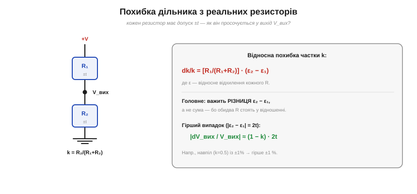
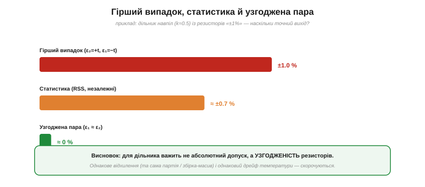

# 🧮 Допуски складаються: похибка дільника з реальних резисторів

> Числова вставка до теми [«Дільник напруги»](book:electronics/voltage-divider). Ідеальна формула дільника — V_вих = V·R₂/(R₁+R₂). Та реальні [резистори](book:electronics/resistor) мають **допуск** — ±5 %, ±1 %. Як ці допуски просочуються у вихід дільника? Відповідь напрочуд гарна: важить не сума похибок, а **різниця** — і на ній стоїть уся точна аналогова техніка.

### Задача: від ідеалу до реальності

Резистор «10 кΩ ±1 %» — це насправді будь-яке значення між 9.9 і 10.1 кΩ. Позначмо **відносне відхилення** кожного резистора як ε = dR/R (для ±1 % воно лежить у межах ±0.01). Питання: якщо R₁ відхилилось на ε₁, а R₂ на ε₂, наскільки зміниться вихід дільника?

### Формальний апарат: як похибка просочується

Частка дільника — це k = R₂/(R₁+R₂). Щоб знайти її відносну зміну, зручно прологарифмувати й продиференціювати (ln k = ln R₂ − ln(R₁+R₂)):

```
dk/k = dR₂/R₂ − (dR₁ + dR₂)/(R₁ + R₂).
```

Підставивши dRᵢ = εᵢ·Rᵢ і згрупувавши, дістаємо на диво просту відповідь:

```
dk/k = [R₁/(R₁+R₂)] · (ε₂ − ε₁).
```


*Рис. Похибка частки дільника: dk/k = [R₁/(R₁+R₂)]·(ε₂−ε₁). Вирішує не сума, а РІЗНИЦЯ відносних відхилень — бо обидва резистори стоять у відношенні. Гірший випадок (відхилення в протилежні боки, |ε₂−ε₁| = 2t) дає |dV_вих/V_вих| ≈ (1−k)·2t.*

Тут дві несподіванки. По-перше, у формулі стоїть **різниця** ε₂ − ε₁, а не сума. По-друге, попереду — множник R₁/(R₁+R₂) = (1 − k): що ближчий вихід до повної напруги (k→1), то менша похибка, а біля нуля (k→0) вона максимальна.

### Гірший випадок проти статистики

Звідси два способи оцінити похибку. **Гірший випадок** (*worst case*): припускаємо, що відхилення лягли в найнещасніший бік — одне в плюс, друге в мінус, тож |ε₂ − ε₁| = 2t. Тоді

```
|dV_вих / V_вих|(гірше) ≈ (1 − k) · 2t.
```

Для дільника навпіл (k = 0.5, R₁ = R₂) це (1−0.5)·2t = t: два резистори ±1 % дають вихід із гіршою похибкою лише **±1 %**, а не ±2 %, як можна було б злякано порахувати.

Та гірший випадок — рідкісний: щоб обидва резистори вискочили на протилежні краї допуску, треба невдача в квадраті. Якщо відхилення **незалежні й випадкові**, вони складаються не арифметично, а як **корінь із суми квадратів** (*RSS*): типова похибка виходить у ~√2 разів менша за гіршу. Тому в серійному виробництві орієнтуються на RSS, а гірший випадок лишають для критичних кіл, де «раз на тисячу» неприпустимо.

### Узгоджена пара: коли похибка зникає

А ось найкрасивіший наслідок формули. Якщо обидва резистори відхилилися **однаково** (ε₁ = ε₂), то різниця ε₂ − ε₁ = 0 — і похибка частки **зникає цілком**, хоч би якими «неточними» були самі резистори!


*Рис. Той самий «±1 %» дільник навпіл за трьох припущень: гірший випадок ±1 %, статистична оцінка ≈±0.7 %, а узгоджена пара (однакове відхилення) — майже 0. Для дільника вирішує не абсолютний допуск, а узгодженість резисторів.*

Це не теорія, а робочий інженерний прийом. Беруть резистори з **однієї збірки-масиву** (де всі елементи виготовлені поряд і відхилені однаково) або **підібрану пару** — і дільник стає набагато точнішим за свої окремі резистори. Більше того: якщо обидва однаково **дрейфують від температури** (однаковий [TCR](book:electronics/resistor)), то й температурна похибка скорочується так само. Саме на цьому стоять точні подільники, опорні дільники АЦП і зворотний зв'язок підсилювачів, де коефіцієнт задає **відношення** резисторів. І це той самий принцип, що працює у [мості Вітстона](book:electronics/wheatstone-bridge): важить не абсолютна величина, а **узгодженість пліч**.

### Де працює

Підсумок практичний. Коли потрібен точний дільник: (1) для грубої оцінки бери гірший випадок (1−k)·2t; (2) для серії — RSS; (3) а коли треба справді точно — став **узгоджену пару** з масиву, і тоді абсолютний допуск майже не важить. Запам'ятай головне: у дільнику похибки резисторів не просто складаються — вони **віднімаються**, і цим можна скористатися.
