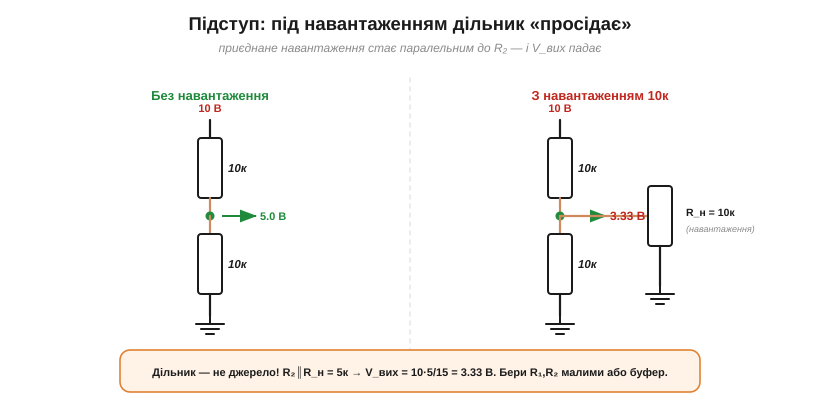

# Дільник напруги

**Дільник напруги** (*voltage divider*) — це, мабуть, найпоширеніша маленька схемка в усій електроніці: лише два послідовні резистори, а напругу знімають із **середньої точки** між ними. Він прямо випливає із [закону напруг Кірхгофа](book:electronics/kvl); розберемо його до кінця — формулу, вибір, регульований варіант і головний підступ.

### Формула: V_вих = V·R₂/(R₁+R₂)


*Рис. Дільник напруги: два послідовні резистори, а напругу знімають із середньої точки. Той самий струм I = V/(R₁+R₂) тече крізь обидва; на R₂ спадає V_вих = I·R₂ = V·R₂/(R₁+R₂).*

Виведення спирається на [послідовне з'єднання](book:electronics/series-connection). Резистори послідовні, тож крізь них тече **спільний** струм I = V/(R₁+R₂). Вихід ми знімаємо як спад на R₂, тобто V_вих = I·R₂. Підставивши струм, дістаємо формулу дільника:

V_вих = V · R₂ / (R₁ + R₂).

Усе, що вона каже, — це проста пропорція: напруга ділиться між резисторами **пропорційно опорам**, і на R₂ припадає його частка R₂/(R₁+R₂) від повної напруги.

Щоб не плутатися, котрий резистор у формулі — «R₂»: це **той, на якому знімають вихід**, тобто **нижнє** плече, між відводом і спільним проводом (землею). Верхнє плече R₁ стоїть між входом і відводом. Поміняєте їх місцями — дістанете іншу частку, R₁/(R₁+R₂), тож тримайте позначення в голові.

### Як вибрати частку

Формула одразу підказує, як дібрати потрібний вихід: усе вирішує **відношення** R₂ до суми.


*Рис. Частка виходу залежить від відношення опорів: рівні R₁=R₂ дають половину, більший R₂ — ближче до повної напруги, менший — ближче до нуля. Усе за тією самою формулою V·R₂/(R₁+R₂).*

Якщо R₁ = R₂ — на виході рівно **половина** напруги. Хочете більше — беріть R₂ більшим за R₁ (вихід тягнеться до повної V); хочете менше — навпаки. Зверніть увагу: важливе саме **відношення**, а не самі номінали. Дільник 10к/10к і 100к/100к дають однакову половину — хоча за поведінкою під навантаженням вони не однакові.

**Приклад. Дільник R₁ = 10 кΩ, R₂ = 20 кΩ під 5 В — яка V_вих?**

```
V_вих = V · R₂/(R₁+R₂) = 5 · 20/(10+20) = 5 · 20/30 ≈ 3.33 В
```

> 🧮 **А наскільки точна ця частка?** Реальні резистори мають допуск, і їхні похибки складаються у вихід **несподівано** — не сумою, а **різницею**: однаково відхилені (узгоджені) резистори дають точний дільник попри свій допуск. Розрахунок гіршого випадку, статистики (RSS) і переваги узгодженої пари — у вставці [Допуски складаються](math-tolerance.md).

> ⚙️ **А де взяти такі номінали?** Точного відношення в ряду E24 може й не бути — тоді найкращу **пару** реальних резисторів шукають перебором сітки значень: [Добір пари зі стандартного ряду](proj-divider-search.md).

### Потенціометр: регульований дільник

Якщо середній відвід зробити **рухомим**, дільник стає регульованим — і це є **потенціометр** (*potentiometer*; розмовно — просто «пот»).


*Рис. Потенціометр — це дільник зі змінним відводом: повзунок ділить доріжку на верхню й нижню частини, і, рухаючи його, ми плавно змінюємо V_вих від 0 до V. Так працюють регулятори гучності та яскравості.*

Усередині потенціометра — суцільна резистивна доріжка з двома кінцевими виводами, а між ними ковзає **повзунок** (третій вивід). Повзунок ділить доріжку на «верхній» і «нижній» опори — рівно як R₁ і R₂ дільника, тільки їхнє відношення **плавно змінюється**, коли ви крутите ручку. На повному оберті V_вих проходить увесь діапазон від 0 до V. Саме так влаштовані ручки **гучності**, яскравості, регулятори — і так само мікроконтролер читає положення «крутилки».

Два уточнення. Якщо задіяти лише **два** виводи (кінець і повзунок), потенціометр перетворюється на **змінний резистор** (реостат) — це вже не дільник, а просто регульований опір. А ще доріжки бувають із **лінійною** й **логарифмічною** характеристикою: для гучності беруть логарифмічну, бо так вухо сприймає наростання звуку рівномірнішим. Як [реальна деталь](book:electronics/potentiometer) пот має ще багато нюансів — форм-фактори (панельний, тример, фейдер, цифровий digipot), характеристики A/B і свої граблі (шум повзунка, зношення доріжки).

### Підступ навантаження: дільник просідає

А тепер — найважливіше застереження, на якому горить багато початківців. Формула V·R₂/(R₁+R₂) справджується, лише поки до виходу **нічого не приєднано** (або приєднане має дуже великий опір). Щойно ви підключите реальне навантаження, воно стане **паралельним** до R₂ — і вихід **просяде**.


*Рис. Головний підступ: приєднане навантаження стає паралельним до R₂, знижуючи його, — і V_вих просідає (тут із 5.0 до 3.33 В). Дільник — не джерело живлення: або беруть R₁, R₂ значно меншими за навантаження, або ставлять буфер.*

Подивіться на числа: дільник 10к/10к під 10 В дає на холостому ході 5.0 В. Та приєднайте навантаження 10 кΩ — і воно стане паралельним до нижнього резистора: R₂ ∥ R_н = 5 кΩ, тож V_вих = 10·5/15 ≈ **3.33 В**. Вихід упав на третину, хоч ми «нічого не міняли» в самому дільнику. Висновок: **дільник — це не джерело живлення**. Він добре задає **опорну напругу** для входу з великим опором (як-от АЦП), але не годиться, щоб живити струмоємне навантаження.

Інженери описують це через **опір**: щоб не просаджувати дільник, навантаження мусить мати великий **вхідний опір** — саме тому входи АЦП роблять високоомними. А «силу» самого дільника як джерела характеризує його **вихідний опір** (приблизно R₁∥R₂): що він менший, то менше просідання під навантаженням. Це прямий зв'язок з [еквівалентом Тевеніна](book:electronics/thevenin), де реальне джерело описують парою «напруга + внутрішній опір».

> 🔧 **Навіщо це.** Дільник напруги — ваш щоденний інструмент для двох речей: задати **опорну напругу** й **зчитати давач**. Але пам'ятайте про навантаження. Правило великого пальця: опір навантаження має бути **щонайменше вдесятеро більший** за R₂ (тоді просідання — у межах кількох відсотків). Якщо навантаження «важке», або беріть R₁, R₂ **малими** (ціною більшого струму й тепла), або ставте після дільника **буфер** — повторювач на операційному підсилювачі (Модуль 2), що повторює напругу, не навантажуючи дільник. І не забувайте: дільник постійно споживає струм I = V/(R₁+R₂), тож для економних пристроїв опори беруть великими.

### Де це працює: читання давачів

Найгарніше застосування дільника — **аналогові давачі**. Багато з них — це просто резистори, чий опір змінюється від умов: [термістор](book:electronics/ntc-thermistor) (опір залежить від температури), [фоторезистор/LDR](book:sensor-board/light-sensors) (від освітлення), тензодавач (від деформації).


*Рис. Найкорисніше застосування: давач (термістор, фоторезистор) як одне плече дільника. Його опір змінюється з температурою чи світлом — і V_вих, яку зчитує АЦП мікроконтролера, відображає умову. Так контролер «бачить» аналоговий світ.*

Поставивши такий давач одним плечем дільника, а звичайний резистор — другим, ми перетворюємо **зміну опору** на **зміну напруги**, яку вже легко виміряти. Холодніше — опір термістора росте — вихідна напруга змінюється; мікроконтролер зчитує її своїм [АЦП](book:electronics/adc) (аналого-цифровим перетворювачем) і дізнається температуру. Майже кожен аналоговий давач під'єднують саме через дільник. Скромні два резистори виявляються очима, якими цифровий світ дивиться на аналоговий.

---

Підсумок: **дільник напруги** — два послідовні резистори з відводом посередині; V_вих = V·R₂/(R₁+R₂), тобто напруга ділиться пропорційно опорам. Частку задають **відношенням** опорів; рухомий відвід дає **потенціометр**. Головний підступ — **навантаження**: воно паралелиться до R₂ і просаджує вихід, тож дільник годиться для опорних напруг і давачів, а не для живлення. Саме через дільник мікроконтролери читають аналогові давачі. Дзеркальний аналог для струму — [дільник струму](book:electronics/current-divider).

---
