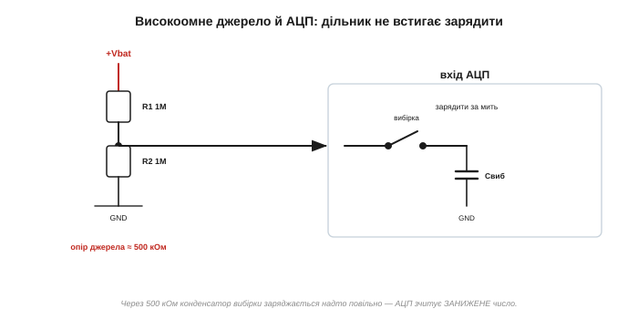
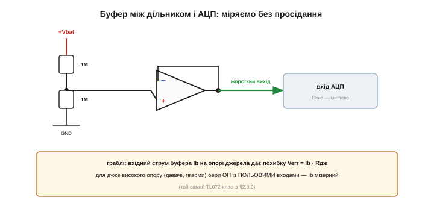

# 🔌 Буфер для вимірювання: повторювач рятує високоомне джерело

> [Повторювач (буфер)](topic:electronics/voltage-follower) розв'язує опори: його велетенський вхід нічого не вантажить, а жорсткий вихід тримає напругу. Ось гострий практичний випадок, на якому спотикається кожен з мікроконтролером: виміряти **високоомний** вузол — напругу акумулятора крізь великий дільник або сигнал високоомного давача — за допомогою [АЦП](topic:electronics/adc). Підключиш напряму — дістанеш хибне число; повторювач це лікує.

### Сценарій: виміряти напругу, не зіпсувавши її

Хай мікроконтролер має стежити за напругою акумулятора. Акумулятор дає до 4.2 В, а АЦП приймає лише 0…3.3 В — тож напругу ділять навпіл дільником. А щоб не висаджувати батарею самим вимірюванням, резистори беруть **великі**: 1 МОм і 1 МОм. І ось АЦП показує… дурню. Чому?

### Чому АЦП бреше з високоомного джерела

*АЦП — не пасивний вольтметр. Усередині нього схема вибірки-зберігання: на кожне перетворення вона на мить під'єднує маленький конденсатор до входу й мусить **зарядити** його до вхідної напруги за коротке вікно. Крізь опір джерела ≈500 кОм (це Тевенінів опір дільника) той конденсатор заряджається надто повільно — і АЦП устигає зчитати занижене число.*

Корінь біди в тому, що вхід АЦП — **активний**: він раз у раз під'єднує крихітний конденсатор вибірки й має наповнити його до напруги входу за лічені мікросекунди. Джерело з опором у сотні кілоом просто не встигає його зарядити — і перетворювач бачить **недозаряд**, тобто занижену напругу. Це класична пастка «мій АЦП бреше з високоомного дільника». Недарма даташити мікроконтролерів прямо вказують **максимальний опір джерела** на вході АЦП — часто близько 10 кОм.

### Чому не просто менші резистори

Здавалося б, зменши резистори дільника — і опір джерела впаде. Але тоді дільник **безперервно** жере струм від акумулятора (а ми ж і ставили його, щоб **економити** заряд). Високоомний дільник (мала витрата) і АЦП (хоче низький опір) суперечать одне одному — рівно та розв'язка опорів, заради якої існує буфер.

### Лікування: повторювач перед АЦП

*Повторювач між дільником і АЦП. Його велетенський вхід не вантажить дільник 1М/1М — той тримає точно свою напругу й нічого зайвого не витрачає. А жорсткий низькоомний вихід **миттєво** заряджає конденсатор вибірки. АЦП нарешті читає правду.*

Поставте між вузлом дільника й АЦП [**повторювач**](topic:electronics/voltage-follower) — і суперечність зникає. Велетенський вхід буфера не вантажить дільник (той лишається економним і високоомним), а жорсткий вихід заряджає конденсатор вибірки за мить. Буфер **розв'язав** кволе джерело й вимогливий АЦП: дільник задає напругу, а струм для входу АЦП дає буфер.

### Перший вимір

З'єднання просте: вузол дільника → на «+» ОП, вихід замкнено на «−» (повторювач ×1), а вихід — на ніжку АЦП. Живіть ОП від шини, що покриває вимірюваний діапазон. Жодного коду — лише одна мікросхема між дільником і АЦП.

### Типові граблі

**Вхідний струм буфера.** Сам буфер бере крихітний вхідний струм Ib, і на високому опорі джерела він дає похибку Verr = Ib × (опір джерела). На 500 кОм навіть кілька наноампер — це вже мілівольти. Тому для високоомних джерел беруть ОП із **польовими** входами (мізерний Ib — той самий TL072-клас із [реальними межами ОП](topic:electronics/real-opamp-limits)).

**Зовсім високоомні давачі.** pH-електрод (гігаоми!), фотодіод, п'єзодавач — їх **узагалі** не можна вантажити; буфер із польовими входами там не розкіш, а обов'язок.

**Діапазон і зсув.** Буфер мусить приймати вимірювану напругу (біля рейки — бери rail-to-rail), а його власний зсув додається до показу — для точності бери малозсувний ОП.

### Варіації

Є готові буфери-«драйвери АЦП» (одиничного підсилення); у деяких мікроконтролерів буфер чи підсилювач уже вбудовано перед АЦП; для **різницевих** високоомних джерел беруть [вимірювальний підсилювач](topic:electronics/summing-difference-amp). А дрібний конденсатор просто на ніжці АЦП ще трохи допомагає схемі вибірки.

> 🔧 **Навіщо це.** Міряєш мікроконтролером високоомний вузол (акумулятор крізь великий дільник, давач) — пам'ятай, що вхід АЦП **активний** і не любить великого опору джерела (часто межа ~10 кОм). Постав між ними **повторювач**: дільник лишається економним, а АЦП дістає жорстке джерело й читає правду. Для дуже високого опору бери буфер із **польовими** входами, щоб його власний вхідний струм не зіпсував вимір.
