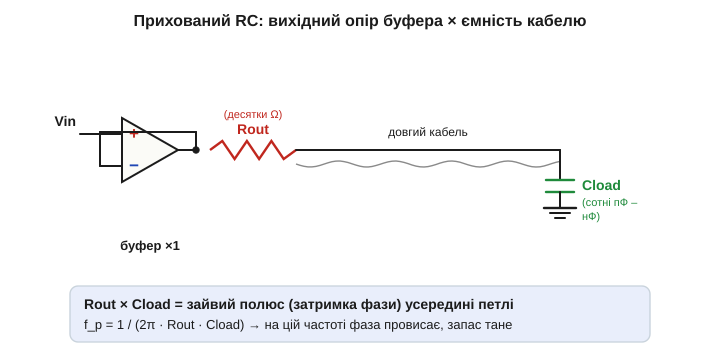
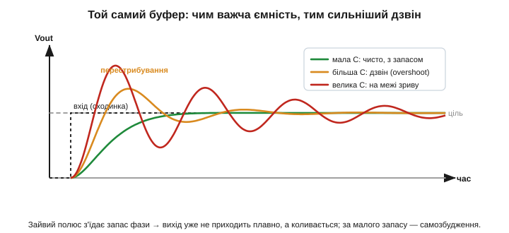
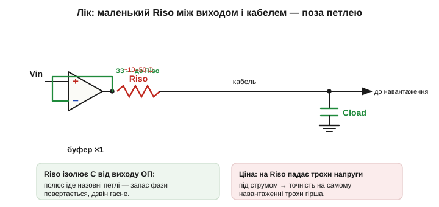

# 🧮 ОП і ємнісне навантаження: чому буфер «дзвонить» на довгому кабелі

> [Повторювач (буфер)](topic:electronics/voltage-follower) на ОП виглядає майже ідеальним: бери напругу зі слабкого джерела й віддавай її «з силою» на довгий кабель чи важке навантаження. Та є підступ. Підключи буфер до **довгого кабелю** — і його чистий вихід раптом починає **дзвонити**: після кожного перепаду напруга кілька разів перестрибує ціль і коливається, а в найгіршому разі ОП зривається в **самозбудження** й гуде сам собою. Розберімо, **звідки** ця біда береться і як її порахувати.

### Винуватець: вихідний опір, який ми «занулили»

В [ідеальній моделі](topic:electronics/ideal-opamp) вихідний опір ОП — **нуль**. Та реальний вихід має скінченний **вихідний опір** *(output impedance,* R_out*)* — типово десятки ом на постійному струмі, та й він **росте з частотою**, бо петля [зворотного зв'язку](topic:electronics/negative-feedback) на високих частотах слабшає. А **довгий кабель** — це не просто дріт: між його жилою та екраном (чи землею) є **ємність** *(capacitance,* C_load*)*, і вона тим більша, чим довший кабель. Коаксіал дає десь **80–100 пФ на метр**, тож кілька метрів — це вже сотні пікофарад, а добрий жмут проводки — і ціла **наблизькофарада**.

Постав їх поряд — R_out на виході ОП і C_load кабелю — і отримаєш звичайний [**RC-фільтр нижніх частот**](topic:electronics/frequency-response), захований **усередині** петлі зворотного зв'язку. А кожен RC вносить **затримку фази**: на високих частотах напруга на ємності **відстає** від того, що жене ОП.


*Прихований RC. Скінченний вихідний опір R_out послідовно з ємністю кабелю C_load утворює фільтр нижніх частот прямо на виході ОП — усередині петлі зворотного зв'язку. Його частота зламу f_p = 1/(2π·R_out·C_load): саме там фаза починає провисати, а запас стійкості — танути.*

### Чому затримка фази — це небезпечно

Стабільність тримається на тому, що [зворотний зв'язок](topic:electronics/negative-feedback) іде на «−» й **протидіє** змінам. Та «протидіє» означає «віднімає те, що відбувається **зараз**». Якщо ж сигнал, який вертається, **запізнюється** по фазі, то ОП віднімає вже **застарілу** копію виходу — і на якійсь частоті це запізнення сягає піввитка (180°). Тоді те, що мало **гасити** зміну, починає її **підштовхувати**: від'ємний зв'язок на цій частоті обертається на **додатний**. Запас між «безпечно» і «зрив» інженери міряють **запасом фази** *(phase margin)* — це скільки градусів лишилося до фатальних 180° на частоті, де петльове підсилення падає до одиниці.

Захований RC з'їдає цей запас. Його полюс додає аж до 90° запізнення; впаде він поблизу частоти, де петля й так на межі, — і запасу фази майже не лишиться. Наслідок видно на перехідній характеристиці.


*Той самий буфер на сходинку входу за різної ємності. Мала C — вихід приходить чисто, із запасом. Більша C — полюс ближче, запас фази менший, вихід **перестрибує** ціль і дзвонить. Велика C — запас майже зник, коливання ледь загасають; ще трохи — і ОП зірветься в безперервне самозбудження.*

### Чому саме буфер — найгірший випадок

Тут і криється відповідь на питання з назви. Серед усіх схем на ОП **повторювач** найвразливіший до ємнісного навантаження — і ось чому. Запас фази тим менший, чим **вища** частота, на якій петльове підсилення спадає до одиниці (частота зрізу петлі). А ця частота тим вища, чим **сильніший** [зворотний зв'язок](topic:electronics/negative-feedback), тобто чим **менше** підсилення ми лишили схемі. У повторювача підсилення рівно **×1** — найменше можливе, а зворотний зв'язок **найтугіший** (на вхід вертається **весь** вихід). Тож саме буфер жене частоту зрізу найвище — туди, де захований полюс кабелю кусає найболючіше. Підсилювач із підсиленням 10 чи 100 крутить цю частоту нижче й до тієї самої ємності куди байдужіший. Ось чому даташити окремо позначають, чи ОП **стійкий за одиничного підсилення** *(unity-gain stable)*: повторювач — це найсуворіший іспит на [межі реального ОП](topic:electronics/real-opamp-limits).

### Лік: маленький резистор поза петлею

Найпростіший і найпоширеніший лік — **послідовний розв'язувальний резистор** *(isolation resistor,* R_iso*)*, лічені десятки ом, увімкнений між **виходом ОП** і кабелем, причому зворотний зв'язок беруть **до** нього — із самого виходу ОП.

```
R_iso ≈ 10…50 Ω,   увімкнено: вихід ОП → R_iso → кабель (Cload)
зворотний зв'язок: береться з виходу ОП, ДО R_iso
```

Хитрість у тім, **звідки** взято зворотний зв'язок. Тепер петля «бачить» лише власний вихід ОП, а проблемний полюс R_iso·C_load опиняється **поза** петлею — і вже не псує її запасу фази. Заразом R_iso з ємністю кабелю утворює **нуль** у відгуку, що додає фази назад. Дзвін гасне, ОП заспокоюється.


*Лік. Маленький R_iso (≈10–50 Ω) між виходом ОП і кабелем, а зворотний зв'язок — до R_iso. Полюс R_iso·C_load іде назовні петлі, запас фази повертається, дзвін зникає. Ціна — на R_iso падає трохи напруги під струмом навантаження, тож точність на самому дальньому кінці кабелю трохи гірша.*

Платимо за це дрібницею: під струмом навантаження на R_iso падає невеличка напруга (I·R_iso), тож точність **на самому навантаженні** трохи просідає. Для сигналу, що йде на високоомний вхід (наступний ОП, АЦП через свій буфер), це геть неважливо; а де критична точність прямо на навантаженні — беруть менший R_iso або ОП, навмисне розрахований **гнати ємність** *(capacitive-load drive)*.

### Де це працює

Тут сходяться дві речі. Перша — як **скінченний вихідний опір** реального ОП псує [ідеальну картину](topic:electronics/ideal-opamp). Друга — той самий механізм спаду петльового підсилення з частотою, що дає [«магію» від'ємного зворотного зв'язку](topic:electronics/negative-feedback), а на [межах реального ОП](topic:electronics/real-opamp-limits) обертається повноцінною розмовою про смугу, швидкість і стійкість. Запам'ятати варто просте правило: **ведеш буфер на довгий кабель чи будь-яку помітну ємність — постав послідовний R_iso в десятки ом**, і дзвону не буде.

> 🔧 **Навіщо це.** Буфер на вихід давача через метр-другий екранованого кабелю — щоденна ситуація. Без розв'язки чистий повторювач легко зривається в дзвін чи генерацію — і на [осцилографі](topic:electronics/oscilloscope) ви побачите коливання там, де чекали гладку лінію. Два запобіжники: бери ОП **unity-gain stable** і ввімкни **R_iso ≈ 22–50 Ω** між його виходом і кабелем. Копійчаний резистор рятує від найпідступнішої вади буфера.
