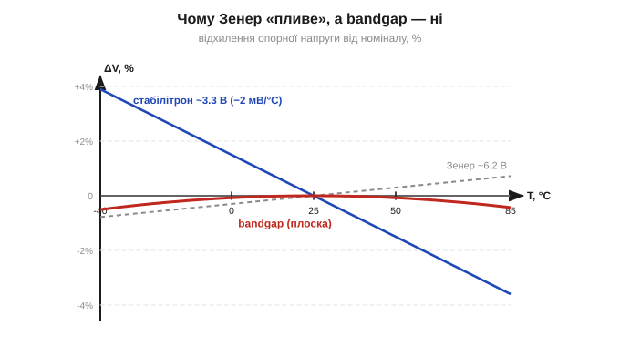
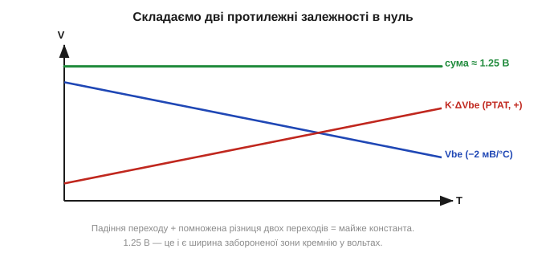

# Джерела опорної напруги: від стабілітрона до bandgap

У безлічі схем мовчки припускають, що десь усередині є **тверда, незмінна напруга**, з якою можна порівнювати все інше. [Компаратор](book:electronics/comparator-2) порівнює сигнал «з чимось»; аналого-цифровий перетворювач міряє напругу «відносно чогось»; [стабілізатор](book:electronics/ldo-internals) тримає вихід «рівним чомусь». Це «щось» — **джерело опорної напруги** (*voltage reference*, Vref), і воно заслуговує окремої уваги, бо від його якості залежить точність усього вимірювання. Опорна напруга — це **еталон** усередині схеми, і питання в тому, як зробити еталон, який не «пливе» від температури й часу.

Варто одразу усвідомити, наскільки це фундаментально. Будь-яке вимірювання напруги — це насправді **порівняння з еталоном**: прилад не «бачить вольти» абстрактно, він каже «вимірюване у стільки-то разів більше (чи менше) за опорне». Тому точність опорної напруги — це **стеля** точності всього приладу: якщо еталон збився на відсоток, усі покази збилися на відсоток, хоч би яким бездоганним був решта тракту. Це як міряти довжину гумовою лінійкою: байдуже, наскільки уважно ви прикладаєте її до предмета, якщо сама лінійка розтягується від тепла. Тому за хорошу опорну напругу варто поборотися — і інженери боролися за неї десятиліттями, від грубого стабілітрона до точного bandgap.

### Найпростіший еталон: стабілітрон

Найдавніший спосіб отримати опорну напругу — **[стабілітрон](book:electronics/zener-schottky)** (*Zener diode*). Ідея його проста: при зворотному зміщенні звичайний діод не пропускає струму, доки напруга не сягне напруги пробою; за нею діод різко «відмикається» у зворотному напрямі й тримає на собі майже сталу напругу в широкому діапазоні струмів. Подаємо на стабілітрон струм через резистор — і на ньому виникає стабільна напруга, скажімо 3.3, 5.1 чи 6.2 В. Просто, дешево, працює.

Уся схема — це резистор від живлення й стабілітрон на землю; точка між ними і є опорною напругою. Резистор тут грає роль «обмежувача»: він задає струм через стабілітрон, не даючи йому згоріти й водночас тримаючи його в робочій зоні пробою. Те, що напруга стабілітрона майже не залежить від струму, і робить його еталоном: гуляє живлення, трохи змінюється струм — а напруга на стабілітроні майже стоїть. Це найдешевший і найшвидший спосіб поставити в схему «тверду» напругу, і для багатьох грубих завдань — підтягнути поріг, обмежити рівень, дати орієнтир — його цілком досить. Проблеми починаються там, де від еталона хочуть **точності**.

Проблема в одному слові: **температура**. Напруга стабілітрона помітно залежить від температури кристала, причому характер залежності змінюється з напругою пробою. У низьковольтних стабілітронів (приблизно до 5 В) переважає один фізичний механізм пробою з **від'ємним** температурним коефіцієнтом — напруга з нагрівом **падає**. У високовольтних (понад ~6 В) переважає інший механізм із **додатним** коефіцієнтом — напруга з нагрівом **росте**. Тобто еталон «пливе», і то на одиниці мілівольтів на кожен градус. Для грубого порога це байдуже, а для точного вимірювання — катастрофа.


*Рис. Температурний дрейф трьох опорних напруг (відхилення від номіналу, %). Низьковольтний стабілітрон ~3.3 В має від'ємний нахил (напруга падає з нагрівом, близько −2 мВ/°C). Bandgap-джерело тримає майже плоску лінію в усьому діапазоні. Саме плоскість — а не абсолютне значення — відрізняє хороший еталон від грубого.*

Є й друга біда стабілітрона, тонша за дрейф, — **шум**. Сам механізм лавинного пробою (саме він панує в стабілітронах від ~6 В) — процес статистичний, «зернистий»: носії проскакують крізь перехід лавинами, і напруга злегка тремтить. Для грубого порога це непомітно, а для прецизійного еталона цей шум підмішується прямо в опорну напругу й обмежує найдрібніший розряд, який ще має сенс вимірювати. Виходить, що навіть «магічний» стабілітрон без температурного дрейфу все одно шумить більше, ніж хотілося б.

І все ж є гарний фокус: близько **6.2 В** два протилежні механізми пробою майже **компенсують** один одного за температурою, і стабілітрон у цій вузькій зоні має мінімальний дрейф (саме на цю особливість натрапив Кларенс Зенер і його наступники, [📜 §2.5.8 історія Зенера](book:electronics/zener-schottky/hist-zener.md)). На таких «опорних» стабілітронах будували прецизійні джерела в епоху, коли нічого кращого не існувало. Та в сучасній низьковольтній електроніці 6.2 В часто завелика напруга — від 3.3 В живлення її просто не «витягнути», — та й шум нікуди не дівся. Потрібен був інший принцип, який давав би низьку, стабільну й тиху опорну напругу. І його знайшли.

### Bandgap: еталон із самої фізики кремнію

Розв'язок виявився геніальним і отримав назву **bandgap-джерело** (*bandgap reference*, від «ширина забороненої зони»). Замість того щоб боротися з температурним дрейфом, його **скомпенсували**, склавши докупи дві протилежні залежності.

В основі лежать два факти. По-перше, пряме падіння на [PN-переході](book:electronics/diode-iv-curve) (база–емітер транзистора, Vbe) **зменшується** з температурою — приблизно на 2 мВ/°C ([📜 рівняння Шоклі](book:electronics/diode-iv-curve/math-shockley-equation.md)). Це залежність із **від'ємним** нахилом. По-друге — і це менш очевидно — **різниця** падінь двох переходів, що працюють за різної густини струму (ΔVbe), навпаки **зростає** з температурою пропорційно до абсолютної температури. Це залежність із **додатним** нахилом (її звуть PTAT — *proportional to absolute temperature*).

Звідки взагалі береться цей дивний набір залежностей — варто відчути інтуїтивно, бо без нього bandgap здається фокусом без пояснення. Падіння на переході при сталому струмі спадає з нагрівом тому, що з підвищенням температури в [напівпровіднику](book:physics/semiconductor) дедалі легше народжуються вільні носії заряду: перехід стає «провіднішим», і щоб пропустити той самий струм, йому досить меншої напруги. Звідси від'ємний нахил Vbe. А різниця падінь двох переходів, що працюють за **різної густини струму**, навпаки несе в собі чисту температуру: за рівнянням переходу ця різниця прямо пропорційна абсолютній температурі (тому її й звуть PTAT). Два механізми — народження носіїв і теплова «ширина» розподілу — тягнуть напругу в протилежні боки. Залишається їх зважити так, щоб вони компенсувались.

Ідея bandgap: узяти падіння одного переходу (спадає з T) і додати до нього **помножену** різницю двох переходів (росте з T), підібравши множник так, щоб два нахили точно **погасили** один одного. Сума виходить майже **плоскою** — не залежить від температури.


*Рис. Принцип bandgap. Падіння переходу Vbe спадає з температурою (синя лінія, −2 мВ/°C). Помножена різниця двох переходів K·ΔVbe росте з температурою (червона, PTAT). Підібравши множник K, дві залежності складають так, що сума (зелена) стає майже горизонтальною. Чудо в тому, що ця стала сума завжди виходить близькою до ширини забороненої зони кремнію — приблизно 1.25 В.*

Найдивовижніше: ця скомпенсована сума завжди виходить близькою до **1.25 В** — а це і є **ширина забороненої зони кремнію**, виражена у вольтах (звідси й назва). Тобто еталон народжується не з якогось зовнішнього зразка, а з **фундаментальної властивості самого кремнію** — і тому він стабільний і відтворюваний від кристала до кристала. Математику цієї компенсації — як саме −2 мВ/°C гаситься різницею ΔVbe — розібрано в окремій вставці ([🧮 bandgap у числах](book:electronics/voltage-reference/math-bandgap-math.md)). А історія винаходу — Боб Відлар, Пол Брокау й інші — у [📜 вставці про bandgap](book:electronics/voltage-reference/hist-bandgap.md): саме вони перетворили фізику переходу на практичний еталон.

### TL431: «програмований стабілітрон»

Найпопулярніша готова цеглинка опорної напруги — **TL431-клас**, який часто звуть «**програмованим стабілітроном**». Усередині це bandgap-джерело з підсилювачем, а зовні — трьохвивідний прилад, що поводиться як стабілітрон, чию напругу «пробою» можна **задати** двома зовнішніми резисторами в широкому діапазоні (від ~2.5 В і вище). Він стабільний, дешевий, випускається безліччю виробників — справжня легендарна цеглинка. Його застосовують настільки повсюдно (зокрема в петлі зворотного зв'язку майже кожного зарядного пристрою й блока живлення), що з ним варто познайомитися окремо ([🔌 TL431-клас](book:electronics/voltage-reference/comp-tl431.md)).

### Чим міряють якість опорної напруги

Якщо bandgap прибрав головну біду — температурний дрейф, — то за чим тоді обирати конкретне джерело? Даташит опорної напруги описує її кількома числами, і варто розуміти кожне, бо вони задають реальну точність:

- **Початкова точність** (*initial accuracy*) — наскільки напруга при кімнатній температурі може відрізнятися від номіналу одразу «з коробки», від екземпляра до екземпляра (скажімо, ±0.5 %). Це той самий [розкид партії](book:electronics/min-typ-max): «typ» ніхто не гарантує, гарантують межі.
- **Температурний коефіцієнт** (*tempco*, ppm/°C) — той самий дрейф, але вже малий; саме за ним bandgap б'є стабілітрон на порядок.
- **Дрейф із часом** (*long-term drift*, старіння) — повільна зміна напруги за місяці й роки, незворотна. Її вказують у ppm за тисячу годин; для побутового приладу неважливо, для еталонного — критично.
- **Шум** — те саме тремтіння опорної напруги, властиве й стабілітрону; у хорошого bandgap воно мале, але не нульове.
- **Стабільність під навантаженням і живленням** (*load/line regulation*) — наскільки напруга «просідає», коли від неї відбирають струм або коли «гуляє» вхідне живлення.

Ось чому опорних напруг існує цілий спектр: від копійчаного стабілітрона «на поріг» до прецизійних bandgap із дрейфом одиниці ppm/°C для вимірювальних приладів. Обираючи джерело, дивляться не на одне число, а на той його параметр, що для конкретного завдання вузький: десь головне — дешевизна, десь — мізерний дрейф, десь — низький шум.

> 🔧 **Навіщо це.** Опорна напруга — це фундамент точності будь-якого вимірювання. Коли мікроконтролер міряє напругу свого АЦП, він міряє її **відносно опорної**; якщо та «пливе» на 1 % від нагріву, усі покази «пливуть» на 1 %. Тому для точних вимірювань беруть bandgap-еталон (часто вже вбудований у чип), а не дешевий стабілітрон. А коли треба задати точний поріг чи стабілізувати вихід блока живлення — ставлять TL431. Знати різницю між «пливучим» стабілітроном і «плоским» bandgap — означає розуміти, звідки береться (чи не береться) точність вашого приладу.

**Приклад (на скільки «пливе» стабілітрон проти bandgap).** Порівняймо два еталони ~3.3 В у діапазоні від 0 до +50 °C (тобто ΔT = 50 °C відносно кімнатних 25). Низьковольтний стабілітрон має температурний коефіцієнт близько −2 мВ/°C; пристойне bandgap-джерело — близько 50 ppm/°C (мільйонних часток на градус):

```
Стабілітрон ~3.3 В:
  ΔV = коеф · ΔT = (−2 мВ/°C) · (50 − 25)°C = −2 · 25 = −50 мВ
  Відносний дрейф = 50 мВ / 3300 мВ ≈ 0.0152 = 1.52 %

Bandgap, 50 ppm/°C, Vref = 3.3 В:
  коеф = 50·10⁻⁶ · 3.3 В = 165·10⁻⁶ В/°C = 0.165 мВ/°C
  ΔV = 0.165 мВ/°C · 25 °C ≈ 4.1 мВ
  Відносний дрейф = 4.1 мВ / 3300 мВ ≈ 0.00125 = 0.125 %
```

Різниця більш ніж на порядок: 1.5 % проти 0.12 %. Якщо ваш АЦП має 10–12 розрядів, дрейф стабілітрона з'їсть кілька молодших розрядів точності, а bandgap — майже ні. Ось чому прецизійні вимірювання будують навколо bandgap-еталона.
