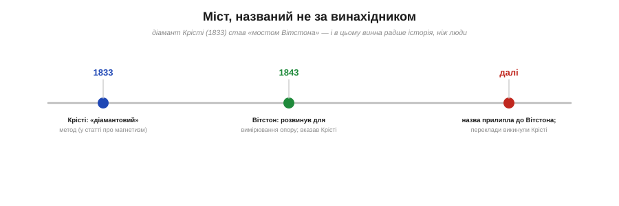
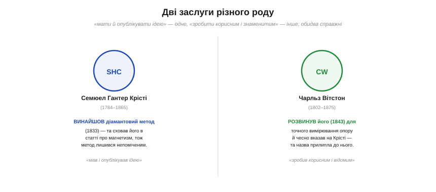

# 📜 Міст, названий не за винахідником: Крісті й Вітстон

> Схему, відому як [міст Вітстона](book:electronics/wheatstone-bridge), винайшов не Вітстон. Ця історія — не про крадіжку слави, а про дещо тонше й чесніше: про те, як ім'я на приладі прилипає не до того, хто **придумав**, а до того, хто зробив винахід **корисним і відомим**. Сам «міст Вітстона» — найкращий приклад цього правила.

*Рис. Шлях назви: 1833 — Крісті публікує «діамантовий» метод (захований у статті про магнетизм, тож непомічений); 1843 — Вітстон розвиває його для вимірювання опору й чесно вказує на Крісті; та назва однаково закріплюється за Вітстоном, а переклади його доповіді й зовсім викидають згадку про Крісті.*

## Діамант Крісті (1833)

Справжній винахідник схеми — **Семюел Гантер Крісті** (*Samuel Hunter Christie*, 1784–1865), британський фізик і математик. Він навчався в Триніті-коледжі в Кембриджі (здобув премію Сміта, був «другим заглушником» — second wrangler), став членом Королівського товариства й багато років викладав у Королівській військовій академії у Вулвічі. Найбільше його цікавив **магнетизм** — земне магнітне поле й удосконалення компаса.

І ось саме в розвідці про магнітні та електричні властивості металів, **1833 року**, Крісті описав схему-«діамант»: чотири опори ромбом, спосіб **порівнювати опори** дротів різної товщини. Це й був майбутній міст Вітстона — з усією його ідеєю балансу. Та сталася прикра річ: метод **загубився** у статті, присвяченій геть іншому — магнетизму. Ніхто не звернув на нього уваги, і блискуча ідея пролежала **непоміченою цілих десять років**. Винахід був, публікація була — а визнання не було, бо ідею сховали не на тій полиці.

## Вітстон розгледів діамант (1843)

Минуло десятиліття, і на схему натрапив **Чарльз Вітстон** (*Charles Wheatstone*, 1802–1875) — один із найвинахідливіших умів вікторіанської Британії. Його руці належать електричний телеграф (разом із Куком), стереоскоп, концертина, шифр Плейфера й багато іншого. У доповіді Королівському товариству **1843 року** про вимірювання «констант гальванічного кола» Вітстон узяв діамант Крісті, **розвинув** його у точний інструмент для вимірювання опору й показав усю його силу — нуль-метод, баланс, практику.

І тут — найважливіша, найчесніша деталь усієї історії: **Вітстон не привласнював чужого**. У своїй доповіді він **прямо вказав**, що схему придумав Крісті, й віддав йому належне. Вітстон був не злодієм ідеї, а її добросовісним популяризатором. Несправедливість сталася не з його злого наміру.

## Чому ж «міст Вітстона»?

Як же тоді ім'я закріпилося за Вітстоном? Спрацювали дві сили, що не мають нічого спільного з чесністю окремих людей. По-перше, **славу притягує відоме ім'я**: Вітстон був знаменитий, його доповідь читали, його варіант методу пішов у роботу — і прилад природно став зватися «його». По-друге, **переклади доповіді**, що вийшли наступного року в Німеччині й Франції, чомусь **викинули** Вітстонову згадку про Крісті — і за кордоном схему вже знали тільки як «міст Вітстона», без жодного сліду справжнього винахідника. Так непорозуміння закам'яніло в назві, якою послуговуються й досі.

*Рис. Дві заслуги різного роду. Крісті мав і опублікував ідею (1833), та сховав її в магнітній статті. Вітстон розвинув її у точний прилад (1843), зробив відомою — і чесно вказав на Крісті, проте назва пішла за популяризатором. Обидва внески справжні, лише різні.*

## Що з цього лишається

Ця історія — гарний урок про те, як читати назви. Ім'я на приладі (як і на законі, формулі чи теоремі) — це **зручна етикетка, а не протокол авторства**. За нею часто стоять різні люди й різні **роди** заслуг: хтось **придумав і опублікував** ідею (Крісті), а хтось **зробив її корисною й відомою** (Вітстон). Обидва внески справжні й важливі — але це різні внески, і плутати «винайшов» із «уславив» не варто.

Тому корисна звичка — не вірити назві на слово. Коли натрапляєте на «міст Вітстона», «закон Ома» чи «рівняння Максвелла», варто хоч раз запитати: а хто саме й що саме тут зробив? Часто відповідь виявляється цікавішою за етикетку — з кількома іменами, з непоміченими першими публікаціями, з чесними посиланнями, які загубилися в перекладі. Сам Вітстон, до речі, дав нам приклад **правильної** поведінки: він на Крісті послався. Несправедливою назву зробила не людина, а інерція історії — і саме тому, малюючи ромб із чотирьох опорів, незайве згадати, що в його основі лежить **діамант Крісті**.
