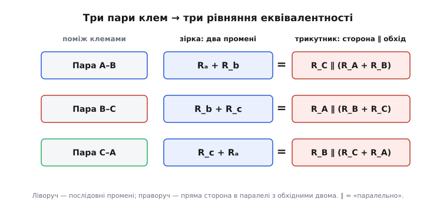
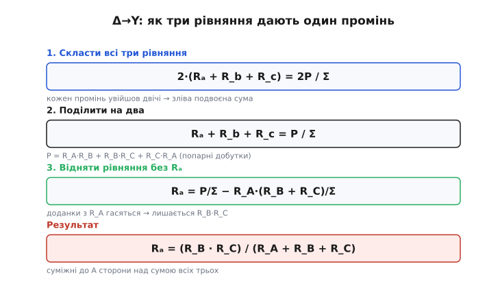

# 🧮 Виведення формул зірка–трикутник із трьох рівнянь

Формули зірка–трикутник часто подають як готовий рецепт: «промінь дорівнює добутку двох сторін над сумою трьох». Але звідки взявся саме цей вигляд? Чому в чисельнику множення, а не додавання? Чому знаменник у прямому переході — сума всіх трьох, а у зворотному — один-єдиний промінь? Усе це не підбір і не магія: обидва набори формул **однозначно випливають** з однієї-єдиної фізичної вимоги, і весь шлях від вимоги до формул — це кілька акуратних кроків шкільної алгебри. Пройдімо його повністю, щоб формула перестала бути таблицею для зубріння й стала висновком, який можна відтворити на серветці за дві хвилини.

## Одна вимога, з якої все випливає

Обидві схеми — зірка й трикутник — це **чорні скриньки** з трьома виводами A, B, C. Уся інформація, яку взагалі можна витягти з лінійної трипровідної скриньки ззовні, — це те, який опір вона показує між кожною парою клем. Таких пар рівно три: A–B, B–C, C–A. Якщо дві скриньки дають **однаковий опір на всіх трьох парах**, зовні їх не розрізнити жодним вимірюванням. Оце й є вся умова еквівалентності — три рівності, більше нічого.

> 🔧 **Навіщо це.** Розуміти, що еквівалентність — це рівно три рівняння (а не «схожість форми»), критично на практиці: воно каже, скільки незалежних чисел визначає перехід (три) і чому система завжди має єдиний розв'язок в обидва боки. Коли в реальному розрахунку щось не сходиться — переставлені букви, забутий множник, — саме ці три рівняння дають чесний спосіб перевірити себе з нуля, не покладаючись на завчену формулу.

Заведімо позначення так, щоб вони самі підказували геометрію.

**Промені зірки** — за клемою, до якої йде промінь: Rₐ веде до A, R_b — до B, R_c — до C. Усередині вони сходяться в спільну точку N.

**Сторони трикутника** — за клемою, **навпроти** якої лежить сторона (як у геометрії, де сторону трикутника називають за протилежною вершиною): R_A — сторона між B і C (напроти A), R_B — між A і C (напроти B), R_C — між A і B (напроти C).

Ця «протилежна» нумерація сторін здається зайвою мудрацією, але вона окупиться: завдяки їй фінальні формули вийдуть симетричними й такими, що легко читаються. Тримаймо її в голові — плутанина «суміжне ↔ протилежне» є найчастішим джерелом помилок у цій темі.

## Три рівняння еквівалентності

Тепер випишемо опір між кожною парою клем — окремо як його бачить зірка й як бачить трикутник.

**Зірка — це просто.** Щоб зміряти опір між A і B, ми подаємо струм в A і знімаємо з B; третя клема C висить у повітрі, тож промінь R_c нікуди не веде — через нього струм не тече (немає замкненого кола). Лишаються два промені послідовно: з A в N через Rₐ, з N в B через R_b. Отже опір між A і B у зірці — просто **Rₐ + R_b**. Аналогічно для інших пар.

**Трикутник — трохи хитріше.** Між A і B у трикутнику є **два шляхи**. Прямий — через сторону R_C (вона ж між A і B). Обхідний — з A через R_B до C, тоді з C через R_A до B, тобто дві сторони R_B + R_A послідовно. Ці два шляхи йдуть **паралельно** (обидва починаються в A, обидва кінчаються в B). Опір між A і B у трикутнику — це R_C паралельно з (R_A + R_B).

Позначмо для стислості **суму всіх трьох сторін** окремою буквою — вона з'являтиметься весь час:

```
Σ = R_A + R_B + R_C
```

Тоді паралель «сторона R_C проти суми двох інших» пишеться так (паралель двох опорів = добуток над сумою):

```
R_C ∥ (R_A + R_B) = R_C·(R_A + R_B) / (R_C + R_A + R_B) = R_C·(R_A + R_B) / Σ
```

Знаменник згорнувся у Σ — бо R_C + (R_A + R_B) — це і є всі три сторони разом. Прирівнюємо зірку до трикутника на кожній із трьох пар і дістаємо систему:

```
(1)   Rₐ + R_b = R_C·(R_A + R_B) / Σ          [пара A–B]
(2)   R_b + R_c = R_A·(R_B + R_C) / Σ          [пара B–C]
(3)   R_c + Rₐ = R_B·(R_C + R_A) / Σ          [пара C–A]
```

Придивімось, який тут порядок, — він не випадковий і його варто «побачити». У лівих частинах — **сума двох променів**, що ведуть до двох задіяних клем. У правих — **пряма сторона між тими клемами** (та, що напроти третьої, невибраної клеми) у паралелі з рештою. Пара A–B задіює промені Rₐ, R_b, а прямою стороною між A і B є R_C — тому в рядку (1) саме R_C стоїть множником попереду. Уся система симетрична до перестановки трьох клем; переконайтеся, що рядки (2) і (3) виходять із (1) простим циклічним зсувом A→B→C→A. Ця симетрія — не косметика: вона гарантує, що остаточні формули матимуть той самий стрункий вигляд для кожної клеми, і що досить вивести одну — решта дві дописуються за візерунком.


*Кожне з трьох рівнянь прирівнює один і той самий опір, поміряний між парою клем, у двох схемах. Ліва частина (зірка) — два промені послідовно. Права (трикутник) — пряма сторона між тими клемами паралельно з обхідним шляхом через дві інші сторони. Три пари A–B, B–C, C–A дають рівно три рівняння — стільки ж, скільки невідомих у кожному напрямку.*

Три рівняння, три невідомих. Уся решта — розв'язати цю систему в один бік (виразити промені через сторони, Δ→Y) і в інший (сторони через промені, Y→Δ). Жодної нової фізики далі не буде — сама алгебра.

## Розв'язання в бік Δ → Y: додати всі три, тоді відняти

Ми знаємо сторони R_A, R_B, R_C і хочемо промені Rₐ, R_b, R_c. У лівих частинах промені стоять **парами** (Rₐ+R_b, R_b+R_c, R_c+Rₐ), а нам потрібен кожен окремо. Класичний прийом для такої «циклічної» системи — **скласти всі три рівняння, а тоді від суми відняти те рівняння, якого нам бракує**. Подивимось, чому це спрацьовує.

Складемо ліві частини (1)+(2)+(3):

```
(Rₐ + R_b) + (R_b + R_c) + (R_c + Rₐ) = 2·(Rₐ + R_b + R_c)
```

Кожен промінь увійшов **рівно двічі** — бо кожна клема бере участь у двох парах (A є і в парі A–B, і в парі C–A). Тому зліва виходить подвоєна сума всіх трьох променів. Позначмо суму променів окремо: σ = Rₐ + R_b + R_c; тоді зліва маємо 2σ.

Тепер права сума. Складемо праві частини й винесемо спільний знаменник Σ:

```
R_C·(R_A + R_B) + R_A·(R_B + R_C) + R_B·(R_C + R_A)
─────────────────────────────────────────────────────
                        Σ
```

Розкриймо чисельник почленно:

```
R_C·R_A + R_C·R_B + R_A·R_B + R_A·R_C + R_B·R_C + R_B·R_A
```

Кожен із трьох попарних добутків з'явився **двічі** (R_A·R_B тут двічі, R_B·R_C двічі, R_C·R_A двічі). Групуємо:

```
= 2·(R_A·R_B + R_B·R_C + R_C·R_A)
```

Ця сума попарних добутків сторін ще стане в пригоді у зворотному переході; позначмо її одразу буквою **P**:

```
P = R_A·R_B + R_B·R_C + R_C·R_A
```

Отже все рівняння-сума набирає вигляду:

```
2σ = 2P / Σ         ⟹        σ = Rₐ + R_b + R_c = P / Σ
```

Ми дістали суму трьох променів через відомі сторони. А тепер — ключовий крок. Щоб витягти **один** промінь, віднімемо від цієї суми те рівняння, у якому цього променя **немає**.

Візьмімо Rₐ. Він відсутній у рівнянні (2): R_b + R_c = R_A·(R_B + R_C)/Σ. Віднімаємо (2) від суми σ:

```
Rₐ = σ − (R_b + R_c)
   = P/Σ − R_A·(R_B + R_C)/Σ
   = [ P − R_A·(R_B + R_C) ] / Σ
```

Розкриймо чисельник у квадратних дужках:

```
P − R_A·(R_B + R_C)
  = (R_A·R_B + R_B·R_C + R_C·R_A) − (R_A·R_B + R_A·R_C)
  =  R_B·R_C                                    ← R_A·R_B і R_A·R_C скоротилися
```

Уся «зайва» частина P, що містила R_A, точно погасилася доданком R_A·(R_B+R_C). Лишився один-єдиний добуток — **R_B·R_C**, тобто добуток двох сторін, які **не** входили у відняте рівняння, тобто двох сторін, **суміжних до клеми A**. Ось звідки береться множення в чисельнику: воно — залишок після скорочення, а не довільний вибір.

Підставляємо назад і дістаємо перший результат:

```
Rₐ = (R_B · R_C) / Σ = (R_B · R_C) / (R_A + R_B + R_C)
```

Два інші промені — **тим самим прийомом** (відняти те рівняння, де відповідного променя немає) або просто циклічним зсувом A→B→C:

```
Rₐ = (R_B · R_C) / (R_A + R_B + R_C)
R_b = (R_C · R_A) / (R_A + R_B + R_C)
R_c = (R_A · R_B) / (R_A + R_B + R_C)
```

Тепер зрозуміло **все** в цих формулах, не як мнемоніка, а як наслідок. Чисельник — добуток, бо це те, що вижило після скорочення двох однакових доданків. Дві **суміжні** сторони (а не протилежна), бо саме протилежну сторону ми «відняли» разом із її рівнянням. Знаменник — сума всіх трьох, бо він з'явився як спільний знаменник Σ ще на етапі паралельного з'єднання й не скоротився. Кожен елемент формули має адресу в цьому виведенні.


*Логіка виведення Δ→Y у трьох кроках. Складання всіх трьох рівнянь дає подвоєну суму променів; ділення на два — саму суму σ = P/Σ. Віднімання рівняння, у якому потрібного променя немає, скорочує всі доданки з «протилежною» стороною й лишає добуток двох суміжних сторін над сумою всіх трьох. Множення в чисельнику — не постулат, а те, що вціліло після скорочення.*

## Розв'язання в бік Y → Δ: поділити суму пар на протилежний промінь

Зворотний перехід можна виводити з тієї самої системи (1)–(3), розв'язуючи її тепер відносно сторін. Але є коротший і красивіший шлях — скористатися вже здобутими формулами Δ→Y і **перемножити** їх попарно. Це той рідкісний випадок, коли рух «туди» одразу дає й ключ до руху «назад».

Візьмімо будь-які два промені й перемножмо, скажімо Rₐ і R_b:

```
Rₐ · R_b = (R_B·R_C / Σ) · (R_C·R_A / Σ) = R_A·R_B·R_C² / Σ²
```

У чисельнику зійшлися всі три сторони (R_A, R_B і двічі R_C), знаменник — Σ². Обчислимо так само й дві інші пари, а тоді **складемо** всі три — за аналогією з тим, як у прямому переході нам допоміг перехід до суми:

```
Rₐ·R_b = (R_B·R_C)(R_C·R_A) / Σ² = R_A·R_B·R_C² / Σ²
R_b·R_c = (R_C·R_A)(R_A·R_B) / Σ² = R_A²·R_B·R_C / Σ²
R_c·Rₐ = (R_A·R_B)(R_B·R_C) / Σ² = R_A·R_B²·R_C / Σ²
```

Тепер складімо їх. У кожному доданку є спільний множник R_A·R_B·R_C / Σ²; винесемо його:

```
Rₐ·R_b + R_b·R_c + R_c·Rₐ = (R_A·R_B·R_C / Σ²)·(R_C + R_A + R_B)
                          = (R_A·R_B·R_C / Σ²)·Σ
                          =  R_A·R_B·R_C / Σ
```

Ліва частина — це та сама **сума попарних добутків**, тільки тепер для променів; в основній статті її позначено S. Отже ми отримали дуже компактне співвідношення:

```
S = Rₐ·R_b + R_b·R_c + R_c·Rₐ = R_A·R_B·R_C / Σ
```

Придивімося, що це за число. Праворуч — добуток **усіх трьох** сторін, поділений на їхню суму. Ось чому S виявиться спільним чисельником: у ньому вже «сидять» усі три сторони симетрично, і щоб витягти одну сторону, лишиться поділити на щось, що прибере дві інші.

Тепер сам фокус. Ми хочемо, скажімо, сторону R_A. Візьмімо S і поділімо на протилежний до неї промінь — Rₐ. Але Rₐ ми вже знаємо через сторони (з прямого переходу): Rₐ = R_B·R_C / Σ. Підставмо:

```
S / Rₐ = (R_A·R_B·R_C / Σ) / (R_B·R_C / Σ)
       = (R_A·R_B·R_C / Σ) · (Σ / (R_B·R_C))
       =  R_A · (R_B·R_C) / (R_B·R_C)         ← Σ скоротилося, R_B·R_C скоротилося
       =  R_A
```

Обидва «зайві» множники — і сума Σ, і добуток суміжних сторін R_B·R_C — скоротилися точно, лишивши голу R_A. Тобто:

```
R_A = S / Rₐ
```

І чому саме **протилежний** промінь Rₐ, а не якийсь інший? Бо Rₐ у знаменнику несе множник R_B·R_C — рівно ті дві сторони, які треба прибрати з S, щоб лишилась R_A. Протилежність тут не мнемоніка, а арифметична необхідність: тільки протилежний промінь містить у собі саме той добуток, що скорочується.

Три сторони — за тим самим візерунком:

```
R_A = S / Rₐ     (Rₐ — промінь, протилежний стороні R_A)
R_B = S / R_b
R_C = S / R_c
```

де S = Rₐ·R_b + R_b·R_c + R_c·Rₐ. Тепер обидва набори формул виведені й пояснені до останнього множника. Прямий перехід ділить на **суму** (Σ) — тому завжди визначений для додатних опорів. Зворотний ділить на **окремий** промінь — тому вироджується (сторона прямує в нескінченність), якщо якийсь промінь прямує до нуля; але це не збій, а чесне відображення фізики (нульовий промінь — це коротке замикання клеми з точкою N, і трикутник-еквівалент справді має розрив навпроти такого вузла).

## Симетричний випадок як швидка перевірка

Найдешевша перевірка будь-якої з цих формул — підставити **однакові** опори й подивитися, чи вийде відоме потрійне співвідношення. Хай трикутник рівносторонній: R_A = R_B = R_C = R_Δ. Тоді сума Σ = 3·R_Δ, і будь-який промінь:

```
R_Y = (R_Δ · R_Δ) / (R_Δ + R_Δ + R_Δ)
    = R_Δ² / (3·R_Δ)
    = R_Δ / 3
```

Симетрична зірка втричі «легша» за симетричний трикутник: **R_Y = R_Δ / 3**, або навпаки **R_Δ = 3·R_Y**. Це співвідношення варто закарбувати як контрольну точку: воно ловить майже будь-яку помилку в переставлених буквах за один рядок. Якщо ваш вивід у симетричному випадку не дає рівно трійки — десь суміжне переплуталося з протилежним, або добуток із сумою.

Перевірмо ще й зворотну формулу на тому самому, щоб переконатися в узгодженості. Хай зірка симетрична: Rₐ = R_b = R_c = R_Y. Тоді сума попарних добутків:

```
S = R_Y·R_Y + R_Y·R_Y + R_Y·R_Y = 3·R_Y²
```

і будь-яка сторона:

```
R_A = S / Rₐ = 3·R_Y² / R_Y = 3·R_Y
```

Знову R_Δ = 3·R_Y — те саме число, прочитане з іншого кінця. Дві формули узгоджені: пройшовши Y→Δ→Y, ми повернемось у ту саму точку. Цю **оборотність** корисно перевірити й у загальному (несиметричному) випадку хоча б раз — підставте формули Δ→Y у формули Y→Δ і переконайтеся, що дістанете назад початкові сторони. Розрахунок трохи довший, але скорочення там такі самі чисті, як щойно бачені: усі проміжні Σ і добутки гасяться, лишаючи тотожність. Саме ця оборотність і робить перетворення повноцінною **заміною змінних**, а не наближенням.

> 🔧 **Навіщо це.** Симетричний тест R_Δ = 3·R_Y — не навчальна забавка, а робочий інструмент контролю. Коли ви руками зводите розбалансований [міст Вітстона](book:electronics/wheatstone-bridge) чи трифазне навантаження і не певні, чи правильно підставили букви, підставте на мить у ту саму формулу три рівні опори: якщо трійка не виходить — формула застосована криво, шукайте переставлений множник, ще не втопивши години в подальших обчисленнях.

## Узагальнення на комплексний імпеданс

Тепер — найважливіше зауваження про межу застосовності, і воно розширює цю тему далеко за резистори. Придивіться: **у всьому виведенні ми жодного разу не скористалися тим, що опори — це саме резистори**. Ми користувалися рівно трьома властивостями. Що послідовне з'єднання додає опори (Rₐ+R_b). Що паралельне дає «добуток над сумою». І що ці правила — лінійні, тобто опір не залежить від того, який струм тече. Усе. Ні дійсності чисел, ні відсутності реактивності ми ніде не припускали.

А ці три властивості справедливі не лише для опору R, а для **комплексного імпедансу** Z будь-якого лінійного двополюсника — резистора, конденсатора, котушки чи довільної їх комбінації. Послідовні імпеданси додаються (Z₁+Z₂), паралельні дають Z₁·Z₂/(Z₁+Z₂), і все це — лінійні операції над комплексними числами. Отже **весь вивід переноситься дослівно**: заміняємо кожне R на відповідне Z — і ті самі формули стають правильними для мереж змінного струму:

```
Zₐ = (Z_B · Z_C) / (Z_A + Z_B + Z_C)          (Δ → Y)
Z_A = S / Zₐ,   S = Zₐ·Z_b + Z_b·Z_c + Z_c·Zₐ  (Y → Δ)
```

Різниця лише в тому, що тепер множення, додавання й ділення — **над комплексними числами** (де кожен імпеданс має і величину, і фазу). Це не окрема теорія й не нова формула — це та сама алгебра над ширшим полем чисел. Ось чому перетворення зірка–трикутник однаково законне у трьох різних світах: у резистивних мережах постійного струму, у фільтрах і колах змінного струму (де Z комплексний і залежить від частоти), і у трифазних системах, де зірка й трикутник узагалі є двома стандартними способами з'єднати навантаження. Одне виведення — три застосування.

Тут ховається тонкість, якої нема в чисто резистивному випадку: у комплексних формулах може виникнути **ділення на нуль**, якого не буває для додатних опорів. Сума трьох додатних резисторів ніколи не нуль. А от сума трьох імпедансів (Z_A + Z_B + Z_C) цілком може обернутися на нуль на певній частоті — якщо, скажімо, індуктивний і ємнісний доданки взаємно погашаються (резонанс). На такій частоті прямий перехід Δ→Y стає невизначеним: знаменник зник. Фізично це момент, коли сама трикутна мережа поводиться особливо (наприклад, показує нескінченний чи нульовий вхідний імпеданс на резонансі), і «розчинити» її в еквівалентну зірку в цій точці неможливо. Практично це рідкість, але коли аналізуєте вибіркові LC-кола поблизу резонансу, тримайте цей нуль у знаменнику в полі зору.

> 🔧 **Навіщо це.** Саме комплексне узагальнення робить заміну Y⇄Δ придатною для реальних фільтрів і трифазних розрахунків, а не лише для задачок із резисторами. Проєктуючи, приміром, мостовий LC-фільтр чи рахуючи навантаження трифазної лінії, ви застосовуєте **буквально ті самі** формули над Z — і вся інтуїція, здобута на резисторах (суміжне множимо, на суму ділимо, симетричний випадок дає трійку), переноситься без єдиної поправки. Одне вивчене правило працює скрізь, де кола лінійні.

## Що варто винести

Уся конструкція тримається на одному стрижні: **три пари клем → три рівняння еквівалентності → розв'язати систему**. Формули не треба запам'ятовувати як таблицю — їх можна **відновити** за пів хвилини з самої вимоги «однаковий опір на кожній парі», якщо пам'ятати два прийоми: у бік Δ→Y скласти всі три рівняння й відняти те, де немає потрібного променя (суміжні добутки самі виживуть); у бік Y→Δ перемножити пари променів, скласти в S = добуток трьох сторін над їхньою сумою, і поділити на протилежний промінь. Симетричний випадок R_Δ = 3·R_Y — постійна перевірка на очі. А оскільки у виведенні ніде не використано «резисторність», уся ця машинерія однаково точно працює над комплексним імпедансом — для змінного струму, фільтрів і трифазних кіл. Розуміння, звідки береться кожен множник, коштує дорожче за завчену формулу: воно не забувається й не плутається під тиском реального розрахунку.
