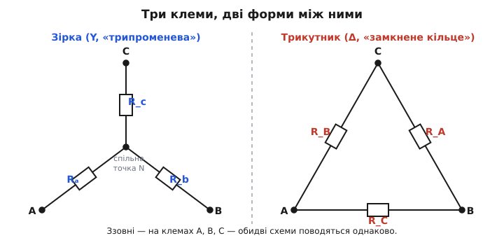
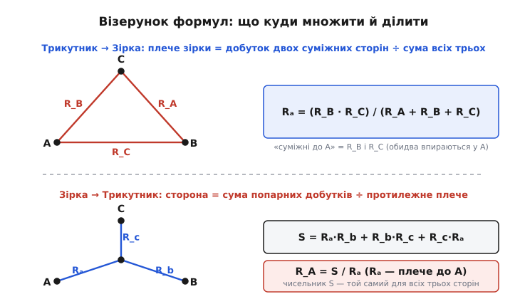
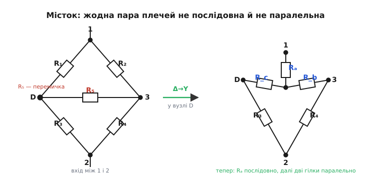

# Перетворення зірка–трикутник

Три резистори можна з'єднати між трьома точками двома різними способами. Перший — звести їх в одну спільну точку, так що з кожної клеми виходить окремий промінь: виходить **зірка** (Y). Другий — замкнути три резистори в кільце, по одному між кожною парою клем: виходить **трикутник** (Δ, грец. *delta* — четверта літера алфавіту, за формою). Зовні, з боку трьох клем, ці дві схеми можна зробити **абсолютно нерозрізненними**: скільки не міряй опір між будь-якою парою виводів, скільки не пропускай струм — зірка й трикутник відповідатимуть однаково. Перетворення зірка–трикутник — це рецепт, як за опорами однієї форми обчислити опори іншої, щоб заміна нічого не змінила ззовні.

Навіщо взагалі така заміна? Бо є схеми, які **не розкладаються** на звичне послідовне й паралельне з'єднання — і жоден шкільний прийом «згорнути дві гілки в одну» до них не береться. Класичний приклад — місток: п'ять резисторів, розставлених так, що жодна пара не стоїть ні строго послідовно, ні строго паралельно. Аналіз глухне. А варто замінити один трикутник усередині цього містка на еквівалентну зірку — і схема раптом розсипається на прості послідовно-паралельні шматки, які згортаються за пів хвилини. Перетворення — це відмичка до кіл, замкнених «на глухо».


*Зліва зірка (Y): три резистори сходяться у спільну внутрішню точку N. Справа трикутник (Δ): три резистори замкнені в кільце по сторонах. Клеми A, B, C — ті самі. Мета перетворення — підібрати опори однієї форми так, щоб ззовні, на клемах A, B, C, вона була невідрізненна від іншої.*

Форму-зірку ще звуть **Y** (за буквою) або **T** (якщо намалювати промені інакше — виходить трійник), а форму-трикутник — **Δ** або **π** (те саме кільце, розтягнуте в іншу поставу). Це та сама пара з'єднань під різними іменами; ми триматимемось назв Y та Δ як найпоширеніших.

### Що означає «еквівалентні ззовні»

Умова еквівалентності жорстка й проста: обидві схеми — це **чорні скриньки** з трьома виводами, і ми вимагаємо, щоб їх було неможливо розрізнити **жодним зовнішнім вимірюванням**. Уся інформація про трипровідну лінійну скриньку вичерпується трьома числами — опорами між кожною парою клем. Тож достатньо, щоб збіглися три опори: між A і B, між B і C, між C і A. Якщо всі три пари дають однаковий опір, скриньки взаємозамінні — будь-яке коло зовні поводитиметься так, ніби всередині стоїть інша форма.

Тут криється важлива тонкість. У зірки є **чотири** вузли: три клеми плюс внутрішня точка N, де сходяться промені. У трикутника вузлів **три** — самі клеми, ніякої внутрішньої точки. Перетворюючи Y на Δ, ми цю точку N **прибираємо**; перетворюючи Δ на Y — **створюємо** нову. Саме тому заміна така корисна: вона змінює саму топологію кола (кількість і зв'язність вузлів), лишаючи зовнішню поведінку недоторканою. Вона підмінює начинку, зберігаючи фасад.

> 🔧 **Навіщо це.** Реальний привід — схеми, де застрягає лобовий аналіз. Резистивний місток, мережа опору заземлення з трьох стрижнів, трифазне навантаження, драбинка-атенюатор із перемичками — усюди трапляється трикутник чи зірка, вбудований у більшу схему так, що послідовно-паралельне згортання не бере. Одна заміна Y⇄Δ у потрібному місці розчищає затор і дає далі рахувати руками, без матриць і симулятора.

### Формули: Δ → Y

Виведемо потрібні три числа з тієї самої умови — «однаковий опір між кожною парою клем». Нехай сторони трикутника позначені за клемою, **навпроти** якої лежить сторона: R_A — сторона між B і C (навпроти A), R_B — між A і C, R_C — між A і B. Промені зірки позначимо за клемою, до якої вони йдуть: Rₐ — промінь до A, R_b — до B, R_c — до C.

Опір між A і B у зірці — це просто два промені послідовно: Rₐ + R_b. У трикутнику той самий опір — сторона R_C **паралельно** до двох інших сторін, з'єднаних послідовно (R_A + R_B): бо струм із A в B іде або навпростець через R_C, або в обхід через R_B і R_A. Прирівнявши ці вирази для всіх трьох пар і розв'язавши систему (акуратна, але прямолінійна алгебра — [покрокове виведення](book:electronics/y-delta-transform/math-derivation.md) розписує кожен крок), дістаємо напрочуд стрункий результат:

```
Rₐ = (R_B · R_C) / (R_A + R_B + R_C)
R_b = (R_C · R_A) / (R_A + R_B + R_C)
R_c = (R_A · R_B) / (R_A + R_B + R_C)
```

За цими трьома рядками стоїть один візерунок, і його варто запам'ятати не як формулу, а як **правило**:

> **Промінь зірки до клеми = добуток двох сторін трикутника, що торкаються цієї клеми, поділений на суму всіх трьох сторін.**

Придивімось, чому саме ці дві сторони. Промінь Rₐ веде до клеми A. У трикутнику до клеми A прилягають дві сторони — R_B (між A і C) і R_C (між A і B); третя, R_A, до A не торкається, вона навпроти. Тому в чисельнику Rₐ стоять **суміжні до A** сторони R_B і R_C, а не R_A. Знаменник — сума всіх трьох сторін — той самий для всіх трьох променів. Ця сума в знаменнику каже: що «важчий» увесь трикутник загалом, то тоншими виходять промені зірки.


*Угорі — Δ→Y: промінь зірки до клеми дорівнює добутку двох суміжних до неї сторін, поділеному на суму всіх трьох сторін. Унизу — Y→Δ: сторона трикутника дорівнює сумі трьох попарних добутків променів, поділеній на протилежний промінь. У кожному переході чисельник «збирає» два елементи, а знаменник нормує їх на третій — або суму всіх трьох.*

**Приклад: рівносторонній трикутник.** Хай усі три сторони однакові, R_A = R_B = R_C = 90 Ω. Тоді кожен промінь зірки:

```
Rₐ = (90 · 90) / (90 + 90 + 90)
   = 8100 / 270
   = 30 Ω
```

Усі три промені по 30 Ω. Виходить чиста, легка для пам'яті пропорція: **симетрична зірка втричі «легша» за симетричний трикутник** — R_Y = R_Δ / 3. Перевірмо здоровим глуздом на опорі між A і B. У трикутнику: 90 Ω паралельно з (90 + 90) = 180 Ω, тобто (90·180)/(90+180) = 60 Ω. У зірці: Rₐ + R_b = 30 + 30 = 60 Ω. Збіглося — заміна коректна.

### Формули: Y → Δ

Зворотний перехід виводиться з тієї самої системи, лише розв'язаної в інший бік. Тут зручно спочатку скласти одне допоміжне число — **суму трьох попарних добутків** променів:

```
S = Rₐ·R_b + R_b·R_c + R_c·Rₐ
```

Через нього кожна сторона трикутника пишеться однаково коротко:

```
R_A = S / Rₐ     (Rₐ — промінь, протилежний стороні R_A)
R_B = S / R_b
R_C = S / R_c
```

Правило-візерунок дзеркальне до прямого:

> **Сторона трикутника = сума трьох попарних добутків променів, поділена на промінь, протилежний цій стороні.**

Чисельник S — той самий для всіх трьох сторін; змінюється лише дільник. І дільник тут — **протилежний** промінь: сторона R_A лежить навпроти клеми A, тому ділимо на промінь Rₐ, що веде до A. Логіка та сама, що й у прямому переході, лише «суміжне» й «протилежне» помінялися ролями, бо ми йдемо з зірки в трикутник.

**Приклад: несиметрична зірка.** Хай Rₐ = 10 Ω, R_b = 20 Ω, R_c = 30 Ω. Спершу спільний чисельник:

```
S = 10·20 + 20·30 + 30·10
  = 200 + 600 + 300
  = 1100
```

Тепер сторони:

```
R_A = 1100 / 10 = 110 Ω
R_B = 1100 / 20 = 55 Ω
R_C = 1100 / 30 ≈ 36.7 Ω
```

Зверніть увагу на закономірність: до **найменшого** променя (Rₐ = 10 Ω) прив'язана **найбільша** сторона (R_A = 110 Ω), бо ділимо на найменше. Це не випадковість, а прямий наслідок формул — тонкий промінь означає товсту протилежну сторону. Корисна перевірка на очі: у симетричному випадку (усі промені рівні R) виходить R_Δ = 3R_Y — те саме потрійне співвідношення, що й раніше, лише прочитане навпаки.

### Класичний привід: місток, який не розкладається

Тепер повернімось до того, заради чого все й затівалося. Резистивний **місток** — п'ять резисторів у формі діаманта: чотири по краях (R₁…R₄) і п'ятий, R₅, перемичкою поперек, між двома середніми вузлами. Ця перемичка все й псує. Спробуйте знайти в такій схемі бодай одну пару резисторів, строго послідовних чи строго паралельних, — не знайдете. R₁ і R₃ не послідовні, бо між ними, у їхньому спільному вузлі, «врізається» перемичка R₅ і відводить частину струму вбік. R₁ і R₂ не паралельні, бо їхні праві кінці сидять у різних вузлах. Схема замкнена так, що звичне згортання за неї не чіпляється.

Причина глибша за геометрію. Послідовне з'єднання можливе лише там, де у спільному вузлі двох резисторів **більше нікуди** не тече струм; паралельне — де двоє резисторів мають **обидва** кінці у спільних вузлах. Перемичка R₅ порушує першу умову (додає струму бічний шлях) і не дає виконатися другій. Місток — це, по суті, два трикутники, склеєні спільною стороною-перемичкою, і саме через цю склейку він і не розкладається.

Ось де перетворення рятує. Візьмімо будь-який із двох трикутників у містку — скажімо, той, що включає перемичку R₅ і два сусідні плечі, — і замінімо його **зіркою**. Трикутник мав три вузли; зірка вносить один новий, внутрішній, і **розриває кільце**. Після заміни перемички як окремої гілки більше немає — вона розчинилась у трьох променях зірки. І раптом уся схема стає звичайним послідовно-паралельним деревом: один промінь іде послідовно, далі струм розходиться на дві гілки, що йдуть паралельно й знову сходяться. Те, що не бралося зовсім, тепер згортається кількома множеннями й додаваннями.


*Зліва — місток: перемичка R₅ поперек діаманта не дає жодній парі плечей стати послідовною чи паралельною. Замінивши трикутник у вузлі D (сторони R₁, R₅ і плече до вузла 3) на зірку з новою внутрішньою точкою, дістаємо схему справа: перемичка зникла, промінь Rₐ увімкнено послідовно, а далі два ланцюги йдуть паралельно. Тепер загальний опір рахується згортанням у голові.*

> 🔧 **Навіщо це.** Так рахують реальний вхідний опір резистивного [моста Вітстона](book:electronics/wheatstone-bridge), коли він **розбалансований** і потрібно знати, який струм візьме джерело чи яку напругу побачить детектор. У балансі все просто — детектор мовчить; а от поза балансом, коли міст працює давачем, трикутник-із-перемичкою заважає лобовому розрахунку, і заміна Y⇄Δ — найкоротший шлях до відповіді без складання й розв'язування системи рівнянь.

Заміну можна робити в обидва боки — що зручніше для конкретної схеми. Іноді простіше **трикутник згорнути в зірку** (як у містку — прибрати перемичку); іноді, навпаки, **зірку розгорнути в трикутник**, щоб три промені, які нікуди не згортаються, стали трьома сторонами, кожна з яких уже опиняється паралельно чомусь у схемі. Обидва напрямки — та сама пара формул, прочитана вперед або назад.

### Межі й підводні камені

Перше застереження — про напрямок вигоди. Перетворення **не спрощує само по собі**: воно міняє форму, а не кількість елементів (три резистори лишаються трьома). Користь є лише тоді, коли **нова форма краще лягає** у сусідній контекст — коли після заміни щось стає послідовним чи паралельним. Замінити ізольований трикутник на зірку просто так — марна праця: три опори як були, так і лишились, а внутрішній вузол додав мороки. Заміну роблять **прицільно**, там, де вона розчиняє глухий кут.

Друге — про внутрішній вузол. Точка N усередині зірки — **математична**, а не фізична: у справжньому колі до неї нема доступу, це фікція розрахунку. Тому обчисливши напруги через зірку-еквівалент, пам'ятайте: напруга в точці N до **вихідної** схеми стосунку не має. Еквівалент вірний лише **ззовні**, на трьох клемах; усе, що всередині, — робочі риштування, які після розрахунку прибирають. Струми в променях зірки — теж не ті самі струми, що текли в сторонах трикутника; збігаються лише **зовнішні** струми, що входять і виходять через A, B, C.

Третє — про самі формули. Прямий перехід Δ→Y ділить на **суму** сторін, і вона нулем не буває (для додатних опорів) — тут завжди все гладко. А от зворотний Y→Δ ділить на **окремий** промінь: якщо якийсь промінь зірки прямує до нуля, відповідна протилежна сторона трикутника прямує до нескінченності (стає розривом). Це не збій формули, а чесна фізика: промінь з нульовим опором — це коротке замикання клеми з точкою N, і трикутник-еквівалент такого коротко замкненого вузла справді має нескінченну сторону навпроти. Просто тримайте це в голові, коли підставляєте маленькі числа.

Четверте — про змінний струм. Уся викладка спиралася лише на те, що елементи **лінійні**, а не на те, що вони саме резистори. Тому перетворення дослівно переноситься на кола змінного струму: замініть кожен опір R на [комплексний імпеданс](book:math/impedance) Z — і ті самі формули (з добутками, сумами й діленням, тепер над комплексними числами) працюють для мереж із конденсаторів і котушок так само, як для резисторів. Це робить заміну Y⇄Δ повноцінним інструментом і в аналізі фільтрів, і в трифазних колах, де зірка й трикутник — узагалі два стандартні способи з'єднати навантаження.

П'яте, коротке: не переплутайте, що з чим у чисельнику. Найчастіша помилка — у Δ→Y узяти **протилежну** сторону замість двох суміжних. Тримайтеся правила «промінь до клеми — добуток двох сторін, що торкаються цієї клеми», і звіряйтеся з фігурою; одна перевірка на симетричному випадку (де має вийти рівно втричі) миттєво ловить переставлені букви.

Історія цих формул коротка й ясна: їх вивів і опублікував [1899 року Артур Кеннеллі](book:electronics/y-delta-transform/hist-kennelly.md), американський інженер ірландського роду, той самий, що кількома роками раніше ввів у вжиток слово «імпеданс». Відтоді перетворення живе під його ім'ям — теорема Кеннеллі — і залишається одним із небагатьох ручних прийомів, що й досі рятують там, де не хочеться діставати матриці чи симулятор.
