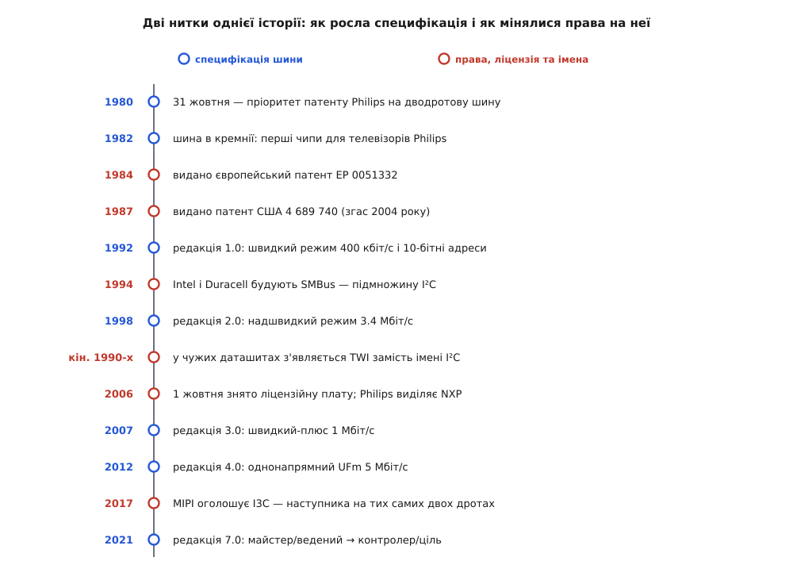

# 📜 Патент на два дроти: як I²C народилася в Ейндговені й чому вона зветься TWI

Ця історія пояснює дві дивні речі: чому шина, придумана заради того, щоб здешевити телевізор, тепер сидить у кожному дешевому давачі, і чому в даташитах цілої низки виробників той самий протокол зветься TWI, а слів «I²C» там немає взагалі. Обидві відповіді ростуть з одного документа — заявки на патент, поданої в нідерландському Ейндговені 31 жовтня 1980 року.

## Телевізор, у якому подорожчала кожна ніжка

Наприкінці 1970-х телевізор перестав бути суто аналоговим приладом. Усередині корпусу оселилася жменя спеціалізованих цифрових мікросхем: одна порядкувала тюнером і пам'яттю каналів, друга обробляла звук, третя відповідала за яскравість і контраст, четверта малювала на екрані меню, згодом додалася ще й телетекстова. Кожній із них центральний мікроконтролер мусив час від часу продиктувати кілька чисел — частоту, гучність, номер рядка.

Спосіб продиктувати був один: тягти до мікросхеми лінії керування. Кілька ліній даних, лінія-строб, лінія вибору — і так до кожної. На макеті це виглядає безневинно. На виробі, який виходить мільйонами штук на рік, кожна така лінія коштує двічі: вона з'їдає ніжку на пластиковому корпусі мікросхеми і забирає місце під доріжку на платі. Ніжка коштує частки цента; помножені на мільйони, ці частки перетворюються на статтю бюджету, за яку відповідає конкретна людина.

Тут важлива обставина, без якої I²C ніде більше й не могла народитися. Philips була **водночас** і виробником телевізорів, і виробником мікросхем для них. Компанії, що робить лише кремній, немає сенсу вигадувати шину: її ніхто не підтримає з другого боку. Складальникові готових апаратів немає з чого її зробити: він не керує кристалами. Спільна шина стає вигідною тільки тому, хто тримає обидва кінці дроту — і може наказати своїм-таки чипам говорити нею. Так само, як фірма, заснована 1891 року в Ейндговені братами Жераром і Антоном Філіпсами як фабрика ламп розжарення, за дев'яносто років доросла до становища, коли їй було чим і кому наказувати.

## Двоє інженерів і документ 1980 року

Заявку підписали двоє: **Адріанус Муландс** (Adrianus P. M. M. Moelands) і **Герман Схютте** (Herman Schutte). Це не переказ і не легенда — їхні імена стоять у графі винахідників європейського патенту й патенту США, і будь-хто може подивитися на скан.

```
Назва:        «Two-wire bus-system comprising a clock wire and a data wire
               for interconnecting a number of stations»
Винахідники:  Adrianus P. M. M. Moelands, Herman Schutte
Заявник:      N.V. Philips' Gloeilampenfabrieken (Нідерланди)
Пріоритет:    31 жовтня 1980
EP 0051332:   подано 22.10.1981 · опубліковано 12.05.1982 · видано 11.04.1984
US 4 689 740: подано 02.11.1981 · видано 25.08.1987 · згас 25.08.2004
```

Довідкова література додає до цього подробиці, яких у патенті нема: що обидва працювали інженерами-розробниками в центральній прикладній лабораторії Philips в Ейндговені і що внутрішня робоча назва шини спершу була **COMIC**, а вже потім її замінили на I²C. Ці дві деталі виглядають правдоподібно й повторюються з джерела в джерело, але первинного документа під ними я не бачив — тримайте їх на щабель нижче за патентні дані.

Заразом варто розчепити три різні відповіді на питання «коли з'явилася I²C», бо їх часто плутають в одну. **1980-й** — рік ідеї, зафіксованої заявкою. **1982-й** — рік, коли шина поїхала в кремнії: з'явилися перші мікросхеми Philips, що нею розмовляли, зокрема мікроконтролери сімейства MAB8400 із вбудованим контролером шини. А от **1992-й** — рік першої нумерованої публічної специфікації, редакції 1.0. Тобто десять років шина жила взагалі без окремого документа зі своїм номером: її опис лежав у довідниках Philips поруч із даними на конкретні мікросхеми. Ідея, реалізація, стандарт — три різні події з десятирічним розкидом, і кожна з дат по-своєму правдива.

## Що саме патент оголосив своїм

Два дроти з підтяжками самі по собі не винахід. Те, що кілька виходів на спільній лінії дають логічне «І», знали задовго до 1980-го — це [монтажне «І»](topic:electronics/wired-or), де операцію виконує не вентиль, а фізика проводу: лінія висока, лише коли всі її відпустили, і падає в нуль від будь-кого одного. Запатентувати таке було б неможливо.

Патент бере вище — він описує **дисципліну**, накинуту на ці два дроти. Біти дійсні у визначених часових вікнах, прив'язаних до тактового проводу. Початок і кінець повідомлення позначено такими комбінаціями сигналів, які всередині даних фізично не трапляються. І найгостріше місце формули винаходу: коли передавати водночас беруться кілька ведучих станцій, їхні такти самі пересинхронізуються за реальними фронтами спільної лінії, тож суперечка вирішується без зіткнення й без окремого судді.

Оце й робить патент небезпечним для конкурента. Дріт можна обійти — намалювати іншу схему. Дисципліну обійти не можна: якщо ваша мікросхема має розуміти чужі старт, стоп і адресу, вона мусить робити рівно те, що написано у формулі винаходу. Сумісність і порушення тут — те саме слово, сказане двома різними мовами.

## Від фірмової шини до чужого кремнію

Шина виявилася настільки зручною, що з телевізорів Philips вилізла назовні. Через десять років по появі, коли вийшла редакція 1.0, документ уже описував не внутрішній звичай однієї фірми, а те, що робили десятки виробників. Ця редакція додала швидкий режим на 400 кбіт/с і десятибітну адресацію; наприкінці 1990-х шину рахували вже в тисячах типів мікросхем від приблизно півсотні ліцензованих виробників — цифра з довідкових джерел, порядок величини правдоподібний, точність перевірити нічим.

Тут корисно поглянути вбік. [Шину SPI](topic:communications/spi-bus) — чотири лінії з активними виходами й окремим вибором кристала на кожного веденого — Motorola зробила приблизно тоді ж і не обклала ані єдиною специфікацією, ані ліцензією. Наслідок видно й сьогодні: SPI розсипалася на діалекти, де від чипа до чипа різняться полярність такту, момент вибірки, порядок бітів і таймінги вибору. I²C такого не сталося: був один документ, і в кожного, хто хотів робити сумісні чипи, був цілком матеріальний привід у той документ зазирнути. Ліцензійна дисципліна, хоч би як вона дратувала, купила галузі рідкісну річ — сумісність без діалектів.



*Технічна нитка й правова йшли поруч, але в різному ритмі: швидкості додавали редакціями раз на кілька років, а питання «кому належить назва» вирішувалося поза документом.*

## Ліцензія, яка коштувала імені

Умова, на якій Philips (а після 2006-го NXP) віддавала свій винахід у світ, десятиліттями стояла дрібним шрифтом у даташитах і звучить приблизно так: купівля наших I²C-компонентів надає ліцензію на використання цих компонентів у системі I²C, якщо система відповідає специфікації.

Прочитайте це навпаки — і побачите, що саме компанія лишила собі. Купуєш її мікросхеми — маєш право **вживати** їх у своєму приладі. Хочеш зробити **власну** мікросхему, яка розмовляє тією самою шиною, — це вже інша розмова, з окремою угодою й окремими грошима. Понад те, адреси на шині роздавала централізовано сама Philips, і теж не задарма.

Порахуймо, як це виглядало з боку конкурента. Патент рано чи пізно згасне — а от **назва й логотип** це торгові марки, які не згасають ніколи. Отже вибір такий: підписати ліцензію з прямим суперником по ринку — або реалізувати той самий до останнього фронту протокол і просто ніде не написати чотирьох знаків «I²C».

Другий шлях і обрали. У Atmel він зветься **TWI** (Two-Wire Interface — «двопровідний інтерфейс»), у частини інших виробників **TWSI** (Two-Wire Serial Interface), ще десь просто «2-wire». Ось чому, розгорнувши даташит класичного AVR — того, на якому виросли перші Arduino, — ви знайдете розділ TWI з регістрами TWCR, TWSR, TWDR, TWBR і жодного разу не побачите звичного імені шини.

Про доказовий статус цієї причини варто сказати чесно. Офіційної заяви Atmel «ми перейменували, щоб не платити за назву» не існує. Пояснення через ліцензію й торгову марку подають довідкові джерела, і воно бездоганно лягає на все, що можна перевірити: ліцензійний режим справді існував, ім'я справді обходили, а обходили його саме ті, хто робив кремній. Але це висновок з обставин, а не задокументоване корпоративне рішення — так його й тримайте. Що задокументоване напевно: у самих даташитах TWI описано як сумісний із протоколом Philips I²C, а фірмові прикладні нотатки мають назви на кшталт «Using the TWI Module as I2C Slave». Ім'я оминали в описі кремнію, а не в підручнику для користувача.

Знак рівності між TWI та I²C теж не абсолютний. За словами Microchip (нинішнього власника Atmel), TWI не підтримує стартового байта; типові TWI-блоки обходяться без надшвидкого режиму, а подекуди і без десятибітної адресації чи загального виклику. Тобто «TWI — це I²C» правдиве для щоденної роботи й неправдиве в дрібному шрифті.

Окремо стоїть **SMBus**: це не обхід назви, а свідомо звужений діалект. Intel і Duracell визначили його 1994 року для розумних акумуляторів і догляду за нутрощами персонального комп'ютера, додавши те, чого в I²C нема: мінімальну частоту такту й таймаути, щоб застряглий пристрій не завісив шину назавжди, вужчі пороги рівнів і контроль помилок пакета. [Що саме SMBus доклала згори](topic:communications/smbus) — окрема, доволі практична тема, бо чип, розрахований на SMBus, на звичайній I²C-шині може повестися несподівано.

## Перше жовтня 2006-го: ім'я подешевшало, звичка лишилася

Американський патент згас 25 серпня 2004 року. А 1 жовтня 2006-го NXP оголосила, що реалізація протоколу I²C більше не потребує жодної ліцензійної плати; платною лишилася хіба що процедура виділення адреси. Того ж року Philips виокремила свій напівпровідниковий підрозділ в окрему компанію NXP, яка й донині веде специфікацію.

Юридична причина писати «TWI» зникла. Назва — ні. Бо на той час вона вже сиділа в іменах регістрів, у заголовкових файлах, у назвах драйверів, у тисячах сторінок документації і в звичках цілого покоління інженерів. Перейменувати коштує дорожче, ніж лишити як є, — і це найповчальніша частина всієї історії: рішення про назву переживає свою причину на десятиліття, тож той, хто читає старий кремній, мусить знати причину, щоб розшифрувати назву.

Свіжий приклад того самого ефекту вже почався. Редакція 7.0, що вийшла 2021 року, замінила пару «майстер / ведений» на «контролер / ціль». Документи змінилися одразу; імена регістрів, бібліотечні функції й усна мова змінюватимуться ще довго.

## Спадкоємці на тих самих двох дротах

Ті самі дві лінії розійшлися світом ще й під іншими іменами. **ACCESS.bus** — спроба Philips і DEC початку 1990-х чіпляти на I²C клавіатури, мишки й монітори; у січні 1995-го її оголосили безплатною для реалізації, та вона однаково програла USB. **DDC** — це той-таки I²C у кабелі монітора, яким дисплей віддає комп'ютерові свій опис EDID. **PMBus** виріс зі SMBus для керованих модулів живлення, **IPMB** живе всередині серверів. Електрично це щоразу I²C; відрізняються тільки назва, набір команд і документ, у якому все це записано.

А справжній наступник з'явився 2017-го: **I3C** від альянсу MIPI. Ті самі два дроти, і починається обмін так само в режимі відкритого стоку — щоб старі I²C-чипи могли й далі висіти на тій самій парі. Але швидку частину обміну шина веде вже двотактними виходами, до 12.5 МГц, обходячи головну ваду попередниці — пологий фронт, який тягне сама лише підтяжка. Заразом [I3C](topic:communications/i3c) дала давачам внутрішньосмугове переривання: сказати «у мене є дані» тепер можна по тих самих двох дротах, а не окремим проводом.

І один урок галузь із попередньої історії таки винесла — його видно просто в оголошенні. Безплатний статус базової редакції I3C проголосили одразу, наперед, ще до того, як комусь довелося зважувати, чи варта реалізація свого імені.
