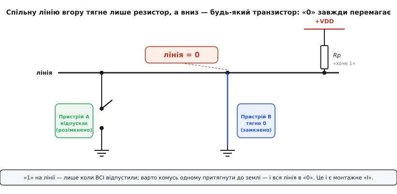
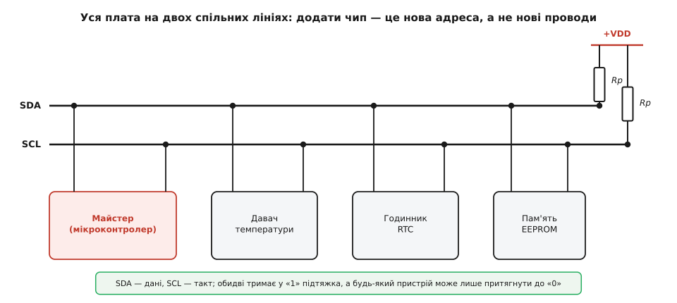
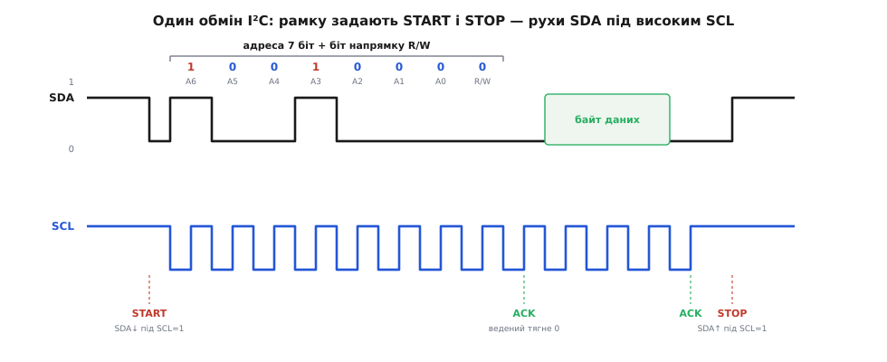
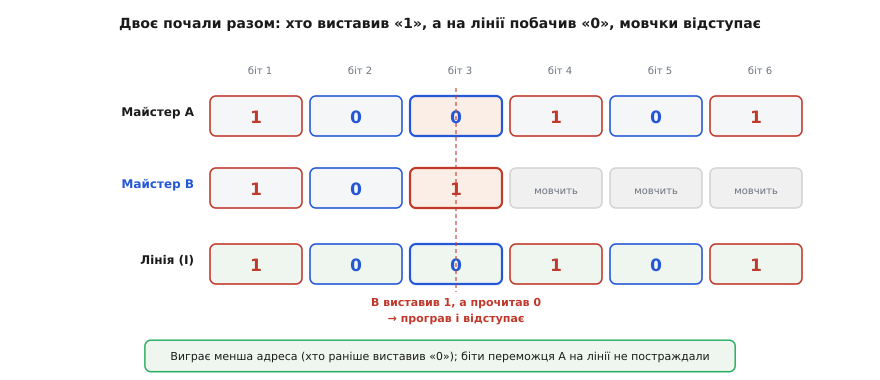
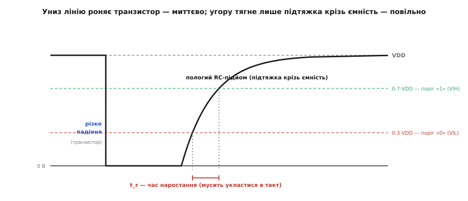

# Шина I²C

<preknowlist>
- [Рівні «0» і «1»](book:electronics/logic-levels-as-ranges) — логічний нуль і одиниця це не точки, а діапазони напруг із порогами між ними.
- [Open-drain](book:electronics/open-drain) — вихід, який уміє лише притягувати лінію до землі або відпускати її, але сам ніколи не подає плюс.
- [Підтяжки](book:electronics/floating-pullups) — резистор між лінією і живленням, що задає рівень, коли ніхто лінію активно не тримає.
- [Закон Ома](book:electronics/ohms-law) — напруга = струм · опір; звідси струм крізь підтяжку й падіння на відкритому транзисторі.
- [Стала RC](book:electronics/rc-time-constant) — заряд ємності крізь опір іде експонентою, і це задає, як швидко наростає фронт на лінії.
</preknowlist>

Уявіть невелику плату: мікроконтролер, а поруч давач температури, годинник реального часу, крихітний OLED-дисплей і мікросхема пам'яті. Кожен із цих чипів має обмінюватися байтами з контролером. Найпростіший спосіб з'єднати їх — паралельна шина, як усередині старих комп'ютерів: вісім ліній даних, ще стільки ж адресних, кілька керувальних. Але тоді плата тоне в доріжках, а на корпусі мікроконтролера бракує ніжок. Дати кожному чипу власну окрему пару проводів теж не рятує: кількість з'єднань росте з кожним новим пристроєм.

Питання, з якого народжується I²C (англ. **I**nter-**I**ntegrated **C**ircuit — «між інтегральними схемами», вимовляють «ай-квадрат-сі» або «ай-ту-сі»), звучить так: яка **найменша** проводка дозволяє довільній кількості мікросхем на одній платі спілкуватися з контролером, причому до кожної можна звернутися окремо? Відповідь виявилася майже зухвалою — **два проводи на всіх**. Один несе дані, другий — такт. Кожен чип під'єднано до тієї самої пари. Додати ще один пристрій — це нуль нових проводів, лише нова адреса. Уся ця стаття — про те, як з однієї-єдиної електричної хитрості виростає ціла дисципліна: адресація, підтвердження, поділ спільного проводу між багатьма співрозмовниками й навіть чесне вирішення суперечок, коли двоє заговорять разом.

## Спільний провід і заборона тягнути вгору

Тільки-но ми кажемо «два проводи на всіх», одразу впираємось у головну небезпеку спільної лінії. Хай на одному проводі висять виходи двох мікросхем. Перша хоче виставити «1» і під'єднує лінію до плюса живлення. Друга тієї ж миті хоче «0» і під'єднує ту саму лінію до землі. Виходить пряме коло від живлення до землі крізь два транзистори — коротке замикання. Тече великий струм, ніжки гріються, а напруга на лінії застигає десь посередині, і жоден рівень не читається. Класичний двотактний вихід (той, що вміє і притягувати до землі, і штовхати до плюса) на спільному проводі жити не може: щойно двоє не згодні, вони «б'ються» за лінію.

Звідси випливає рішення, на якому тримається все інше. Треба **заборонити пристроям штовхати лінію вгору**. Нехай кожен вихід уміє лише одне з двох: або притягнути лінію до землі, або відпустити її (перейти у високоомний стан, ніби від'єднатися). Ніхто й ніколи не подає на лінію плюс. А щоб відпущена лінія не висіла в невизначеності, її м'яко тягне до живлення один-єдиний резистор — [підтяжка](book:electronics/floating-pullups). Такий вихід — «стік із розімкненим колом», [open-drain](book:electronics/open-drain): усередині сидить транзистор, який замикає лінію на землю, коли треба «0», і розмикається, коли треба «1», а рівень «1» доробляє резистор.

Тепер зіткнення неможливе за побудовою. Найгірше, що станеться, якщо двоє «не згодні»: один притягує лінію до землі, другий її просто відпустив — струм тихо тече крізь підтяжку в землю, лінія у стані «0», ніякого замикання. Ця асиметрія має точну логічну назву.

> 🔧 **Навіщо це.** Open-drain — не лише спосіб уникнути замикання. Він дозволяє з'єднувати чипи з різних плат і навіть з різною логікою живлення без страху спалити вихід, бо рівень «1» задає спільна підтяжка, а не чиясь конкретна ніжка. Саме тому I²C-пристрій можна під'єднати чи від'єднати «на гарячу», і сусіди на шині цього не помітять.

## Монтажне «І» — зерно, з якого росте все

Подивімось, що визначає рівень спільної лінії. Він стане «1» лише тоді, коли **всі** учасники відпустили лінію — тоді підтяжка спокійно витягує її до живлення. Але щойно **хоча б один** притягнув її до землі, уся лінія падає в «0»: слабенький резистор програє будь-якому активному транзистору. Отже значення на проводі — це логічне **І** всіх виходів: одиниця лише за одностайності, нуль — від голосу будь-кого одного. Таке «І», задане самим з'єднанням, називають [монтажним](book:electronics/wired-or) (англ. *wired-AND* — «І, зроблене дротом»): логічну операцію виконує не вентиль, а сама фізика спільного проводу з підтяжкою.

Це і є те зерно, з якого проросте вся шина. Правило в найпростішому вигляді: **будь-хто може примусово поставити «0», а «1» вимагає згоди всіх**. Жоден із дальших механізмів шини не додасть до нього нічого принципово нового: підтвердження прийому, вибір потрібного чипа адресою, прохання зачекати, вирішення суперечки двох майстрів — усе це виявиться тим самим монтажним «І» під іншим кутом, а не окремими винаходами.



*Спільну лінію тягне вгору лише резистор, а вниз — будь-який із транзисторів; тому «0» перемагає «1», і рівень лінії це логічне «І» всіх учасників.*

## Дві лінії: дані й такт

Проводів у I²C два. Один — **SDA** (англ. *Serial Data* — послідовні дані), несе біти. Другий — **SCL** (англ. *Serial Clock* — послідовний такт), несе тактові імпульси, які кажуть, коли саме читати біт. Обидва — open-drain, обидва мають підтяжку до живлення. Пристрій, що керує обміном, зветься **майстром** (у нових редакціях специфікації — контролером); він задає такт на SCL. Пристрій, до якого звертаються, — **ведений** (тепер — цільовий).



*Уся плата ділить одні два проводи: майстер задає такт, ведені відгукуються по адресі, а два резистори тримають лінії в «1», коли ніхто їх не притягує.*

Те, що такт іде окремим проводом, робить шину **синхронною**: приймач не має здогадуватися про швидкість передавача — його ведуть за руку кожним фронтом SCL. Це велика різниця з асинхронним [кадром UART](book:communications/uart-frame), де сторони наперед домовляються про швидкість і потім кожна відлічує біти власним годинником. Тут годинник спільний, тож шина спокійно працює хоч на 100 кілогерцах, хоч сповільнюється до кількох герців, якщо майстер забажає, — дані від цього не зіпсуються.

Ключова домовленість про час: **біт на SDA дійсний, поки SCL високий**; приймач зчитує SDA саме тоді. А **змінювати SDA дозволено лише тоді, коли SCL низький**. Це правило само по собі корисне (усі бачать той самий біт в один і той самий момент), але має ще й тонкий побічний ефект. Якщо за домовленістю SDA не сміє рухатися під час високого SCL, то будь-який його рух під час високого SCL — це щось **не дане**, вільний сигнал, який можна віддати під службові позначки. Саме так I²C і робить рамки повідомлення, не витрачаючи жодного зайвого проводу чи спецсимволу.

## START і STOP — заборонений рух як розділовий знак

Повідомленню потрібні «початок» і «кінець» — щоб усі знали, коли шина зайнята, а коли вільна. I²C бере їх із того самого забороненого руху SDA під високим SCL.

- **START** — SDA падає з «1» у «0», поки SCL тримається високим. Оскільки в даних такого бути не може, усі пристрої розпізнають це однозначно: «увага, починається обмін, шина зайнята».
- **STOP** — SDA піднімається з «0» у «1» під високим SCL. Це сигнал «обмін завершено, шина вільна».

Гляньте, як ощадно: не треба ні стартового біта, ні паузи певної довжини, ні унікального байта-роздільника, який довелося б виключати з даних. Один рух в один бік — початок, той самий рух у другий бік — кінець. Уся рамка тримається на тому, що ці два переходи фізично неможливі всередині корисних даних.

## Байт і дев'ятий такт підтвердження

Після START майстер жене біти: **старшим уперед**, по вісім на байт. Але цікаве діється на дев'ятому такті. Восьмого біта передавач відпускає SDA, а дев'ятий такт віддає приймачеві — щоб той **підтвердив прийом**. Приймач притягує SDA до землі — це **ACK** (англ. *acknowledge* — «підтверджую», байт дійшов). Якщо ж приймач лишив SDA у «1» (нічого не притягнув), виходить **NACK** (*not acknowledge* — «не підтверджую»).

Помітьте: ACK — це знову монтажне «І». Приймач нічого не «надсилає» в звичному сенсі, він просто на один такт притягує спільну лінію до землі, і передавач бачить «0» замість відпущеної «1». Те саме зерно, новий ужиток. Через ACK майстер щоразу дізнається, чи хтось узагалі його слухає і чи готовий продовжувати.

## Адреса: усі слухають, відповідає один

Лишилося головне — як на спільному проводі докричатися саме до потрібного чипа, коли фізично всі під'єднані однаково. Відповідь: **перший байт після START — це адреса**. Точніше, це вісім біт: сім задають адресу, а восьмий — напрямок обміну.

Щойно пролунав START, кожен ведений на шині ловить перші сім біт і порівнює зі своєю власною, зашитою в ньому адресою. Той єдиний, чия адреса збіглася, на такті ACK притягує SDA до землі — «це я, слухаю». Решта мовчать, тобто відпускають лінію. Так одним проводом майстер дотягується точно до одного співрозмовника: **чути всі, відповідає лише названий**. Восьмий біт першого байта — **R/W** (читання чи запис): «0» означає, що майстер писатиме у веденого, «1» — що читатиме з нього.

Сім біт адреси дають 2⁷ = 128 можливих значень, але 16 із них зарезервовано під службові потреби (загальний виклик, префікс десятибітних адрес, код швидкісного режиму тощо), тож на звичайні пристрої лишається **112 адрес**. Зазвичай цього досить, а коли ні — існує розширення на десять біт адреси, що вкладається у ту саму рамку за допомогою зарезервованого префікса. Повний перелік зарезервованих адрес, службових кодів і бітову структуру кадру зручно тримати під рукою окремо — [коротка довідка з протоколу](book:electronics/i2c/api-i2c.md) дає таблиці адрес, режимів і часових параметрів без переказу цієї статті.

> 🔧 **Навіщо це.** Адреса зашита у чип виробником, іноді з двома-трьома ніжками для вибору кількох молодших біт. Тому на одну шину можна повісити, скажімо, вісім однакових давачів, задавши кожному свою адресу перемичками, — і всі вони житимуть на тих самих двох проводах. А ще тому конфлікт адрес двох різних мікросхем — типова причина, чому «давач не відповідає»: обидва тягнуть ACK, і майстер отримує кашу.

## Уся транзакція: від START до STOP

Складімо ці частини в одне повідомлення. Обмін виглядає так:

```
START → [адреса 7 біт | R/W] → ACK → [байт даних] → ACK → … → STOP
```

Коли майстер **пише** (R/W = 0), він шле байти один за одним, а ведений після кожного притягує ACK — «прийняв, давай далі». Коли майстер **читає** (R/W = 1), ролі на дев'ятому такті міняються: тепер байти жене ведений, а підтверджує вже майстер. І тут є тонкість. Після кожного прийнятого байта майстер відповідає ACK — «шли ще», а от **останній** байт він навмисне не підтверджує (**NACK**): це сигнал веденому «досить, я наситився», після чого майстер виставляє STOP. Без цього NACK ведений не знав би, коли спинитися.



*Рамку задають два «заборонені» рухи SDA під високим SCL — START на початку і STOP у кінці; між ними адреса обирає співрозмовника, а дев'ятий такт кожного байта віддано під підтвердження.*

### Повторний START і читання регістрів

Реальні мікросхеми — це не одна комірка, а набір внутрішніх **регістрів**: у давача окремо байт температури, окремо налаштування, окремо статус. Щоб прочитати регістр номер N, майстрові треба спершу **сказати**, який регістр цікавить, а тоді **прочитати** його вміст. Виходить дві дії поспіль: спочатку запис (адреса веденого, потім номер регістра), одразу за ним читання.

Наївно було б завершити запис через STOP і почати читання новим START. Але STOP звільняє шину — а якщо на ній є ще один майстер, він може встромитися саме в цю щілину й забрати лінію собі, і тоді ведений уже забуде, який регістр ми обрали. Тому I²C має **повторний START** (англ. *repeated start*): майстер видає новий START, **не подавши перед ним STOP**, тобто не відпустивши шину. Виходить безрозривна послідовність «запиши номер регістра → одразу читай його», яку ніхто не встромиться перервати. Це найпоширеніший спосіб доступу до регістрів у I²C-чипах.

## Прохання зачекати: розтягування такту

Іноді ведений фізично не встигає. Давач ще міряє, контролер відволікся на переривання, пам'ять дописує сторінку — а майстер уже хоче гнати наступний такт. У багатьох протоколах це була б біда, але тут рятує все те саме монтажне «І», лише тепер на лінії SCL.

Ведений, якому треба час, після такту ACK **притягує SCL до землі й тримає**. Майстер, дійшовши до наступного такту, намагається відпустити SCL у «1» — але бачить, що лінія вперто лишається в «0» (адже монтажне «І»: поки ведений тримає низ, підтяжка безсила). Отже майстер **чекає**: він не жене такт далі, доки SCL справді не підніметься. Щойно ведений готовий — він відпускає SCL, підтяжка витягує лінію вгору, і такт біжить далі. Це зветься **розтягуванням такту** (англ. *clock stretching*), і воно дає веденому керувати темпом без жодного окремого проводу «зачекай». [Глибше про розтягування й узгодження такту](book:communications/clock-stretch-arbitration) — коли на шині кілька майстрів і їхні такти доводиться зводити докупи.

> 🔧 **Навіщо це.** Звідси випливає золоте правило надійного майстра: **не можна просто смикати SCL за таймером — треба щоразу зчитувати реальний рівень лінії** й переконуватися, що вона таки піднялася, перш ніж рухатись далі. Майстер, який жене такт «наосліп», зламається на першому ж веденому, що надумає розтягнути такт, — і це одна з класичних пасток bit-bang-реалізацій.

## Коли заговорили двоє: арбітраж

I²C дозволяє мати на шині **кілька майстрів**. Два контролери можуть незалежно вирішити почати обмін — і зробити START майже одночасно. Що тоді? Тут знову вражає, як усе випливає з монтажного «І», без окремого «поліцейського».

Спершу такт. Кожен майстер жене власний SCL, але оскільки це монтажне «І», спільна лінія SCL низька, поки **хоч один** тримає її низькою, і висока, лише коли **всі** відпустили. Тому низька півхвиля триває стільки, скільки хоче найповільніший, а висока — стільки, скільки дозволяє найшвидший. Майстри самі собою вишиковуються в один спільний такт — це синхронізація без домовленостей.

Тепер дані. Кожен майстер, ведучи передачу, **водночас зчитує SDA назад** і порівнює з тим, що сам виставив. Поки прочитане збігається з наміром — майстер ще в грі. А от щойно майстер відпускає SDA (виставляє «1»), але зчитує «0» — це означає, що **хтось інший цієї ж миті притягнув лінію до землі**. За правилом «0 перемагає 1» той інший сильніший, отже наш майстер **програв** і має негайно й тихо зійти з дистанції: припинити передачу й відпустити шину. Виграє той, хто раніше виставив «0», тобто передавав **меншу адресу чи менші дані**.

Найкрасивіше — що при цьому **нічого не псується**. Майстер-переможець навіть не помітив боротьби: усі його біти лишилися такими, як він хотів, його повідомлення йде далі неушкодженим. Майстер, що програв, просто спробує ще раз згодом. Ніяких зіпсутих кадрів, ніяких повторних узгоджень — арбітраж (лат. *arbiter* — «суддя, посередник») тут **непорушний для переможця**, і це прямий наслідок того самого зерна, з якого ми почали.



*Майстер, який виставив «1», але прочитав із лінії «0», програв арбітраж і мовчки відступає; переможець навіть не помітив боротьби, бо всі його біти лишилися своїми.*

## Ціна ощадності: повільний фронт і межа швидкості

За елегантність open-drain доводиться платити, і тут криється причина, чому I²C — шина коротка й неквапна. Придивімось до того, як міняється рівень на лінії.

Притягнути лінію до **землі** легко й швидко: транзистор замикається, і напруга падає майже миттєво — це активна, потужна дія. А от підняти лінію до **«1»** нікому активно не дано — це робить лише резистор-підтяжка, і робить повільно. Бо будь-який реальний провід разом із входами всіх мікросхем має **ємність** Cb, і підтяжка мусить цю ємність зарядити крізь свій опір R. Заряд ємності крізь опір — це [експонента RC](book:electronics/rc-time-constant): напруга не стрибає, а плавно виповзає вгору кривою. Фронт «1» завжди пологий, тоді як фронт «0» — різкий.

А тепер вимога: за час, поки триває високий такт, лінія має **встигнути перетнути поріг**. Вхід читає «1» лише коли напруга перевищила VIH ≈ 0.7·VDD, а до того, нижче VIL ≈ 0.3·VDD, це ще певний «0» — [логічні рівні це діапазони](book:electronics/logic-levels-as-ranges), а не точки. Якщо ємність велика (довгі проводи, багато пристроїв) або опір великий, крива повзе так мляво, що не встигає дорости до порога вчасно — біт змазується. Тому специфікація обмежує ємність шини величиною **Cb ≤ 400 пФ** і задає максимальний час наростання фронту. Саме тому I²C живе всередині плати чи в межах кількох сантиметрів, а не тягнеться на метри.



*Транзистор роняє лінію вниз миттєво, а вгору її повільно витягує підтяжка крізь ємність шини; цей пологий фронт і є межею, що обмежує довжину й швидкість I²C.*

Історично швидкість шини зростала поколіннями. Первісна редакція 1982 року від Philips давала **стандартний режим 100 кбіт/с**; редакція 1992-го додала **швидкий режим 400 кбіт/с**, а 1998-го з'явився **надшвидкий режим 3.4 Мбіт/с** зі спеціальними прийомами розгону фронтів. У 2007-му між ними влаштувався **швидкий-плюс 1 Мбіт/с**. Кожен наступний режим лише сильніше тисне на час наростання фронту, тобто вимагає меншої ємності й точнішого добору підтяжки. [Як I²C народилася в лабораторії Philips](book:electronics/i2c/hist-i2c.md) і чому в деяких мікросхем той самий протокол зветься TWI — окрема, доволі повчальна історія.

### Скільки має бути опір підтяжки

Опір підтяжки затиснутий з двох боків, і це видно з фізики без жодної магії. Знизу: коли транзистор притягує лінію до землі, крізь підтяжку тече струм I = (VDD − VOL)/R, і специфікація дозволяє протікати крізь відкритий транзистор струму не більш як ≈3 мА, а лишкова напруга VOL на ньому має лишатися нижчою за ≈0.4 В — інакше «0» не читатиметься як «0». Це задає **мінімальний** опір. Згори: фронт «1» мусить укластися в дозволений час наростання, а він тим повільніший, чим більший R (та ємність), — це задає **максимальний** опір. Порахуймо вікно для конкретного випадку.

**Живлення 3.3 В, швидкий режим (400 кГц), ємність шини 150 пФ.**

```
Знизу (щоб транзистор дотягнув «0»):
  R_min = (VDD − VOL) / I_max = (3.3 − 0.4) / 0.003 A ≈ 967 Ом

Згори (щоб фронт устиг за дозволений час t_r = 300 нс):
  фронт від 0.3·VDD до 0.7·VDD триває t_r = 0.8473 · R · Cb
  R_max = t_r / (0.8473 · Cb) = 300e-9 / (0.8473 · 150e-12) ≈ 2360 Ом

Вікно: 0.97 кОм … 2.36 кОм  →  беремо 2.2 кОм.
```

Число 0.8473 не з неба: воно точно дорівнює ln(0.7/0.3) і виходить із рівняння RC-заряду для перетину саме цих двох порогів — [повне виведення часового бюджету й формул фронту](book:electronics/i2c/math-i2c-timing.md) розписано окремо, разом із параметрами встановлення та тримання. Класичне «4.7 кОм за замовчуванням» пасує стандартному режиму з невеликою ємністю, але для швидкого чи для довшої шини опір доводиться зменшувати, і краще щоразу [дібрати підтяжку під конкретну шину](book:electronics/i2c-pull-up-resistor), а не тулити те саме число всюди.

> 🔧 **Навіщо це.** Занадто великий опір — і фронти розпливаються, шина брудно працює на високій швидкості або взагалі не запускається; занадто малий — і слабенькі виходи веденого не можуть дотягнути «0» під поріг, а струм марно гріє. Ще підступніше: якщо на одну шину зійшлися кілька плат чи модулів, кожна зі своєю підтяжкою, їхні опори стають паралельними, сумарний опір падає — і те, що поодинці працювало, разом уже перевантажує виходи.

### Пологий фронт і шум

Оскільки фронти пологі, входи I²C-приймачів роблять із гістерезисом — на [тригері Шмітта](book:electronics/schmitt-trigger). Різниця між порогом «вгору» і порогом «вниз» дає те, що повільна, тремтлива від наведень крива перетне вхід **один раз чисто**, а не насмикає ланцюжок хибних перемикань, поки повзе крізь зону невизначеності. Без гістерезису пологий I²C-фронт у шумному оточенні перетворювався б на серію фантомних тактів.

## З'єднати різні напруги й обійтися без апаратного блока

Дві дрібниці, які добре видно саме через устрій шини. Перша: часто на одній шині зустрічаються чипи з різним живленням — 3.3-вольтовий мікроконтролер і 5-вольтовий давач. Open-drain уже півсправи розв'язує: ніхто не штовхає лінію вгору, тож немає небезпеки, що 5 В прилетить у 3.3-вольтовий вхід від чужого виходу. Але рівень «1» задає підтяжка, і треба, щоб обидві сторони його однаково розуміли; для надійного стику двох рівнів ставлять двонапрямний [перетворювач рівнів](book:electronics/level-shifter) на одному транзисторі — саме тому, що лінія двонапрямна й open-drain, така проста схемка й працює.

Друга: майстром I²C не конче має бути апаратний блок. Оскільки вся дисципліна зводиться до притягування й відпускання двох ліній із зчитуванням їхнього рівня, будь-які два виводи [GPIO](book:electronics/gpio) в режимі open-drain можна перетворити на програмного майстра — «смикати» протокол вручну. Це зветься bit-bang, і воно чудово показує I²C зсередини: [програмний майстер I²C на двох виводах](book:electronics/i2c/proj-bitbang-i2c.md) генерує START, STOP, байт із ACK і читання по біту, наочно розкриваючи кожен такт, який апаратний блок ховає всередині.

## Де вона доречна, а де ні

I²C — не єдиний спосіб з'єднати чипи, і його межі стають зрозумілими, щойно ми згадали ціну open-drain. Порівняймо з двома сусідами.

**Проти [шини SPI](book:communications/spi-bus).** SPI жене дані двотактними виходами на десятки мегагерц і працює в обидва боки водночас, але вимагає окремого проводу вибору на кожного веденого й щонайменше чотирьох ліній. I²C — рівно дві лінії на будь-яку кількість пристроїв, зате повільніший і напівдуплексний. Тому SPI беруть, коли треба швидкість (дисплей, флеш-пам'ять), а I²C — коли на платі багато неквапних периферій і шкода проводів та ніжок.

**Проти [кадру UART](book:communications/uart-frame).** UART асинхронний, з'єднує лише двох і не має ні спільного такту, ні адресації. I²C синхронний, багатоточковий і адресований. Це різні задачі: UART — простий канал «точка-точка», I²C — маленька мережа чипів на спільному проводі.

Тому природне місце I²C — давачі температури, вологості й тиску, годинники реального часу, невеликі мікросхеми пам'яті, крихітні OLED-дисплейчики, розширювачі портів. Близький родич I²C, **SMBus**, живе всередині кожного персонального комп'ютера, обслуговуючи давачі й акумулятори, а той самий електричний устрій під назвою DDC читає з монітора його характеристики.

Уся шина, від адресації до арбітражу, — це одна фізична ідея, розгорнута до кінця: **ніхто не штовхає лінію вгору, а вниз може будь-хто**. З цього монтажного «І» без жодного додаткового механізму випливають підтвердження прийому, вибір співрозмовника адресою, прохання зачекати й чесне вирішення суперечок. Плата за таку економію проводів — пологий RC-фронт, а отже коротка відстань і помірна швидкість. Але це рівно та ціна, яку радо платять там, де I²C й потрібна: на платі, де десяток тихих периферій має ділити два проводи й слухатися одного контролера.
