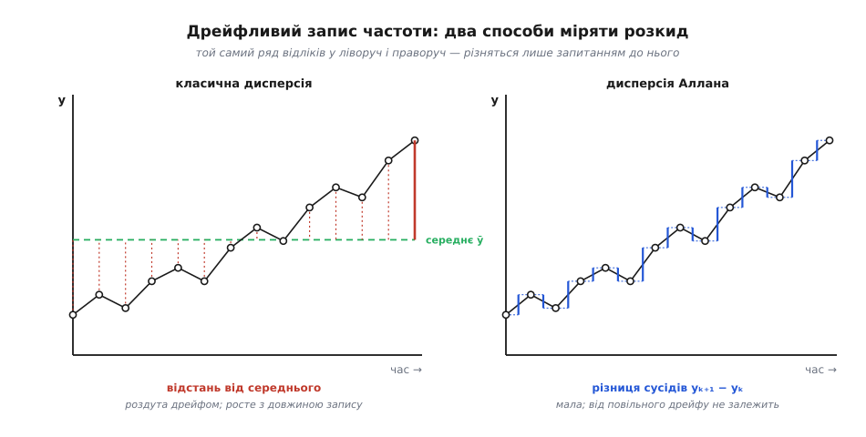
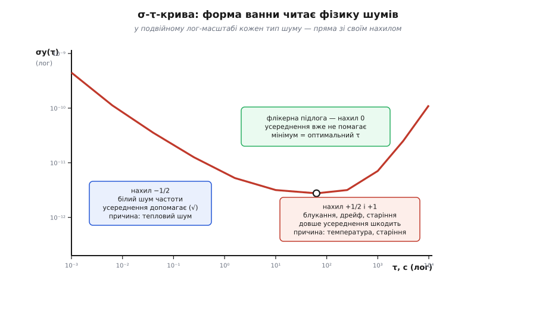
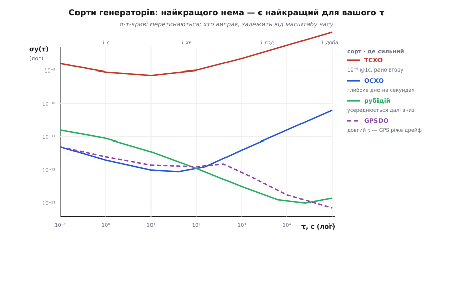

# Девіація Аллана і стабільність частоти

<preknowlist>
- [Точність частоти в ppm](topic:electronics/frequency-accuracy-ppm) — що таке відносне відхилення частоти, мільйонні частки (ppm) і чим точність відрізняється від стабільности.
- [Середнє й дисперсія](topic:math/mean-variance) — класичне середнє, дисперсія σ² і стандартне відхилення як міра розкиду навколо середнього.
- [Кварцовий резонатор](topic:electronics/quartz-resonator) — що частоту задає п'єзоелектричний резонатор і чому вона «майже», але ніколи не точно стала.
</preknowlist>

Візьміть генератор із написом «10.000000 MHz» і повірте йому на слово — а тоді підключіть до нього достатньо добрий частотомір. Частота не буде рівно десять мегагерц. Гірше: вона не буде навіть *стало* хибною. Поки ви дивитесь, останні цифри повзуть — то вгору, то вниз, ніби число дихає. Виникає природне запитання: **наскільки цей генератор стабільний?** І тут-таки напрошується природна відповідь: виміряй частоту багато разів і візьми [стандартне відхилення](topic:math/mean-variance) — воно ж саме для розкиду й придумане.

Ця відповідь неправильна. Не «неточна», а принципово неправильна: для реального генератора стандартне відхилення частоти *не має усталеного значення* — що довше міряєш, то більшим воно виходить. Зрозуміти, **чому** звична дисперсія тут ламається, і що ставлять на її місце, — це і є вся суть девіації Аллана (лат. *deviatio* — відхилення, від *de-* + *via* «шлях»).

## Точність — це не стабільність

Спершу розчепимо два поняття, які в побуті зливаються. **Точність** — це наскільки частота близька до номіналу *в середньому*: генератор на 10 MHz, що видає 10.00005 MHz, має похибку +5 [ppm](topic:electronics/frequency-accuracy-ppm). **Стабільність** — це наскільки частота *блукає навколо власного поточного значення* за заданий час, незалежно від того, влучає вона в номінал чи ні.

Ці властивості незалежні, і плутати їх — дорога помилка. Генератор може бути *неточним, але стабільним*: стабільно на 5 ppm вище — і ви просто вносите поправку раз і назавжди, а далі він тримає. І навпаки — *точним, але нестабільним*: у середньому рівно 10 MHz, але щосекунди сіпається на випадкову величину, і для відліку часу він марний, бо «в середньому за рік» вам не поможе о третій ночі.

Точність лікується калібруванням — виміряв зсув, відняв. Стабільність калібруванням **не лікується**: блукання не має сталого зсуву, який можна відняти, — його можна лише *охарактеризувати*. Тому стабільність — глибша й важча властивість, і саме про її вимірювання йдеться далі.

> 🔧 **Навіщо це.** У специфікації кварцового генератора ви побачите окремо «frequency tolerance ±20 ppm» (точність — куди влучає з коробки) і окремо «stability ±0.5 ppm» чи криву стабільности. Перше каже, чи попадете ви в потрібний канал; друге — чи *утримаєте* його. Радар, синхронізація базових станцій, GPS-приймач живуть саме на другому: їм байдуже до абсолютного зсуву, який виправить підстроювання, але критична — короткочасна незмінність.

## Чому звичайне стандартне відхилення тут не працює

Щоб говорити про частоту чисел, а не герців, вводять **відносне відхилення частоти** — безрозмірну величину

```
y = (f − f₀) / f₀
```

де f₀ — номінал. Якщо генератор на 10 MHz видає в цю мить 10 MHz + 0.1 Hz, то y = 0.1 / 10⁷ = 1×10⁻⁸. Далі скрізь працюємо з y: воно однакове для будь-якого номіналу й одразу читається як «на скільки часток частота відхилена».

Тепер міряємо. Частотомір усереднює частоту за інтервал τ (грец. *tau* — символ проміжку часу) і видає низку значень y₁, y₂, y₃, … — кожне є середня відносна частота за свій відрізок τ. Наївний план: узяти середнє ȳ по всіх N значеннях і подивитись розкид навколо нього — класичну [вибіркову дисперсію](topic:math/mean-variance):

```
s² = (1 / (N−1)) · Σ (yₖ − ȳ)²
```

Для «доброго» випадкового сигналу це чудово працює: докидаєш даних — оцінка стає тіснішою й сходиться до істинної дисперсії. Уся конструкція тримається на одному тихому припущенні — що **істинне середнє існує** і сигнал коливається навколо нього. Розкид навколо середнього має сенс лише тоді, коли є куди «навколо».

Ось де реальний генератор ламає задум. Його шум не вичерпується швидким тремтінням; у ньому є **низькочастотні** складові — [флікерний шум](topic:physics/flicker-noise) (шум 1/f, англ. *flicker* — мерехтіння) і, ще нижче, [випадкове блукання](topic:math/random-walk) частоти. У таких шумів потужність зростає, коли частота спостереження падає: що довше вікно, то більше в нього влазить повільних відхилень, яких раніше просто не було видно. Наслідок фатальний для наївного плану — **сама́ вибіркова середня не встоюється на місці**: додаєте даних, а ȳ пливе разом із дрейфом. А коли середнє пливе, розкид «навколо середнього» рахує вже не шум генератора, а розмах усього дрейфу за час спостереження.

Це не абстракція, а вимірюваний факт: якщо порахувати класичне s² для флікерного чи блукального шуму й нарощувати N, воно **не сходиться** — росте разом із довжиною запису. Оцінка нічого не оцінює: скажіть, скільки годин ви міряли, і я вгадаю ваше «стандартне відхилення», навіть не знаючи генератора. Величина, що залежить від того, як довго на неї дивишся, — не характеристика приладу.



*Ліворуч — відстань кожного відліку від загального середнього: її роздуває повільний дрейф, і що довший запис, то вона більша. Праворуч — різниця між сусідами: вона бачить лише зміну за один крок τ і на дрейф не зважає.*

## Ідея Аллана: питати про сусідів, а не про центр

Вихід знайшов 1966 року Девід Аллан у Національному бюро стандартів США — [історія цього кроку](topic:electronics/allan-deviation/hist-allan-1966.md) варта окремої розповіді, бо його підштовхнула саме безпорадність звичайної статистики перед новими атомними стандартами. Суть переходу проста, коли побачиш причину: **проблема була в тому, що ми порівнювали кожен відлік із глобальним середнім, яке пливе.** Прибираємо глобальне середнє з рівняння — порівнюймо кожен відлік не з далеким хитким центром, а з його **безпосереднім сусідом**.

Означення **дисперсії Аллана** (її ще звуть двовибірковою дисперсією):

```
σ²y(τ) = ½ · ⟨ (yₖ₊₁ − yₖ)² ⟩
```

де ⟨…⟩ — усереднення по всіх сусідніх парах, а yₖ — середні відносні частоти за суміжні відрізки τ. Розберімо, чому кожна частина стоїть на своєму місці.

**Різниця сусідів (yₖ₊₁ − yₖ)** нечутлива до сталого зсуву: якщо генератор увесь час на 5 ppm вище, ця однакова добавка є в обох доданках і при відніманні зникає. Тому дисперсія Аллана взагалі не залежить від точности — калібрувальний зсув на неї не впливає, вона міряє чисту нестабільність. Головніше — різниця відкидає й **повільно змінну** складову: у сусідніх вимірів майже однаковий поточний дрейф, і при відніманні лишається тільки те, що змінилося за один крок τ. Саме тому там, де класична дисперсія розходиться, дисперсія Аллана **сходиться до скінченного числа**: вона не бачить того ненастанно зростаючого низькочастотного «хвоста», який робив середнє невизначеним.

**Множник ½** підібрано не з естетики. Його ставлять так, щоб для чисто білого частотного шуму дисперсія Аллана дорівнювала звичайній дисперсії. Тобто нову міру відкалібрували по старій там, де стара ще працює, — і вона підхоплює естафету там, де стара падає. [Виведення множника ½ і того, чому саме перша різниця дає збіжність](topic:electronics/allan-deviation/math-allan-derivation.md) — окрема викладка; тут досить бачити задум.

Нарешті беремо квадратний корінь і отримуємо **девіацію Аллана**:

```
σy(τ) = √( σ²y(τ) )
```

Інженери майже завжди називають саме її: як і стандартне відхилення проти дисперсії, вона в тих самих одиницях, що й сама величина, — безрозмірна відносна частота. σy(τ) = 3×10⁻¹¹ читається без перекладу: «за час τ частота типово гуляє на три соті мільярдної частки».

**Порахуймо девіацію Аллана вручну.** Хай частотомір із вікном τ = 1 с дав шість відліків відносної частоти (в одиницях 10⁻⁹): 3, 5, 8, 12, 17, 21 — запис явно повзе вгору.

```
Класичне (вибіркове) відхилення:
  середнє ȳ = (3+5+8+12+17+21) / 6 = 11
  відхилення:  −8, −6, −3, +1, +6, +10
  квадрати:     64, 36,  9,  1, 36, 100   → сума 246
  s² = 246 / (6−1) = 49.2        →  s ≈ 7.0×10⁻⁹

Девіація Аллана:
  різниці сусідів:  2, 3, 4, 5, 4
  квадрати:         4, 9, 16, 25, 16     → сума 70
  σ²y = ½ · (70 / 5) = ½ · 14 = 7
  σy(1 с) = √7 ≈ 2.6×10⁻⁹
```

Класика видала 7.0×10⁻⁹, Аллан — 2.6×10⁻⁹. Різниця не випадкова: класичне відхилення роздув загальний підйом запису (розмах від краю до краю), а девіація Аллана відзвітувала про типову зміну *між сусідами* — власне те тремтіння, яке нас і цікавить, без внеску повільного повзання.

## Стабільність — це не число, а крива

Тепер найважливіше, що відрізняє цю величину від звичайного відхилення: **σy залежить від τ**. Одне число стабільности не існує. Стабільність за 1 мілісекунду й стабільність за 1 годину — це різні історії того самого генератора, і жодна не заступає іншу.

Причина глибша за формулу. На різних часових масштабах панують різні механізми шуму. На **коротких** τ швидке електронне й теплове тремтіння схеми — воно ж міняється щомиті. На **середніх** τ проступає власний флікерний шум резонатора — повільніший, але невитравний. На **довгих** τ верх беруть температурний дрейф, [старіння кварцу](topic:electronics/quartz-aging) й випадкове блукання. Кожен механізм по-своєму залежить від того, як довго ви усереднюєте. Тому єдиної відповіді бути не може — ми проганяємо τ по всьому діапазону й будуємо **криву σy(τ)**. Її називають σ‑τ‑характеристикою (сигма-тау), і саме її — а не одне число — публікують у специфікаціях доброго генератора.

## Як читати σ‑τ‑криву

Криву будують у подвійному логарифмічному масштабі — і тут стається щось красиве: кожен «чистий» тип шуму перетворюється на **пряму лінію** зі своїм характерним нахилом. Показник степеня τ стає нахилом прямої, і за самим нахилом одразу видно, який шум панує в цьому діапазоні часів.



*Спад ліворуч — «більше усереднюй, буде точніше»; плоске дно — межа, за яку усередненням не пробитись; підйом праворуч — «довше усереднюєш, тільки гірше». Мінімум ванни — найкраща стабільність і оптимальний час усереднення.*

Пройдімо криву зліва направо — це подорож від мілісекунд до діб.

**Спад із нахилом −1/2: білий частотний шум.** На коротких і середніх τ звичайно панує [білий шум частоти](topic:physics/white-noise-spectrum) — незалежні від кроку до кроку теплові й дробові флуктуації. Тут усереднення **допомагає**, і допомагає в найкласичніший спосіб: незалежні відхилення гасять одне одного як 1/√N, і що довше вікно, то менша похибка — це той самий [виграш усереднення](topic:math/averaging-gain). Подвоїли τ — девіація впала в √2 разів. Ліворуч від цього, на *дуже* коротких τ, буває ще крутіший спад −1: то вже білий *фазовий* шум вихідного каскаду, брат [фазового шуму генераторів](topic:electronics/jitter-phase-noise); тут девіація Аллана має вроджену ваду — вона не розрізняє білий і флікерний фазовий шум (обидва дають нахил ≈−1), і саме заради цього придумали модифіковану девіацію Аллана.

**Плоске дно з нахилом 0: флікерна підлога.** Спад не триває вічно. На певному τ крива вирівнюється в горизонтальну поличку — **флікерну підлогу**. Тут панує флікерний (1/f) шум самого резонатора, і в нього підступна властивість: рівна потужність у кожній октаві частот. Скільки не усереднюй — стільки ж повільного шуму додається знизу, і виграшу немає. Це найважливіша точка кривої: **флікерна підлога — це найкраще, на що генератор узагалі здатний**, його вроджена якість, яку не покращити ні довшим вимірюванням, ні кращою схемою навколо. Дно ванни — і найнижча девіація, і **оптимальний час усереднення**: міряти коротше — заважає білий шум, міряти довше — почне псувати дрейф.

**Підйом із нахилом +1/2 і +1: блукання й дрейф.** За флікерною підлогою крива повертає **вгору** — і тепер довше усереднення вже не помічник, а ворог. Нахил +1/2 — це [випадкове блукання](topic:math/random-walk) частоти: генератор помаленьку відходить кудись убік, і що довше чекаєш, то далі він зайшов. Ще крутіший нахил +1 — детермінований дрейф: рівномірне сповзання частоти від старіння кварцу чи ходу температури. (Тут, до речі, видно межу самого методу: перша різниця прибирає сталий зсув, але *рівномірний нахил* вона не прибирає — тому лінійний дрейф чесно проступає як +1; щоб відняти й нахил, користуються дисперсією Адамара.)

Уся крива — це **ванна**: униз, поличка, угору. І з неї одним поглядом читається фізика генератора: ліва стінка каже, який у нього швидкий шум, дно — яка вроджена якість, права стінка — як швидко він тікає на довгій дистанції. [Повна статистика оцінювача](topic:math/allan-variance) — довірчі інтервали, число ступенів свободи, перекривна оцінка, що вичавлює з тих самих даних більше пар, — це окрема, суто статистична частина історії.

> 🔧 **Навіщо це.** Мінімум ванни — практична вказівка, як довго усереднювати вимір. Хочете найточніше зняти частоту еталона — усереднюйте рівно до дна кривої: раніше вас б'є білий шум, пізніше — дрейф. Це не теорія: лабораторний частотомір із опцією «optimal gate time» просто знаходить це дно.

## Що означають числа: сорти генераторів

Тепер накладімо на криву реальні числа. Зручний спільний орієнтир — девіація за одну секунду, σy(1 с), але пам'ятаймо, що вся суть — у формі кривої, а не в одній точці.



*Криві перетинаються. Немає «найкращого» генератора — є найкращий для вашого масштабу часу: OCXO виграє секунди-хвилини, рубідій і GPSDO — години-доби.*

- **Простий кварцовий генератор** — σy(1 с) близько 10⁻⁸; дно неглибоке, рано з'їдається температурою.
- **TCXO** (з температурною компенсацією) — близько 10⁻⁹ на секунді, але його крива повертає вгору **рано**: компенсація температури неідеальна, тож на довгих τ він поганенький.
- **[OCXO](topic:electronics/comp-ocxo)** (термостатований кварцовий генератор) — 10⁻¹¹…10⁻¹² з глибоким флікерним дном десь на одиницях-десятках секунд: чудовий короткочас і середина, але за кількасот секунд старіння тягне криву вгору.
- **Рубідієвий стандарт** — близько 10⁻¹¹ на секунді, зате він довго спадає з нахилом −1/2 (білий частотний шум) і сягає дна аж на ~10⁻¹³ десь коло тисяч секунд: виграє середину й довгий бік.
- **[GPSDO](topic:electronics/gpsdo)** (генератор, дисциплінований GPS) — короткочас у нього такий, як у власного OCXO всередині (~10⁻¹¹ на секунді), але його крива на довгих τ **продовжує спадати** там, де вільний OCXO вже повзе вгору. Причина у формі кривої, а не в кращому кварці: GPS постійно порівнює місцевий генератор зі світовим часом і **вирізає дрейф і старіння** — саме ту праву стінку ванни, яку кварц сам подолати не може.

Звідси головний висновок, заради якого все й будувалося: **найкращого генератора не існує — існує найкращий для вашого τ.** Криві різних сортів **перетинаються**. Потрібна фазова зв'язність за мілісекунди (імпульсний радар, когерентне накопичення) — беріть того, у кого низька ліва стінка, тобто OCXO. Потрібно втримати час за добу без опори (телеком-«утримання», хронометрія) — беріть того, у кого низька права стінка, тобто рубідій чи GPSDO, хай навіть на секунді він програє. Вибір генератора — це буквально прочитання потрібної точки з цієї кривої.

**Скільки часу коштує стабільність.** Девіацію легко перекласти на похибку годинника. Якщо σy(τ) = 1×10⁻¹¹ на τ = 1 с, то за цю секунду накопичена невизначеність часу приблизно

```
Δt ≈ σy(τ) · τ = 1×10⁻¹¹ · 1 с = 1×10⁻¹¹ с = 10 пс
```

Десять пікосекунд похибки за секунду — ось що ховається за сухим «10⁻¹¹». Для базової станції, що роздає час абонентам, ця цифра прямо переходить у бюджет синхронізації.

## Як її вимірюють

Щоб зняти σ‑τ‑криву, потрібні дві речі: **опора, не гірша за випробуваний генератор**, і трохи арифметики. Частотомір, прив'язаний до опори, вимірює відносну частоту з малим кроком τ₀ і пише довгий журнал y₁, y₂, … (або пише фазу й бере її похідну). Тоді для драбини значень τ = τ₀, 2τ₀, 4τ₀, … (октавами) рахують σy(τ) за означенням; **перекривна** оцінка при цьому переюзує всі можливі пари, а не лише стик-у-стик, і дає тісніший довірчий інтервал з того самого запису. [Алгоритм обчислення девіації Аллана з журналу вимірів](topic:electronics/allan-deviation/proj-compute-adev.md) — з пастками на кшталт октавного кроку τ і зменшення числа пар на довгих τ — винесено окремо.

Головна практична пастка причаїлась у слові «опора». Якщо ваша опора не краща за випробуваний прилад, ви міряєте **опору**, а не прилад — крива покаже гіршого з двох. Коли еталона під рукою немає, беруть три приблизно рівні генератори, міряють усі три пари й розв'язують систему на три невідомі дисперсії — метод «трьох капелюхів» (англ. *three-cornered hat*), що дає стабільність кожного нарізно без жодного зовнішнього еталона.

Глибша причина, чому вся ця машинерія взагалі потрібна, замикає коло. Деякі шуми не мають усталеного середнього — і тоді «середня частота» є фікцією, а її стандартне відхилення міряє не прилад, а довжину вашого терпіння. Питаючи про зміну між сусідами замість відстані від уявного центру, дисперсія Аллана ставить запитання, яке **завжди має відповідь**. А те, як ця відповідь масштабується з τ, безкоштовним додатком читає фізику всіх шумових механізмів одразу — тепловий, флікерний, блукальний. Одна крива каже і **з чого зроблено** генератор, і **як довго йому можна вірити**.
