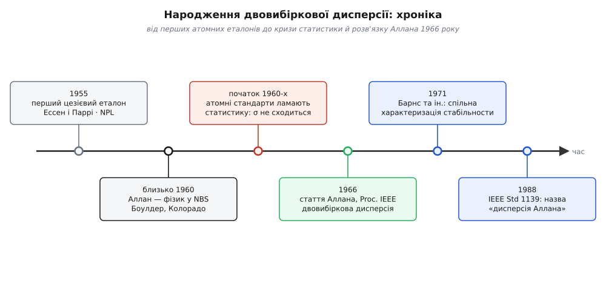

# 📜 Число, що не хотіло стояти на місці

Це історія про те, як 1966 року тридцятирічний фізик у Національному бюро стандартів США врятував саме поняття «стабільність частоти» — бо нові атомні годинники виявилися такі досконалі, що зламали статистику, якою її звикли міряти. Народжена тоді величина сьогодні зветься дисперсією Аллана, хоча сам автор називав її інакше, а ім'я їй дали інші.

Почнімо з симптому, який ставив у безвихідь цілі лабораторії. Візьміть найкращий на той час генератор, довго міряйте його частоту й спитайте просте: наскільки він стабільний? Природна відповідь — [вибіркове стандартне відхилення](topic:math/mean-variance) виміряних значень: воно ж саме для розкиду й придумане. Але ця відповідь не стоїть на місці. Поміряли годину — одне число; добу — число більше; тиждень — ще більше. Дві лабораторії з тим самим годинником, але різними за довжиною записами, чесно отримували різну «стабільність» — і не могли зійтися навіть у тому, яке число писати в паспорт приладу. Величина, придумана, щоб пришпилити сталість, сама виявилася несталою.

## Атомний годинник приходить у Боулдер

Перший практичний атомний еталон частоти збудували 1955 року англієць Луїс Ессен (Louis Essen) і Джек Паррі (Jack Parry) у британській Національній фізичній лабораторії (NPL). Їхній прилад підстроював коливання не під пружність кристала, а під незмінну частоту квантового переходу в атомі цезію-133 — опору, яку природа тримає однаковою скрізь і завжди. За кілька років [атомні еталони частоти](topic:physics/atomic-clock) розійшлися метрологічними лабораторіями світу, і американську службу часу й частоти зосередили в Національному бюро стандартів США (National Bureau of Standards, NBS; згодом NIST) у місті Боулдер, штат Колорадо.

І тут криється тонкий, майже парадоксальний поворот: біду принесла **не слабкість, а сила** нових годинників. Кварцовий генератор весь трясе швидке теплове тремтіння схеми — [білий шум](topic:physics/white-noise-spectrum), незалежний від миті до миті. Він великий і на будь-якому розумному вимірі забиває собою все інше; повільніші, підступніші складові просто тонуть під ним. Атомний еталон це швидке тремтіння **прибирає**: коливання прив'язане до атома, а не до кристала. І щойно гучний білий шум стих — з-під нього визирнуло те, що раніше було не чути: [флікерний шум](topic:physics/flicker-noise) (шум 1/f) і ще повільніше [випадкове блукання](topic:math/random-walk) частоти. А це саме ті шуми, для яких класична дисперсія **не має скінченного значення**. Що кращий годинник, то оголеніше проступає його розбіжність. Криза прийшла не всупереч атомним стандартам, а **завдяки** їм.

## Число, що росло разом із терпінням

Чому ж класична дисперсія тут відмовляє — це варто побачити причинно, бо саме безпорадність старого інструмента підштовхнула до нового. Вибіркова дисперсія міряє розкид навколо вибіркового середнього й тихо припускає одне: що це середнє існує, що є куди «навколо». Для флікерного й блукального шуму потужність зростає, коли частота спостереження падає, — отже, що довше дивишся, то більше повільних відхилень влазить у вікно. Наслідок фатальний: **саме середнє не стоїть на місці**, воно пливе разом із записом. А коли центр пливе, «розкид навколо центру» міряє вже не тремтіння годинника, а розмах усього дрейфу за час спостереження — і чесно росте разом із цим часом.

Ось звідки той нестерпний симптом: число кодувало не якість приладу, а довжину вашого терпіння. Для метрології — науки, чиє єдине ремесло в тому, щоб дві лабораторії зійшлися на одному числі, — це був глухий кут. Головну характеристику годинника, його стабільність, буквально **не можна було назвати**. Проблему гостро відчували в групі часу й частоти NBS у Боулдері; її статистичний бік провадив Джеймс Барнс (James A. Barnes). Бракувало не старанності — бракувало правильно поставленого запитання.



*Атомні еталони дали небачену роздільність — і оголили низькочастотний шум, на якому спіткнулася класична статистика. Розв'язок 1966 року спільнота метрологів формалізувала впродовж наступних років, а ім'я авторові дала вже вона.*

## Девід Аллан: від центру до сусіда

Девід В. Аллан (David W. Allan) — американський фізик, народився 25 вересня 1936 року в містечку Мейплтон, штат Юта. Ступінь бакалавра з фізики він здобув в Університеті Брігама Янга (1960), того ж року прийшов працювати в NBS у Боулдері, а магістерську роботу захистив в Університеті Колорадо в Боулдері (1965). Саме та магістерська й лягла в основу статті, що вийшла наступного року.

Крок, який він зробив, простий на вигляд і глибокий по суті. Якщо лихо в тому, що ми порівнюємо кожен відлік із далеким хитким центром, — **приберімо центр із запитання зовсім**. Не «наскільки цей відлік далеко від загального середнього», а «наскільки він відрізняється від свого безпосереднього сусіда»:

```
класичне запитання:  наскільки yₖ далеко від середнього ȳ   →  (yₖ − ȳ)²
Алланове запитання:  наскільки yₖ відрізняється від сусіда  →  (yₖ₊₁ − yₖ)²
```

Різниця сусідів робить одразу дві потрібні речі. Вона викидає будь-який **сталий зсув**: якщо годинник увесь час на стільки-то вище, ця однакова добавка є в обох доданках і при відніманні зникає. Головніше — вона майже викидає й **повільно змінну** складову: у сусідніх вимірів практично однаковий поточний дрейф, тож лишається тільки те, що змінилося за один крок. Саме тому там, де класична дисперсія розходиться, різниця сусідів **сходиться до скінченного числа** — вона просто не бачить того ненастанно наростаючого низькочастотного хвоста, який робив середнє невизначеним.

Те, що Аллан опублікував, було ще загальніше за одну формулу: він увів родину так званих *M-вибіркових дисперсій* — дисперсій середніх, узятих по M суміжних відрізках, — і виокремив випадок двох вибірок, M = 2, як той, що дає збіжність для проблемних шумів. Точне посилання, звірене за реєстром DOI:

```
Д. В. Аллан, «Statistics of atomic frequency standards»
(«Статистика атомних еталонів частоти»),
Proceedings of the IEEE, том 54, № 2, с. 221–230, лютий 1966.
doi:10.1109/PROC.1966.4634
```

Тут варто відразу відкинути легенду про самотнє осяяння. Розбіжність класичної статистики була відома, флікерний шум — теж; проблему колективно обточувала група NBS, а Барнс вів її статистичний бік. Внесок Аллана — не «перша здогадка», а **чиста, загальна й придатна до вжитку** постановка, яку спільнота змогла підхопити й зробити спільною мовою. Цим і цінна стаття: вона не просто розв'язала задачу, а дала всім однаковий спосіб її розв'язувати. З часом вона стала однією з найцитованіших у метрології часу й частоти.

## Ім'я, яке дали інші

А тепер — поворот, який любить історія науки. У своїй статті Аллан **ніде не пише «дисперсія Аллана»** — та й не міг би: своє ім'я в назву не ставлять. Він користувався описовим терміном — двовибіркова, або M-вибіркова, дисперсія. Ім'я величині дала згодом сама спільнота, на його честь.

Закріплювалося воно поступово. 1971 року вийшла колективна стаття «Characterization of Frequency Stability» («Характеризація стабільности частоти») під проводом того ж Барнса, яка рекомендувала двовибіркову дисперсію як стандартну міру стабільности й унормувала позначення σ²y(τ). Саме навколо неї назва «дисперсія Аллана» почала вкорінюватися в обіході. Остаточно її зацементувало те, що двовибіркову дисперсію піднесли до офіційного стандарту — IEEE Std 1139 — 1988 року. Коли саме вперше прозвучали слова «Allan variance», до одного дня не прив'язати; задокументований бік історії інший і надійніший: автор називав величину описово, а ім'я їй дала громада метрологів.

У цьому є проста мораль про те, як імена липнуть у науці. Вони чіпляються за вжитком — і зазвичай до того, хто викристалізував ідею в ту форму, якою потім усі почали користуватися, а не конче до першого, хто її побачив, чи до єдиного автора. Тут же той, кого вшановують цією назвою, сам називав своє дитя інакше.

## Що лишилося

Стаття 1966 року переінакшила запитання — і в цьому вся її живучість. Замість «наскільки далеко частота від середнього?» (запитання, що втрачає сенс, коли середнього немає) вона питає «наскільки частота змінюється від відрізка до відрізка?» — а на це запитання відповідь **є завжди**. Сьогодні криву σy(τ) друкують у паспорті кожного серйозного генератора й атомного годинника, і на цій самій мірі тримається те, як світові лабораторії часу звіряють між собою свої еталони. 2016 року IEEE відзначила піввіковий ювілей тієї статті. Непогано для магістерської роботи, що починалася як спроба видобути одне чесне, повторюване число з годинника, який виявився просто **надто добрим** для старої арифметики.
