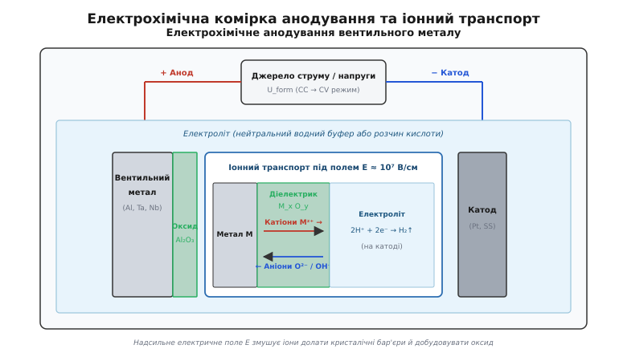
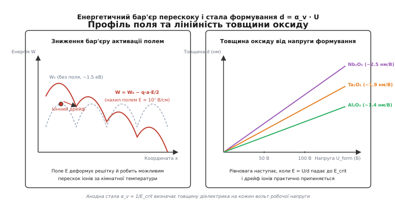
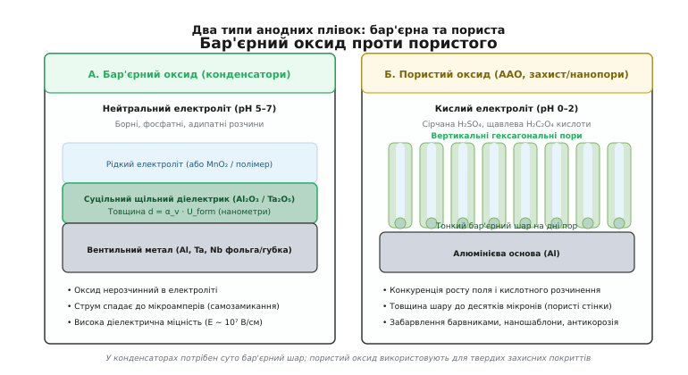
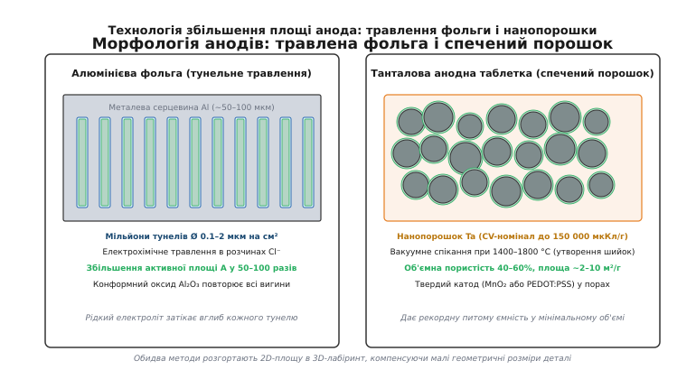
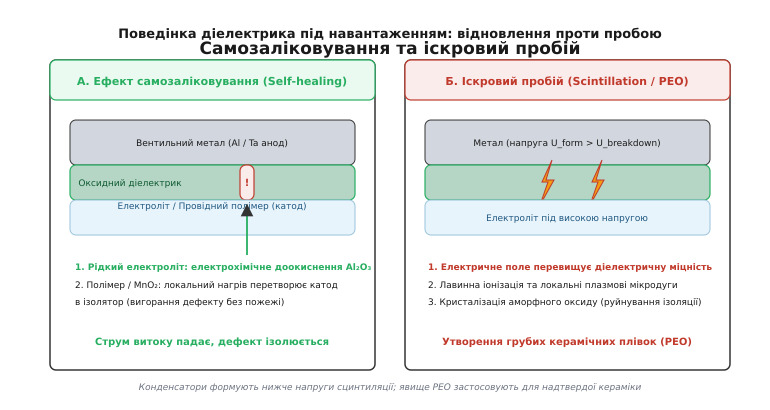

# Анодування металів: електрохімічний ріст діелектрика, іонний дрейф у сильних полях і наноструктуровані аноди

<preknowlist>
- [Конденсатор](book:electronics/capacitor) — фундаментальний принцип накопичення заряду двома провідними обкладками, розділеними шаром діелектрика.
- [Ємність](book:electronics/capacitance) — залежність ємності від площі пластин, діелектричної проникності та товщини ізолюючого проміжку `C = ε₀ · ε_r · A / d`.
- [Діелектрики конденсаторів](book:electronics/capacitor-dielectrics) — поляризація діелектриків, діелектрична проникність `ε_r`, напруженість пробою та електрична міцність матеріалів.
- [Електролітичний конденсатор](book:electronics/electrolytic-cap) — будова алюмінієвих і танталових конденсаторів, вентильний ефект, роль рідких і твердих електролітів.
- [Паразити конденсатора](book:electronics/capacitor-parasitics) — еквівалентний послідовний опір (ESR), струм витоку, деградація та теплові режими роботи.
</preknowlist>

Конденсатор ємністю в тисячу мікрофарад, зібраний із двох гладких металевих смуг і класичної полімерної плівки завтовшки кілька мікронів, мав би розміри футбольного м'яча. Головна перешкода на шляху до мініатюризації пасивних компонентів криється у фундаментальній геометрії: ємність плоского конденсатора `C = (ε₀ · ε_r · A) / d` обернено пропорційна товщині ізолятора `d`. Щоб зменшити об'єм деталі у тисячі разів, необхідно стиснути діелектричний зазор до нанометрових масштабів — від одиниць до сотень нанометрів.

Проте механічне розкочування або екструзія полімерів не здатні дати суцільну бездефектну плівку завтовшки менше одного мікрона: на площі у кілька квадратних метрів неминуче виникають мікропори, розриви та пилові проколи, які закорочують обкладки. Розв'язанням цієї інженерної проблеми стала технологія анодного окиснення — процес, у якому діелектричний шар вирощується безпосередньо з самого металу атом за атомом під дією надвисокого електричного поля у ванні з електролітом.


*Електрохімічна комірка анодування: позитивно поляризований метал стає анодом, на поверхні якого під дією надсильного електричного поля зустрічні потоки іонів формують щільний оксидний діелектрик.*

## Електрохімічний процес та вентильні метали

Термін «анодування» (*грец. ἄноδος (anodos)* — рух угору, вихід, від *ana-* «вгору» + *hodos* «шлях») позначає процес електрохімічного окиснення поверхні металів, коли оброблювану деталь підключають до позитивного полюса джерела струму (роблять анодом) і занурюють у розчин електроліту.

На відміну від більшості металів (заліза, міді, срібла), які при анодній поляризації безперервно розчиняються, переходячи в розчин у вигляді іонів `M → Mᶻ⁺ + z e⁻`, невелика група елементів поводиться принципово інакше. Їх називають **вентильними металами** (*англ. valve metals*, від *лат. valva* — дверна стулка, клапан). До цієї групи належать перехідні та легкі метали: алюміній (`Al`), тантал (`Ta`), ніобій (`Nb`), титан (`Ti`), цирконій (`Zr`) та гафній (`Hf`).

Коли вентильний метал підключають як катод («−»), через розчин вільно тече струм електролізу з бурхливим виділенням водню на металі. Але при підключенні позитивним полюсом («+») на межі розділу метал-електроліт миттєво стартує реакція утворення нерозчинного щільного оксиду. Електрони йдуть у зовнішнє коло до джерела живлення, а на поверхні металу зв'язуються катіони металу та кисневмісні аніони розчину.

Сумарна електрохімічна реакція для тривалентного алюмінію має вигляд:

```
2 Al + 3 H₂O → Al₂O₃ + 6 H⁺ + 6 e⁻
```

Для п'ятивалентного танталу та ніобію:

```
2 Ta + 5 H₂O → Ta₂O₅ + 10 H⁺ + 10 e⁻
2 Nb + 5 H₂O → Nb₂O₅ + 10 H⁺ + 10 e⁻
```

Для чотиривалентного титану:

```
Ti + 2 H₂O → TiO₂ + 4 H⁺ + 4 e⁻
```

Утворений шар оксиду є високоякісним діелектриком із питомим електричним опором `ρ > 10¹⁴` Ом·см. Щойно він утворюється, вільний перенос електронів блокується. Подальший перебіг реакції вимагає фізичного проходження іонів крізь тверду оксидну решітку.

Термодинамічну можливість пасивації металів описують діаграми Пурбе (діаграми потенціал-pH). Для алюмінію область термодинамічної стабільності оксиду Al₂O₃ зосереджена у діапазоні `pH ≈ 4.0–8.5`. За нижчих pH переважає розчинний катіон `Al³⁺` (активне корозійне розчинення), а за pH вище 8.5 — розчинний алюмінат-іон `AlO₂⁻`. Для танталу та ніобію область пасивації значно ширша: оксиди Ta₂O₅ та Nb₂O₅ залишаються нерозчинними практично в усьому діапазоні pH від 0 до 12, розчиняючись лише в агресивних розчинах плавикової кислоти `HF`.

## Механізм іонного транспорту в надсильних електричних полях

За кімнатної температури кристалічна решітка оксидів металів є надійним ізолятором не лише для електронів, а й для власних іонів. Щоб іон металу або кисню вирвався зі свого вузла й перескочив у сусіднє міжвузля чи вакансію, він повинен подолати енергетичний бар'єр активації `W₀ ≈ 1.5–2.0` еВ. За звичайних умов теплової енергії `k_B · T ≈ 0.026` еВ абсолютно недостатньо для подолання цього порогу: дифузійний транспорт іонів у твердому тілі фактично заморожений.

Чому ж тоді оксидна плівка продовжує рости у ванні анодування? Причина полягає в надзвичайній напруженості електричного поля `E`, що концентрується всередині нанометрового оксидного шару.

Коли до плівки завтовшки `d = 10` нм прикладено напругу `U = 10` В, напруженість поля всередині діелектрика становить:

```
E = U / d = 10 В / (10 · 10⁻⁷ см) = 10⁷ В/см = 10⁹ В/м
```

Це електричне поле колосальної величини. Воно наближається до міжатомних полів зв'язку в кристалічній решітці. Згідно з класичною моделлю іонного транспорту у високих полях Кабрери — Мотта та Вервея, напруженість `10⁷` В/см радикально деформує симетричний потенціальний рельєф решітки.


*Зліва — нахил енергетичного рельєфу під полем E ≈ 10⁷ В/см, що знижує потенціальний бар'єр для перескоку іонів; справа — лінійна залежність товщини вирощеного оксиду від напруги формування U_form.*

При переміщенні катіона з зарядом `q = z · e` на половину довжини стрибка `a / 2` електричне поле виконує роботу, знижуючи висоту бар'єра у напрямку вектора поля на величину `ΔW = (q · a · E) / 2`. Зворотний бар'єр на таку саму величину зростає.

У результаті ймовірність прямого термопольового перескоку іонів експоненційно зростає, підпорядковуючись рівнянню Гюнтершульце — Бетца:

```
j_ion(E) = j₀ · exp(B · E)
```

де `j_ion` — густина іонного струму, `j₀` — передекспоненційний кінетичний множник, а `B = (q · a) / (2 · k_B · T)` — коефіцієнт електропольового підсилення. Детальний математичний апарат і диференціальні рівняння кінетики виведено у вставці про [математичну модель кінетики іонного транспорту](book:electronics/anodization/math-barrier-kinetics.md).

Ріст оксиду відбувається завдяки зустрічній міграції двох типів заряджених частинок:
1. **Катіони металу (`Al³⁺`, `Ta⁵⁺`)** під дією поля вириваються з металевої підкладки, дрейфують крізь товщу оксиду назовні та реагують із молекулами води на межі «оксид — електроліт».
2. **Аніони кисню (`O²⁻`, `OH⁻`)**, утворені внаслідок дисоціації води на зовнішній межі, дрейфують під дією поля всередину та окиснюють метал на внутрішній межі «метал — оксид».

Для алюмінію близько 40% нового оксиду утворюється на зовнішній поверхні за рахунок виходу катіонів `Al³⁺`, а 60% — на внутрішній межі за рахунок входу `O²⁻`. Для танталу переважає внутрішній ріст (понад 70% кисневого переносу), завдяки чому оксид Ta₂O₅ демонструє надзвичайно високу механічну адгезію до металу.

## Залежність товщини від напруги формування: анодна стала

Ріст оксидного шару за постійної прикладеної напруги `U_form` є процесом із глибоким негативним зворотним зв'язком. У міру збільшення товщини плівки `d` напруженість поля всередині неї неминуче спадає:

```
E(t) = U_form / d(t)
```

Оскільки густина іонного струму експоненційно чутлива до поля `j_ion ∝ exp(B · E)`, кожне збільшення товщини на кілька нанометрів призводить до падіння швидкості іонного дрейфу на порядки. Коли поле знижується до критичного значення `E_crit ≈ (4–8) · 10⁶` В/см, іонний струм практично згасає (падає до часток мікроампера), і ріст плівки повністю зупиняється.

Звідси випливає фундаментальний закон анодування: **кінцева товщина бар'єрного оксиду `d` строго пропорційна напрузі формування `U_form`**:

```
d = α_v · U_form
```

де коефіцієнт пропорційності `α_v = 1 / E_crit` називають **анодною сталою** (anodic growth factor, вимірюється в нм/В).

Анодна стала є фізико-хімічною константою конкретного металу за заданої температури:
- Для оксиду алюмінію `Al₂O₃`: `α_v ≈ 1.2–1.4` нм/В (типово 1.35 нм/В);
- Для оксиду танталу `Ta₂O₅`: `α_v ≈ 1.7–2.0` нм/В (типово 1.90 нм/В);
- Для оксиду ніобію `Nb₂O₅`: `α_v ≈ 2.4–2.8` нм/В (типово 2.50 нм/В);
- Для діоксиду титану `TiO₂`: `α_v ≈ 2.8–3.5` нм/В (типово 3.30 нм/В).

Це означає, що технолог на виробництві керує товщиною ізолятора з нанометровою точністю за допомогою звичайного вольтметра. Якщо алюмінієвий конденсатор розрахований на робочу напругу 25 В, фольгу анодують при напрузі формування `U_form ≈ 35–40` В (із запасом на надійність). При цьому товщина ізолюючого шару Al₂O₃ автоматично становить:

```
d = 1.35 нм/В · 40 В = 54 нм
```

Для порівняння: товщина людської волосини становить близько 80 000 нм. Отримати суцільний, однорідний ізолятор завтовшки 54 нм на сотнях квадратних метрів фольги будь-яким іншим методом фізично неможливо.

## Аморфна структура проти польової кристалізації

Сформований за оптимальних умов анодний оксид вентильних металів має **аморфну (склоподібну) структуру**. Відсутність міжкристалітних меж є критичною умовою високої діелектричної міцності: у полікристалічних матеріалах межі зерен слугують шляхами швидкого витоку електронів і міграції домішок, що знижує напругу пробою в рази.

Проте аморфний стан є термодинамічно метастабільним. За певних критичних умов в оксиді розвивається небезпечний деградаційний процес — **польова кристалізація** (field-induced crystallization):
1. На мікродефектах поверхні металу або в місцях скупчення домішок (заліза, кремнію, вуглецю) зароджуються нанокристаліти оксиду;
2. Під впливом сильного електричного поля та підвищеної температури (вище 60–85 °C) кристаліти розростаються у радіальні дископодібні структури — сфероліти;
3. Оскільки густина кристалічного оксиду (наприклад, γ-Al₂O₃ з густиною 3.6 г/см³) помітно вища за аморфний оксид (3.1 г/см³), кристалізація супроводжується локальною усадкою об'єму на 15–20%;
4. По периметру сфероліта виникають мікротріщини та напруження, що створюють наскрізні канали провідності.

Струм витоку конденсатора в зоні сфероліта лавиноподібно зростає, спричиняючи локальний перегрів і тепловий пробій. Щоб запобігти польовій кристалізації, виробники використовують надчисті метали (Al `99.99%`, Ta `99.995%`), додають в електроліт фосфатні інгібітори, які зв'язуються з поверхнею та стабілізують аморфну сітку, і суворо контролюють температуру формування.

## Діелектричні властивості та вибір вентильного металу

Ємність конденсатора залежить не лише від товщини діелектрика `d`, а й від його відносної діелектричної проникності `ε_r`. Підставляючи співвідношення `d = α_v · U_form` у формулу ємності плоского конденсатора, отримуємо питому ємність на одиницю площі:

```
C / A = (ε₀ · ε_r) / (α_v · U_form)
```

Добуток питомої ємності на робочу напругу визначає заряд, накопичений на одиниці площі. Він пропорційний відношенню `ε_r / α_v`:

```
(C · U_form) / A = (ε₀ · ε_r) / α_v
```

Чим вища діелектрична проникність `ε_r` і чим менша стала `α_v` (тобто чим вищу напруженість поля витримує оксид), тим компактнішим буде конденсатор.

```
Показник питомої зарядної здатності діелектриків:
  Al₂O₃:  ε_r ≈ 9,   α_v ≈ 1.35 нм/В  →  ε_r / α_v ≈ 6.67 нм⁻¹
  Ta₂O₅:  ε_r ≈ 27,  α_v ≈ 1.90 нм/В  →  ε_r / α_v ≈ 14.21 нм⁻¹
  Nb₂O₅:  ε_r ≈ 41,  α_v ≈ 2.50 нм/В  →  ε_r / α_v ≈ 16.40 нм⁻¹
  TiO₂:   ε_r ≈ 90,  α_v ≈ 3.30 нм/В  →  ε_r / α_v ≈ 27.27 нм⁻¹
```

Оксид танталу Ta₂O₅ має `ε_r ≈ 27` — це утричі більше, ніж в оксиду алюмінію (`ε_r ≈ 9`). Тому при однаковій площі та робочій напрузі танталовий конденсатор забезпечує більш ніж удвічі вищу ємність.

Чому ж тоді не виготовляти всі конденсатори з титану, діоксид якого має колосальну діелектричну проникність `ε_r ≈ 80–110`? Відповідь полягає в ширині забороненої зони `E_g` та дефектності кристалічної решітки:
- **Al₂O₃** має ширину забороненої зони `E_g ≈ 7.0–8.8` еВ (ідеальний широкозонний ізолятор). Його струми витоку мізерні, а напруга електричного пробою сягає 10 МВ/см, що дозволяє створювати конденсатори на напруги понад 500 В.
- **Ta₂O₅** має `E_g ≈ 4.2–4.5` еВ. Це забезпечує чудову ізоляцію до напруг 50–75 В і стабільність характеристик до температури +125 °C.
- **Nb₂O₅** має `E_g ≈ 3.4` еВ. Він забезпечує високу ємність за низьких напруг (до 16–35 В), але за високих температур струм витоку зростає.
- **TiO₂** має вузьку заборонену зону `E_g ≈ 3.0–3.2` еВ і високу концентрацію кисневих вакансій, які діють як донори електронів. У сильних полях оксид титану поводиться як напівпровідник із неприпустимо високим струмом витоку.

Детальний порівняльний аналіз матеріалів та їхніх експлуатаційних меж наведено у вставці про [порівняльний огляд діелектричних параметрів вентильних металів](book:electronics/anodization/comp-valve-dielectrics.md).

## Бар'єрні та пористі анодні плівки: роль електроліту

Залежно від хімічного складу та кислотності електроліту процес анодування може формувати два принципово різні типи оксидних структур: **бар'єрні** або **пористі**.


*Зліва — суцільний бар'єрний оксид, вирощений у нейтральному буфері для конденсаторів; справа — самоорганізована гексагональна пориста структура AAO, що формується в кислому електроліті.*

### 1. Бар'єрні плівки (Barrier-type oxide)

Бар'єрний оксид є абсолютно щільним, суцільним і непористим шаром аморфного діелектрика. Він формується в **нейтральних або слабокислих буферних електролітах** із водневим показником `pH ≈ 5–7`, у яких оксид алюмінію чи танталу є повністю нерозчинним.

Типовими електролітами для конденсаторного бар'єрного анодування є:
- Водні або етиленгліколеві розчини борної кислоти `H₃BO₃` та пентаборату амонію `(NH₄)₂B₁₀O₁₆`;
- Розчини фосфату амонію `(NH₄)₂HPO₄`;
- Розчини солей органічних дикарбонових кислот (адипату, себацинату амонію).

У такому середовищі оксид не розчиняється хімічно. Ріст зупиняється на товщині `d = α_v · U_form`. Максимальна товщина бар'єрного шару обмежена електричним пробоєм і зазвичай не перевищує 0.5–1.0 мкм (для напруг формування до 600–700 В). Саме цей тип оксиду є робочим тілом усіх електролітичних конденсаторів.

На сучасних автоматизованих лініях фольгу протягують через каскад послідовних ванн. Щоб запобігти утворенню кристалічного беміту (`AlOOH` або `Al₂O₃ · H₂O`), вміст води в етиленгліколевих розчинах суворо підтримують на рівні 1–5%, а температуру ванни стабілізують у межах 65–85 °C. Після проходження формування фольга піддається термообробці (відпалу) при 450–550 °C у фосфатному середовищі для зняття внутрішніх механічних напружень та дегідратації залишків гідроксильних груп.

### 2. Пористі плівки (Porous-type oxide / AAO)

Якщо анодування проводять у **кислих електролітах** (`pH < 2`), у яких оксид металу повільно розчиняється (розчини сірчаної `H₂SO₄`, щавлевої `H₂C₂O₄`, ортофосфорної `H₃PO₄` або хромової `H₂CrO₄` кислот), формується принципово інша структура.

У кислому середовищі виникає динамічна конкуренція двох протилежних процесів:
1. Електрохімічного росту оксиду на дні за рахунок надсильного поля;
2. Локального хімічного розчинення оксиду кислотою, яке багаторазово прискорюється концентрацією електричного поля та джоулевим розігрівом у вершинах заглиблень.

У результаті на поверхні алюмінію самоорганізується масив вертикальних гексагональних комірок із циліндричними нанопорами в центрі (анодний оксид алюмінію, AAO — Anodic Aluminum Oxide). На дні кожної пори зберігається тонкий сферичний бар'єрний шар завтовшки лічені нанометри, крізь який протікає іонний струм, тоді як стінки пори безперервно нарощуються у висоту.

Товщина пористого шару не обмежена напругою формування і може сягати 10–100 мікронів. Такі покриття не використовують як конденсаторний діелектрик (через наскрізні пори, заповнені провідним розчином). Проте вони мають колосальну твердість (поступаючись лише алмазу та корунду), захищають метал від корозії, вбирають барвники для декоративного забарвлення корпусів радіоапаратури і слугують наношаблонами для вирощування масивів квантових точок і нанодротів.

Історію того, як інженерні пошуки захисту обшивки літаків і розробка перших електролітичних випрямлячів привели до відкриття цих двох режимів, описано у вставці про [історію відкриття вентильного ефекту від дослідів Бюффа до розробок Bell Labs](book:electronics/anodization/hist-valve-metals.md).

## Технологія підготовки поверхні: травлена фольга і спечені нанопорошки

Зменшення товщини діелектрика `d` дає лише половину виграшу в ємності. Друга половина досягається багаторазовим збільшенням активної площі поверхні `A`. У сучасних конденсаторах діелектрик вирощують не на плоскому металі, а всередині розвиненого тривимірного мікролабіринту.


*Технології розгортання площі анода: тунельне електрохімічне травлення алюмінієвої фольги та вакуумне спікання танталових нанопорошків у пористу губку.*

### 1. Тунельне електрохімічне травлення алюмінієвої фольги

Алюмінієвий анод виготовляють із високочистої фольги (чистота Al `99.99%`) завтовшки 50–110 мкм із кубічною кристалографічною текстурою `(100)`.

Перед анодуванням фольга проходить процес електрохімічного травлення у ванні з розчином соляної кислоти `HCl` та хлориду натрію `NaCl` під дією змінного або імпульсного постійного струму. Іони хлору `Cl⁻` локально руйнують природну пасивну плівку, ініціюючи пітингову корозію.

Завдяки кубічній орієнтації кристалітів травлення розвивається строго вздовж кристалографічних напрямків `[100]`, виїдаючи в товщі фольги мільйони паралельних вертикальних мікротунелів діаметром `0.1–2.0` мкм і глибиною до 30–40 мкм:
- Для **низьковольтних конденсаторів** (до 63 В) формують високу густину ультратонких тунелів (`Ø ≈ 0.1–0.3` мкм), що збільшує ефективну площу поверхні у **80–120 разів** порівняно з геометричною.
- Для **високовольтних конденсаторів** (100–500 В) тунелі роблять ширшими (`Ø ≈ 1.0–2.0` мкм), щоб товстий шар майбутнього оксиду (до 300–600 нм) не заблокував і не перекрив порожнину каналу. Це дає збільшення площі у **30–50 разів**.

Після травлення фольгу ретельно промивають від залишків хлоридів і піддають анодуванню в нейтральному боратному електроліті. Оксид Al₂O₃ конформно вкриває всі внутрішні стінки кожного мікротунелю.

### 2. Спікання нанопорошків танталу та ніобію

У танталових конденсаторах реалізовано ще радикальніший метод. Танталовий анод формують методом порошкової металургії:
1. **Пресування таблетки.** Високочистий танталовий порошок із розміром частинок від 50 нм до кількох мікрон змішують зі зв'язуючою речовиною, запресовують у прес-формі навколо танталового дротяного виводу й отримують пористу пресовку (pellet).
2. **Вакуумне спікання.** Пресовку нагрівають у високовакуумній печі (`10⁻⁵` Торр) до температури 1400–1800 °C. За такої температури зерна танталу схоплюються в точках дотику, утворюючи міцні металеві «шийки», але не сплавляються в моноліт.
3. **Отримання 3D-губки.** Утворюється монолітна металева губка з відкритою об'ємною пористістю 40–60% і колосальною питомою площею поверхні — від 2 до 10 м² на кожен грам металу.
4. **Анодування в порах.** Спечену таблетку занурюють у теплий розчин ортофосфорної кислоти та анодують. Електроліт проникає вглиб мікропор, вирощуючи суцільний конформний шар Ta₂O₅ на кожній гранулі всередині об'єму.

Питома зарядна ємність танталових порошків вимірюється у мікрокулонах на грам (`мкКл/г` або `CV/g`). Якщо в 1970-х роках промислові порошки мали питомий заряд `2 000–5 000` мкКл/г, то сучасні наноструктуровані порошки досягають значень `100 000–150 000` мкКл/г, що дозволяє отримувати ємності у сотні мікрофарад у SMD-корпусах розміром із сірникову голівку.

## Динаміка промислового формування (CC → CV)

Промисловий процес анодування проводять у дві послідовні фази, комбінуючи джерело струму та джерело напруги.

```
Фаза 1: Гальваностатичний режим (Constant Current, CC)
  - На комірку подають сталу густину струму j_form ≈ 1–10 мА/см²
  - Іонний струм постійний → напруженість поля E всередині оксиду стала
  - Товщина плівки росте лінійно: d(t) ∝ t
  - Напруга на комірці лінійно зростає: U(t) = E_form · d(t) = (dU/dt) · t

Фаза 2: Потенціостатичний режим (Constant Voltage, CV)
  - При досягненні заданої напруги U_form джерело фіксує напругу
  - Товщина плівки добирає останні нанометри
  - Поле E(t) = U_form / d(t) починає спадати
  - Густина струму експоненційно падає від міліамперів до мікроамперів
  - Відбувається заліковування дефектів і формування стабільного діелектрика
```

Вихід за струмом (Faradaic efficiency) на фазі CC становить `η ≈ 98–100%`: практично кожен кулон заряду йде на окиснення металу. На стадії CV струм падає у тисячі разів, переходячи в залишковий струм витоку, обумовлений електронною провідністю крізь дефекти решітки.

На виробничих лініях перебіг формування контролюють автоматизованими системами діагностики за нахилом кривої `dU/dt`. Будь-яке раптове відхилення від лінійності сигналізує про локальний пробій або вимивання хлоридних забруднень з пор фольги. Після завершення формування конденсатори проходять стадію тренування (aging/burn-in) під підвищеною температурою та напругою для стабілізації струму витоку.

Залишковий струм витоку готового компонента нормується емпіричним співвідношенням даташиту:

```
I_leak ≤ k_leak · C_nom · U_rated + I₀
```

де для алюмінієвих конденсаторів коефіцієнт становить `k_leak ≈ 0.01–0.03` мкА / (мкФ · В), а для танталових — `k_leak ≈ 0.005–0.01` мкА / (мкФ · В).

## Самозаліковування та іскровий пробій

Діелектричний оксид, вирощений електрохімічним шляхом, має унікальні механізми поведінки під дією високої електричної напруги: здатність до самозагоєння при малих пошкодженнях та виникнення плазмових мікророзрядів при перевищенні критичного порогу.


*Зліва — механізм самозаліковування мікротріщин у діелектрику; справа — плазмовий іскровий пробій (сцинтиляція) при перевищенні діелектричної міцності.*

### Ефект самозаліковування (Self-healing)

У процесі намотування алюмінієвого рулону або механічного монтажу SMD-компонентів крихка нанометрова плівка оксиду може зазнавати мікротріщин. Якщо оголений метал контактує з протилежним електродом, виникає локальний струм витоку.

У рідинних електролітичних конденсаторах діє **електрохімічне самозаліковування**:
1. У місці дефекту локальна густина струму різко зростає;
2. Оскільки робоча напруга подана в правильній полярності (метал — «+»), у точці контакту з електролітом миттєво запускається реакція анодування;
3. Метал доокиснюється, формуючи свіжу пробку Al₂O₃, яка ізолює тріщину, після чого струм витоку знову падає до нормального рівня.

У твердотільних танталових і полімерних конденсаторах рідкого електроліту немає, тому діє **термічне самозаліковування**:
- У танталових конденсаторах із катодом із діоксиду марганцю `MnO₂` концентрований струм розігріває дефектне місце до температури 300–400 °C. За такої температури напівпровідниковий `MnO₂` (`ρ ≈ 1–10` Ом·см) скидає кисень і перетворюється на нижчі оксиди марганцю `Mn₂O₃` або `Mn₃O₄` з питомим опором `ρ > 10⁷` Ом·см. Катод навколо дефекту перетворюється на ізолятор, відсікаючи пошкоджену ділянку від кола.
- У полімерних конденсаторах провідний полімер (PEDOT:PSS) при локальному розігріві вище 250 °C термічно деградує та випаровується (дедопується), утворюючи непровідну ізолюючу пляму без виділення вільного кисню та без ризику загоряння.

### Явище іскрового пробою та сцинтиляції (Anodic Spark Deposition)

Якщо напругу формування під час анодування продовжувати піднімати, настає момент, коли напруженість поля перевищує діелектричну міцність оксиду. На поверхні металу починається явище **сцинтиляції** (*англ. scintillation* — мерехтіння іскор, іскровий пробій).

Коли напруга досягає критичного порогу пробою `U_spark` (типово 400–550 В для Al у боратних розчинах і 150–250 В для Ta):
1. Вільні електрони, інжектовані з електроліту в зону провідності оксиду, розганяються надсильним полем і спричиняють ударну лавинну іонізацію;
2. Локальний пробій супроводжується мікродуговими плазмовими розрядами з температурою в каналі до 5 000–10 000 K;
3. Під дією плазми аморфний оксид локально плавиться, кристалізується (перетворюється на високотемпературну γ- або α-фазу Al₂O₃) і насичується компонентами електроліту.

Для конденсаторного виробництва іскровий пробій є критичним браком: кристалічний оксид містить міжкристалітні межі з високою електронною провідністю, що катастрофічно збільшує струм витоку. Тому конденсатори завжди формують за напруг, що не перевищують 70–80% від напруги сцинтиляції.

Проте явище плазмового іскріння знайшло широке застосування в іншій галузі — **мікродуговому оксидуванні** (Micro-arc Oxidation, MAO, або Plasma Electrolytic Oxidation, PEO). Шляхом керованого іскріння за напруг 300–800 В на деталях з алюмінію, титану та магнію вирощують надтверді керамічні шари корунду завтовшки 50–200 мкм для поршнів двигунів, авіаційних підшипників та біоактивних медичних імплантів.

## Експлуатаційна деградація та температурний ресурс за Арреніусом

Сформований анодний оксид усередині готового конденсатора перебуває під безперервним електричним і тепловим навантаженням. Пульсівний змінний струм (ripple current `I_rms`), протікаючи крізь тонкі канали електроліту всередині протравлених мікротунелів анода, виділяє джоулеве тепло на еквівалентному послідовному опорі:

```
P_loss = I_rms² · ESR
```

Це тепло розігріває внутрішнє осердя компонента на величину `ΔT = P_loss · R_th` (де `R_th` — тепловий опір корпусу до навколишнього середовища). Підвищення внутрішньої температури активує термохімічні реакції розчинення оксиду, дифузію кисневих вакансій і випаровування рідкого розчинника.

Згідно з фундаментальним законом Арреніуса, швидкість більшості деградаційних хімічних процесів усередині конденсатора подвоюється на кожні 10 °C підвищення температури. Відповідно, експлуатаційний ресурс алюмінієвого електролітичного конденсатора описується емпіричним правилом «десяти градусів»:

```
Life = Life_base · 2^((T_max − T_core) / 10) · (U_rated / U_work)^n
```

де `Life_base` — базовий гарантований ресурс із даташиту (типово 2000–5000 годин за максимальної температури `T_max = 105` °C), `T_core` — реальна температура всередині рулону, а показник за напругою `n ≈ 1–2` враховує зниження електричного поля в оксиді при роботі з запасом за напругою (voltage derating).

Зниження робочої температури з граничних 105 °C до комфортних 65 °C збільшує термін служби компонента у `2^((105 − 65) / 10) = 2⁴ = 16` разів — з 2000 годин (менше трьох місяців) до більш ніж 32 000 годин (понад 3.5 роки безперервної цілодобової роботи). Розуміння електрохімії анодного шару дає інженеру чітке правило: надійність вузла фільтрації живлення закладається правильним вибором робочої напруги формування та ефективним відведенням тепла від анодної секції.

## Розрахунковий приклад: проектування анода конденсатора

**Умова.** Необхідно спроектувати анодну секцію алюмінієвого електролітичного конденсатора номінальною ємністю `C = 1000` мкФ із номінальною робочою напругою `U_work = 25` В.

Технологічні параметри процесу:
- Запас напруги формування: `k_form = 1.4` (напруга формування `U_form = k_form · U_work`);
- Анодна стала оксиду алюмінію: `α_v = 1.35` нм/В;
- Відносна діелектрична проникність оксиду Al₂O₃: `ε_r = 9.0`;
- Коефіцієнт збільшення площі фольги внаслідок тунельного травлення: `K_etch = 75`;
- Електрична стала: `ε₀ = 8.854 · 10⁻¹²` Ф/м.

Розрахувати необхідну напругу формування, товщину діелектрика, питому ємність травленої фольги, геометричну площу анодної стрічки, напруженість електричного поля в робочому режимі та об'ємну густину енергії в діелектрику.

```
1. Напруга формування оксиду:
   U_form = k_form · U_work
          = 1.4 · 25
          = 35 В

2. Товщина бар'єрного шару оксиду Al₂O₃:
   d = α_v · U_form
     = 1.35 нм/В · 35 В
     = 47.25 нм = 47.25 · 10⁻⁹ м

3. Питома ємність плоскої (непротравленої) фольги:
   C_flat / A = (ε₀ · ε_r) / d
              = (8.854 · 10⁻¹² · 9.0) / (47.25 · 10⁻⁹)
              = (7.9686 · 10⁻¹¹) / (4.725 · 10⁻⁸)
              ≈ 1.686 · 10⁻³ Ф/м² = 1.686 мкФ/м² = 0.1686 мкФ/см²

4. Питома ємність травленої фольги з урахуванням фактора K_etch = 75:
   C_etch / A = (C_flat / A) · K_etch
              = 0.1686 мкФ/см² · 75
              ≈ 12.65 мкФ/см²

5. Необхідна геометрична площа анодної фольги:
   A_geom = C_nom / (C_etch / A)
          = 1000 мкФ / (12.65 мкФ/см²)
          ≈ 79.05 см²

   (При ширині стрічки 3.0 см довжина анодної смуги становить L = 79.05 / 3.0 ≈ 26.35 см).

6. Робоча напруженість електричного поля всередині діелектрика при U_work = 25 В:
   E_work = U_work / d
          = 25 В / (47.25 · 10⁻⁷ см)
          ≈ 5.29 · 10⁶ В/см = 529 кВ/мм

7. Енергія, накопичена в конденсаторі при номінальній напрузі:
   W = (C · U_work²) / 2
     = (1000 · 10⁻⁶ · 25²) / 2
     = (10⁻³ · 625) / 2
     = 0.3125 Дж

8. Об'ємна густина енергії в шарі діелектрика:
   w_diel = (ε₀ · ε_r · E_work²) / 2
          = (8.854 · 10⁻¹² · 9.0 · (5.29 · 10⁸)²) / 2
          = (7.9686 · 10⁻¹¹ · 2.798 · 10¹⁷) / 2
          ≈ 1.115 · 10⁷ Дж/м³ = 11.15 Дж/см³
```

Цей розрахунок демонструє, як електрохімічне поєднання 47-нанометрового оксидного бар'єра та 75-кратного мікротравлення поверхні дозволяє сконцентрувати заряд `0.025` Кл і енергію `0.31` Дж усередині компактної циліндричної гільзи діаметром 10 мм і заввишки 16 мм.
