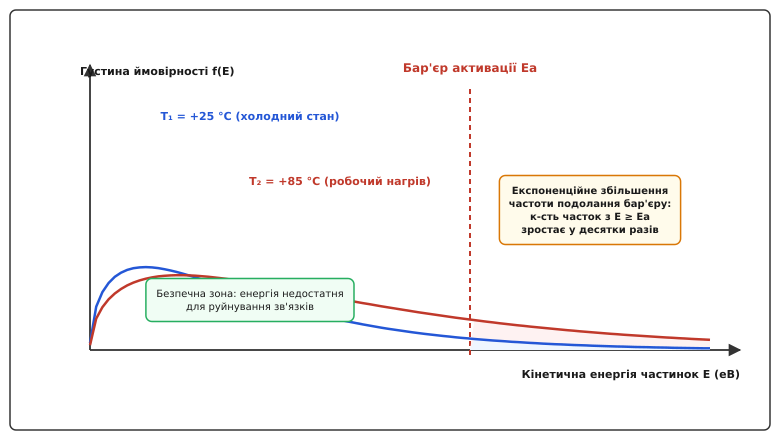
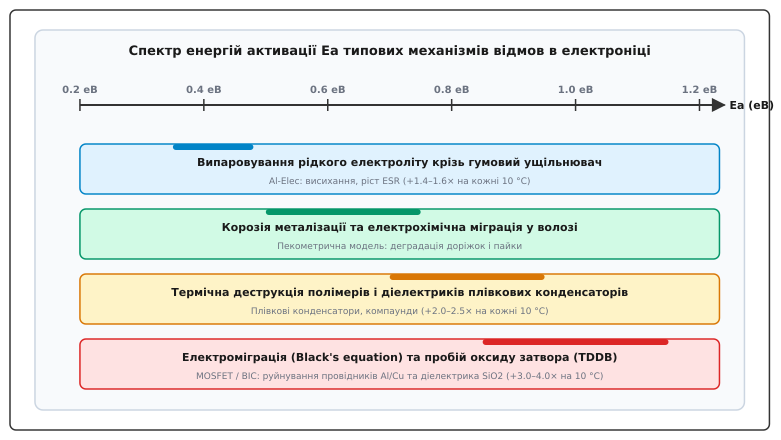
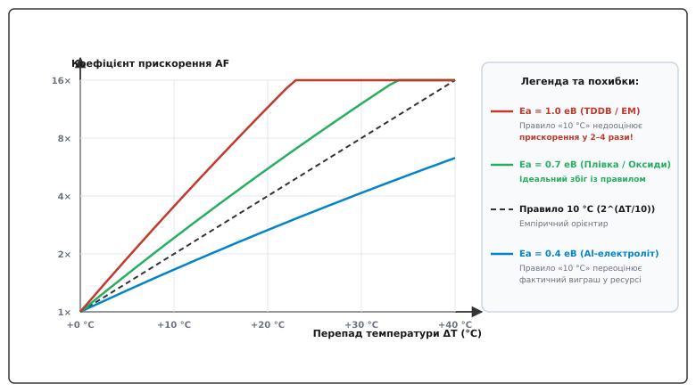
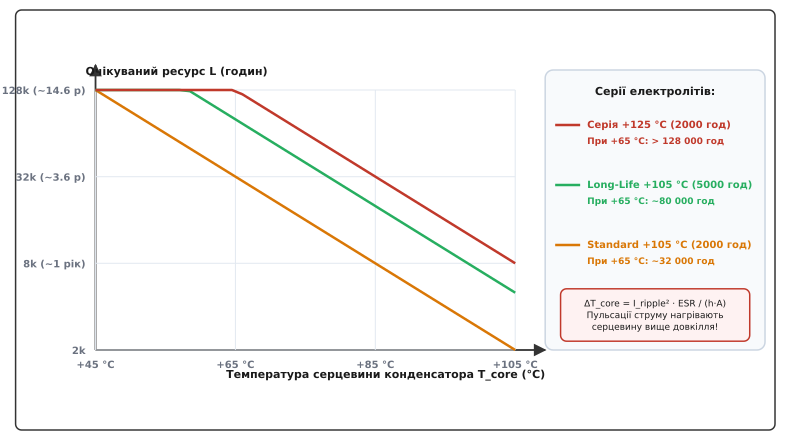
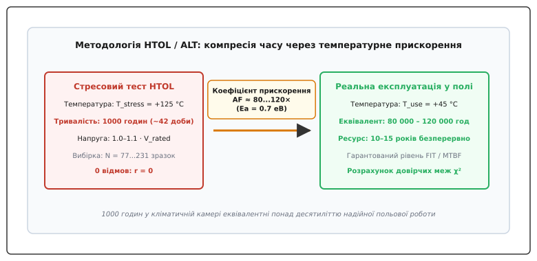

# Закон Арреніуса і ресурс компонентів

<preknowlist>
- [Граничні режими](topic:electronics/abs-max-ratings) — таблиці Absolute Maximum Ratings та межі електричного руйнування.
- [Графіки даташита](topic:electronics/datasheet-graphs) — аналіз температурних залежностей, робочих областей та кривих дератингу.
- [Електролітичний конденсатор](topic:electronics/electrolytic-cap) — конструкція, деградація рідкого електроліту та нагрів пульсаціями струму.
- [Дератинг](topic:electronics/derating) — систематичне зниження електричних і теплових навантажень для підвищення надійності.
- [Радіатор](topic:electronics/heatsink) — відведення теплової енергії та розрахунок перепаду температур у тепловому ланцюжку.
- [Тепловий ланцюжок: θJC, θCS, θSA](topic:electronics/thermal-chain) — динаміка передачі тепла від напівпровідникового кристала до довкілля.
- [Анатомія умов тесту в даташиті](topic:electronics/test-conditions-anatomy) — інтерпретація паспортних умов випробувань та кваліфікації.
</preknowlist>

У телекомунікаційній базовій станції, змонтованій у герметичній металевій шафі на даху будівлі, імпульсне джерело живлення потужністю 500 Вт бездоганно відпрацювало зиму та весну за внутрішньої температури шафи близько +20 °C. Проте під час другого літнього сезону, коли пряме сонячне випромінювання нагріло повітря всередині шафи до +65 °C, джерела живлення почали масово виходити з ладу через 14–16 місяців сумарної експлуатації. Аналіз аварійних блоків виявив ідентичну картину: пульсації вихідної напруги 12 В зросли з початкових 30 мВ до катастрофічних 1.8 В, що спричиняло циклічне перезавантаження контролерів. Алюмінієві електролітичні конденсатори у вихідному фільтрі повністю висохли — їхній еквівалентний послідовний опір `ESR` зріс від початкових 25 мОм до понад 3.5 Ом, а польові транзистори синхронного випрямляча вийшли з ладу через пробій оксиду затвора.

При цьому під час вихідного заводського контролю та всіх лабораторних тестів кожен електричний параметр схеми — струми, робочі напруги, потужність транзисторів — перебував строго в межах гарантованих паспортом значень. Жоден компонент не зазнав миттєвого електричного перевантаження чи перевищення лімітів Absolute Maximum Ratings. Схема загинула не від аварійного удару, а від невидимого, невпинного процесу поступового зносу матеріалів, швидкість якого за високої температури зросла у десятки разів.

Здатність схеми зберігати працездатність протягом місяців і років визначається не миттєвими запасами міцності, а термодинамічною кінетикою деградаційних процесів. Фізичний зв'язок між робочою температурою матеріалу та швидкістю його незворотного старіння встановлює фундаментальний фізико-хімічний закон — **закон Арреніуса** (англ. *Arrhenius law*, названий на честь шведського фізико-хіміка Сванте Арреніуса, швед. *Svante Arrhenius*, лауреата Нобелівської премії 1903 року).

> 🔧 **Навіщо це.** Всі електронні компоненти неперервно деградують з моменту першого увімкнення живлення: рідини випаровуються, метали дифундують під дією струму, полімери втрачають еластичність, а в діелектриках накопичуються дефекти. Закон Арреніуса перетворює абстрактну довговічність на точний інженерний розрахунок. Він дозволяє передбачити гарантійний термін виробу, розрахувати інтервали регламентного сервісного обслуговування, спроєктувати адекватне охолодження і провести швидку заводську кваліфікацію надійності партії за лічені тижні замість років очікування.

## Термодинамічна модель швидкості реакцій Арреніуса

Чому нагрів викликає не просто плавне пропорційне погіршення параметрів, а раптове обвальне скорочення ресурсу деталі? Відповідь полягає у квантово-статистичній природі теплового руху частинок твердого тіла та рідини.

У будь-якому матеріалі — будь то кристал кремнію, оксидний діелектрик, мідна доріжка чи рідкий розчинник електроліту — атоми та молекули перебувають у стані хаотичних теплових коливань. Атоми зв'язані між собою потенційними ямами хімічних та міжатомних зв'язків. Щоб відбулася елементарна подія деградації (наприклад, атом міді вискочив зі свого вузла кристалічної ґратки під дією імпульсу електронів струму, молекула розчинника подолала опір полімерного ланцюжка гумової пробки, або електрон вибив атом кисню з оксиду кремнію), частинка повинна накопичити кінетичну енергію, яка перевищує певний енергетичний поріг — **енергію активації** `E_a` (англ. *activation energy*, від латинського *activus* — дієвий).

Згідно з розподілом Максвелла-Больцмана, середня енергія теплового руху молекул дорівнює величині порядка `k_B · T` (де `k_B` — стала Больцмана, яка при кімнатній температурі +25 °C становить усього `0.0257 еВ`). Проте енергетичний бар'єр більшості хімічних реакцій руйнування `E_a` лежить у межах `0.4 ... 1.2 еВ`, що у 15–45 разів перевищує середню теплову енергію.

Частка молекул або атомів `P(E ≥ E_a)`, яка внаслідок випадкових теплових флуктуацій одночасно накопичує кінетичну енергію, достатню для подолання бар'єру деградації, визначається експоненційним хвостом розподілу Больцмана:

```
k = A · exp( −E_a / (k_B · T) )
```

У цій фундаментальній формулі Арреніуса:
- `k` — питома швидкість протікання деградаційного фізико-хімічного процесу (наприклад, швидкість дифузії атомів, швидкість випаровування розчинника крізь пори або темп нагромадження пасток у діелектрику);
- `E_a` — енергія активації процесу руйнування, що вимірюється в електронвольтах (`еВ`) на одну частинку або в джоулях на моль (`Дж/моль`, де `1 еВ/частку = 96.485 кДж/моль`);
- `k_B` — стала Больцмана (`k_B = 8.617333 × 10⁻⁵ еВ/К = 1.380649 × 10⁻²³ Дж/К`);
- `T` — абсолютна термодинамічна температура матеріалу в Кельвінах (`T = t[°C] + 273.15`);
- `A` — передекспоненційний частотний множник (англ. *frequency factor* або *pre-exponential factor*), що дорівнює добутку власної частоти коливань атомів у ґратці (порядку `10¹²...10¹³ Гц`) на ентропійний фактор геометричної ймовірності реакції.


*Розподіл кінетичної енергії частинок за двох температур. Підвищення температури зміщує розподіл праворуч і дещо сплющує його, внаслідок чого площа під кривою праворуч від енергетичного бар'єру Ea зростає у десятки й сотні разів.*

Оскільки абсолютна температура `T` стоїть у знаменнику від'ємного показника експоненти, навіть незначне збільшення температури викликає стрімке нелінійне зростання кількості частинок у високоенергетичному хвості. Саме тому кінетика старіння матеріалів розвивається не лінійно, а експоненційно.

Оскільки залишковий ресурс компонента `L` (англ. *lifetime*) обернено пропорційний швидкості руйнівного процесу (`L ∝ 1 / k`), час життя компонента за робочої температури `T` виражається оберненою експонентою:

```
L(T) = L_0 · exp( E_a / (k_B · T) )
```

де `L_0` — базова константа ресурсу для цього типу конструкції.

## Енергія активації типових механізмів відмов в електроніці

Електронний модуль не старіє як однорідне тіло. У кожному класі компонентів діє власний домінуючий фізичний механізм руйнування зі своїм значенням енергії активації `E_a`. Розуміння величини `E_a` для кожного вузла дозволяє інженеру безпомилково визначити «найслабшу ланку» всієї системи.


*Спектр енергій активації Ea для домінуючих механізмів руйнування в електронних компонентах: від випаровування рідин до електроміграції та пробою підзатворних оксидів.*

### 1. Випаровування рідкого електроліту в алюмінієвих конденсаторах (0.35–0.50 еВ)
Алюмінієвий електролітичний конденсатор містить рідкий розчин солей у розчиннику (етиленгліколь або гамма-бутиролактон), просочений у пористий паперовий сепаратор. Корпус герметизується гумовою пробкою. Під дією температури молекули розчинника повільно дифундують крізь пори полімерного ущільнювача в навколишній простір.

З втратою електроліту зменшується площа контакту з мікропорами анодної оксидної плівки, що призводить до падіння ємності `C` та лавиноподібного зростання еквівалентного послідовного опору `ESR`. Енергія активації дифузії молекул крізь каучук становить `E_a = 0.35 ... 0.48 еВ` (типово `0.40 еВ`). Це найнижчий бар'єр активації серед усіх електронних компонентів, через що оксидно-електролітичні конденсатори є головною причиною відмов силової електроніки за тривалої експлуатації.

### 2. Корозія металізації та електрохімічна міграція у волозі (0.50–0.75 еВ)
Якщо модуль працює в умовах підвищеної вологості за наявності іонних забруднень (наприклад, залишки некоректно відмитого флюсу, солі), під дією електричного поля між сусідніми доріжками плати виникає електрохімічна реакція. Іони металу анода розчиняються у плівці вологи, мігрують до катода і кристалізуються у вигляді мікроскопічних ниток — дендритів, що призводить до коротких замикань або обривів тонких провідників. Енергія активації цього процесу становить `E_a = 0.50 ... 0.75 еВ`.

### 3. Теплова деструкція діелектриків і полімерів (0.70–0.95 еВ)
Плівкові конденсатори на основі металізованого поліпропілену (PP) чи поліестеру (PET), епоксидні компаунди корпусів мікросхем та ізоляція обмотувальних дротів моточних виробів зазнають постійного окиснення та розриву полімерних ланцюгів під впливом кисню та тепла. Це викликає мікротріщини, погіршення діелектричної міцності та зниження опору ізоляції. Енергія активації термодеструкції лежить у межах `E_a = 0.70 ... 0.95 еВ`.

### 4. Електроміграція у металізації інтегральних схем (0.80–1.20 еВ)
У тонких провідниках напівпровідникових кристалів (металізація на основі Al або Cu) густина струму сягає екстремальних величин (`> 10⁵...10⁶ А/см²`). Потік електронів стикається з іонами кристалічної ґратки металу («електронний вітер»), вибиваючи їх та зміщуючи в напрямку струму.

Процес електроміграції складається з двох послідовних фаз:
1. **Інкубаційна фаза (зародження порожнин):** Атоми металу мігрують уздовж меж зерен полікристалу, накопичуючи механічні напруження розтягу біля катода та стиску біля анода.
2. **Фаза росту дефекту:** Коли напруження перевищує критичний поріг, утворюється мікропорожнина, площа поперечного перерізу провідника зменшується, локальна густина струму зростає, що викликає катастрофічний локальний перегрів і повний обрив лінії.

Швидкість зносу описується рівнянням Блека (англ. *Black's equation*), а енергія активації дифузії атомів алюмінію по межах зерен становить `E_a = 0.80 ... 0.85 еВ`, тоді як для міді з бар'єрними шарами TaN — `E_a = 0.90 ... 1.10 еВ`.

### 5. Пробій підзатворного діелектрика TDDB (0.60–1.10 еВ)
У польових транзисторах (MOSFET) та інтегральних схемах ультратонкий оксидний шар затвора товщиною від 1.5 до 50 нм зазнає напруженості електричного поля `5...10 МВ/см`. З часом електрони, що тунелюють крізь діелектрик, створюють у його товщі кисневі вакансії та пастки заряду (англ. *Time-Dependent Dielectric Breakdown*, `TDDB`).

Для опису кінетики накопичення дефектів застосовують три фізичні моделі:
- **E-модель (термохімічна модель):** Поле послаблює хімічні зв'язки `Si-O`, а тепловий рух розриває їх (`E_a ≈ 0.6 ... 0.9 еВ`).
- **1/E модель (модель ударної іонізації):** Електрони тунелюють за механізмом Фаулера-Нордгейма, іонізуючи атоми та створюючи діркові пастки (`E_a ≈ 0.8 ... 1.1 еВ`).
- **Степенева модель (Power-Law Model):** Застосовується для сучасних нанометрових діелектриків High-k на основі `HfO2`.

Коли щільність дефектів досягає критичного перколяційного порога, формується наскрізний струмопровідний місток і затвор миттєво пробивається.

### 6. Утворення інтерметалідів та деградація паяних з'єднань (0.80–1.15 еВ)
На контакті між мідними майданчиками плати та припоєм (Sn-Pb або SAC305) під час роботи протікає взаємна дифузія атомів з утворенням крихких сполук `Cu6Sn5` та `Cu3Sn`. Оскільки мідь дифундує в олово значно швидше, ніж олово в мідь (ефект Кіркендалла), на межі розділу формуються мікропорожнини, які під дією вібрацій або термоциклів перетворюються на втомні тріщини. Енергія активації росту інтерметалідів становить `E_a = 0.80 ... 1.15 еВ`.

> 🔌 Систематичний порівняльний аналіз фізичних процесів, енергій активації, моделей деградації та числових коефіцієнтів для всіх типів пасивних і напівпровідникових компонентів наведено у [порівнянні механізмів відмов та енергій активації](topic:electronics/arrhenius-lifetime/comp-failure-mechanisms-ea.md).

## Класичне інженерне «правило 10 градусів»: математика, межі та пастки

В інженерній практиці для швидких наближених оцінок широко застосовують емпіричне **правило 10 градусів** (англ. *10-degree rule* або *Arrhenius factor of two*), яке стверджує: **зниження робочої температури компонента на кожні 10 °C подвоює його ресурс, а підвищення на кожні 10 °C — скорочує ресурс удвічі**.

```
AF_10 = 2^( (T_stress − T_use) / 10 ) = 2^( ΔT / 10 )
```

Звідки береться степінь двійки і чому саме 10 градусів? Для цього знайдемо коефіцієнт прискорення з точного рівняння Арреніуса при зростанні температури від `T_use` до `T_stress = T_use + 10 К`:

```
AF_T = exp[ (E_a / k_B) · ( 1 / T_use − 1 / (T_use + 10) ) ] = exp[ (E_a / k_B) · ( 10 / (T_use · (T_use + 10)) ) ]
```

Прирівняємо цей точний коефіцієнт прискорення до двійки:

```
exp[ (E_a / k_B) · ( 10 / (T_use · (T_use + 10)) ) ] = 2

(E_a / k_B) · ( 10 / (T_use · (T_use + 10)) ) = ln(2) ≈ 0.69315

E_a = ln(2) · k_B · ( T_use · (T_use + 10) ) / 10
```

Підставивши значення сталої Больцмана `k_B = 8.617333 × 10⁻⁵ еВ/К` для типової робочої температури промислових приладів `t_use = +55 °C` (`T_use = 328.15 К`), отримаємо:

```
E_a = 0.69315 × (8.617333 × 10⁻⁵ / 10) × 328.15 × 338.15 ≈ 0.663 еВ
```


*Залежність коефіцієнта прискорення від нагріву. Правило 10 градусів ідеально збігається з моделлю Арреніуса лише при Ea ≈ 0.7 еВ. Для кремнієвих оксидів (Ea = 1.0 еВ) правило критично занижує небезпеку нагріву, а для рідких електролітів (Ea = 0.4 еВ) — переоцінює виграш від охолодження.*

### Межі застосовності та небезпечні похибки спрощеного правила

Правило «10 градусів» не є універсальним законом природи — це математична апроксимація, яка строго справедлива лише для процесів з енергією активації близько `E_a ≈ 0.65 ... 0.70 еВ` за температур біля +50...+60 °C.

Якщо інженер сліпо застосовує правило 10 градусів до процесів з іншою фізикою, виникають грубі розрахункові помилки:

1. **Помилка для напівпровідникового кристала (TDDB, електроміграція, `E_a ≈ 1.0 ... 1.1 еВ`):**
   Припустимо, температура кристала MOSFET зросла від +25 °C до +75 °C (`ΔT = 50 К`).
   - За правилом 10 градусів: прискорення деградації становить `2⁵ = 32 рази`.
   - За точним рівнянням Арреніуса (`E_a = 1.0 еВ`):
     ```
     AF_T = exp[ (1.0 / 8.617e-5) · ( 1/298.15 − 1/348.15 ) ] ≈ exp( 5.592 ) ≈ 268 разів!
     ```
   *Наслідок:* спрощене правило недооцінило швидкість руйнування кремнієвої структури у 8.4 раза. Схема, яка за правилом мала пропрацювати 5 років, згорить уже через 7 місяців.

2. **Помилка для електролітичних конденсаторів (`E_a ≈ 0.4 еВ`):**
   При зниженні температури конденсатора від +85 °C до +45 °C (`ΔT = 40 К`):
   - За правилом 10 градусів: очікується подовження ресурсу в `2⁴ = 16 разів`.
   - За точним рівнянням Арреніуса (`E_a = 0.4 еВ`):
     ```
     AF_T = exp[ (0.4 / 8.617e-5) · ( 1/318.15 − 1/358.15 ) ] ≈ 6.5 раза.
     ```
   *Наслідок:* реальний виграш у надійності виявляється у 2.5 раза меншим за очікуваний. Тим не менш, провідні виробники електролітичних конденсаторів (Nichicon, Nippon Chemi-Con) традиційно використовують модифіковане правило степеня двійки у своїх каталогах, вводячи консервативні поправочні коефіцієнти для напруги та пульсацій.

> 🧮 Повний математичний вивід формул Арреніуса, аналітичний розрахунок похибок апроксимацій та мультифакторні моделі наведено у [математичному виведенні моделі Арреніуса, коефіцієнтів прискорення та меж правила 10 градусів](topic:electronics/arrhenius-lifetime/math-arrhenius-derivation.md).

## Розрахункові моделі ресурсу конденсаторів

Конденсатори різних типів мають принципово відмінні фізичні структури, тому для кожного класу розроблено спеціалізовані інженерні моделі прогнозування ресурсу.


*Сімейство кривих розрахункового ресурсу електролітичних конденсаторів різних температурних серій (+105 °C стандартна, +105 °C Long-Life, +125 °C високотемпературна) залежно від сумарної температури серцевини.*

### 1. Алюмінієві електролітичні конденсатори: базова та повна моделі
Базовий паспортний ресурс електролітичного конденсатора `L_0` вказується виробником для граничної робочої температури `T_max` (зазвичай 2000, 5000 або 10 000 годин при +105 °C) за максимального номінального струму пульсацій `I_rated`.

Реальний очікуваний термін служби `L` розраховується за розширеною формулою:

```
L = L_0 · 2^( (T_max − T_core) / 10 ) · ( V_rated / V_actual )^n
```

де `T_core` — фактична температура внутрішньої серцевини конденсатора:

```
T_core = T_ambient + ΔT_core
```

Внутрішній перегрів серцевини `ΔT_core` виникає через протікання змінного струму пульсацій `I_ripple` крізь активний внутрішній опір `ESR` (джоулеві втрати `P_loss = I_ripple² · ESR`):

```
ΔT_core = ΔT_max_ripple · ( I_ripple_actual / I_ripple_rated )²
```

де `ΔT_max_ripple` — допустимий перегрів від номінального струму пульсацій (за стандартом японських виробників `ΔT_max_ripple = 5 °C` для серій 105 °C та `10 °C` для серій 85 °C).

**Вплив напруги (дератинг):** Для сучасних електролітичних конденсаторів зниження робочої напруги `V_actual` нижче номінальної `V_rated` зменшує напруженість поля в оксидному шарі алюмінію, сповільнюючи процеси електролізу та струм витоку. Показник степеня `n` зазвичай приймають `n = 1` для напруг від 0.6 до 1.0 від номіналу (або `(V_rated / V_actual)^0.5` за методикою EPCOS/TDK).

### Гібридні полімерні конденсатори
У гібридних конденсаторах рідкий електроліт скомбіновано з твердим провідним полімером (PEDOT:PSS). Опір `ESR` знижується в 5–10 разів, що кардинально зменшує джоулів нагрів. Оскільки твердий полімер захищає оксидний шар, енергія активації зростає до `E_a ≈ 0.8 ... 1.0 еВ`. Для них виробники (Panasonic, Nippon Chemi-Con) застосовують **правило 20 градусів** (`L = L_0 · 2^((T_max - T)/20)` або `L = L_0 · 10^((T_max - T)/20)` залежно від серії), що забезпечує колосальний ресурс понад 100 000 годин за робочих температур +65...+75 °C.

### 2. Плівкові конденсатори
У плівкових конденсаторах (металізований поліпропілен PP або поліестер PET) руйнування діелектрика відбувається шляхом локальних мікропробоїв із подальшим самовідновленням (випаровуванням тонкого шару металізації навколо точки пробою). Часті акти самовідновлення поступово зменшують ефективну ємність деталі та збільшують втрати.

Модель напрацювання до відмови для плівкових конденсаторів комбінує закон Арреніуса зі сильною степеневою залежністю від напруги:

```
L = L_0 · 2^( (T_max − T_ambient) / 8 ) · ( V_rated / V_actual )^m
```

де показник степеня за напругою `m` є дуже високим (`m = 5 ... 8`). Це означає, що зниження робочої напруги всього на 20 % (`V_actual = 0.8 · V_rated`) подовжує ресурс плівкового конденсатора у `(1 / 0.8)⁶ ≈ 3.8 раза` навіть за незмінної температури.

### 3. Керамічні конденсатори MLCC: модель Прокоповича-Васкаса
У багатошарових керамічних конденсаторах (MLCC) на основі сегнетоелектричної кераміки титанату барію (BaTiO3) головним механізмом деградації є міграція кисневих вакансій під дією сильного електричного поля з подальшим зростанням струмів витоку та тепловим пробоєм.

Для розрахунку коефіцієнта прискорення використовують класичне рівняння Прокоповича-Васкаса (1969 р.):

```
AF_total = ( V_stress / V_use )^n · exp[ (E_a / k_B) · ( 1 / T_use − 1 / T_stress ) ]
```

де для кераміки класу X7R/X8R показник напругового прискорення становить `n = 2.5 ... 4.5`, а енергія активації міграції кисневих вакансій `E_a ≈ 1.1 ... 1.4 еВ`. Завдяки високій енергії активації керамічні конденсатори є надзвичайно чутливими до нагріву вище +100 °C.

## Методологія прискорених випробувань (ALT, HALT, HTOL)

Сучасні комерційні та автомобільні системи повинні гарантовано працювати 10, 15 або 20 років без відмов. Очевидно, що розробник не може тестувати партію компонентів протягом 15 років перед запуском виробу у серійне виробництво.

Для вирішення цього протиріччя застосовують методологію **прискорених ресурсних випробувань** (англ. *Accelerated Life Testing*, `ALT`), зокрема високотемпературні випробування під електричним навантаженням (англ. *High Temperature Operating Life*, `HTOL`, за стандартами JEDEC JESD22-A108 та AEC-Q100).


*Принцип компресії часу в тесті HTOL: за рахунок підвищення температури до +125 °C та напруги 1000 годин лабораторного тесту еквівалентні 10–15 рокам надійної роботи в полі.*

### Розрахунок коефіцієнта прискорення AF

Якщо виріб у реальних умовах працює за температури `T_use = +45 °C` (318.15 К), а в кліматичній камері тестується за стресової температури `T_stress = +125 °C` (398.15 К), коефіцієнт теплового прискорення Арреніуса для типового кремнієвого процесу (`E_a = 0.7 еВ`) складе:

```
1 / T_use − 1 / T_stress = 1 / 318.15 − 1 / 398.15 = 0.00314317 − 0.00251162 = 6.3155 × 10⁻⁴ К⁻¹

AF_T = exp[ (0.7 / 8.617333 × 10⁻⁵) · 6.3155 × 10⁻⁴ ] = exp( 8123.16 × 6.3155 × 10⁻⁴ ) = exp( 5.130 ) ≈ 169.0
```

Це означає, що **1 година роботи в кліматичній камері при +125 °C еквівалентна 169 годинам роботи приладу за нормальної температури +45 °C**.

Стандартний кваліфікаційний тест HTOL тривалістю `t_stress = 1000 годин` (близько 42 діб) забезпечує еквівалентне польове напрацювання:

```
t_equivalent = 1000 × 169.0 = 169 000 годин ≈ 19.3 року безперервної роботи!
```

### Статистична оцінка показників FIT та MTBF

Під час кваліфікаційного тесту випробовують вибірку з `N` деталей (типово `N = 77` штук на кожну з трьох технологічних партій, сумарно 231 штука). Якщо за 1000 годин тесту не зафіксовано жодної відмови (`r = 0`), сумарний еквівалентний час напрацювання вибірки становить:

```
T_total = N · t_stress · AF_T = 231 × 1000 × 169.0 ≈ 39 039 000 приладо-годин
```

Для визначення верхньої довірчої межі інтенсивності відмов `λ` (у FIT, де `1 FIT = 1 відмова на 10⁹ годин`) із довірчою ймовірністю 60 % використовують квантиль розподілу хі-квадрат `χ²(2, 0.40) ≈ 1.833`:

```
λ_60% = ( 1.833 / ( 2 · T_total ) ) × 10⁹ = ( 1.833 / ( 2 × 39.039 × 10⁶ ) ) × 10⁹ ≈ 23.5 FIT
```

Середній час напрацювання між відмовами (англ. *Mean Time Between Failures*, `MTBF`):

```
MTBF = 10⁹ / λ_60% = 10⁹ / 23.5 ≈ 42 550 000 годин (~4850 років на одну деталь)
```

> ⚙️ Практичний програмний інструмент на C та C++ для автоматизованого розрахунку коефіцієнтів AF, ресурсу конденсаторів та обробки результатів HTOL наведено у [калькуляторі надійності та ресурсних моделей](topic:electronics/arrhenius-lifetime/proj-lifetime-calculator.md).

## Дератинг та керування тепловим режимом як основа високонадійного проєктування

Закон Арреніуса наочно демонструє: **температура є головним руйнівником електроніки**. Будь-які схемотехнічні та конструктивні рішення, спрямовані на зниження тепловиділення та покращення тепловідведення, приносять експоненційний виграш у надійності.

### Модель послідовної надійності та ефект «вузького місця»
Сучасний електронний пристрій складається з сотень або тисяч компонентів. З точки зору надійності більшість із них утворюють послідовний логічний ланцюг: вихід з ладу будь-якого одного блокувального конденсатора, діода чи контролера призводить до повної відмови всього виробу.

Сумарна інтенсивність відмов системи `λ_system` дорівнює сумі інтенсивностей відмов усіх її компонентів:

```
λ_system = ∑[i=1..N] λ_i(T_i)
```

Якщо в схемі є хоча б один локально перегрітий компонент (наприклад, електролітичний конденсатор, розташований впритул до гарячого радіатора силового транзистора, де повітря нагрівається до +90 °C замість середніх по платі +45 °C), його інтенсивність відмов `λ_k` підскакує у 20–50 разів. Цей єдиний перегрітий компонент починає генерувати понад 90 % усіх відмов пристрою, повністю нівелюючи високу надійність решти схеми.

### Наскрізний приклад: аналіз надійності силового DC-DC перетворювача 48 В → 12 В (600 Вт)

Розглянемо реальний приклад розрахунку надійності для промислового синхронного понижувального перетворювача з вихідним струмом 50 А:

1. **Початковий варіант конструкції (недостатнє охолодження):**
   - Температура всередині шафи: `T_ambient = +65 °C`;
   - Польові транзистори MOSFET (4 шт): розсіюють по 6 Вт, тепловідведення крізь плату з `θ_JA = 25 °C/W`. Температура кристала `T_J = 65 + 6 × 25 = +215 °C` (перевищення Absolute Maximum +175 °C — негайна теплова аварія!);
   - Навіть при обмеженні струму до `T_J = +145 °C` інтенсивність відмов кожного MOSFET (`E_a = 0.85 еВ`) складає `λ_FET ≈ 450 FIT`;
   - Вихідні електролітичні конденсатори (4 шт по 470 мкФ, серія 105 °C / 2000 год): струм пульсацій 18 А RMS ділиться по 4.5 А на деталь (номінал 3.0 А). Перегрів серцевини `ΔT_core = 5 · (4.5/3.0)² = +11.25 °C`. Температура серцевини `T_core = 65 + 11.25 = +76.25 °C`.
   - Ресурс конденсаторів: `L = 2000 · 2^( (105 − 76.25)/10 ) ≈ 2000 · 7.34 ≈ 14 680 годин (~1.67 року)`.
   - Сумарний `MTBF` перетворювача: `MTBF_system ≈ 6800 годин (< 10 місяців роботи 24/7)`.

2. **Оптимізований варіант конструкції (інженерний дератинг та термоменеджмент):**
   - Встановлено алюмінієвий радіатор на силові MOSFET та додано масив перехідних отворів (thermal vias) у мідні шари 2 oz (70 мкм), що знизило `θ_JA` до `6 °C/W`. Температура кристала впала до `T_J = +85 °C`;
   - Інтенсивність відмов одного MOSFET впала з 450 FIT до `8 FIT` (виграш у 56 разів!);
   - Конденсатори замінено на 6 штук серії 105 °C Long-Life (5000 год) із допустимим струмом 3.5 А, рознесених на відстань 25 мм від гарячого дроселя. Температура повітря біля них впала до +45 °C, струм на деталь знизився до 3.0 А (`ΔT_core = 5 · (3.0/3.5)² = +3.67 °C`, `T_core = +48.67 °C`);
   - Ресурс конденсаторів зріс до: `L = 5000 · 2^( (105 − 48.67)/10 ) ≈ 5000 · 49.6 ≈ 248 000 годин` (обмежено конструктивною стелею **15 років**);
   - Сумарний `MTBF` перетворювача зріс до `MTBF_system > 1 200 000 годин (> 135 років)`.

Зниження робочої температури критичних вузлів усього на 25–35 °C за рахунок грамотного теплового проектування та дератингу перетворило ненадійний блок із ресурсом у 10 місяців на безвідмовне промислове джерело з гарантованим 15-річним терміном служби.

### Практичні правила надійного термопроєктування

1. **Топологічне просторове розв'язування:**
   - Електролітичні конденсатори повинні розміщуватися на максимальній фізичній відстані від силових транзисторів, випрямних діодів, моточних вузлів та демпферних резисторів.
   - Заборонено встановлювати конденсатори в зоні висхідного гарячого повітряного потоку над радіаторами.

2. **Зниження струмових пульсацій у конденсаторах:**
   - Розподіл сумарної ємності між кількома паралельними конденсаторами знижує струм через кожну деталь (`I_k = I_total / N`), а внутрішнє виділення тепла падає квадратично (`P_loss ∝ 1 / N²`).
   - Паралельне встановлення керамічних конденсаторів MLCC поруч із електролітами перехоплює високочастотну складову струму комутації, захищаючи електролітичний конденсатор від високочастотного розігріву.

3. **Оптимізація теплових ланцюжків (Thermal Management):**
   - Використання масивів теплопровідних отворів (thermal vias) під силовими безвивідними корпусами (QFN, D2PAK, PowerStage) для прямого скидання тепла у суцільні внутрішні мідні шари живлення та землі (GND plane).
   - Збільшення площі та товщини міді силових полігонів (2 oz / 70 мкм замість стандартного 1 oz / 35 мкм), що знижує горизонтальний тепловий опір плати у 2 рази.

4. **Електричний дератинг (Derating):**
   - Експлуатація компонентів при електричній напрузі не більше 60–75 % від паспортного номіналу сповільнює деградацію діелектриків за моделлю Прокоповича-Васкаса у 3–8 разів.
   - Обмеження максимального струму через транзистори знижує як нагрів кристала, так і швидкість електроміграції за рівнянням Блека.

Закон Арреніуса підтверджує головну аксіому інженерії надійності: **висока надійність не купується дорогими компонентами — вона закладається правильним тепловим і електричним розрахунком схеми на етапі проєктування**.
