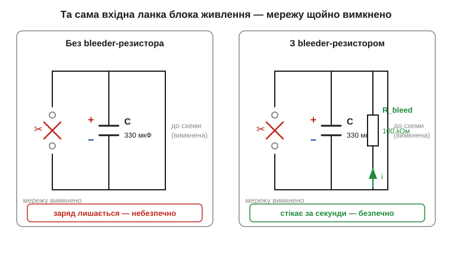
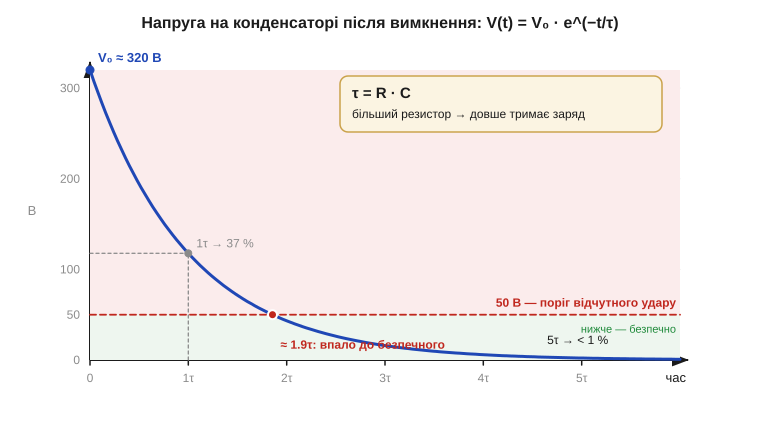

# 🔌 Чому блок живлення «кусається» після вимкнення: розряд конденсаторів і bleeder-резистор

Великий [вхідний конденсатор-накопичувач](book:electronics/capacitor-uses) тримає живлення на плаву й віддає короткі імпульси струму. У цієї корисної властивості є зворотний бік: запас енергії нікуди не дівається тієї миті, коли пристрій вимкнули з розетки, і саме він б'є струмом того, хто поліз усередину. Інженерна відповідь — крихітна, але обов'язкова деталь: **bleeder-резистор** (*bleeder resistor*, «стікач»).

### Клас компонента: «стікач» поруч із накопичувачем

Bleeder — це звичайний резистор, але з особливою службовою роллю: він стоїть **паралельно великому конденсатору** в колі живлення й існує тільки заради одного — повільно стікати запасений заряд, коли пристрій знеструмлено. Поки мережа є, він майже непомітний (трохи гріється й трохи споживає струм); щойно мережу вимкнено — він стає єдиним шляхом, яким заряд може піти.

Щоб відчути, чому без нього не обійтися, оцінімо сам запас енергії. Вхідний конденсатор фільтра в блоці живлення — це десятки чи сотні мікрофарад, заряджені до сотень вольтів (у мережевих блоках після випрямляча — близько 320 В постійної напруги). Енергію цього запасу рахуємо за [формулою енергії конденсатора](book:electronics/capacitor-energy):

```
W = ½ · C · V²
C = 330 мкФ = 330×10⁻⁶ Ф
V = 320 В
W = 0.5 · 330×10⁻⁶ · 320²
  = 0.5 · 330×10⁻⁶ · 102400
  ≈ 16.9 Дж
```

Майже 17 джоулів, що сидять у банці завбільшки з наперсток. Вимкнули з розетки — а конденсатор лишився зарядженим на 320 В, бо віддавати заряд **нікуди**: вхід обірваний вилкою, вихід вимкнений. Пальці, що торкнуться виводів за хвилину після вимкнення, замикають коло самі собою — звідси той самий «укус».


*Рис. Та сама вхідна ланка, два варіанти. Ліворуч bleeder немає: мережу вимкнено, але заряд +Q/−Q на конденсаторі тримається, бо стікати нікуди — небезпечно. Праворуч паралельно конденсатору стоїть R_bleed: після вимкнення заряд тихо стікає крізь нього (струм i), і за секунди напруга падає до безпечної.*

### Як це працює: знайома експонента розряду

Bleeder перетворює заряджений конденсатор на просте [**RC-коло розряду**](book:electronics/rc-time-constant). Щойно мережу вимкнено, конденсатор бачить лише цей резистор і розряджається на нього за тією самою експоненційною кривою:

```
V(t) = V₀ · e^(−t / τ)      τ = R · C
```

Уся інженерія bleeder — це вибір сталої часу **τ = R·C**. Її тягнуть у два боки. Замалий резистор розрядить швидко, але гріється й марно витрачає енергію весь час, поки пристрій працює ([розсіювана потужність](book:physics/electric-power) P = V²/R). Завеликий резистор економний, та розряджає так повільно, що захист стає примарним. Орієнтир для мережевих блоків закладено й нормами безпеки: напруга має впасти до безпечного рівня **за одну–кілька секунд** після від'єднання.


*Рис. Розряд від 320 В крізь bleeder. За одну τ напруга падає до 37 %, за ≈ 1.9·τ перетинає поріг 50 В (вище нього удар відчутний), за 5·τ від заряду лишається менше 1 %. Більший резистор зсуває всю криву вправо — заряд тримається довше.*

**Приклад (підбір bleeder).** Хочемо, щоб 330 мкФ після вимкнення впали з 320 В нижче 50 В приблизно за 1 секунду:

```
поріг:  V(t)/V₀ = 50/320 ≈ 0.156
з V = V₀·e^(−t/τ):  t/τ = ln(320/50) ≈ 1.86
треба t ≈ 1 с  →  τ ≈ 1 / 1.86 ≈ 0.54 с
R = τ / C = 0.54 / 330×10⁻⁶ ≈ 1.6 кОм
```

Перевіримо ціну такого захисту під час роботи:

```
P = V² / R = 320² / 1600 ≈ 64 Вт   (!)
```

64 ват, що гріються постійно, — неприйнятно. Тому в реальних блоках bleeder ставлять значно більшим (десятки–сотні кОм, частки вата), а швидкий розряд за секунду забезпечує не він, а спеціальна **розрядна схема X-конденсаторів**, яку вмикає мікросхема контролера в момент зникнення мережі. Bleeder лишається тихим страхувальником на той випадок, якщо активна схема не спрацювала.

> 🔧 **Навіщо це.** Без bleeder великий конденсатор у відремонтованому чи саморобному блоці живлення — це заряджений «капкан», що тримає сотні вольтів довго після вимкнення з розетки. Bleeder — дешева гарантія, що за кілька секунд пристрій стане безпечним для рук і для вимірювального щупа.

### «Перший байт»: як підійти до зарядженого конденсатора

Перш ніж торкатися силової частини будь-якого блока живлення:

- **Не вір вимкнутій вилці.** Виміряй напругу на великому конденсаторі мультиметром — і **між** виводами, і відносно корпуса.
- **Чекай.** Якщо bleeder є, дай йому 5·τ (зазвичай кілька секунд–десяток); напруга має сама впасти до одиниць вольтів.
- **Розряджай через резистор, а не закороткою.** Пряме замикання викруткою дає іскру, виплеск і може пошкодити конденсатор; правильно — розрядний резистор на 1–2 кОм/кілька ват на 1–2 секунди, потім контроль мультиметром.

### Типові граблі

Навіть знаючи процедуру, легко наступити на одні й ті самі граблі — ось найчастіші:

- **«Я ж вимкнув з розетки».** Найчастіша й найнебезпечніша помилка: вхід обірваний, а заряд на місці.
- **Bleeder згорів або не впаяний** у саморобці — захисту нема, хоча схема «як у заводській».
- **Розряд закороткою** замість резистора — іскра, пошкоджений конденсатор, інколи приварений вивід.
- **Високовольтні плати без розрядного кола взагалі** (фотоспалахи, підсилювачі, старі ЕПТ-монітори) тримають небезпечний заряд **днями**. Тут bleeder і ручний розряд критичні.

### Варіації

Чи скрізь потрібен bleeder — залежить від того, скільки енергії може зібратися в колі. У низьковольтній логіці (3.3 / 5 В) він майже не потрібен: запасені частки джоуля на одиницях вольтів не б'ються, і конденсатори розрядяться самі крізь навантаження. Окремий «стікач» з'являється там, де є **висока напруга й великий конденсатор разом**: мережевий вхід блоків живлення, ланки з X/Y-конденсаторами, інверторні та звукові підсилювачі, кола фотоспалаху. Чим вища напруга й більша ємність — тим обов'язковіший bleeder і тим уважніший має бути ручний розряд перед роботою.
