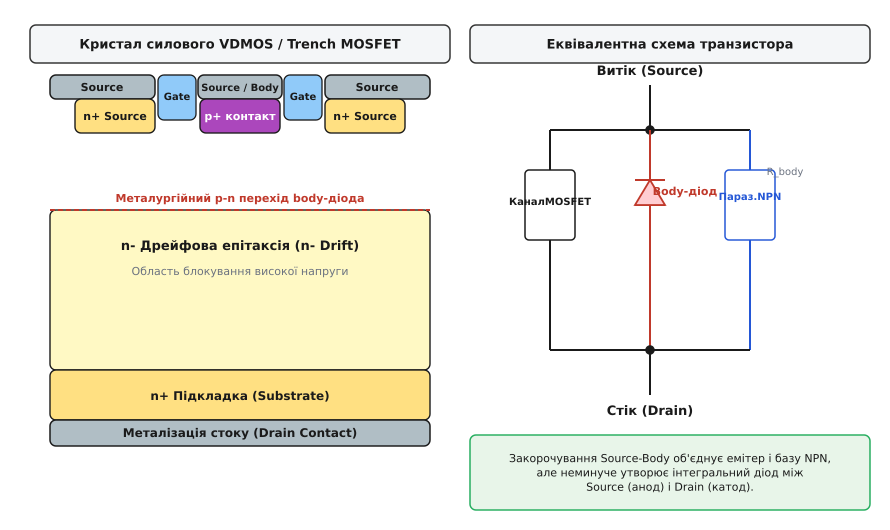
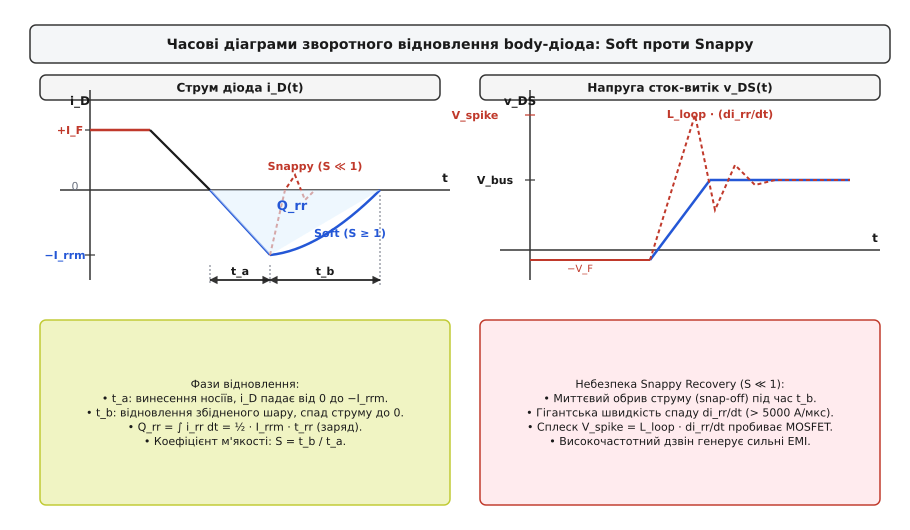
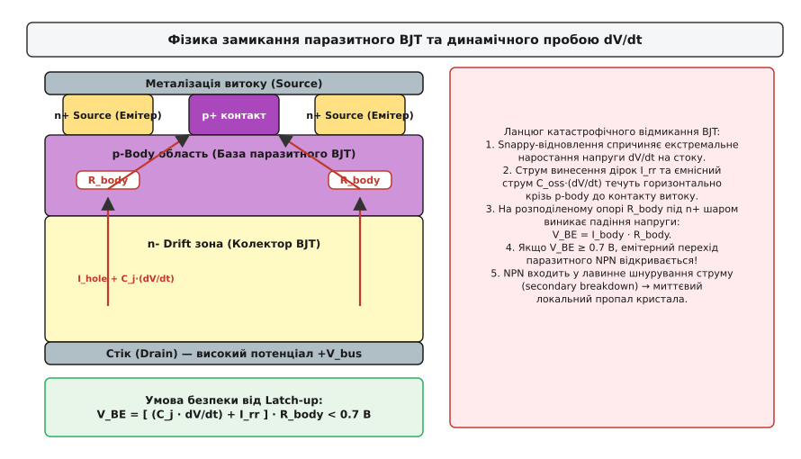
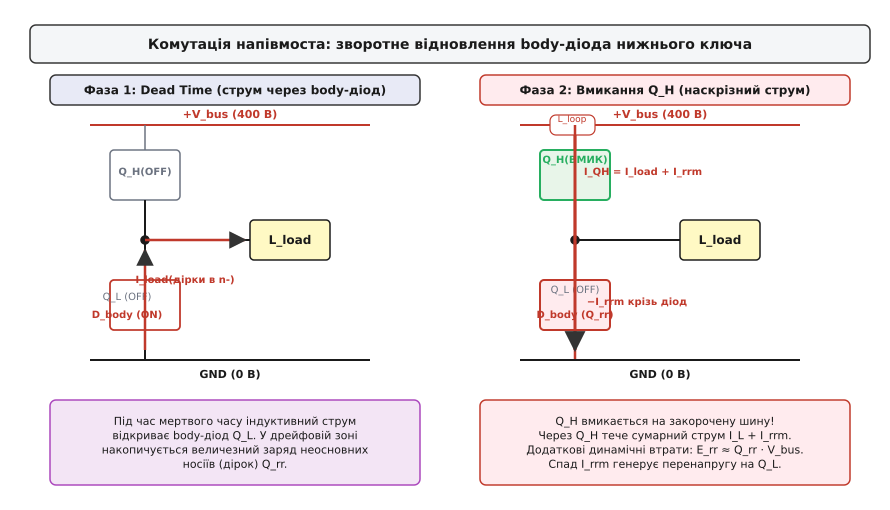

# Body-діод MOSFET і зворотне відновлення

<preknowlist>
- [PN-перехід](book:physics/pn-junction) — контакт напівпровідників p- та n-типу, збіднена область та накопичення неосновних носіїв.
- [Зворотне відновлення діода](book:electronics/reverse-recovery) — перехідний процес винесення надлишкового заряду при зміні полярності напруги.
- [MOSFET-структура](book:electronics/mosfet-structure) — будова польового транзистора, шари p-body, n-drift, витік та стік.
- [Лавинний пробій MOSFET](book:electronics/mosfet-avalanche) — режим ударної іонізації та обмеження перенапруги на ключі.
</preknowlist>

У мостовому перетворювачі напруги на 400 В при спробі підняти частоту комутації транзисторів зі 100 кГц до 200 кГц силова стійка раптово руйнується під час роботи на холостому ходу або при легкому навантаженні. Осцилограф фіксує гігантські кіловольтові викиди напруги на стоку нижнього ключа тривалістю кілька наносекунд та миттєвий кидок струму крізь верхній транзистор, що втричі перевищує номінальний робочий струм навантаження. Тепловізори показують точковий перегрів напівпровідникового кристала, а на корпусі з'являються характерні тріщини від внутрішнього вибуху кремнію.

Причина цієї аварії лежить не в помилках алгоритму цифрового керування затворами й не в статичному тепловому перевантаженні відкритого каналу. Вона криється у фізиці внутрішнього паразитного p-n переходу — вбудованого діода (body-діода, від англ. *body diode* — діод підкладки), нерозривно інтегрованого в напівпровідникову структуру кожного кремнієвого силового польового транзистора. Поки через індуктивне навантаження тече струм під час так званого мертвого часу (паузи між вимиканням одного ключа стійки та вмиканням іншого), цей діод змушений проводити струм у прямому напрямку.

У момент, коли протилежний транзистор відкривається і прикладає до діода повну напругу шини живлення, виникає процес зворотного відновлення (від англ. *reverse recovery*). Замість миттєвого замикання діод на десятки й сотні наносекунд перетворюється на низькоомний провідник, пропускаючи зворотний ударний струм розсмоктування накопичених носіїв. Якщо спад цього струму відбувається надто різко, паразитна індуктивність монтажу генерує колосальну перенапругу, яка відкриває прихований біполярний транзистор всередині структури MOSFET і викликає незворотний тепловий пробій.

### Анатомія кремнієвого кристала: неминучість паразитного переходу

Силовий польовий транзистор з ізольованим затвором (MOSFET, від англ. *Metal-Oxide-Semiconductor Field-Effect Transistor*) кардинально відрізняється від сигнальних планарних транзисторів своєю геометрією. Сигнальний транзистор розташовує всі три виводи — витік, затвор і стік — на одній горизонтальній поверхні кристала. Для комутації напруг у сотні вольт і струмів у десятки ампер планарна конструкція непридатна: струм розтікався б тонким приповерхневим шаром, створюючи неприпустимо високий опір відкритого каналу `R_ds(on)` та спричиняючи пробій уздовж поверхні.

Тому силові MOSFET виготовляють за вертикальною топологією: планарно-дифузійною (VDMOS, Vertical Diffused MOS) або канавковою (Trench MOS). У такій конструкції струм тече вертикально крізь усю товщу напівпровідникової пластини: контакт витоку (Source) розташований на верхній поверхні кристала, а контакт стоку (Drain) — на нижній.

```
       [ Металізація витоку (Source) ]
   ─────────────────┬─────────────────┬─────────────────
     n+ витік       │  p+ контакт     │     n+ витік
   ─────────────────┴─────────────────┴─────────────────
             p-Body (база паразитного BJT)
   ═════════════════════════════════════════════════════  ← p-n перехід (Body Diode)
             n- Дрейфова зона (n- Drift)
             (товстий слаболегований шар)
   ─────────────────────────────────────────────────────
             n+ Підкладка (Substrate)
   ─────────────────────────────────────────────────────
       [ Металізація стоку (Drain) ]
```

Основою вертикального N-канального MOSFET є сильнолегована кремнієва підкладка n+-типу, на якій методом епітаксійного нарощування вирощують шар n--кремнію з низькою концентрацією домішок — так звану дрейфову область (Drift region). Товщина і питомий опір цього шару визначають граничну напругу пробою транзистора: що вища робоча напруга, то товщою та слаболегованішою має бути дрейфова зона.

У верхню частину дрейфового шару шляхом селективної дифузії або іонної імплантації вводять акцепторні домішки (бор), формуючи кишені p-типу — область тіла (p-body). Всередині кожної p-body кишені створюють неглибокі сильнолеговані ділянки донорного n+-типу, які слугують витоками. Над поверхнею між витоком і дрейфовою зоною вирощують надтонкий діелектрик діоксиду кремнію (SiO₂), на якому розташовують полікремнієвий затвор (Gate).


*Поперечний розріз комірки вертикального MOSFET: внутрішнє закорочення Source-Body об'єднує емітер і базу паразитного біполярного транзистора NPN, утворюючи неминучий антипаралельний p-n перехід body-діода між витоком і стоком.*

У такій структурі неминуче виникає паразитна чотиришарова напівпровідникова послідовність n+-p-n--n+. Якщо залишити область p-body електрично ізольованою (плаваючою), виникають дві фатальні проблеми:

1. **Нестабільність порогової напруги**: потенціал плаваючої підкладки хаотично змінюється внаслідок ємнісних наведень від стоку під час комутації, змінюючи поріг відмикання каналу `V_th` через ефект підкладки (Body Effect).
2. **Паразитний біполярний транзистор**: шар n+ витоку утворює емітер, шар p-body — базу, а дрейфовий шар n- стоку — колектор паразитного n-p-n біполярного транзистора (BJT, від англ. *Bipolar Junction Transistor*). Будь-який струм витоку або швидке наростання напруги змістило б цей перехід у прямий напрямок, викликаючи лавинне самовідмикання біполярної структури й миттєвий пробій.

Щоб надійно заблокувати паразитний BJT, виробники з'єднують область p-body з n+ витоком накоротко прямо на поверхні кристала за допомогою суцільної алюмінієвої металізації витоку (Source-Body Short). Для створення омічного контакту низького опору під металізацією виконують глибоку високолеговану зону p+.

Це технологічне рішення надійно усуває статичне відмикання біполярного транзистора, але породжує фундаментальний побічний ефект: між металізацією витоку (з'єднаною з областю p-body) та металізацією стоку (з'єднаною з n-дрейфовою зоною) утворюється повноцінний діод на основі [PN-переходу](book:physics/pn-junction). Анодом цього діода є витік транзистора (p-body), а катодом — стік (n-drift).

Цей p-n перехід називають вбудованим діодом або body-діодом. Він включений зустрічно-паралельно (антипаралельно) щодо основного каналу польового транзистора. Коли на стоку присутній позитивний потенціал відносно витоку (`V_ds > 0`), body-діод зміщений у зворотному напрямку і не проводить струм. Проте коли потенціал стоку стає нижчим за потенціал витоку (`V_ds < 0`), діод відкривається у прямому напрямку.

### Фізика прямої провідності: затоплення бази неосновними носіями

У мостових імпульсних схемах (інверторах напруги, перетворювачах для приводів електродвигунів, синхронних понижувальних перетворювачах) транзистори працюють парами, утворюючи стійку напівмоста між позитивною шиною живлення `V_bus` та землею. 

Щоб уникнути катастрофічного наскрізного замикання шини живлення (коли обидва транзистори плеча відкриті одночасно), контролер керування формує паузу між закриванням одного транзистора та відкриванням іншого — мертвий час (Dead Time, зазвичай від 50 до 500 наносекунд).

```
   +V_bus ────────┬─────────────────────────────
                  │
                ┌─┴─┐  Q_High
                │   │  (Верхній MOSFET)
                └─┬─┘
                  ├─── Switch Node ───► До котушки L_load
                ┌─┴─┐
                │ ▲ │  Q_Low (D_body проводить під час Dead Time)
                └─┬─┘
                  │
   GND ───────────┴─────────────────────────────
```

Індуктивність навантаження `L_load` (обмотка двигуна або дросель фільтра) не може миттєво змінити струм, що крізь неї протікає. Коли верхній транзистор вимикається, ЕРС самоіндукції котушки підхоплює струм і тягне потенціал точки з'єднання (Switch Node) нижче нуля вольт. Щойно напруга падає до величини `-V_F` (близько `-0.8...-1.2 В`), відкривається body-діод нижнього транзистора, замикаючи коло струму котушки на себе (так званий струм вільного ходу або рекуперації).

На відміну від основного каналу MOSFET, у якому струм переносять виключно основні носії заряду (електрони в N-канальних приладах), body-діод є класичним біполярним напівпровідниковим приладом. Його пряма провідність базується на процесі інжекції (від лат. *injectio* — впорскування) неосновних носіїв заряду.

Коли діод відкритий:

1. Сильнолегована область p-body (анод) інтенсивно впорскує дірки (неосновні носії) крізь p-n перехід у слаболеговану n-дрейфову область.
2. Одночасно n-дрейфова зона інжектує електрони в p-body шар.
3. Оскільки n-дрейфова область має низьку концентрацію легування (для забезпечення високої напруги пробою) і значну товщину, впорскнуті дірки швидко накопичуються у великій кількості.
4. Для збереження локальної квазінейтральності напівпровідника з підкладки стоку в дрейфовий шар підтягуються додаткові електрони.

Утворюється щільна електронно-діркова плазма. Концентрація надлишкових носіїв у дрейфовій зоні зростає на кілька порядків, перевищуючи концентрацію фонового легування кремнію. Це явище називають модуляцією провідності (від лат. *modulatio* — розміреність): питомий опір товстого дрейфового шару падає у сотні разів, забезпечуючи низьке пряме падіння напруги `V_F` навіть при струмах у десятки ампер.

Проте за цю низьку напругу прямої провідності платять накопиченим зарядом. Сумарна кількість надлишкових дірок, зосереджених у дрейфовій області під час протікання прямого струму `I_F`, становить заряд зворотного відновлення `Q_rr` (від англ. *Reverse Recovery Charge*):

```
Q_rr ≈ I_F · τ                       [зв'язок накопиченого заряду з часом життя носіїв]
```

Тут `τ` — час життя неосновних носіїв заряду в напівпровіднику (середній час до рекомбінації дірки з електроном). У чистому монокристалічному кремнії кремнієвих MOSFET час життя носіїв є великим і сягає від 1 до 10 мікросекунд.

Критичним фактором є температурна залежність. З підвищенням температури кристала `T_j` теплові коливання кристалічної ґратки сповільнюють процеси рекомбінації Шоклі-Ріда-Холла (SRH, Shockley-Read-Hall recombination), тому час життя `τ` зростає приблизно пропорційно `T^1.5...T^2.0`. 

При нагріванні MOSFET від кімнатної температури (+25 °C) до робочої температури кристала (+125...+150 °C) заряд `Q_rr` зростає у 2.5–4 рази. Це означає, що перетворювач, який стабільно працює під час коротких лабораторних тестів, може вибухнути після прогріву під реальним навантаженням.

### Динаміка зворотного відновлення: фази розсмоктування та бар'єру

Коли мертвий час завершується, драйвер затвора подає позитивну напругу на верхній транзистор `Q_High`, вмикаючи його. До закритого Switch Node прикладена повна напруга шини живлення `V_bus` (наприклад, 400 В), яка прагне миттєво закрити нижній body-діод, приклавши до нього зустрічну зворотну напругу.

Але діод **не здатний закритися миттєво**. Його дрейфова зона переповнена електронно-дірковою плазмою. Поки ці носії не будуть виведені або рекомбіновані, напівпровідник залишається провідником із нульовим електричним опором. Body-діод продовжує проводити струм, але тепер уже у зворотний бік — від стоку до витоку.


*Осцилограми перехідного процесу зворотного відновлення body-діода: фаза розсмоктування t_a формує піковий струм −I_rrm, а фаза t_b визначає коефіцієнт м'якості S. Жорсткий спад струму Snappy генерує небезпечний сплеск перенапруги L_loop · di/dt.*

Процес зворотного відновлення ділиться на дві послідовні фази:

#### Фаза 1: Розсмоктування надлишкового заряду (`t_a`)

Верхній транзистор відкривається зі швидкістю, визначеною опором затворного резистора `R_g_on` та індуктивністю контуру. Прямий струм діода починає лінійно спадати зі швидкістю `-di/dt` (зазвичай від 200 до 2000 А/мкс).

Струм перетинає нульову лінію і змінює знак на від'ємний. Зворотний струм виносить дірки з дрейфової зони у напрямку витоку (анода), а електрони — у напрямку стоку (катода). Протягом усього інтервалу `t_a` концентрація носіїв у глибині бази залишається високою, тому падіння напруги на діоді лишається близьким до нуля (діод поводиться як чисте коротке замикання).

Струм наростає у зворотному напрямку доти, доки концентрація дірок безпосередньо біля металургійного p-n переходу не впаде до рівноважного нуля. Момент, коли біля переходу вичерпуються вільні носії, відповідає піку зворотного струму `-I_rrm` (Peak Reverse Recovery Current). Заряд, винесений за цей інтервал, позначають `Q_a`.

#### Фаза 2: Відновлення збідненого шару та спад струму (`t_b`)

Щойно концентрація носіїв біля p-n переходу досягає нуля, починає формуватися збіднена область просторового заряду (SCR, Space Charge Region). Опір переходу стрімко зростає від нуля до мегаомів.

Напруга на стоку транзистора `v_DS` починає стрімко наростати від 0 до напруги шини `V_bus`. Збіднений шар розширюється вглиб n-дрейфової зони, вимітаючи електричним полем залишки плазми. Зворотний струм починає спадати від пікового значення `-I_rrm` назад до нуля зі швидкістю `di_rr/dt = di_b/dt`. Заряд, винесений на цьому етапі, позначають `Q_b`.

Повний час відновлення `t_rr` та повний заряд `Q_rr` визначаються сумами:

```
t_rr = t_a + t_b                     [повний час зворотного відновлення]
Q_rr = Q_a + Q_b                     [повний заряд зворотного відновлення]
```

Детальні математичні виведення співвідношень між `Q_rr`, піковим струмом `I_rrm`, часовими інтервалами `t_a`, `t_b` та енергетичними інтегралами наведено у [детальному математичному розрахунку динаміки відновлення](book:electronics/body-diode-reverse-recovery/math-recovery-dynamics.md).

### Жорстке відновлення (Snappy Recovery) та індуктивний удар

Форма спаду струму у фазі `t_b` має вирішальне значення для фізичної надійності перетворювача. Для характеристики цієї форми використовують коефіцієнт м'якості (Softness Factor) `S`:

```
S = t_b / t_a                        [коефіцієнт м'якості відновлення]
```

Залежно від величини `S` розрізняють два типи поведінки діода:

1. **М'яке відновлення (Soft Recovery, `S ≥ 1.0`)**: залишковий заряд у глибині дрейфового шару розсмоктується плавно. Струм повертається до нуля поступово, без різких перегинів похідної.
2. **Жорстке відновлення (Snappy Recovery або Snap-off, `S ≪ 1.0`, зазвичай `S = 0.1...0.3`)**: збіднена область під дією високої напруги стрімко пролітає дрейфовий шар і вдаряється об високолеговану підкладку n+. Усі залишки плазми миттєво зникають, і зворотний струм обривається практично миттєво — за 1–3 наносекунди.

Цей раптовий обрив струму (Snap-off) становить смертельну небезпеку для силової електроніки. У будь-якому реальному фізичному контурі існують паразитні індуктивності: індуктивність виводів транзистора, внутрішніх зварних дротиків кристала, доріжок друкованої плати та блокувальних конденсаторів. Сумарну індуктивність цього замкненого контуру позначають `L_loop` (зазвичай від 10 до 50 нГн).

Коли струм силою в десятки ампер обривається зі швидкістю `di_rr/dt > 5000...10000 А/мкс`, на індуктивності контуру виникає колосальна електрорушійна сила самоіндукції:

```
V_spike = L_loop · (di_rr/dt)        [індуктивна перенапруга самоіндукції]
```

Ця індуктивна перенапруга додається до напруги шини живлення:

```
V_ds_max = V_bus + V_spike           [пікова напруга на стоку MOSFET]
```

**Розрахунок небезпеки індуктивного удару:**
Нехай шина живлення має напругу `V_bus = 400 В`, індуктивність контуру становить скромні `L_loop = 20 нГн`, а швидкість обриву струму сягає `di_rr/dt = 8000 А/мкс` (`8·10⁹ А/с`):

```
V_spike = 20·10⁻⁹ Гн · 8·10⁹ А/с = 160 В
V_ds_max = 400 В + 160 В = 560 В
```

Якщо в схемі використано транзистори на 500 В або 600 В, такий сплеск перенапруги миттєво пробиває діелектрик або вводить кристал у некерований [лавинний пробій](book:electronics/mosfet-avalanche).

Крім того, паразитна індуктивність `L_loop` та вихідна ємність транзистора `C_oss` утворюють високоефективний високочастотний коливальний контур. Різкий обрив струму збуджує в ньому незатухаючий дзвін (Ringing) на частотах 50–200 МГц з амплітудою в сотні вольт. Цей дзвін створює потужні електромагнітні завади (EMI, Electromagnetic Interference), які наводяться на кола керування затворами, спричиняючи помилкові спрацьовування логіки та збої мікроконтролерів.

### Катастрофічний механізм Latch-up: відмикання паразитного BJT

Найбільш руйнівним наслідком зворотного відновлення body-діода є явище замикання (Latch-up, від англ. *latch* — засувка, фіксація у відкритому стані) внутрішнього паразитного біполярного транзистора.

Розглянемо фізичну структуру комірки MOSFET під час фази `t_b`. У цей момент на стоку транзистора діє екстремальна швидкість наростання напруги `dV/dt` (від 10 до 100 В/нс), викликана як роботою верхнього ключа, так і індуктивним сплеском `V_spike`.


*Механізм руйнування dV/dt Latch-up: струм винесення дірок та ємнісний струм зміщення протікають горизонтально крізь опір R_body під n+ витоком. Падіння напруги понад 0.7 В відкриває паразитний біполярний транзистор NPN, викликаючи шнурування струму та пропікання кристала.*

Крізь ємність p-n переходу тече струм заряду вихідної ємності `i_cap = C_j · (dV/dt)`. Одночасно крізь дрейфову зону рухається потік дірок, що вимітаються електричним полем.

Весь цей струм (сума струму зміщення та струму дірок `I_hole`) прямує з глибини дрейфового шару до верхнього контакту витоку. Але контактний шар p+ розташований по центру комірки, тоді як шар n+ витоку перекриває частину p-body області зверху.

Тому струм змушений протікати **горизонтально** крізь тонкий шар p-body безпосередньо під сильнолегованим n+ емітером витоку. Цей тонкий шар напівпровідника має скінченний розподілений опір, який називають опором тіла `R_body` (Body Sheet Resistance, зазвичай від кількох десятих до кількох ом на комірку).

Протікаючи крізь `R_body`, струм створює омічне падіння напруги між базою та емітером паразитного n-p-n транзистора:

```
V_BE = I_hole · R_body               [падіння напруги на переході база-емітер BJT]
```

Якщо це падіння напруги досягає величини контактної різниці потенціалів кремнієвого p-n переходу:

```
V_BE ≥ 0.7 В                         [критична умова відмикання паразитного біполярного транзистора]
```

відбувається катастрофа:

1. Емітерний перехід n+-p відмикається у прямому напрямку.
2. Область n+ витоку починає масивно інжектувати електрони в p-body область (базу BJT).
3. Ці електрони підхоплюються сильним електричним полем збідненого шару дрейфової зони й розганяються до швидкостей насичення (понад 10⁷ см/с).
4. У сильному електричному полі біля стоку електрони викликають ударну іонізацію атомів кремнію, народжуючи нові електронно-діркові пари (лавинне множення).
5. Новоутворені дірки знову течуть назад у p-body, збільшуючи струм крізь `R_body` і ще сильніше відкриваючи перехід база-емітер.

Виникає лавиноподібний позитивний зворотний зв'язок: паразитна біполярна структура переходить у режим вторинного пробою (Secondary Breakdown). Транзистор повністю втрачає керованість затвором: подача замикаючої напруги `V_gs = 0 В` або навіть `-5 В` на затвор не здатна зупинити цей струм, оскільки він протікає в обхід каналу крізь біполярну структуру.

Оскільки густина струму в напівпровіднику має локальні неоднорідності, струм стягується в один надвузький мікроскопічний шнур (явище філаментації струму, від лат. *filamentum* — нитка). Густина струму в шнурі сягає мільйонів ампер на квадратний сантиметр. Температура в цій точці за частки мікросекунди перевищує температуру плавлення кремнію (1414 °C), випаровуючи алюмінієву металізацію та проплавляючи наскрізний отвір у кристалі.

### Комутаційні втрати у напівмості та синхронному випрямлячі

Навіть якщо швидкість спаду струму контролюється і транзистор захищений від руйнівного latch-up, зворотне відновлення body-діода є головним джерелом динамічних втрат енергії у високовольтних перетворювачах.

Розглянемо, як розподіляються втрати енергії в напівмості під час відмикання верхнього ключа `Q_High` при відновленні нижнього body-діода:


*Динаміка комутації півмоста: відмикання верхнього ключа змушує його проводити сумарний струм навантаження I_load та зворотний піковий струм I_rrm нижнього діода при повній напрузі шини V_bus, генеруючи величезні втрати E_rr.*

1. **Ударний струм крізь верхній транзистор**:
   Під час фази `t_a` верхній транзистор `Q_High` відкривається, але нижній діод ще проводить. Тому крізь верхній ключ протікає сумарний струм:
   ```
   I_Q_High(t) = I_load + I_rr(t)     [миттєвий струм відкритого верхнього транзистора]
   ```
   У піку цей струм сягає величини `I_peak = I_load + I_rrm`. При цьому на верхньому ключі присутня майже повна напруга живлення `V_bus` (вона спадає лише мірою виходу з насичення).

2. **Додаткова енергія втрат увімкнення верхнього ключа**:
   Енергія, що марно виділяється у верхньому транзисторі виключно через необхідність прокачувати зворотний заряд нижнього діода, становить:
   ```
   E_rr_Q_High ≈ V_bus · Q_rr        [додаткові втрати увімкнення верхнього ключа]
   ```

3. **Енергія втрат у нижньому діоді**:
   У фазі `t_b`, коли напруга на нижньому ключі наростає від 0 до `V_bus`, крізь нього продовжує текти спадний струм діода. Інтеграл добутку напруги на струм дає енергію, що розсіюється безпосередньо в кристалі нижнього транзистора:
   ```
   E_rec_diode ≈ ⅓ · V_bus · Q_b     [втрати вимкнення в самому body-діоді]
   ```

Сумарна потужність динамічних втрат, зумовлена виключно зворотним відновленням body-діода на частоті комутації `f_sw`, становить:

```
P_rr ≈ V_bus · Q_rr · f_sw           [середня потужність комутаційних втрат відновлення]
```

**Порівняльний числовий розрахунок теплових втрат:**

Нехай силова стійка працює від шини `V_bus = 400 В` на частоті `f_sw = 100 кГц`.

* **Випадок А (Стандартний кремнієвий Superjunction MOSFET)**:
  Параметри діода: `Q_rr = 1500 нКл`, `t_rr = 350 нс`.
  ```
  P_rr = 400 В · 1500·10⁻⁹ Кл · 100·10³ Гц = 60 Вт
  ```
  Шістдесят ват тепла виділяються на рівному місці лише через зворотний заряд діода — без урахування статичних втрат на опір `R_ds(on)` та ємнісних втрат перезаряду `C_oss`. Такий перетворювач вимагає масивних радіаторів із примусовим обдувом і має вкрай низький ККД.

* **Випадок Б (Транзистор зі швидким діодом Fast Recovery MOSFET)**:
  Параметри діода: `Q_rr = 180 нКл`, `t_rr = 50 нс`.
  ```
  P_rr = 400 В · 180·10⁻⁹ Кл · 100·10³ Гц = 7.2 Вт
  ```
  Втрати зменшуються у 8.3 раза, що дозволяє зменшити розмір радіатора у кілька разів або підняти частоту перетворення.

### Інженерні стратегії мінімізації та захисту

Для подолання фізичних обмежень кремнієвого body-діода в сучасній силовій електроніці використовують чотири фундаментальні підходи: схемотехнічний, конструктивний, технологічний та перехід на нові напівпровідникові матеріали.

#### 1. Оптимізація мертвого часу та синхронне випрямлення

Оскільки MOSFET є симетричним польовим приладом, його відкритий канал проводить струм у **будь-якому напрямку** (як від стоку до витоку, так і від витоку до стоку), якщо на затвор подано відмикаючу напругу `V_gs > V_th`.

Якщо відкрити канал транзистора під час протікання зворотного струму навантаження, струм розподілиться між каналом та body-діодом. Падіння напруги на відкритому каналі становить:

```
V_ch = I_load · R_ds(on)             [падіння напруги на відкритому каналі]
```

Якщо `R_ds(on) = 20 мОм`, а струм становить `I_load = 10 А`, падіння напруги складає всього `V_ch = 0.2 В`. Оскільки пряме падіння напруги для відмикання кремнієвого p-n переходу має перевищувати `0.7...0.8 В`, body-діод **фізично не відкривається**.

У результаті інжекція неосновних носіїв у дрейфову зону не відбувається взагалі, і заряд `Q_rr` не накопичується.

```
       ┌───────────────────────────────┐
       │   Канал MOSFET відкритий      │ → V_ds ≈ 0.1...0.3 В < 0.7 В
       │  (Синхронне випрямлення ON)   │ → Body-діод закритий, Q_rr ≈ 0
       └───────────────────────────────┘
                      ▲
                      │  Критична пауза Dead Time (50...100 нс)
                      ▼
       ┌───────────────────────────────┐
       │   Канал MOSFET закритий       │ → V_ds стрибає до -0.9 В
       │  (Тільки Body-діод проводить) │ → Інжекція дірок, Q_rr накопичується!
       └───────────────────────────────┘
```

Проте під час мертвого часу канал закритий, і струм все одно тече крізь діод. Тому головне інженерне правило синхронного випрямлення — **мінімізація мертвого часу** (адаптивний мертвий час, Adaptive Dead Time Control). Сучасні інтегральні драйвери відстежують момент спаду напруги на напівмості й вмикають канал із затримкою всього у 10–20 нс, скорочуючи фазу діодної провідності до мінімуму.

Іншим потужним схемотехнічним методом є м'яка комутація при нульовій напрузі (ZVS, Zero Voltage Switching) у резонансних перетворювачах (LLC, фазозсувний міст PSFB). У таких схемах індуктивність контуру перезаряджає ємності `C_oss` транзисторів до моменту відмикання затвора, тому body-діод відновлюється плавно при нульовій напрузі шини, усуваючи як втрати `E_rr`, так і небезпеку snappy-перенапруг.

#### 2. Зовнішній діод Шотткі та схема обходу

Найпростіша інтуїтивна ідея інженера-початківця — встановити паралельно транзистору швидкий зовнішній [діод Шотткі](book:electronics/diode-types) (Schottky Barrier Diode), який не накопичує неосновних носіїв (`Q_rr ≈ 0`).

Проте просте паралельне підключення діода Шотткі до виводів MOSFET на друкованій платі **не працює**:

```
        Drain
          │
      ┌───┴───────────────┐
      │   MOSFET          │   L_pkg_D (паразитна індуктивність виводу стоку)
      │ ┌───┐   ┌───┐     │
      │ │   │   │ ▲ │ D_body
      │ └───┘   └───┘     │   L_pkg_S (індуктивність виводу витоку)
      └───┬───────────────┘
          │
          ├───[ L_pcb_1 ]───►|───[ L_pcb_2 ]───┐  (Зовнішній Шотткі)
          │                D_Schottky          │
        Source ────────────────────────────────┘
```

Внутрішній body-діод кристала розташований безпосередньо всередині кремнію і має паразитну індуктивність виводів корпусу менше ніж 2–5 нГн. Зовнішній діод підключається через доріжки друкованої плати та власні виводи, додаючи 10–25 нГн індуктивності. 

Під час швидкого спаду напруги струм обирає шлях із мінімальним імпедансом `Z = R + jωL` і все одно протікає крізь повільний внутрішній body-діод.

Щоб повністю заблокувати внутрішній p-n перехід, застосовують комбіновану тридіодну схему обходу (Schottky Bypass Circuit):

```
                     Drain
                       │
                       ▼ D_block (послідовний діод Шотткі)
                       ├───┐
                     ┌─┴─┐ │
              MOSFET │   │ ▲ D_ext (зовнішній швидкий діод рекуперації)
                     └─┬─┘ │
                       ├───┘
                       │
                     Source
```

1. Послідовно з каналом MOSFET вмикають низьковольтний діод `D_block` (напругою 20–30 В), який запобігає протіканню зворотного струму крізь вбудований body-діод.
2. Паралельно цій послідовній парі встановлюють високовольтний надшвидкий діод рекуперації `D_ext` (діод Шотткі на карбіді кремнію SiC або ультрашвидкий кремнієвий діод).

Ця схема надійно усуває проблему `Q_rr`, але має суттєвий недолік: діод `D_block` створює додаткове пряме падіння напруги (0.4–0.6 В) під час прямої роботи каналу, значно збільшуючи статичні втрати провідності. Тому схему обходу застосовують лише там, де неможливо замінити транзистори на сучасніші типи.

#### 3. Транзистори зі швидким відновленням (Fast-Recovery MOSFET / FRFET)

Виробники силових напівпровідників вирішують проблему `Q_rr` на рівні фізики кристала, застосовуючи технології інженерії часу життя носіїв (Carrier Lifetime Engineering).

Для прискорення рекомбінації неосновних носіїв у дрейфову область вводять контрольовані дефекти кристалічної ґратки, які створюють глибокі енергетичні рівні посередині забороненої зони кремнію (пастки рекомбінації Шоклі-Ріда-Холла):

1. **Дифузія важких металів (Platinum/Gold Doping)**: перед фінальними високотемпературними операціями кристал легують атомами платини (Pt) або золота (Au). Атоми платини створюють енергетичний рівень `E_v + 0.32 еВ`, який слугує пасткою для дірок. Час життя носіїв скорочується з мікросекунд до десятків наносекунд.
2. **Електронне та протонне опромінення (Radiation Irradiation)**: готову пластину опромінюють потоком високоенергетичних електронів (енергією 1–10 МеВ) або протонів. Електрони вибивають атоми кремнію з вузлів ґратки, утворюючи пари Френкеля (вакансії та міжвузлові атоми). Протонне опромінення дозволяє локалізувати зону дефектів суворо на межі p-n переходу, не погіршуючи провідність решти кристала.

Транзистори, виготовлені за такими технологіями (наприклад, лінійки CoolMOS CFD від Infineon, HiPerFET від IXYS, SuperFET FRFET від onsemi), позначаються як **Fast Recovery MOSFET**:

* Заряд зворотного відновлення `Q_rr` зменшено у 5–10 разів;
* Час відновлення `t_rr` знижено з 400–600 нс до 40–80 нс;
* Коефіцієнт м'якості штучно оптимізовано до рівня `S ≥ 1.0` (виключено ефект snappy snap-off);
* Стійкість до швидкості наростання напруги `dV/dt` піднято до 50–100 В/нс, повністю усуваючи небезпеку latch-up.

#### 4. Порівняння з широкозонними напівпровідниками (GaN та SiC)

Радикальним кроком у подоланні проблеми зворотного відновлення є перехід від кремнію (Si) до широкозонних матеріалів (WBG, Wide Bandgap Semiconductors) — карбіду кремнію (SiC) та нітриду галію (GaN).

```
   ┌───────────────────────┬───────────────────────┬───────────────────────┐
   │ Кремній (Si Superj.)  │  Карбід кремнію (SiC) │   Нітрид галію (GaN)  │
   ├───────────────────────┼───────────────────────┼───────────────────────┤
   │ Вертикальний p-n діод │ Вертикальний p-n діод │   Планарний 2DEG      │
   │ Q_rr: 500...2000 нКл  │ Q_rr: 15...50 нКл     │   Q_rr = 0 (нуль!)    │
   │ Ризик Snappy: Високий │ Ризик Snappy: Немає   │   Ризик Snappy: Немає │
   │ Ризик Latch-up: Є     │ Ризик Latch-up: Немає │   Ризик Latch-up: Немає│
   └───────────────────────┴───────────────────────┴───────────────────────┘
```

##### Карбід кремнію (SiC MOSFET)
Кристал SiC має ширину забороненої зони 3.26 еВ (проти 1.12 еВ у кремнію) та критичну напругу електричного пробою в 10 разів вищу, ніж у кремнію. Це дозволяє зробити дрейфову зону в 10 разів тоншою при вдесятеро вищій концентрації легування для тієї самої напруги 650–1200 В.

Внутрішній p-n перехід у SiC MOSFET присутній, проте:
* Об'єм дрейфової зони мізерний, а час життя носіїв становить лише одиниці наносекунд.
* Заряд `Q_rr` у 10–30 разів менший, ніж у найкращих кремнієвих аналогів, і складається переважно з чистого ємнісного заряду зміщення `Q_oss`.
* Пряме падіння напруги на body-діоді SiC вище (`V_F ≈ 3.0...4.5 В` через більшу ширину забороненої зони), тому для SiC транзисторів особливо критично застосовувати синхронне випрямлення або паралельні SiC-діоди Шотткі.

##### Нітрид галію (GaN HEMT)
Транзистори на основі GaN з високою рухливістю електронів (HEMT, High Electron Mobility Transistor) мають біполярно-незалежну планарну гетероструктуру (AlGaN/GaN). Струм тече горизонтально крізь шар двовимірного електронного газу (2DEG, Two-Dimensional Electron Gas).

У GaN HEMT **фізично відсутній p-n перехід**! У структурі немає жодної кишені p-типу та немає неосновних носіїв заряду.

Коли напруга на стоку стає від'ємною відносно витоку, електричне поле затвора автоматично індукує провідність двовимірного каналу у зворотному напрямку (так звана квазі-діодна зворотна провідність зі спадом напруги `V_F ≈ 1.5...2.5 В`).

Фізичні наслідки для GaN транзисторів:
* Заряд зворотного відновлення строго дорівнює нулю: `Q_rr = 0 нКл`.
* Час зворотного відновлення дорівнює нулю: `t_rr = 0 нс`.
* Повністю відсутні динамічні втрати відновлення `E_rr` та індуктивний snappy-удар.
* Немає паразитного біполярного транзистора, що робить GaN повністю імунним до ефекту dV/dt Latch-up.

Присутній лише чисто ємнісний заряд перезаряду вихідної ємності `Q_oss`, що дозволяє піднімати частоту комутації GaN перетворювачів до 1–10 МГц із ККД понад 98–99%.

### Зведена таблиця характеристик технологій комутації

Нижче наведено порівняння параметрів комутації для транзисторів різних класів із робочою напругою 650 В та струмом 30 А за однакових умов випробувань (`T_j = 125 °C`, `di/dt = 1000 А/мкс`):

| Параметр | Стандартний Si MOSFET | Fast Recovery Si (FRFET) | SiC MOSFET | GaN HEMT |
| :--- | :--- | :--- | :--- | :--- |
| **Заряд відновлення `Q_rr`** | 1200–2500 нКл | 150–300 нКл | 20–60 нКл | **0 нКл (відсутній)** |
| **Час відновлення `t_rr`** | 300–600 нс | 40–90 нс | 15–30 нс | **0 нс** |
| **Піковий зворотний струм `I_rrm`** | 35–55 А | 8–15 А | 3–6 А | **0 А** |
| **Пряме падіння діода `V_F`** | 0.8–1.0 В | 0.9–1.2 В | 3.2–4.5 В | 1.8–2.8 В (самовідмикання) |
| **Коефіцієнт м'якості `S`** | 0.1–0.3 (Snappy!) | ≥ 1.0 (Soft) | Чисто ємнісний | Чисто ємнісний |
| **Небезпека dV/dt Latch-up** | Критично висока | Низька | Відсутня | **Фізично неможлива** |
| **Типова гранична частота** | 50–100 кГц | 150–300 кГц | 300–1000 кГц | **1000–5000 кГц** |

### Практичні правила проєктування друкованих плат

Навіть використання транзисторів із Fast Recovery діодами або SiC MOSFET не захистить схему, якщо топологія друкованої плати виконана без урахування паразитних параметрів високочастотного контуру.

> 🔧 **Навіщо це.** Щоб запобігти аварійному виходу ключів із ладу через відновлення body-діода, дотримуйтесь чотирьох правил трасування:
> 1. **Мінімізуйте площу силового контуру**: транзистори верхнього й нижнього плеча, а також керамічні блокувальні конденсатори високої напруги (MLCC) мають бути розташовані впритул один до одного. Зворотний провідник землі розташовують на внутрішньому шарі безпосередньо під силовою шиною, утворюючи екрануючу коаксіальну петлю з індуктивністю `L_loop < 5 нГн`.
> 2. **Використовуйте роздільне підключення витоку (Kelvin Source)**: струм керування драйвера затвора не повинен текти спільною доріжкою з силовим струмом витоку. Спеціальний додатковий вивід витоку Кельвіна (наявний у корпусах TO-247-4L, D2PAK-7L, DFN 8x8) виключає зворотний зв'язок по напрузі `L_source · (di/dt)`, запобігаючи помилковому відмиканню ключа під час комутації.
> 3. **Асиметричне керування затвором**: опір увімкнення `R_g_on` та опір вимкнення `R_g_off` розділяють за допомогою діода в колі затвора. Збільшення `R_g_on` сповільнює швидкість `di/dt` увімкнення верхнього ключа, пом'якшуючи відновлення нижнього діода, тоді як малий `R_g_off` гарантує надійне утримання транзистора в закритому стані проти ємнісного ефекту Міллера.
> 4. **RC-демпфери (снубери)**: паралельно стоку-витоку нижнього ключа встановлюють компактний послідовний RC-ланцюжок (наприклад, 10–22 Ом + 100–470 пФ). Снубер поглинає енергію високочастотного резонансного дзвону `L_loop - C_oss`, обмежуючи амплітуду `V_spike` і придушуючи радіозавади.

Внутрішній body-діод силового MOSFET є не спеціально створеним компонентом, а невіддільним супутником вертикальної кремнієвої технології. Розуміння фізики накопичення електронно-діркової плазми у дрейфовій зоні, механізмів виникнення індуктивного snappy-удару та умов блокування паразитного біполярного транзистора дозволяє інженеру обирати правильні режими комутації, точно розраховувати системи охолодження та будувати високоефективні й безвідмовні силові перетворювачі.
