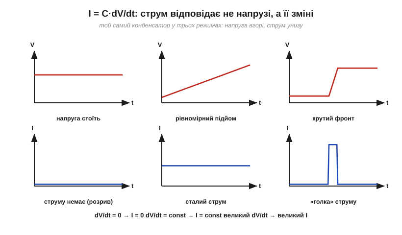
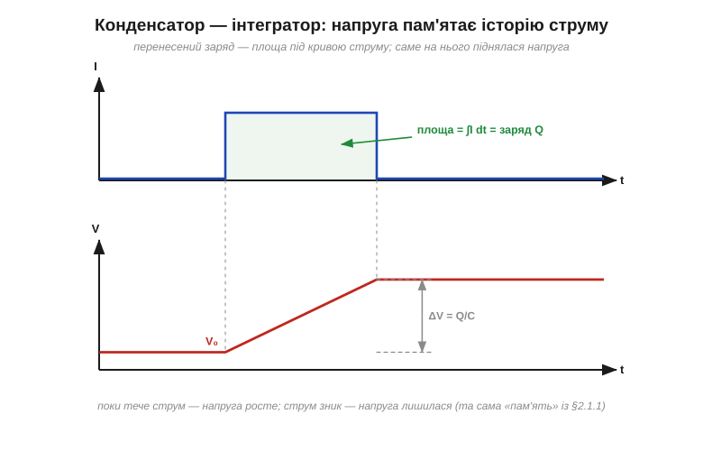

# 🧮 I = C·dV/dt: струм як швидкість зміни напруги

> Це математична вставка до теми [«Ємність: Q = C·V»](book:electronics/capacitance). Формула Q = C·V описує конденсатор **у спокої**. Та щойно напруга починає змінюватися, з тієї самої формули випливає головний динамічний закон компонента: струм конденсатора пропорційний не напрузі, а **швидкості її зміни**. Це пара «похідна — інтеграл» з математики, втілена в одній деталі.

### Від Q = C·V до I = C·dV/dt

Струм — це швидкість перенесення заряду: I = dQ/dt (саме поняття похідної — миттєвої швидкості зміни — докладно розібране у [вставці до §2.1.4](book:electronics/rc-time-constant/math-exponential-ode.md)). А заряд конденсатора жорстко прив'язаний до напруги: Q = C·V. Якщо ємність стала, то швидкість зміни заряду — це C, помножене на швидкість зміни напруги:

```
I = dQ/dt = C · dV/dt
```

Один рядок — а в ньому вся динаміка конденсатора. Зверніть увагу, чого в цій формулі **нема**: самої напруги. Струму байдуже, скільки вольтів на конденсаторі зараз — пів вольта чи сто; він відгукується лише на те, **як швидко** це число змінюється.

### Три режими одним поглядом

Підставмо у формулу три типові поведінки напруги:

- **напруга стоїть** (dV/dt = 0) → струм нуль. Заряджений конденсатор — розрив для постійного струму; якісне правило про [конденсатор як розрив для постійного струму](book:electronics/capacitor) тут стає строгим наслідком формули;
- **напруга росте рівномірно** (dV/dt = const) → струм сталий: щосекунди доводиться доносити однакову порцію заряду;
- **напруга стрибає круто** → струм величезний: у крутого фронту велика похідна, і заряд мусить прибути майже миттєво.


*Рис. Той самий конденсатор у трьох режимах. Струм (унизу) — це з точністю до множника C похідна напруги (вгорі): нуль на «полиці», константа на рівному підйомі, вузька «голка» на крутому фронті. Що крутіша зміна — то більший струм, незалежно від самого рівня напруги.*

**Приклад (скільки струму бере крихітна ємність).** Доріжка на платі має [паразитну ємність](book:electronics/capacitor) 100 пФ, а цифровий сигнал на ній перемикається з 0 до 3.3 В за 10 нс:

```
dV/dt = 3.3 В / 10 нс = 3.3×10⁸ В/с
I = C · dV/dt = (100×10⁻¹² Ф) · (3.3×10⁸ В/с) ≈ 33 мА
```

Тридцять три міліампери — на ємності, якої «майже немає»! Ось чому швидка електроніка так чутлива до паразитних ємностей і чому кожен цифровий фронт — це «голка» струму в живленні (та сама, яку гасить [розв'язувальний конденсатор](book:electronics/capacitor-uses)). І навпаки: повільним колам ті самі 100 пФ зовсім не заважають — у них dV/dt мізерний.

### Зворотний хід: конденсатор-інтегратор

Тепер перевернімо формулу: за відомим струмом знайдімо напругу. Кожен короткий проміжок dt приносить порцію заряду I·dt, а напруга підростає на dV = I·dt/C. Зібравши всі порції від початку спостереження, отримуємо:

```
V(t) = V₀ + (1/C) · ∫ I dt
```

Знак ∫ (інтеграл) означає саме це «зібрати всі дрібні внески» — операцію, **обернену** до похідної. Геометрично ∫I dt — площа під кривою струму, а фізично — просто перенесений заряд Q. Тож напруга конденсатора — його **пам'ять**: вона зберігає підсумок усієї історії струму, що через нього пройшов, починаючи від стартової V₀.


*Рис. Прямокутний імпульс струму (вгорі) переносить заряд Q — площу під кривою. Напруга (внизу) за час імпульсу лінійно піднімається рівно на ΔV = Q/C і після зникнення струму лишається на новому рівні. Конденсатор інтегрує струм — і пам'ятає результат.*

**Приклад (сталий струм — лінійна «пилка»).** Заряджаємо конденсатор 1 мкФ сталим струмом 1 мА:

```
dV/dt = I / C = (1×10⁻³ А) / (1×10⁻⁶ Ф) = 1000 В/с  =  1 В за мілісекунду
```

Сталий струм дає ідеально рівний підйом напруги. На цьому стоять генератори лінійної розгортки, а ще це готовий спосіб виміряти ємність: подай відомий струм і засічи, за скільки напруга дійде до порога. Заодно видно зміст одиниці: фарад — це «ампер-секунда на вольт».

### Похідна й інтеграл на одному компоненті

Зведемо обидва погляди поруч — і порівняємо з резистором, у якого жодної динаміки немає:

```
резистор:      I = V/R                 (миттєвий зв'язок, без пам'яті)
конденсатор:   I = C · dV/dt           (струм — похідна напруги)
               V = V₀ + (1/C)·∫I dt    (напруга — інтеграл струму)
```

Резистор живе теперішнім: прибрали напругу — струму нема, і нічого не лишилося. Конденсатор пов'язує теперішнє з минулим: його струм дивиться на **зміну**, а напруга — на **накопичену історію**. Математично це і є означення пари похідна/інтеграл; фізично — все, що ми знали про конденсатор якісно, тепер в одній формулі.

### Де це працює в курсі

[«Блокує постійне, пропускає зміну»](book:electronics/capacitor) — це I = C·dV/dt, сказане словами. Рівняння RC-кола у [вставці до §2.1.4](book:electronics/rc-time-constant/math-exponential-ode.md) виходить підстановкою цього закону в закон Ома. «Голки» струму цифрових фронтів і вся [розв'язка живлення](book:electronics/capacitor-uses) — прямий наслідок великих dV/dt. А якщо напруга — синусоїда, то її похідна — теж синусоїда, лише зсунута на чверть періоду: саме звідси беруться і [«опір» конденсатора змінному струму](book:electronics/capacitive-reactance), і зсув фаз.
