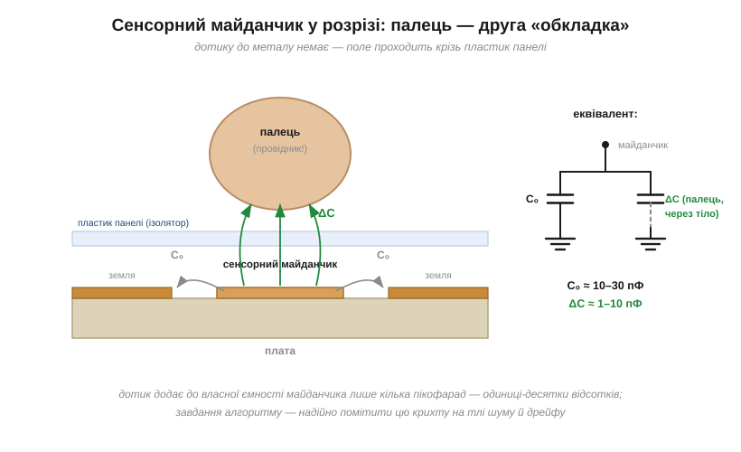

# ⚙️ Ємнісна сенсорна кнопка: побачити пікофаради пальця

> Будь-які два провідники — уже [конденсатор](topic:electronics/capacitor), і палець — теж провідник. Підносячи його до мідного майданчика на платі, ми додаємо тому кілька пікофарад. Кнопка без жодної механіки, що працює крізь пластик, — це алгоритм, який уміє цю крихту надійно помітити.

### Задача

Мідний майданчик на платі (накритий панеллю чи лаком — металу ніхто не торкається) має власну ємність на землю C₀ ≈ 10–30 пФ. Палець поруч додає ΔC ≈ 1–10 пФ — лічені відсотки, а то й менше. Треба видавати чисте «натиснуто/відпущено» попри шум, наведення мережі та повільний дрейф від температури й вологості.


*Майданчик уже має ємність C₀ на навколишню землю. Палець за пластиком стає другою «обкладкою» додаткового конденсатора ΔC, замкненого на землю через тіло. Поле проходить крізь ізолятор — тому кнопка працює без контакту, як і ємнісний тачскрін.*

### Ідея: міряти не раз, а тисячу разів

Ємність перетворюють на число через час: як показує [RC-метр](topic:electronics/rc-time-constant/proj-capacitance-meter.md), час заряду до порога пропорційний C. Але тут різниця, яку треба побачити, — відсотки, а одиничний вимір пікофарад шумить сильніше. Вихід — **накопичення**: ганяти цикл заряд–розряд сотні разів поспіль і підсумовувати час (або рахувати, скільки циклів вкладається у фіксоване вікно). Шум від циклу до циклу випадковий і усереднюється; систематична різниця від пальця — накопичується.

```c
#include <stdint.h>

#define N_CYCLES 200u     // скільки заряд–розрядів усереднюємо (N ~ 100…1000)
#define TIMEOUT  10000u   // стеля лічби — щоб не зависнути на обриві

// Апаратний шар (реалізація залежить від конкретного МК):
extern void pad_discharge(void);        // притиснути вивід майданчика до землі й витримати паузу
extern void pad_release(void);          // відпустити: майданчик заряджається через R до живлення
extern int  pad_above_threshold(void);  // 1, коли напруга перетнула логічний поріг входу

// Один сирий відлік: сумарна лічба тактів заряду за N циклів. Пропорційна ємності.
uint32_t raw_reading(void)
{
    uint32_t sum = 0;
    for (uint16_t i = 0; i < N_CYCLES; i++) {
        pad_discharge();                        // майданчик у нулі
        pad_release();                          // старт заряду через R
        uint16_t ticks = 0;
        while (!pad_above_threshold() && ticks < TIMEOUT)
            ticks++;                            // лічимо такти до порога
        sum += ticks;
    }
    return sum;                                 // ∝ C; випадковий шум поділено на √N
}
```

### Рішення: базова лінія, два пороги, кілька збігів

Сирий відлік ніколи не стоїть на місці: температура, вологість, рука на корпусі — усе повільно зсуває C₀. Тому рішення ухвалюють не за абсолютним значенням, а за **відхиленням від базової лінії** (*baseline*) — повільного середнього «стану без дотику»:

```c
#include <stdint.h>

#define THRESH_ON   80   // поріг увімкнення (в одиницях сирого відліку)
#define THRESH_OFF  40   // поріг вимкнення нижчий — це і є гістерезис
#define M_MATCHES   3    // стільки збігів поспіль треба на визнання натиску
#define BASE_SHIFT  6    // база повзе з темпом 1/64 = 2⁻⁶

typedef enum { RELEASED, PRESSED } touch_state_t;

static touch_state_t state    = RELEASED;
static int32_t       baseline = 0;   // «стан без дотику» — повільне середнє
static uint8_t       matches  = 0;   // лічильник збігів поспіль

// Викликати рівно раз на ~10 мс (наприклад, з таймерного переривання).
void touch_poll(void)
{
    int32_t s = (int32_t)raw_reading();

    if (state == RELEASED)
        baseline += (s - baseline) >> BASE_SHIFT;   // повзе слідом за дрейфом

    int32_t d = s - baseline;                       // відхилення від базової лінії

    if (state == RELEASED) {
        if (d > THRESH_ON) {
            if (++matches >= M_MATCHES) {           // М збігів поспіль
                state   = PRESSED;
                matches = 0;
            }
        } else {
            matches = 0;                            // поодинокий викид — лічильник скидаємо
        }
    } else {                                        // PRESSED
        if (d < THRESH_OFF)
            state = RELEASED;   // база заморожена, поки натиснуто, тож палець не «з'їдається»
    }
}
```

Тут три захисні механізми разом. **Базова лінія** оновлюється лише без дотику — інакше за кілька секунд вона «з'їла б» притиснутий палець, і кнопка сама б відпустилася. **Два пороги** (увімкнення вище, вимкнення нижче) — це гістерезис, та сама ідея, що в [тригері Шмітта](topic:electronics/schmitt-trigger): на межі спрацювання кнопка не «брязкає». **М збігів поспіль** відсіює поодинокі викиди.


*Сирий відлік шумить і повільно дрейфує — базова лінія повзе слідом. Дотик дає сходинку понад поріг увімкнення; відпускання фіксується за нижчим порогом. Усе вимірюється відносно базової, тож дрейф не накопичує хибних спрацювань.*

### Складність і числа

На кнопку йде N циклів по кілька мікросекунд: при N = 200 і циклі 5 мкс — **1 мс на опитування**, тобто десяток кнопок спокійно опитується сто разів за секунду. Пам'яті — кілька байтів стану на кнопку. Виграш точності від накопичення — корінь із N: чотириста циклів замість ста вдвічі зменшують шум.

### Пастки на мікроконтролері

- **Наведення мережі 50 Гц.** Палець — ще й [антена](topic:communications/antenna): сирий відлік «дихає» в такт мережі. Ліки — вікно накопичення, кратне періоду 20 мс, або принаймні усереднення за кілька періодів.
- **Довга доріжка до майданчика.** Це плюс до C₀ (менша відносна вага пальця) і зайва антена. Доріжку ведуть короткою, тонкою й подалі від силових кіл.
- **Волога й краплі.** Крапля води на панелі теж змінює ємність — звідси «привидні» натискання. Допомагають вищий поріг, кільце землі довкола майданчика й логіка «кілька кнопок одразу = хибне».
- **Надто спритна базова лінія.** Якщо вона повзе швидко, то наздоганяє повільний дотик — кнопка відпускається сама. Темп оновлення — компроміс між стійкістю до дрейфу й «терплячістю» до довгого натискання.
- **Метал поряд.** Корпус чи гвинт біля майданчика зсуває C₀ — калібрування при старті обов'язкове, а механіка довкола сенсора має бути сталою.

Принцип цей настільки ходовий, що в багатьох мікроконтролерах він «залитий у кремній»: в ESP32, наприклад, є апаратні сенсорні канали, які самі ганяють цикли й повертають готовий відлік. Але всередині них працює рівно той самий алгоритм — заряд, розряд, лічба й базова лінія.
