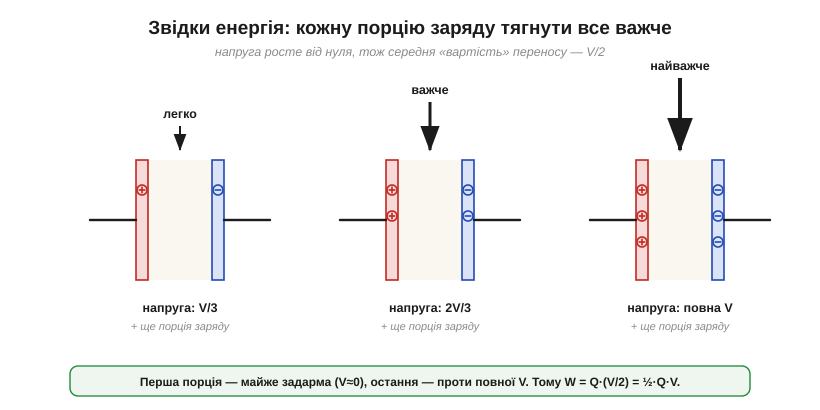
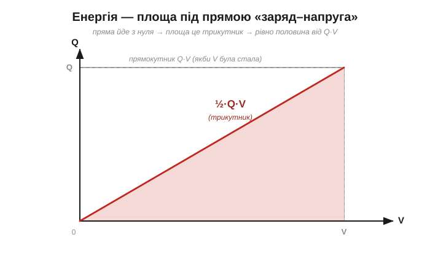
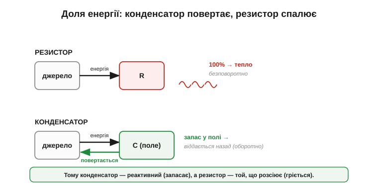
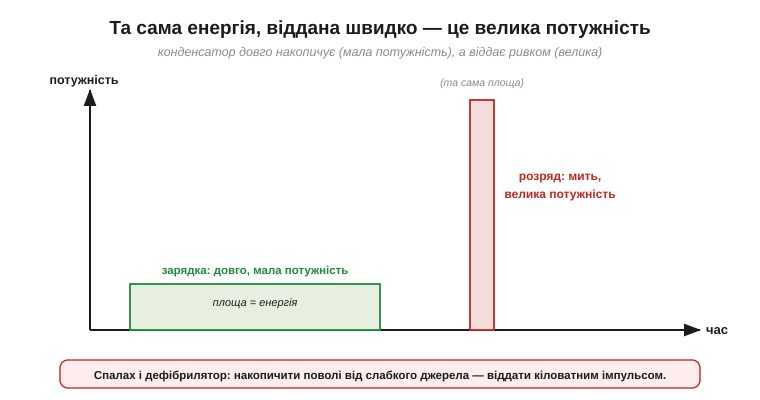

# Енергія в конденсаторі й полі

Заряджений конденсатор тримає не лише заряд — він тримає **запас енергії**, готовий зробити роботу. Саме ця енергія валила з ніг Мушенбрука біля лейденської банки, вона ж за тисячну частку секунди спалахує у фотоспалаху й рятує життя в дефібриляторі. Одна річ — порахувати, *скільки заряду* [розділяє конденсатор](book:electronics/capacitance); інша — з'ясувати, *скільки джоулів* у ньому захована, і, що важливіше, зрозуміти, **де** ця енергія сидить і **звідки** береться.

### Звідки береться енергія: робота проти зростання напруги

Енергія в конденсаторі не виникає з нічого — її **вкладає джерело**, поки заряджає. Щоб перенести заряд через різницю потенціалів, треба виконати роботу: [вольт — це джоуль на кулон](book:physics/volt). Заряджаючи конденсатор, джерело весь час переносить заряд із однієї обкладки на іншу — проти напруги, що **сама росте** в міру накопичення.

Ось ключ до загадкового множника ½. На самому початку конденсатор порожній, напруга на ньому **нуль** — перші порції заряду переносяться майже «задарма». Та що більше заряду накопичилось, то вища напруга й то **важче** доганяти наступну порцію. Останню порцію доводиться тягти вже проти **повної** напруги V. Тобто заряд переноситься не проти сталої напруги, а проти такої, що лінійно росте від 0 до V.


*Рис. Заряджання — це перенесення заряду проти напруги, що сама зростає від 0 до V. Перша порція йде «задарма» (напруга ще нульова), остання — проти повної напруги. Тому середня «вартість» переносу — це напруга на середині шляху, V/2.*

Якщо напруга рівномірно зростала від 0 до V, то **середня** напруга, проти якої переносився весь заряд Q, дорівнює просто V/2. А енергія — це заряд, помножений на напругу, проти якої його тягли. Звідси:

```
W = Q · V_середнє
W = Q · (V / 2)
W = ½ · Q · V
```


*Рис. Та сама ½ — геометрично. На графіку «заряд–напруга» енергія дорівнює площі під прямою. Оскільки пряма йде з нуля, ця площа — **трикутник** з катетами Q і V, а його площа = ½·Q·V. Якби напруга була стала (прямокутник), вийшло б Q·V; але вона росла, тож рівно половина.*

Множник ½ — не випадковий коефіцієнт, а пряме відлуння того, що напругу довелося піднімати **з нуля**. Якби заряд переносили проти вже наявної сталої напруги (як у звичайному переносі через батарею), множника ½ не було б.

### Три рівноцінні форми

Маючи W = ½·Q·V і [зв'язок Q = C·V](book:electronics/capacitance), легко отримати ще дві форми тієї самої енергії — підставивши Q = C·V або V = Q/C:

```
W = ½ · Q · V          (через заряд і напругу)
W = ½ · C · V²          (через ємність і напругу)
W = ½ · Q² / C          (через заряд і ємність)
```


*Рис. Три записи однієї величини. Обирають той, де відомі потрібні величини: знаєш C і V — бери ½·C·V²; знаєш заряд — інші форми. Усі дають однакові джоулі.*

Перевірмо, що це справді **джоулі**. Візьмемо ½·C·V²: ємність у фарадах (Кл/В), напруга у вольтах, а [вольт — це джоуль на кулон](book:physics/volt):

```
[C·V²] = (Кл / В) · В² = Кл · В = Кл · (Дж / Кл) = Дж   ✓
```

Одиниці сходяться — енергія конденсатора вимірюється в джоулях, як і належить будь-якій енергії.

**Приклад (енергія невеликого конденсатора).** Конденсатор 100 мкФ під напругою 5 В. Скільки в ньому енергії?

```
W = ½ · C · V²
W = ½ · (100 × 10⁻⁶ Ф) · (5 В)²
W = ½ · (100 × 10⁻⁶) · 25
W = 1.25 × 10⁻³ Дж  =  1.25 мДж
```

Усього міліджоулі — крихта (стільки ж енергії має мураха, що проповзла кілька сантиметрів). Конденсатори в логіці й живленні тримають **мало** енергії; їхня сила — не в запасі, а в готовності віддати його **миттєво** (про це нижче).

### Конденсатор як електрична пружина

Множник ½ і квадрат можуть здатися знайомими — і недарма. Візьмімо звичайну пружину: щоб стиснути її на x, потрібна сила, що сама росте зі зміщенням (F = k·x), а запасена в стиску енергія виходить ½·k·x². Конденсатор поводиться **точнісінько так само**, лише замість зміщення x — напруга V, а замість жорсткості k — ємність C:

```
пружина:      W = ½ · k · x²
конденсатор:  W = ½ · C · V²
```

Аналогія напрочуд глибока. Як і пружину, конденсатор треба «натягувати» проти зростального опору (напруги); він запасає енергію в «натягу» (полі) і **повертає** її повністю, коли його відпустити (розрядити). Жорсткіша пружина (велика k) накопичує більше енергії за те саме зміщення; «жорсткіший» конденсатор (велика C) — за ту саму напругу. І ламається ця аналогія там само, де й [гумова перетинка, що моделює конденсатор](book:electronics/capacitor): пружину можна перетягнути й зламати, а конденсатор за завеликої напруги — [пробити наскрізь по діелектрику](book:electronics/capacitor-parasitics).

### Чому напруга важливіша за ємність: квадрат

У формулі ½·C·V² ємність входить у **першому** степені, а напруга — у **квадраті**. Це означає, що напруга набагато «важливіша» для енергії: подвоїти ємність — подвоїти енергію, а подвоїти напругу — **вчетверо** її збільшити.


*Рис. Залежність енергії від напруги — парабола W ∝ V². Удвічі вища напруга дає вчетверо більше енергії, утричі — у дев'ять разів. Ось чому небезпека зарядженого конденсатора зростає з напругою стрімкіше, ніж здається.*

**Приклад (конденсатор фотоспалаху).** Спалах накопичує енергію в конденсаторі ≈ 200 мкФ, зарядженому до ≈ 300 В:

```
W = ½ · C · V²
W = ½ · (200 × 10⁻⁶ Ф) · (300 В)²
W = ½ · (200 × 10⁻⁶) · 90 000
W = 9 Дж
```

Дев'ять джоулів — у **сім тисяч разів** більше за ті 1.25 мДж у конденсаторі на 5 В, хоча ємність лише вдвічі більша. Уся різниця — у напрузі: 300 В замість 5 В, а вона у квадраті. Саме тому потужні накопичувачі енергії працюють на **високій** напрузі, а заряджений високовольтний конденсатор смертельно небезпечний навіть за помірної ємності.

**Приклад (та сама ємність, інша напруга).** Візьмемо знову 100 мкФ, але піднімемо напругу з 5 В лише вдесятеро — до 50 В:

```
W = ½ · (100 × 10⁻⁶ Ф) · (50 В)²
W = ½ · (100 × 10⁻⁶) · 2500
W = 0.125 Дж  =  125 мДж
```

Енергія підскочила зі 1.25 мДж до 125 мДж — у **сто разів** від десятикратної напруги. Той самий конденсатор, та сама ємність — а запас визначає передусім напруга, бо вона у квадраті.

### Де насправді сидить енергія: у полі

А тепер — питання, відповідь на яке дав ще Франклін, розібравши лейденську банку. Де фізично **зберігається** ця енергія? Спокусливо сказати «на обкладках, у заряді». Але правильна відповідь глибша: енергія захована в **електричному полі** в зазорі між обкладками.


*Рис. Заряд лише «тримає» поле напнутим у діелектрику — а сама енергія розлита в цьому полі. Коли конденсатор розряджається, поле **спадає до нуля**, і запасена в ньому енергія виходить назовні, женучи струм розряду. Це те саме Франклінове відкриття: запас живе не в металі, а в полі між обкладками.*

Ця думка спершу дивує, та вона глибоко правильна й виявляється всюди: енергія взагалі любить «жити» в полях. Поки поле напнуте — енергія є; зникло поле — енергію віддано. Конденсатор у цьому сенсі — машинка, що **запасає енергію в електричному полі** (а [котушка запасає](book:electronics/inductor-energy) те саме в магнітному).

І ще один наслідок цього «зберігання в полі»: оскільки енергія просто **лежить** у полі, нічого не витрачаючи на тепло, ідеальний конденсатор повертає її назад **до останнього джоуля**. Він не «протікає», як дірява бочка, — він чесна скарбничка. Реальний конденсатор, щоправда, поволі саморозряджається крізь [неідеальний діелектрик](book:electronics/capacitor-parasitics), але це вже дрібні втрати, а не принцип.

### Запас, який повертається: конденсатор проти резистора

Тут — принципова різниця в долі енергії. **Резистор** енергію **спалює**: проганяючи струм, він безповоротно [перетворює електричну енергію на тепло](book:physics/joule-heating) (P = I²R) — повернути її вже не можна. **Конденсатор** енергію не витрачає, а **запасає** й **повертає**: зарядили — енергія в полі; розрядили — вона повністю вийшла назад у коло (в ідеалі — до останнього джоуля).


*Рис. Доля вкладеної енергії. У резисторі вона вся йде в тепло й розсіюється безповоротно (необоротно). У конденсаторі вона зберігається в полі й повертається при розряді (оборотно). Тому конденсатор називають **реактивним** елементом, а резистор — таким, що **розсіює**.*

> 🔧 **Навіщо це.** Ця оборотність — причина, чому конденсатори стоять усюди в живленні. Вони не гріються від запасання енергії (на відміну від резистора), тож можуть тримати запас «про запас» без втрат і миттєво підставити його, коли напруга живлення на мить просіла. Енергію, яку резистор спалив би на тепло, конденсатор лише позичає колу й бере назад. Це й робить його ідеальним маленьким буфером енергії.

### Енергія й потужність: повільно накопичити, миттєво віддати

Запас енергії в конденсаторі зазвичай скромний (міліджоулі, рідко — джоулі). Уся хитрість у тому, **як швидко** його можна віддати. [Потужність — це енергія за секунду](book:physics/electric-power); якщо ту саму енергію віддати в тисячу разів швидше, потужність буде в тисячу разів більшою.


*Рис. Конденсатор накопичує енергію **повільно** (слабке джерело, частки секунди чи секунди), а віддає її **ривком** за мікро- чи мілісекунди. Енергія та сама, але потужність у момент розряду — у тисячі разів вища за потужність зарядки. Звідси сліпучий спалах і потужний імпульс дефібрилятора.*

> 🔧 **Навіщо це.** Ось чому фотоспалах живиться від крихітної батарейки, а світить як прожектор: батарейка кілька секунд **поволі** заряджає конденсатор (мала потужність), а він віддає накопичені джоулі за тисячну частки секунди — і миттєва потужність сягає кіловатів. Дефібрилятор робить те саме з сотнями джоулів. Конденсатор — це не велике «відро» енергії, а радше **пружина**, яку довго натягують і відпускають умить.

### Конденсатор — не батарея: багато потужності, мало енергії

Звідси — головне, чим конденсатор відрізняється від акумулятора. Порахуймо запас модного [**суперконденсатора**](book:electronics/supercapacitor) на 1 Ф, зарядженого до 2.7 В:

```
W = ½ · C · V²
W = ½ · 1 Ф · (2.7 В)²
W ≈ 3.6 Дж
```

Цілих 3.6 джоуля — і для конденсатора це вже чимало (а суперконденсатори на тисячі фарад тримають і десятки кілоджоулів: комірка 3000 Ф на 3 В — це ≈ 13 кДж). Та порівняно з хімічним джерелом навіть це мало: скромна пальчикова батарейка тримає **тисячі** джоулів, у кілька тисяч разів більше за наш приклад. За **запасом** енергії конденсатор безнадійно програє акумулятору.

Зате конденсатор б'є батарею за **потужністю**: він віддає весь запас за мілісекунди, тоді як [батарея](book:electronics/batteries) сточує його поволі, годинами. Кажуть, що конденсатор має малу **щільність енергії**, але величезну **щільність потужності**, а батарея — навпаки. Тому їх не протиставляють, а **поєднують**: батарея дає витривалість, конденсатор — миттєвий ривок струму, коли той раптом потрібен (запуск двигуна, спалах, імпульс зв'язку). Сам контраст і варто тримати в голові: **конденсатор — для потужності, батарея — для запасу**.

Отже, енергія конденсатора — це **W = ½·C·V²** джоулів, вкладених джерелом проти зростання напруги, захованих у **полі** зазору й готових повністю повернутися при розряді — хоч повільно, хоч блискавично швидко. Окреме питання — а **скільки часу** триває те заряджання й розряджання, і за яким законом: це визначає [стала часу RC-кола](book:electronics/rc-time-constant).

---
