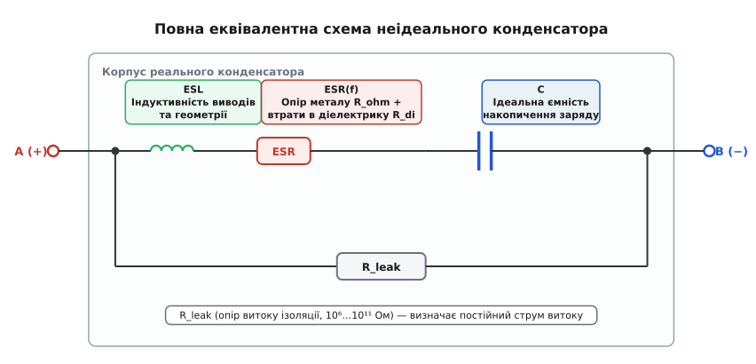
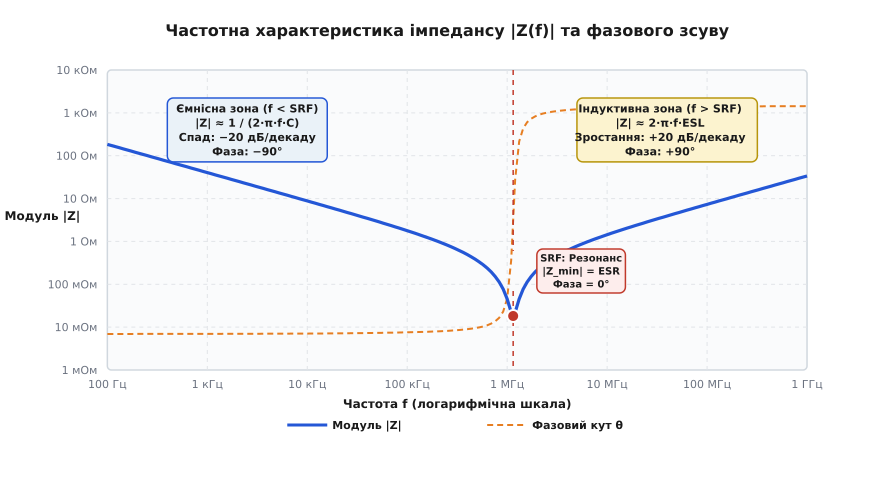
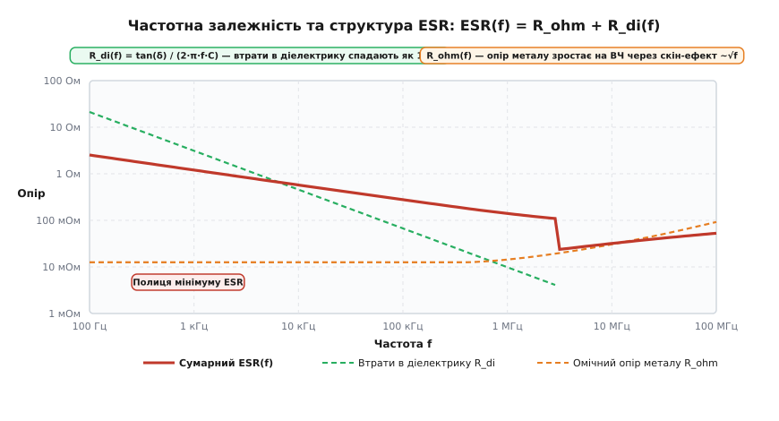
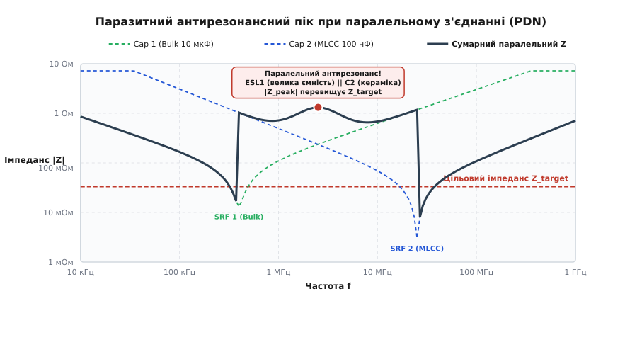
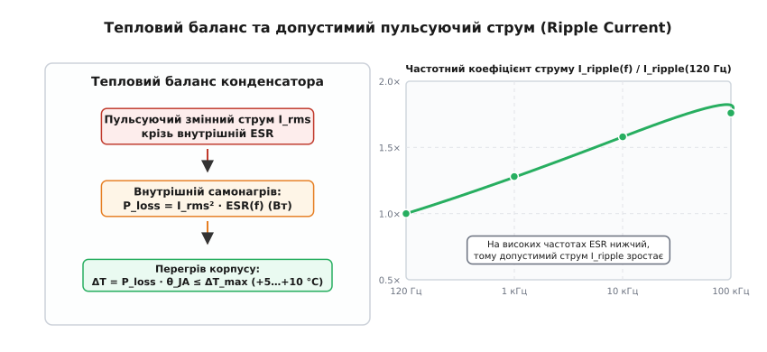

# ESR та імпеданс конденсатора

<preknowlist>
- [Конденсатор](topic:electronics/capacitor) — що таке ємність, розділений електричний заряд та накопичення енергії в полі
- [Паразитні параметри конденсатора](topic:electronics/capacitor-parasitics) — омічний опір виводів, індуктивність ESL та струм витоку
- [Діелектрики конденсаторів](topic:electronics/capacitor-dielectrics) — матеріали діелектриків, поляризація та діелектрична проникність
- [Реактивний опір](topic:electronics/reactance) — реактивний опір ємності та фазовий зсув напруги й струму
- [Власна резонансна частота (SRF)](topic:electronics/self-resonant-frequency) — точка послідовного LC-резонансу реальних компонентів
- [Добротність Q](topic:electronics/quality-factor) — співвідношення між збереженою та розсіяною енергією коливальної системи
- [Нагрів Джоуля](topic:physics/joule-heating) — розсіювання теплової потужності на активному опорі провідника
- [Скін-ефект](topic:electronics/skin-effect) — витіснення високочастотного змінного струму до поверхні провідника
</preknowlist>

На платі живлення центрального процесора сервера зі струмом споживання 80 А при раптовому переході обчислювальних ядер із режиму очікування (10 А) до максимального навантаження (80 А) за 5 наносекунд напруга живлення ядра 0.9 В раптово просідає до 0.62 В. Такий провал викликає миттєве скидання процесора через апаратний збій регістрів пам'яті. Інженер, намагаючись стабілізувати шину живлення, напаює паралельно додаткову батарею електролітичних конденсаторів сумарною ємністю 4700 мкФ: за розрахунком постійного струму такого накопиченого заряду мало б вистачити для утримання напруги протягом сотень мікросекунд. Проте осцилограф фіксує, що амплітуда наносекундного провалу напруги не зменшилася ні на мілівольт, а корпус доданих електролітичних конденсаторів під час тривалої роботи нагрівається вище +85 °C.

Причина цієї схемотехнічної катастрофи полягає в тому, що на частотах понад кілька сотень кілогерців реальний конденсатор повністю припиняє поводитися як ідеальна ємність. Замість накопичувача заряду з нескінченно малим опором для швидких сигналів він перетворюється на складний комплексний двополюсник, опір якого визначається двома неминучими паразитними параметрами: внутрішнім активним опором втрат — **еквівалентним послідовним опором** (*Equivalent Series Resistance*, ESR; від лат. *aequus* — рівний, лат. *valere* — вартувати, та лат. *resistere* — чинити опір) та власною паразитною індуктивністю виводів і корпусу — **еквівалентною послідовною індуктивністю** (*Equivalent Series Inductance*, ESL).

---

### Від ідеального накопичувача до реального високочастотного двополюсника

В ідеальній теорії електричних кіл конденсатор описується фундаментальним диференціальним рівнянням `i(t) = C · (dv/dt)`. З нього випливає, що чим швидше змінюється напруга, тим більший струм здатен пропустити конденсатор, а його реактивний опір гармонічному сигналу неперервно спадає зі зростанням частоти за законом:

```
X_C(f) = 1 / (2 · π · f · C)
```

За цією спрощеною формулою на частоті 100 МГц конденсатор ємністю 10 мкФ повинен мати опір менше `0.16 мОм` і майже ідеально шунтувати будь-які високочастотні завади на землю.

Проте в реальному фізичному світі електричний струм, що входить у конденсатор і виходить із нього, протікає крізь металеві виводи, контактні зварні точки, внутрішні шари металізації або рулонну фольгу, а також поляризує діелектричний матеріал між обкладками. Кожен міліметр металевого провідника має власний активний омічний опір та утворює магнітну петлю, що створює індуктивність. Крім того, циклічна переорієнтація молекулярних диполів у діелектрику супроводжується внутрішнім тертям, яке необоротно розсіює частину енергії змінного електричного поля у вигляді тепла.

У результаті динамічний відгук реального конденсатора на стрибок струму споживання навантаження `ΔI` за час наростання `t_r` містить три одночасні фізичні складові:

```
ΔV_drop = V_ESL + V_ESR + V_C
        = ESL · (dI / dt) + ΔI · ESR + (ΔI · t_r) / (2 · C)
```

1. **Індуктивний викид `ESL · (dI/dt)`:** Виникає внаслідок закону електромагнітної індукції Фарадея у виводах і монтажних перехідних отворах. При швидкості наростання струму `dI/dt = 70 А / 5 нс = 1.4·10¹⁰ А/с` навіть мікроскопічна індуктивність виводів `ESL = 2 нГн` (характерна для звичайного електролітичного конденсатора) створює миттєвий провал напруги амплітудою `2·10⁻⁹ Гн · 1.4·10¹⁰ А/с = 28 В`. Цей імпульс повністю знищує будь-яку стабілізацію напруги ще до того, як заряд почне виходити з самої ємності.
2. **Омічний стрибок `ΔI · ESR`:** Викликаний прямим падінням напруги на активному внутрішньому опорі металізації та діелектрика при протіканні пікового струму. При струмі 70 А і типовому ESR електроліту `0.1 Ом` падіння напруги становить `7 В`.
3. **Ємнісний розряд `(ΔI · t_r) / (2 · C)`:** Визначається витратою заряду, накопиченого на обкладках. Для ємності 4700 мкФ за 5 наносекунд розряд становить менше `0.04 мкВ` — тобто на наносекундних масштабах часу сама ємність взагалі не встигає відчути зміну струму.

Саме тому розуміння природи повного змінного опору — **імпедансу** (*Impedance*; від лат. *impedire* — перешкоджати, заважати) — є центральним завданням сучасної схемотехніки.

---

### Повна еквівалентна схема неідеального конденсатора

Для кількісного інженерного аналізу конденсатор замінюють зосередженою схемою заміщення, що складається з чотирьох базових фізичних елементів.


*Повна еквівалентна схема неідеального конденсатора. Послідовна гілка містить власну індуктивність виводів та геометрії обкладинок (ESL), сумарний активний опір втрат (ESR) та ідеальну ємність накопичення заряду (C). Паралельно цій гілці підключено опір витоку діелектрика (R_leak), який визначає повільний струм саморозряду на постійній напрузі.*

Кожен елемент схеми відповідає конкретному фізичному процесу в конструкції компонента:

1. **Ідеальна ємність `C`:** Відображає здатність діелектрика накопичувати електричну енергію у вигляді поляризації заряду. Визначається площею перекриття обкладинок `S`, відстанню між ними `d` та дійсною частиною діелектричної проникності матеріалу `ε'`:
   ```
   C = ε_0 · ε' · S / d
   ```
2. **Еквівалентний послідовний опір `ESR`:** Сумарний активний опір, у якому електрична енергія необоротно перетворюється на тепло Джоуля. Він складається з двох принципово різних фізичних внесків: омічного опору металевих провідників `R_ohm` та частотно-залежного еквівалентного опору втрат у діелектрику `R_di(f)`.
3. **Еквівалентна послідовна індуктивність `ESL`:** Сумарна паразитна індуктивність металевих виводів, внутрішніх струмопідвідних контактних пластин та геометрії самих обкладинок. Для вивідних компонентів становить `5…40 нГн`, для стандартних SMD-корпусів — `0.5…2.0 нГн`, а для мініатюрних безвивідних корпусів 0201/01005 падає до `0.15…0.3 нГн`.
4. **Опір витоку `R_leak` (опір ізоляції):** Опір діелектрика постійному струму витоку, спричинений рухом залишкових вільних носіїв заряду (електронів та іонів домішок) крізь товщу ізолятора. Для керамічних і плівкових конденсаторів цей опір перевищує сотні гігаом (`10⁹…10¹² Ом`), а для електролітичних становить `10⁶…10⁸ Ом`.

**Спрощення для змінного струму:**
Оскільки на частотах понад 10 Гц опір паралельної гілки `R_leak` у мільйони разів перевищує модуль послідовного імпедансу `|Z_s|`, струмом витоку нехтують, і комплексний імпеданс конденсатора описується класичним послідовним виразом:

```
Z(j·ω) = ESR + j · (ω · ESL - 1 / (ω · C))
```

де `ω = 2 · π · f` — циклічна кутова частота, а `j = √(-1)` — уявна одиниця. Докладний математичний вивід цієї передавальної функції, траєкторії її нулів і полюсів на комплексній площині та розрахунок добротності наведено у вставці [аналітичне виведення імпедансу, власного резонансу та PDN-антирезонансу](topic:electronics/capacitor-esr-impedance/math-impedance-derivation.md).

---

### Частотна характеристика модуля імпедансу |Z(f)| та інверсія фази

Якщо підключити конденсатор до векторного аналізатора кіл (VNA) та виміряти залежність модуля комплексного імпедансу `|Z(f)|` і фазового зсуву `θ(f)` у широкому спектрі частот (від 100 Гц до 1 ГГц), отриманий графік матиме характерну V-подібну форму.


*Частотна характеристика неідеального конденсатора на логарифмічній шкалі. Ліворуч: ємнісна зона (нахил −20 дБ/декаду, фаза −90°). У центрі: точка власного послідовного резонансу (SRF), де імпеданс досягає абсолютного мінімуму |Z_min| = ESR, а фаза проходить через 0°. Праворуч: індуктивна зона (нахил +20 дБ/декаду, фаза +90°), де конденсатор поводиться як котушка індуктивності.*

Частотну вісь графіка чітко поділяють три принципово різні робочі області:

```
Модуль імпедансу:
|Z(f)| = √( ESR² + (2·π·f·ESL - 1 / (2·π·f·C))² )
```

#### 1. Ємнісна область (`f << f_SRF`)
На низьких частотах реактивний опір індуктивності `2·π·f·ESL` є мізерним, тоді як опір ємності `1 / (2·π·f·C)` домінує над усіма іншими складовими. 

Модуль імпедансу наближено описується чистою ємністю:

```
|Z(f)| ≈ 1 / (2 · π · f · C)
```

На графіку з подвійною логарифмічною шкалою (Log-Log) ця залежність виглядає як пряма лінія зі спадним нахилом **−20 дБ на декаду** (при зростанні частоти в 10 разів імпеданс зменшується рівно в 10 разів). Фазовий кут струму відносно напруги становить майже ідеальні `−90°` (`−π/2` радіан) — струм випереджає напругу на чверть періоду.

#### 2. Область власного послідовного резонансу (`f ≈ f_SRF`)
Зі зростанням частоти спадний ємнісний опір `X_C = 1 / (ω·C)` неминуче зрівнюється зі зростаючим індуктивним опором виводів `X_L = ω·ESL`. На частоті, де ці два реактивні опори стають строго рівними за абсолютною величиною, виникає явище **власного послідовного резонансу** (*Self-Resonant Frequency*, SRF):

```
ω_SRF · ESL = 1 / (ω_SRF · C)
ω_SRF² · ESL · C = 1
f_SRF = 1 / (2 · π · √(ESL · C))
```

У точці власного резонансу реактивні опори ємності та індуктивності діють у протифазі та повністю взаємно знищують один одного: `X_L - X_C = 0`. Уявна частина комплексного імпедансу обнуляється, а фазовий зсув стає рівним `θ = 0°`.

На частоті `f_SRF` модуль імпедансу досягає свого абсолютного глобального мінімуму, який дорівнює чистому активному опору втрат:

```
|Z_min| = |Z(f_SRF)| = ESR
```

Ця точка визначає дно V-подібної кривої. Чим менший ESR конденсатора, тим глибшим є це «дно» і тим ефективніше конденсатор шунтує завади на даній конкретній частоті.

#### 3. Індуктивна область (`f >> f_SRF`)
На частотах, вищих за точку власного резонансу, реактивний опір індуктивності виводів `2·π·f·ESL` починає переважати над ємнісним опором `1 / (2·π·f·C)`. 

Модуль імпедансу припиняє спадати і починає монотонно зростати:

```
|Z(f)| ≈ 2 · π · f · ESL
```

Нахил характеристики змінює знак на протилежний і стає рівним **+20 дБ на декаду** (при зростанні частоти вдесятеро імпеданс зростає вдесятеро). Фазовий кут здійснює інверсію і прямує до `+90°` (`+π/2` радіан) — напруга починає випереджати струм.

**Практичний висновок для інженера:**
Вище своєї власної резонансної частоти конденсатор перестає функціонувати як ємність і фізично стає котушкою індуктивності з номіналом `ESL`. Якщо завада або гармоніка тактового сигналу лежить вище точки SRF конденсатора, встановлення цього компонента не тільки не послабить шум, а може навіть посилити його амплітуду внаслідок індуктивного підйому імпедансу.

---

### Природа та фізичні складники ESR

Еквівалентний послідовний опір не є постійним резистором. Він має складну частотну залежність `ESR(f)`, яка формується внаслідок накладання двох принципово різних фізичних механізмів дисипації енергії.


*Частотна залежність еквівалентного послідовного опору ESR(f) = R_ohm + R_di(f). На низьких частотах домінують релаксаційні діелектричні втрати R_di(f), що спадають за законом 1/f. На середніх частотах формується широка «полиця» мінімального опору металу R_ohm, яка на ультрависоких частотах починає зростати пропорційно √f через скін-ефект у тонких металевих шарах.*

Математично сумарний послідовний опір втрат записується як адитивна сума:

```
ESR(f) = R_ohm(f) + R_di(f)
```

#### 1. Омічний опір провідників `R_ohm(f)`
Цей складник зумовлений класичним питомим електричним опором металевих частин конструкції конденсатора:
- провідних виводів і контактних ковпачків;
- внутрішніх тонкоплівкових металевих обкладинок (алюміній, срібло, нікель, мідь);
- перехідного опору контактних з'єднань металізація-вивід;
- об'ємного опору рідкого або твердого провідного електроліту (в електролітичних та танталових конденсаторах).

На постійному струмі та низьких частотах омічний опір металу постійний `R_ohm ≈ R_dc`. Проте на радіочастотах (понад десятки мегагерців) змінний струм витісняється до поверхні провідників внаслідок високочастотного [скін-ефекту](topic:electronics/skin-effect). Ефективна товщина провідного шару (глибина скін-шару `δ_skin = √(ρ / (π · f · μ))`) зменшується обернено пропорційно квадратному кореню з частоти `1/√f`. 

Внаслідок цього ефективний омічний опір металевих електродів починає зростати пропорційно кореню з частоти:

```
R_ohm(f) = R_dc · (1 + k_skin · √f)
```

#### 2. Діелектричні втрати `R_di(f)` та механізми поляризації
У змінному електричному полі діелектрик зазнає неперервної переполяризації. На мікроскопічному рівні в ізоляторі одночасно діють чотири механізми поляризації з різними характерними часами релаксації:

1. **Електронна поляризація:** Пружне зміщення електронних хмарок відносно ядер атомів. Відбувається практично миттєво (характерний час `τ_e ≈ 10⁻¹⁵ с`) без теплового тертя і зберігає пружність аж до оптичних частот.
2. **Іонно-пружна поляризація:** Зміщення протилежно заряджених іонів кристалічної ґратки (характерний час `τ_i ≈ 10⁻¹³ с`). Втрати мінімальні у всьому радіодіапазоні. Саме електронна та іонна поляризації домінують у високодобротних діелектриках класу 1 (C0G/NP0).
3. **Дипольно-орієнтаційна (релаксаційна) поляризація:** Обертання постійних молекулярних диполів та сегнетоелектричних доменів (як у кераміці BaTiO3 класів X7R/Y5V або полярних плівках PET). Характерний час становить `τ_d ≈ 10⁻¹¹…10⁻⁶ с`. У змінному полі поворот диполів супроводжується внутрішнім в'язким тертям і запізнюється за фазою відносно прикладеної напруженості поля `E(t)`.
4. **Міжповерхнева поляризація Максвелла-Вагнера:** Повільне накопичення вільних зарядів на границях неоднорідностей, кристалічних зерен та пор кераміки (час релаксації `τ_mw ≈ 10⁻³…10² с`). Вона викликає явище **діелектричної абсорбції** (*Dielectric Soakage / Absorption*), коли короткочасно розряджений «до нуля» конденсатор через кілька секунд самочинно відновлює на своїх клемах залишковий потенціал у десятки мілівольтів внаслідок повільного виходу заряду з глибинних пасток діелектрика.

Вектор електричного зміщення `D(t)` відстає за фазою від вектора напруженості поля `E(t)` на кут діелектричних втрат `δ`. Цей процес характеризується **тангенсом кута діелектричних втрат** (*Dissipation Factor*, `tan(δ)` або `DF`):

```
tan(δ) = ε''(f) / ε'(f)
```

де `ε'` — дійсна частина діелектричної проникності (накопичення енергії), а `ε''` — уявна частина (дисипація в тепло).

Еквівалентний послідовний опір, що моделює ці діелектричні втрати, виражається через тангенс кута втрат та ємність:

```
R_di(f) = tan(δ) / (2 · π · f · C)
```

**Чому діелектричний опір спадає з частотою:**
Оскільки частота `f` стоїть у знаменнику, опір діелектричних втрат `R_di(f)` спадає обернено пропорційно частоті (`~1/f`). Причина проста: на один цикл переполяризації диполів витрачається фіксована енергія, але зі зростанням частоти струм зміщення крізь ємність `I = 2·π·f·C·U` зростає швидше, ніж теплова потужність втрат, тому еквівалентний послідовний опір `R = P / I²` зменшується.

**Результуюча крива ESR(f):**
- **На низьких частотах (100 Гц — 10 кГц):** домінує діелектричний внесок `R_di`, тому загальний ESR спадає зі зростанням частоти.
- **На середніх частотах (100 кГц — 10 МГц):** діелектричні втрати стають зневажливо малими, і ESR виходить на плато мінімального омічного опору металу `R_ohm`. Це робоча смуга мінімальних втрат.
- **На надвисоких частотах (понад 50–100 МГц):** скін-ефект викликає плавний підйом кривої ESR вгору.

---

### Геометрія корпусу та мінімізація індуктивності ESL

Власна паразитна індуктивність конденсатора `ESL` строго визначається геометрією контуру, по якому протікає струм всередині деталі. Чим довша петля струму і чим менша її ширина, тим більшу магнітну енергію створює цей контур і тим вищим є ESL.

```
Співвідношення типорозмірів та індуктивності:
Стандартний SMD 1206:  ESL ≈ 1.2 нГн  (довгий шлях струму)
Стандартний SMD 0603:  ESL ≈ 0.6 нГн
Стандартний SMD 0402:  ESL ≈ 0.35 нГн
Стандартний SMD 0201:  ESL ≈ 0.18 нГн
Reverse Geometry 0612: ESL ≈ 0.15 нГн (виводи вздовж широкої сторони)
Reverse Geometry 0306: ESL ≈ 0.10 нГн
```

#### Конденсатори зі зворотною геометрією (Reverse Geometry / LICC)
У традиційному SMD-конденсаторі (наприклад, 0603 або 0805) металізовані виводи розташовані на вузьких торцях прямокутного паралелепіпеда. Струм змушений протікати по всій довжині корпусу, створюючи витягнуту індуктивну петлю.

У конденсаторах зі зворотною геометрією (Low Inductance Chip Capacitor, LICC; типорозміри 0306, 0508, 0612) контактні майданчики розташовані вздовж довгих бічних граней. Це дає два фундаментальні фізичні наслідки:
1. Довжина шляху струму зменшується в 2–3 рази;
2. Ширина фронту протікання струму крізь паралельні шари металізації збільшується в 2–3 рази.

Оскільки індуктивність прямокутної пластини пропорційна відношенню її довжини до ширини, зворотна геометрія зменшує власний ESL у **4–6 разів** (з 0.8 нГн до 0.15 нГн). Це зміщує частоту власного резонансу `f_SRF = 1 / (2·π·√(ESL·C))` більш ніж удвічі вгору за частотою, розширюючи ємнісну робочу смугу до сотень мегагерців.

---

### Лабораторні методи вимірювання ESR та імпедансу

Достовірне визначення ESR є нетривіальною метрологічною задачею, оскільки опір міліомного діапазону легко спотворюється опором контактів та вимірювальних щупів.

В інженерній практиці застосовують три основні методи:

1. **4-провідний міст змінного струму ([чотирипровідне підключення Кельвіна](topic:electronics/kelvin-connection)):**
   Через конденсатор від генератора пропускають тестовий синусоїдальний струм фіксованої частоти (типово 1 кГц, 100 кГц або 1 МГц) через пару струмових виводів (Force), а падіння напруги безпосередньо на виводах деталі знімають окремою парою потенційних виводів (Sense). Оскільки вимірювальний вольтметр має гігаомний вхідний опір, струм крізь вимірювальні щупи не тече, і їхній власний опір повністю виключається з результату вимірювання.
2. **Осцилографічний імпульсний метод:**
   На конденсатор подають крутий прямокутний імпульс струму амплітудою `ΔI` від генератора струму з малим часом наростання. На екрані швидкісного осцилографа фіксують форму відгуку напруги:
   - Миттєвий вертикальний стрибок напруги на фронті `ΔV_step` відповідає падінню на активному опорі `ESR = ΔV_step / ΔI`;
   - Подальший лінійний нахил напруги відповідає заряду ємності `dv/dt = ΔI / C`.
3. **2-портове вимірювання коефіцієнта передачі S21 на векторному аналізаторі кіл (VNA):**
   Найточніший метод для радіочастот від 100 кГц до 3 ГГц, детально описаний у вставці [розрахунок та симуляція імпедансного профілю PDN](topic:electronics/capacitor-esr-impedance/proj-pdn-impedance-sim.md).

---

### Порівняльний аналіз технологій конденсаторів

Вибір діелектричного матеріалу та конструкції конденсатора визначає співвідношення між ESR, ESL, стабільністю ємності та допустимим струмовим навантаженням.

```
Порівняння типових значень ESR (на частоті 100 кГц) для ємності ~10 мкФ:
┌──────────────────────────────────────┬───────────────────────┐
│ Технологія конденсатора              │ Типовий ESR (100 кГц) │
├──────────────────────────────────────┼───────────────────────┤
│ Рідкий алюмінієвий електроліт        │ 500…2000 мОм          │
│ Танталовий MnO₂                      │ 100…500 мОм           │
│ Полімерний алюміній (OS-CON)         │ 10…25 мОм             │
│ Багатошарова кераміка X7R (MLCC)     │ 3…10 мОм              │
│ Плівковий поліпропілен (PP)          │ 2…8 мОм               │
│ Високочастотна кераміка C0G / NP0    │ 1…5 мОм               │
└──────────────────────────────────────┴───────────────────────┘
```

1. **Кераміка класу 1 (C0G / NP0):** Параелектричний діелектрик на основі діоксиду титану. Повна відсутність доменного тертя забезпечує мізерні діелектричні втрати (`tan(δ) < 0.0005`) та наднизький ESR (одиниці міліом). Ємність абсолютно стабільна від напруги (нульовий DC-bias) і температури. Обмеження: низька діелектрична проникність обмежує максимальну ємність нанофарадами.
2. **Багатошарова кераміка класу 2 (X7R, X5R):** Сегнетоелектричний титанат барію (`BaTiO₃`). Забезпечує гігантську питому ємність у мініатюрних корпусах SMD (0402, 0603) та дуже низький опір `ESR` (3–15 мОм) на високих частотах. Головні вади: відчутний спад ємності під дією постійної напруги зміщення (до −70% при номінальній напрузі), температурний дрейф та п'єзоелектричний ефект (акустичний писк плати).
3. **Плівкові поліпропіленові конденсатори (PP):** Металізована неполярна полімерна плівка. Мають екстремально низький тангенс втрат (`tan(δ) < 0.0002`), високу електричну міцність, здатність до самовідновлення при мікропробоях та витримують величезні імпульсні струми комутації (`dV/dt` до 1000 В/мкс). Недолік: помірний ESL через габарити рулону, що обмежує їхнє застосування частотами до 10–20 МГц.
4. **Алюмінієві електролітичні конденсатори (рідкий електроліт):** Забезпечують гігантську ємність за мінімальну ціну. Проте іонна провідність рідкого електроліту в 100 000 разів гірша за провідність металів, що дає величезний ESR (0.1–2.0 Ом). На морозі (−40 °C) рідкий електроліт загусає, і ESR зростає у 20–50 разів. З часом електроліт випаровується крізь гумове ущільнення, що обмежує термін служби деталі.
5. **Твердотільні полімерні конденсатори (Polymer Aluminum / POSCAP):** Заміна рідкого розчинника на провідний твердий полімер (PEDOT:PSS) знижує питомий опір катодного шару в тисячі разів. В результаті ESR падає до `5…20 мОм`, температурна залежність опору на морозі повністю зникає, а ризик загоряння або висихання усувається.

Детальну матрицю параметрів діелектриків, аналіз деградації та режимів відмови представлено у вставці [порівняння технологій конденсаторів: ESR, ESL та поведінка під навантаженням](topic:electronics/capacitor-esr-impedance/comp-dielectric-technologies.md).

---

### Паралельне з'єднання в шинах живлення (PDN) та антирезонансні пастки

Для забезпечення низького імпедансу в широкому діапазоні частот розробники встановлюють паралельно кілька конденсаторів різного номіналу та типу — наприклад, об'ємний полімерний накопичувач `100 мкФ` та високочастотну кераміку `0.1 мкФ`.

Проте просте паралельне з'єднання конденсаторів різного номіналу таїть у собі смертельну інженерну пастку — **паралельний антирезонанс** (*PDN Anti-Resonance Peak*).


*Виникнення антирезонансного піку при паралельному з'єднанні двох конденсаторів різного номіналу. У проміжному частотному діапазоні індуктивність виводів першого конденсатора (ESL1) утворює паралельний LC-контур із ємністю другого конденсатора (C2). Замість очікуваного спаду, сумарний імпеданс різко підскакує вгору, пробиваючи цільовий рівень Z_target.*

#### Фізичний механізм виникнення антирезонансу
Нехай маємо два паралельно з'єднані конденсатори:
- **Конденсатор 1 (Bulk):** `C1 = 100 мкФ`, `ESL1 = 2 нГн`, `ESR1 = 15 мОм` (резонанс `f_SRF1 ≈ 356 кГц`).
- **Конденсатор 2 (MLCC):** `C2 = 0.1 мкФ`, `ESL2 = 0.3 нГн`, `ESR2 = 5 мОм` (резонанс `f_SRF2 ≈ 29.1 МГц`).

У частотному інтервалі між двома власними резонансами (`356 кГц < f < 29.1 МГц`):
1. Перший конденсатор уже пройшов свій резонанс і поводиться як **індуктивність** `L_eff ≈ ESL1 = 2 нГн`.
2. Другий конденсатор ще не дійшов до власного резонансу і поводиться як чиста **ємність** `C_eff ≈ C2 = 0.1 мкФ`.

Ці два реактивні елементи утворюють паралельний коливальний LC-контур (*антирезонанс*). Частота цього паралельного піку наближено дорівнює:

```
f_anti ≈ 1 / (2 · π · √(ESL1 · C2))
```

Підставивши значення, отримуємо `f_anti ≈ 11.25 МГц`.

На цій частоті струм коливається всередині замкненого контуру між двома конденсаторами, а зовнішній імпеданс усієї шини різко підскакує до пікового значення:

```
|Z_peak| ≈ (ESL1 / C2) / (ESR1 + ESR2)
```

Розрахуємо амплітуду цього піку:

```
|Z_peak| ≈ (2·10⁻⁹ Гн / 100·10⁻⁹ Ф) / (0.015 Ом + 0.005 Ом)
         = 0.020 Ом² / 0.020 Ом = 1.0 Ом
```

**Інженерний парадокс:**
Замість очікуваного міліомного опору на частоті 11.25 МГц утворився гігантський бар'єр імпедансу величиною **1.0 Ом** (у 500 разів вище за цільовий рівень 2 мОм!). Якщо цифровий процесор створить динамічний імпульс струму амплітудою 5 А на частоті 11.25 МГц, амплітуда провалу напруги живлення сягне `ΔV = 5 А · 1.0 Ом = 5.0 В`, що гарантовано зруйнує роботу мікросхеми.

#### Методи придушення та демпфування антирезонансу
1. **Контрольований опір втрат (Controlled ESR):** Парадоксально, але для усунення піку необхідно *збільшити* втрати в контурі. Якщо замість ультранизькоомної кераміки застосувати компоненти з помірним ESR або конденсатори зі спеціальним демпфувальним резистором, добротність контуру впаде до `Q ≤ 1`, і пік повністю згладиться.
2. **Зменшення декадного розриву ємностей:** Не можна вмикати паралельно 100 мкФ і 100 пФ без проміжних номіналів. Правило проектування вимагає вибирати номінали сусідніх ступенів з відношенням ємностей не більше ніж у 3–5 разів.
3. **Застосування корпусів зі зворотною геометрією (Reverse Geometry 0306 / 0612):** Зменшення індуктивності `ESL1` у 5–10 разів знижує характеристичний опір контуру `√(L/C)`, пропорційно зменшуючи висоту піку.

Практичний алгоритм комп'ютерного розрахунку та оптимізації багатокомпонентних мереж PDN мовами C та C++ наведено у вставці [розрахунок та симуляція імпедансного профілю шини живлення (PDN)](topic:electronics/capacitor-esr-impedance/proj-pdn-impedance-sim.md).

---

### Теплові обмеження, пульсуючий струм (Ripple Current) та самонагрів

Коли крізь конденсатор протікає змінний або пульсуючий струм (наприклад, струм перезаряду фільтра імпульсного стабілізатора), на активному опорі `ESR` виділяється теплова потужність Джоуля.


*Тепловий баланс конденсатора та частотна залежність допустимого пульсуючого струму. Ліворуч: тепловий ланцюжок від внутрішнього виділення потужності P_loss = I_rms² · ESR до перегріву корпусу ΔT. Праворуч: крива частотного множника допустимого струму пульсацій, що зростає на високих частотах завдяки зниженню ESR.*

Потужність внутрішніх теплових втрат визначається квадратом діючого (RMS) значення змінного струму:

```
P_loss = I_rms² · ESR(f)
```

Виділене всередині рулону або шарів тепло відводиться через корпус конденсатора в навколишнє повітря та мідні полігони друкованої плати. Перегрів внутрішнього ядра деталі `ΔT` відносно температури навколишнього середовища `T_ambient` у стаціонарному тепловому режимі дорівнює:

```
ΔT = T_core - T_ambient = P_loss · θ_JA = (I_rms² · ESR) · θ_JA
```

де `θ_JA` — повний тепловий опір конструкції «ядро-корпус-середовище» (вимірюється в °C/Вт).

#### Гранично допустимий струм пульсацій (Rated Ripple Current)
У технічній документації виробники вказують максимальний допустимий змінний струм — **Rated Ripple Current** (`I_ripple,max`). Це значення струму, при якому внутрішній самонагрів конденсатора досягає гранично безпечної величини:
- для алюмінієвих електролітичних конденсаторів: `ΔT_max = +5 °C…+10 °C`;
- для твердотільних полімерних конденсаторів: `ΔT_max = +20 °C`;
- для силових плівкових конденсаторів: `ΔT_max = +10 °C…+15 °C`.

Якщо робочий струм пульсацій перевищує паспортне значення, температура внутрішнього ядра виходить за критичну межу.

**Частотні коефіцієнти корекції (Frequency Multipliers):**
Оскільки `ESR(f)` спадає зі зростанням частоти за рахунок зменшення діелектричних втрат `R_di(f)`, потужність втрат на високих частотах виявляється меншою за однакового значення струму. Тому даташити наводять частотні множники струму пульсацій: допустимий струм на частоті 100 кГц зазвичай у `1.5…2.0 рази вищий`, ніж на стандартній частоті випрямляча 120 Гц.

**Закон подвоєння деградації Арреніуса:**
Для рідких електролітичних конденсаторів перегрів є смертельним. Швидкість дифузії рідкого розчинника крізь ущільнювальну гуму підпорядковується хімічному закону Сванте Арреніуса:

```
Life_actual = Life_nominal · 2 ^ ((T_max_rated - T_actual) / 10)
```

Кожні **+10 °C** перевищення робочої температури прискорюють висихання електроліту вдвічі, скорочуючи життєвий ресурс конденсатора з 10 років до 5 років, а при перегріві на +30 °C — до кількох місяців. При висиханні електроліту його опір `ESR` лавиноподібно зростає в десятки разів, що призводить до ще сильнішого самонагріву і завершується термічним розгоном та розкриттям захисного клапана корпусу.

---

### Підсумкові інженерні принципи проектування

Проектування надійних пасивних кіл на конденсаторах зводиться до чотирьох обов'язкових правил:

1. **Ємність визначає низькочастотну поведінку, ESR — резонансне дно та тепло, а ESL — високочастотну межу.** Вибір конденсатора не може ґрунтуватися лише на числі мікрофарад і номінальній напрузі.
2. **Паралельне з'єднання вимагає перевірки на антирезонанси.** Об'єднання конденсаторів різного типу без демпфування створює високоомні резонансні викиди імпедансу, що руйнують стабільність швидкісних цифрових шин.
3. **Паразитний монтаж на платі може перекреслити якість деталі.** Неправильне розташування перехідних отворів здатне збільшити індуктивність монтажу в 5–10 разів, зводячи нанівець переваги надшвидкої кераміки 0201.
4. **Розрахунок за струмом пульсацій обов'язковий у силових колах.** Перевищення допустимого струму `I_rms` нагріває внутрішній `ESR`, викликаючи прискорене старіння та аварійний вихід конденсатора з ладу.
