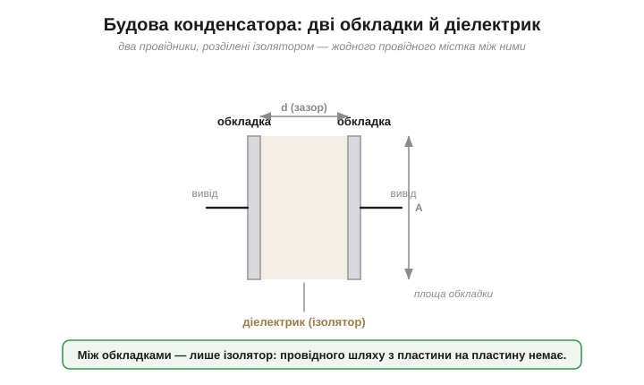
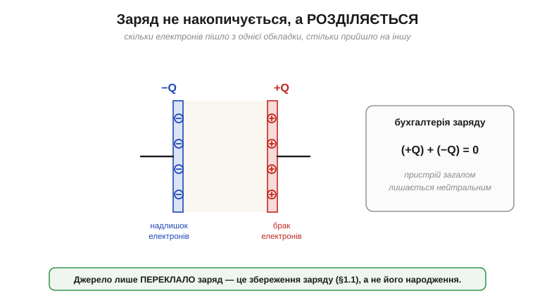
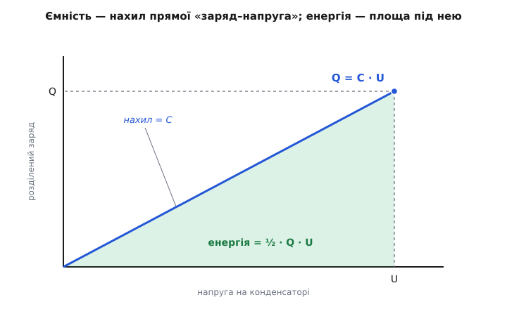
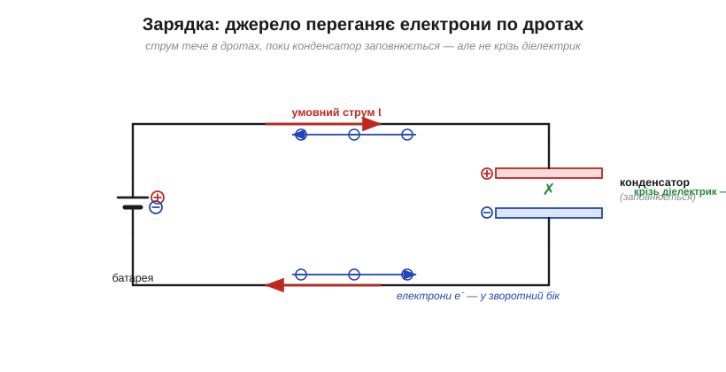
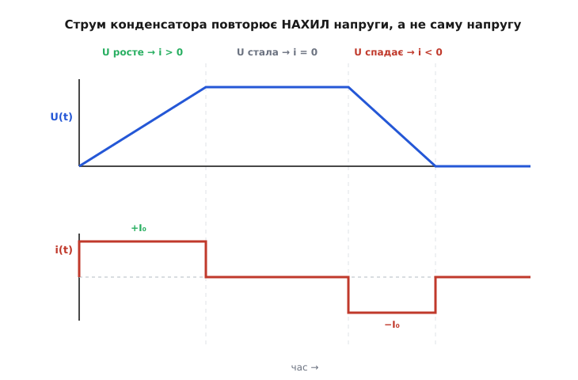
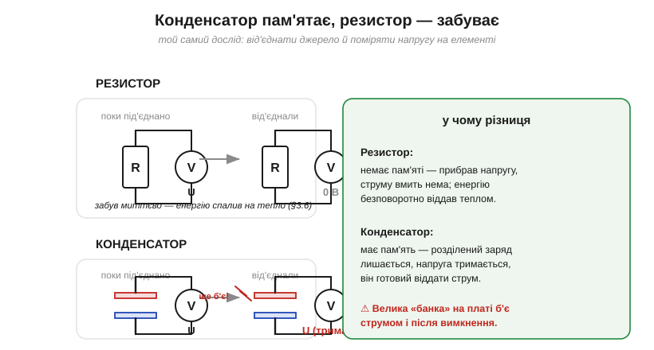

# Конденсатор: пристрій, що тримає енергію в розділеному заряді

<preknowlist>
- [Електричний заряд](book:physics/electric-charge) — додатний і від'ємний заряд, збереження заряду, елементарний заряд e.
- [Електричне поле](book:physics/electric-field) — що таке поле й силові лінії, однорідне поле між двома пластинами.
- [Напруга](book:physics/voltage) — різниця потенціалів і її зв'язок з полем (поле, помножене на відстань).
- [Електричний струм](book:physics/electric-current) — струм як напрямлений рух заряду по провіднику.
- [Закон Ома](book:electronics/ohms-law) — резистор, зв'язок U = I·R і те, що резистор перетворює енергію на тепло.
</preknowlist>

Резистор уміє одне: перетворювати електричну енергію на тепло — і робить це безповоротно. Прибрали напругу — і від нього нічого не лишилось, він нічого не зберіг. Дріт просто переносить заряд з місця на місце. Постає природне питання, без якого не було б ані спалаху фотокамери, ані живлення процесора: чи є деталь, яка **запасає** електричну енергію й **віддає її назад** на вимогу?

Перешкода тут глибша, ніж здається. Заряд не любить накопичуватися: різнойменні заряди притягуються й **знищують** один одного, щойно зійдуться, а однойменні розштовхуються й розлітаються. Скласти запас «чистого» заряду не вийде — природа його розрівнює. Тож єдиний спосіб утримати електрику напоготові — не накопичувати заряд, а **розділити** його: відвести надлишок додатного в одне місце, рівний йому надлишок від'ємного — в інше, і не дати їм зійтися. У цьому натягу між розведеними половинками й живе запас. Пристрій, який робить саме це, називають **конденсатором** — і вся його теорія розгортається з однієї цієї ідеї.

### Будова: два провідники й діелектрик

Конструкція виявляється до сміховинного простою. **Конденсатор** — це **два провідники, розділені ізолятором**. Провідники називають **обкладками** (*plates*), ізолятор між ними — **діелектриком** (*dielectric*; від грец. *dia* «крізь» + «електрика» — речовина, крізь яку поле проходить, а струм ні). Оце й уся деталь; усе інше — лише варіації форми: пласкі пластини, згорнута в рулон металізована плівка, стос керамічних шарів, дві фольги на склі.


*Дві провідні обкладки площею A на відстані d, між ними — діелектрик. Виводи йдуть від кожної обкладки назовні. Провідного містка між обкладками немає — їх розділяє ізолятор, тож коло крізь конденсатор фізично розірване.*

Ім'я деталі несе в собі стару фізику. Спершу її охрестили *condensatore* (звідси й «конденсатор») — Вольта уявляв, ніби пристрій «згущує» електричний флюїд. Сучасна англійська назва *capacitor* походить від латинського *capacitas* «місткість» — і вона точніша: конденсатор не згущує нічого, а має певну **місткість** для розділеного заряду. Звідки взялася сама ідея ловити електрику в таку конструкцію — окрема, повна пригод історія, від скляної банки, що била струмом професорів, до першої пласкої пластини: її варто прочитати в оповіді про [лейденську банку](book:electronics/capacitor/hist-leyden-jar.md).

### Заряд не накопичується — він розділяється

Найперше непорозуміння, яке треба прибрати одразу: конденсатор **не наливається зарядом, як відро водою**. Він тримає на одній обкладці надлишок (+Q), а на другій — рівно такий самий **брак** (−Q). Сумарний заряд усього пристрою лишається **нульовим**: скільки додатного на одному боці, стільки від'ємного на іншому, як у будь-якого нейтрального тіла.

Тому «зарядити конденсатор» означає не долити заряду, а **перекласти** його з обкладки на обкладку. Джерело (батарея) виступає насосом: воно витягує вільні електрони з обкладки, приєднаної до **+**, і жене їх дротом на обкладку, приєднану до **−**. Скільки електронів пішло з правої обкладки (вона стала +Q), рівно стільки прийшло на ліву (−Q). Це прямий наслідок [збереження заряду](book:physics/electric-charge): нового заряду нізвідки не береться, наявний лише розводять по два боки діелектрика.


*Розділення, а не накопичення: надлишок електронів на одній обкладці й рівна їхня нестача на іншій. Пристрій загалом нейтральний. Різнойменні половинки «хочуть» зійтися, але діелектрик їх не пускає — і в цьому втриманому напруженні весь сенс конденсатора.*

Так конденсатор — це машинка для **розділення** заряду й утримання половинок нарізно. Різнойменні заряди притягуються крізь тонкий діелектрик і тримають одне одного: кожен не дає другому розлетітися. Саме тому в конденсатор влазить заряду набагато більше, ніж на самотній провідник тих самих розмірів, — сусідство протилежного заряду «прикріплює» його на місці.

### Поле в зазорі: де насправді лежить запас

Що саме тримає половинки нарізно й де фізично захований запас енергії? Відповідь — у зазорі. Надлишок **+** на одній обкладці створює [електричне поле](book:physics/electric-field), спрямоване через діелектрик до **−** на іншій. Для двох близьких пластин це поле напрочуд **рівномірне**: однакові за густиною лінії йдуть прямо від + до −, і лише скраю трохи «випинаються» назовні (крайовий ефект).


*Між пластинами — однорідне поле (рівні стрілки від + до −), на краях лінії трохи розходяться. Запас енергії живе не в металі обкладок, а саме тут — у полі всередині діелектрика.*

Це важливо для правильної картини: енергія конденсатора зберігається **не на пластинах і не в дротах, а в полі** діелектрика. Заряди на обкладках — лише «якорі», що тримають це поле; сама ж [запасена енергія розподілена в об'ємі поля](book:electronics/capacitor-energy) між ними. Діелектрик тут не пасивний наповнювач: під дією поля його молекули **поляризуються** (розтягуються й розвертаються зарядами), і ця поляризація частково гасить поле, дозволяючи втримати **більше** заряду за тієї самої напруги. Наскільки більше — залежить від матеріалу; чому одні діелектрики в рази «місткіші» за інші, розкриває [окрема стаття про діелектрики](book:electronics/capacitor-dielectrics).

### Від поля до напруги — і головний зв'язок Q = C·U

Поле в зазорі — це місток до напруги. Поле, помножене на відстань між пластинами, дає **різницю потенціалів**, тобто **напругу** на виводах конденсатора. Ланцюжок причин виходить прямий: більше розділеного заряду → сильніше поле в зазорі → вища напруга. Що важливо, зв'язок тут **лінійний** — подвоїш розділений заряд, і напруга подвоїться теж.

Ця пропорційність і є визначальна риса конденсатора. Заряд і напруга йдуть у ногу, а їхнє відношення — стала величина, притаманна саме цій деталі:

```
Q = C · U
```

Величину C називають **ємністю** (*capacitance*) — вона й є та «місткість» з латинського кореня назви. Ємність каже, **скільки заряду доведеться розділити, щоб підняти напругу на один вольт**: більша C — то на кожен вольт треба перегнати більше заряду. Геометрично це **нахил прямої «заряд–напруга»**: у «місткого» конденсатора пряма крута (багато заряду на вольт), у «тісного» — полога.


*Заряд росте пропорційно до напруги: Q = C·U — пряма через нуль, її нахил і є ємність C. Крутіша пряма означає більшу ємність. Заштрихована площа під прямою — це запасена енергія (до неї повернемось нижче).*

Одиниця ємності — **фарад** (Ф, на честь Майкла Фарадея): один фарад — це один кулон заряду на один вольт. Фарад — величина **велетенська**: розділити цілий кулон заряду означало б перегнати шалену кількість електронів, тож у житті конденсатори мають ємності в мільйони й мільярди разів менші — мікрофаради (мкФ, 10⁻⁶), нанофаради (нФ, 10⁻⁹), пікофаради (пФ, 10⁻¹²). Побачивши на схемі «100 мкФ» чи «100 пФ», варто одразу відчувати: це відповідно «доволі місткий» і «зовсім крихітний» конденсатор.

### Ємність: скільки заряду на кожен вольт

Від чого залежить сама C? Не від того, скільки заряду ви розділили (це визначає лише напругу), а **тільки від будови** конденсатора — його геометрії та діелектрика. Для двох пласких пластин:

```
C = ε · A / d
   A — площа перекриття обкладок
   d — відстань між ними (товщина діелектрика)
   ε — діелектрична проникність матеріалу між ними
```

Логіка формули читається просто. Більша площа A — більше місця, де осідає розділений заряд, тож на той самий вольт його влазить більше (C росте). Менша відстань d — обкладки ближче, притягання крізь зазор сильніше, кожна половинка міцніше «тримає» іншу, і знову за той самий вольт розділяється більше заряду (C росте). Кращий діелектрик (більша ε) — сильніша поляризація гасить поле й дозволяє втримати ще більше. Ось звідки три важелі будь-якого конденсатора: **площа, тонкість зазору й матеріал**. Повне виведення цієї формули з поля й геометрії розгортає [стаття про ємність](book:electronics/capacitance).

**Приклад (чому фарад такий великий).** Візьмімо дві пластини площею з поштову марку, A = 4 см² = 4·10⁻⁴ м², на відстані d = 0.1 мм = 1·10⁻⁴ м, з повітрям між ними (ε ≈ ε₀ = 8.85·10⁻¹² Ф/м):

```
C = ε₀ · A / d
C = (8.85 × 10⁻¹²) × (4 × 10⁻⁴) / (1 × 10⁻⁴)
C = 3.5 × 10⁻¹¹ Ф  =  35 пФ
```

Пристойні за розміром пластини дають лише **35 пікофарад** — мізерну частку фарада. Ось чому, щоб отримати практичні мікрофаради, конденсатори будують хитро: величезну площу згортають у рулон або складають стосом сотень шарів, а зазор роблять якнайтоншим і заповнюють діелектриком з високою ε. Уся інженерія конденсатора — це боротьба за площу й тонкість зазору в малому об'ємі.

### Скільки енергії й чому половина

Тепер повернімося до заштрихованої площі під прямою «заряд–напруга» — це і є запасена енергія. Чому саме площа? Заряджати порожній конденсатор спершу легко: перші порції заряду переходять майже задарма, бо напруга ще близька до нуля. Та що більше заряду вже розділено, то вища напруга — і то важче переганяти кожну наступну порцію проти цієї напруги. Робота на весь процес — це сума всіх цих порцій, тобто **площа трикутника** під прямою Q = C·U:

```
E = ½ · Q · U  =  ½ · C · U²
```

Множник **½** — не випадковий і не косметичний: він відображає, що напруга під час заряджання зростала від нуля до кінцевої, тож у середньому заряд долав лише **половину** остаточної напруги. Саме тому енергія — половина добутку Q·U, а не весь добуток.

**Приклад (запас у згладжувальному конденсаторі).** Конденсатор C = 1000 мкФ у блоці живлення заряджений до U = 15 В:

```
E = ½ · C · U²
E = ½ × (1000 × 10⁻⁶) × 15²
E = ½ × 10⁻³ × 225
E = 0.11 Дж
```

Одна десята джоуля здається дрібницею, та коли вона віддається за мікросекунди, миттєва потужність величезна — саме тому такий конденсатор рятує живлення в провалах і тому ж він небезпечний навіть після вимкнення. Квадрат напруги у формулі означає ще одне: **напруга важливіша за ємність** — удвічі вища напруга запасає вчетверо більше енергії. Детальніше про запас і його віддачу — у [статті про енергію конденсатора](book:electronics/capacitor-energy).

### Як конденсатор заряджається в часі

Досі ми питали «скільки», а не «як швидко». А заряджання **не миттєве**: заряд треба фізично перегнати дротами, і будь-яке коло має опір, що обмежує струм. Під'єднайте порожній конденсатор до джерела через резистор — і напруга на ньому підійматиметься не стрибком, а плавною кривою.


*Джерело відкачує електрони з однієї обкладки й накачує на іншу. Струм тече **в дротах**, поки конденсатор дозаряджається, але **не крізь діелектрик** — заряду там не перейти. Спершу різниця напруг велика, струм великий; що ближче напруга конденсатора до напруги джерела, то менший струм.*

Крива виходить характерна — **експонента**: спершу, коли конденсатор порожній, різниця напруг велика й струм великий, тож напруга росте швидко; далі, як конденсатор наздоганяє джерело, різниця тане, струм спадає, і підйом уповільнюється, асимптотично підходячи до напруги джерела. Швидкість цього процесу задає єдина величина — добуток опору на ємність, **стала часу** τ = R·C: за час τ конденсатор проходить близько 63 % шляху до кінцевої напруги, за 5τ його вважають зарядженим. Чому крива саме експонента й звідки береться τ, докладно розбирає [стала часу RC](book:electronics/rc-time-constant); тут досить утримати образ: заряджання плавне, а його темп задають R і C разом.

### Головний закон: струм іде за зміною напруги

Зберімо спостереження в одне точне правило — і воно виявиться серцем усієї схемотехніки конденсатора. Струм у колі конденсатора тече лише тоді, коли його напруга **змінюється**, і тим більший, чим швидша ця зміна:

```
i = C · ΔU/Δt
   ΔU/Δt — швидкість зміни напруги (вольтів за секунду)
```

Прочитаймо цей закон по частинах, бо з нього випливає вся поведінка деталі.


*Поки напруга росте зі сталою швидкістю — тече сталий додатний струм (конденсатор заряджається); поки напруга тримається незмінною — струму немає взагалі; поки напруга спадає — струм тече у зворотний бік (конденсатор розряджається). Струм повторює не саму напругу, а її **нахил**.*

**Стала напруга → струму немає.** Якщо напруга не змінюється (ΔU/Δt = 0), струм дорівнює нулю. Заряджений до постійної напруги конденсатор поводиться як **розрив кола**: постійний струм крізь нього не тече. Тому кажуть, що конденсатор **не пропускає постійний струм** — точніше, блокує сталу складову, лишаючи лише коливання. На цьому стоїть розв'язка сигналу по змінному струму: конденсатор «зрізає» постійний рівень і пропускає далі тільки зміни.

**Швидка зміна → великий струм.** Що різкіший стрибок напруги, то більший струм конденсатор віддає чи вбирає. На цьому тримається **розв'язувальний конденсатор** біля кожної мікросхеми: для повільних процесів він майже невидимий, а на різкий кидок споживання миттєво віддає свій запас, підпираючи живлення.

**Приклад (струм від різкого фронту).** Розв'язувальний конденсатор C = 100 нФ, напруга на якому просідає на 0.2 В за 100 нс (типовий швидкий фронт цифрового кола):

```
i = C · ΔU/Δt
i = (100 × 10⁻⁹) × (0.2 / 100 × 10⁻⁹)
i = 100 × 10⁻⁹ × 2 × 10⁶
i = 0.2 А
```

Крихітний конденсатор на коротку мить віддає **200 мА** — саме така підпора й потрібна чіпу в момент перемикання. Це ж пояснює, чому реакція конденсатора залежить від частоти: що швидші коливання, то легше крізь нього «протікає» струм. Формально це описують [ємнісним опором](book:electronics/capacitive-reactance), що спадає зі зростанням частоти; поки достатньо правила «реагує на зміну, а не на рівень».

### Пам'ять: чим конденсатор не схожий на резистор

Ось найглибша відмінність конденсатора від резистора. **Резистор не має пам'яті**: прибрали напругу — і струму миттєво нема, він нічого не зберіг, бо всю енергію безповоротно перетворив на [тепло](book:physics/joule-heating). **Конденсатор має пам'ять**: зарядіть його й **від'єднайте** — розділений заряд нікуди не дінеться, діелектрик не дає половинкам зійтися, і напруга на виводах **лишається** надовго.


*Той самий дослід для обох деталей. Від'єднали джерело — на резисторі напруга миттєво нуль (він «забув»), а заряджений конденсатор тримає напругу й готовий віддати струм (він «пам'ятає»). Резистор енергію витрачає на тепло; конденсатор запасає й повертає.*

Ця пам'ять — і користь, і небезпека. Користь: конденсатор згладжує провали живлення, бо тримає запас напоготові. Небезпека пряма: **великий конденсатор лишається зарядженим і після вимкнення приладу**. У блоках живлення, спалахах, підсилювачах він годинами тримає напругу, здатну вдарити. Тому в сервісі діє тверде правило: перш ніж лізти руками в схему — **розрядити** великі конденсатори, бо небезпечний саме [короткий потужний струм крізь тіло](book:physics/current-safety), який заряджений конденсатор віддасть миттєво. Заряджений конденсатор — це маленька лейденська банка у вас на платі.

> 🔧 **Навіщо це.** На «пам'яті» конденсатора стоїть половина практичної електроніки. Він **згладжує** пульсації після випрямляча, **підпирає** живлення чіпа під час кидків струму, **зберігає** аналогове значення у схемах вибірки-зберігання, **тримає** біт у комірці динамічної пам'яті (DRAM — це буквально мільярди крихітних конденсаторів). Усе це — та сама здатність утримати розділений заряд, коли джерело відвернулося.

### Реальний конденсатор — не ідеальний

Досі ми говорили про ідеальний конденсатор — чисту ємність. Реальна деталь має до неї непрохані додатки, і в серйозних задачах саме вони визначають, чи спрацює схема.

- **Послідовний опір (ESR).** Обкладки, виводи й контакти мають опір, який стоїть **послідовно** з ємністю. Він розігріває конденсатор на змінному струмі й обмежує, наскільки швидко той віддає запас. Для розв'язки й фільтрів живлення малий ESR критичний.
- **Послідовна індуктивність (ESL).** Виводи й обкладки — це ще й маленька котушка. На дуже високих частотах ESL бере гору, і конденсатор перестає бути конденсатором — тому поряд часто ставлять кілька різних за розміром, щоб перекрити весь діапазон частот.
- **Витік.** Жоден діелектрик не ідеальний ізолятор: крізь нього тихо тече мізерний струм витоку, і від'єднаний конденсатор поволі саморозряджається. Тому «пам'ять» не вічна, а в електролітичних конденсаторів витік помітно більший.
- **Діелектрична абсорбція.** Частина заряду «залипає» в поляризованому діелектрику. Розрядіть конденсатор накоротко, приберіть перемичку — і за хвилину на виводах знову з'явиться напруга, ніби нізвідки. Це [діелектрична абсорбція](book:electronics/dielectric-absorption) (ефект пам'яті), небезпечна у точних вимірювальних схемах і в тих самих високовольтних конденсаторах, які «оживають» після розрядки.
- **Пробій.** Перевищиш граничну напругу — і поле в діелектрику стане завеликим, він **пробивається наскрізь**, і конденсатор гине, часто коротким замиканням. Тому кожен конденсатор має паспортну **робочу напругу**, яку не можна переступати.

Усі ці неідеальності разом складають портрет реального конденсатора; докладний їх розбір — у [статті про паразитні параметри](book:electronics/capacitor-parasitics). Головне для інтуїції: ідеальна «чиста ємність» — це навчальна межа, а на високих частотах, великих струмах і точних вимірах поводяться вже додатки.

### Чому конденсаторів так багато: компроміс діелектрика

У шухляді конденсатори бувають геть різні — крихітні керамічні цятки, алюмінієві бочечки, руді танталові крапельки, великі плівкові бруски. Причина одна: неможливо мати водночас **велику ємність, малий об'єм, високу напругу, стабільність і низьку ціну** — ці вимоги тягнуть у різні боки. Кожен тип конденсатора вибирає свій кут цього компромісу, і диктує вибір саме **діелектрик**.

| Тип | Діелектрик | Полярний | Ємність в об'ємі | Стабільність | Слабина |
|---|---|---|---|---|---|
| Кераміка C0G/NP0 | параелектрик | ні | мала | відмінна | дорого за велику ємність |
| Кераміка X7R/X5R/Y5V | сегнетоелектрик (BaTiO₃) | ні | велика | погана | ємність «пливе» від напруги, температури, часу |
| Алюмінієвий електроліт | оксид алюмінію | **так** | дуже велика | середня | тече, сохне з роками, великий ESR |
| Тантал | оксид танталу | **так** | велика, щільна | добра | гине коротким замиканням, може спалахнути |
| Плівка | полімерна плівка | ні | мала | відмінна | фізично великий |

Найпоширеніший сьогодні — **багатошаровий керамічний** (MLCC): величезну площу в ньому складають стосом сотень тонких шарів. Але кераміка буває двох дуже різних характерів. **Клас I (C0G/NP0)** стабільний як скеля, зате місткість мала. **Клас II (X7R, X5R, Y5V)** дає в десятки разів більше ємності в тому ж корпусі, але його ємність **крадькома просідає** під робочою напругою, гуляє від температури й повільно спадає з віком — тож номіналу на корпусі не можна вірити буквально. Коли який брати й чому клас II «бреше», докладно розбирає вставка про [класи кераміки MLCC](book:electronics/capacitor/comp-mlcc.md); окремо ефект просідання під напругою — [DC bias](book:electronics/dc-bias-capacitance).

Там, де потрібні великі ємності для згладжування живлення, беруть **електролітичні** — [алюмінієві бочечки](book:electronics/electrolytic-cap) з рекордною ємністю в об'ємі, або щільніші й стабільніші **[танталові](book:electronics/tantalum-capacitor)**. Обидва **полярні**: у них є плюс і мінус, і ввімкнути їх «навпаки» — найшвидший спосіб знищити (електроліт закипає, корпус здувається чи вибухає, тантал ще й спалахує). Через це на схемі полярний конденсатор [малюють інакше](book:electronics/component-symbols) за неполярний — однією зігнутою обкладкою й знаком **+**, щоб орієнтацію не переплутати.

### Послідовно й паралельно — навпаки до резисторів

Коли конденсаторів кілька, їхня спільна ємність складається за правилами, **дзеркальними до резисторів**. Це не збіг, а прямий наслідок геометрії.

**Паралельно** (обидва під однією напругою) ємності **додаються**: `C = C₁ + C₂ + …`. Причина проста — паралельне з'єднання рівносильне збільшенню площі обкладок, а більша площа означає більшу ємність.

**Послідовно** (один за одним) додаються **обернені** величини: `1/C = 1/C₁ + 1/C₂ + …`, тож спільна ємність **менша** за найменшу. Тут той самий заряд мусить пройти крізь обидва конденсатори (вони діляться ним), а сумарна напруга — це сума напруг на кожному, тож на той самий заряд припадає більша напруга — тобто менша ємність. Заразом послідовне з'єднання ділить напругу між конденсаторами, тож ним іноді набирають вищу робочу напругу з деталей на нижчу. Докладніше — у [статті про послідовне й паралельне з'єднання конденсаторів](book:electronics/capacitors-series-parallel).

### Як прочитати й вибрати конденсатор

На конденсаторі рідко пишуть номінал словами — місця нема. Дрібні керамічні носять тризначний код на кшталт `104`, де перші дві цифри — значущі, третя — кількість нулів, а база — пікофаради (`104` = 10 з чотирма нулями = 100 000 пФ = 100 нФ). Поряд бувають літера допуску (`K` — ±10 %) і код напруги, а SMD-конденсатори мають ще й окремий чотиризначний код **розміру** корпусу. Як усе це декодувати з першого погляду, зведено у вставці про [маркування й типорозміри](book:electronics/capacitor/comp-marking-sizes.md).

Вибір же конденсатора під задачу — це щоразу відповідь на три питання:

- **Скільки ємності** треба на потрібній частоті (для розв'язки й накопичення — багато, для точного таймінгу — рівно стільки, скільки задано).
- **Яка робоча напруга** в колі — і взяти конденсатор із запасом над нею. Для класу II запас особливо важливий, бо його ємність падає під напругою: народне правило — брати конденсатор на напругу щонайменше вдвічі вищу за робочу.
- **Який характер** потрібен: незмінна, точна ємність (генератори, фільтри, таймери) — тільки стабільний C0G; «якомога більше ємності, точність байдужа» (розв'язка, згладжування) — клас II або електроліт.

> 🔧 **Навіщо це.** Найчастіша прикра помилка — поставити конденсатор «впритул» по напрузі. Він працює на столі, а в полі від першого ж кидка напруги пробивається, часто коротким замиканням, яке валить усе живлення плати. Запас по напрузі — не марнотратство, а страховка; те саме стосується запасу по ємності для класу II, який під навантаженням віддасть менше, ніж написано на корпусі.

### Конденсатор виникає й там, де його не ставили

Означення нічого не каже про спеціальну деталь — лише «два провідники з ізолятором між ними». А отже, конденсатор з'являється **скрізь**, де поряд опинилися два провідники, навіть якщо ми його туди не ставили. Дві сусідні доріжки на платі, дві жили в кабелі, вивід мікросхеми й корпус, провід над землею — це все пари провідників, розділені повітрям чи пластиком, тобто крихітні **паразитні** конденсатори (*parasitic capacitance*).

Зазвичай вони мізерні. Та головна властивість конденсатора нікуди не дівається — він реагує на **зміну** напруги, тож на швидких сигналах паразитна ємність прокидається. Різкий перепад напруги на одній доріжці наводить струм у сусідній через їхню взаємну ємність — це [ємнісне наведення](book:physics/capacitive-coupling) (*crosstalk*): доріжки ніби й не з'єднані, а сигнал «протікає» з однієї в іншу крізь повітряний конденсатор між ними. Цю фізику не можна вимкнути — лише врахувати в розведенні плати. Але та сама ідея працює й на користь: **ємнісний сенсор дотику** (екран телефона, кнопка без механіки) — це вимірювання того, як ваш палець, ще один провідник, змінює ємність між доріжками під склом.

### Що таке конденсатор, якщо коротко

Уся деталь виростає з єдиної ідеї — **розділити заряд і не дати половинкам зійтися**. Звідси випливає все інше, ланцюгом: розділений заряд створює поле в зазорі → поле дає напругу → відношення заряду до напруги є ємність C, стала деталі (Q = C·U) → у полі запасено енергію ½C·U² → струм тече лише коли напруга змінюється (i = C·ΔU/Δt), тож постійний струм конденсатор блокує, а зміни пропускає → від'єднаний, він **пам'ятає** свій заряд. Реальна деталь до цього додає опір, індуктивність, витік і межу напруги, а безліч типів конденсаторів — це різні відповіді на один компроміс між ємністю, об'ємом, напругою й стабільністю. І кожен із них, від керамічної цятки до силової бочки, — це та сама лейденська банка, стиснута до розмірів вашої плати.
