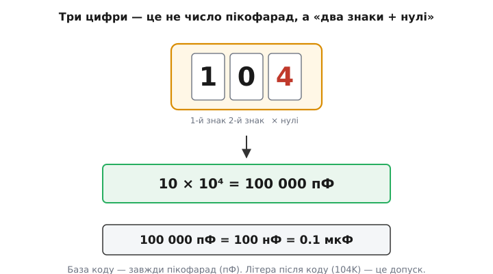
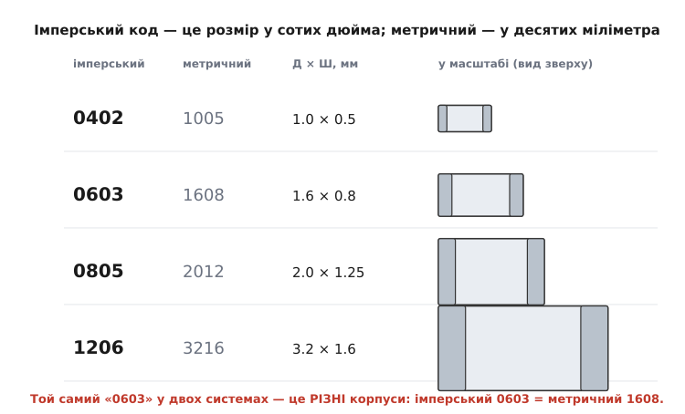

# 🔌 Маркування й типорозміри конденсаторів

Дістаньте з шухляди конденсатор — і ви наштовхнетеся на дрібну загадку. На резисторі бодай є кольорові смужки чи число з «к» або «М»; а тут — три голі цифри `104`, інколи літера поруч, інколи геть нічого. А якщо це крихітна прямокутна крапка для поверхневого монтажу, то на ній не написано **взагалі нічого** — самий лише корпус розміром із макове зерно. Як зрозуміти, що в руках: 104 пікофаради? 104 нанофаради? І який це взагалі типорозмір, щоб замовити заміну?

Загадка ця має просту відгадку, бо за маркуванням стоїть не випадок, а та сама економія місця, що й усюди в електроніці: на деталі завбільшки з рисове зерно не вмістиш «100 нанофарад, ±10 %, 50 вольтів» — тож усе це стискають у кілька символів за домовленістю (стандарт *EIA-198*, від англ. *Electronic Industries Alliance* — об'єднання виробників електроніки). Розберімо цю домовленість так, щоб номінал будь-якого конденсатора читався з першого погляду, а назва корпусу більше ніколи не плутала.

## Три цифри — це показник степеня, а не число

Найперша пастка — прочитати `104` як «сто чотири». Це майже завжди хибно. Три цифри на конденсаторі — це **не саме число**, а **запис у скороченому вигляді**: перші дві цифри — значущі знаки, третя — **скільки нулів дописати** (тобто показник десятого степеня). База — завжди **пікофарад** (пФ), хоч її ніде й не пишуть.

Отже, `104` читається так: беремо `10`, дописуємо `4` нулі.

```
104  →  10 × 10⁴  =  100 000 пФ
```

А далі переводимо в зручніші одиниці звичайними кроками по тисячі (1 нФ = 1000 пФ, 1 мкФ = 1000 нФ):

```
100 000 пФ  =  100 нФ  =  0.1 мкФ
```

Ось чому `104` — це **100 нФ**, найужиточніший конденсатор у всій цифровій техніці: саме його ставлять для [розв'язки живлення](topic:electronics/capacitor) біля кожної мікросхеми. Побачивши `104`, досвідчена людина навіть не рахує — впізнає його, як впізнають знайоме обличчя.


*Три цифри коду — це два значущі знаки плюс кількість нулів (показник степеня), а не саме число. Червона третя цифра — скільки нулів дописати. База завжди пікофарад; перевід у нано- й мікрофаради — кроками по тисячі.*

Перевірмо метод ще на кількох кодах, щоб він остаточно вклався:

```
103  →  10 × 10³  =  10 000 пФ   =  10 нФ
220  →  22 × 10⁰  =  22 пФ              (нуль нулів — тобто просто 22)
221  →  22 × 10¹  =  220 пФ
472  →  47 × 10²  =  4 700 пФ    =  4.7 нФ
475  →  47 × 10⁵  =  4 700 000 пФ =  4.7 мкФ
```

Зверніть увагу на `220` проти `22`: третя цифра `0` означає «нуль нулів», тобто множник 10⁰ = 1, а не «допиши один нуль». Тому `220` — це **22 пФ**, а не 220 пФ. А якщо на конденсаторі справді написано просто `22` (дві цифри, без третьої), то це теж **22 пФ** — малі номінали часто пишуть прямо, без коду.

> 🔧 **Навіщо це.** Це найчастіша точкова помилка початківця: замість `104` (100 нФ) поставити деталь на 104 пФ — тобто **в мільйон разів меншу ємність**. Розв'язувальний конденсатор такого номіналу просто не працюватиме: схема ловитиме завади, мікроконтролер скидатиметься на ходу. Уміння читати код «з льоту» рятує годину налагодження ще до ввімкнення живлення.

### Дробові номінали: літера «R» замість коми

Що робити з конденсаторами **менше 10 пФ**, де тризначний код незручний? Для них кому (десятковий роздільник) ставлять **на місце літери `R`**. Літера сидить там, де мала б бути кома:

```
4R7  →  4.7 пФ
1R0  →  1.0 пФ
0R5  →  0.5 пФ
R47  →  0.47 пФ        (R на початку — нуль цілих)
```

Це та сама ідея, що й у резисторів (`4R7` = 4.7 Ом), тож око, звикле до одного, легко читає й інше. Поряд можна зустріти й **чотиризначний** код: тоді перші **три** цифри — значущі, остання — кількість нулів (наприклад, `1002` = 100 × 10² = 10 000 пФ = 10 нФ). Він трапляється на точних конденсаторах, де треба три значущі знаки.

## Літера-допуск: наскільки точне це число

Якщо після коду стоїть літера — `104K`, `220J`, `103M` — це **допуск** (англ. *tolerance*): наскільки реальна ємність може відхилятися від заявленої. Логіка проста: що точніше зроблено, то менше відхилення й то «раніша» літера в таблиці.

```
B  ±0.1 %        F  ±1 %        K  ±10 %
C  ±0.25 %       G  ±2 %        M  ±20 %
D  ±0.5 %        J  ±5 %        Z  +80 % / −20 %
```

Найчастіші в реальних деталях — `J` (±5 %), `K` (±10 %) і `M` (±20 %). Для розв'язки точність не важлива, тож там зазвичай `K` чи `M` — і це нормально: конденсатору, що гасить стрибки струму, байдуже, 100 нФ у ньому чи 118 нФ. А от у частотозадавальному колі (фільтр, генератор) кожен відсоток зсуває частоту — там беруть `J` або точніше. Літера `Z` із її дикою несиметрією (+80 %/−20 %) видає дешевий керамічний конденсатор «класу 2», де ємність сильно гуляє від температури й напруги; для розв'язки годиться, для точних задач — ні.

> 🔧 **Навіщо це.** Допуск підказує **призначення** деталі ще до того, як ви дізналися номінал. Бачите `M` чи `Z` — це майже напевно розв'язка або фільтр живлення, де важливо «щоб було багато», а не «щоб точно». Бачите `F`/`G`/`J` — хтось свідомо платив за точність, отже, конденсатор стоїть там, де від його значення залежить поведінка схеми. Замінюючи такий, не ставте дешевший: зміните частоту чи затримку.

## Код напруги: на скількох вольтах він не пробʼється

Кожен конденсатор має **граничну робочу напругу**: перевищиш — і [діелектрик пробиває наскрізь](topic:electronics/capacitor), деталь гине (часто коротким замиканням). На більших виводних конденсаторах напругу пишуть прямо: `50V`, `400V`. Але на дрібних SMD місця немає, тож EIA-198 кодує її **літерою з цифрою**: цифра задає степінь десятки, літера — значущу частину. Найпотрібніше з таблиці:

```
0J  6.3 В      1C  16 В       1H  50 В       2A  100 В
1A  10  В      1E  25 В       1J  63 В       2C  160 В
                                              2D  200 В
                                              2E  250 В
```

Логіку видно в самому записі: перша цифра `1` дає десятки вольтів, `2` — сотні; літера зсуває значення всередині декади за стандартним рядом. Так `1E` — це 25 В, а `2E` — рівно вдесятеро більше, 250 В. На практиці три коди трапляються найчастіше: `1C` (16 В), `1E` (25 В) і `1H` (50 В) — це звичні напруги цифрових і силових кіл низької напруги.

Залізне правило тут одне: робоча напруга **з добрим запасом** перевищує ту, що буде в колі. У живленні 5 В беруть конденсатор хоча б на 16 В (`1C`), а не «впритул» на 6.3 В — бо стрибки й перехідні процеси легко вискакують вище за номінал, а ще в керамічних конденсаторів ємність **падає під напругою**, тож запас оберігає й ємність, і саму деталь.

> 🔧 **Навіщо це.** Конденсатор, поставлений «впритул» по напрузі, — міна сповільненої дії: працює на столі, а в полі від першого ж кидка напруги пробивається, і то нерідко **коротким замиканням**, яке валить усе живлення плати. Тому запас по напрузі — не марнотратство, а страховка; код напруги на корпусі дає це перевірити за секунду.

## Типорозміри SMD: код — це фізичний розмір

Окрема історія — **корпус** конденсатора для поверхневого монтажу (SMD, англ. *surface-mounted device*). Тут чотири цифри означають уже **не ємність**, а **габарити**. І це головна пастка: один і той самий конденсатор може мати на корпусі тризначний код ємності, а в каталозі — чотиризначний код розміру, і плутати їх не можна.

В **імперській** системі (її ще звуть дюймовою; саме вона за замовчуванням панує в галузі) чотири цифри — це довжина й ширина в **сотих частках дюйма**. `0805` означає 0.08 × 0.05 дюйма. Перевід у міліметри:

```
0805  →  0.08″ × 0.05″  =  2.0 мм × 1.25 мм
```

Найходовіші розміри й їхні точні габарити:

```
імперський   метричний   Д × Ш, мм
   0402         1005       1.0  × 0.5
   0603         1608       1.6  × 0.8
   0805         2012       2.0  × 1.25
   1206         3216       3.2  × 1.6
```


*Корпуси намальовано в єдиному масштабі (вид зверху), світло-сірі торці — металізовані контакти, якими деталь паяється до плати. Видно, як швидко росте площа: від 0402 до 1206 лінійний розмір більший утричі, а площа — майже вдесятеро. Метричний код у другому стовпці — ті самі габарити в десятих міліметра.*

Поряд із імперським кодом у таблиці стоїть **метричний** — той самий розмір, але в **десятих частках міліметра**. Корпус 0805 (дюймовий) — це 2012 у метриці (2.0 мм × 1.2 мм). Здавалося б, дрібниця, але саме тут чигає найгірша плутанина.

> 🔧 **Навіщо це.** Розмір диктує не лише те, чи влізе деталь на плату, а й **чи зможете ви її припаяти руками**. 0805 і 1206 спокійно паяються звичайним паяльником — їх видно, є за що вхопити; це робочі конячки для розв'язки й більших ємностей. 0603 — межа комфортного ручного паяння. А 0402 і дрібніші (0201, 01005) — це вже робота під мікроскопом або тільки машинний монтаж: 0402 завбільшки 1 × 0.5 мм легко загубити, чхнувши. Тож, проєктуючи плату, яку паятимете самі, свідомо беріть 0603–0805, а не наймодніший дрібний корпус.

### Дюйми проти міліметрів: пастка однакових чисел

А тепер найтонше місце. Метричний код виглядає **так само**, як імперський, — чотири цифри. І деякі числа збігаються, означаючи геть різні корпуси:

```
0603 імперський  =  1.6 мм × 0.8 мм
0603 метричний   =  0.6 мм × 0.3 мм   →   це насправді імперський 0201!
```

Тобто «конденсатор 0603» без уточнення системи — двозначна вказівка: в одному прочитанні це звична деталь на 1.6 мм, в іншому — крихта вчетверо коротша, яку руками й не вхопиш. На щастя, в усьому світі за замовчуванням мають на увазі **імперський** код, тож «0603» майже завжди означає 1.6 × 0.8 мм. Але коли працюєте з документацією азійських виробників (особливо японських), де часто наводять саме метрику, переконайтеся, у якій системі подано розмір, — інакше можна замовити корпус, що не сяде на ваші контактні майданчики.

Запам'ятати легко за одним опорним рядком: **імперський 0603 = метричний 1608**. Тримаючи цю пару в голові, ви завжди впізнаєте, у якій системі число: якщо бачите «1608» — це точно метрика й це звичний 0603; якщо «0201» — імперський дрібний корпус, він же метричний 0603.

## Виводні конденсатори: тут зазвичай простіше

На «класичних» виводних конденсаторах (англ. *through-hole* — ті, що встромляються ніжками в отвори) місця більше, тож маркування людяніше. Дискові керамічні носять той самий тризначний код плюс літери допуску й напруги — усе, що ми вже вміємо читати. Плівкові й більші часто мають **прямий** напис: `100n` (100 нФ), `0.1µ`, `2µ2` (де `µ` — знову роздільник, тобто 2.2 мкФ), а поруч `±10%` і `63V` словом, без шифру.

Окремо стоять **полярні** конденсатори — електролітичні й танталові, що їх **не можна вмикати навпаки**. На них завжди явно позначено вивід:

- **алюмінієві електролітичні** (бочечки) — мінус позначено **смугою зі знаками «−»** збоку корпусу; номінал і напруга написані прямо, як-от `470µF 25V`;
- **танталові** SMD (прямокутні крапельки) — навпаки, **смуга позначає плюс**; це класична пастка, бо в електролітичних смуга — це мінус, а в танталових — плюс.

> 🔧 **Навіщо це.** Переплутати полярність — означає ввімкнути полярний конденсатор задом наперед, а це найшвидший спосіб його знищити: електроліт закипає, корпус здувається або **вибухає** (танталовий — ще й спалахує). Тому перше, що робите з полярним конденсатором, — знаходите смугу й **згадуєте, який це тип**: у «бочечки» смуга — мінус, у танталової крапельки — плюс. Одна ця звичка береже і деталь, і пальці.

## Як це читати на практиці — три кроки

Зведімо все в простий порядок дій, коли в руках незнайомий конденсатор.

1. **Знайдіть код ємності.** Три цифри → два знаки плюс стільки нулів (база пФ): `104` = 100 нФ. Літера «R» — це кома: `4R7` = 4.7 пФ. Дві цифри без третьої — просто пікофаради: `22` = 22 пФ.
2. **Прочитайте суфікси, якщо є.** Літера допуску (`J` ±5 %, `K` ±10 %, `M` ±20 %) і код напруги (`1C` 16 В, `1E` 25 В, `1H` 50 В) — або прямий напис `50V`.
3. **Визначте корпус (для SMD) і полярність.** Чотиризначний код у каталозі — це розмір: `0805` = 2.0 × 1.25 мм (імперський за замовчуванням). Є смуга на корпусі — конденсатор полярний: у «бочечки» смуга = мінус, у танталовій крапельці = плюс.

Якщо ж на SMD-керамиці немає **жодної** позначки — це не брак, а норма: на корпус 0402 чи 0603 номінал фізично не вміщується, тож виробник його просто не друкує. Дізнатися номінал такого конденсатора можна лише з документації плати (з її переліку елементів) або **вимірявши** його приладом. Тому на платах, які потім доведеться лагодити, ці значення тримають у супровідних кресленнях — інакше потім ніхто не скаже, що то за безіменна крапка біля мікросхеми.
