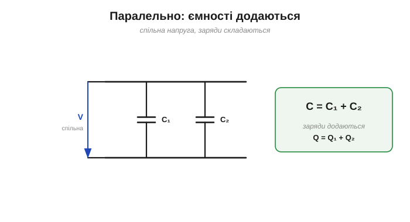
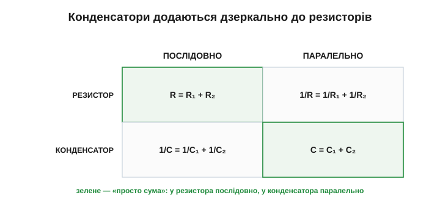
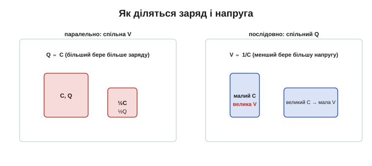

# Послідовно й паралельно (на відміну від резисторів)

Конденсатори, як і резистори, часто з'єднують по кілька — щоб дістати потрібну ємність, підняти допустиму напругу чи поєднати швидкий і ємний. І тут на нас чекає сюрприз: правила додавання для конденсаторів **дзеркальні** до правил для резисторів. Там, де резистори додаються просто, конденсатори додаються через обернені — і навпаки. Зрозумівши, *чому* так (а не визубривши формули), ви більше ніколи їх не сплутаєте. Це той самий прийом комбінування, що й [з'єднання резисторів](topic:electronics/series-connection), — лише з протилежними знаками; і саме цей контраст найкраще все й прояснює.

### Паралельно: ємності додаються

З'єднаймо два конденсатори **паралельно** — обидва виводи до тих самих двох точок. Тоді на обох однакова напруга V, а кожен набирає свій заряд (Q₁ = C₁·V і Q₂ = C₂·V). Сумарний розділений заряд — це сума, тож і сумарна ємність — сума:

```
паралельно:   C = C₁ + C₂ + C₃ + …
```


*Паралельно — спільна напруга, заряди складаються. Два конденсатори поводяться як один із сумарною ємністю C₁ + C₂. Чим більше паралельних — тим більша загальна ємність.*

Чому так — видно прямо з [формули ємності](topic:electronics/capacitance). Поставити два конденсатори поряд — це майже те саме, що **збільшити площу обкладок**: сумарна площа стала більшою, а зазор і діелектрик ті самі, тож C зростає. Паралельне з'єднання — це спосіб «домалювати площі».


*Паралельні конденсатори — це фактично одна пара обкладок більшої сумарної площі A. Оскільки C ∝ A, ємності просто складаються.*

**Приклад (паралельно).** 10 мкФ паралельно з 1 мкФ:

```
C = C₁ + C₂ = 10 мкФ + 1 мкФ = 11 мкФ
```

Просто сума. Саме так нарощують ємність, коли одного конденсатора замало.

Паралель — це й спосіб набрати **велику** ємність, коли однієї деталі бракує: банк із десяти конденсаторів по 1000 мкФ дає 10 000 мкФ (10 мФ). Бонус — кожен бере на себе частину пульсівного струму, тож і нагрів від [послідовного опору ESR](topic:electronics/capacitor-parasitics) ділиться між усіма, а не лягає на одну деталь. Тому в потужних блоках живлення часто бачимо не один велетенський конденсатор, а **гроно** менших паралельно — так і дешевше, і надійніше, і прохолодніше.

### Послідовно: додаються обернені

Тепер з'єднаймо два конденсатори **послідовно** — ланцюжком, один за одним. Тут навпаки: через обидва проходить **однаковий** заряд Q (заряд, що пішов з лівої обкладки одного, осів на правій другого), а **напруга ділиться** між ними (V = V₁ + V₂).

Чому заряд той самий? Внутрішні обкладки сусідніх конденсаторів з'єднані ізольованою ділянкою, на якій [сумарний заряд зберігається](topic:physics/electric-charge): скільки заряду джерело зняло із зовнішньої обкладки крайнього конденсатора — рівно стільки навелося на кожній наступній парі. Тож усі конденсатори ланцюжка несуть **той самий** заряд Q, хай якою буде їхня ємність. А от напруга на кожному виходить своя: V = Q/C, тож на меншій ємності осідає більша напруга — і це має пряму практичну вагу.

Оскільки V = Q/C, складання напруг дає складання **обернених** ємностей:

```
послідовно:   1/C = 1/C₁ + 1/C₂ + 1/C₃ + …
```

Для двох конденсаторів це зручно переписати як:

```
C = (C₁ · C₂) / (C₁ + C₂)
```


*Послідовно — спільний заряд, напруги складаються. Загальна ємність **менша за найменшу** з конденсаторів: додавання обернених завжди дає менше. Внутрішні обкладки сусідів несуть рівні протилежні заряди й «не рахуються».*

Зазирнімо у [формулу ємності](topic:electronics/capacitance) і з цього боку. З'єднати конденсатори послідовно — це майже те саме, що **збільшити зазор**: заряд тепер мусить «перестрибувати» через сумарну товщину двох діелектриків. А оскільки C ∝ 1/d, більший ефективний зазор дає **меншу** ємність.


*Послідовні конденсатори — це фактично один із більшим сумарним зазором d. Оскільки C ∝ 1/d, загальна ємність падає нижче за найменшу.*

**Приклад (послідовно).** Два однакові по 10 мкФ:

```
1/C = 1/10 + 1/10 = 2/10        →   C = 5 мкФ
```

Удвічі менше! А 10 мкФ послідовно з 1 мкФ:

```
1/C = 1/10 + 1/1 = 1.1          →   C ≈ 0.91 мкФ
```

Загальна ємність майже дорівнює **меншому** конденсатору — менший «вузьке місце», як і в будь-якому ланцюжку.

### Дзеркало резисторів

Тепер головне порівняння. У резисторів [послідовно опори **додаються**](topic:electronics/series-connection), а [паралельно складаються їхні обернені](topic:electronics/parallel-connection). У конденсаторів усе **точно навпаки**.


*Дзеркало. Резистор: послідовно — сума, паралельно — обернені. Конденсатор: послідовно — обернені, паралельно — сума. Те, що для резисторів «послідовно», для конденсаторів поводиться як «паралельно», і навпаки.*

Це не випадковий збіг, а глибша **двоїстість**. Опір резистора каже, як сильно той опирається усталеному струму; ємність конденсатора каже, скільки заряду він тримає на вольт. Ролі протилежні — одна про потік, друга про запас, — тому й комбінуються дзеркально. Є й зручний місток: ємності паралельних конденсаторів додаються **так само**, як провідності (величини, обернені до опору) паралельних резисторів. А провідність — це і є «легкість проводити». Тож конденсатор у паралелі поводиться, як провідність у паралелі: просто складається. Хто запам'ятає цей зв'язок, той зі знаком уже не помилиться.

> 🔧 **Навіщо це.** Не заучуйте чотири формули — тримайте в голові **фізику**, і знак ніколи не сплутаєте. Конденсатор — це про **площу й зазор**: паралельно нарощуєш площу (більше C), послідовно нарощуєш зазор (менше C). Резистор — це про **довжину провідника** опору: послідовно довший шлях (більше R), паралельно ширший (менше R). Дзеркальність випливає з того, що ємність обернено залежить від зазору, а опір — прямо від довжини. Зрозумів причину — формула згадається сама.

### Як ділиться заряд і напруга

З'єднання впливає не лише на загальну ємність, а й на те, як між конденсаторами розподіляються заряд і напруга.


*Паралельно (спільна напруга): більший конденсатор бере пропорційно **більший заряд** (Q ∝ C). Послідовно (спільний заряд): на меншому конденсаторі осідає **більша напруга** (V ∝ 1/C) — бо V = Q/C, а заряд однаковий.*

**Приклад (розподіл напруги).** З'єднаймо послідовно 1 мкФ і 10 мкФ під 11 В. Заряд на обох однаковий, а напруга ділиться обернено до ємності: на 1 мкФ припадуть аж **10 В**, а на 10 мкФ — лише **1 В**. Менша ємність хапає левову частку напруги! Тому слабка ланка ланцюжка — саме маленький конденсатор: легко не помітити й перевищити його межу. (Паралельно все навпаки: за спільної напруги більший конденсатор просто візьме більший заряд, нікому не загрожуючи.)

Друга половина — про напругу в послідовному ланцюжку — має пряму практичну вагу. Оскільки на меншій ємності падає більша напруга, у ланцюжку **нерівних** конденсаторів один може отримати небезпечно багато й [пробитися](topic:electronics/capacitor-parasitics). Тому послідовні конденсатори або беруть однаковими, або ставлять поряд вирівнювальні (балансувальні) резистори, щоб напруга ділилася порівну.


*Два однакові конденсатори послідовно ділять прикладену напругу навпіл — отже, разом витримують удвічі більшу. Так із низьковольтних деталей складають вузол на вищу напругу (наприклад, [суперконденсатори](book:electronics/supercapacitor)); вирівнювальні резистори стежать, щоб поділ був рівним.*

### Несподіванка: поєднав заряджені — і втратив половину енергії

Ось факт, що дивує навіть досвідчених. Візьмімо заряджений конденсатор C (напруга V, [запасена енергія ½·C·V²](topic:electronics/capacitor-energy)) і з'єднаймо його паралельно з **таким самим, але порожнім**. Заряд перетече й поділиться нарівно, напруга впаде вдвічі (заряд той самий, ємність подвоїлась: V = Q/C). Порахуймо енергію після:

```
W_після = ½ · (2C) · (V/2)² = ¼ · C · V²  =  половина від початкової
```

**Половина енергії зникла** — хоча ми просто з'єднали два конденсатори, без жодного резистора на видноті! Куди вона поділася? У неминучі втрати при перетіканні заряду — на опорі дротів, на іскрі, на випромінювання. Це той самий урок, що й «половина гріє резистор» при [зарядженні через опір](topic:electronics/rc-time-constant): переганяння заряду між ємностями завжди чогось коштує. Практичний висновок: не можна думати, ніби заряд вільно «переливається» між конденсаторами без втрат — саме тому акуратні схеми заряджають ємності керовано, а не коротким замиканням однієї на іншу.

### Навіщо це на практиці

Обидва з'єднання — щоденний інструмент, і кожне вирішує свою задачу.


*Паралельне з'єднання нарощує ємність і поєднує властивості (великий електроліт + дрібна кераміка — це паралель: об'єм плюс швидкість). Послідовне з'єднання піднімає робочу напругу ціною меншої сумарної ємності.*

**Приклад (зібрати проміжний номінал).** Потрібно 15 мкФ, а під рукою лише 10-мікрофарадні. Комбінуємо, як із резисторами: два по 10 мкФ послідовно дають 5 мкФ (1/C = 1/10 + 1/10), а ця пара паралельно з ще одним 10 мкФ — рівно 10 + 5 = **15 мкФ**. Так із кількох однакових деталей складають потрібну ємність.

**Приклад (підняти напругу).** Маємо [суперконденсатори](topic:electronics/supercapacitor) по 2.7 В, а живлення — 5 В. Один такого не витримає (пробій). Два **послідовно** ділять напругу навпіл — по 2.5 В на кожному за 5 В на парі, у межах норми. Ціна — удвічі менша сумарна ємність: два по 1 Ф дають лише 0.5 Ф. Це стандартний прийом для суперконденсаторних збірок, і поряд завжди ставлять вирівнювальні резистори, щоб поділ напруги був точно рівним.

На практиці паралельне з'єднання трапляється на кожному кроці, а послідовне — рідко й обережно. Причина проста: паралель лише додає ємності й нічим не загрожує, тоді як послідовне коло вимагає стежити за поділом напруги (нерівні конденсатори — і слабший пробивається). Тому, побачивши на платі кілька однакових конденсаторів поряд, майже напевно матимете паралель заради більшої ємності; а послідовні збірки — прикмета високовольтних або суперконденсаторних вузлів, де інакше деталі не витримали б напруги.

> 🔧 **Навіщо це.** Паралель — найчастіший хід: коли треба більше ємності, ставлять кілька конденсаторів поряд (та й сама пара [«електроліт + кераміка» біля живлення](topic:electronics/capacitor-uses) — це паралельне з'єднання, де великий дає об'єм, а малий — швидкість завдяки низькому ESL). Послідовне з'єднання рідкісніше й хитріше: до нього вдаються, щоб із доступних низьковольтних конденсаторів зібрати вузол на вищу напругу — але тоді стежать за рівним поділом напруги, інакше слабша ланка пробʼється. Як завжди: спершу — фізика, потім — формула.

Підсумуймо. **Паралельно ємності додаються** (більша сумарна площа), **послідовно складаються їхні обернені** (більший сумарний зазор), і це **дзеркало** правил для резисторів. Паралельне з'єднання дає більше ємності, послідовне — вищу робочу напругу. Розподіл теж дзеркальний: паралельно заряд ділиться пропорційно ємності, послідовно напруга — обернено до неї. І не забуваймо про дрібний, але повчальний сюрприз: саме лише з'єднання двох конденсаторів уже означає десь розгубити частину запасеної енергії — заряд не «переливається» між ємностями задарма.

Послідовне з'єднання, до речі, — стандартний спосіб дати раду одній «окремій породі»: [суперконденсатору](topic:electronics/supercapacitor), ємність якого лічать не пікофарадами й мікрофарадами, а цілими фарадами й навіть тисячами фарад, а робочу напругу — одиницями вольтів. Саме тому такі деталі майже завжди зустрічаються складеними в стовпчики з вирівнювальними резисторами — рівно за правилами, розібраними тут.

---
