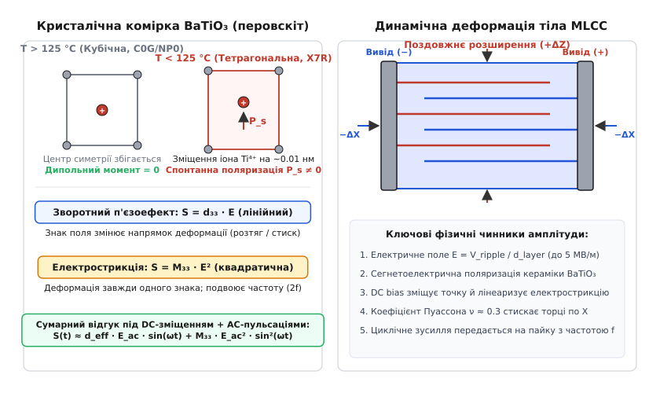
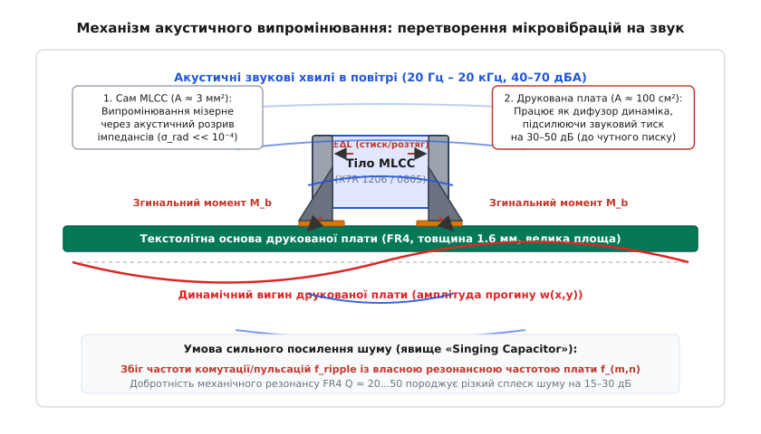
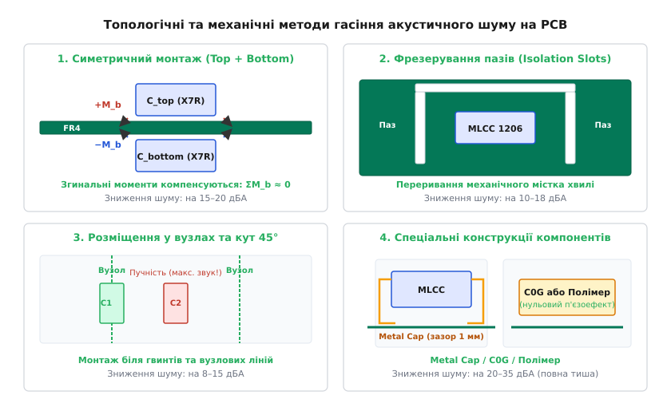
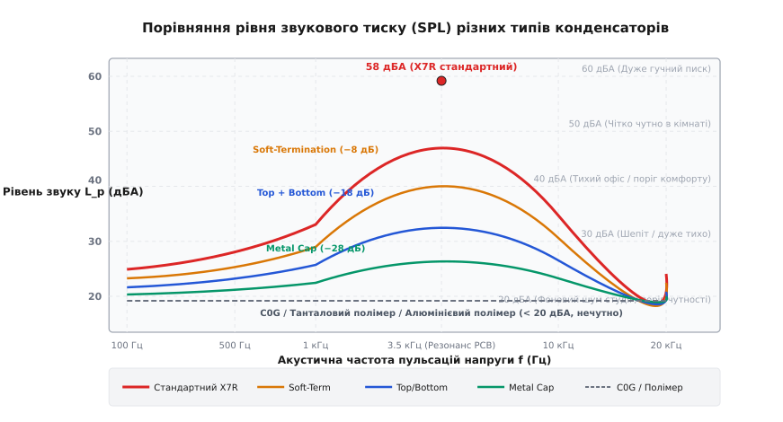

# Акустичний шум керамічних конденсаторів

<preknowlist>
- [Конденсатор](topic:electronics/capacitor) — накопичення заряду, обкладки та діелектрик.
- [MLCC](topic:electronics/mlcc) — багатошарова керамічна структура, паралельне чергування електродів і класи кераміки.
- [DC-bias ефект у конденсаторах](topic:electronics/dc-bias-capacitance) — поведінка сегнетоелектричної кераміки BaTiO₃ під дією електричного поля.
- [П'єзоелектрика та зворотний п'єзоефект](topic:physics/piezoelectricity) — електромеханічне перетворення в кристалах без центра симетрії.
- [PFM та Burst Mode](topic:electronics/pfm-burst-mode) — режими низького навантаження імпульсних перетворювачів із частотами пульсацій у звуковому діапазоні.
</preknowlist>

Під час тестування щойно зібраного безвентиляторного джерела живлення, материнської плати ноутбука чи світлодіодного світильника в тихій кімнаті розробник чує виразний, дратівливий високочастотний писк, тріск або дзижчання на частотах від 1 до 10 кГц. Перша підозра зазвичай падає на силовий дросель або трансформатор — елементи, де обмотки можуть вібрувати під дією сили Лоренца чи магнітострикції феритового осердя. Проте прикладання стетоскопа чи вимірювання за допомогою акустичного зонда ближнього поля виявляє несподіваного винуватця: звук випромінює крихітний керамічний SMD-конденсатор розміром 3.2 × 1.6 мм, у якому взагалі немає рухомих деталей.

У вільному стані, підвішений у повітрі на тонких тестових щупах, цей самий конденсатор під дією змінної напруги вібрує з мікроскопічною амплітудою в частки нанометра (10⁻¹⁰...10⁻⁹ м) і є практично абсолютно безшумним для людського вуха. Проте варто припаяти його жорсткими галтелями припою до друкованої плати зі склотекстоліту FR4, як рівень звукового тиску зростає на 30–50 дБ, сягаючи 50–70 дБА на відстані півметра. Плата перетворюється на високоефективний дифузор акустичного динаміка, що транслює мікровібрації керамічного кристала в повітря.

Це явище в інженерній практиці отримало назву **«співаючих конденсаторів»** (англ. *Singing Capacitors*) або **акустичного шуму MLCC** (*ceramic capacitor audible acoustic noise*). Воно виникає на стику мікроскопічної фізики сегнетоелектричного кристала, хвильової механіки пружних пластин та схемотехнічних режимів імпульсних перетворювачів.

## Кристалографічна природа: п'єзоефект та електрострикція у BaTiO₃

Щоб зрозуміти причину механічного руху твердотільного конденсатора, необхідно зазирнути в кристалічну структуру його діелектрика. Переважна більшість сучасних багатошарових керамічних конденсаторів ([MLCC](topic:electronics/mlcc)) високої ємності класів II та III (діелектрики X7R, X5R, Y5V) виготовляються на основі **титанату барію** (`BaTiO₃`, лат. *barium titanate*) — синтетичної кераміки з кристалічною ґраткою типу перовскіту.

За температур понад точку Кюрі (`T_c ≈ 120...125 °C`) кристал `BaTiO₃` перебуває в параелектричній фазі: елементарна комірка є ідеальним кубом із суворою просторовою центральною симетрією. У такій фазі центри позитивних і негативних електричних зарядів геометрично збігаються, і спонтанна поляризація дорівнює нулю.


*Кристалографічні механізми деформації BaTiO₃. Зліва: фазовий перехід нижче точки Кюрі утворює тетрагональну комірку зі спонтанним диполем Ps. Справа: поздовжнє розширення та поперечне стискання тіла конденсатора під дією електричного поля.*

При охолодженні кераміки нижче точки Кюрі під час спікання відбувається фазовий перехід другого роду: кубічна ґратка спонтанно деформується в тетрагональну, витягуючись уздовж однієї з осей (відношення осей `c/a ≈ 1.01`). Центральний іон титану `Ti⁴⁺` зміщується відносно навколишнього кисневого октаедра `O²⁻` на відстань близько 0.01 нм. Це порушує центральну симетрію кристала й породжує сильний внутрішній спонтанний електричний дипольний момент `P_s`.

У матеріалі утворюються сегнетоелектричні домени з однаковим напрямком поляризації. Наявність нецентросиметричної доменної структури робить титанат барію активним електромеханічним перетворювачем, у якому одночасно діють два фізичні механізми деформації під дією напруженості електричного поля `E`:

1. **Зворотний п'єзоелектричний ефект** (англ. *converse piezoelectric effect*, від грец. *piezein* — тиснути): лінійна зміна механічної деформації `S` від напруженості поля `E`, зумовлена зміщенням іонів у нецентросиметричній ґратці та рухом доменних стінок:
```
S_piezo = d₃₃ · E
```
де `d₃₃` — поздовжній п'єзоелектричний модуль (для кераміки X7R `d₃₃ ≈ 150...300 × 10⁻¹² м/В`).

2. **Електрострикція** (лат. *electrostrictio* — стискання електрикою): фундаментальний квадратичний ефект деформації діелектрика в електричному полі, властивий усім речовинам без винятку, але особливо потужний у матеріалах із надвисокою діелектричною проникністю (`ε_r > 2000`):
```
S_electro = M₃₃ · E² = Q₃₃ · P²
```
де `M₃₃` — коефіцієнт електрострикції (для `BaTiO₃` `M₃₃ ≈ 1.5...3.0 × 10⁻¹⁶ м²/В²`), а `P` — вектор поляризації діелектрика.

Внутрішня мікроструктура сегнетоелектрика містить два типи міждоменних границь: 180-градусні стінки, де сусідні диполі антипаралельні, та 90-градусні стінки, де диполі орієнтовані ортогонально. Рух 90-градусних стінок є сегнетопружним процесом: переорієнтація тетрагональної осі кристала супроводжується миттєвою зміною форми кристалічного зерна. У слабких змінних полях зміщення 90-градусних стінок дає високу діелектричну проникність, але водночас породжує пружний гістерезис і механічні напруження.

### Лінеаризація електрострикції під дією DC-bias зміщення

Ключова фізична особливість реальних електронних кіл полягає в тому, що на конденсатор майже завжди діє комбінація двох напруг: постійної напруги шини живлення `V_dc` (яка створює постійне поле зміщення `E_dc = V_dc / d_layer`) та змінної гармонічної напруги пульсацій `V_ac(t) = V_pk · sin(ω · t)`:

```
E(t) = E_dc + E_ac · sin(ω · t)
```

Підставивши сумарне поле в загальне рівняння деформації `S(t) = d₃₃ · E(t) + M₃₃ · E²(t)`, розкриваємо квадратичний член:

```
S(t) = d₃₃ · [E_dc + E_ac · sin(ω · t)] + M₃₃ · [E_dc² + 2 · E_dc · E_ac · sin(ω · t) + E_ac² · sin²(ω · t)]
```

Використовуючи тригонометричну тотожність `sin²(α) = 0.5 · (1 - cos(2α))`, групуємо деформацію за частотними компонентами:

```
S(t) = [d₃₃ · E_dc + M₃₃ · E_dc² + 0.5 · M₃₃ · E_ac²]        [статичний зсув (DC)]
     + [d₃₃ + 2 · M₃₃ · E_dc] · E_ac · sin(ω · t)            [перша гармоніка (частота f)]
     - [0.5 · M₃₃ · E_ac²] · cos(2 · ω · t)                  [друга гармоніка (частота 2f)]
```

Аналіз цього виразу відкриває головну інженерну закономірність: **постійна напруга зміщення `E_dc` лінеаризує потужний квадратичний ефект електрострикції**, перетворюючи його на ефективний лінійний п'єзомодуль `d_eff`:

```
d_eff = d₃₃ + 2 · M₃₃ · E_dc
```

У сучасних конденсаторах надмалих типорозмірів (0603, 0402) товщина одного діелектричного шару становить лише `d_layer ≈ 1.0...2.0 мкм`. При робочій напрузі шини `V_dc = 12 В` внутрішня напруженість поля досягає колосальних значень `E_dc = 6...12 МВ/м`. За такої напруженості доданок `2 · M₃₃ · E_dc` сягає `2400...4800 × 10⁻¹² м/В`, перевищуючи власний п'єзомодуль `d₃₃` у 10–20 разів.

Крім того, квадратичний доданок `0.5 · M₃₃ · E_ac²` генерує подвоєну гармоніку з частотою `2f`. Якщо імпульсний стабілізатор переходить у режим переривчастих пачок із частотою 4 кГц, конденсатор випромінюватиме не лише основний тон 4 кГц, а й потужний обертон на частоті 8 кГц, розширюючи чутний спектр і роблячи звук значно гострішим для сприйняття.

Саме тому керамічний конденсатор під робочою напругою починає вібрувати на основній частоті пульсацій `f` із набагато більшою силою, ніж за відсутності постійного зміщення. Повний аналітичний вивід тензорів напружень та інтегралів деформації наведено у [математичному розрахунку згинальних мод і звукового тиску](topic:electronics/ceramic-capacitor-acoustics/math-acoustic-sound-pressure.md).

## Анатомія деформації багатошарового пакета

Конденсатор [MLCC](topic:electronics/mlcc) складається із сотень тонких чергованих шарів кераміки та металевих електродів, з'єднаних паралельно через масивні торцеві металізації.

Внутрішній об'єм моноліту поділяється на дві принципово різні зони:
1. **Активна зона (Active Region):** Область перекриття протилежних електродів, де діє електричне поле і виникає безпосередня п'єзоелектрична деформація.
2. **Пасивна захисна зона (Inactive Margin):** Верхній, нижній та бічні шари кераміки, де поля немає.

Коли змінне поле прикладено між електродами вздовж вертикальної осі `Z`, кожен активний шар діелектрика зазнає розширення `+ΔZ`. Оскільки об'єм кристала при деформації практично зберігається, поздовжнє розширення неминуче супроводжується поперечним стисканням вздовж горизонтальних осей `X` (довжина) та `Y` (ширина) через **коефіцієнт Пуассона** матеріалу `ν ≈ 0.30`:

```
S_x = -ν · S_z ≈ -0.30 · S_z
S_y = -ν · S_z ≈ -0.30 · S_z
```

Амплітуда зміни довжини корпусу конденсатора `ΔL` для компонента завдовжки `L = 3.2 мм` (типорозмір 1206) при пульсації напруги `V_pk = 1 В` становить:

```
ΔL_pk = ν · d_eff · (V_pk / d_layer) · L
ΔL_pk = 0.30 · (2600 × 10⁻¹² м/В) · (1.0 В / 2.0 × 10⁻⁶ м) · 3.2 × 10⁻³ м ≈ 1.25 нм
```

Абсолютна величина 1.25 нанометра відповідає приблизно чотирьом міжатомним відстаням у кристалі. Проте модуль Юнга кераміки титанату барію становить `E_cer ≈ 110 ГПа` (що порівнянно з твердою сталлю). Намагаючись стиснутися та розширитися, цей надзвичайно жорсткий моноліт розвиває циклічні динамічні сили в сотні ньютонів на квадратний міліметр контакту.

Різниця деформацій між активною зоною, що прагне стиснутися по осі `X`, та пасивними зовнішніми шарами кераміки створює потужні внутрішні зсувні напруження. Найбільша концентрація механічних напружень виникає саме на межі переходу керамічного тіла в монолітний металізований торець, до якого припаяно компонент.


*Трансформація мікровібрацій MLCC у чутний звук. Механічний контакт через галтелі припою передає динамічний згинальний момент на склотекстоліт плати, яка виконує роль акустичного випромінювача великої площі.*

## Друкована плата як акустичний дифузор

Чому сам конденсатор у повітрі не звучить, а на платі створює гучний звук? Відповідь криється у законах акустичного випромінювання та узгодження хвильових опорів.

### Проблема хвильового узгодження одиночного компонента

Акустична потужність `W`, що випромінюється вібруючим тілом площею `A` на частоті `f` у повітря з густиною `ρ₀ = 1.2 кг/м³` та швидкістю звуку `c₀ = 343 м/с`, визначається формулою:

```
W = σ_rad · ρ₀ · c₀ · A · <v_rms²>
```
де `σ_rad` — безрозмірний фактор ефективності акустичного випромінювання, а `<v_rms²>` — середньоквадратична швидкість вібрації поверхні.

Для звукової частоти `f = 3 кГц` довжина акустичної хвилі в повітрі становить `λ = c₀ / f = 343 / 3000 ≈ 11.4 см`. Габаритні розміри конденсатора 1206 (`3.2 × 1.6 мм`, площа `A ≈ 5 мм²`) у десятки разів менші за довжину хвилі: `k · r = (2π / λ) · r << 1`.

У такому субхвильовому режимі об'єм повітря під час розширення однієї грані просто перетікає на сусідню стиснуту грань, не створюючи стискання середовища (акустичне коротке замикання). Ефективність випромінювання такого диполя мізерна: `σ_rad ∝ (k · r)⁴ < 10⁻⁵`. Конденсатор сам по собі є вкрай неефективним акустичним джерелом.

### Механічний місток та вигин плати

Картина радикально змінюється при запаюванні компонента на плату:
1. Металізовані торці конденсатора припаяні до контактних майданчиків жорстким евтектичним або безсвинцевим припоєм (модуль Юнга припою SAC305 `E_solder ≈ 50 ГПа`).
2. Оскільки контактні майданчики розташовані на верхній поверхні текстоліту, горизонтальне стискання та розтягнення корпусу діє на плечі відносно нейтральної осі згину плати `h_arm = t_pcb / 2 + h_joint ≈ 0.8...1.0 мм`.
3. Пара сил створює сильний змінний **згинальний момент** `M_b(t) = F_x(t) · h_arm`, який безпосередньо збуджує згинальні пружні хвилі в товщі склотекстоліту FR4.
4. Плата площею 100–200 см² (що у 2000–4000 разів більше за площу конденсатора) починає вібрувати всією своєю поверхнею, працюючи як повнорозмірний дифузор динаміка.

Форма паяної галтелі відіграє визначальну роль у передачі зусиль. Висока увігнута галтель, що доходить до верхнього краю металізації конденсатора, утворює абсолютно монолітний трикутний клин. Такий клин передає згинальний момент на контактний майданчик практично без втрат. Навпаки, низька та тонка галтель зменшує площу контакту й частково послаблює переданий згинальний момент.

### Модальні резонанси плати: резонансна катастрофа

Друкована плата стандартної товщини 1.6 мм має власну сітку резонансних мод згинальних коливань `f_(m,n)`, які залежать від циліндричної жорсткості `D = E_pcb · t_pcb³ / [12 · (1 - ν_pcb²)]` та габаритів плати `L_x × L_y`:

```
f_(m,n) = (π / 2) · √[D / m_pcb] · [(m / L_x)² + (n / L_y)²]
```

Для типових розмірів плат побутової та промислової електроніки (від 50 × 50 мм до 150 × 200 мм) перші 5–10 власних мод згинальних коливань потрапляють точно в діапазон **500 Гц – 6 кГц**.

Саме в цьому інтервалі чутливість людського вуха за шкалою зважування `dBA` (крива Флетчера — Менсона) досягає свого абсолютного максимуму. Якщо частота пульсацій напруги збігається з однією з власних механічних мод плати, виникає резонанс:
- Механічна добротність склотекстоліту FR4 становить `Q ≈ 20...50`.
- Амплітуда прогину плати на резонансній частоті підсилюється у 20–50 разів порівняно зі статичною деформацією.
- Рівень випроміненого звукового тиску зростає на 25–35 дБ, породжуючи різкий, пронизливий свист, чутний через закритий пластиковий корпус приладу.

Згинальні хвилі, що поширюються у склотекстоліті, мають дисперсійну залежність фазової швидкості від частоти: `c_b(f) = (D / m_pcb)⁰·²⁵ · √(2 · π · f)`. На низьких частотах швидкість згинальної хвилі менша за швидкість звуку в повітрі, проте на так званій критичній частоті збігу `f_crit ≈ 11...14 кГц` швидкості зрівнюються. У цій зоні плата випромінює плоскі звукові хвилі з максимальною теоретично можливою ефективністю `σ_rad ≈ 1.0...2.0`.

> 🔧 **Навіщо це.** Свист конденсатора — це не лише проблема акустичного комфорту користувача, що призводить до повернення комерційних пристроїв (ноутбуків, телевізорів, LED-світильників). Це також показник циклічного механічного напруження в паяних з'єднаннях. Постійна вібрація на звукових частотах викликає втому припою (*solder joint fatigue*), що з часом спричиняє мікротріщини, обрив контакту або коротке замикання через розтріскування крихкого керамічного тіла.

## Схемотехнічні джерела звукових пульсацій

Конденсатор сам по собі не генерує коливань — він лише відгукується на напругу, яку подає на нього електрична схема. Основна причина появи звукового шуму полягає в тому, що сучасні високочастотні перетворювачі (із власною частотою комутації 500 кГц – 3 МГц, яка лежить глибоко в ультразвуковій зоні) за певних умов модулюють свій струм частотами звукового діапазону (20 Гц – 20 кГц).

```
                      Джерела звукових пульсацій у схемах
                                      │
         ┌────────────────────────────┼────────────────────────────┐
         ▼                            ▼                            ▼
  Режими низького              ШІМ-димування                 Пакетний зв'язок
    навантаження               світлодіодів                  та аудіотракти
         │                            │                            │
  ├── [PFM / Burst Mode](topic:electronics/pfm-burst-mode)         ├── LED Backlight (200–5000 Гц)   ├── GSM/LTE bursts (217 Гц)
  ├── Pulse-skipping           ├── ШІМ яскравістю матриць    ├── Wi-Fi beacon packets
  └── Переривчастий DCM        └── Динамічне підсвічування   └── Підсилювачі класу D
```

### 1. DC-DC перетворювачі в режимах PFM, Burst Mode та Pulse Skipping

Для досягнення високого ККД (понад 85–90%) при мізерних навантаженнях (у режимах сну, очікування чи легкого навантаження сучасних мікроконтролерів) імпульсні стабілізатори переходять із режиму безперервної широтно-імпульсної модуляції (PWM) у частотно-імпульсну модуляцію ([PFM](topic:electronics/pfm-burst-mode)) або пакетований режим (Burst Mode).

Перетворювач видає пачку високочастотних імпульсів, швидко заряджаючи вихідні конденсатори, а потім повністю вимикає комутацію силових ключів на кілька сотень мікросекунд, поки навантаження повільно розряджає конденсатор до нижнього порогу компаратора.

Частота повторення цих пачок імпульсів визначається виразом:

```
f_burst = I_load / (C_out · ΔV_hyst)
```

При струмах навантаження `I_load = 5...50 мА`, ємності `C_out = 22 мкФ` та гістерезисі `ΔV_hyst = 30 мВ` частота пакетів становить:

```
f_burst = 0.020 А / (22 × 10⁻⁶ Ф · 0.030 В) ≈ 3030 Гц  (3.03 кГц)
```

Частота 3.03 кГц потрапляє в зону максимальної чутливості людського вуха, створюючи розмах пилкоподібної напруги `ΔV = 50...150 мВ` на вихідних керамічних конденсаторах. Якщо навантаження динамічно змінюється (наприклад, процесор періодично прокидається на мілісекунди), частота пакетів безперервно плаває в діапазоні 500 Гц – 8 кГц, створюючи характерний неприємний «щебет» або писк зі змінною висотою тону.

### 2. ШІМ-керування яскравістю світлодіодів (LED PWM Dimming)

У драйверах підсвічування екранів ноутбуків, смартфонів та світлодіодних ламп регулювання яскравості здійснюється методом низькочастотної ШІМ із частотою 200 Гц – 5 кГц. Струм навантаження стрибкоподібно змінюється від нуля до 100% номіналу (наприклад, від 0 до 1.5 А).

Кожен стрибок струму викликає динамічну просадку та викид напруги на вихідних і вхідних фільтруючих конденсаторах через ненульовий вихідний опір перетворювача. У результаті конденсатори зазнають циклічного змінного удару розмахом у сотні мілівольт або навіть одиниці вольт, перетворюючи світлодіодний світильник на гучний зумер.

Особливо гостро ця проблема проявляється при високій напрузі світлодіодних лінійок (наприклад, 24–48 В для послідовно з'єднаних LED). За такої напруги постійне поле `E_dc` сягає максимальних значень, а лінеаризований відгук `d_eff` багаторазово підсилює вібрацію.

### 3. Радіотрансивери та імпульсні навантаження зв'язку

Модулі мобільного зв'язку стандартів GSM/GPRS передають радіопакети тривалістю 577 мкс з інтервалом повторення 4.615 мс. Частота проходження пакетів становить рівно **217 Гц** (знаменитий «гул GSM» в аудіодинаміках).

Під час передачі пакету струм вихідного каскаду підсилювача потужності (PA) миттєво підскакує від одиниць міліампер до 2.0–2.5 А. На шині живлення батареї виникає просідання напруги з частотою 217 Гц та її гармоніками (434 Гц, 651 Гц, 868 Гц), що змушує блокувальні MLCC гудіти на частоті передачі зв'язку.

Аналогічний ефект виникає у пристроях Wi-Fi під час періодичного відправлення beacon-пакетів (типово з інтервалом 100 мс, тобто 10 Гц) або опитування шини живлення швидкими процесорами при переході між енергетичними станами C-states.

### 4. Аудіопідсилювачі класу D та вихідні фільтри

В імпульсних підсилювачах звукової частоти (Class-D Audio) на виході встановлюється LC-фільтр низьких частот для відновлення аналогового аудіосигналу з високочастотної ШІМ-послідовності. Керамічні конденсатори фільтра перебувають під безпосередньою дією повної амплітуди змінного аудіосигналу (наприклад, 5–15 В звукової частоти).

Конденсатори фільтра класу D починають буквально «відтворювати» музику або голос, працюючи як паразитні гучномовці прямо на материнській платі пристрою.

## Зворотний ефект: мікрофонний шум (Microphonics)

Оскільки п'єзоелектричний ефект є строго взаємним, керамічні конденсатори класу II працюють не лише як випромінювачі звуку, а й як **високочутливі контактні мікрофони** (явище *Microphonics*).

Якщо друкована плата зазнає зовнішнього механічного удару, вібрації від вентилятора охолодження, крокового двигуна чи акустичних звукових хвиль від гучномовця, плата прогинається. Згинальні напруження через припій стискають і розтягують кераміку MLCC.

Прямий п'єзоелектричний ефект генерує на обкладках конденсатора електричний заряд:

```
Q(t) = d₃₃ · F_dynamic(t)
V_noise(t) = Q(t) / C = [d₃₃ · F_dynamic(t)] / C
```

Для високоомних аналогових кіл цей сигнал помилки є катастрофічним:
- У вимірювальних підсилювачах біопотенціалів (ЕКГ, ЕЕГ) легкий дотик до кабелю чи плати викликає викиди амплітудою в десятки мілівольт, які повністю маскують корисний сигнал мікровольтного рівня.
- У генераторах, керованих напругою ([VCO](topic:electronics/vcxo-design)), та синтезаторах частоти PLL керамічні конденсатори в контурі фільтра петлі (Loop Filter) перетворюють вібрацію корпусу на фазовий шум і паразитну частотну модуляцію еталонного сигналу.
- У трактах підсилення сигналів гітарних звукознімачів або мікрофонних передпідсилювачах удари по корпусу приладу звучать як гучні клацання в акустичній системі.
- У прецизійних схемах інтеграторів та зарядових підсилювачів акустичні шуми навколишнього середовища викликають неперервний низькочастотний дрейф нуля.

Для усунення мікрофонного ефекту в чутливих колах застосовують виключно безп'єзоелектричні діелектрики класу 1 (C0G/NP0) або полімерні конденсатори, детальні характеристики яких зведено в огляді [порівняння конструкцій безшумних конденсаторів](topic:electronics/ceramic-capacitor-acoustics/comp-acoustic-quiet-capacitors.md).

## Інженерні методи боротьби та схемотехнічні рішення

Повне усунення або радикальне придушення акустичного шуму досягається комплексним застосуванням заходів на чотирьох конструктивних рівнях.


*Конструктивні методи усунення акустичного шуму на друкованій платі: 1 — симетричний двосторонній монтаж для взаємної компенсації згинальних моментів; 2 — фрезерування акустичних пазів навколо контактних майданчиків; 3 — розміщення у вузлових лініях коливань плати; 4 — конденсатори на пружних ніжках (Metal Cap).*

### 1. Заміна компонентів на безп'єзоелектричні альтернативи

Найбільш надійний і радикальний спосіб — виключення джерела електромеханічного перетворення:

- **Кераміка C0G / NP0 (Клас 1):** Кристал має параелектричну симетричну ґратку; п'єзоефект і електрострикція дорівнюють строго нулю. Акустичний шум відсутній повністю. Ідеальне рішення для снайберів, резонансних контурів, фільтрів живлення аналогових кіл (для номіналів до 10–100 нФ).
- **Танталові та алюмінієві твердотільні полімерні конденсатори (Conductive Polymer):** В основі лежить аморфний оксидний діелектрик (`Ta₂O₅` або `Al₂O₃`), повністю позбавлений п'єзоелектричних властивостей. Вони забезпечують високу питому ємність (від 10 до 470 мкФ), наднизький ESR (від 3–5 мОм), нульовий спад ємності від напруги (DC-bias = 0%) та абсолютну акустичну тишу. Заміна вихідного керамічного банку на один полімерний конденсатор повністю ліквідує шум перетворювача.
- **Плівкові конденсатори (поліпропілен PP, поліетилентерефталат PET):** Повністю безшумні, мають високу електричну міцність, проте їхні габарити у 5–10 разів більші за SMD-кераміку.

### 2. Спеціальні конструкції керамічних конденсаторів

Якщо схема вимагає збереження компактних розмірів MLCC і високої керамічної ємності, виробники пропонують модифіковані конструкції корпусів:

- **Конденсатори з м'якими виводами ([Soft-Termination](topic:electronics/soft-termination-cap)):** Між шаром мідної металізації та нікелевим бар'єром введено електропровідний шар епоксидної смоли з наповнювачем зі срібла. Еластичний полімерний прошарок демпфує зсувні механічні напруження, знижуючи передачу сили на плату. Зниження шуму: **5–12 дБА**.
- **Конденсатори з металевими рамками (Metal Cap / Leadframe, наприклад Murata KRM / TDK MEGACAP):** Керамічний блок припаяний до металевих пружних виводів-стійок, які піднімають нижню поверхню компонента над платою на 0.5–1.0 мм. Механічна вібрація гаситься в ніжках-амортизаторах, не передаючись на текстоліт. Зниження шуму: **20–35 дБА** (до повної нечутності).
- **Конденсатори на проміжному субстраті (Interposer):** Керамічний моноліт монтується на мініатюрну проміжну плату, яка розв'язує механічні напруження перед передачею на основну PCB. Зниження шуму: **15–25 дБА**.
- **Реверсна геометрія контактів (LW / 0306, 0612):** Виводи розташовані вздовж довгих сторін корпусу, що скорочує довжину деформованого тіла й зменшує згинальний момент на **3–6 дБА**.

### 3. Топологічні прийоми трасування друкованої плати (PCB Layout)

Якщо заміна компонентів неможлива через собівартість або обмеження ланцюга постачання, проблему вирішують правильним розташуванням на платі:

- **Двостороннє симетричне розміщення (Top / Bottom Mirroring):** Два однакових конденсатори однакового номіналу паяються строго один навпроти одного на верхньому та нижньому боці плати. Оскільки пульсація напруги прикладена до них одночасно (синфазно), обидва конденсатори одночасно розширюються. Верхній конденсатор намагається вигнути плату опуклістю вгору (`+M_b`), а нижній — опуклістю вниз (`-M_b`). Згинальні моменти протилежні за знаком і взаємно компенсуються: `ΣM_b ≈ 0`. Зниження рівня звуку досягає **15–20 дБА**.
- **Фрезерування акустичних розвантажувальних пазів (Isolation Slots):** Навколо контактних майданчиків конденсатора фрезеруються наскрізні прорізи шириною 0.8–1.2 мм із трьох сторін, залишаючи лише вузький перешийок для мідних провідників. Паз перериває пружне середовище текстоліту, не дозволяючи згинальним хвилям виходити на велику поверхню плати. Зниження шуму: **10–18 дБА**.
- **Розміщення у вузлах коливань (Nodal Lines):** Монтаж конденсаторів у точках максимальної жорсткості плати (поблизу кріпильних гвинтів до металевого шасі, ребер жорсткості або вздовж вузлових ліній перших мод коливань). Конденсатор, розташований у центрі вільної тонкої плати (у пучності коливань), створює на 15–20 дБ більший шум, ніж той самий компонент біля жорсткого кріплення.
- **Орієнтація корпусу під кутом 45°:** Поворот конденсатора під кутом 45° відносно головних осей плати дещо зменшує узгодження з прямокутними згинальними модами пластини.
- **Мінімізація висоти галтелі припою:** Зменшення товщини трафарету та площі паяльної пасти зменшує висоту трикутної галтелі, що знижує жорсткість механічного клина й зменшує переданий згинальний момент.


*Спектральне порівняння рівня звукового тиску (SPL) для різних технологій конденсаторів та способів монтажу. Стандартний MLCC демонструє виражений резонансний сплеск, тоді як Metal Cap та C0G/полімер опускають шум нижче порогу чутності.*

### 4. Схемотехнічні та програмні методи

Найбільш елегантний спосіб усунення шуму полягає в переведенні частотного спектра пульсацій поза межі чутності:

- **Примусовий безперервний режим ([FCCM](topic:electronics/pfm-burst-mode)):** Заборона переходу в режим PFM на малому навантаженні. Перетворювач продовжує працювати на фіксованій високій частоті (наприклад, 1.2 МГц) за рахунок незначного зниження ККД на холостому ході (додаткові 20–50 мВт втрат на перемикання повністю усувають акустичний шум).
- **Зсув мінімальної частоти PFM вище 25–30 кГц:** Програмне чи схемотехнічне обмеження максимального часу паузи між пачками імпульсів гарантує, що частота повторення ніколи не опуститься нижче 25 кГц, де людський слух не сприймає коливань.
- **Розмиття спектра ([Spread Spectrum Modulation / SSFM](topic:electronics/spread-spectrum-emc)):** Псевдовипадкова модуляція частоти комутації перетворювача розмиває концентрований тональний пік у широкосмуговий шум низької щільності, знижуючи виміряний рівень звукового тиску на окремих частотах на 10–15 дБ.
- **Збільшення вихідної ємності:** Встановлення додаткового конденсатора зменшує амплітуду розмаху пульсацій `ΔV_pk`, що пропорційно знижує силу вібрації.
- **Заливка компаундом (Potting):** Покриття плати шаром еластичного силіконового або поліуретанового герметика створює додаткове механічне демпфування поверхні текстоліту, знижуючи випромінювання звуку на 5–10 дБ.

Для кількісної оцінки очікуваного рівня шуму розроблено практичний програмний інструмент, представлений у [інженерному розрахунку акустичного ризику](topic:electronics/ceramic-capacitor-acoustics/proj-acoustic-risk-calculator.md).

## Практичний алгоритм виявлення та усунення шуму

Якщо на готовому макеті плати виявлено акустичний шум, діагностика виконується за алгоритмом:

```
                  Виявлено акустичний писк/шум на платі
                                   │
                                   ▼
        Локалізація джерела (акустичний стетоскоп / палець)
                                   │
                    Це керамічний конденсатор MLCC?
                    ├── НІ → Перевірити дроселі / трансформатори
                    └── ТАК
                         │
                         ▼
        Вимірювання частоти пульсацій на конденсаторі осцилографом
                         │
             Частота лежить у межах 20 Гц – 20 кГц?
             └── ТАК
                  │
                  ▼
   ┌─────────────────────────────────────────────────────────────┐
   │                  Вибір шляху вирішення:                    │
   │                                                             │
   │ 1. Швидкий фікс на платі без редизайну топології:           │
   │    • Заміна на конденсатор Metal Cap (KRM / MEGACAP);       │
   │    • Заміна на танталовий/алюмінієвий полімер (POSCAP);     │
   │    • Перемикання DC-DC у режим FCCM (примусовий ШІМ).       │
   │                                                             │
   │ 2. Оптимізація при редизайні PCB:                           │
   │    • Двосторонній симетричний монтаж (Top/Bottom);          │
   │    • Фрезерування акустичних пазів довкола площадок;        │
   │    • Перенесення конденсатора у вузлові зони біля стійок.   │
   └─────────────────────────────────────────────────────────────┘
```

Розуміння фізики зворотного п'єзоефекту в сегнетоелектричній кераміці та динаміки пружних хвиль у текстоліті дозволяє розробнику проектувати повністю безшумну, надійну та акустично комфортну електроніку.
