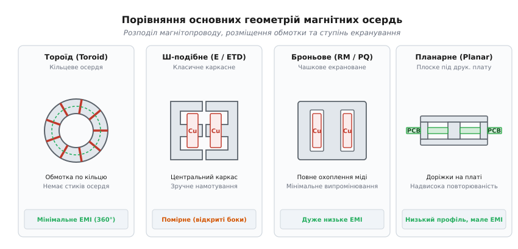
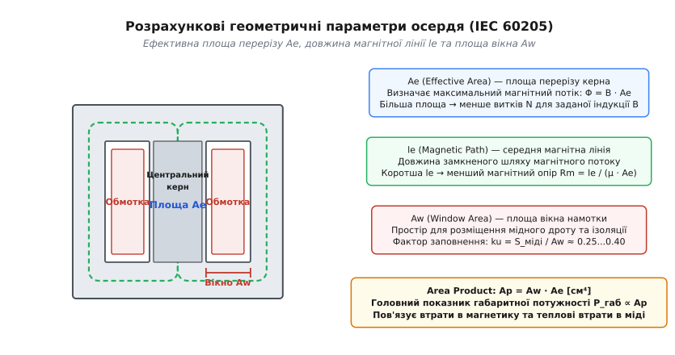
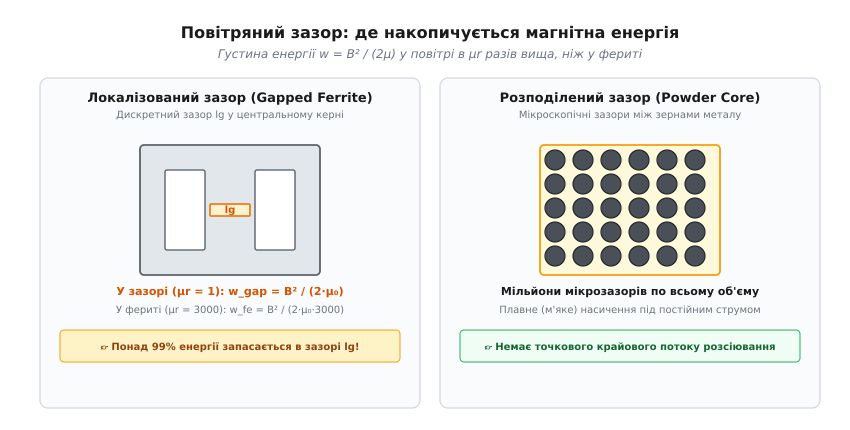
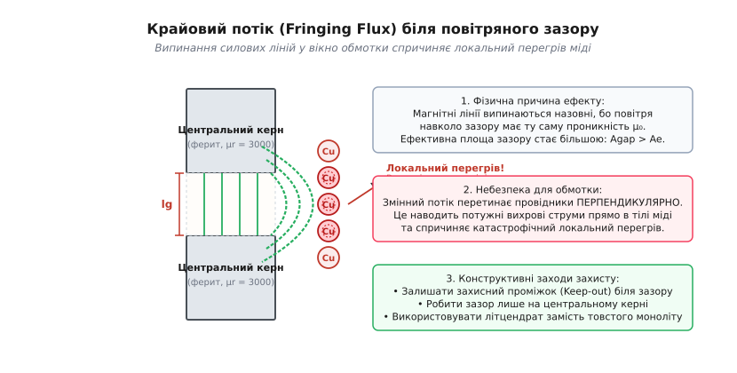
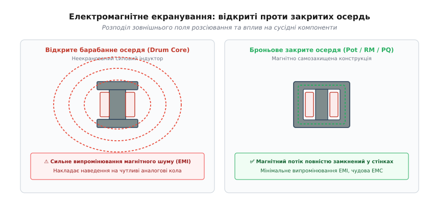

# Форми осердь

<preknowlist>
- [Котушка](book:electronics/inductor-coil) — провідник зі струмом створює магнітне поле, а феромагнітне осердя концентрує його та спрямовує крізь витки.
- [Ферит і втрати в осерді](book:electronics/core-losses) — перемагнічування та вихрові струми нагрівають магнітний матеріал і накладають обмеження на індукцію та частоту.
- [Силовий дросель](book:electronics/power-inductor) — накопичення енергії та робота під постійним струмом підмагнічування вимагають стійкості до насичення.
</preknowlist>

Візьміть кілограм якісного силового фериту й вилийте з нього суцільний довгий стрижень або розкатайте в широкий плаский диск — і спробуйте намотати на ньому силовий імпульсний трансформатор на п'ятсот ватів. Струм первинної обмотки в кілька амперів збудить сильний магнітний потік, але стрижень розірве магнітне коло в навколишнє повітря, створивши колосальні завади для чутливих мікросхем на платі, а на диску витки міді розтягнуться у довгі петлі з велетенським омічним опором, які розжаряться й спалять ізоляцію за лічені секунди. Той самий матеріал і та сама маса магнетику перетворюються на працездатний, компактний і високоефективний вузол лише тоді, коли речовині надають геометричної форми, узгодженої з фізикою магнітного потоку та геометрією електричного струму.

Форма осердя — це просторовий компроміс між двома середовищами, які борються за один і той самий об'єм у просторі: магнітним потоком у фериті та електричним струмом у мідній обмотці.

### Фізичний конфлікт двох середовищ

Щоб зрозуміти, чому існує таке розмаїття промислових геометрій, простежимо поведінку двох фундаментальних полів усередині моточного вузла.

Магнітний потік підпорядковується магнітному аналогу закону Ома: він шукає шлях із найменшим магнітним опором (релюктансом, від латинського *reluctari* — опиратися). Релюктанс однорідної ділянки прямо пропорційний довжині магнітної лінії `l` та обернено пропорційний площі поперечного перерізу `A` і магнітній проникності матеріалу `μ`:

```
R_m = l / (μ · A)      [магнітний опір ділянки магнітопроводу, 1/Гн]
```

З погляду магнітного потоку ідеальне осердя мусить мати якомога товстіший переріз `A` і якомога коротший замкнений шлях `l`, щоб мінімізувати небажане падіння магніторушійної сили (ампер-витків) на самому магнетику та зменшити об'єм фериту, який розсіює тепло при циклічному перемагнічуванні.

Електричний струм у мідній обмотці підпорядковується звичайному закону Ома: його опір постійному струму `R_dc` прямо пропорційний повній довжині дроту `L_wire` та обернено пропорційний площі перерізу провідника `A_wire`:

```
R_dc = ρ_cu · L_wire / A_wire      [електричний опір обмотки, Ом]
```

Повна довжина дроту дорівнює добутку кількості витків `N` на середню довжину одного витка `MLT` (*Mean Length per Turn*): `L_wire = N · MLT`. З погляду електричного струму ідеальна котушка вимагає якомога більшої площі вікна для вкладання товстого дроту та якомога меншого периметра керна, навколо якого намотуються витки, щоб скоротити довжину `MLT` і знизити омічні втрати Джоуля-Ленца (`P_cu = I_rms² · R_dc`).


*Головні сімейства осердь: тороїд тримає потік у замкненому кільці; Ш-подібне осердя з круглим керном (ETD) мінімізує довжину витка; броньове (RM/PQ) стінками екранує завади; планарне використовує плоскі доріжки друкованої плати.*

Тут і виникає головний конструктивний глухий кут:
- Якщо роздути площу феритового керна `A_e`, щоб зменшити індукцію `B` та скоротити кількість витків `N`, зростає периметр керна — кожен виток стає довшим, маса й опір міді зростають;
- Якщо розширити вікно намотки `A_w`, щоб вмістити товстий дріт, неминуче подовжується середня магнітна лінія фериту `l_e`, збільшуючи габарити, масу осердя та магнітні втрати;
- Якщо замкнути ферит з усіх боків суцільною бронею заради магнітного екранування, обмотка опиняється в закритій тепловій пастці, позбавленій конвекційного охолодження.

Усі стандартизовані форми осердь є математично вивіреними відповідями на цей тривимірний конфлікт для різних робочих частот, потужностей і вимог до електромагнітної сумісності (ЕМС). Детальний огляд конструкцій каркасів, типів виводів та механічних кріплень кожної промислової форми зібрано в компонентній вставці [геометрії осердь та конструкція моточних вузлів](book:electronics/core-geometry/comp-core-shapes.md).

### Анатомія осердя: чотири розрахункові параметри

Реальне осердя має складну тривимірну форму із закругленими кутами, вікнами для каркаса, фасками для виведення дротів і кріпильними отворами. Щоб розраховувати електромагнітні процеси без тривимірного чисельного моделювання полів методом скінченних елементів, міжнародний стандарт IEC 60205 вводить систему **ефективних параметрів** (*effective core parameters*).

Складна форма замінюється еквівалентним ідеальним тороїдальним осердям або циліндричним магнітопроводом із чотирма фундаментальними величинами.


*Ефективні параметри осердя: переріз керна Ae задає магнітний потік, середня лінія le визначає релюктанс, а площа вікна Aw лімітує переріз міді.*

#### 1. Ефективна площа поперечного перерізу (Ae)
Ефективна площа перерізу `A_e` (розмірність `мм²` або `см²`) визначає максимальний магнітний потік `Φ`, який осердя здатне пропустити крізь себе при заданій магнітній індукції `B`:

```
Φ = B · A_e      [магнітний потік, Вебери]
```

Для Ш-подібного осердя `A_e` — це переріз центрального керна. Бічні керни мають сумарну площу, що дорівнює або трохи перевищує площу центрального стовпчика, оскільки повний потік ділиться на дві симетричні половини (`Φ_біч = Φ / 2`).

Стандарт IEC 60205 обчислює `A_e` через дві конфігураційні константи осердя `C_1` та `C_2`:

```
C_1 = ∑ (l_i / A_i)      [перша константа осердя, 1/мм]
C_2 = ∑ (l_i / A_i²)     [друга константа осердя, 1/мм³]

A_e = C_1 / C_2          [ефективна площа поперечного перерізу, мм²]
```

#### 2. Ефективна довжина середньої магнітної лінії (le)
Середня магнітна лінія `l_e` (розмірність `мм` або `см`) — це середня довжина замкненого шляху, який проходять силові лінії магнітної індукції всередині фериту:

```
l_e = C_1² / C_2 = C_1 · A_e      [ефективна довжина магнітного шляху, мм]
```

Знаючи `l_e`, за законом повного струму обчислюють напруженість магнітного поля `H` при заданій кількості ампер-витків `N · I`:

```
H = (N · I) / l_e      [напруженість поля, А/м]
```

Коротша середня лінія `l_e` означає менший магнітний опір магнітопроводу й більшу індуктивність за тієї самої кількості витків.

#### 3. Ефективний магнітний об'єм (Ve)
Магнітний об'єм `V_e` (розмірність `мм³` або `см³`) дорівнює добутку ефективної площі на ефективну довжину:

```
V_e = A_e · l_e      [ефективний магнітний об'єм осердя, мм³]
```

Саме об'єм `V_e` визначає загальну масу фериту та сумарні втрати потужності на перемагнічування. Згідно з емпіричним рівнянням Штайнмеца, загальні втрати в осерді прямо пропорційні його об'єму:

```
P_fe = P_v · V_e = C_m · f^α · B_pk^β · V_e      [втрати в осерді, Вт]
```

Тут `P_v` — питомі об'ємні втрати матеріалу (у `кВт/м³` або `мВт/см³`), `f` — частота, `B_pk` — пікова індукція, а `C_m`, `α` та `β` — матеріальні коефіцієнти фериту.

#### 4. Площа вікна намотки (Aw) та коефіцієнт заповнення (ku)
Площа вікна `A_w` (або `W_a`, *Window Area*, у `мм²` або `см²`) — це вільний просвіт між центральним керном і бічними стінками осердя, призначений для розміщення каркаса, мідних провідників та міжшарової ізоляції.

Проте заповнити все вікно чистою міддю фізично неможливо. Частку площі, яку займає безпосередньо метал провідників, описує **коефіцієнт заповнення вікна** `k_u` (*window utilization factor*):

```
k_u = S_міді / A_w = (N · A_wire) / A_w      [коефіцієнт заповнення вікна міддю]
```

Величина `k_u` залежить від способу намотування та напруги ізоляції:
- `k_u ≈ 0.35...0.45` — щільне рядове ручне намотування низьковольтної котушки круглим емальованим дротом;
- `k_u ≈ 0.25...0.30` — типовий мережевий імпульсний трансформатор із пластиковим каркасом, міжшаровою поліімідною стрічкою та крайовими захисними полями (margin tape) для безпеки;
- `k_u ≈ 0.15...0.20` — високовольтний багатосекційний трансформатор або планарна обмотка на друкованій платі (PCB).

### Габаритна оптимізація: Area Product (Ap) та фактор форми Kg

Як інженеру визначити, який саме типорозмір осердя з каталогу потрібен для передачі заданої потужності?

Відповідь дає фактор **Area Product** (`A_p`), який є добутком площі вікна на площу перерізу:

```
A_p = A_w · A_e      [добуток площ, см⁴ або мм⁴]
```

Величина `A_p` має розмірність четвертого степеня довжини (`м⁴` або `см⁴`). Вона однозначно пов'язує габаритну прохідну потужність `P_t` перетворювача з магнітними та тепловими параметрами:

```
A_p = P_t / (K_topo · f · B_pk · J · k_u)      [розрахунковий Area Product]
```

Тут `J` — допустима густина струму в міді (`А/мм²`), а `K_topo` — коефіцієнт топології схеми перетворювача.

З цієї залежності випливає фундаментальний інженерний закон мініатюризації: **щоб зменшити габарити осердя `A_p` за тієї самої потужності `P_t`, необхідно підвищувати частоту перемикання `f`**. Перехід від мережевої частоти 50 Гц до частоти імпульсного перетворення 100 кГц зменшує необхідний показник `A_p` у дві тисячі разів — масивний залізний трансформатор вагою 5 кг замінюється феритовим вузлом вагою 30 грамів.

Коли обмеженням проекту виступає не густина струму `J`, а жорстко заданий допустимий опір обмотки `R_dc` або ліміт втрат у міді, застосовують **коефіцієнт геометрії осердя** `K_g`:

```
K_g = (A_e² · A_w) / MLT      [коефіцієнт геометрії, см⁵]
```

Тут `MLT` — середня довжина витка (*Mean Length per Turn*). Зверніть увагу: `K_g` залежить від довжини витка у знаменнику. Якщо центральний керн має круглий переріз (як у геометріях ETD, PQ чи RM), периметр керна для тієї самої площі `A_e` на `11–15%` менший, ніж у прямокутного керна класичного осердя EE. Це дає відповідне скорочення довжини `MLT`, знижує опір `R_dc` і піднімає коефіцієнт `K_g` на 25–35%. Повний математичний вивід факторів `A_p` і `K_g`, вирівнювання втрат за формулою Штайнмеца та числовий розрахунок напівмостового перетворювача наведено у математичній вставці [розрахунок габаритної потужності та геометрії осердя (Ap і Kg)](book:electronics/core-geometry/math-area-product.md).

### Локальні концентрації поля та нелінійне насичення в кутах

Спрощений одновимірний розрахунок припускає, що магнітна індукція `B` рівномірно розподілена по всій площі перерізу керна `A_e`. Проте реальне магнітне поле в тривимірній геометрії поводиться складніше.

У прямокутних Ш-подібних осердях (EE, EI) силові лінії магнітного потоку на внутрішніх прямих кутах вікна змушені різко змінювати напрямок на 90 градусів. Оскільки магнітний потік концентрується вздовж найкоротшого геометричного шляху (з найменшим релюктансом), густина силових ліній на внутрішніх ребрах різко зростає. Виникає локальна концентрація магнітної індукції: локальне значення `B_local` на гострому куті може на 30–50% перевищувати середнє розрахункове значення `B_avg`.

Наслідки цієї локальної концентрації є критичними для надійності:
1. **Передчасне локальне насичення:** коли середнє значення індукції `B_avg` становить цілком безпечні `0.25 Тл`, внутрішні кути керна вже входять у глибоке насичення (`B_local > 0.38 Тл`). Це деформує синусоїду намагнічування, створює додаткові вищі гармоніки струму холостого ходу та генерує підвищений акустичний шум;
2. **Локальні гарячі плями у фериті:** питомі втрати перемагнічування за законом Штайнмеца зростають пропорційно `B^2.5`. Локальний перегрів внутрішніх ребер фериту може призвести до перевищення точки Кюрі в окремих зонах, що спричиняє лавиноподібне падіння проникності;
3. **Механічні напруження та мікротріщини:** ферит є крихкою керамікою з низькою міцністю на розрив. Локальні градієнти температури та магнітострикційні зусилля на гострих кутах створюють механічні концентратори напружень, які при вібраціях або циклічному нагріванні розколюють осердя.

Саме тому сучасні оптимізовані геометрії (ETD, PQ, RM) проектують із плавними радіусами закруглення на переходах від керна до ярма. Круглий центральний керн повністю усуває гострі кути, забезпечуючи ідеально однорідний розподіл вектора магнітної індукції по всьому перерізу.

### Еволюція форм: від кільця до планарних структур

Розвиток силової електроніки породив чітку спеціалізацію геометрій під різні класи пристроїв.

#### Тороїдальні осердя (Toroids)
Тороїд являє собою суцільне безшовне кільце. Його магнітний контур замкнений ідеально: магнітні лінії не натикаються на повітряні стики половин, тому магнітний опір `R_m` мінімальний. При рівномірному розподілі обмотки вздовж усього периметра (на всі 360 градусів) магнітне поле зосереджене суто всередині тороїда — зовнішнє випромінювання завад практично відсутнє.

Проте тороїд має серйозні технологічні недоліки: намотування здійснюється спеціальними човниковими верстатами, де човник із запасом дроту щоразу проходить крізь внутрішній отвір кільця. Це робить процес дорогим і повільним, не дозволяє намотувати товсті шини та ускладнює забезпечення високовольтної ізоляції між кінцями обмотки.

#### Ш-подібні осердя (E-cores: EE, EI, ETD, EFD)
Ш-подібні осердя збираються з двох симетричних E-половинок або комбінації E- та I-подібних пластин. Це найдешевша й найзручніша у виробництві форма:
- Обмотка мотається на окремому пластиковому каркасі на високошвидкісних шпиндельних верстатах;
- Готовий каркас просто надівається на центральний керн, після чого половинки осердя змикаються та стягуються пружинною скобою чи склеюються епоксидним компаундом;
- Осердя **ETD** (*Economic Transformer Design*) та **ER** отримали круглий центральний керн, який виключив різкі перегини дроту на ребрах і мінімізував довжину середнього витка `MLT`;
- Низькопрофільні осердя **EFD** (*Economic Flat Design*) мають сплощений профіль, що дозволяє створювати джерела живлення товщиною менше 10–15 мм.

#### Броньові та чашкові осердя (Pot Cores, RM, PQ, EP)
У броньових осердях магнітопровід охоплює обмотку не зсередини, а ззовні.
- **Чашкові осердя (Pot Cores):** дві циліндричні чашки повністю закривають каркас із котушкою. Вони забезпечують найвищий ступінь магнітного самозахисту (наднизький рівень EMI), але мають погане тепловідведення й вузькі прорізи для виведення дротів;
- **Осердя RM (Rectangular Modular):** квадратна зовнішня основа з круглим керном і широкими бічними вирізами. Вирізи забезпечують вільне конвекційне охолодження міді та легкий вихід товстих вивідних провідників безпосередньо на штирі друкованої плати;
- **Осердя PQ (Power Quality):** оптимізовані за співвідношенням об'єму керна, вікна намотки та зовнішньої площі охолодження для високоефективних блоків живлення з великою питомою потужністю;
- **Осердя EP:** мініатюрні броньові кубики для телекомунікаційних та сигнальних ізолюючих трансформаторів.

#### Планарні осердя (Planar Cores)
У планарних трансформаторах класичний намотувальний дріт замінено плоскими друкованими провідниками багатошарової плати (PCB) або штампованими мідними пластинами. Планарне осердя має дуже широке, але надзвичайно низьке вікно намотки (висотою 1.5–4 мм).

Планарна технологія забезпечує неперевершену повторюваність параметрів (індуктивність розсіювання та паразитна міжелектродна ємність зафіксовані малюнком плати з мікронною точністю) та чудове тепловідведення: тепло від міді безпосередньо передається крізь шари склотекстоліту на плату та зовнішні охолоджувальні радіатори.

### Теплові шляхи та розсіювання тепла в різних геометріях

Гранична потужність будь-якого моточного вузла в кінцевому підсумку обмежена допустимим нагрівом ізоляції (`ΔT = T_max - T_ambient`). Тепловідведення визначається тим, як тепло з товщі обмотки та фериту передається назовні.

Тепловий опір від вузла до навколишнього середовища `R_th` (у `°C/Вт`) обернено пропорційний ефективній площі зовнішньої поверхні охолодження `A_surf`:

```
R_th ≈ 1 / (h_c · A_surf)      [де h_c ≈ 10...15 Вт/(м²·°C) — коефіцієнт природної конвекції]
```

Порівняння теплових характеристик геометрій показує суттєву різницю:
1. **Відкриті Ш-подібні осердя (EE, ETD):** зовнішні шари обмотки безпосередньо омиваються потоками повітря. Тепло від міді виходить шляхом прямої конвекції та випромінювання, тому тепловий опір відносно низький (`R_th ≈ 20...30 °C/Вт` для типорозміру ETD34);
2. **Закриті чашкові осердя (Pot Cores):** обмотка ізольована від повітря товстими феритовими стінками. Оскільки теплопровідність фериту невисока (`k_fe ≈ 3...5 Вт/(м·°C)` проти `400 Вт/(м·°C)` у міді), утворюється тепловий бар'єр. Тепловий опір чашок того самого об'єму виявляється в 1.5–2 рази вищим (`R_th ≈ 40...60 °C/Вт`), що вимагає примусового зниження робочої густини струму;
3. **Планарні осердя (Planar Cores):** мають найвище співвідношення площі охолодження до об'єму. Тепло від внутрішніх доріжок передається через сітку металізованих отворів (Thermal Vias) на суцільні мідні полігони друкованої плати та безпосередньо на пласкі алюмінієві радіатори або корпус приладу. Це дозволяє безпечно підвищувати густину струму до `10...15 А/мм²`.

### Фізика повітряного зазору: де насправді живе магнітна енергія

У трансформаторах (Forward, Push-Pull, Half-Bridge, Full-Bridge) магнітопровід служить виключно «магнітним каналом» для миттєвої передачі енергії з первинного кола у вторинне: накопичення енергії в осерді небажане й шкідливе.

Зовсім інша ситуація виникає в **силових дроселях** та **зворотньоходових трансформаторах (Flyback)**. Тут магнітний вузол зобов'язаний накопичувати енергію під час відкритого стану силового транзистора, а потім віддавати її в навантаження під час паузи або згладжувати пульсації постійного струму.

І тут конструктор натикається на парадокс: якщо спробувати запасти енергію в суцільному фериті без зазору, нічого не вийде.

Розрахуємо об'ємну густину магнітної енергії `w` (в `Дж/м³`), яка запасається в магнітному полі з індукцією `B`:

```
w = 0.5 · B · H = B² / (2 · μ_0 · μ_r)      [об'ємна густина енергії, Дж/м³]
```

Тут `μ_0 = 4π · 10⁻⁷ Гн/м` — магнітна стала вакууму, а `μ_r` — відносна магнітна проникність матеріалу.

Порівняємо, скільки енергії здатні запасти один кубічний сантиметр фериту (`μ_r = 3000`) та один кубічний сантиметр повітря (`μ_r = 1`) при однаковій робочій індукції `B = 0.3 Тл`:

```
У фериті (μ_r = 3000):  w_fe  = (0.3)² / (2 · 4π·10⁻⁷ · 3000) ≈ 11.9 Дж/м³ = 11.9 мкДж/см³
У повітрі (μ_r = 1):    w_air = (0.3)² / (2 · 4π·10⁻⁷ · 1)    ≈ 35 810 Дж/м³ = 35.8 мДж/см³
```

Густина запасеної енергії в повітрі рівно в `μ_r` (у 3000 разів!) **вища**, ніж у товщі фериту.


*Понад 99% магнітної енергії дроселя запасається у крихітному повітряному зазорі lg, тоді як ферит служить лише провідником магнітного потоку з низьким опором.*

Суцільний ферит через колосальну проникність має мізерний релюктанс: струм у кілька сотень міліамперів миттєво доводить його до насичення (`B_sat ≈ 0.35...0.45 Тл`), після чого індуктивність катастрофічно падає до рівня повітряної котушки, викликаючи аварійний сплеск струму через ключ.

Щоб ферит не насичувався постійним струмом підмагнічування, у магнітне коло вводять **повітряний зазор** довжиною `l_g`. Зазор створює високий магнітний опір `R_m_gap = l_g / (μ_0 · A_e)`. Тепер струм підмагнічування створює на зазорі величезне падіння магніторушійної сили, лінеаризуючи залежність індукції від струму. Понад 99% усієї енергії дроселя чи Flyback-трансформатора фізично концентрується та накопичується саме в крихітному об'ємі повітряного зазору `V_gap = A_e · l_g`:

```
W_tot ≈ (B_pk² · A_e · l_g) / (2 · μ_0)      [повна накопичена енергія, Джоулі]
```

Ферит у такій системі виконує скромну, але критичну роль: він працює «магнітним дзеркалом» і провідником із нульовим релюктансом, який збирає лінії поля від обмотки й без розсіювання підводить їх безпосередньо до повітряного зазору.

### Дискретний зазор проти розподіленого

В інженерній практиці повітряний зазор реалізують двома кардинально різними шляхами:

```
Способи організації зазору:
├─ Локалізований (дискретний) зазор:
│  ├─ Шліфування центрального керна (Gapped Center Post)
│  └─ Діелектричні прокладки у всіх трьох кернах (Spacers)
└─ Розподілений зазор (Distributed Gap):
   └─ Порошкові магнітодіелектрики (Sendust, Kool Mμ, MPP, High Flux, Iron Powder)
```

#### 1. Локалізований дискретний зазор у фериті
У феритових Ш-подібних чи броньових осердях центральний стовпчик роблять трохи коротшим за бічні стінки на величину `l_g` (шліфований керн). Коли дві половинки стуляються, бічні стінки змикаються щільно (без зазору), а в центрі всередині каркаса утворюється калібрована повітряна щілина.

- **Характер насичення:** жорсткий (*Hard Saturation*). Індуктивність залишається строго стабільною аж до граничного струму насичення `I_sat`, після чого різко обвалюється вниз;
- **Втрати:** мінімальні втрати перемагнічування на високих частотах (100 кГц – 2 МГц), що робить ферит із зазором ідеальним для високочастотних імпульсних джерел живлення.

#### 2. Розподілений зазор у металопорошках
Порошкові осердя пресують із мікроскопічних зерен магнітних металевих сплавів (залізо-кремній-алюміній — Sendust/Kool Mμ; нікель-залізо — MPP, High Flux; карбонільне залізо), вкритих тонкою плівкою діелектричного лаку.

Між мільйонами зерен утворюються мільйони мікроскопічних діелектричних зазорів, рівномірно розподілених по всьому тілу осердя.

- **Характер насичення:** плавний, м'який (*Soft Saturation*). Під дією зростаючого постійного струму індуктивність не падає раптово, а плавно знижується (наприклад, на 20% при номінальному струмі та на 50% при перевантаженні);
- **Індукція насичення:** досягає `1.0...1.6 Тл` (проти `0.35...0.45 Тл` у феритів), що дозволяє накопичувати колосальну енергію в компактному об'ємі;
- **Недоліки:** значно вищі питомі втрати на гістерезис і вихрові струми у металі на частотах понад 100 кГц, через що порошки застосовують переважно в дроселях фільтрації постійного струму та коректорах коефіцієнта потужності (PFC) на помірних частотах.

### Підступний крайовий потік (Fringing Flux) і локальний перегрів

Коли магнітний потік доходить до повітряного зазору в центральному керні, лінії магнітної індукції стикаються з раптовим зростанням магнітного опору. Оскільки навколишнє повітря всередині вікна намотки має таку саму магнітну проникність `μ_0`, як і повітря всередині зазору, лінії магнітного поля не йдуть строго паралельно: вони випинаються назовні в бічні сторони, утворюючи опуклу дугу.

Це явище називають **крайовим потоком розсіювання** (*Fringing Flux* або спучуванням ліній поля).


*Крайові лінії поля випинаються із зазору й перетинають провідники обмотки перпендикулярно, наводячи потужні вихрові струми та викликаючи локальний перегрів міді.*

Крайовий потік породжує дві серйозні інженерні проблеми:

1. **Зміна розрахункової індуктивності:** через розширення потоку ефективна площа зазору стає більшою за фізичну площу керна (`A_gap > A_e`). Відповідно, магнітний опір зазору знижується, а реальна індуктивність `L` виявляється на `10–40%` більшою за значення, обчислене за простою формулою `L = μ_0 · N² · A_e / l_g`. Для точного розрахунку вводять поправковий коефіцієнт МакЛаймана `F > 1`.
2. **Катастрофічний локальний перегрів міді:** це головна небезпека крайового потоку. Лінії основного магнітного потоку в керні течуть уздовж провідників, не перетинаючи їхнє тіло. Але лінії крайового потоку, вигинаючись дугою з зазору, входять у вікно намотки і **перетинають мідні витки перпендикулярно до їхньої поздовжньої осі**.

Високочастотне змінне поле (50–500 кГц), перетинаючи масивний провідник упоперек, наводить у товщі міді гігантські вихрові струми. При цьому загальний термометр або тепловізор може показувати помірну середню температуру трансформатора (+60 °C), але внутрішній виток міді, розташований безпосередньо навпроти зазору, розжарюється до +160...+200 °C. Це призводить до розплавлення ізоляції, міжвиткового замикання та миттєвого вигорання перетворювача.

#### Заходи боротьби з крайовим перегрівом:
1. **Захисна зона (Keep-Out Zone):** намотування не проводять впритул до зазору. На каркасі передбачають потовщення стінки або прокладають діелектричні дистанційні вставки, відсуваючи мідь від зазору на відстань, що щонайменше втричі перевищує довжину зазору `l_g`;
2. **Розподіл зазору на кілька дрібних (Multiple Gaps):** замість одного великого зазору `1.5 мм` роблять три зазори по `0.5 мм` у складових секціях керна. Випинання ліній поля зменшується пропорційно розміру щілини;
3. **Літцендрат замість моноліту:** тонка ізольована жилка літцендрату (діаметром 0.07 мм) занадто мала, щоб у ній замкнувся сильний вихровий струм;
4. **Зазор тільки на центральному керні:** зазор ніколи не роблять на зовнішніх бічних стінках осердя, інакше крайовий потік вийде назовні приладу, створюючи сильні завади для всієї плати.

### Електромагнітне екранування: відкриті проти закритих осердь

Здатність моточного компонента не випромінювати магнітні завади в сусідні вузли та не приймати зовнішні наведення називається електромагнітною екранованістю.


*Відкрите барабанне осердя вільно випромінює поле назовні; броньове осердя повністю замикає лінії магнітної індукції у своїх феритових стінках.*

За ступенем екранованості геометрії утворюють чітку ієрархію:

1. **Відкриті неекрановані (Unshielded Drum / Rod Cores):** барабанні гантелі для SMD-дроселів. Магнітний контур розірваний, лінії поля замикаються крізь простір над платою. Розміщення такого дроселя поруч із чутливим мікроконтролером, аналоговим компаратором або радіотрактом гарантовано призведе до збоїв від наведеної ЕРС. Застосовуються лише в найдешевших пристроях або за наявності суцільного металевого екрана приладу;
2. **Напівзакриті (E-cores, ETD):** основний потік замкнений у фериті, але з боків вікна намотки відкриті. З бічних вікон виходить невеликий потік розсіювання;
3. **Самозахищені закриті (Pot Core, RM, PQ, EP):** зовнішні феритові стінки практично повністю огинають котушку, замикаючи будь-які поля розсіювання всередині магнетику. Це вибір номер один для прецизійних приладів, медичної техніки та вузлів із жорсткими вимогами сертифікації за стандартами ЕМС (CISPR 32 / EN 55032);
4. **Ідеально замкнені (Toroids):** при повному намотуванні на 360 градусів випромінювання назовні прямує до нуля завдяки круговій симетрії. Проте якщо обмотка займає лише невеликий сектор кільця (наприклад, 90 градусів), симетрія руйнується, і тороїд починає випромінювати значне поле розсіювання через відкриту частину кільця.

### Інженерний синтез: критерії вибору геометрії

Обираючи форму осердя під конкретну схемотехнічну задачу, керуються таким алгоритмом:

```
Алгоритм вибору геометрії:
├─ Дросель фільтра постійного струму (DC Choke, Buck/Boost):
│  ├─ Великий струм, помірна частота (< 100 кГц) → Порошковий тороїд (Sendust / Kool Mμ)
│  └─ Висока частота (> 150 кГц), велика потужність → E-core або PQ із центральним зазором
├─ Трансформатор зворотньоходового перетворювача (Flyback):
│  ├─ Потужність до 50 Вт, висока ЕМС → RM або EP із центральним зазором
│  └─ Потужність 50–250 Вт → PQ або ETD із центральним зазором
├─ Прямоходовий / напівмостовий / LLC резонансний трансформатор:
│  ├─ Потужність 100–1000 Вт, висока надійність → ETD або ER (круглий керн, літцендрат)
│  └─ Максимальна компактність, висока частота (0.3–2 МГц) → Планарне осердя (Planar E/PLT)
└─ Високочутливі сигнальні та вимірювальні кола:
   └─ Максимальне екранування, стабільність → Pot Core або EP
```

Форма осердя — це не декоративна особливість компонента, а точний інженерний інструмент. Узгодивши геометрію магнітопроводу з частотою, потужністю, тепловим режимом та вимогами електромагнітної сумісності, інженер створює надійні моточні вузли з максимальним ККД та мінімальними масогабаритними показниками.
