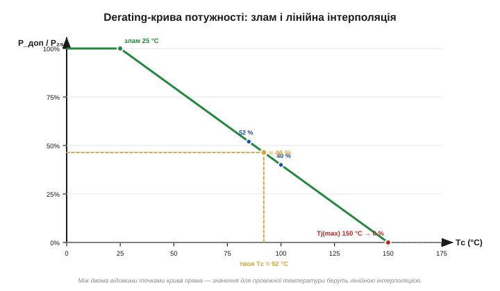
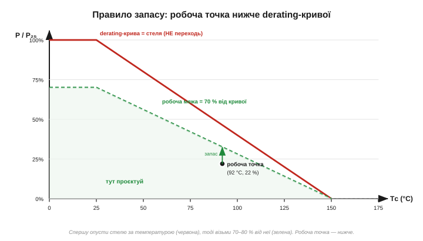

# 🧮 Derating-графіки: інтерполяція і правило запасу

> Даташит подає залежності параметрів окремими графіками. Тут — як зняти з **derating-кривої** *(derating curve, крива зниження)* точне число для **своєї** температури через лінійну інтерполяцію й як накласти на нього **правило запасу** *(margin/derating, недовантаж)*, щоб робоча точка не лежала на самій межі.

### Що таке derating і чому крива спадна

**Derating** — це зниження гранично допустимого параметра, що далі умови відходять від «лабораторних». Найчастіша така крива — **допустима потужність від температури корпусу**. Прилад тримає свою повну потужність лише при кімнатних 25 °C; гарячіше — і вона мусить падати. Причина суто теплова й тримається на [тепловому опорі переходу](book:electronics/rds-on): тепло від кристала тече назовні крізь тепловий опір, а температура кристала не сміє переступити за Tj(max). Чим гарячіше довкола, тим менше тепла можна додати самому приладу, перш ніж кристал упреться в стелю, — тому й допустима потужність спадає.

Звідси й характерний злам кривої. До певної температури (часто 25 °C) дозволено всі 100 % — кристал ще має запас до Tj(max). Далі йде пряма, що спадає до нуля рівно при Tj(max): у цій точці вже й нульова додана потужність доводить кристал до межі.


*Рис. Допустима потужність у відсотках від номіналу при 25 °C. Плато (зелене) — до зламу; далі пряма до 0 % при Tj(max) = 150 °C. Дві відомі точки даташита (85 °C → 52 %, 100 °C → 40 %) лежать на одній прямій; для проміжних 92 °C значення (≈ 46 %) знімають лінійною інтерполяцією.*

### Інтуїція: на прямій ділянці частки однакові

Саме на цю спадну пряму й спираються, коли знімають значення. Пряма зручна тим, що на ній **рівним крокам по осі x відповідають рівні кроки по осі y**. Пройшли півдороги між двома відомими точками за температурою — отже, й шукане значення лежить рівно посередині між їхніми. Не треба жодних формул нахилу: достатньо змішати дві сусідні точки в тій пропорції, у якій ваша температура ділить відрізок між ними. Це і є **лінійна інтерполяція** *(linear interpolation)* — «читання між рядків» таблиці чи графіка.

### Формальний апарат

Перекладемо це змішування на формулу. Хай графік (або таблиця) дає дві сусідні точки: при T₁ значення y₁, при T₂ значення y₂. Шукаємо значення y при проміжній температурі T (T₁ ≤ T ≤ T₂). Спершу — **частка шляху** від першої точки до другої:

```
f = (T − T₁) / (T₂ − T₁)        (0 при T=T₁,  1 при T=T₂)
```

Тоді шукане значення — змішування країв у цій пропорції:

```
y = y₁ + f · (y₂ − y₁)
  = y₁·(1 − f) + y₂·f
```

Перевіримо на числах із кривої вище. Відомо: при 85 °C дозволено 52 %, при 100 °C — 40 %. Скільки дозволено при 92 °C?

```
f = (92 − 85) / (100 − 85) = 7 / 15 = 0.467
y = 52 + 0.467·(40 − 52) = 52 − 5.6 = 46.4 %
```

Якщо ж відомі не дві довільні точки, а злам і кінець (тут 25 °C → 100 % і 150 °C → 0 %), формула спрощується до прямого нахилу:

```
y(T) = 100 % · (Tj(max) − T) / (Tj(max) − Tзлам)
y(92) = 100 % · (150 − 92) / (150 − 25) = 58/125 = 46.4 %
```

Обидва шляхи дають те саме: пряма лишається прямою, з якого боку її не читай. Звідси два застереження. Перше: інтерполювати **лінійно** можна лише там, де крива справді пряма; на гнутих ділянках (а надто на логарифмічних осях) пряме змішування бреше — там беруть найближчу точку з гіршого боку. Друге: **не екстраполюйте** за крайні точки графіка — поза наведеним діапазоном крива може повестися геть інакше, ніж її уявне продовження.

### Правило запасу: робоча точка нижче кривої

Знайдене з кривої число — це **стеля**, гранично допустиме за даної температури, а не робоча мета. Працювати на самій derating-кривій так само ризиковано, як на абсолютному максимумі: будь-яка дрібниця — розкид партії, зайвий градус, пульсація — штовхне за межу. Тому до інтерпольованого значення застосовують той самий **коефіцієнт запасу**, що й деінде в питаннях надійності: беруть лише 70–80 % від стелі.


*Рис. Червона крива — стеля (derating), якої не торкаються. Зелена — робоча межа, 70 % від стелі за кожної температури. Проєктують у зеленій зоні, ще й із власним проміжком; робоча точка (92 °C, 22 %) лежить помітно нижче за обидві лінії.*

Порядок дій виходить двоступеневий, і його варто запам'ятати: **спершу** опусти стелю за температурою (інтерполяція по derating-кривій), **потім** візьми від неї запас. Числом: при 92 °C стеля — 46 % номіналу; з коефіцієнтом 0.75 робоча межа стає 0.75 · 46 % ≈ 35 %; отже, прилад, що при 25 °C тягнув умовний 1 Вт, тут варто навантажувати приблизно на 0.35 Вт. Якщо ваша задача вимагає більшого — це сигнал брати потужніший корпус або кращий тепловідвід, а не тиснутися до межі.

> 🔧 **Навіщо це.** Derating-графік читають у два кроки. **Перший** — лінійна інтерполяція: на прямій ділянці змішуєш дві сусідні точки в пропорції f = (T − T₁)/(T₂ − T₁), здобуваючи стелю для **своєї** температури (на гнутих ділянках і логарифмічних осях так не можна — бери найближчу гіршу точку). **Другий** — правило запасу: від цієї стелі лишаєш 70–80 %, і ось вона, робоча межа. Хто проєктує на самій кривій, той тримає прилад на межі смерті; хто з запасом під нею — той робить надійні речі.
