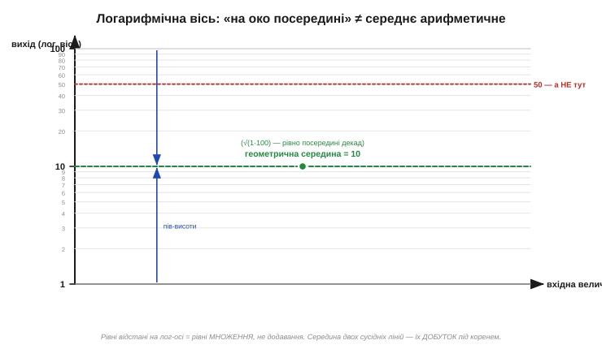
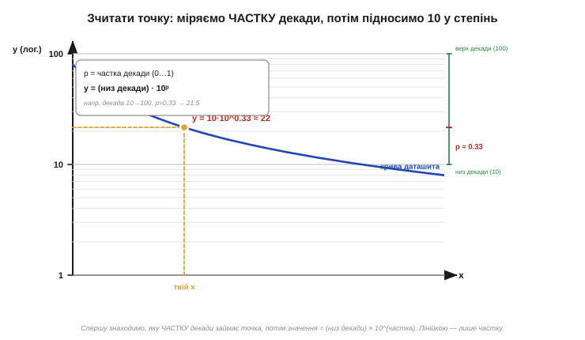

# ⚙️ Зчитати число з графіка правильно: логарифмічні осі й сітка декад

> Алгоритмічна вставка до теми [графіки даташита: derating, ВАХ, температурні залежності](book:electronics/datasheet-graphs). Даташит часто подає залежності окремими кривими. Тут — коротка процедура, як **зняти з кривої точне число**, коли вісь не звичайна, а **логарифмічна** *(logarithmic axis, log-вісь)*. Це не програма для мікроконтролера, а інженерне «читання очима», яке легко зробити неправильно й помилитися в рази.

### Задача

Перед вами крива в даташиті: вхідний струм зсуву від температури, Rds(on) від струму, підсилення від частоти — байдуже що. Треба для **свого** значення на одній осі зняти відповідне значення на другій. Складність у тому, що осі майже завжди **логарифмічні**: підписи йдуть не 0, 1, 2, 3, а 1, 10, 100, 1000 — кожна головна лінія більша за попередню в десять разів. Око ж звикло міряти **рівними кроками**, і саме тут народжується найчастіша похибка: точку, що лежить «десь посередині» між двома лініями, читач машинально називає середнім арифметичним — і промахується на порядок.

### Ідея: рівні відстані = рівні множення

Уся суть лог-осі в одному реченні: **рівним відстаням уздовж осі відповідають рівні множники, а не рівні добавки**. Пройшли від лінії «10» вгору на стільки ж, скільки від «1» до «10», — і опинилися не на «19» (плюс дев'ять), а на «100» (помножили на десять). Відрізок між сусідніми головними лініями зветься **декадою** *(decade)* — це множення на 10.

Звідси — головний наслідок для зчитування. Точка, що лежить **геометрично посередині** між двома лініями декади, дорівнює не їх півсумі, а **кореню з добутку** (геометричному середньому). Посередині між 1 і 100 на лог-осі стоїть не 50, а √(1·100) = **10**. Між 10 і 100 — не 55, а √(10·100) ≈ **31.6**. Тому «на око посередині» — це завжди про множення, ніколи про додавання.


*Рис. Дві декади (1…100). Геометрична середина (зелена лінія, рівно на пів-висоти графіка) — це 10, а не 50. Червона лінія «50» сидить набагато вище за центр. Зверніть увагу й на проміжні поділки 2, 3, …, 9: вони згущуються догори декади — нерівномірні, бо це теж логарифм.*

Видно й другу рису лог-сітки: проміжні поділки всередині декади (2, 3, 4 … 9) розташовані **нерівномірно** — широко знизу й тісно вгорі. Відстань від 1 до 2 більша за відстань від 9 до 10, хоч числа додаються однаково. Хто цього не помічає, той ділить декаду на десять рівних шматків лінійкою — і знову промахується.

### Процедура зчитування

Алгоритм надійного зчитування зводиться до того, щоб міряти лінійкою **частку декади**, а не саме число, і лише потім перетворювати її на значення.

```
1. знайди свою точку: від відомої осі (напр. x) опусти/підніми
   перпендикуляр до кривої, з кривої — до шуканої осі
2. визнач декаду, у яку точка влучила:
   нижня лінія Lo, верхня Hi = 10·Lo     (напр. 10 і 100)
3. зміряй ЛІНІЙКОЮ частку декади знизу:
   p = (відстань від Lo до точки) / (відстань від Lo до Hi)   # 0…1
4. значення = Lo · 10^p
                          # p=0   → Lo
                          # p=0.5 → Lo·3.16  (геом. середина)
                          # p=1   → Hi
5. (за потреби) те саме по другій осі, якщо й вона логарифмічна
```


*Рис. Точку знаходять перпендикулярами від відомої осі до кривої й назад. Далі міряють лінійкою частку p декади (тут між 10 і 100, p ≈ 0.33) і підносять: значення = низ_декади · 10ᵖ ≈ 10 · 10⁰·³³ ≈ 21.5. Лінійкою міряємо лише частку — число дає степінь десятки.*

Перевіримо на числі з рисунка. Точка лежить у декаді 10…100, лінійка показує p ≈ 0.33 від низу. Тоді значення = 10 · 10⁰·³³ ≈ 10 · 2.14 ≈ **21.5**, а не «33» (як підказало б наївне лінійне ділення декади навпіл) і не «55» (півсума країв). Різниця — у рази, і саме вона псує розрахунки тим, хто читає лог-вісь як звичайну.

### Складність і пастки

Сама процедура проста, та на ній легко спіткнутися. Зберемо ті місця, де читач лог-осі помиляється найчастіше.

**Найголовніше: не інтерполюй лог-вісь лінійно.** Лінійне змішування країв (як на прямій derating-кривій, [вставка про derating](math-derating.md)) на логарифмічній осі дає грубу помилку. Спершу переведи в частку декади p, аж тоді рахуй 10ᵖ.

**Перевір, котрі осі логарифмічні.** Бувають усі чотири комбінації: обидві лінійні, обидві логарифмічні (log–log, типово для АЧХ) або по одній кожного типу (напівлог). Підказка — підписи: 1·10·100 чи нерівномірні проміжні поділки означають log. Кожну вісь читай за її власним законом.

**Точність графіка — груба.** Крива в даташиті надрукована «приблизно»: товщина лінії, друк, ваше око дають легко ±10…20 %. Знятому з графіка числу не можна вірити як [табличному значенню min/typ/max](book:electronics/min-typ-max) — це орієнтир, а не гарантія. Закладай запас.

**Не екстраполюй за край.** Поза наведеним діапазоном крива може зламатися чи піти різко інакше. Продовжувати її уявою — гадання, а не зчитування.

**Стережися децибел.** Вісь у дБ — **уже** логарифмічна (це теж [логарифм у децибелах](book:electronics/decibels)), хоч і креслиться рівномірно. Там «частку декади» рахувати не треба — додавай і віднімай дБ напряму; плутати дБ-вісь зі звичайною лог-віссю — окрема пастка.

> 🔧 **Навіщо це.** Половину кривих у даташиті накреслено на логарифмічних осях, і знімати з них число треба правильно, інакше помилка — в рази. Запам'ятай одне: **рівні відстані на лог-осі — це рівні множення**, тож точка посередині декади дорівнює кореню з добутку країв (між 1 і 100 — це 10, не 50). Процедура надійна: зміряй лінійкою **частку декади** p, тоді значення = (низ декади)·10ᵖ. І не забувай, що зняте з графіка число — приблизне: бери із запасом, а критичні параметри звіряй із таблицею.
