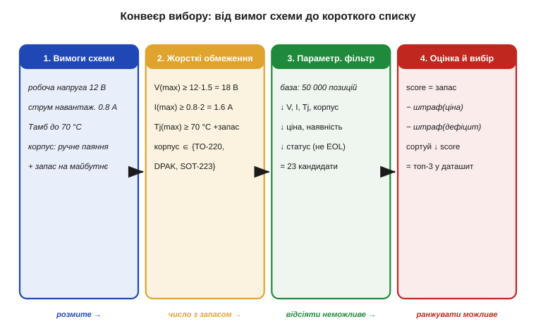
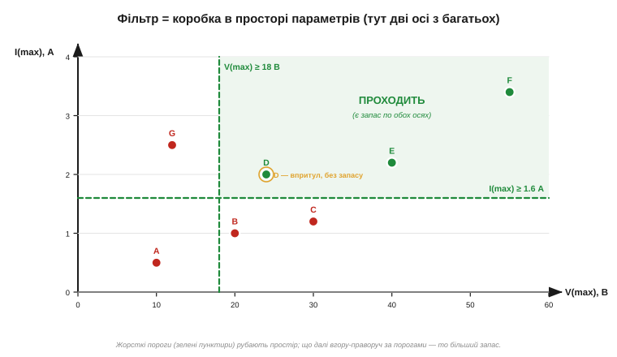

# ⚙️ Чеклист вибору компонента: від вимог схеми до параметричного пошуку

> Уміти **прочитати** [даташит конкретного приладу](book:electronics/datasheet-practice) — півсправи. Тут — крок назад: як від **вимог схеми** дійти до самого приладу, коли в каталозі їх десятки тисяч. Це проста, але дисциплінуюча процедура — фільтр плюс оцінка — і вона лягає в основу будь-якого **параметричного пошуку** *(parametric search)* на сайтах дистриб'юторів.

### Задача

Схема каже: «тут потрібен MOSFET», «сюди — стабілітрон», «оце місце просить операційний підсилювач». Але «MOSFET» — це не один прилад, а полиця з **десятків тисяч** позицій, що різняться напругою, струмом, корпусом, ціною, наявністю. Вибрати навмання — означає або взяти завеликий і дорогий, або впертися у межу й спалити його в першому ж стрес-тесті, перевищивши [абсолютний максимум](book:electronics/abs-max-ratings).

Завдання формулюється так: маючи **розмиті** вимоги схеми (робоча напруга, струм, температура, спосіб монтажу), отримати **короткий список** із 2–3 конкретних приладів, чиї даташити варто прочитати уважно. Усе, що стоїть між цими двома точками, — суто алгоритм.

### Ідея: жорсткі обмеження → фільтр → оцінка

Розв'язок розпадається на чотири кроки, і порядок тут важливий.


*Рис. Чотири етапи. (1) Витягаємо вимоги зі схеми — поки що розмиті. (2) Перетворюємо їх на **жорсткі обмеження** з уже закладеним запасом: робочу напругу множимо на коефіцієнт, струм — теж, корпус зводимо до списку «що паяється». (3) **Фільтр** проганяє повну базу крізь ці пороги й лишає кандидатів. (4) **Оцінка** ранжує тих, хто пройшов, і дає топ-3.*

Перший крок — **кількісно** записати вимоги. Не «напруга невелика», а «робоча 12 В». Другий — і це серце процедури — перевести кожну вимогу в **жорстке обмеження із запасом** *(margin)*. Робоча напруга 12 В не означає «шукаю прилад на 12 В»: береться запас (типово ×1.5…×2 для напруги, ×2 для струму), тож обмеження стає «V(max) ≥ 18 В». Запас тут — не забаганка, а пряме застосування правила про [абсолютні максимуми](book:electronics/abs-max-ratings): між робочою точкою й абсолютним максимумом мусить лишатися прірва. На цьому ж кроці враховуємо derating за температурою — [графіки даташита](book:electronics/datasheet-graphs) показують, як спадає допустиме навантаження: якщо довкола гаряче, поріг по струму чи потужності ще піднімається.

Третій крок — **фільтр**. Кожне жорстке обмеження — це поріг на одній з осей простору параметрів. Прилад **проходить** лише тоді, коли задовольняє **всі** пороги одночасно.


*Рис. Дві осі простору параметрів (а їх більше): максимальна напруга й струм. Зелені пунктири — пороги (V(max) ≥ 18 В, I(max) ≥ 1.6 А). Прилади A, B, C, G не дотягують хоч по одній осі — відсіюються. D, E, F проходять. Але D сидить **упритул** до порога — формально пройшов, а запасу обмаль; справжній вибір — серед тих, хто далі вгору-праворуч.*

Четвертий крок — **оцінка**. Тих, хто пройшов фільтр, лишається ще багато, і всі вони формально придатні. Тепер їх треба впорядкувати за «м'якими» критеріями: більший запас — добре, нижча ціна — добре, краща наявність — добре, статус «не EOL» *(end-of-life, знято з виробництва)* — обов'язково. Складаємо просту **оцінну функцію** (score) і сортуємо за нею спадно. Верхівка списку — і є кандидати в даташит.

### Псевдокод

```
# крок 1–2: вимоги схеми → жорсткі обмеження із запасом
req.V   ← 12;  req.I ← 0.8;  req.Tamb ← 70
hard.Vmax  ← req.V · 1.5            # запас по напрузі
hard.Imax  ← req.I · 2.0            # запас по струму
hard.Tj    ← req.Tamb + запас       # + derating за температурою
hard.case  ← {TO-220, DPAK, SOT-223}   # що паяється вручну

# крок 3: фільтр — лишити лише тих, хто проходить ВСІ пороги
кандидати ← []
для кожного p у база:                # база: десятки тисяч позицій
    якщо p.Vmax  < hard.Vmax: продовжити    # відсіяти
    якщо p.Imax  < hard.Imax: продовжити
    якщо p.Tj    < hard.Tj:   продовжити
    якщо p.case  ∉ hard.case: продовжити
    якщо p.status = EOL:      продовжити
    додати p до кандидати

# крок 4: оцінка — ранжувати тих, хто пройшов
для кожного p у кандидати:
    запас  ← min(p.Vmax/hard.Vmax, p.Imax/hard.Imax)   # вузьке місце
    p.score ← w₁·запас − w₂·p.ціна − w₃·дефіцит(p)
сортувати кандидати за score спадно
повернути перші 3            # їх даташити читаємо уважно
```

### Складність і пастки на МК

- **Складність.** Фільтр — один прохід по базі, **O(N)**; сортування тих, хто пройшов, — O(M log M), де M ≪ N. Для типової бази (N ~ 50 000) це мить навіть на скромному залізі. На самому МК такий пошук роблять рідко (база велика), але та сама логіка — фільтр потім оцінка — лежить, наприклад, у виборі режиму чи профілю з таблиці налаштувань.
- **Порядок: спершу фільтр, потім оцінка.** Не міняйте місцями. Оцінювати треба лише тих, хто **фізично придатний**; інакше дешевий, але заслабкий прилад спливе нагору завдяки низькій ціні — і ви візьмете те, що згорить.
- **«Впритул» — це не «проходить».** Кандидат на самій межі порога (прилад D на рисунку вище) формально пройшов, та запас у нього нульовий. Або закладайте запас одразу в пороги (як вище), або штрафуйте малий запас у score — інакше фільтр пропустить кандидатів без жодного резерву.
- **AND, а не OR.** Прилад мусить задовольняти **всі** обмеження разом. Часта помилка новачка — зрадіти, що знайшовся прилад із чудовим струмом, і не помітити, що по напрузі він не дотягує. Один провалений поріг — і кандидат вибуває, хай би якими блискучими були решта параметрів.
- **Одиниці й порівняння.** Перш ніж порівнювати, зведіть усе до **однакових одиниць** (мА проти А, мВт проти Вт): база й вимоги легко розходяться. На МК без плаваючої коми тримайте величини в цілих (мкА, мВ) і пильнуйте переповнення при множенні на коефіцієнт запасу.
- **«Тихі» осі.** Найпідступніші вимоги ті, що в схемі не написані прямо: швидкодія, струм спокою, мінімальна робоча напруга, температурний діапазон. Їх легко забути внести у фільтр — і дістати прилад, що проходить за струмом і напругою, але не лізе у ваш бюджет живлення. Складіть постійний список осей наперед.

Отак «підбери компонент» виявляється не магією досвіду, а відтворюваною процедурою: записав вимоги числом, додав запас, відсіяв неможливе, відсортував можливе. Параметричний пошук на сайтах дистриб'юторів — це рівно цей алгоритм із зручною формою; а зрозумівши його кістяк, ви однаково впевнено шукаєте і там, і в офлайновому каталозі, і в голові.
