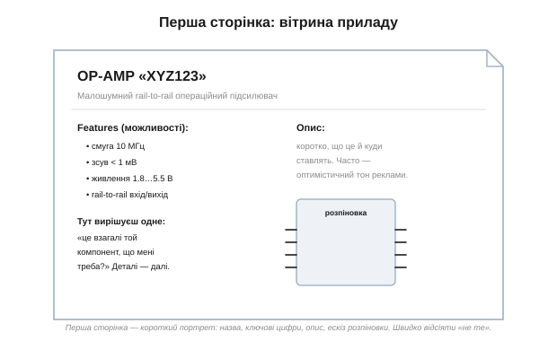

# Даташит — паспорт компонента: структура документа

Кожен серйозний електронний компонент приходить у світ із **паспортом** — офіційним документом від виробника, що зветься **даташит** *(datasheet, «аркуш даних»)*. Це не реклама й не довідка «для загального розвитку»: це повний і єдиний опис того, **як** прилад поводиться, **у яких межах** його можна використовувати й **чого з ним робити не можна**. Навчитися читати даташит — чи не найкорисніше практичне вміння в усій електроніці: воно перетворює роботу з компонентами з угадування на інженерію.

### Що таке даташит і чому його читають

Уявімо, що ви взяли незнайому мікросхему. Яке в неї живлення? Котра ніжка що робить? Скільки струму вона витримає, перш ніж згоріти? Як її підключити, щоб запрацювала? Угадувати тут — означає рано чи пізно щось спалити або тижнями шукати, чому «не працює». А вся відповідь уже є — у даташиті.

А ціна угадування буває висока. Не глянув на гранично допустиму напругу — спалив чип, щойно ввімкнув. Не звірив розпіновку — розвів плату дзеркально, і перепаюй усе наосліп. Узяв «typ» за гарантоване — і схема, що працювала на столі, відмовляє щоп'ятий екземпляр у партії. Усього цього уникають кілька хвилин, проведених у даташиті **до** того, як паяти.


*Рис. На будь-яке питання про прилад — «чи це те, що мені треба?», «як підключити?», «що його не вб'є?» — відповідь дає один документ. Даташит — це **єдине джерело правди** про компонент, написане тим, хто його зробив.*

Ключова думка: даташит — це **первинне джерело**. Не форум, не випадковий допис у блозі, не «здається, так було в схожого чипа», а офіційний документ виробника. Форуми помиляються; даташит — закон. Звісно, і він не безгрішний (бувають і [помилки в самому даташиті](book:electronics/datasheet-fine-print)), але це найнадійніше, що є, і завжди перша інстанція, до якої звертаються.

Зручна аналогія — паспорт автомобіля впереміш із технічним описом і гарантійним талоном. Там і «що це за машина», і точні характеристики, і «не заливай не той бензин, бо зіпсуєш», і дрібний шрифт гарантії. Даташит — те саме для електронного компонента: усе в одному документі, від реклами до юридичних пересторог.

І ще: даташит пишуть **не** для того, щоб ви прочитали його від першої сторінки до останньої. Це **довідник**, у який заходять із конкретним питанням і виходять із конкретною відповіддю. Тому головне вміння — не «прочитати все», а **знати, де що лежить**.

### Карта документа

Хоча кожен виробник оформлює даташити по-своєму, **структура** в них напрочуд однакова. Зверху донизу йдуть ті самі розділи, в одній і тій же логіці: спершу «що це таке», далі «у яких межах живе», потім «які точні числа», і наприкінці «як виглядає й як замовити».


*Рис. Типовий кістяк даташита. Угорі — вітрина (назва, можливості, опис) і розпіновка. Посередині — межі (Absolute Maximum, Recommended Operating) і параметри (Electrical Characteristics, графіки). Унизу — опис роботи, типові схеми застосування й механіка корпусу. Скрізь та сама логіка.*

Пройдімося по карті, щоб знати, що в кожному розділі шукати:

- **Назва, можливості (features), опис** — коротка «вітрина»: що це за прилад і навіщо. Тут вирішують одне: чи взагалі цей компонент підходить.
- **Розпіновка й корпус** — де яка ніжка та в якому [корпусі](book:electronics/packages-pinout) прилад.
- **Absolute Maximum Ratings** — межі, за якими прилад **руйнується**. Це не робочі значення, а червона риса «далі — смерть» (між нею й [робочим діапазоном](book:electronics/abs-max-ratings) зяє навмисна прірва).
- **Recommended Operating Conditions** — а ось де прилад справді мусить працювати.
- **Electrical Characteristics** — головна таблиця: усі параметри з колонками **min / typ / max** і умовами вимірювання (а [«typ» — не обіцянка](book:electronics/min-typ-max)).
- **Typical Performance — графіки** — як параметри [пливуть із температурою, струмом, напругою](book:electronics/datasheet-graphs).
- **Опис роботи, блок-схема** — як прилад улаштований усередині й що робить.
- **Application Information** — типові схеми підключення «по-людськи»: готові рецепти від виробника.
- **Корпус, маркування, замовлення** — механічні розміри, коди на корпусі, як замовити потрібну версію.

Запам'ятавши цю карту раз, ви орієнтуватиметеся в будь-якому даташиті — хоч на діод, хоч на складний мікроконтролер. І ось що втішно: ця структура **масштабується**. Даташит на простий діод — це дві-три сторінки, на операційний підсилювач — десяток, на мікроконтролер — кількасот; та кістяк у них **однаковий**. Тож, навчившись орієнтуватися в коротенькому, ви без страху відкриєте й товстий: розділи ті самі, лише детальніші. Страшна на вигляд товщина — це не складність, а просто більше подробиць у знайомих місцях.

### Перша сторінка — вітрина

Перша сторінка даташита — це **портрет** приладу в стислому вигляді: велика назва, короткий опис одним рядком, список ключових можливостей (features) і часто маленький ескіз розпіновки.


*Рис. Перша сторінка: назва, опис одним реченням, перелік найкращих цифр і ескіз розпіновки. Її завдання — за десять секунд дати зрозуміти, що це за прилад, щоб ви могли вирішити: «моє чи не моє».*

Важливо розуміти **тон** цієї сторінки. Її пише маркетинг, і пише **оптимістично**: тут зберуть найкращі, найкругліші цифри приладу — «смуга 10 МГц!», «зсув менш ніж 1 мВ!». Це правда, але правда **за найкращих умов**. Тому першу сторінку читають, щоб швидко **відсіяти** явно невідповідні компоненти («ні, цей лише до 3 В, а мені треба 12») — а не щоб приймати остаточні інженерні рішення. Для рішень є таблиці далі.

Користь першої сторінки — у швидкості: переглянувши її, ви за хвилину зрозумієте, чи варто читати решту сорок сторінок, чи шукати інший прилад. Корисно також затримати погляд на короткому **описі**: одне-два речення часто кажуть, для чого прилад **задуманий** — «драйвер світлодіодів», «прецизійний для вимірювань», «загального призначення». Прилад, застосований не за призначенням, може й працюватиме, та зазвичай програє тому, що зроблений саме під вашу задачу.

### Не читати поспіль — стрибати до потрібного

Саме тому даташит **не читають** від кірки до кірки. Сорок, вісімдесят, а то й триста сторінок ніхто не осилює поспіль — та й не треба. У даташит заходять із **питанням** і йдуть одразу в той розділ, що на нього відповідає.


*Рис. Кожне питання має свою адресу. «Це той компонент?» — перша сторінка. «Як підключити?» — розпіновка. «Що його не вб'є?» — Absolute Maximum. «Конкретне число?» — таблиця Electrical Characteristics. «Як зміниться в спеку?» — графіки. «Як зібрати схему?» — Application Info.*

Це перетворює страшний на вигляд товстий документ на зручний довідник. Тримаючи в голові карту документа, ви відкриваєте даташит, зразу гортаєте до потрібного розділу — і за хвилину маєте відповідь. Практичний помічник тут — **зміст** на початку документа й пошук по слову (Ctrl+F у PDF): шукаєте «Rds(on)» чи «offset» — і даташит сам приводить вас до потрібного рядка. Інженери так і працюють: не гортають усе підряд, а **шукають** за ключовим словом параметра. З досвідом цей стрибок стає рефлексом: треба максимальний струм — рука сама гортає до Absolute Maximum; треба опір відкритого ключа — до Electrical Characteristics.

Простежмо такий стрибок наживо. Хай треба операційний підсилювач для давача, що живиться від 3.3 В. Відкриваємо даташит кандидата. **Перша сторінка:** живлення «1.8…5.5 В», rail-to-rail — годиться, читаємо далі. **Absolute Maximum:** гранична напруга живлення 6 В — наші 3.3 В далеко в безпеці, добре. **Electrical Characteristics:** знаходимо рядок «вхідний струм зсуву» — саме він критичний для кволого давача. **Графіки:** дивимось, як зсув повзе з температурою, бо прилад працюватиме надворі. **Application:** беремо звідти готову схему ввімкнення. П'ять прицільних поглядів у п'ять розділів — і рішення готове, без читання решти тридцяти сторінок.

### Три голоси даташита

Аби читати даташит правильно, варто чути, що він говорить **трьома різними голосами**, і кожному вірити по-своєму. Бо документ цей служить двом панам водночас: він і **продає** прилад, і **захищає** виробника юридично.


*Рис. Перша сторінка — голос реклами: найкращі цифри, оптимізм. Absolute Maximum — голос юриста: «ми попередили; перейдеш межу — сам винен». Колонки min/typ/max — голос статистики: «typ» це типове, а гарантують лише краї.*

- **Вітрина** (перша сторінка) — голос **реклами**. Найкращі цифри за найкращих умов. Вірити, але пам'ятати про «за найкращих умов».
- **Absolute Maximum** — голос **юриста**. Це межа, поставлена, щоб захистити виробника: «ми вас попередили, що далі прилад руйнується; перейдете — гарантій нема». Її не порушують **ніколи**.
- **min / typ / max** — голос **статистики**. Колонка «typ» (typical) — це **типове** значення, а не обіцянка: конкретний ваш екземпляр може мати інше. Гарантують виробники лише краї — **min** і **max**. Тому серйозну схему рахують по гарантованих межах, а не по «typ».

Наочний приклад: даташит обіцяє «typ» вхідний струм 1 нА, але «max» — аж 10 нА. Зберете схему, розрахувавши на 1 нА, — і вона працюватиме на більшості чипів; та зрідка трапиться екземпляр на 10 нА, і саме він зіпсує вимір. Виробник чесно дав обидва числа — питання лише в тому, на яке ви заклалися. Грамотний інженер закладається на **гарантований** край (max або min, залежно від того, який бік небезпечний), бо лише його обіцяно для кожного приладу.

Уміння чути ці голоси й відрізняти оптимістичну вітрину від гарантованих чисел — половина мистецтва читання даташита.

### Звідки брати й яку версію

Остання, але важлива дрібниця — **звідки** взяти сам даташит. Здавалося б, знайшов PDF — і читай. Та не всякий PDF однаковий.


*Рис. Бери даташит із сайту **виробника**, а не з першого-ліпшого PDF-агрегатора: офіційна копія повна, найновіша й супроводжується списком виправлень. Чужі скани бувають старі, урізані чи навіть від підробки.*

Правило просте: **бери даташит із сайту того, хто зробив компонент**. Випадкові PDF-сайти часто викладають **стару** ревізію, чужий (схожий, але інший) прилад або урізану копію — а то й даташит **підробки**, що видає себе за оригінал. Офіційна ж копія завжди повна й найновіша.

А версія таки важить. Даташити **оновлюють**: виробник уточнює цифри, виправляє помилки, додає застереження. Тому в кутку сторінки завжди стоїть **ревізія** — літера чи дата, а наприкінці документа — історія змін. Стара версія може спокійнісінько «брехати» про те, що в новій уже виправлено. Окремо стережіться позначки **«Preliminary»** чи «Advance Information»: так маркують даташити ще не випущених приладів — їхні цифри попередні й можуть змінитися.

І ще: даташит — не завжди **весь** документ. До багатьох приладів виробник окремо випускає **прикладні нотатки** *(application notes)* з детальними схемами, **референсні дизайни** та [список помилок](book:electronics/datasheet-fine-print) *(errata)*. Якщо в самому даташиті чогось бракує — шукайте ці супутні документи там же, на сайті виробника.

### Де що шукати — коротко

Підсумуймо найкорисніше однією карткою. Питання — і куди по відповідь:

```
чи це той компонент?       → перша сторінка (назва, features)
де яка ніжка?              → розпіновка / pinout
що прилад НЕ вб'є?         → Absolute Maximum Ratings
де він має працювати?      → Recommended Operating Conditions
конкретне число параметра? → Electrical Characteristics (min/typ/max)
як зміниться в спеку/струм?→ Typical Performance (графіки)
як підключити по-людськи?  → Application Information
який корпус, що за код?    → Package / Ordering / Marking
```

### 🔧 Навіщо це

> 🔧 **Навіщо це.** Даташит — перший і головний документ у роботі з будь-яким компонентом, і вміння його читати економить і гроші (не спалені чипи), і тижні («чому не працює»). Запам'ятайте три речі. **Перше:** даташит — єдине джерело правди, перша інстанція, важливіша за будь-який форум. **Друге:** його не читають поспіль — у нього заходять із питанням і стрибають у потрібний розділ за картою документа. **Третє:** чуйте тон — вітрина оптимістична, Absolute Maximum священна, «typ» не гарантоване. Хто це засвоїв, той уже наполовину інженер.

Маючи цю карту згори, найважливіші розділи даташита можна розбирати кожен окремо. Дві таблиці, які найчастіше плутають із фатальними наслідками, — це [Absolute Maximum і Recommended Operating](book:electronics/abs-max-ratings): між «межею знищення» і «робочим діапазоном» там зяє навмисна прірва, і жити приладу треба в меншому з двох діапазонів.
