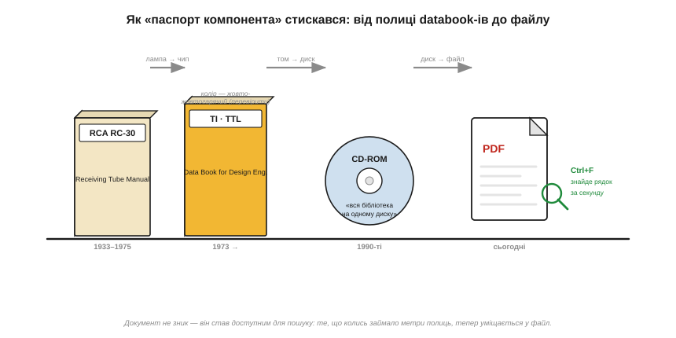

# 📜 Епоха Databook-ів: коли «паспорт компонента» був товстою книгою

Сьогодні даташит — це **PDF-файл**: гортаєш зміст, тиснеш Ctrl+F, за секунду стрибаєш до потрібного рядка. Це здається таким природним, що легко забути: ще пів століття тому той самий «паспорт» був **папером** — і не аркушем, а часто товстенною книгою на полиці. Ця розповідь — про те, звідки взялися даташити в тому вигляді, як ми їх читаємо, чому вони називаються «аркушами даних», хоча колись важили кілограми, і як виглядав робочий стіл інженера, у якого ще не було ані пошуку, ані гіперпосилань.

Питання, з якого все починається, дуже просте. Інженер бере незнайомий компонент — лампу, транзистор, мікросхему — і мусить дізнатися: яке живлення, які межі, як підключити. Сьогодні відповідь — за два кліки. А **де** її брали, коли інтернету не було? І як саме офіційний документ виробника перетворився з полиці книжок на файл, який ми тепер гортаємо на екрані? Простежмо цей шлях — він пояснює і самі слова на обкладинці даташита, і чимало звичок, які інженери досі за собою тягнуть.

*Той самий документ протягом століття: товстий том довідника ери ламп, «цеглина» TTL-databook-а ери логіки, CD-ROM 1990-х і, нарешті, PDF із Ctrl+F. Документ не зник — він став компактним і доступним для пошуку: те, що колись займало метри полиць, тепер уміщається у файл.*

---

## Паспорт, який важив кілограми: чому даташит зветься «аркушем»

Почати варто з самої назви — вона вже зберігає слід тих часів. Саме слово **даташит** (*datasheet*) дослівно означає «аркуш даних» — один листок із характеристиками. І спочатку це й був буквально **аркуш**: на одну лампу чи один транзистор виробник друкував кілька сторінок із параметрами, цоколівкою й типовими схемами. Тоненький аркуш на конкретну деталь — звідси й назва, яка лишилася, хоча самі документи давно перестали бути «аркушами».

Проблема в тому, що компонентів ставало все більше. Радіоприймач 1930-х містив десяток ламп; телевізор 1950-х — кілька десятків; а майстерня, що ремонтувала чужу техніку, мала справу з **сотнями** типів. Носити з собою сотні окремих аркушів — безнадійна справа: загубиш, перемішаєш, потрібного саме не виявиться під рукою. Напрошувалося очевидне рішення: зібрати всі аркуші під одну обкладинку. Так народився **databook** *(data book, «книга даних»)* — товстий довідник, у якому під однією палітуркою лежали даташити на цілу лінійку приладів одного виробника.

І ось тут «аркуш даних» обертається своєю протилежністю: щоб дізнатися про **один** компонент, інженер брав із полиці **книгу** на пів кілограма й більше. Сама назва datasheet лишилася від тих перших тоненьких аркушів — але реальність ери паперу була грубою, важкою й пахла друкарською фарбою. Зрозуміти цю реальність найкраще на двох легендарних прикладах, що стали символами двох епох електроніки: каталозі ламп від RCA і «книзі TTL» від Texas Instruments.

---

## RCA і книга, що знала всі лампи світу

Першу велику епоху електроніки тримали на собі **вакуумні лампи** *(vacuum tubes)* — і її головним «паспортним столом» був американський концерн **RCA** *(Radio Corporation of America)*. RCA не лише випускала лампи мільйонами; вона видавала довідник, який знав їх усі, — **RCA Receiving Tube Manual** («Довідник приймальних ламп RCA»).

Назва, до речі, теж має історію — і вона добре показує, як за сухою абревіатурою ховається злиття чужих одна одній ліній. Спершу, у 1932-му, на ринку були дві окремі лінії ламп зі своїми майже однаковими довідниками: **Radiotron** від RCA (індекс **R**, випуск R-10) і конкурентна **Cunningham** (індекс **C**, випуск C-10). RCA викупила Cunningham, і вже наступним випуском, RC-11 (1933), обидва довідники звели під одну обкладинку — звідси й марка **RC**: **R**adiotron + **C**unningham. Так у скромних літерах «RC» на корінці книги застигла ціла історія злиття двох торгових ліній. Серія видавалася десятиліттями: від **RC-11** (1933) через довгу низку перевидань до **RC-30** (1975) — останнього випуску, що коштував усього близько трьох доларів. Майже пів століття під майже незмінною назвою — рідкісне довголіття для технічного довідника.

Що там лежало всередині? Усе, що потрібно майстрові. На кожну лампу — її призначення (підсилювач, випрямляч, детектор), цоколівка (*basing*, який штир за що відповідає), граничні й робочі режими (анодна напруга, струм, розсіювана потужність) і — найцінніше — **криві характеристик**: графіки, як струм лампи залежить від напруги на сітці. Тобто рівно той самий набір, який інженер шукає в сучасному даташиті: межі, параметри, графіки, цоколівка — та сама [структура документа](topic:electronics/datasheet-structure). Лише все це було на папері, чорно-білим друком, і знайти потрібну лампу можна було хіба за абеткою в покажчику — ніякого Ctrl+F.

> 🔧 **Навіщо це.** [Структура сучасного даташита](topic:electronics/datasheet-structure) — це **не винахід епохи мікросхем**. Поділ на «межі / робочі режими / характеристики / графіки / цоколівка» склався ще в каталогах ламп майже сто років тому, бо саме ці питання інженер ставить компонентові завжди — байдуже, лампа це, транзистор чи сучасний чип. Тому, навчившись орієнтуватися в одному даташиті, ту саму карту впізнаєш і в музейному довіднику ламп, і в PDF на новий мікроконтролер.

Окремо варто сказати про **роль** такого довідника, бо вона ширша за «список деталей». RCA Receiving Tube Manual був ще й **підручником**: на його сторінках пояснювали, як лампа працює, як читати криві характеристик, як спроектувати простий підсилювач. Покоління радіоаматорів і телемайстрів навчалися ремеслу буквально по цій книзі. Це теж риса епохи: коли інформацію було важко дістати, єдиний довідник брав на себе одразу всі ролі — і паспорт, і підручник, і порадник. Сучасний даташит цю просвітницьку частину здебільшого скинув у окремі **прикладні нотатки** (*application notes*); а колись усе жило під однією обкладинкою.

---

## «Жовтогаряча цеглина» від Texas Instruments: книга, що визначила цифрову логіку

Лампи відійшли, настала ера **напівпровідників** — спершу транзисторів, далі інтегральних мікросхем. І в нової епохи з'явився свій культовий databook, який інженери-цифровики згадують із теплом і досі: **The TTL Data Book for Design Engineers** від **Texas Instruments** *(TI)* — «Книга даних TTL для інженерів-проєктувальників».

Щоб зрозуміти, чому вона стала легендою, треба знати, що таке **TTL**. Це **транзисторно-транзисторна логіка** *(Transistor–Transistor Logic)* — сімейство цифрових мікросхем, які TI почала випускати в середині 1960-х під номерами серії **7400** (перша мікросхема серії, 7400, — чотири логічні елементи «І-НЕ» в одному корпусі — з'явилася в TI близько 1964 року). Ці маленькі чипи — логічні вентилі, тригери, лічильники, регістри — стали **цеглинками**, з яких інженери складали все: від калькуляторів до перших мікрокомп'ютерів, ще доти, як готовий процесор можна було купити одним чипом. Серія 7400 розрослася до сотень різних мікросхем — і всі вони потребували паспорта.

Цим паспортом і стала «книга TTL». Перше видання вийшло близько **1973 року** товстим томом на кількасот сторінок; далі були перевидання, а згодом — кілька томів, бо приладів ставало все більше. Усередині — даташит на кожну мікросхему серії: цоколівка, таблиці істинності, рівні напруг, затримки, граничні режими. Для цілого покоління інженерів-цифровиків ця книга була настільною в буквальному сенсі: вона лежала **на столі**, розгорнута, поки людина паяла макет, і її гортали по сто разів на день.

А ще вона мала **впізнаваний вигляд** — і саме тут варто бути акуратним із пам'яттю. У спогадах інженерів обкладинка «книги TTL» часто згадується як **жовтогаряча** (помаранчева). Документально точний відтінок підтвердити складно: збереглися описи, де оправу одного з видань (другого, початку 1980-х) називають радше **жовтою** з чорним написом на корінці. Тож чесно буде сказати так: культова обкладинка TTL Data Book належала до **жовто-жовтогарячої** гами, і саме за цей теплий колір її впізнавали на полиці серед інших книг; а от чи кваліфікувати конкретний відтінок як «помаранчевий» чи «жовтий» — питання видання й пам'яті, **точну назву кольору варто перевірити** за конкретним примірником. Важить тут не сам пігмент, а явище: databook став настільки звичним предметом на робочому місці, що інженери впізнавали його за кольором обкладинки, як впізнають корінець улюбленої книги.

> 🔧 **Навіщо це.** Номери серії **74xx**, які народилися в цій книзі, живі й сьогодні: коли в сучасній схемі ви бачите 74HC595 чи 74LVC245, це прямі нащадки тих самих «цеглинок» із жовто-жовтогарячого тому TI. Звичка тримати даташит **відкритим поруч**, поки збираєш схему, — теж звідти; змінився лише носій: замість розгорнутої книги тепер відкрита вкладка PDF на другому моніторі.

Інші виробники мали свої легендарні databook-и — National Semiconductor, Motorola, Fairchild випускали товсті томи на операційні підсилювачі, пам'ять, лінійні мікросхеми. Полиця інженера 1970–80-х була заставлена цими книгами корінець до корінця, і вміння **швидко знайти потрібний том і потрібну сторінку** було такою самою робочою навичкою, як сьогодні — вправний пошук по PDF.

---

## Життя без Ctrl+F: як інженер працював із полицею книг

Варто на хвилину уявити цей робочий стіл буквально, бо він пояснює багато сьогоднішніх звичок. В інженера ери databook-ів **не було пошуку**. Щоб знайти параметр, він мусив: згадати, **який** виробник робить потрібний чип; зняти з полиці **правильний том**; знайти прилад у **покажчику** (часто за номером або за абеткою); розгорнути на потрібній сторінці; і **очима** пробігти таблицю в пошуках рядка. Жодного миттєвого стрибка до слова «Rds(on)» чи «offset» — лише пальці, покажчик і знання, де що лежить.

Це робило **[карту документа](topic:electronics/datasheet-structure)** не зручністю, а **необхідністю**. Інженер мусив тримати структуру даташита в голові, бо інакше губився в сотнях сторінок без жодної підказки. Звідси й досі живий рефлекс досвідчених людей: відкривши геть незнайомий даташит, вони не читають його поспіль, а одразу гортають у потрібний розділ — рука пам'ятає карту з тих часів, коли іншого способу просто не існувало.

Була й інша, дуже земна морока — **актуальність**. Виробник уточнював характеристики, виправляв помилки, додавав застереження ([виправлення, *errata*](topic:electronics/datasheet-fine-print)) — і друкував **нове видання**. Але старі книги ж нікуди не дівалися: вони стояли на полицях по всьому світу й спокійнісінько «брехали» застарілими цифрами. Інженер мусив сам стежити, що його том не з минулого десятиліття. Сьогодні ту саму небезпеку формулюють як «бери найновішу ревізію з сайту виробника» — але тоді не було ні сайту, ні легкого способу дізнатися, що вийшла свіжіша версія. Хіба що замовити нове видання поштою й чекати тижнями.

Звідси й ще одна звичка-спадок: **довіра до першоджерела**. [Даташит виробника](topic:electronics/datasheet-structure) — закон, а форум — ні. Це правило загартувалося саме в паперову епоху, коли альтернативою офіційному databook-у були хіба чутки, аматорські записники та переписані від руки таблиці, у яких легко закрадалася помилка. Книга від виробника була єдиним надійним якорем — і це ставлення інженери пронесли крізь усі зміни носіїв.

---

## Від полиці до файлу: CD-ROM, інтернет і PDF

Кінець епохи паперових томів настав у **1990-х**, і прийшов він у два кроки. Спершу виробники почали розсилати databook-и на **CD-ROM**: один оптичний диск вміщав те, що раніше займало цілу полицю книг. Інженер отримував поштою конверт із диском — і вся бібліотека даташитів виробника лежала в шухляді замість метра полиці. Це вже був стрибок: на диску працював бодай якийсь електронний покажчик, а копія сторінки не вимагала ксерокса.

Та справжній перелом приніс **інтернет**. Коли в кожного виробника з'явився сайт, потреба возити папір чи диски відпала зовсім: даташит став **файлом**, який можна завантажити будь-коли й будь-звідки, завжди в найновішій ревізії. Формат, який переміг, — **PDF** *(Portable Document Format)*: він зберігав точний вигляд друкованої сторінки (ті самі таблиці, ті самі графіки), але був невагомий, його можна було копіювати без втрат — і, головне, у ньому працював **пошук**. Те саме знамените Ctrl+F, з якого, по суті, і починається робота із сучасним даташитом, стало доступним кожному.

І ось що цікаво: сам **зміст** даташита від цього майже не змінився. PDF на сучасний мікроконтролер влаштований так само, як паперовий databook сорок років тому: перша сторінка-вітрина, граничні режими, таблиця характеристик із колонками, графіки, цоколівка, типові схеми. Та сама [карта документа](topic:electronics/datasheet-structure) — лише носій став легким, а пошук миттєвим. Документ не зник і не спростився; він **стиснувся** з полиці книг до файла і **навчився знаходити сам себе** за ключовим словом.

Тому, гортаючи сьогодні PDF і тиснучи Ctrl+F, варто пам'ятати, на чиїх плечах стоїть ця зручність. За легким файлом — століття паперових томів: каталоги ламп RCA, на яких училося покоління радіомайстрів; жовто-жовтогарячі книги TTL, по сто разів на день розгорнуті на робочих столах; полиці databook-ів, де вміння **знайти потрібну сторінку** було таким самим ремеслом, як паяння. Слово «datasheet» — «аркуш даних» — досі носить у собі пам'ять про той перший тоненький аркуш на одну лампу, з якого все й почалося.
