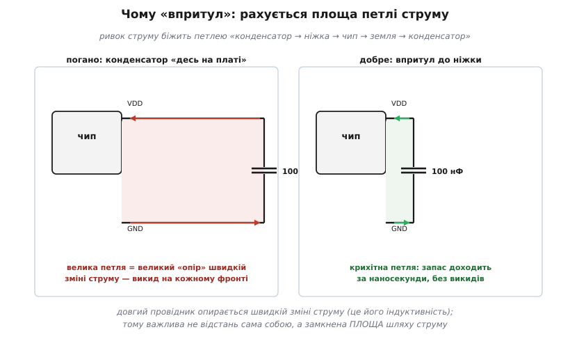
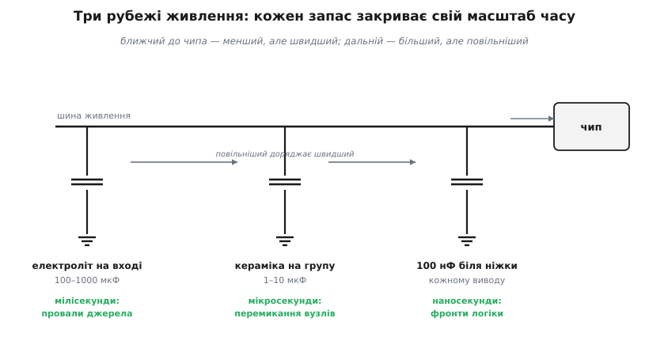

# 🔌 Розв'язувальний конденсатор

Цифровий чип живиться не рівним струмом, а ривками. Кожен раз, коли всередині перемикаються мільйони транзисторів, він за частки наносекунди вимагає від живлення різкий сплеск струму, а наступної миті — майже нічого. Якщо цей сплеск тягти здалеку, проводами через пів плати, напруга на ніжці живлення провалюється рівно тоді, коли чип найбільше її потребує, і логіка починає збоїти. Розв'язувальний конденсатор (англ. *decoupling* — розв'язування, розчеплення: він «розчеплює» живлення чипа від решти плати) ставлять упритул до ніжки саме для того, щоб ці ривки бралися з-під боку, а не зі шнура через усю плату.

### Що він насправді робить: місцева бочка із зарядом

Найпростіша й найточніша картина — **бочка з водою біля крана**. Магістраль (джерело живлення) подає воду рівно й неспішно. Кран (чип) то стоїть закритий, то на мить відкривається навстіж. Якби кран висів просто на тонкій довгій трубі від магістралі, при різкому відкритті тиск біля нього падав би — труба не встигає прогнати потрібний об'єм за мить. Поставимо біля крана бочку: різкий відбір вона покриває власним запасом миттєво, а магістраль потім неспішно її доливає між відборами. Конденсатор — і є така бочка для заряду: між ривками джерело його тихо підзаряджає, а на ривку він віддає накопичений заряд просто на місці.

Звідси одразу видно, **чому головне — близькість, а не велика ємність**. Користь дає не сам по собі запас, а те, що він під самим краном. Велика бочка за сто метрів труби допоможе не більше за тонкий шнур: поки заряд дотече, ривок уже минув. Тому розв'язку оцінюють не за тим, скільки заряду в конденсаторі, а за тим, **наскільки швидко й беззбитково** він цей заряд віддасть у точку споживання.

Є й другий, рівноцінний погляд на ту саму деталь — частотний. Рівне живлення — це постійна напруга, нуль герц; ривки споживання — це швидкозмінна, високочастотна складова. Конденсатор пропускає змінний струм і не пропускає постійний, тож для високочастотного «шуму» споживання він — майже коротке замикання просто на землю поряд із чипом. Постійну напругу він тримає, а всі швидкі коливання замикає на місці, не пускаючи їх ні в живлення інших вузлів, ні назад у чип. Обидві картини — «бочка із зарядом» у часі й «коротке для високих частот» у частоті — описують один і той самий фізичний предмет.

### Скільки заряду треба: worked-приклад

Перетворимо «бочку» на число. Поки джерело не встигло втрутитися, конденсатор сам тримає напругу, а зв'язок між відданим зарядом і просадкою напруги в нього лінійний: ΔQ = C · ΔU. Заряд, який чип висмикне за час ривка, — це I · Δt. Прирівнявши, дістаємо потрібну ємність під задану допустиму просадку.

**Чип на ривку тягне 0.5 А протягом 2 нс; напрузі живлення 3.3 В дозволено просісти не більше ніж на 50 мВ. Якої ємності досить?**

```
ΔQ = I · Δt = 0.5 А · 2×10⁻⁹ с = 1.0×10⁻⁹ Кл   (заряд за ривок)
C  = ΔQ / ΔU = 1.0×10⁻⁹ / 0.05 = 2.0×10⁻⁸ Ф ≈ 20 нФ
```

Двадцяти нанофарад вистачає з запасом — і 100 нФ їх перекривають. Ось чому типовий номінал саме такого порядку: він закриває звичайний логічний ривок із кратним запасом, а не випадково. (Як саме конденсатор віддає заряд при просадці — у [застосуваннях конденсаторів](topic:electronics/capacitor-uses).) Застереження: цей розрахунок дає лише **потрібний заряд**. Чи встигне той заряд дійти за наносекунди — вирішує вже не ємність, а паразитна індуктивність шляху, і саме вона диктує, де конденсатор поставити.

> 🔧 **Навіщо це.** Прикинути ємність на серветці корисно, коли чип незвичний — потужний драйвер, ПЛІС із широкою шиною. Береш струм ривка й допустиму просадку з даташита, ділиш — і бачиш, чи вистачає стандартних 100 нФ, чи треба ярус більших конденсаторів поряд.

### Чому саме 100 нФ кераміки

Зведімо вимоги докупи. Заряду треба небагато — десятки нанофарад. Натомість віддати його конденсатор мусить устигати за наносекундними фронтами, а це впирається не в ємність, а в **мізерні [паразитні ESR і ESL](topic:electronics/capacitor-parasitics)** — послідовні опір та індуктивність, які гальмують швидку віддачу заряду. Обидві вимоги найкраще задовольняє дрібний багатошаровий керамічний конденсатор (MLCC): у крихітному корпусі 0402/0603 він має і потрібний заряд, і найнижчу паразитну індуктивність. 100 нФ — вдала середина: заряду досить із запасом, корпус найдрібніший зі зручних, ціна — копійка.

Це не магічна константа, а компроміс, який індустрія прийняла за замовчуванням. Для ненажерливих чипів даташит просить більше або кілька штук. А **чому саме кераміка**, чому дрібніший корпус кращий за більший і де ховається пастка з номінальною напругою — окремо й докладно в [MLCC для розв'язки](topic:electronics/decoupling/comp-mlcc.md).

### Чому «впритул»: рахується площа петлі

Ривок струму біжить **петлею**: з конденсатора в ніжку живлення, крізь чип, у землю й назад у конденсатор. Довгий провідник опирається швидкій зміні струму — це його [індуктивність](topic:electronics/inductance); наслідок прямий: кожен зайвий сантиметр шляху на наносекундному фронті коштує відчутного викиду напруги, і запас «не встигає» дійти. Причому рахується не відстань сама собою, а **замкнена площа петлі**: туди-назад поруч прокладені шляхи майже не заважають, а розгониста петля через пів плати зводить користь конденсатора нанівець.


*Та сама схема, різна геометрія. Ліворуч конденсатор «десь на платі» — петля величезна, і на кожному фронті чип бачить викид замість рівного живлення. Праворуч — конденсатор біля самої ніжки, петля крихітна: запас встигає за наносекунди.*

Звідси правила розведення, які варто знати ще до першої плати:

- **один конденсатор на кожен вивід живлення**, а не «один на чип»: у багатовивідних мікросхем кожна пара VDD/GND — окрема петля;
- конденсатор — **між живленням і землею прямо біля ніжки**, перехідні отвори в полігон землі — поряд із ним, а не за сантиметр;
- якщо біля ніжки пара «дрібний + більший» — **дрібний ближче**: йому важлива кожна десята міліметра, більший може стояти далі.

> 🔧 **Навіщо це.** На схемі конденсатор просто висить між живленням і землею — і здається, що байдуже, де його поставити. На платі ж уся користь вирішується саме розташуванням: «правильна» схема з конденсаторами в зручному кутку плати працює гірше за недбалу схему з конденсаторами впритул до ніжок. Розводячи плату, розв'язку ставлять першою, ще до сигнальних доріжок.

### Три рубежі: ієрархія запасів

Одна кераміка не закриває всього: вона миттєва, але мала — десятки нанофарад вичерпуються за наносекунди. Довший провал (поки прокинеться стабілізатор, поки магістраль дожене відбір) така крихта не витримає. Тому живлення будують **каскадом** запасів — пірамідою часів, де кожен ярус відповідає за свій діапазон тривалості провалу, аж до повільних резервів на кшталт [суперконденсатора](topic:electronics/supercapacitor):


*Три рубежі живлення. Кераміка 100 нФ біля ніжки гасить наносекундні фронти; конденсатор 1–10 мкФ на чип чи групу — мікросекундні перемикання; вхідний електроліт — мілісекундні провали джерела. Кожен повільніший рубіж спокійно доряджає швидший між ривками.*

Працює це як естафета. Найшвидший і найближчий рубіж — кераміка біля ніжки — приймає перший, наносекундний удар. Поки він віддає заряд, його вже підживлює ярус більших конденсаторів (1–10 мкФ на чип чи групу), розрахований на мікросекундні перемикання вузлів. А той, своєю чергою, спирається на вхідний електроліт, що тримає мілісекундні провали самого джерела. Кожен ярус доряджає сусіда-швидшого між його ривками, і чип ніколи не лишається без запасу потрібної швидкості.

Типовий рецепт для невеликої плати: **100 нФ на кожну ніжку живлення + 4.7–10 мкФ на чип або групу + електроліт на вході**. І чому багато дрібних краще за один великий: по-перше, великий фізично не може стояти впритул до всіх ніжок; по-друге, [паралельні конденсатори ділять між собою](topic:electronics/capacitors-series-parallel) й паразитні ESL/ESR — гурт дрібних «швидший» за одного великого тієї ж сумарної ємності.

### Типові граблі

- **Конденсатори «акуратним рядком»** на краю плати, далеко від чипів: на схемі все правильно, на платі — велетенські петлі. Розв'язка живе не в схемі, а в геометрії.
- **Спільна тонка доріжка до землі** для кількох конденсаторів: усі петлі стають довгими одразу. Зворотний шлях віддають суцільному полігону землі, а не нитці.
- **Забутий вивід живлення** у чипа з кількома парами VDD/GND — саме він потім «ловить» збої, бо його петля лишилася без власного запасу.
- **«Більше — краще»:** замінити 100 нФ на 10 мкФ Y5V у більшому корпусі — означає відсунути конденсатор від ніжки й втратити частину ємності під робочою напругою (ефект DC bias розібрано у вставці про [MLCC](topic:electronics/decoupling/comp-mlcc.md)). У розв'язці «більше мікрофарад» майже ніколи не означає «краще».
- **Драбинка різних номіналів** (100 нФ + 1 нФ): пара різних конденсаторів може утворити [антирезонанс](topic:electronics/lc-resonance) і на деяких частотах навіть підняти опір живлення замість того, щоб його притиснути. Сучасна типова порада — кілька **однакових** 100 нФ.

### Варіації

У швидких цифрових чипів розв'язку описує даташит — і його рекомендація завжди б'є типовий рецепт: виробник знає спектр власних ривків і дає під нього точний набір номіналів та їх розташування. Чутливі аналогові вузли (опорна напруга, вимірювальні кола) отримують **окрему** розв'язку, а часто й окремо відфільтроване живлення, щоб цифрові перемикання не наводили шум у тонке вимірювання. Але хоч би яким складним був чип, перший рядок його обв'язки однаковий: 100 нФ, впритул, коротка петля.
