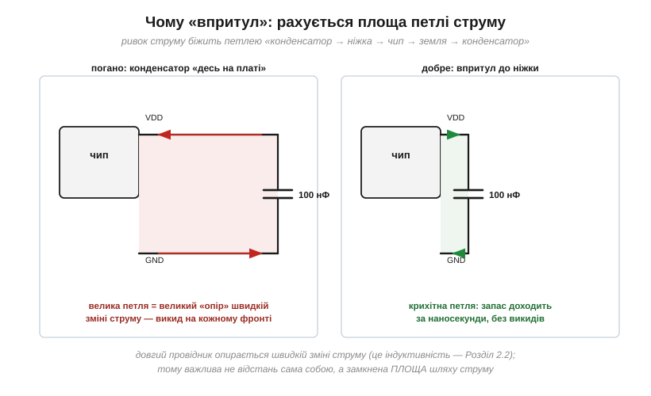
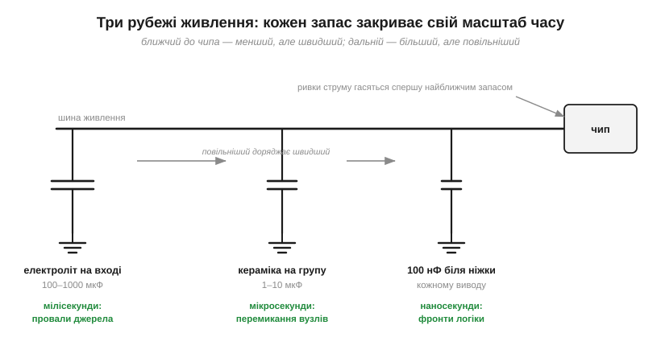

# 🔌 Розв'язувальні конденсатори: 100 нФ біля кожної ніжки живлення

> Каталог «Компоненти» · сектор `passive`.

### Чому саме 100 нФ кераміки

Розв'язувальний конденсатор мусить устигати за наносекундними фронтами — тож головні його якості не ємність, а **мізерні [паразитні ESR і ESL](book:electronics/capacitor-parasitics)**. Дрібний керамічний MLCC у корпусі 0402/0603 тут поза конкуренцією. А 100 нФ — золота середина: заряду досить, щоб типовий ривок просадив напругу лише на мілівольти (це випливає з [того, як конденсатор віддає заряд при просадці](book:electronics/capacitor-uses)), корпус — найдрібніший зі зручних, ціна — копійка. Це не магічна константа, а вдалий компроміс, який індустрія прийняла за замовчуванням; для ненажерливих чипів даташит просить більше або кілька.

### Чому «впритул»: площа петлі

Ривок струму біжить **петлею**: з конденсатора в ніжку живлення, крізь чип, у землю й назад у конденсатор. Довгий провідник опирається швидкій зміні струму — це [індуктивність](book:electronics/inductance); наслідок прямий: кожен зайвий сантиметр шляху на наносекундному фронті коштує відчутного викиду напруги, і запас «не встигає» дійти. Причому рахується не відстань сама собою, а **замкнена площа петлі**: туди-назад поруч прокладені шляхи майже не заважають, а розгониста петля через пів плати зводить користь конденсатора нанівець.

*Рис. Та сама схема, різна геометрія. Ліворуч конденсатор «десь на платі» — петля величезна, і на кожному фронті чип бачить викид замість рівного живлення. Праворуч — конденсатор біля самої ніжки, петля крихітна: запас встигає за наносекунди.*

Звідси правила розведення, які варто знати ще до того, як малювати першу плату:

- **один конденсатор на кожен вивід живлення**, а не «один на чип»: у багатовивідних мікросхем кожна пара VDD/GND — окрема петля;
- конденсатор — **між живленням і землею прямо біля ніжки**, перехідні отвори в полігон землі — поряд із ним, а не за сантиметр;
- якщо біля ніжки пара «дрібний + більший» — **дрібний ближче**: йому важлива кожна десята міліметра, більший може стояти далі.

### Три рубежі: ієрархія запасів

Одна кераміка не закриває всього: вона миттєва, але мала. Тому живлення будують **каскадом** запасів — піраміда часів, де кожен ярус відповідає за свій діапазон тривалості провалу, аж до повільних резервів на кшталт [суперконденсатора](book:electronics/supercapacitor):

*Рис. Три рубежі живлення. Кераміка 100 нФ біля ніжки гасить наносекундні фронти; конденсатор 1–10 мкФ на чип чи групу — мікросекундні перемикання; вхідний електроліт — мілісекундні провали джерела. Кожен повільніший рубіж спокійно доряджає швидший між ривками.*

Типовий рецепт для невеликої плати: **100 нФ на кожну ніжку живлення + 4.7–10 мкФ на чип або групу + електроліт на вході**. І чому багато дрібних краще за один великий: по-перше, великий фізично не може стояти впритул до всіх ніжок; по-друге, [паралельні конденсатори ділять між собою](book:electronics/capacitors-series-parallel) й паразитні ESL/ESR — гурт дрібних «швидший» за одного великого тієї ж сумарної ємності.

### Типові граблі

- **Конденсатори «акуратним рядком»** на краю плати, далеко від чипів: на схемі все правильно, на платі — велетенські петлі. Розв'язка живе не в схемі, а в геометрії.
- **Спільна тонка доріжка до землі** для кількох конденсаторів: усі петлі стають довгими одразу.
- **Забутий вивід живлення** у чипа з кількома парами VDD/GND — саме він потім «ловить» збої.
- **«Більше — краще»:** замінити 100 нФ на 10 мкФ Y5V у більшому корпусі — означає відсунути конденсатор від ніжки й втратити пів ємності під напругою (DC bias — [вставка про MLCC](book:electronics/decoupling/comp-mlcc.md)).
- Інколи радять ставити поряд різні номінали (100 нФ + 1 нФ); із цим обережно: пара різних конденсаторів може утворити [резонанс](book:electronics/lc-resonance) і на деяких частотах навіть погіршити картину. Сучасна типова порада — кілька **однакових** 100 нФ.

### Варіації

У швидких цифрових чипів розв'язку описує даташит — і його рекомендація завжди б'є типовий рецепт. Чутливі аналогові вузли (опорна напруга, вимірювальні кола) отримують **окрему** розв'язку, а часто й окремо відфільтроване живлення, щоб цифрові перемикання не наводили шум у тонке вимірювання. Але хоч би яким складним був чип, перший рядок його «обв'язки» однаковий: 100 нФ, впритул, коротка петля.
