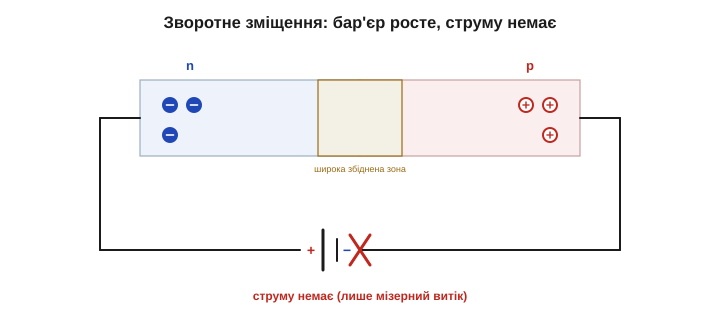

# Пряме й зворотне зміщення: клапан для струму

[PN-перехід у спокої](topic:physics/pn-junction) — це тонка збіднена область, що майже не проводить, і вбудований бар'єр ≈0.7 В, який зрівноважує дифузію. У спокої струму немає. Тепер — найцікавіше: під'єднаймо до переходу **зовнішнє джерело** й подивімося, як воно керує тим бар'єром. Виявиться, що **напрямок** під'єднання вирішує все: одним боком ми бар'єр зіб'ємо й відкриємо дорогу струму, іншим — піднімемо й замкнемо її ще міцніше. Дві протилежні відповіді на дві полярності — це і є та однобічність, заради якої діод узагалі існує: струм лише в один бік.

### Вихідна позиція

Перед нами — кристал із двома виводами: один до p-області, другий до n. Усередині, на межі, сидить збіднена область без рухливих носіїв і бар'єр ≈0.7 В. Поза нею в n повно вільних електронів, у p — дірок ([легування додає носіїв](topic:physics/doping)). Усе, що ми робитимемо далі, — це або **допомагати** носіям долати бар'єр, або **заважати** їм. Перше зветься прямим зміщенням, друге — зворотним.

Ключ до обох випадків — порівняти зовнішнє поле з **вбудованим** полем [PN-переходу](topic:physics/pn-junction). Якщо вони протилежні, зовнішнє послаблює бар'єр; якщо співнапрямлені — підсилюють його. Уся різниця між «тече» і «не тече» зводиться до цього простого зіставлення напрямків.

### Пряме зміщення: відкриваємо клапан

Під'єднаймо **плюс** джерела до p-області, а **мінус** — до n. Що відбувається?

По-перше, зовнішнє поле напрямлене **проти** вбудованого — отже, воно **знижує** бар'єр. По-друге, плюс джерела відштовхує дірки p-області до межі, а мінус підштовхує електрони n-області теж до межі. Носії з обох боків насуваються на збіднену зону — і вона **звужується**.

Поки зовнішня напруга мала, бар'єр іще зависокий, і струм мізерний. Та щойно напруга наближається до висоти бар'єра (≈0.7 В для кремнію), він фактично зникає — і носії **ринуть** через перехід. Електрони заходять у p, дірки — в n, вони рекомбінують, а джерело безперервно постачає нові: тече **великий, сталий струм**. Клапан відкрито.

Звідки береться **сталий** струм, якщо носії, перейшовши межу, одразу рекомбінують і зникають? Бо джерело їх безупинно поповнює. З мінусового затискача в n-область весь час входять нові електрони, а з p-області плюсовий затискач весь час «висмоктує» електрони, лишаючи нові дірки. Скільки носіїв зникло в рекомбінації на переході — стільки джерело й підкачало ззовні. Виходить безперервний конвеєр: електрони й дірки сходяться до межі, гинуть у рекомбінації, а замість них у коло надходять нові. Це і є прямий струм діода — і він може бути великим, бо в [легованих областях](topic:physics/doping) носіїв багато.

Заразом зникає й сама перешкода: збіднена область, що в спокої була майже ізолятором, під прямою напругою стискається до ніщо — ізолювальний прошарок тане, і кристал від краю до краю стає провідним. Тому відкритий діод має дуже малий опір, і струм у колі обмежує вже не він, а решта кола (резистор, внутрішній опір джерела). Власне, **без** зовнішнього обмежувача прямий струм може стати небезпечно великим — тому діод майже завжди ставлять разом із чимось, що цей струм лімітує.


*Плюс джерела — до p, мінус — до n. Зовнішнє поле знижує бар'єр, носії насуваються на межу, збіднена область звужується. За напруги вище ≈0.7 В носії вільно переходять — тече великий струм.*

Ось звідки відоме правило «діод відкривається приблизно з 0.7 вольта»: саме стільки треба, щоб «збити» вбудований бар'єр кремнію. Нижче цього порогу діод майже не проводить, вище — проводить дедалі легше.

Уточнімо одразу: 0.7 В — це не «вмикач», що різко спрацьовує. Перехід відкривається **поступово**: трохи нижче порогу струм дуже малий, а далі наростає надзвичайно круто — щойно напруга підбирається до 0.7 В, він злітає вгору. Тому на позір і здається, ніби діод «вмикається» рівно там, хоча насправді це плавна, але дуже стрімка крива. Її точну форму показує [вольт-амперна характеристика діода](topic:electronics/diode-iv-curve).

> 🔧 **Навіщо це.** Цей поріг ≈0.7 В (для кремнію) — не дрібниця, а число, з яким інженер живе щодня: на відкритому кремнієвому діоді завжди «губиться» близько 0.7 В, і це треба враховувати в розрахунках (а в германієвого — близько 0.3 В). Кількісно це падіння задає [вольт-амперна характеристика](topic:electronics/diode-iv-curve); поки досить запам'ятати: щоб діод відкрився, прямій напрузі треба здолати його бар'єр.

### Зворотне зміщення: замикаємо клапан

Тепер поміняймо полярність: **плюс** — до n, **мінус** — до p. Усе перевертається.

Зовнішнє поле тепер напрямлене **в той самий бік**, що й вбудоване, — отже, воно бар'єр **підвищує**. До того ж плюс на n-боці відтягує електрони **від** межі, а мінус на p-боці відтягує дірки теж від межі. Носії розбігаються від переходу — і збіднена область **розширюється**, стаючи ще «товстішою» ізолювальною прокладкою.

Дороги для основних носіїв через перехід немає — струм практично **не тече**. Лишається хіба що крихітний «витік»: нечисленні неосновні носії ([теплові пари електрон-дірка](topic:physics/semiconductor)) все ж дрейфують через перехід, даючи мікроскопічний зворотний струм — мікроампери або менше. Практично — клапан замкнено.

Що більша зворотна напруга, то ширша збіднена область: майже вся прикладена напруга падає на цій ізолювальній прокладці, тож вона мусить ширшати (приблизно як √U). Це пасивний електростатичний наслідок, а не активна саморегуляція — товщий «мур» сам по собі пробою не відвертає. До певної межі, звісно: задерти зворотну напругу надто високо — і бар'єр кінець кінцем «прорве», що описує [пробій на вольт-амперній характеристиці](topic:electronics/diode-iv-curve). А до тієї межі в зворотному напрямку діод тримає, пропускаючи лише мізерний витік.


*Плюс — до n, мінус — до p. Зовнішнє поле додається до вбудованого, бар'єр росте, носії відступають від межі, збіднена область ширшає. Шляху для струму немає — тече лише мізерний витік неосновних носіїв.*

Зауважмо цікаве: той самий витік **росте з нагріванням** — бо тепло народжує більше [неосновних носіїв у напівпровіднику](topic:physics/semiconductor). Тому розігрітий діод «тримає» зворотну напругу трохи гірше, ніж холодний; на практиці це дрібниця, але саме звідси й тягнеться чутливість напівпровідників до температури. Та для звичайної роботи цей витік такий малий, що його сміливо вважають нулем: у зворотному напрямку діод — практично розрив у колі.

### Бар'єр угору-вниз: одна картина

Найкоротше всю суть видно на «пагорбі» бар'єра. У спокої він має певну висоту (≈0.7 В). Пряме зміщення **знижує** пагорб — носіям легко перевалити, тече струм. Зворотне — **підвищує** пагорб ще дужче, і перейти його не може майже ніхто.

Уявімо носії кульками, що котяться до пагорба. У спокої перевалити його вдається одиницям. Пряме зміщення ніби «зрізає» пагорб — і кульки масово перекочуються на той бік. Зворотне навпаки — насипає його ще вище, і не долітає вже ніхто. Помітьте й красу симетрії: те саме джерело, лише перевернуте, дає протилежні наслідки — бо воно або **проти** вбудованого поля, або **вздовж** нього. Один компонент, дві поведінки, а перемикає між ними сам знак напруги — у цьому й уся магія діода.


*Той самий перехід у трьох станах. У спокої — бар'єр ≈0.7 В. Пряме зміщення знижує його (носії переходять — струм тече). Зворотне підвищує (перехід замкнено). Уся робота діода — це керування висотою цього пагорба.*

### Клапан: однобічність нарешті пояснена

Зведімо докупи. **Пряме** зміщення (плюс до p) відкриває діод — струм тече. **Зворотне** (плюс до n) замикає — струму немає. Це і є той **однобічний клапан**: уся однобічність діода зводиться до того, по чи проти вбудованого поля [PN-переходу](topic:physics/pn-junction) діє зовнішня напруга. Ось *чому* кристал пропускає струм лише в один бік.


*Водопровідна аналогія: зворотний клапан. Потік «у дозволений» бік відкриває стулку й проходить вільно; потік у зворотний бік притискає стулку до сідла й не проходить. Діод робить те саме зі струмом.*

Класична аналогія — **зворотний клапан** (як у водопроводі чи в насосі): тисни в дозволений бік — стулка відхиляється, рідина тече; тисни у зворотний — стулка притискається до сідла й перекриває потік. Діод поводиться точнісінько так само, тільки з електричним струмом замість води. Згодяться й інші образи: турнікет у метро (у дозволений бік провертається й пропускає, штовхни назад — заклинить) або двері, що відчиняються лише в один бік. Спільне в усіх одне — **несиметрія**: легко туди, неможливо назад.

### Анод, катод і символ

У діода два виводи мають власні назви. Вивід від **p**-області — **анод** (гр. *ánodos* — «шлях угору»), від **n**-області — **катод** (гр. *káthodos* — «шлях униз»); обидві назви ще 1834 року вигадав Вільям Г'юелл для дослідів Майкла Фарадея. Пряме зміщення — це коли на анод подано **плюс** (а на катод мінус); тоді струм тече від анода до катода крізь діод. Зворотне — навпаки.

Куди саме тече струм усередині відкритого діода? Умовний (додатний) струм — від анода (p) до катода (n), у напрямку трикутника символу. Усередині його несуть **обидва** типи носіїв: дірки рухаються від анода до межі, електрони — від катода до межі, і обидва потоки складаються в один струм (бо [легування](topic:physics/doping) наповнило кожну область своїми носіями). А в зовнішньому колі струм, як завжди, замикається через джерело. Тому, читаючи схему, досить глянути на трикутник: він показує, куди діод пускає струм.


*Символ діода — трикутник, що впирається в риску. Трикутник (анод, p-бік) указує **дозволений** напрямок струму — до риски (катод, n-бік). На реальному діоді катод позначено смужкою на корпусі. Струм тече лише в напрямку трикутника.*

Символ діода легко запам'ятати: трикутник — це наче стрілка, що показує **дозволений** напрямок струму (від анода до катода), а риска на вістрі — це катод, «стінка», далі якої у зворотний бік струм не йде. На реальному діоді катод майже завжди помічено **смужкою** на корпусі — щоб не переплутати, яким боком ставити. До речі, саме тому в схемах діод малюють із виразним «вістрям»: навіть не підписуючи виводів, видно, куди він пускає струм. Звикніть «читати» цей трикутник як стрілку-дороговказ — і півсхеми ставатимуть зрозумілими з першого погляду.

> 🔧 **Навіщо це.** Переплутати анод і катод — найчастіша помилка початківця: діод, поставлений «навпаки», просто не пропустить струм (а в схемі захисту — навпаки, пропустить те, від чого мав боронити). Тому смужку на корпусі шукають завжди: вона позначає катод, бік, куди вказує вістря символу. Запрацює діод лише тоді, коли плюс кола «дивиться» в анод.

Чому ця однобічність така цінна? Бо нею можна **впорядкувати** струм. Пропускаючи лише одну півхвилю змінного сигналу, діод перетворює змінний струм на пульсуючий постійний — це [випрямлення](topic:electronics/rectification), головне застосування діода. А поставлений на сторожі, він пропускає живлення лише «правильною» полярністю й боронить схему від переплутаних батарейок чи від [викидів котушки](root:embedded/flyback-protection). Усе це — пряме використання тієї самої однобічності: відкрито в один бік, замкнено в інший.

### Клапан, керований напрямком напруги

Отже, діод — це керований бар'єром клапан:

```
пряме зміщення  (+ на анод/p):  бар'єр падає,  збіднена зона вужчає  → струм ТЕЧЕ
зворотне        (+ на катод/n): бар'єр росте,  збіднена зона ширшає  → струму НЕМА
```

За цими двома рядками — уся суть напівпровідникового клапана. Зверніть увагу: діод **не** має окремої «команди ввімкнути/вимкнути» — ним керує сам напрямок прикладеної напруги. Це пасивний, але по-своєму розумний елемент: він автоматично пропускає «своє» й відсікає «чуже». Саме за це його й цінують — жодного керувального сигналу, а поведінка точно передбачувана.

Це опис клапана **якісно** — як він відкривається й замикається. Точну ж форму обох гілок дає [вольт-амперна характеристика діода](topic:electronics/diode-iv-curve): на ній видно і те падіння ≈0.7 В у прямому напрямку, і межу зворотної напруги, за якою бар'єр кінець кінцем «прориває». Бо припущення, що в зворотному напрямку діод тримає **завжди**, правдиве лише до певного порогу — а далі починається пробій.

---
