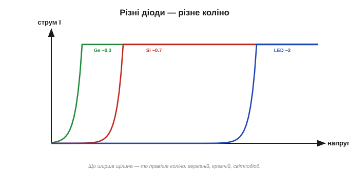
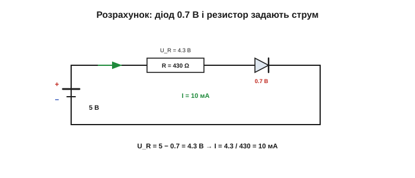

# ВАХ діода: пряме падіння й пробій

Діод як [однобічний клапан](book:electronics/diode-bias) — пряма напруга відкриває, зворотна замикає — можна описати й **якісно**, а можна **точно**. Усю поведінку діода вміщує одна-єдина крива — **вольт-амперна характеристика** (ВАХ, *I–V characteristic*): графік струму крізь діод залежно від напруги на ньому. Навчившись її читати, ви знатимете про діод усе потрібне на практиці.

### Що таке ВАХ

Намалюймо осі: по горизонталі — напруга **U** на діоді, по вертикалі — струм **I** крізь нього. У звичайного резистора така крива — пряма лінія через нуль ([закон Ома](book:electronics/ohms-law)): удвічі більша напруга — удвічі більший струм. А от у діода вона **геть не пряма** — і саме ця кривина й робить його корисним.

Як таку криву отримують? Беруть діод, подають різну напругу й щоразу міряють струм — точка за точкою. По суті, ВАХ — це «паспорт» компонента: глянувши на неї, видно і поріг відкривання, і наскільки круто росте струм, і де настає пробій. У резистора цей паспорт нудний (пряма лінія), а в діода — промовистий, з колінами й зламами.


*Вольт-амперна характеристика діода. Праворуч (пряма напруга) струм майже нульовий до «коліна» ≈0.7 В, а далі стрімко злітає. Ліворуч (зворотна) — лише крихітний витік, аж до напруги пробою, де струм раптово зростає. Зовсім не схоже на пряму лінію резистора.*

### Пряма гілка: коліно ≈0.7 В

Рухаймося вправо, нарощуючи пряму напругу. Спершу — майже нічого: до ~0.5 В струм мізерний ([бар'єр](book:physics/pn-junction) ще не здолано). Потім настає **коліно** (*knee*) — десь біля 0.6–0.7 В для кремнію — і струм починає рости **дуже круто**: ще трохи напруги, і він злітає вгору майже вертикально.

Наслідок цієї крутизни напрочуд зручний: щойно діод відкрито, він «тримає» на собі приблизно **0.7 В** майже незалежно від того, який струм крізь нього тече. Цю напругу звуть **прямим падінням** (*forward voltage*, U_F): на будь-якому відкритому кремнієвому діоді ви виміряєте близько 0.7 В.

Чому крива саме така? Її описує формула Шоклі — струм росте **експоненційно** з напругою:

```
I = Is · (e^(U / (n·UT)) − 1)
```

де Is — крихітний зворотний струм, UT ≈ 26 мВ (тепловий потенціал за кімнатної температури), n — коефіцієнт біля одиниці. Не варто це заучувати — важлива сама **форма**: експонента. Зручне правило: кожні додаткові ~60 мВ прямої напруги збільшують струм приблизно **вдесятеро**. Ось чому коліно таке різке: трохи додав напруги — струм стрибнув на порядок.

> 🧮 **Математична вставка:** [рівняння Шоклі — звідки експонента й чому «0.7 В» не константа](book:electronics/diode-iv-curve/math-shockley-equation.md). Виводимо ВАХ із больцманівського хвоста над бар'єром, з'ясовуємо, звідки тепловий потенціал 26 мВ і правило «60 мВ на декаду», і розплутуємо парадокс температури: чому падіння тане −2 мВ/°C, хоча головна стала формули з нагрівом якраз росте.

Звідси й головний практичний наслідок: на крутій ділянці напруга на діоді майже не залежить від струму. Збільшите струм удесятеро — напруга підросте лише на ті самі ~60 мВ. Тому й кажуть просто «0.7 В», хоча точне значення трохи плаває (≈0.6 В у маленьких сигнальних діодів, до ~1 В у потужних на великому струмі). Часом коліно малюють як гострий злам, та насправді воно **плавне** — просто дуже круте. Ця майже-сталість напруги, до речі, робить діод грубеньким джерелом опорної напруги. Для відчуття: від 1 мА до 100 мА пряме падіння типового діода зросте лише з ~0.6 до ~0.75 В — мізер проти стократної зміни струму. А оскільки кожен діод «з'їдає» своє падіння, **послідовні** діоди їх додають: два кремнієві дадуть ≈1.4 В, три ≈2.1 В — цим інколи й користуються, коли треба груба опорна напруга, кратна 0.7 В.


*Збільшений вигляд прямої гілки. До ≈0.7 В струм майже непомітний, біля коліна різко зростає. Тому відкритий кремнієвий діод «сидить» на ≈0.7 В у широкому діапазоні струмів — це і є пряме падіння U_F.*

### Різні матеріали — різне коліно

Висота коліна залежить від матеріалу — а саме від його [енергетичної щілини](book:physics/semiconductor), що задає [бар'єр переходу](book:physics/pn-junction). У германію коліно нижче (≈0.3 В), у кремнію — ≈0.7 В, а у [світлодіодів](book:electronics/led-photodiode) — узагалі високе (≈1.8–3.3 В, залежно від кольору).


*Пряма гілка для різних діодів. Германій відкривається вже з ≈0.3 В, кремній — з ≈0.7 В, світлодіод — аж із ≈2 В і вище. Що ширша енергетична щілина матеріалу, то правіше коліно.*

Чому світлодіод вимагає аж 2 В і більше? Бо кожному носієві, що долає його ширшу щілину, треба більше енергії — і ця енергія потім [вилітає квантом світла](book:electronics/led-photodiode) (звідси й колір: синій світлодіод має вищу щілину й вище коліно, ніж червоний). А германій із його низьким коліном начебто вигідніший — та через більший витік і гіршу теплостійкість ([тепловіших носіїв у вузькій щілині](book:physics/semiconductor)) у більшості схем переміг саме кремній зі своїми зручними 0.7 В.

### Зворотна гілка й пробій

Тепер уліво — зворотна напруга. Тут струму майже немає: лише крихітний витік неосновних носіїв через [замкнений перехід](book:electronics/diode-bias), що тримається майже сталим (мікро- чи наноампери). Крива йде ледь нижче нуля, майже впритул до осі.

Та якщо зворотну напругу нарощувати далі й далі, настає драматичний момент — **пробій** (*breakdown*): на певній напрузі струм раптово **підскакує**, ніби бар'єр нарешті «прорвало». Це відбувається двома способами. **Лавинний** пробій: сильне поле так розганяє нечисленні носії, що ті, врізаючись в атоми, вибивають нові, ті — ще нові, і струм наростає лавиною. (Назва дуже точна: один носій вибиває кількох, ті — ще більше, і за мить через перехід суне ціла «снігова куля» носіїв.) **Зенерівський**: у дуже тонких (сильнолегованих) переходах поле буквально «вириває» електрони із зв'язків. Обидва дають той самий результат — різке зростання зворотного струму.

Чим лавина небезпечна? Великий струм на високій напрузі — це велика потужність, що миттю перегріває крихітний перехід; якщо її нічим не обмежити, діод просто згоряє. Тому виробник указує гранично допустиму **зворотну напругу** (часто десятки чи сотні вольтів), і нижче неї діод тримає надійно. Це, до речі, найчастіша «таємнича» причина смерті діода в недбалій схемі — коротка зворотна перенапруга (скажімо, [викид котушки](root:embedded/flyback-protection)) пробиває його. Парадокс у тому, що той самий пробій, приборканий і обмежений струмом, стає **корисним**: на ньому працює [діод Зенера](root:embedded/zener-schottky).


*Зворотна гілка зблизька. До напруги пробою V_BR — лише мізерний витік. На V_BR струм раптово зростає (лавинний або зенерівський механізм). Для звичайного діода це небезпечно; для діода Зенера — робочий режим.*

Для **звичайного** діода пробій зазвичай **згубний**: різкий струм перегріває кристал, і діод гине — якщо тільки струм не обмежити. Тому в кожного діода є паспортна **максимальна зворотна напруга**, нижче якої треба лишатися. А от спеціальні діоди — **Зенера** — навмисно роблять так, щоб [працювати в пробої стабільно](root:embedded/zener-schottky).

### Діод у розрахунках: модель «0.7 В»

На практиці експоненту рідко рахують точно. Найзручніша модель: відкритий кремнієвий діод — це просто **падіння 0.7 В**, наче маленька батарейка назустріч, яку струм мусить «переступити». Решту напруги бере на себе інша частина кола.

**Приклад. Через кремнієвий діод треба пропустити 10 мА від джерела 5 В. Який потрібен послідовний резистор?**
```
U_R = U_жив − U_діода = 5 − 0.7 = 4.3 В
R   = U_R / I = 4.3 / 0.010 = 430 Ом
```
Діод «з'їдає» 0.7 В, решта 4.3 В лягає на резистор, і той задає струм. (Від джерела 12 В той самий струм 10 мА вимагав би вже R = (12 − 0.7)/0.01 ≈ 1.1 кОм.) Зверніть увагу: **струм мусить обмежувати щось зовнішнє** — сам діод його не лімітує (його гілка майже вертикальна), тож без резистора струм злетів би до згубного.

Тут криється важлива зміна способу мислення проти резистора. У резисторі струм і напруга жорстко зв'язані (I = U/R), і елемент сам «вирішує» свій струм. Діод інакший: він нав'язує **напругу** (≈0.7 В), а **струм** йому диктує решта кола. Тому питання «який струм при 0.7 В?» саме по собі безглузде — відповідь дає лише повна схема. Звикнути до цього — півсправи в розумінні нелінійних елементів узагалі.

Помітьте, що ми скористалися найгрубішою моделлю — «діод = 0.7 В». Узагалі ж діод описують трьома рівнями точності. **Ідеальний**: досконалий клапан, 0 В на відкритому — годиться для швидких міркувань про напрям струму. **Зі сталим падінням**: відкритий діод = 0.7 В — наша робоча модель для розрахунків. **Реальна експонента**: коли треба максимальна точність (скажімо, у слабкосигнальних колах). Мудрість тут проста: бери найгрубішу модель, якої вистачає для задачі, і не ускладнюй дарма — ВАХ нікуди не дінеться, але рахувати по ній щоразу не доведеться.

На практиці пряме падіння легко перевірити мультиметром у режимі «прозвонки діода»: торкніться щупами — у прямому ввімкненні прилад покаже ~0.5–0.7 В (для кремнію), у зворотному — «обрив». Це найшвидший спосіб і знайти діод у схемі, і визначити його полярність, і переконатися, що він живий.

І ще одне, про що легко забути: на відкритому діоді не лише **падає** 0.7 В — на ньому ще й [**розсіюється потужність**](book:physics/electric-power) P = U_F · I (як на будь-якому елементі). За 0.7 В і 1 А це вже 0.7 Вт тепла — чималий діод відчутно гріється. Тому потужні випрямні діоди роблять великими й нерідко садять на радіатор.


*Три рівні точності. Ідеальний діод — досконалий клапан (0 В на відкритому). Модель «0.7 В» — відкритий діод дає стале падіння. Реальна ВАХ — плавна експонента. Інженер бере найпростішу модель, якої вистачає для задачі.*


*Коло з прикладу: джерело 5 В, діод (падіння 0.7 В) і резистор 430 Ом. На діоді — 0.7 В, на резисторі — 4.3 В; резистор задає струм 10 мА. Без обмежувача струм був би небезпечним.*

> 🔧 **Навіщо це.** Два правила, що рятують діоди (і нерви). Перше: послідовно з діодом майже завжди ставлять щось, що **обмежує струм** (резистор, опір джерела чи навантаження) — інакше відкритий діод спалить себе. Друге: ніколи не перевищуйте паспортну **зворотну** напругу — інакше пробій. А модель «0.7 В» дозволяє швидко прикинути струми й напруги в голові, не чіпаючи експоненти.

### Трохи про температуру

Те «0.7 В» — не константа на віки: з нагріванням пряме падіння **зменшується** приблизно на 2 мВ на кожен градус, а зворотний витік — росте (більше [теплових носіїв у напівпровіднику](book:physics/semiconductor)). На звичайних схемах це дрібниця, але в точних вимірюваннях чи на потужних діодах це враховують. А ще цей дрейф настільки стабільний і передбачуваний (−2 мВ/°C), що його обертають на користь: вимірявши пряме падіння каліброваного переходу, визначають температуру — простий і дешевий термометр, який ховається в багатьох мікросхемах і процесорах.

> ⚙️ **Практична вставка:** [діод як термометр](book:electronics/diode-iv-curve/proj-diode-thermometer.md). Як виміряти температуру падінням: навіщо сталий струм, як калібрувати двома точками (лід і окріп), що псує точність — і трюк ΔV_BE, яким міряють абсолютну температуру **без** калібрування (Is скорочується при відніманні), той самий, що сидить у термодавачі кожного процесора.

Зведімо ВАХ до трьох ділянок, які варто впізнавати з першого погляду:

```
зворотна (U < 0):           ≈0 струму         → діод ЗАМКНЕНО
пряма до коліна (0…0.7 В):  ще майже 0         → ще НЕ відкрився
пряма за коліном (>0.7 В):  струм злітає       → діод ВІДКРИТО, на ньому ≈0.7 В
(дуже велика зворотна):     пробій             → струм лавиною (небезпечно)
```

Уся практична робота з діодом — це, по суті, визначити, у якій із цих ділянок він зараз перебуває.

Зведена картина проста: діод — це однобічний клапан із падінням ≈0.7 В уперед, майже розрив назад і пробоєм на великій зворотній напрузі. Найголовніше застосування цієї поведінки, заради якого діоди й виробляють мільярдами, — [перетворення змінного струму на постійний](book:electronics/rectification): саме випрямлячі в кожному блоці живлення поглинають більшість діодів, що їх випускає світ.

---
