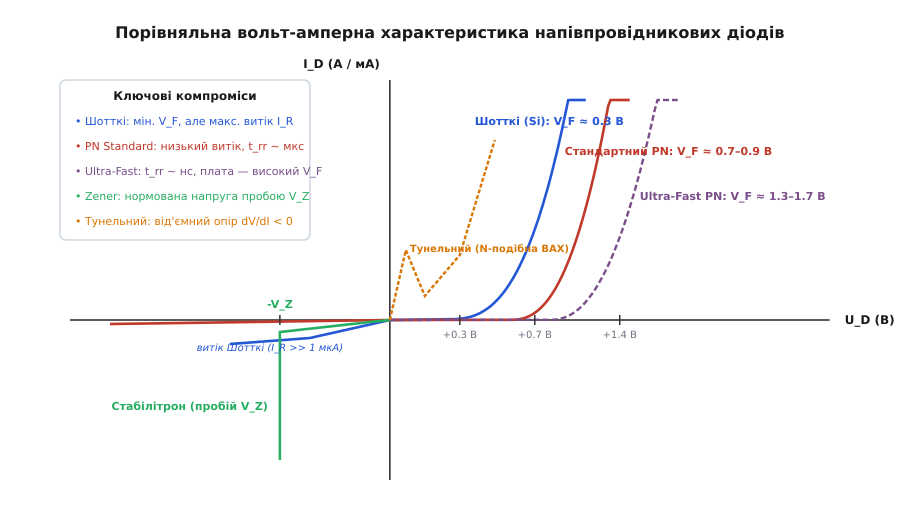
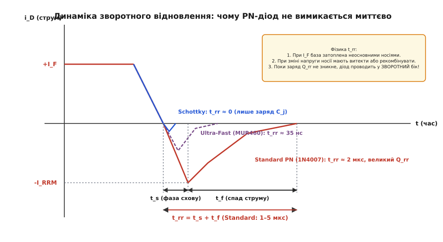
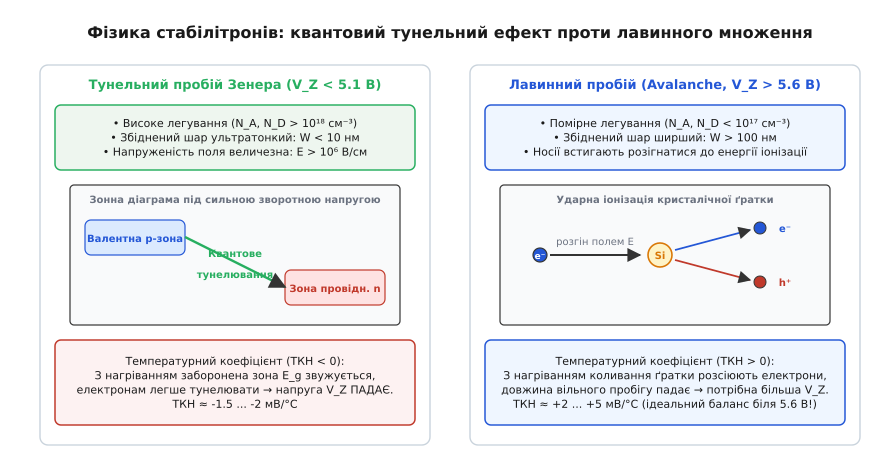
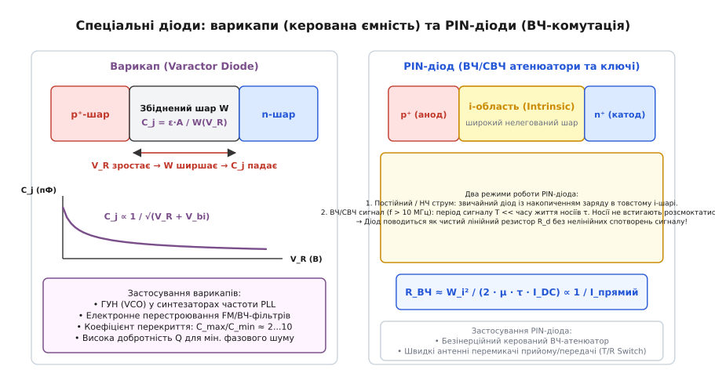

# Типи діодів і їхні відмінності

<preknowlist>
- [PN-перехід у напівпровідниках](topic:physics/pn-junction)
- [Зміщення та вольт-амперна характеристика діода](topic:electronics/diode-iv-curve)
- [Лавинний пробій і тунелювання](topic:physics/avalanche-breakdown)
- [Дифузія та час життя неосновних носіїв](topic:physics/minority-carrier-diffusion)
- [Рухливість носіїв заряду](topic:physics/carrier-mobility)
</preknowlist>

Якщо замінити несправний діод у імпульсному перетворювачі напруги частотою 100 кГц на звичайний випрямний діод 1N4007 (розрахований на струм 1 А та напругу 1000 В), перетворювач вийде з ладу за кілька секунд із гучним перегрівом і пробоєм. Причина катастрофи криється не в перевищенні струму чи напруги, а в часі зворотного відновлення: кремнієвий випрямляч 1N4007 вимикається протягом 2–5 мікросекунд, і під час кожного такту комутації він залишається відкритим у зворотному напрямку, влаштовуючи пряме коротке замикання силового ключа на землю.

Інша поширена аварія трапляється при спробі використати діод Шотткі з рекордно низьким прямим падінням напруги в колі з високою робочою температурою або напругою понад 100 В. При нагріванні кристала до 100 °C зворотний струм витоку діода Шотткі зростає у сотні разів — від мікроамперів до десятків міліамперів. Зворотна потужність розсіювання починає перевищувати спроможність тепловідводу, кристал нагрівається ще сильніше, струм витоку зростає лавиноподібно, і прилад руйнується внаслідок теплового розгону.

Ці приклади виявляють фундаментальну істину напівпровідникової схемотехніки: ідеального однобічного клапана в природі не існує. Будь-який діод є компромісною інженерною конструкцією, оптимізованою під конкретні фізичні пріоритети. Зменшення прямого падіння напруги неминуче збільшує зворотний витік; підвищення граничної зворотної напруги вимагає товстішої слаболегованої бази, що збільшує прямий опір; а прискорення вимикання діода змушує штучно руйнувати провідність кристала центрами рекомбінації.


*Зіставлення прямих та зворотних гілок вольт-амперних характеристик основних сімейств діодів: випрямних p-n, швидкодіючих Ultra-Fast, бар'єрних Шотткі, стабілітронів та тунельних приладів.*

---

### Анатомія випрямного діода p-n переходу (Standard Recovery)

Класичний напівпровідниковий випрямний діод (англ. *Standard Recovery Rectifier*, типові представники — лінійка 1N4001–1N4007 та 1N5400) будується на основі асиметричного дифузійного або епітаксійного `p-n` переходу. Його головне функціональне призначення — пропускання великих прямих струмів (від одиниць до сотень ампер) за низької собівартості виробництва та блокування високих зворотних напруг (від 50 до 1500 В).

Щоб кремнієвий кристал міг витримувати зворотну напругу в сотні вольт без лавинного пробою, одну з областей переходу роблять широкою та слаболегованою. У типовому кремнієвому діоді це слабколегований шар n-типу (так звана база або дрейфова область `n⁻`), поверх якого створюється сильнолегований шар p-типу (`p⁺`). Під час прикладання зворотної напруги збіднена область без рухливих носіїв розширюється переважно вглиб цього слабколегованого шару. Що ширша база і що нижча в ній концентрація донорної домішки, то більшу різницю потенціалів здатне витримати електричне поле без пробою.

Однак слаболегована напівпровідникова область має значний питомий опір. Якби струм переносився лише рівноважними носіями, пряме падіння напруги на такій базі сягало б десятків вольт. Випрямний діод рятує явище модуляції провідності: при прямому зміщенні сильнолегований `p⁺`-емітер інжектує у слабколеговану `n⁻`-базу гігантську концентрацію неосновних носіїв (дірок), а з протилежного боку через `n⁺`-підкладку входить така сама кількість електронів для збереження електронейтральності. База буквально затоплюється електронно-дірковою плазмою, концентрація носіїв у ній зростає на 4–5 порядків, а її омічний опір падає практично до нуля.

```
U_F = V_bi + I_F · R_диф

V_bi ≈ 0.65...0.75 В  [контактна різниця потенціалів для кремнію]
R_диф = dU/dI         [динамічний опір модульованої бази та контактів]
```

Пряме падіння напруги `V_F` на відкритому випрямному діоді складається з контактного потенціалу переходу (близько 0.65–0.75 В при кімнатній температурі) та невеликого залишкового омічного падіння на модульованій базі й металевих контактах. За номінального прямого струму сумарне `V_F` кремнієвого випрямляча становить 0.8–1.1 В.

Зворотний струм витоку `I_R` такого переходу формується тепловою генерацією пар електрон-дірка в збідненому шарі. Оскільки ширина забороненої зони кремнію становить 1.12 еВ, за кімнатної температури кількість термогенерованих носіїв мізерна: витік становить менше 0.1–1 мкА при напругах аж до граничної `V_RRM`. З підвищенням температури концентрація власних носіїв зростає експоненційно: кожні 10 °C нагріву збільшують зворотний витік приблизно вдвічі, проте навіть за 125 °C він зазвичай не перевищує 50–100 мкА.

Головна слабкість випрямного діода проявляється під час перемикання з прямого напрямку на зворотний. Оскільки база була затоплена плазмою неосновних носіїв, діод не може замкнутися миттєво. Перш ніж на переході відновиться шар просторового заряду і виникне потенціальний бар'єр, весь надлишковий заряд неосновних носіїв `Q_rr` мусить або рекомбінувати всередині кристала, або витекти в зовнішнє коло під дією зворотної напруги.

Час, необхідний для цього процесу, називається часом зворотного відновлення `t_rr` (англ. *reverse recovery time*). Для стандартних випрямних діодів він становить від 1 до 5 мікросекунд. Через це сфера використання стандартних випрямлячів обмежена низькими частотами: мережеві випрямлячі частотою 50/60/400 Гц, схеми захисту від переполюсовки живлення постійного струму та низькочастотні блокувальні кола.

---

### Діоди Шотткі (Schottky Barrier): контакт метал-напівпровідник

Діод Шотткі (названий на честь німецького фізика Вальтера Шотткі, нім. *Walter Schottky*) докорінно відрізняється за фізичною природою від p-n діода: замість контакту двох напівпровідників у ньому використовується контакт металу з напівпровідником n-типу.

Коли метал із високою роботою виходу контактує з напівпровідником n-типу з меншою роботою виходу, електрони з напівпровідника переходять у метал, доки рівні Фермі обох матеріалів не вирівняються. У приповерхневому шарі напівпровідника утворюється збіднена область із нескомпенсованими позитивними іонами донорів, яка створює потенціальний бар'єр — бар'єр Шотткі.


*Процес перемикання діода з прямого струму на зворотну напругу. У діоді p-n надлишковий заряд неосновних носіїв спричиняє потужний зворотний імпульс струму -I_RRM тривалістю t_rr. У діоді Шотткі зворотний імпульс зумовлений лише ємністю переходу.*

Струм через бар'єр Шотткі переноситься виключно основними носіями — електронами, які долають бар'єр завдяки термоелектронній емісії. Висота бар'єра Шотткі `\Phi_B` залежить від пари метал-напівпровідник (зазвичай використовують молібден, платину, хром або вольфрам на кремнії) і становить 0.5–0.7 еВ, що значно менше за висоту бар'єра кремнієвого `p-n` переходу (близько 1.1 еВ).

```
I = A^* · T² · exp(-q·Φ_B / (k·T)) · [exp(q·V / (n·k·T)) - 1]

A^*  [ефективна стала Річардсона]
Φ_B  [висота потенціального бар'єра метал-напівпровідник]
n    [коефіцієнт ідеальності ВАХ, для Шотткі n ≈ 1.02...1.05]
```

Через малу висоту бар'єра термоемісійний струм починає стрімко наростати вже за прямої напруги `V_F ≈ 0.20–0.45 В`. При струмах у кілька ампер падіння на діоді Шотткі (наприклад, 1N5819, SS34) залишається на рівні 0.35–0.55 В, тоді як на звичайному кремнієвому діоді воно сягало б 0.9–1.1 В. У низьковольтних колах живлення (3.3 В, 5 В, 12 В) це зменшує статичні втрати потужності `P = I_F · V_F` у два-три рази.

Найвизначніша перевага діода Шотткі — його надзвичайна швидкодія. Оскільки струм переносять лише основні носії, у базі немає інжекції та накопичення неосновних носіїв. Відповідно, дифузійний заряд накопичення дорівнює нулю:

```
Q_диф = 0  ⇒  t_rr ≈ 0
```

Процес вимикання діода Шотткі не містить фази розсмоктування плазми й визначається виключно швидкістю перезаряджання бар'єрної ємності метало-напівпровідникового переходу `C_j`. Час комутації вимірюється десятками пікосекунд, що дозволяє діодам Шотткі працювати на частотах у сотні мегагерц і гігагерци без динамічних втрат на зворотне відновлення.

За ці переваги доводиться розраховуватися трьома критичними недоліками:

1. **Обмежена зворотна напруга кремнієвих приладів.** Через сильний вплив сил дзеркального зображення (ефект Шотткі) бар'єр знижується під дією зворотної напруги, що спричиняє ранній пробій. Більшість кремнієвих діодів Шотткі розраховані на напругу до 40–60 В, рідше — до 100–150 В. Спроби створити кремнієвий Шотткі на 200 В призводять до такого потовщення слаболегованої бази, що його пряме падіння зрівнюється зі звичайним p-n діодом.
2. **Високий зворотний струм витоку.** Оскільки висота бар'єра низька, теплова емісія електронів із металу в напівпровідник під зворотною напругою є значною. Зворотний струм витоку `I_R` кремнієвого діода Шотткі становить від десятків мікроамперів до одиниць міліамперів навіть за 25 °C.
3. **Експоненційне зростання витоку та ризик теплового розгону.** За нагрівання до 125 °C зворотний струм витоку сягає 10–50 мА. Якщо діод тривалий час перебуває під зворотною напругою 40 В, розсіювана зворотна потужність становитиме `P_rev = 40 В · 0.05 А = 2 Вт`. Це тепло додатково розігріває кристал, витік зростає ще сильніше, що призводить до лавиноподібного саморозігріву та вигорання приладу.

Справжню революцію у високовольтній електроніці здійснили карбід-кремнієві діоди Шотткі (англ. *Silicon Carbide Schottky Barrier Diodes*, SiC SBD). Карбід кремнію (політип 4H-SiC) має ширину забороненої зони 3.26 еВ і критичну напруженість поля пробою близько 3 МВ/см (у 10 разів більше, ніж у кремнію).

Це дозволило створити діоди Шотткі на робочі напруги 650 В, 1200 В і навіть 1700 В із прямим падінням 1.3–1.5 В і абсолютно нульовим зарядом зворотного відновлення `Q_rr`. Сьогодні SiC-діоди є безальтернативним стандартом для коректорів коефіцієнта потужності (PFC), сонячних інверторів та інверторів тягового приводу електромобілів.

---

### Швидкодіючі діоди (Fast, Ultra-Fast та Hyper-Fast Recovery)

Коли в імпульсній схемі потрібна висока зворотна напруга (400–1200 В), а кремнієві діоди Шотткі фізично не здатні її забезпечити через пробій, інженери застосовують швидкодіючі кремнієві `p-n` діоди з модифікованим часом життя носіїв.

У силових перетворювачах (наприклад, у зворотноходових Flyback, косомостових Forward перетворювачах або схемах демпфування індуктивних викидів) робоча частота сягає 50–200 кГц. Стандартний випрямляч із `t_rr = 2 мкс` на такій частоті взагалі не встигатиме закритися: період коливань становить 10 мкс, і діод 20–40% часу проводитиме у зворотному напрямку, спричиняючи гігантські динамічні втрати перемикання:

```
P_sw = f_sw · V_rev · I_RRM · t_rr / 2

f_sw   [частота перемикання]
V_rev  [зворотна напруга кола]
I_RRM  [піковий зворотний струм відновлення]
```

Щоб зменшити `t_rr`, необхідно скоротити час життя неосновних носіїв `\tau` в слаболегованій базі діода. Для цього застосовують технологію керування часом життя (англ. *lifetime engineering*):
- Легування кристала кремнію домішками важких металів (золотом `Au` або платиною `Pt`), які створюють глибокі енергетичні рівні посередині забороненої зони;
- Опромінення кристала швидкими електронами, протонами чи іонами гелію, що утворює стабільні радіаційні дефекти кристалічної ґратки.

Ці домішки та дефекти працюють як високоефективні центри рекомбінації Шокли-Ріда-Холла (SRH). Коли діод перемикається у зворотний напрямок, інжектовані в базу дірки рекомбінують на цих пастках за десятки наносекунд замість мікросекунд.

За швидкістю відновлення імпульсні діоди поділяють на класи:
- **Fast Recovery (FRD):** `t_rr ≈ 150–500 нс` (наприклад, FR107, FR307). Застосовуються на частотах до 20–40 кГц;
- **Ultra-Fast Recovery (UFRD):** `t_rr ≈ 25–75 нс` (наприклад, MUR160, MUR460, UF4007, SF18). Ефективні на частотах до 100–150 кГц;
- **Hyper-Fast / Stealth / Ultrafast Tandem:** `t_rr < 15–30 нс` зі спеціально оптимізованим профілем спаду струму.

Ціною за радикальне зменшення `t_rr` стає погіршення прямої провідності: через високу швидкість рекомбінації неосновні носії не встигають проникнути глибоко в базу, ефект модуляції провідності слабшає, і опір відкритої бази зростає. Пряме падіння напруги `V_F` в Ultra-Fast діодів підвищується до 1.3–1.8 В (порівняно з 0.8 В у стандартних випрямлячів).

Крім того, критичним параметром швидких діодів є фактор м'якості відновлення (англ. *softness factor* `S = t_f / t_s`). Якщо фаза спаду зворотного струму `t_f` є надто різкою («жорстке відновлення», англ. *hard recovery*, `S < 0.5`), паразитна індуктивність монтажу генерує колосальний сплеск перенапруги `V_peak = L_par · (di/dt)` та високочастотний електромагнітний шум (EMI). Сучасні Hyper-Fast діоди конструюють так, щоб забезпечити «м'яке відновлення» (`S > 1`), за якого зворотний струм спадає плавно, без дзвінких осциляцій.

---

### Стабілітрони (Zener та Avalanche діоди)

Стабілітрон (за кордоном загальновживана назва — діод Зенера, англ. *Zener diode*, на честь американського фізика Кларенса Зенера, англ. *Clarence Zener*) спроєктований для тривалої стійкої роботи в режимі зворотного електричного пробою.

На відміну від звичайного випрямляча, для якого пробій є аварійним режимом і веде до шнурування струму та локального проплавлення кремнію, кристал стабілітрона має рівномірну концентрацію домішок по всій площі та оптимізований тепловідвід. Це гарантує оборотність пробою: прилад утримує практично незмінну напругу на своїх виводах у широкому діапазоні зворотного струму від `I_{Zmin}` до `I_{Zmax}`.


*Два фізичні механізми пробою стабілітронів. За напруг нижче 5.1 В переважає тунельний пробій із від'ємним ТКН, за напруг вище 5.6 В — лавинний пробій із додатним ТКН. В області 5.1–5.6 В обидва ефекти взаємно компенсуються.*

У стабілітронах реалізуються два принципово різні квантово-фізичні механізми пробою, межа між якими лежить в області 5.1–5.6 В:

1. **Тунельний пробій Зенера (переважає при `V_Z < 5.1 В`):**
   Кристал кремнію легують до надзвичайно високих концентрацій домішок (понад `10^{18}` см⁻³ з обох боків переходу). Внаслідок цього збіднена область виходить ультратонкою — менше 10 нанометрів. Навіть за невеликої зворотної напруги 3–4 В напруженість електричного поля в такому бар'єрі перевищує `10^6` В/см.
   За такої напруженості валентна зона p-області енергетично перекривається із зоною провідності n-області. Електрони дістають можливість квантовомеханічно тунелювати крізь тонкий бар'єр без зміни енергії.
   Оскільки з нагріванням кристала амплітуда коливань ґратки зростає, заборонена зона кремнію звужується (`dE_g/dT < 0`), полегшуючи тунелювання. Як наслідок, тунельний пробій має **від'ємний температурний коефіцієнт напруги (ТКН < 0)**: за нагрівання напруга стабілізації знижується зі швидкістю приблизно -1.5 ... -3 мВ/°C.

2. **Лавинний пробій (Avalanche breakdown, переважає при `V_Z > 5.6 В`):**
   У приладах на вищі напруги напівпровідник легують помірно (концентрація домішок `< 10^{17}` см⁻³), тому збіднений шар значно ширший (десяті долі мікрона). За такої товщини ймовірність тунелювання дорівнює нулю.
   Окремі неосновні носії, заходячи у збіднену зону, прискорюються сильним електричним полем і набувають високої кінетичної енергії. На довжині вільного пробігу електрон розганяється настільки, що під час зіткнення з атомом кристалічної ґратки вибиває з ковалентного зв'язку новий електрон, породжуючи пару електрон-дірка (ударна іонізація). Новонароджені носії також розганяються полем і іонізують наступні атоми — виникає лавиноподібне саморозмноження носіїв.
   З підвищенням температури коливання кристалічної ґратки (фонони) стають інтенсивнішими, електрони частіше зазнають зіткнень, довжина їхнього вільного пробігу скорочується, і їм стає важче набрати енергію іонізації. Щоб викликати лавину, доводиться прикладати більшу напругу. Тому лавинний пробій має **додатний температурний коефіцієнт напруги (ТКН > 0)**: за нагрівання напруга зростає зі швидкістю приблизно +2 ... +8 мВ/°C.

3. **Область нульового ТКН (5.1–5.6 В):**
   У стабілітронах із номінальною напругою 5.1–5.6 В (наприклад, класичний BZX84-C5V6 або 1N4734A) тунельний та лавинний механізми діють одночасно. Їхні температурні коефіцієнти протилежних знаків практично повністю компенсують один одного. Завдяки цьому стабілітрони на 5.6 В мають виняткову температурну стабільність і широко застосовуються як термокомпенсовані джерела опорної напруги.

Ключовим параметром якості стабілітрона є його динамічний (диференційний) опір:

```
r_z = dV_Z / dI_Z

r_z ≈ 5...30 Ом  [для лавинних стабілітронів при струмі 5 мА]
```

Що менший `r_z`, то менше змінюється напруга на стабілітроні при коливаннях живильного струму. Крім того, інженер повинен задавати робочий струм через стабілітрон вищим за мінімальний струм коліна `I_{Zmin}` (зазвичай 0.5–5 мА), оскільки при менших струмах прилад виходить з режиму пробою у високоомний стан.

---

### TVS-діоди (Transient Voltage Suppressor / Transil)

TVS-діод (англ. *Transient Voltage Suppressor*, захисний діод, супресор, відомий також під торговельною маркою Transil) — це спеціалізований кремнієвий напівпровідниковий прилад, оптимізований для захисту електронних схем від швидкоплинних перенапруг великої потужності: електростатичних розрядів (ESD за стандартом IEC 61000-4-2), індуктивних викидів та наведених грозових імпульсів (Surge 8/20 мкс та 10/1000 мкс за IEC 61000-4-5).

Хоча за вольт-амперною характеристикою TVS-діод нагадує стабілітрон (він також використовує лавинний пробій), їхня внутрішня конструкція та мета принципово відмінні:
- Стабілітрон розрахований на **тривале** розсіювання невеликої статичної потужності (0.25–1.0 Вт) з точним утриманням стабільної напруги;
- TVS-діод оптимізований для поглинання **гігантської імпульсної потужності** (від 400 Вт до 15–30 кВт) протягом мікросекундних проміжків часу.

Щоб витримати імпульсний струм у десятки й сотні ампер без теплового руйнування, p-n перехід TVS-діода має велику площу кристала та низький перехідний тепловий опір. На відміну від звичайних діодів, у ньому повністю усунуто мікродефекти ґратки, щоб уникнути локального шнурування струму під час раптового лавинного пробою.

TVS-діоди бувають двох типів:
- **Однонаправлені (Unidirectional):** у прямому напрямку працюють як звичайний діод (`V_F ≈ 0.7–1.0 В`), у зворотному — обмежують напругу на рівні пробою. Використовуються в колах однополярного живлення постійного струму;
- **Двонаправлені (Bidirectional):** містять два зустрічно ввімкнених лавинних переходи в одному корпусі. Захищають лінії змінної полярності (шини даних CAN, RS-485, аудіолінії), пропускаючи сигнал без спотворень у діапазоні від `-V_{RWM}` до `+V_{RWM}`.

```
       V_RWM             V_BR               V_clamp
─────────┼─────────────────┼───────────────────┼───────────► Напруга
  Робоча напруга     Початок пробою      Максимальна напруга
  (витік < 1 мкА)    (струм I_T = 1 мА)  при піковому струмі I_PP
```

Правильний вибір TVS-діода під задачу вимагає узгодження чотирьох ключових параметрів:
1. `V_{RWM}` (Working Peak Reverse Voltage / Stand-off) — максимальна тривала робоча напруга кола. TVS-діод вибирають так, щоб `V_{RWM}` було трохи вищим за максимальну напругу живлення (наприклад, для лінії 12 В з допуском +10% беруть TVS на 14–15 В). У цьому режимі витік становить одиниці мікроамперів;
2. `V_{BR}` (Breakdown Voltage) — напруга, за якої починається лавинний пробій (вимірюється за струму `I_T = 1 мА`). Зазвичай на 10–15% перевищує `V_{RWM}`;
3. `V_{clamp}` (Clamping Voltage) — максимальна напруга фіксації, яка реально залишиться на виводах діода при проходженні максимального паспортного імпульсного струму `I_{PP}` (наприклад, для імпульсу 8/20 мкс). **Головне правило захисту:** напруга `V_{clamp}` не повинна перевищувати гранично допустиму напругу пробою захищуваної мікросхеми;
4. `P_{ppm}` (Peak Pulse Power) — пікова потужність імпульсу (`P_{ppm} = V_{clamp} · I_{PP}`). Стандартні серії в SMD-корпусах мають градації потужності: SMAJ (400 Вт), SMBJ (600 Вт), SMCJ (1500 Вт), SMDJ (3000 Вт) для форми хвилі 10/1000 мкс.

Окремим викликом для TVS-діодів є захист високошвидкісних інтерфейсів (USB 2.0/3.0, HDMI, Gigabit Ethernet). Звичайний силовий TVS-діод через велику площу кристала має власну ємність `C_j` від 500 до 5000 пФ. Підключення такої ємності до високочастотної диференційної лінії повністю завалює фронти сигналів гігагерцового діапазону.

Для захисту швидкісних ліній створюють спеціалізовані збірки наднизької ємності (англ. *Ultra-low capacitance TVS*, наприклад, серії USBLC6-2, ESD9L, TPD4E001). У них основний лавинний діод ізольований від сигнальної лінії містком із швидкодіючих малоємнісних діодів напрямку, що знижує результуючу ємність виводу до 0.2–0.5 пФ.

---

### Спеціалізовані діоди: варикапи, PIN-діоди, тунельні діоди

Крім випрямлення та обмеження напруги, унікальні фізичні властивості напівпровідникових структур дозволяють виконувати високочастотні та квантові функції.


*Принцип роботи варикапа (зміна ширини збідненого шару під зворотною напругою змінює ємність) та PIN-діода (товстий нелегований i-шар забезпечує лінійний ВЧ-опір, керований постійним струмом).*

#### Варикапи (Varactor Diodes)

Варикап (від англ. *variable capacity* — змінна ємність) — це напівпровідниковий діод, робочим режимом якого є зворотне зміщення, а головною характеристикою — керована бар'єрна ємність `p-n` переходу.

Збіднена область зворотно зміщеного переходу позбавлена вільних носіїв і виконує роль діелектрика з проникністю `\varepsilon`, а прилеглі леговані p- та n-області працюють як провідні обкладки плоского конденсатора. При збільшенні зворотної напруги `V_R` електричне поле розширює збіднений шар `W`, розсуваючи обкладки, і бар'єрна ємність падає:

```
C_j(V_R) = C_0 / (1 + V_R / V_bi)^γ

C_0   [ємність переходу при нульовій напрузі]
V_bi  [вбудований потенціал переходу, для Si ≈ 0.7 В]
γ     [коефіцієнт профілю легування: 0.5 для різкого переходу, 1.0...2.0 для гіперрізкого]
```

Для виготовлення варикапів використовують спеціальне нерівномірне (гіперрізке) легування, завдяки чому ємність змінюється в 4–10 разів при зміні напруги керування від 1 до 25 В (наприклад, варикапи серій BB135, BB910, 1SV280).

Головні параметри варикапа:
- **Коефіцієнт перекриття за ємністю:** `K_C = C_{max} / C_{min}`;
- **Добротність `Q` на високій частоті:** визначається омічним опором нейтральних шарів напівпровідника та контактів `R_s`. Що вища `Q`, то менші фазові шуми в контурі;
- **Застосування:** генератори, керовані напругою (ГУН / VCO) у синтезаторах частоти PLL, схеми автоматичного підстроювання частоти (АПЧ), перестроювані радіочастотні фільтри та фазообертачі.

#### PIN-діоди (RF / Microwave Switching & Attenuation)

PIN-діод отримав назву від своєї тришарової структури: між сильнолегованими областями p-типу (`p⁺`) та n-типу (`n⁺`) розташований широкий шар власного нелегованого (або дуже слабо легованого) напівпровідника — `i`-область (англ. *intrinsic*).

Фізика PIN-діода кардинально залежить від частоти прикладеного сигналу:
1. **На постійному струмі та низьких частотах (f < 100 кГц):** PIN-діод працює як звичайний випрямляч. При прямому зміщенні дірки з `p⁺` та електрони з `n⁺` інжектуються в `i`-шар, заповнюючи його носіями. Оскільки `i`-шар товстий (10–100 мкм), час життя носіїв у ньому `\tau` становить від сотень наносекунд до кількох мікросекунд;
2. **На високих та надвисоких частотах (f > 10 МГц, коли `f >> 1 / (2\pi \tau)`):** період високочастотного сигналу стає набагато меншим за час життя носіїв `\tau`. За півперіоду ВЧ-коливання носії просто не встигають вийти з `i`-шару чи рекомбінувати. Кількість заряду в базі визначається виключно **постійним струмом зміщення `I_{DC}`**.

В результаті для ВЧ-сигналу PIN-діод поводиться не як нелінійний вентиль, а як **ідеально лінійний безинерційний резистор**, опір якого плавно регулюється постійним керувальним струмом:

```
R_RF ≈ W_i² / (2 · (μ_n + μ_p) · τ · I_DC)  ∝  1 / I_DC

W_i          [ширина нелегованої i-області]
μ_n, μ_p     [рухливості електронів та дірок]
τ            [час життя носіїв в i-шарі]
I_DC         [постійний струм прямого зміщення]
```

При нульовому або зворотному зміщенні `i`-шар збіднений, діод має гігантський опір (десятки кілоом) і мізерну ємність (0.1–0.5 пФ завдяки великій товщині `W_i`). При прямому струмі 10–50 мА опір падає до 0.5–1 Ом. Завдяки цій властивості PIN-діоди (наприклад, BAR64, SMP1345) є головним компонентом швидкодіючих антенних перемикачів прийом/передача (T/R Switch) у радарних системах, смартфонах (LTE/5G) та регульованих ВЧ-атенюаторах без спотворення форми радіосигналу.

#### Тунельні діоди (діоди Есакі)

Тунельний діод (створений Лео Есакі 1957 року, за що він отримав Нобелівську премію з фізики) являє собою `p-n` перехід із гранично високим ступенем легування обох напівпровідникових областей (концентрація домішок сягає `10^{19}–10^{20}` см⁻³, напівпровідник є виродженим).

У виродженому напівпровіднику рівень Фермі заходить всередину дозволених зон: всередину валентної зони в p-області та всередину зони провідності в n-області. Ширина збідненого шару становить менше 5 нм.

При невеликій прямій напрузі (50–150 мВ) електрони з зони провідності n-області тунелюють крізь ультратонкий бар'єр на вільні енергетичні рівні валентної зони p-області. Струм швидко зростає до пікового значення `I_P`.

При подальшому збільшенні прямої напруги (200–400 мВ) зони зміщуються одна відносно іншої так, що навпроти заповнених рівнів електронів n-області опиняється заборонена зона p-області, де дозволених станів немає. Тунелювання припиняється, а звичайний дифузійний струм ще не встиг відкритися. Як наслідок, струм падає від пікового `I_P` до струму западини `I_V`.

На вольт-амперній характеристиці утворюється ділянка з **від'ємним диференційним опором**:

```
R_диф = dU / dI < 0
```

Оскільки тунельний ефект є практично безінерційним квантовим процесом, тунельні діоди здатні працювати на частотах до десятків і сотень гігагерц, виконуючи роль надшвидкісних генераторів, надвисокочастотних підсилювачів та тригерів із пікосекундним часом перемикання.

---

### Порівняльна матриця та критерії інженерного вибору

Щоб обрати оптимальний тип діода, розробник повинен зіставити вимоги схеми за напругою, струмом, частотою комутації та допустимими втратами.

| Тип діода | Структура | Пряме падіння `V_F` | Зворотна напруга `V_RRM` | Швидкодія `t_rr` | Зворотний витік `I_R` | Головна перевага | Головний недолік / обмеження |
| :--- | :--- | :--- | :--- | :--- | :--- | :--- | :--- |
| **Standard Rectifier** | p-n кремній | 0.7–1.1 В | 50–1600 В | 1–5 мкс | Дуже малий (< 1 мкА) | Дешевизна, високий струм і напруга | Непридатний для ВЧ (великі втрати `Q_rr`) |
| **Schottky (Si)** | Метал-Si | 0.20–0.45 В | 20–150 В | `t_rr ≈ 0` (тільки `C_j`) | Високий (10 мкА – 5 мА) | Мінімальне `V_F`, нульовий `Q_rr` | Низька напруга, ризик теплового розгону |
| **Schottky (SiC)** | Метал-SiC | 1.3–1.6 В | 650–1700 В | `t_rr ≈ 0` | Помірний (< 50 мкА) | Висока напруга + нульовий `Q_rr` | Вища ціна, помітний початковий `V_F` |
| **Ultra-Fast (UFRD)** | p-n кремній (SRH) | 1.2–1.8 В | 200–1200 В | 25–75 нс | Малий (< 5 мкА) | Висока напруга + швидке вимикання | Підвищене падіння `V_F`, статичні втрати |
| **Zener / Avalanche** | p-n з пробоєм | — (0.7 В пряма) | 2.4–200 В (`V_Z`) | Середня | — | Стабільна напруга, низький `r_z` | Потребує баластного резистора струму |
| **TVS (Transil)** | p-n велика площа | — | 5–440 В (`V_RWM`) | < 1 пс (лавина) | Дуже малий (< 1 мкА) | Гігантська пікова потужність (кВт) | Велика ємність (якщо не low-capacitance) |
| **Варикап** | p-n гіперрізкий | — | 15–35 В | — | Дуже малий | Керована ємність `C(V)` | Вузький діапазон ємностей (пФ) |
| **PIN-діод** | p - i - n | 0.8–1.2 В | 50–1000 В | — (ВЧ резистор) | Дуже малий | Лінійний ВЧ-опір без спотворень | Потребує постійного струму керування |
| **Тунельний** | p⁺⁺ - n⁺⁺ виродж. | 0.05–0.5 В | — | < 50 пс | — | Від'ємний опір `dV/dI < 0` | Складна стабілізація робочої точки |

#### Алгоритм вибору діода під задачу

1. **Низькочастотне випрямлення (50/60 Гц, мережеві блоки живлення):**
   - Робоча напруга 230 В / 400 В -> стандартний випрямний міст або діоди серії 1N4007, 1N5408. Швидкість не має значення, на першому місці — здатність витримувати пускові струми заряду конденсаторів.

2. **Вторинне випрямлення в низьковольтних імпульсних джерелах (DC-DC до 24–48 В):**
   - Робоча напруга на діоді `< 60–100 В` -> кремнієвий діод Шотткі (наприклад, SS34, MBR20100). Забезпечує максимальний ККД завдяки мінімальному `V_F`. Слід обов'язково перевірити запас по теплу за максимальної температури, щоб запобігти тепловому розгону через струм витоку.

3. **Високовольтні імпульсні перетворювачі (частота > 50 кГц, напруга > 200 В):**
   - Напруги 200–600 В за обмеженого бюджету -> діоди Ultra-Fast / Hyper-Fast (наприклад, MUR460, STTH8R06).
   - Напруги 600–1200 В за вимог максимальної енергоефективності -> карбід-кремнієві SiC діоди Шотткі (наприклад, C3D10060A). Усувають динамічні втрати перемикання силових транзисторів.

4. **Формування опорної напруги та зміщення рівнів:**
   - Потрібна стабільна опорна напруга -> стабілітрон на 5.1 або 5.6 В (серія BZX84) для мінімального температурного дрейфу або регульований паралельний стабілізатор TL431.

5. **Захист кіл від імпульсних перенапруг:**
   - Силові шини живлення постійного струму -> однонаправлений TVS-діод (SMAJ, SMBJ) з напругою `V_{RWM}` на 10–15% вищою за номінальну напругу живлення.
   - Двосторонні шини даних (RS-485, CAN) -> двонаправлений TVS-діод відповідної напруги.
   - Швидкісні інтерфейси (USB 3.0, Ethernet, HDMI) -> спеціалізовані низькоємнісні збірки TVS із паразитною ємністю `C_j < 0.5 пФ`.

6. **Керування частотою та ВЧ комутація:**
   - Перестроювання коливальних контурів та ГУН -> варикап з необхідним коефіцієнтом перекриття по ємності та високою добротністю `Q`.
   - Комутація потужних радіочастотних сигналів та плавне регулювання амплітуди -> PIN-діоди з вибором за часом життя носіїв `\tau` та опором `R_s`.

---
