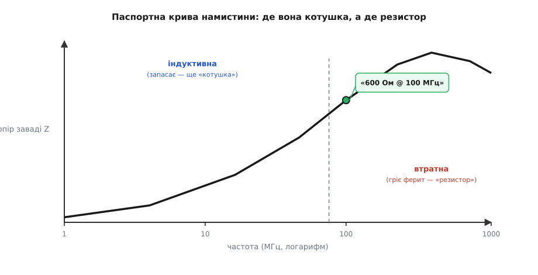
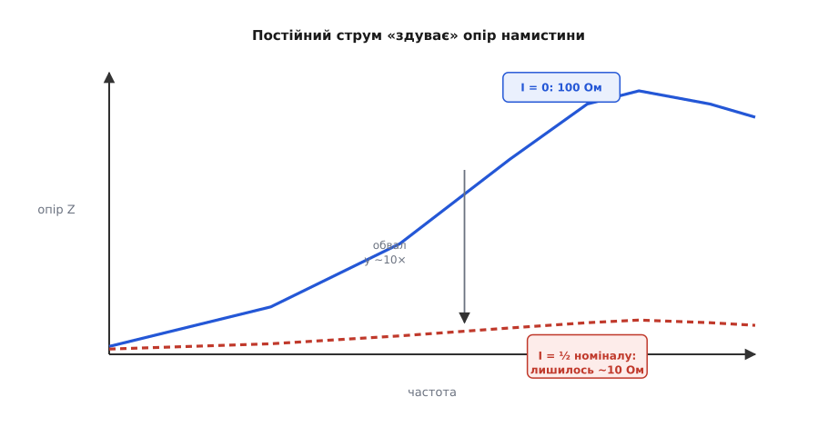

# Феритова намистина

На кожній сучасній платі стоять десятки чорних цеглинок завбільшки з рисове зерно, яких немає на жодній принциповій схемі з підручника. Це феритова намистина (*ferrite bead*; *ferrite* від латинського *ferrum* — залізо, бо ферит це кераміка з оксиду заліза; *bead* — намистина, за давньою формою бусинки на дроті). Її в один голос називають дивною деталлю, бо вона не вкладається в звичну трійцю «резистор, конденсатор, котушка»: для повільного струму намистини ніби немає взагалі, а для високочастотної завади вона раптом стає опором у сотні ом. Намистина поводиться як **резистор, що вмикається лише для шуму** — і це не метафора, а буквальний опис того, що показує її паспортна крива.

Щоб обрати намистину з каталогу й поставити її в потрібне місце, не треба заново виводити фізику фериту. Достатньо знати головне про матеріал: магнітом'який ферит під змінним полем втрачає енергію, і ці втрати тим більші, чим вища частота — детально це розібрано в темі про [ферит і його втрати](book:electronics/core-losses). Намистина бере цю «ваду» дроселя й робить із неї призначення: матеріал у ній підібрано так, щоб на частотах завад перемагнічування коштувало якнайдорожче. Далі — про саму деталь: як вона влаштована, що написано в її даташиті, як її добирати й де з нею легко обпектися.

### Що це за деталь

Конструктивно намистина — майже нічого: брусочок втратного фериту, крізь який проходить провідник. Фактично це котушка з **одного витка**, а один виток дає мізерну [індуктивність](book:electronics/inductance). Опір цього провідника постійному струмові — міліоми. Уся «робота» намистини закладена не в кількості витків, а в матеріалі бруска: усе магнітне поле струму замикається крізь ферит, який на частотах завад жадібно перетворює енергію поля в тепло.


*SMD-цеглинка й «дротяна» рідня — феритове кільце на кабелі. Витків тут крихта або жодного; головну роботу виконує матеріал. Саме тому намистина — не маленька [котушка](book:electronics/inductor-coil): котушка енергію запасає й повертає, намистина її спалює.*

Намистини бувають двох виглядів. Найпоширеніший — **SMD-цеглинка** (типорозміри 0402, 0603, 0805, 1206), та сама чорна крапка на платі. Другий — **феритове кільце** на кабелі, та «бочечка» на USB- чи відеошнурі: усередині пластмасової оболонки ховається феритовий тор, крізь який пропущено жили. Принцип у обох один; різниця лише в тому, що кільце глушить заваду цілого кабелю, а цеглинка — однієї доріжки на платі.

### Як читати її даташит

Найдивніше в намистині — її паспортне позначення. Котушку описують в генрі, резистор в омах, а намистину — фразою на кшталт **«600 Ом @ 100 МГц»**. Це не індуктивність і не звичайний опір: це «опір заваді» (повний опір, *impedance*) на одній контрольній частоті, яку виробники майже завжди беруть рівною 100 МГц. Чому саме так, видно з кривої повного опору намистини залежно від частоти струму крізь неї.


*Опір намистини заваді росте з частотою, виходить на горб і трохи спадає. Ліва частина — індуктивна: тут намистина ще «котушка», запасає й повертає. Права — втратна: тут вона вже «резистор», що гріє ферит. Паспортне число беруть у контрольній точці (зазвичай 100 МГц), а робочий діапазон деталі — це область горба.*

Поведінка намистини залежить від частоти струму, і ця залежність із характером:

- **постійний і повільний струм** — поле в фериті гойдається ліниво, втрати мізерні, індуктивність копійчана. Деталі ніби немає: лише міліоми дроту.
- **середні частоти** — намистина поводиться як маленька котушка: [опирається зміні струму](book:electronics/inductance) за законом V = L·di/dt. Енергію вона тут переважно запасає, а не палить.
- **високі частоти (десятки-сотні МГц)** — перемагнічування фериту з'їдає енергію за кожен цикл, і деталь поводиться як **резистор**: енергія завади осідає теплом у кераміці.

Строга мова для «опору змінному струмові» — це окрема велика тема про [реактивний опір](book:electronics/reactance); тут криву читають просто: скільки ом бачить завада тієї чи іншої частоти. І саме тому намистину паспортизують не в генрі, а в омах: її робота — не запасати, а гасити, тож показовою є не індуктивність, а опір для шуму.

Виробники випускають цілу драбину номіналів — від десятка ом до кількох тисяч на тій самій контрольній частоті — і профілі кривих різняться. Одні серії «широкі»: помірний опір у широкій смузі частот. Інші «гострі»: великий опір у вузькому вікні. Тому намистину добирають **не «побільше ом»**, а під частоту конкретної завади: дивляться, де на кривій деталі сидить горб, і ставлять цей горб туди, де сидить шум. Решта параметрів у рядку даташита — опір постійному струмові (DCR, від міліом до часток ома) і допустимий струм (від сотень міліампер до кількох ампер) — потрібні, щоб намистина не з'їла корисний сигнал і не перегрілася.

> 🔧 **Навіщо це.** Перше, що роблять із намистиною неправильно, — беруть «на 600 Ом», бо більше здається кращим, і ставлять усюди однакову. Та намистина на 600 Ом має горб, скажімо, біля 100 МГц, а заважає вам наведення на 300 МГц, де від тих 600 Ом лишилося пів сотні. Правильний вибір починається не з числа ом, а з частоти завади: спершу знайди, на чому «фонить» твій пристрій, тоді шукай серію з горбом саме там. Каталог дає не одну цифру, а сімейство кривих — читати треба їх.

### Скільки завади намистина прибирає

**Приклад (наскільки намистина глушить заваду).** На сигнальній лінії сидить високочастотна завада, а вхід приймача має опір близько 50 Ом. Поставимо послідовно намистину «600 Ом @ 100 МГц» — для завади на цій частоті це звичайний [дільник напруги](book:electronics/voltage-divider):

```
частка завади, що дійде = 50 / (600 + 50)
                        = 50 / 650
                        ≈ 0.077        →  ≈ 8 % від завади
```

Тринадцять разів менше — мінус 92 % шуму на цій частоті. А корисний повільний сигнал бачить лише міліоми дроту й проходить незайманим. Ось буквальний зміст фрази «опір лише для шуму».

**Приклад (ціна для корисного струму).** Та сама намистина з DCR = 50 мОм несе корисні 0.5 А постійного струму в шині живлення. Падіння напруги й нагрів на ній:

```
ΔU = I · DCR = 0.5 · 0.050 = 0.025 В  = 25 мВ
P  = I² · DCR = 0.5² · 0.050 = 0.0125 Вт = 12.5 мВт
```

Двадцять п'ять мілівольт втрати й десяток міліват тепла — для шини живлення дрібниця. Намистина «їсть» шум, майже не заважаючи корисному струмові — у цьому весь сенс деталі.

### Постійний струм проти намистини

У намистини є ахіллесова п'ята, спільна з усіма феритовими деталями: **насичення** (*saturation*). Корисний постійний струм, що тече крізь неї, підмагнічує ферит — домени вже частково вишикувані, і на гойдання завади їх лишається менше. «Опір для шуму» тане зі струмом, причому катастрофічно. Це не дрібна поправка: у реальних деталей на половині номінального струму від паспортного опору лишається мала частка.


*Та сама намистина за різного постійного струму. Без струму вона дає паспортні ом; під робочим струмом крива осідає. Для типової деталі на 100 Ом уже половина номінального струму збиває опір приблизно до 10 Ом — у десять разів. Паспортне число справедливе лише за нульового підмагнічування.*

Цифри тут не теоретичні. У ходовій намистині TDK MPZ1608S101A (100 Ом, 0603, допустимі 3 А) опір на 100 МГц падає зі 100 Ом до приблизно 10 Ом усього за половини номінального струму. Тобто деталь, яку взяли «на 100 Ом», у живленні з реальним струмом працює як десятиомна — і завади глушить удесятеро гірше, ніж очікував той, хто дивився лише на заголовне число.

**Приклад (чесний вибір намистини в живлення).** Шина живлення несе 1.2 А постійного струму. Намистина «600 Ом @ 100 МГц» з допустимим струмом 1.5 А формально підходить за струмом — але її криві підмагнічування показують, що на 1.2 А від 600 Ом лишиться кілька десятків ом. Чесний вибір — серія, розрахована на 3-4 А того самого опору: на робочому струмі 1.2 А вона збереже більшу частину паспортних ом. Правило те саме, що для [струму насичення дроселя](book:electronics/power-inductor) чи [робочої напруги конденсатора](book:electronics/capacitor-parasitics): **запас по струму вдвічі-втричі**.

> 🔧 **Навіщо це.** У живленні струм крізь намистину ніколи не нульовий — а заголовне число даташита виміряне саме за нульового струму. Тому головна навичка з намистинами: не зупинятися на рядку «600 Ом @ 100 МГц», а гортати даташит до сімейства кривих «опір проти струму підмагнічування» й читати опір на **своєму** робочому струмі. Без цього розрахунок фільтра живлення — самообман: на папері 600 Ом, у залізі — п'ятдесят.

### Чому намистина — не дросель

Здавалося б, і [дросель](book:electronics/power-inductor), і намистина «не пускають» швидку заваду — яка різниця, хто з них у колі? Різниця принципова, і вона в **долі енергії завади**.

Дросель і LC-фільтр — елементи майже без втрат: котушка енергію не розсіює, а [запасає й повертає](book:electronics/inductor-energy). Тож завади такий фільтр не знищує — він її не пускає далі, тобто **відбиває** назад до джерела. Енергія завади лишається жити в колі: гуляє між індуктивностями та паразитними ємностями й знаходить [резонанси](book:electronics/lc-resonance), на яких «дзвенить». Намистина ж заваду **поглинає**: енергія високочастотного сміття перетворюється на тепло в фериті й зникає з кола назавжди. Дзвеніти нічому. Саме тому низька добротність, яка для коливального контуру вада, для намистини — сенс існування.

Звідси й поділ ролей. Там, де треба фільтрувати **потужне** — великі струми живлення, низькочастотні пульсації перетворювача, — працює справжній дросель з малими втратами: спалювати теплом вати енергії було б марнотратством. А там, де треба прибрати **високочастотне сміття** — наведення, гармоніки крутих фронтів, радіозавади, — краще намистини нічого немає: енергії в такому шумі крихти, і найрозумніше її просто перетворити на тепло. Дросель — енергетична деталь; намистина — сміттєспалювач.

### Де ставлять намистини й де з ними обережно

Штатних місць для намистини три.

**Перше** — розгородити живлення шумного й чутливого вузлів. Намистина в шині між «цифровою» та «аналоговою» частинами плати не пускає високочастотне сміття процесора до вимірювальних кіл аналого-цифрового перетворювача. **Друге** — лінії, що виходять з плати: кожен дріт назовні працює як антена в обидва боки, тож намистини біля роз'єму не випускають шум плати в кабель і не впускають зовнішній. **Третє** — те саме [феритове кільце на кабелі](book:electronics/ferrite-clamp): синфазний дросель на [реальній котушці з осердям](book:electronics/inductor-types), невидимий для корисної пари «туди-назад» і нещадний до завади, спільної для всіх жил.

Із намистинами на **сигнальних** лініях є власна тонкість. Для деталі не існує «корисного» й «шкідливого» — є лише повільне та швидке. А фронт цифрового сигналу — це теж швидка зміна струму: що крутіший фронт, то більше високочастотних складових у ньому сидить. Тож намистина на швидкій лінії неминуче **завалює фронти** корисного сигналу разом із завадою. Для повільних ліній (кнопки, давачі, низькошвидкісні шини) це байдуже, і намистина там доречна; для швидких інтерфейсів — уже компроміс між чистотою спектра й чіткістю фронтів, і номінал добирають обережно, а часом відмовляються від намистини взагалі.

І головне застереження. Намистина в шині живлення плюс [конденсатори розв'язки](book:electronics/decoupling) за нею — це котушка з конденсатором, тобто готовий коливальний контур. На певній частоті таке живлення може не глушити заваду, а **підсилювати** її — дзвеніти на [резонансі LC-контуру](book:electronics/lc-resonance). Інженерний висновок: намистини не ставлять «за звичкою всюди». Їх ставлять прицільно — там, де відома частота завади, і перевіряють, що поряд достатньо втрат, аби контур не задзвенів. Деякі даташити чутливих мікросхем прямо просять **не** ставити намистину в їхнє живлення — тепер зрозуміло чому.

> 🔧 **Навіщо це.** Намистина — найдешевший спосіб «полікувати» електромагнітну сумісність готової плати: пристрій не проходить вимірювання випромінювання, і кілька намистин на проблемних лініях збивають викид на потрібній частоті. Але це ліки, а не вітамін: кожна намистина в живленні — потенційний резонанс, кожна на сигналі — зайвий опір на шляху корисних фронтів. Ставити їх варто прицільно, за частотою конкретної завади з паспортної кривої, а не жменею про всяк випадок.

Підсумок простий. Феритова намистина — це провідник у втратному фериті, «резистор лише для шуму»: міліоми для корисного струму, сотні ом для високочастотного сміття, яке вона перетворює на тепло. Паспортизують її не в генрі, а фразою «стільки ом на стільки МГц», і робоча зона деталі — горб її кривої опору, який добирають під частоту завади. Її дві межі — насичення постійним струмом (заголовне число справедливе лише за нульового підмагнічування) і ризик дзвону в парі з конденсаторами розв'язки. І головне, чим намистина відрізняється від [дроселя](book:electronics/power-inductor): дросель заваду відбиває й може задзвеніти, а намистина її поглинає — спалює раз і назавжди.
