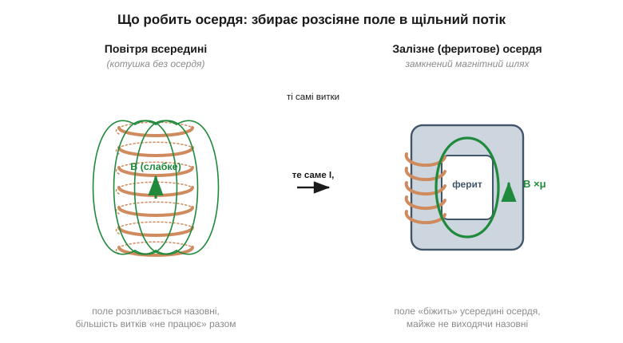
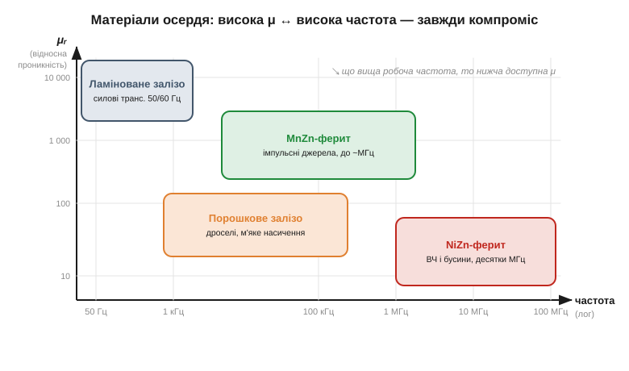
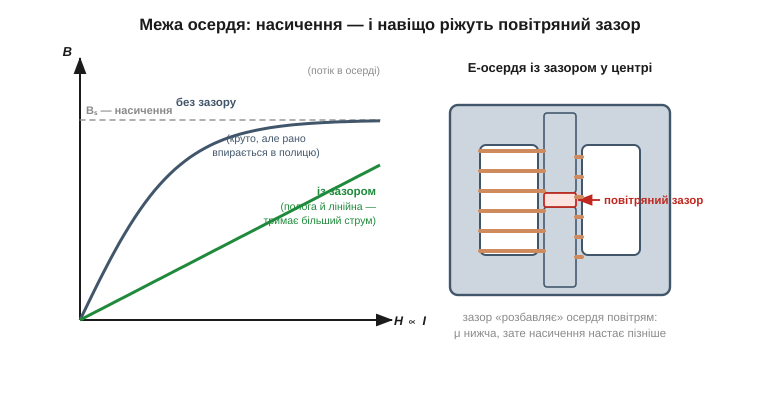

# 🔌 Осердя дроселів і трансформаторів: фізика феритів

Магнітне осердя (*magnetic core*) вишиковує свої домени за полем котушки і **підсилює** його в сотні-тисячі рази — до межі, поки [домени не вичерпаються і осердя не насититься](book:physics/saturation-hysteresis). Ця стаття — про матеріал у руках: яким буває те осердя, як його читати в каталозі й де воно ламається. Ідеться **не** про феритову «бочечку» на кабелі: той [завадопридушувальний EMI-фільтр](book:electronics/ferrite-beads) — окрема деталь; тут — осердя, крізь яке тече робочий потік дроселя чи трансформатора.

### Що це за клас деталей

Осердя — це шматок магніто-м'якого матеріалу (*soft-magnetic*, тобто легко намагнічується й легко розмагнічується назад), на який намотують дріт. Його єдина робота — **зібрати розсіяне поле котушки в щільний потік** і провести його замкненим кільцем крізь усі витки. Без осердя поле котушки кволе й розпливається в повітря; із залізним осердям той самий струм дає в μ разів густіше поле. Магнітна проникність (*relative permeability*, μᵣ) — головна цифра матеріалу: у повітря μᵣ = 1, у ферита — від сотень до кількох тисяч, у трансформаторної сталі — десятки тисяч.

*Рис. Те саме коло витків і той самий струм. Ліворуч (повітря) поле слабке й виходить назовні. Праворуч замкнене осердя проводить потік крізь усі витки — поле всередині в μ разів густіше. Осердя нічого не «створює»: воно лише збирає й веде те, що вже дала котушка.*

### Карта матеріалів: одну цифру задарма не дають

Матеріал осердя — це завжди компроміс «висока μ ↔ висока частота». Чотири головні сімейства:

- **Ламіноване залізо** (*laminated steel*) — трансформаторна сталь, нарізана тонкими ізольованими пластинами. Дуже висока μ, але працює лише на низьких частотах (мережеві 50/60 Гц): на пластини ріжуть, щоб розбити [вихрові струми](book:physics/electromagnetic-induction), що інакше марно гріють сталь.
- **Порошкове залізо** (*iron powder*) — спресований залізний пил у зв'язці. Нижча μ, зате «м'яке», поступове насичення й здатність тримати постійне підмагнічування — типове осердя силового дроселя.
- **MnZn-ферит** (*manganese-zinc*) — кераміка-фериту з високою μ, робоча до одиниць МГц. Це осердя імпульсних джерел живлення й їхніх трансформаторів.
- **NiZn-ферит** (*nickel-zinc*) — низька μ, зате працює до сотень МГц. Це матеріал високочастотних дроселів і тих самих [завадопридушувальних бусин](book:electronics/ferrite-beads).

*Рис. Що вища робоча частота, то нижча доступна проникність — матеріали лягають по спадній діагоналі. Не буває осердя «з усім одразу»: вибір матеріалу — це вибір робочого діапазону частот.*

> 🔧 **Навіщо це.** Узяти осердя «не з тієї частоти» — типова й непомітна помилка. На MnZn-фериті, призначеному для 100 кГц, високочастотний дросель страшенно гріється: на його частоті матеріал уже не проводить потік, а лише перемелює його в тепло — рівно площі [петлі гістерезису](book:physics/saturation-hysteresis) за кожен цикл. Деталь начебто «та сама котушка», а працює як грубка.

### Як читати осердя й «з чого почати»

У осердя немає виводів і datasheet з регістрами — його «розпіновка» це форма й матеріал. Три типові геометрії:

- **Тороїд** (*toroid*) — кільце; магнітний шлях повністю замкнений усередині матеріалу, тому майже не випромінює назовні. Намотується вручну важче за всіх.
- **E-осердя** (*E-core*) з каркасом-бобіною — дві половинки літери «Е», між якими затиснута готова котушка. Збирається просто, тримається кліпсою; найпоширеніше в силовій техніці.
- **Стрижень/барабан** (*rod / drum*) — відкритий магнітний шлях; дешево, але поле частково замикається крізь повітря, тож такий дросель «фонить» полем у сусідів.

«Перший крок» із новим осердям — не приклеїти його, а **переконатися, що воно не насититься** на робочому струмі. У каталозі шукають два числа: проникність матеріалу й добуток «ампер-витки до насичення» (часто подають як струм насичення для готового дроселя). Перевищив — і вся індуктивність зникає в одну мить.

### Межа й типові граблі

- **Насичення (*saturation*).** Домени вичерпуються: понад певний струм потік B виходить на полицю і котушка раптом перестає «опиратися» струму — для джерела живлення це коротке замикання й вибух транзистора. Найгірша й найчастіша поразка осердя.
- **Повітряний зазор (*air gap*).** Парадокс: у силових дроселях у магнітний шлях навмисне ріжуть тонкий повітряний зазор. Він **знижує** μ — але «розбавляє» осердя й відсуває насичення далеко вгору, роблячи характеристику пологою й передбачуваною. Менша індуктивність в обмін на більший допустимий струм.
- **Температура Кюрі (*Curie point*).** Перегрів вище за неї — і ферит **тимчасово втрачає магнетизм** — [тепловий хаос розсипає впорядковані домени](book:physics/permanent-magnets); осердя «зникає», поки не охолоне. У феритів вона буває низькою (нерідко 130–200 °C), тож гаряче імпульсне джерело — реальний ризик.
- **Крихкість.** Ферит — кераміка: впав на підлогу — і всередині тріщина, якої не видно, а магнітний шлях уже розірвано мікрозазором.

### Одна ідея — багато застосувань

Усе це — варіації **одного** фокуса: магніто-м'який матеріал збирає й проводить потік котушки. Силовий трансформатор на ламінованій сталі, імпульсний на MnZn-фериті із зазором, високочастотний дросель на NiZn, спільнорежимний дросель на тороїді — різні матеріали й форми, та фізика спільна: висока μ доти, поки домени не скінчилися. Кількісна сторона — площа петлі B–H як втрати за цикл — розглянута в сусідній [🧮 математичній вставці](book:physics/saturation-hysteresis/math-hysteresis-loop.md); сама ж [котушка як елемент кола](book:electronics/inductor-coil) — з її індуктивністю й трансформацією — це вже інша розмова.

*Рис. Ліворуч: без зазору крива круто йде вгору, але рано впирається в полицю насичення Bₛ; із зазором вона полога й лінійна — тримає більший струм. Праворуч: тонкий повітряний зазор у центральному керні E-осердя — саме він «вирівнює спину» характеристиці.*
