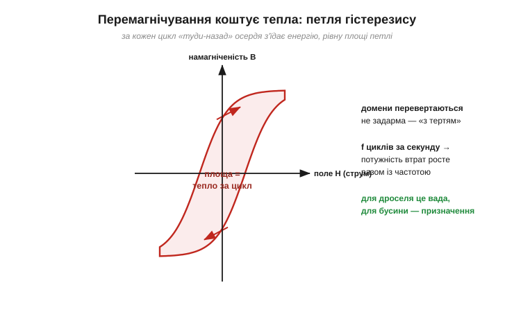
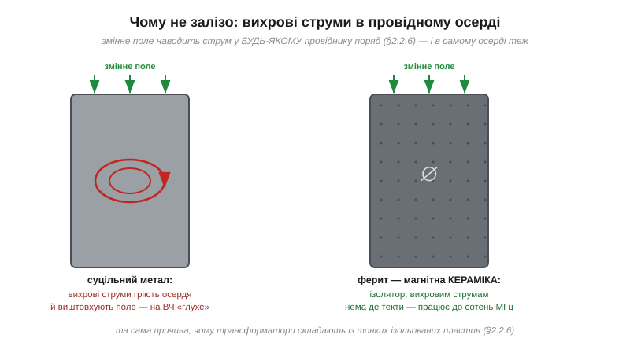
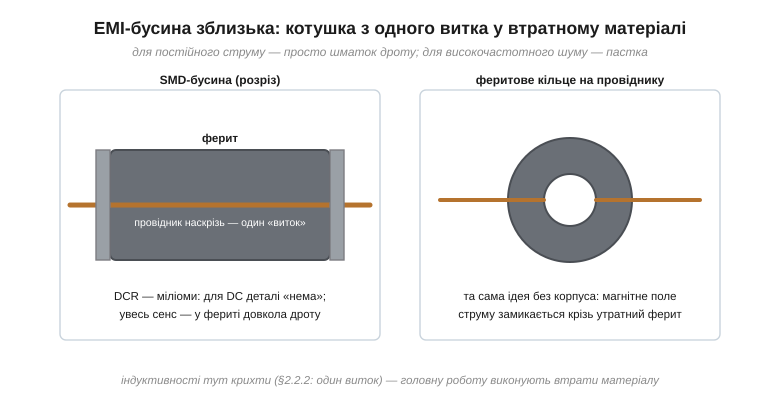
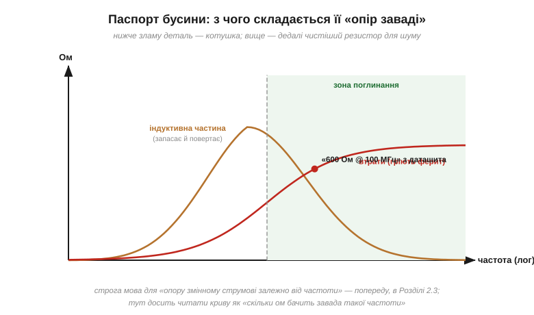
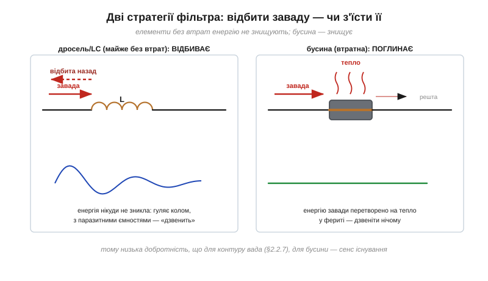
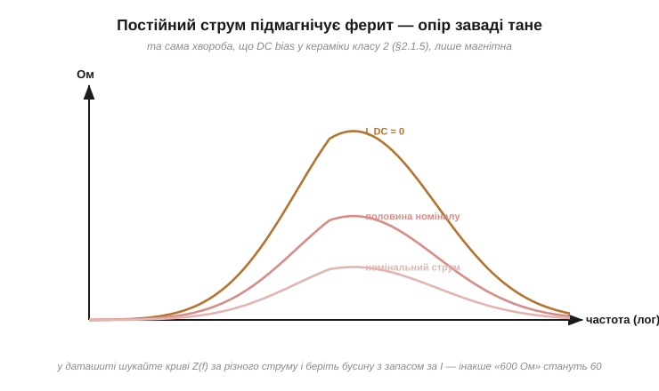
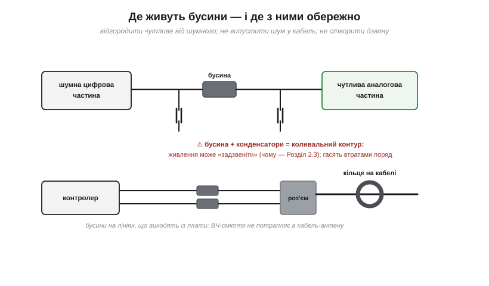

# Ферити й EMI-бусини: «опір лише для шуму»

Про [реальну котушку](book:electronics/inductor-types) кажуть дві дивні речі. Спершу — що для подавлення завад «корисні якраз втрати», і низька добротність буває саме тим, що треба. Потім — що деякі деталі навмисне працюють *вище* за власну резонансну частоту, там, де вони «вже не котушка». Обидві фрази — про одного героя: **EMI-бусину** (*ferrite bead*), або феритову намистину. Це найпоширеніший компонент боротьби з завадами: крихітна чорна цеглинка, що стоїть десятками на кожній платі й майже не з'являється на принципових схемах курсів — бо її робота не вкладається в звичну трійцю «резистор, конденсатор, котушка». Вона поводиться як **резистор, що існує лише для шуму**. Розберімо, звідки береться такий вибірковий опір: спершу — чому осердя взагалі вміє «їсти» енергію, потім — як із цієї вади зробили компонент, і нарешті — чому бусина не дросель і де її ставити.

### Перемагнічування коштує тепла

Почнімо з осердя. [Феромагнітне осердя](book:electronics/inductor-coil) підсилює поле котушки, бо його **домени** — маленькі магнітики — вишиковуються вздовж поля. Поки струм постійний, домени вишикувались один раз — і все. Але під **змінним** струмом поле гойдається туди-сюди, і доменам доводиться перевертатися щоперіоду: п'ятдесят разів за секунду в мережі, мільйон — у перетворювачі, сто мільйонів — у радіочастотній заваді.

А перевертаються вони **не задарма**. Доменні стінки чіпляються за дефекти й межі зерен матеріалу — щось на кшталт тертя. Тому крива намагніченості «туди» не збігається з кривою «назад»: виходить **петля гістерезису** (*hysteresis*), і площа цієї петлі — це енергія, яку осердя забирає в кола за **один** цикл перемагнічування й віддає теплом.


*Рис. За кожен цикл перемагнічування осердя з'їдає енергію, рівну площі петлі гістерезису. Що більше циклів за секунду — то більша потужність втрат: ті самі джоулі за цикл, помножені на частоту. Для дроселя це вада, з якою борються; для бусини — призначення.*

Звідси перший ключовий факт: втрати в осерді **ростуть із частотою**. На повільних сигналах вони мізерні, на швидких — стають головною дійовою особою. До цієї статті втрат додається друга.

### Вихрові струми: чому не залізо

Змінне магнітне поле наводить струм у **будь-якому** провідному контурі поряд — це [взаємна індукція](book:electronics/mutual-inductance). А тепер незручне питання: осердя із заліза — само провідник. Отже, змінне поле наводить струми **прямо в товщі осердя**: вони кружляють замкненими вихорами, нічого корисного не роблять, гріють метал і — за правилом Ленца — створюють зустрічне поле, що виштовхує робоче поле з осердя. Їх так і звуть — **вихрові струми** (*eddy currents*). Що вища частота, то лютіші вихори: суцільне залізне осердя вже на кілогерцах перетворюється на грілку, а на мегагерцах стає магнітно «глухим».


*Рис. Змінне поле наводить у суцільному металевому осерді вихрові струми: вони гріють метал і виштовхують поле — на високих частотах таке осердя марне. Ферит — магнітна кераміка-ізолятор: вихровим струмам нема де текти, тож він працює там, де залізо давно здалося. З тієї ж причини осердя мережевих [трансформаторів](book:electronics/mutual-inductance) складають із тонких ізольованих пластин.*

Вихід знайшли в кераміці. **Ферит** (*ferrite*) — спечений порошок оксидів заліза з домішками інших металів: матеріал **магнітний**, як залізо, але електрично — **ізолятор**. Вихровим струмам у ньому просто нема де текти. Саме тому все високочастотне в електроніці — осердя імпульсних перетворювачів, антени приймачів, і наші бусини — зроблене з фериту. Дві головні родини варто знати на ім'я:

```
MnZn-ферит (марганець-цинковий):  велика проникність, працює до ~1–2 МГц
                                   → силові трансформатори, дроселі живлення
NiZn-ферит (нікель-цинковий):      менша проникність, зате чесний ізолятор,
                                   працює до сотень МГц і вище
                                   → бусини, ВЧ-дроселі, кільця на кабелях
```

Отже, в осерді живуть **дві** статті витрат — гістерезис і вихрові струми, — і обидві ростуть із частотою. Для конструктора дроселя це вороги: він добирає матеріал так, щоб у робочій смузі втрати були мізерні, а осердя чесно **[запасало енергію](book:electronics/inductor-energy)** й повертало її. А тепер — головний поворот цієї теми: що, як зробити навпаки? Узяти матеріал, у якого на потрібних частотах втрати **навмисно великі**?

### Бусина зблизька: котушка, зроблена навпаки

Саме так влаштована EMI-бусина. Конструктивно це майже нічого: брусочок втратного NiZn-фериту, крізь який проходить провідник — фактично котушка з **одного витка**, а один виток дає мізерну [індуктивність](book:electronics/inductance). Опір цього провідника постійному струмові — міліоми.


*Рис. SMD-бусина в розрізі та її «дротяна» рідня — феритове кільце на провіднику. Індуктивності тут крихти; головну роботу виконує матеріал: усе магнітне поле струму замикається крізь ферит, підібраний так, щоб на частотах завад його перемагнічування коштувало якнайдорожче.*

Поведінка такої деталі залежить від частоти струму крізь неї — і це залежність із характером:

- **постійний і повільний струм**: поле гойдається ліниво, втрати мізерні, індуктивність копійчана — деталі ніби нема, лише міліоми дроту;
- **середні частоти**: бусина поводиться як маленька котушка — [опирається зміні струму](book:electronics/inductance) (V = L·di/dt);
- **високі частоти (десятки МГц і вище)**: перемагнічування фериту з'їдає енергію щоциклу, і деталь поводиться як **резистор** — енергія завади осідає теплом у кераміці.


*Рис. «Опір заваді» бусини складається з двох частин: індуктивної (запасає й повертає — працює на середніх частотах) і втратної (гріє ферит — перебирає владу на високих). У даташиті це записують одним числом на контрольній частоті, наприклад «600 Ом @ 100 МГц». Строга мова для [опору змінному струмові](book:electronics/reactance) — це окрема велика тема; поки читаємо криву просто: скільки ом бачить завада такої частоти.*

Звідси й паспортне позначення бусин, яке спершу спантеличує: не «стільки-то генрі», а **«600 Ом на 100 МГц»**. Бусину описують не індуктивністю, а опором для шуму на контрольній частоті — бо саме це її робота. Номіналів випускають цілу драбину — від десятків ом до кілоом на тій самій контрольній частоті, — і профілі кривих різняться: одні серії «широкі» (помірний опір у великій смузі), інші «гострі» (великий опір у вузькій). Тому бусину добирають не «побільше ом», а **під частоту конкретної завади**: дивляться, де на кривій деталі максимум, і ставлять його туди, де сидить шум.

**Приклад (наскільки бусина глушить заваду).** На сигнальній лінії сидить ВЧ-завада, а вхід приймача має опір ~50 Ом. Поставимо послідовно бусину «600 Ом @ 100 МГц» — для завади це звичайний [дільник напруги](book:electronics/voltage-divider):

```
до приймача дійде:  50 / (600 + 50) ≈ 0.077  →  ≈ 8% завади
```

Дванадцять разів менше — мінус 92% шуму на цій частоті. А корисний повільний сигнал бачить лише міліоми дроту й проходить незайманим. Ось що означає «опір лише для шуму».

**Приклад (ціна для корисного струму й доля завади).** Та сама бусина з DCR = 50 мОм несе корисні 0.5 А постійного струму: падіння — 25 мВ, нагрів — 12.5 мВт, непомітно. А ВЧ-шум 20 мА (діюче значення), що впирається в її 100-омну втратну частину, виділяє в фериті P = I²·R = 0.04 Вт — теж дрібниця, бо енергії в заваді небагато. Бусина «їсть» шум, навіть не нагрівшись.

### Чому бусина — не дросель

Тепер можна чесно відповісти на питання з назви теми. Здавалося б: і дросель, і бусина «не пускають» швидку заваду — яка різниця, хто з них стоїть у колі? Різниця принципова, і вона в **долі енергії**.

Дросель та LC-фільтр — елементи **майже без втрат**: котушка енергію не розсіює, а [запасає й повертає](book:electronics/inductor-energy). Тож завади такий фільтр не знищує — він її **не пускає далі**, тобто відбиває назад, до джерела. Енергія завади лишається жити в колі: гуляє між індуктивностями та паразитними ємностями, знаходить [резонанси](book:electronics/lc-resonance) — і «дзвенить» (різкий обрив струму в котушці так само дає [затухальний дзвін](book:electronics/inductor-kickback) після фронту). Бусина ж заваду **поглинає**: енергія високочастотного сміття перетворюється на тепло в фериті й зникає з кола назавжди. Дзвеніти нічому.


*Рис. Фільтр без втрат заваду відбиває — енергія лишається в колі й дзвенить на паразитних резонансах. Бусина заваду з'їдає — енергія стає теплом у фериті. Тому низька добротність, що для контуру вада, для бусини — сенс існування.*

Звідси й поділ ролей. Там, де треба фільтрувати **потужне** — великі струми живлення, низькі частоти пульсацій, — працює справжній дросель із малими втратами: поглинати ваты теплом було б марнотратством. А там, де треба прибрати **високочастотне сміття** — наведення, гармоніки фронтів, радіозавади, — краще бусини нічого нема: енергії в такому шумі крихти, і найрозумніше її просто спалити.

> 🔧 **Навіщо це.** Це і є відповідь, чому бусина — не дросель, хоч і схожа. Дросель — енергетична деталь: його обирають за індуктивністю, струмом насичення й ККД. Бусина — сміттєспалювач: її обирають за омами на частоті завади. Сплутати їх — типова помилка: «дросель» із бусини нікудишній (індуктивність мізерна, насичується миттю), а «бусина» з добротного дроселя ще й гірше — він не гасить заваду, а влаштовує з нею дзвін.

### Постійний струм проти бусини

У бусини є ахіллесова п'ята, спільна з усіма феритовими деталями: **насичення**. Корисний постійний струм, що тече крізь неї, підмагнічує ферит: домени вже вишикувані, і на гойдання завади їх лишається менше. «Опір для шуму» тане зі струмом — так само, як [ємність кераміки класу 2 тане з напругою](book:electronics/capacitor-parasitics), тільки хвороба тут магнітна.


*Рис. Криві «опору заваді» тієї самої бусини за різного постійного струму: на номінальному струмі від паспортних ом може лишитися чверть. У даташиті шукайте сімейство кривих Z(f) за різного I — і беріть деталь із запасом за струмом.*

**Приклад (вибір бусини в живлення).** Шина живлення несе 1.2 А. Бусина «600 Ом @ 100 МГц» із максимальним струмом 1.5 А формально підходить — але її криві показують, що вже на 1 А від 600 Ом лишається кілька десятків. Чесний вибір — серія на 3–4 А того самого опору: на робочому струмі вона збереже більшу частину паспортних ом. Правило те саме, що для [струму насичення дроселя](book:electronics/inductor-types) і [робочої напруги конденсатора](book:electronics/capacitor-parasitics): **запас удвічі**.

### Де ставлять бусини — і де з ними обережно

Типових місць три. **Перше** — розгородити живлення шумного й чутливого вузлів: бусина в шині між «цифровою» та «аналоговою» частинами не пускає високочастотне сміття до вимірювальних кіл. **Друге** — лінії, що виходять із плати: кожен дріт назовні — антена, а [наведення працюють в обидва боки](book:electronics/mutual-inductance), тож бусини біля роз'єму не випускають ВЧ-шум плати в кабель і не впускають зовнішній. **Третє** — [феритове кільце на самому кабелі](book:electronics/ferrite-clamp), та сама «бочечка» на USB-шнурі: це синфазний дросель на [реальній котушці з осердям](book:electronics/inductor-types), невидимий для корисної пари «туди-назад» і нещадний до завади, спільної для всіх жил.


*Рис. Три штатні місця: бусина в живленні чутливого блока, бусини на лініях до роз'єму, кільце на кабелі. І попередження: бусина в парі з конденсаторами розв'язки утворює коливальний контур — живлення може «задзвеніти» на його частоті.*

З бусинами на **сигнальних** лініях є власна тонкість: для деталі не існує «корисного» й «шкідливого» — лише повільне та швидке. А фронти цифрового сигналу — це теж швидка зміна струму ([вставка про I = C·dV/dt](book:electronics/capacitance/math-derivative-current.md) показувала те саме з боку напруги): чим крутіший фронт, тим більше «високочастотного» в ньому сидить. Тож бусина на швидкій лінії неминуче **завалює фронти** корисного сигналу разом із завадою. Для повільних ліній (кнопки, давачі, низькошвидкісні шини) це байдуже — і бусина там доречна; для швидких інтерфейсів — уже компроміс між чистотою спектра й чіткістю фронтів, і номінал добирають обережно, а часом відмовляються від бусини взагалі. Правило просте: що швидший корисний сигнал, то менше ом можна собі дозволити на його шляху.

І головне застереження. Бусина в шині живлення плюс [конденсатори розв'язки](book:electronics/capacitor-uses) за нею — це **котушка з конденсатором**, тобто готовий коливальний контур. На певній частоті таке живлення може не глушити заваду, а **підсилювати** — дзвеніти (так працює [резонанс LC-контуру](book:electronics/lc-resonance)). Інженерний висновок простий: бусини не ставлять «за звичкою всюди»; їх ставлять там, де відома частота завади, і перевіряють, що поряд достатньо втрат, аби контур не задзвенів. Деякі даташити чутливих мікросхем прямо просять *не* ставити бусину в їхнє живлення — тепер ви знаєте чому.

> 🔧 **Навіщо це.** Бусина — найдешевший спосіб «полікувати» електромагнітну сумісність готової плати: пристрій не проходить вимірювання випромінювання — і кілька бусин на проблемних лініях збивають викид на потрібній частоті. Але це ліки, а не вітамін: кожна бусина в живленні — потенційний резонанс, а кожна на сигналі — зайвий опір. Ставити їх варто прицільно — за частотою конкретної завади з паспортної кривої, а не жменею про всяк випадок.

Підсумуймо тему. Осердя під змінним полем втрачає енергію двома шляхами — на **гістерезис** (площа петлі щоциклу) і на **вихрові струми** (наведені вихори в провідному матеріалі), — і обидві статті ростуть із частотою. **Ферит** — магнітна кераміка — відрізає вихрові струми, тож працює на мегагерцах, де залізо глухе; а добором складу фериту втрати можна зробити або мізерними (дросель), або навмисне великими в смузі завад (бусина). EMI-бусина — це «резистор лише для шуму»: міліоми для корисного струму, сотні ом для ВЧ-сміття, яке вона перетворює на тепло, — і саме цим, поглинанням замість відбивання, вона принципово відрізняється від дроселя. Її межі — насичення постійним струмом і ризик дзвону в парі з конденсаторами. У підсумку бусина — дзеркальна протилежність дроселя: там, де [котушка запасає й повертає енергію](book:electronics/inductor-energy), бусина її спалює, і саме на цьому контрасті будується весь поділ ролей між «не пустити» й «поглинути».
