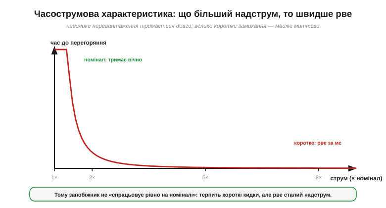
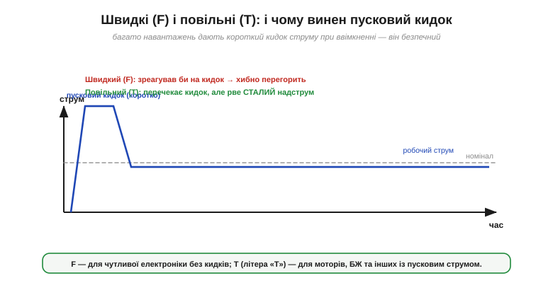
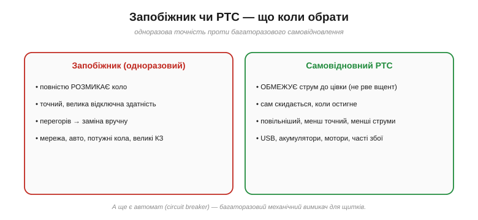

# Запобіжники й самовідновні PTC: захист від надструму

Струм неминуче [гріє провідник](book:physics/joule-heating) (P = I²R), і в робочому колі це тепло помірне й кероване. Та варто чомусь піти не так — коротке замикання, заклинений мотор, переплутаний провід, — і струм підскакує далеко за межі, на які коло розраховане. Тоді те саме джоулеве тепло за секунди розжарює дроти, плавить ізоляцію, починає пожежу. Колу потрібен **автоматичний вартовий**, що відчує надмірний струм і обірве чи обмежить його, перш ніж станеться лихо. Найдавніший і найпростіший такий вартовий — **запобіжник**; найхитріший, що оживає сам, — **самовідновний PTC**. Про них ця тема.

### Надструм: чому це небезпечно

Спершу — про саму загрозу. **Надструм** (*overcurrent*) — це струм, більший за той, на який розраховане коло. Звідки він береться? Найгрізніше джерело — **коротке замикання** (*short circuit*): фазний провід через пошкодження торкається зворотного майже без опору. За [законом Ома](book:electronics/ohms-law) I = V/R, якщо R падає майже до нуля, струм злітає до велетенських значень — стримує його хіба внутрішній опір джерела та опір самих дротів.


*Рис. Ліворуч — норма: навантаження тримає струм у шорах, тепло помірне. Праворуч — коротке замикання: опір майже зник, струм злетів до десятків ампер, а тепло P = I²R розжарює дріт. Захист має обірвати це за частку секунди.*

А далі вступає квадрат у [джоулевому теплі](book:physics/joule-heating): P = I²R росте **як квадрат струму**. Подвоївся струм — учетверо більше тепла; вдесятеро — у сто разів. Тонкий дріт, що спокійно ніс пів ампера, при десяти амперах розсіює в сотні разів більше — розжарюється до червоного, плавиться, підпалює довкілля. Тому надструм треба не «терпіти», а **швидко обірвати**.

**Приклад (що коїться при короткому).** Хай 5-вольтове джерело замкнули дротом опором лише 0.5 Ω:

```
I = V / R = 5 В / 0.5 Ω = 10 А
P = I²·R = 10² × 0.5 = 50 Вт
```

П'ятдесят ватів — у тоненькому дроті! Це більше за паяльник; дріт розжариться за мить. А був би опір іще менший — струм і тепло були б іще страшніші. Ось чому коротке замикання — не дрібниця, а аварія, яку треба гасити негайно.

Корисно одразу розрізнити **два** роди надструму, бо реагувати на них треба по-різному. **Коротке замикання** — раптове й катастрофічне: струм у десятки разів понад норму, шкода за частки секунди; тут захист мусить діяти блискавично. А **перевантаження** (*overload*) — повільніше й м'якше: до кола просто під'єднали забагато (надто потужний споживач, кілька приладів в один подовжувач), і струм перевищив норму, скажімо, у півтора раза. Воно не вибухає миттєво, та години такого «перегріву» так само псують ізоляцію й починають пожежу. Добрий вартовий має впоратися з обома: коротке рвати миттєво, а помірне перевантаження — за розумний час. Саме тому, як ми зараз побачимо, у запобіжника не одна точка спрацювання, а ціла **крива**.

### Запобіжник: найслабша ланка за вибором

Найстаріша ідея захисту геніально проста: вставити в коло послідовно **навмисно найслабшу ланку** — тонкий легкоплавкий дротик, що перегорить першим. Це **запобіжник** (*fuse*).


*Рис. Запобіжник — тонкий легкоплавкий дротик у корпусі між двома ковпачками. Цілий — проводить; за надструму його I²R-тепло плавить дротик, лишаючи розрив. Деталь одноразова: перегорів — заміна.*

За нормального струму він холодний: його малий опір і помірний струм дають крихітне I²R-тепло, яке встигає стікати через ковпачки. Та щойно струм перевищить межу, тепло в тонкому елементі вже не встигає відводитись — він **розплавляється**, лишаючи розрив. Коло розімкнене, струм спинено. Запобіжник **одноразовий**: перегорів — ставлять новий.

У чому глибока мудрість «найслабшої ланки»? Вона дає змогу **обрати, де коло зламається**. Без запобіжника місце аварії обирає сама несправність — і це буде найвразливіша точка: дорога проводка в стіні, плата, акумулятор. Із запобіжником ламається саме він — копійчана, легкозамінна деталь у відомому, безпечному місці. Ви ніби кажете біді: «як уже щось горітиме — то хай оце».

> 📜 Ідея «найслабшої ланки» старша за лампочку: вона народилася на телеграфних лініях як захист від блискавки, а потім стала вартовим електричного дому. Хто й коли до неї дійшов — і чому в запобіжника, як у багатьох винаходів, немає єдиного «батька» — у вставці [Народження запобіжника](hist-fuse.md).

Є й тонкість, яку варто знати наперед. Запобіжник чудово береже **проводку** й усе, що **витриваліше** за нього, — але не завжди врятує найніжніше. Напівпровідник (діод, транзистор, мікросхема) часто згоряє **швидше**, ніж устигає перегоріти будь-який плавкий запобіжник: лічені мікросекунди надструму вбивають кристал, а дротику треба мілісекунди, щоб розплавитись. Тому кажуть, що запобіжник захищає радше **коло й людину від пожежі**, ніж тендітну деталь від смерті; для делікатних кіл додають швидші електронні захисти. Міру «встигне-не-встигне» описують числом **I²t** (*let-through energy*) — енергією, що проскакує до перегоряння: чим воно менше, тим «швидший» запобіжник і тим менше шкоди встигне накопичитись.

> 🔧 **Навіщо це.** Запобіжник стоїть на вході майже кожного живлення — у вилці, у блоці, в автомобілі (ціла «коробка запобіжників»), у зарядці. Коли пристрій «помер мовчки» після стрибка напруги чи замикання — перше, що перевіряють, це запобіжник: часто вся «поломка» в ньому, і заміна копійчаного скельця оживляє апарат. Тому запобіжник часто роблять **доступним** (у тримачі), а не запаюють намертво.

### Скільки й як швидко: часострумова характеристика

Тут новачки часто помиляються, гадаючи, що запобіжник «на 2 А» перегорає рівно на двох амперах. Насправді він має **часострумову характеристику** (*time-current characteristic*): малий надлишок терпить довго, а великий рве майже миттєво.


*Рис. Часострумова крива: невеликий надлишок над номіналом запобіжник терпить довго (тепло набігає поволі), а велике коротке рве за мілісекунди. Тому «номінал» — це струм, який він несе вічно, а не точка миттєвого спрацювання.*

Логіка та сама — теплова. Невелике перевищення гріє елемент поволі, і доки він дотягне до плавлення, можуть минути секунди чи хвилини. А коротке замикання вкидає стільки тепла, що дротик зникає за **мілісекунди**. Тому в запобіжника розрізняють: **номінальний струм** (його він несе скільки завгодно довго) і саму криву (як швидко рве за того чи іншого надструму). Додають ще два важливі числа: **відключна здатність** (*breaking capacity*) — найбільший струм короткого, який запобіжник здатний обірвати, не вибухнувши, — і **робочу напругу**.

На відключній здатності спинімося окремо, бо тут ховається небезпека. Уявіть коротке з велетенським струмом — тисячі ампер. Коли дротик випаровується, між ковпачками лишається розжарена **дуга** з іонізованого металу, що чудово проводить. Якщо запобіжник не здатний цю дугу **погасити**, струм тектиме крізь плазму й далі — а сам запобіжник може **вибухнути**. Тому мережеві запобіжники роблять із піском усередині (він гасить дугу й охолоджує) і вказують велику відключну здатність; брати запобіжник із замалою відключною здатністю там, де можливі великі струми короткого, — небезпечно.

А ще криві дають змогу будувати **селективність** (*selectivity*): підбирати запобіжники так, щоб за аварії перегорав саме той, що **найближче** до місця збою, а не головний на вході. Тоді несправність відрубає лише свою гілку, а решта пристрою живе далі — як у домі вибиває пробку однієї кімнати, а не всього будинку.

### Швидкі й повільні (F/T)

З теплової природи випливає й поділ на **швидкі** (*fast*, F) і **повільні** (*time-delay*, T) запобіжники. Річ у тім, що багато навантажень при ввімкненні дають короткий **пусковий кидок** (*inrush*) струму — мотор, що рушає, чи блок живлення, що заряджає свої конденсатори, на мить беруть струм у рази більший за робочий, а тоді вгамовуються.


*Рис. Пусковий кидок при ввімкненні короткий і безпечний. Швидкий (F) запобіжник перегорів би на ньому хибно; повільний (T) перечекає сплеск, але рве сталий надструм. Звідси й вибір F чи T за характером навантаження.*

Швидкий запобіжник сприйняв би цей безпечний кидок як аварію й **хибно перегорів**. Повільний має теплову інерцію: короткий сплеск він перечекає, а сталий надструм усе одно його розплавить. Тому правило просте: **F** — для чутливої електроніки без пускових кидків; **T** (з літерою «Т» на корпусі) — для моторів, ламп розжарення, блоків живлення та іншого «кидкого» навантаження. На практиці літер швидкості більше за дві — від FF до TT, — а щоб дібрати [справжній запобіжник за корпусом і номіналом](book:electronics/fuse-types) (скляний, керамічний, ножовий чи SMD, із трьома числами на тілі), цей поділ доводиться читати разом із корпусом і відключною здатністю.

### Самовідновний PTC: запобіжник, що оживає

У запобіжника є прикра вада — він **одноразовий**. Замінювати його після кожного збою морочливо, а часом і неможливо (запаяний усередині пристрою). Для випадків, де збої очікувані й тимчасові, винайшли самовідновний захист — **PTC-запобіжник** (*polyfuse*, *resettable fuse*, PPTC). Працює він геть інакше: не плавиться, а **різко збільшує опір**.


*Рис. Усередині PTC — провідні частинки в полімері. Холодний: ланцюжки зімкнені, опір малий, струм тече. Нагрівся надструмом: полімер розбух, ланцюжки розірвались, опір стрибнув у тисячі разів (праворуч — крива R(T)).*

Усередині — полімер, напханий провідними частинками (сажею). Поки він **холодний**, частинки щільно торкаються, утворюючи провідні ланцюжки, і опір малий — струм тече вільно. Та щойно надструм нагріє полімер до певної температури, той **розбухає**, частинки розсуваються, ланцюжки рвуться — і опір **стрибком** зростає в тисячі разів. Струм майже спиняється, спадаючи до крихітної «цівки». Прилад «спрацював».


*Рис. Цикл PTC у часі: норма → кидок короткого → спрацював і пропускає лише цівку («тримає», гріючи сам себе) → зняли живлення → охолов і сам відновився. Жодної заміни.*

Найхитріше — що далі. Та сама цівка струму, протікаючи крізь тепер високий опір, **гріє PTC й тримає його гарячим** — він **засувається** (latched) у високоомному стані, поки на нього подано напругу. А зніміть живлення — і PTC **охолоне**, полімер стиснеться, ланцюжки зімкнуться, опір упаде, і він **сам відновиться**, готовий працювати знову. Жодної заміни.

У PTC свої числа: **струм утримання** (*hold current*) — який він несе нескінченно, не спрацьовуючи, — і **струм спрацювання** (*trip current*), за якого перемикається у високоомний стан. Він повільніший і менш точний за плавкий запобіжник і не розриває коло **вщент** (лишає цівку), зате **багаторазовий**.

Та й у PTC є своя плата за зручність. Він **повільніший** за плавкий запобіжник — спрацьовує не за мікросекунди, а за частки секунди, тож від блискавичного короткого встигне пропустити чималий кидок. Він **менш точний**: межа спрацювання «розмазана» й помітно залежить від температури навколо (у теплі спрацьовує раніше, на морозі — пізніше). Розрахований він на **скромніші** струми й напруги, ніж потужні плавкі запобіжники. І трохи **старіє**: після багатьох спрацювань його опір у холодному стані поволі підростає. Тож PTC — не універсальна заміна запобіжникові, а зручний інструмент саме там, де збої часті, дрібні й очікувані.

> 🔧 **Навіщо це.** Саме тому PTC стоїть там, де збої — звичне діло, а лізти із заміною незручно: на кожному **USB-порту** (хтось замкнув роз'єм чи встромив несправний пристрій — порт «вимкнувся», а висмикнув — і він ожив), у захисті **акумуляторів** від короткого, у моторах і дитячих іграшках. Коли USB-пристрій «віднявся», а після перевтикання запрацював — це майже напевно спрацював і скинувся PTC.

### Що обрати: запобіжник, PTC чи автомат


*Рис. Коротко: плавкий запобіжник — одноразовий, точний, для великих аварій; PTC — багаторазовий, обмежувальний, для частих тимчасових збоїв. Третій варіант — автомат для щитків.*

Звести все докупи нескладно. **Плавкий запобіжник** повністю розмикає коло, точний, тримає величезні струми короткого — але одноразовий; його місце там, де аварія рідкісна й критична: мережа, авто, потужні кола. **PTC** обмежує струм і **сам скидається**, та повільніший, менш точний і на менші струми — його місце там, де збої часті й тимчасові. А є й третій вартовий — **автомат захисту** (*circuit breaker*): багаторазовий механічний вимикач, що сам розмикається від надструму (тепловим і магнітним розчіплювачем); ним захищають домашні щитки, бо його, на відміну від запобіжника, не міняють, а просто знову вмикають важелем.

Усередині автомата — два розчіплювачі заразом. **Тепловий** (біметалева пластина, що вигинається від I²R-нагріву) повільно реагує на **перевантаження**: чим більший надлишок, тим швидше пластина вигнеться й відпустить засувку. А **магнітний** (котушка-соленоїд) спрацьовує **миттєво** на велике **коротке**: різкий стрибок струму притягує якір і вибиває засувку за мілісекунди. Так один прилад накриває обидва роди надструму — як і запобіжник своєю кривою, тільки багаторазово.

> 🔧 **Навіщо це.** Перше діагностичне питання, коли живлення зникло: **що саме спрацювало?** Запобіжник — огляньте скельце (видно перепалений дротик), замініть на такий самий. PTC — зніміть живлення на хвилину, дайте охолонути, і пристрій оживе сам. Автомат — просто підніміть важіль. А якщо захист спрацьовує **знову й одразу** — справжній збій нікуди не зник, і шукати треба його, а не «глушити» захист перемичкою (це найгірше, що можна вдіяти).

**Приклад (добір запобіжника).** Пристрій у нормі бере 1 А. Який запобіжник ставити?

```
робочий струм:            1 А
запас на кидки/нагрів:     × ~1.5–2
→ номінал запобіжника:    ~2 А
```

Чому не «рівно 1 А»? Бо тоді запобіжник балансував би на межі й рвався б від найменшого законного коливання чи нагріву (його номінал ще й трохи падає в теплі). Беруть із запасом — щоб у нормі він жив спокійно, а спрацьовував лише на справжній аварії. Точну межу й тип (F/T) звіряють із даташитом навантаження.

### Спільний корінь усіх вартових

Зверніть увагу на красиву єдність: **і запобіжник, і PTC працюють на [джоулевому теплі](book:physics/joule-heating)**. Запобіжник тепло **плавить**, PTC — тепло **розбухає й розриває ланцюжки**; обидва — це I²R, поставлене на службу безпеці. Тобто тепло в колі буває не лише ворогом, а й вартовим.

Ще одна спільна риса: обидва — **послідовні** вартові, що стоять прямо на шляху струму й самі його несуть. Тому в них завжди є власний (нехай і малий) опір і власне падіння напруги, з яким у точних чи сильнострумових колах доводиться рахуватися. Захист ніколи не буває геть «безкоштовним» — і це теж частина інженерного компромісу.

У цьому й зворотний бік тієї самої медалі. Якщо навіть **справні** деталі гріються — а вони гріються, бо несуть струм, — то це тепло треба кудись **відводити**, інакше навіть без жодної аварії компонент звариться у власному соку. Як рахувати цей [тепловий шлях](book:physics/thermal-resistance) і відганяти ват назовні — окреме питання, де те саме джоулеве тепло постає вже не вартовим, а ворогом, якого треба приборкати.

---
