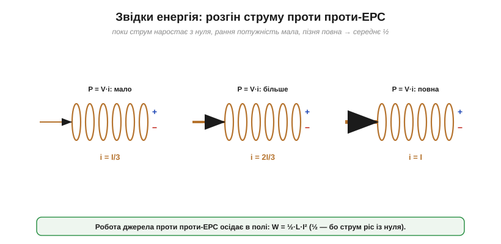
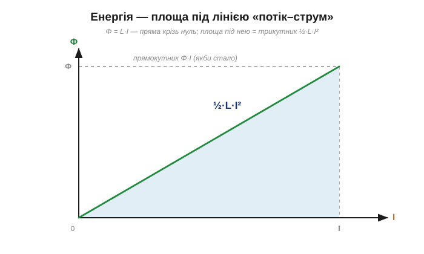
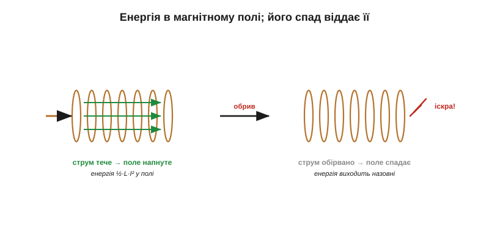
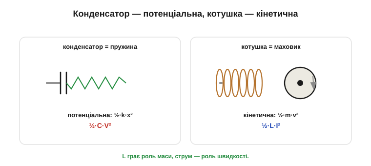
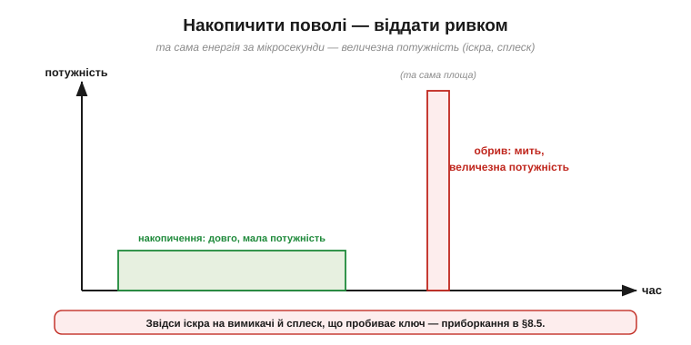

# Енергія в магнітному полі

Котушка зі струмом тримає **запас енергії** — захований у її магнітному полі. Найкращий доказ цього ви бачите щоразу, коли висмикуєте з розетки потужний прилад чи розмикаєте коло з обмоткою: між контактами проскакує **іскра**. Це котушка вивергає свій запас, не бажаючи розлучатися зі струмом. Порахуймо, скільки енергії в ній сидить, де вона захована і чому при обриві струму вона виходить так бурхливо. Відповідь — точне дзеркало того, як [запасає енергію конденсатор](book:electronics/capacitor-energy), лише з поміняними ролями струму й напруги. І саме на цій енергії тримається половина силової електроніки: імпульсні перетворювачі живлення, системи запалювання, зварювальні апарати — усі вони раз у раз ганяють енергію крізь магнітне поле котушки.

### Звідки енергія: робота проти проти-ЕРС

Енергія в котушці не виникає з нічого — її вкладає джерело, поки **розганяє** струм від нуля до робочого значення. Поки струм наростає, котушка [наводить проти-ЕРС](book:electronics/inductance), що цьому опирається. Щоб усе ж наростити струм, джерело мусить долати цю проти-ЕРС — тобто **виконувати роботу**. Ця робота й осідає в магнітному полі як запас енергії.


*Розгін струму від 0 до I: на початку струму нема, наприкінці — повний I. Джерело весь час долає проти-ЕРС котушки, виконуючи роботу. Оскільки струм наростає від нуля, середня «вартість» — на половині шляху, тож енергія виходить ½·L·I² (рівно як ½·C·V² для конденсатора, що заряджався проти зростання напруги).*

Той самий множник ½, що й у конденсатора, і з тієї самої причини: струм наростав **з нуля**. На початку розгону його ще мало, наприкінці — повний; у середньому джерело «платило» за половину. Звідси й половина у формулі.

Зверніть увагу на дзеркальність самої бухгалтерії. У конденсаторі джерело переганяло заряд проти зростання **напруги**; у котушці воно розганяє струм проти зростання **проти-ЕРС**. Там накопичувалося розділення заряду, тут — «розгін» струму; там енергія осідала в електричному полі, тут — у магнітному. Та сама механіка вкладання енергії, лише з поміняними ролями струму й напруги.

### Закон: W = ½·L·I²

Енергія, запасена в котушці з індуктивністю L, по якій тече струм I:

```
W = ½ · L · I²
```


*Звідки ½: якщо відкладати магнітний потік проти струму, виходить пряма крізь нуль (Φ = L·I). Енергія — площа під нею, тобто **трикутник** ½·Φ·I = ½·L·I². Якби «вартість» була стала, вийшов би прямокутник Φ·I; та струм наростав із нуля, тож рівно половина. Точне дзеркало ½·C·V² для конденсатора.*

Перевірмо, що це **джоулі**. Індуктивність у генрі (В·с/А), струм в амперах:

```
[L·I²] = (В·с/А) · А² = В·А·с = (В·А)·с = Вт·с = Дж   ✓
```

(вольт-ампер — це вата потужності, помножена на секунди — джоулі). Одиниці сходяться. Є й інші записи тієї самої енергії — через магнітний потік (W = ½·Φ·I), точно як у конденсатора були ½·Q·V і ½·Q²/C, — але на практиці майже завжди користуються формою **½·L·I²**.

Саме цю енергію вперше відчув на собі Джозеф Генрі: його потужні електромагніти запасали її стільки, що при розмиканні били іскрою й чутливим ударом струму. Зручно мислити так: ½·L·I² — це «магнітний капітал» котушки, накопичений струмом і готовий повернутися тієї ж миті, щойно струмові щось загрожує.

**Приклад (енергія в котушці).** Дросель L = 10 мГн зі струмом I = 2 А:

```
W = ½ · L · I²
W = ½ · (10 × 10⁻³ Гн) · (2 А)²
W = ½ · 0.01 · 4 = 0.02 Дж = 20 мДж
```

Двадцять міліджоулів — небагато (приблизно як у зарядженому конденсаторі середніх розмірів). Та вся хитрість, як і в конденсаторі, не в обсязі запасу, а в тому, **як швидко** його можна віддати: той самий запас, виштовхнутий за мікросекунди, дає колосальну миттєву потужність.

### Чому струм важливіший: квадрат

У формулі ½·L·I² індуктивність входить лінійно, а струм — у **квадраті**. Тому струм для запасу енергії набагато «важливіший»: подвоїти індуктивність — подвоїти енергію, а подвоїти струм — збільшити її **вчетверо**.


*Запас енергії W ∝ I² — парабола. Удвічі більший струм дає вчетверо більше енергії, утричі — у дев'ять разів. Тому котушку для накопичення енергії «розганяють» струмом, а небезпека при обриві стрімко зростає зі струмом.*

**Приклад (квадрат струму).** Той самий дросель 10 мГн, але струм уже 4 А (удвічі більший):

```
W = ½ · 0.01 · (4)² = ½ · 0.01 · 16 = 0.08 Дж = 80 мДж
```

Вчетверо більше за попередні 20 мДж — від лише вдвічі більшого струму. Це точне дзеркало того, як [енергія конденсатора залежить від квадрата напруги](book:electronics/capacitor-energy).

Цей квадрат має пряму ціну в проєктуванні. Дросель, розрахований на певний запас енергії, мусить витримувати відповідний струм — бо саме струм визначає і запас, і наближення [осердя до насичення](book:electronics/inductor-coil). Подвоїти робочий струм означає не подвоїти, а **вчетверо** збільшити енергію в полі — а отже, куди суворіші вимоги і до осердя, і до захисту кола від сплесків при обриві.

### Де сидить енергія: у магнітному полі

Де фізично захований цей запас? Не «у дроті» й не «у струмі» — а в **магнітному полі**, що наповнює котушку та її осердя. Це точне дзеркало конденсатора, де [енергія живе в електричному полі зазору](book:electronics/capacitor-energy).


*Поки тече струм, поле напнуте — енергія є. Перервеш струм — поле **спадає до нуля**, і запасена в ньому енергія мусить вийти назовні (наводячи проти-ЕРС, женучи струм далі, спалахуючи іскрою). Енергія живе в полі, а не в металі.*

Поки струм тече — поле напнуте, енергія є. Зник струм — спало поле, енергію віддано. Конденсатор запасав енергію в електричному полі й віддавав її при розряді; котушка запасає в магнітному й віддає, коли поле спадає. Два компоненти, два поля — і та сама ідея: **енергія любить жити в полях**.

Корисно знати й тонкість: щільність енергії в полі росте з квадратом його сили (∝ B²), тож більша частина запасу зосереджена там, де поле найгустіше — всередині котушки та її осердя. Це й причина, чому осердя не лише множить індуктивність, а й «вміщає» левову частку енергії; і чому **насичене** [осердя](book:electronics/inductor-coil) раптом перестає її запасати — полю більше нема куди рости в металі.

### Котушка — це кінетична енергія струму

[Аналогія інерції котушки](book:electronics/inductance) тут стає буквальною й прекрасною. У механіці пружина запасає **потенціальну** енергію ½·k·x², а рухоме тіло — **кінетичну** ½·m·v². Погляньте на пари:

```
пружина:       ½·k·x²        конденсатор:   ½·C·V²
рухоме тіло:   ½·m·v²        котушка:       ½·L·I²
```


*Конденсатор — як стиснута пружина (потенціальна енергія ½·k·x², запас у «натягу» поля). Котушка — як розкручений маховик (кінетична енергія ½·m·v², запас у «русі» струму). Індуктивність грає роль маси, струм — роль швидкості.*

Збіг не випадковий: індуктивність грає роль **маси**, а струм — роль **швидкості**. Котушка запасає енергію саме тому, що струм «рухається», як маховик запасає її, бо обертається. І так само, як маховик не спинити вмить (інакше куди подіти його кінетичну енергію?), струм у котушці не обірвати вмить без бурхливого виходу енергії. Ця аналогія — не просто гарна картинка: вона дозволяє переносити всю механічну інтуїцію на електричні кола.

Звідси правило, яке варто закарбувати: **струм у котушці не можна обірвати миттєво**, як не можна вмить спинити важкий маховик. Спробуєш — і котушка, обстоюючи свій струм, нажене скільки завгодно високу [напругу (V = L·di/dt з величезним di/dt)](book:electronics/inductance), аби струм усе ж протік бодай крізь іскру. Маса віддає кінетичну енергію через гальмівний шлях; котушка — через шлях для струму. Дай їй цей шлях завчасно — і приборкаєш сплеск (саме так працює [захисний діод](book:electronics/inductor-kickback)).

### Запас, що повертається

Як і конденсатор, котушка енергію **не витрачає, а запасає й повертає**. Ідеальна котушка (без опору обмотки) накопичує енергію, поки струм наростає, і повністю віддає її назад, коли струм спадає, — нічого не перетворюючи на тепло. Цим вона відрізняється від резистора, що енергію безповоротно [**спалює** на тепло](book:physics/joule-heating).


*Доля вкладеної енергії. Резистор увесь час перетворює її на тепло (необоротно). Котушка запасає її в полі й повертає в коло, коли поле спадає (оборотно). Тому котушка, як і конденсатор, — реактивний елемент, а не той, що розсіює.*

Різниця з конденсатором — лише у **способі** віддачі. Заряджений конденсатор небезпечний напругою на роз'єднаних виводах — його боїшся чіпати; котушка зі струмом — навпаки, сплеском при роз'єднанні — її боїшся обривати. Перший тримає енергію в розділеному заряді й віддає її, коли йому дають шлях для струму (розряд); друга тримає енергію в русі струму й віддає, коли цей рух намагаються спинити. Дзеркало й тут повне.

> 🔧 **Навіщо це.** Ця оборотність — основа [**імпульсних перетворювачів** живлення](book:electronics/buck). Котушку накачують енергією, поки відкритий ключ, а потім перенаправляють цей запас у потрібний бік — і так піднімають чи знижують напругу майже без втрат (на відміну від лінійного стабілізатора, що зайве просто гріє). Саме тому котушка — серце будь-якого ефективного блока живлення: вона позичає енергію колу, а не марнує її.

### Енергії треба кудись подітися

А тепер — найдраматичніший наслідок. Раз у котушці є запас енергії, то при **різкому обриві** струму ця енергія мусить кудись вийти за дуже короткий час. [Потужність — це енергія за секунду](book:physics/electric-power); якщо 20 мДж віддати не за секунди, а за мікросекунди, миттєва потужність буде колосальною.


*Котушку накопичують поволі (мала потужність), а при різкому розмиканні вона віддає весь запас за мікросекунди — миттєва потужність підскакує в тисячі разів. Енергії «нема куди дітися», тож вона проривається сплеском напруги чи іскрою на контактах.*

**Приклад (потужність при обриві).** Повернімося до дроселя з 20 мДж запасу. Якщо вимикач обриває струм за 1 мкс, середня потужність викиду:

```
P = W / Δt = 0.02 Дж / (1×10⁻⁶ с) = 20 000 Вт = 20 кВт
```

Двадцять кіловатів — із котушки, що тримала лише 20 міліджоулів! Енергія мала, та віддана за мікросекунду — і потужність колосальна. Насправді обрив не миттєвий: напруга підскакує рівно настільки, щоб знайти, куди скинути струм (іскра в повітрі, пробій ключа), і цим розтягує час. Та сам масштаб пояснює, чому котушку не можна розмикати «насухо».

> 🔧 **Навіщо це.** Ось чому розмикання котушки (реле, мотор, обмотка) дає іскру на вимикачі й сплеск напруги, здатний пробити транзистор-ключ: накопичена в полі енергія за частку мікросекунди шукає вихід — і знаходить його у вигляді високовольтного спалаху. Це те саме «брикання», що вдарило Генрі, і саме його доводиться приборкувати [захисним діодом чи снабером](book:electronics/inductor-kickback). Головна ж причина проста: енергія поля нікуди не зникає, її треба кудись подіти.

Підсумуймо. Котушка запасає в магнітному полі енергію **W = ½·L·I²** (у джоулях), вкладену джерелом під час розгону струму проти проти-ЕРС. Запас росте з **квадратом струму**, живе в **полі** й повністю **повертається**, коли поле спадає. Найкращий образ — **кінетична енергія**: котушка це маховик струму (½·L·I² ↔ ½·m·v²). А оскільки енергія поля нікуди не дівається, різкий обрив струму виштовхує її ривком. Те, як швидко струм у котушці встигає накопичити цей запас і наскільки бурхливо віддасть його при розмиканні, визначає [перехідний процес RL](book:electronics/rl-time-constant) — пряме дзеркало [RC-заряджання](book:electronics/rc-time-constant), лише зі струмом замість напруги.

---
